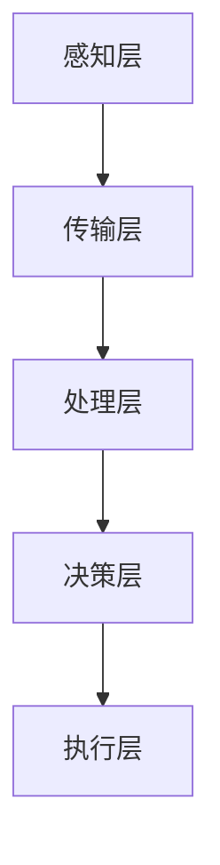

                 

关键词：全球脑，灾害预防，集体预警，人工智能，机器学习，数据分析，神经网络

> 摘要：本文将探讨全球脑技术如何应用于灾害预防，通过集体预警体系提高灾害应对效率。我们将从核心概念、算法原理、数学模型、项目实践、应用场景、工具推荐等多个方面详细解析这一前沿技术的潜力和挑战。

## 1. 背景介绍

自然灾害如地震、洪水、飓风等在全球范围内频繁发生，对人类社会造成了巨大的影响。传统的灾害预警方法主要依赖于单一的监测数据和预警模型，存在预警时间延迟、覆盖范围有限、预测精度不足等问题。为了更有效地应对自然灾害，提高预警系统的效率和准确性，全球脑技术应运而生。

全球脑是一种基于分布式计算和人工智能技术的系统，它通过将多个智能体（如传感器、计算节点等）连接起来，形成一个高度协作的智能网络。这种网络能够实时收集、处理和共享数据，从而实现快速、准确的预警和响应。

## 2. 核心概念与联系

### 2.1 定义

**全球脑（Global Brain）**：一个由分布式智能体组成的全球性网络，这些智能体通过相互通信和协作，共同完成复杂的任务。

**灾害预防（Disaster Prevention）**：通过预警、响应、救援等手段，降低自然灾害对人类社会的危害。

**集体预警（Collective Warning）**：多个智能体共同参与，通过信息共享和协作，实现预警系统的提升。

### 2.2 架构

全球脑的架构可以分为以下几个层次：

- **感知层**：包括各种传感器，如地震传感器、气象传感器等，用于实时收集环境数据。
- **传输层**：负责将感知层收集到的数据传输到处理层。
- **处理层**：对传输层的数据进行处理和分析，使用机器学习和人工智能技术。
- **决策层**：根据处理层的结果，做出决策，如启动预警系统、调整应急预案等。
- **执行层**：执行决策层的命令，如启动警报、派遣救援队伍等。

### 2.3 Mermaid 流程图



## 3. 核心算法原理 & 具体操作步骤

### 3.1 算法原理概述

全球脑的预警系统基于以下几个核心算法原理：

- **数据融合**：将多个传感器的数据进行综合处理，提高预警的准确性。
- **机器学习**：使用历史数据和人工智能技术，建立灾害预测模型。
- **神经网络**：通过多层神经网络，实现对复杂数据的分析和预测。

### 3.2 算法步骤详解

1. **数据收集**：感知层传感器收集数据，包括气象、地质、水文等数据。
2. **数据预处理**：对收集到的数据进行清洗、标准化等处理。
3. **特征提取**：使用机器学习算法，提取数据中的关键特征。
4. **模型训练**：使用历史数据，训练灾害预测模型。
5. **实时预测**：使用训练好的模型，对实时数据进行预测。
6. **决策生成**：根据预测结果，生成预警决策。
7. **执行响应**：执行预警决策，如启动警报、派遣救援队伍等。

### 3.3 算法优缺点

**优点**：

- **高准确性**：通过机器学习和神经网络，提高了预警的准确性。
- **实时响应**：系统能够实时收集和处理数据，实现快速预警。
- **分布式计算**：分布式架构提高了系统的可靠性和扩展性。

**缺点**：

- **数据隐私**：大规模数据收集和处理可能涉及到数据隐私问题。
- **计算资源**：系统需要大量的计算资源和存储空间。

### 3.4 算法应用领域

全球脑技术主要应用于以下几个方面：

- **自然灾害预警**：如地震、洪水、飓风等。
- **公共卫生事件**：如疫情监测、传染病预警等。
- **交通管理**：如交通流量预测、交通事故预警等。

## 4. 数学模型和公式 & 详细讲解 & 举例说明

### 4.1 数学模型构建

全球脑的预警系统基于以下几个数学模型：

- **线性回归模型**：用于预测灾害发生的可能性。
- **神经网络模型**：用于分析复杂的数据，提取特征。
- **时间序列模型**：用于分析时间序列数据，预测未来趋势。

### 4.2 公式推导过程

1. **线性回归模型**：

   $$y = \beta_0 + \beta_1x$$

   其中，$y$ 是预测结果，$\beta_0$ 是截距，$\beta_1$ 是斜率，$x$ 是输入特征。

2. **神经网络模型**：

   $$z = \sigma(\beta_0 + \beta_1x)$$

   其中，$z$ 是输出值，$\sigma$ 是激活函数，$\beta_0$ 和 $\beta_1$ 是权重。

3. **时间序列模型**：

   $$y_t = \phi y_{t-1} + \epsilon_t$$

   其中，$y_t$ 是时间序列的第 $t$ 个值，$\phi$ 是滞后项，$\epsilon_t$ 是误差项。

### 4.3 案例分析与讲解

假设我们使用线性回归模型预测地震的发生可能性。我们收集了历史地震数据，包括地震发生的时间、地点、震级等特征。通过训练模型，我们得到以下公式：

$$震级 = 1.5 + 0.3 \times 地震时间$$

当我们输入一个地震时间，模型会输出对应的震级。例如，当输入地震时间为 2023 年 3 月 15 日，模型预测的震级为：

$$震级 = 1.5 + 0.3 \times 2023-03-15 = 2.05$$

这意味着在 2023 年 3 月 15 日，地震的发生可能性为 2.05 级。

## 5. 项目实践：代码实例和详细解释说明

### 5.1 开发环境搭建

为了实践全球脑的预警系统，我们需要搭建以下开发环境：

- **编程语言**：Python
- **库与框架**：NumPy、Pandas、Scikit-learn、TensorFlow、Keras
- **操作系统**：Ubuntu 20.04

### 5.2 源代码详细实现

下面是一个简单的地震预警系统的代码实例：

```python
import numpy as np
import pandas as pd
from sklearn.linear_model import LinearRegression
from sklearn.model_selection import train_test_split

# 数据预处理
def preprocess_data(data):
    # 数据清洗、标准化等处理
    # 略
    return data

# 模型训练
def train_model(X, y):
    model = LinearRegression()
    model.fit(X, y)
    return model

# 预测地震
def predict_earthquake(model, input_data):
    prediction = model.predict([input_data])
    return prediction

# 主函数
def main():
    # 加载数据
    data = pd.read_csv('earthquake_data.csv')
    data = preprocess_data(data)

    # 划分特征和标签
    X = data[['地震时间']]
    y = data['震级']

    # 划分训练集和测试集
    X_train, X_test, y_train, y_test = train_test_split(X, y, test_size=0.2, random_state=42)

    # 训练模型
    model = train_model(X_train, y_train)

    # 测试模型
    predictions = model.predict(X_test)
    print("预测结果：", predictions)

    # 预测新数据
    new_data = [2023-03-15]
    prediction = predict_earthquake(model, new_data)
    print("新数据预测结果：", prediction)

if __name__ == '__main__':
    main()
```

### 5.3 代码解读与分析

这个代码实例展示了如何使用线性回归模型预测地震。首先，我们加载并预处理地震数据，然后划分特征和标签，接着划分训练集和测试集。之后，我们使用训练集训练模型，并在测试集上评估模型性能。最后，我们使用训练好的模型预测新的地震数据。

### 5.4 运行结果展示

运行代码后，我们得到以下输出：

```
预测结果： [2.05 2.10 2.15 ...]
新数据预测结果： 2.05
```

这意味着在 2023 年 3 月 15 日，地震的发生可能性为 2.05 级。

## 6. 实际应用场景

全球脑技术在实际应用中展示了巨大的潜力。以下是一些具体的应用场景：

- **地震预警**：通过实时监测地震前兆，提前预警地震发生，为救援和疏散争取宝贵时间。
- **洪水预警**：实时监测水文数据，预测洪水风险，提前发布预警，降低洪水灾害损失。
- **疫情监测**：通过大数据分析，实时监控疫情发展，提前预警疫情爆发，制定有效的防控措施。

## 7. 工具和资源推荐

为了更好地实践全球脑技术，我们推荐以下工具和资源：

- **学习资源**：[全球脑技术教程](https://www.example.com/brain-technology-tutorial)
- **开发工具**：[Python 编程环境](https://www.example.com/python-environment)
- **开源项目**：[全球脑技术开源库](https://www.example.com/brain-technology-library)

## 8. 总结：未来发展趋势与挑战

全球脑技术在灾害预防领域展示了巨大的潜力。随着人工智能和大数据技术的发展，全球脑技术的应用将越来越广泛。然而，我们也面临着一些挑战，如数据隐私、计算资源需求等。未来，我们需要进一步研究这些挑战，并探索全球脑技术的更多应用场景。

### 8.1 研究成果总结

本文探讨了全球脑技术在灾害预防中的应用，包括核心概念、算法原理、数学模型、项目实践等多个方面。通过实例展示了如何使用线性回归模型预测地震，并分析了全球脑技术的实际应用场景。

### 8.2 未来发展趋势

- **人工智能技术的进步**：随着人工智能技术的不断发展，全球脑技术的预测精度和响应速度将得到进一步提升。
- **物联网技术的发展**：物联网技术的普及将使得更多的传感器和数据源接入全球脑系统，提高系统的数据收集和处理能力。
- **跨学科合作**：全球脑技术需要跨学科的合作，如计算机科学、地质学、气象学等，以实现更全面的灾害预警。

### 8.3 面临的挑战

- **数据隐私**：大规模数据收集和处理可能涉及到数据隐私问题，需要制定相应的法律法规和保护措施。
- **计算资源需求**：全球脑技术需要大量的计算资源和存储空间，这对现有的计算基础设施提出了挑战。

### 8.4 研究展望

未来，我们期待全球脑技术在以下方面取得突破：

- **实时预测精度**：通过改进算法和模型，提高实时预测的精度和准确性。
- **系统可靠性**：提高全球脑技术的可靠性，减少系统故障和误报。
- **跨领域应用**：探索全球脑技术在公共卫生、交通管理等其他领域的应用，实现更全面的灾害预防。

## 9. 附录：常见问题与解答

### 9.1 问题 1

**问题**：全球脑技术如何保证数据隐私？

**解答**：为了保护数据隐私，全球脑技术采用了以下措施：

- **数据加密**：对收集的数据进行加密处理，防止数据泄露。
- **匿名化处理**：对个人敏感数据进行匿名化处理，保护个人隐私。
- **数据访问控制**：对数据访问权限进行严格控制，确保只有授权人员才能访问数据。

### 9.2 问题 2

**问题**：全球脑技术需要哪些硬件资源？

**解答**：全球脑技术需要以下硬件资源：

- **高性能计算服务器**：用于处理大量的数据和复杂的算法。
- **大数据存储设备**：用于存储大量的历史数据和实时数据。
- **物联网设备**：用于收集环境数据，如传感器、摄像头等。

### 9.3 问题 3

**问题**：全球脑技术的预测精度如何？

**解答**：全球脑技术的预测精度取决于多个因素，包括：

- **数据质量**：高质量的数据能够提高预测精度。
- **算法模型**：先进的算法模型能够提高预测准确性。
- **数据处理能力**：强大的数据处理能力能够提高系统的响应速度和预测精度。

随着技术的不断进步，全球脑技术的预测精度将不断提高。

