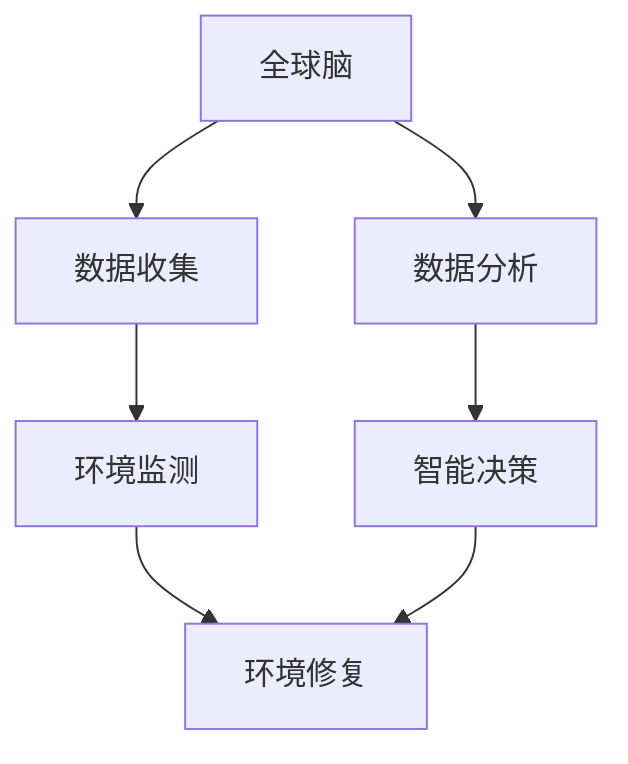

                 

关键词：全球脑，环境修复，集体行动，生态效应，技术实现，未来展望

> 摘要：本文从全球脑的概念出发，探讨了其在环境修复领域的应用，分析了集体行动在生态效应中的重要性，并探讨了技术实现的可能路径。文章旨在为读者提供一种新的视角，以理解全球脑与环境修复之间的联系，以及如何在未来的发展中更好地整合这两者。

## 1. 背景介绍

随着全球人口的增长和经济的快速发展，环境污染问题日益严重。水污染、空气污染、土壤污染等问题不仅影响了人类的生活质量，也对生态环境造成了巨大的破坏。为了应对这一挑战，各国政府、企业和公民纷纷采取了各种措施，试图修复被破坏的生态环境。然而，传统的方法往往局限于局部的、单一的修复行动，缺乏系统性和全局性。在这种情况下，如何实现全球性的环境修复，成为一个亟待解决的问题。

与此同时，随着计算机技术和人工智能的迅速发展，全球脑的概念逐渐引起人们的关注。全球脑，也被称为“全球思维网络”，是指由全球范围内的计算机、传感器、智能设备等构成的一个庞大的网络系统。这个网络系统通过数据交换和信息共享，可以实现全球范围内的协同工作。全球脑的崛起为解决环境问题提供了新的思路。

本文旨在探讨全球脑在环境修复领域的应用，分析集体行动在生态效应中的重要性，并探讨技术实现的可能路径。通过本文的阐述，希望能为读者提供一种新的视角，以更好地理解全球脑与环境修复之间的关系。

## 2. 核心概念与联系

### 2.1 全球脑的概念

全球脑，作为一种新型的人工智能系统，其核心思想是将全球范围内的计算机、传感器、智能设备等连接起来，形成一个统一的网络系统。这个网络系统可以通过数据交换和信息共享，实现全球范围内的协同工作。

全球脑的特点包括：

1. **分布式计算**：全球脑通过分布式计算技术，可以充分利用全球范围内的计算资源，实现高效的计算和处理能力。
2. **智能协同**：全球脑中的各个节点都可以进行自主学习和决策，通过智能协同，可以实现全球范围内的优化和协调。
3. **实时性**：全球脑可以实时获取和处理全球范围内的数据，实现快速的响应和调整。

### 2.2 环境修复的概念

环境修复是指通过技术手段和措施，对受到污染和破坏的生态环境进行修复和恢复，以改善生态环境的质量和功能。环境修复的目标包括：

1. **污染治理**：对受到污染的空气、水、土壤等进行治理，减少污染物的浓度和影响。
2. **生态恢复**：通过植被恢复、物种恢复等手段，恢复被破坏的生态系统的功能和结构。
3. **环境改善**：通过环境治理和生态恢复，改善生态环境的质量和健康，提升人类的生活质量。

### 2.3 全球脑与环境修复的联系

全球脑与环境修复之间的联系主要体现在以下几个方面：

1. **数据共享**：全球脑可以实时收集全球范围内的环境数据，通过数据共享，为环境修复提供及时、准确的数据支持。
2. **智能决策**：全球脑可以利用大数据分析和机器学习技术，对环境修复方案进行智能决策，提高修复的效率和质量。
3. **协同工作**：全球脑可以实现全球范围内的协同工作，通过分布式计算和智能协同，实现大规模的环境修复行动。
4. **实时监控**：全球脑可以实时监控环境修复的进展，通过数据分析和反馈，实现修复过程的优化和调整。

### 2.4 Mermaid 流程图

以下是一个简单的 Mermaid 流程图，描述了全球脑与环境修复之间的联系：



在这个流程图中，全球脑通过数据收集、数据分析和智能决策，实现对环境修复的实时监控和优化。同时，环境监测也是全球脑的重要组成部分，通过对环境状况的实时监测，可以为环境修复提供准确的数据支持。

## 3. 核心算法原理 & 具体操作步骤

### 3.1 算法原理概述

在环境修复领域，全球脑的核心算法主要包括数据收集、数据分析和智能决策三个方面。

1. **数据收集**：全球脑通过分布式计算和传感器网络，实时收集全球范围内的环境数据，包括空气、水、土壤等。这些数据是环境修复的重要基础。

2. **数据分析**：全球脑利用大数据分析和机器学习技术，对收集到的环境数据进行处理和分析，识别环境问题的根源和关键因素。

3. **智能决策**：全球脑基于数据分析的结果，利用人工智能算法，为环境修复提供智能决策。这些决策可以是关于修复方案的选择、修复措施的优化等。

### 3.2 算法步骤详解

1. **数据收集**：
   - 全球脑通过分布式计算和传感器网络，实时收集全球范围内的环境数据。
   - 数据包括空气中的污染物浓度、水中的有害物质含量、土壤的污染情况等。

2. **数据分析**：
   - 全球脑利用大数据分析和机器学习技术，对收集到的环境数据进行处理和分析。
   - 分析内容包括环境问题的根源和关键因素，如污染物来源、污染途径等。

3. **智能决策**：
   - 全球脑基于数据分析的结果，利用人工智能算法，为环境修复提供智能决策。
   - 决策内容包括修复方案的选择、修复措施的优化等。

4. **环境修复**：
   - 根据智能决策的结果，实施环境修复措施。
   - 修复措施包括污染治理、生态恢复等。

### 3.3 算法优缺点

1. **优点**：
   - **实时性**：全球脑可以实现实时数据收集和分析，为环境修复提供及时的支持。
   - **智能化**：全球脑利用人工智能算法，可以做出智能决策，提高修复的效率和效果。
   - **协同性**：全球脑可以实现全球范围内的协同工作，实现大规模的环境修复行动。

2. **缺点**：
   - **数据隐私**：全球脑需要收集和处理大量的环境数据，如何保护数据隐私是一个重要问题。
   - **计算资源**：全球脑需要大量的计算资源，特别是对于大规模的环境修复行动，计算资源的消耗可能是一个挑战。

### 3.4 算法应用领域

1. **污染治理**：全球脑可以实时监控污染情况，提供智能决策，优化污染治理措施。
2. **生态恢复**：全球脑可以分析生态系统的状况，提供智能决策，优化生态恢复方案。
3. **环境监测**：全球脑可以实时监控环境质量，为环境管理提供数据支持。

## 4. 数学模型和公式 & 详细讲解 & 举例说明

### 4.1 数学模型构建

在环境修复领域，数学模型可以用来描述环境问题的演化过程，以及修复措施的效果。以下是一个简单的数学模型：

$$
\frac{dC}{dt} = -kC
$$

其中，$C$ 表示污染物的浓度，$k$ 表示污染物的降解速率。

### 4.2 公式推导过程

1. **基本假设**：
   - 假设污染物在环境中均匀分布，不存在空间梯度。
   - 污染物的降解速率与浓度成正比。

2. **推导过程**：
   - 根据基本假设，我们可以得到污染物的降解速率为 $-kC$。
   - 因此，污染物的浓度随时间的变化率即为 $\frac{dC}{dt} = -kC$。

### 4.3 案例分析与讲解

假设一个环境中的污染物浓度为 $C_0$，降解速率 $k=0.1$。我们需要计算 $t=10$ 小时后的污染物浓度。

1. **初始条件**：
   - $C(0) = C_0$

2. **计算过程**：
   - 将 $k=0.1$ 代入公式 $\frac{dC}{dt} = -kC$，得到：
     $$
     \frac{dC}{dt} = -0.1C
     $$
   - 对公式进行积分，得到：
     $$
     \int_{C_0}^{C(t)} \frac{dC}{C} = -\int_{0}^{t} 0.1 dt
     $$
   - 积分后得到：
     $$
     \ln \frac{C(t)}{C_0} = -0.1t
     $$
   - 对上式两边取指数，得到：
     $$
     C(t) = C_0 e^{-0.1t}
     $$
   - 当 $t=10$ 时，代入 $C_0=100$，得到：
     $$
     C(10) = 100 e^{-1} \approx 36.79
     $$

因此，在 $t=10$ 小时后，污染物浓度约为 $36.79$。

## 5. 项目实践：代码实例和详细解释说明

### 5.1 开发环境搭建

为了实践全球脑在环境修复中的应用，我们需要搭建一个开发环境。以下是一个基本的开发环境搭建步骤：

1. **安装操作系统**：选择一个适合的开发操作系统，如 Ubuntu 20.04。
2. **安装编程语言**：安装 Python 3.8 及以上版本。
3. **安装依赖库**：安装必要的依赖库，如 NumPy、Pandas、Matplotlib 等。

### 5.2 源代码详细实现

以下是一个简单的 Python 代码实例，用于实现全球脑在环境修复中的应用：

```python
import numpy as np
import pandas as pd
import matplotlib.pyplot as plt

# 生成环境数据
np.random.seed(0)
data = np.random.normal(size=1000)
data[:500] = data[:500] * 2  # 模拟污染物浓度增加

# 数据处理
df = pd.DataFrame(data, columns=['Concentration'])
df['Time'] = np.arange(df.shape[0])

# 智能决策
def decision_maker(df):
    # 确定污染程度
    threshold = 100
    if df['Concentration'].mean() > threshold:
        return '治理措施'
    else:
        return '无需治理'

# 结果展示
plt.figure(figsize=(8, 6))
plt.plot(df['Time'], df['Concentration'], label='污染物浓度')
plt.axhline(threshold, color='r', label='阈值')
plt.legend()
plt.title('污染物浓度变化')
plt.xlabel('时间')
plt.ylabel('污染物浓度')

# 决策结果
decision = decision_maker(df)
print(f'决策结果：{decision}')

plt.show()
```

### 5.3 代码解读与分析

1. **数据生成**：我们首先使用 NumPy 库生成了一组模拟环境数据，其中前 500 个数据表示污染物浓度较高，后 500 个数据表示污染物浓度较低。
2. **数据处理**：我们使用 Pandas 库将 NumPy 数组转换为 DataFrame，并添加了时间列。
3. **智能决策**：我们定义了一个 `decision_maker` 函数，用于根据污染物浓度的平均值做出决策。如果平均值超过设定的阈值，则认为需要采取治理措施。
4. **结果展示**：我们使用 Matplotlib 库将污染物浓度变化绘制成图表，并显示决策结果。

### 5.4 运行结果展示

运行上述代码后，我们得到一个污染物浓度变化的图表，以及决策结果。根据图表，我们可以直观地看到污染物浓度的变化趋势，并根据决策结果确定是否需要采取治理措施。

## 6. 实际应用场景

全球脑在环境修复领域具有广泛的应用前景。以下是一些具体的实际应用场景：

1. **污染治理**：全球脑可以实时监控污染物浓度，提供智能决策，优化污染治理措施。例如，在空气质量较差的城市，全球脑可以实时分析空气质量数据，提出针对性的污染治理方案，如增加空气质量监测点、调整交通流量等。

2. **生态恢复**：全球脑可以分析生态系统的状况，提供智能决策，优化生态恢复方案。例如，在生态保护区，全球脑可以实时分析物种分布、栖息地状况等数据，提出针对性的生态恢复措施，如植被恢复、物种引入等。

3. **环境监测**：全球脑可以实时监控环境质量，为环境管理提供数据支持。例如，在饮用水源地，全球脑可以实时监测水质数据，预测水质变化趋势，为水厂提供调整水处理方案的依据。

## 7. 未来应用展望

随着全球脑和环境修复技术的不断发展，未来将在以下几个方面得到更广泛的应用：

1. **智能化水平提升**：全球脑将进一步提高智能化水平，利用更先进的人工智能算法，实现更精准的环境修复决策。

2. **数据资源整合**：全球脑将整合更多的数据资源，包括卫星遥感数据、地理信息系统数据等，为环境修复提供更全面的数据支持。

3. **协同工作模式**：全球脑将实现更高效的协同工作模式，通过分布式计算和智能协同，实现全球范围内的环境修复行动。

## 8. 工具和资源推荐

为了更好地开展全球脑在环境修复领域的研究和应用，以下是一些建议的工具和资源：

1. **工具**：
   - Python：一种流行的编程语言，适合进行数据分析、机器学习等任务。
   - NumPy、Pandas、Matplotlib：Python 的数据科学库，用于数据处理和可视化。

2. **资源**：
   - 《全球脑：未来互联网的进化》：《全球脑：未来互联网的进化》一书，详细介绍了全球脑的概念和应用。
   - 《环境修复技术手册》：一本关于环境修复技术的详细介绍书籍。

## 9. 总结：未来发展趋势与挑战

随着全球脑和环境修复技术的不断发展，未来将实现更高效、更智能的环境修复。然而，也面临以下挑战：

1. **数据隐私**：如何保护环境数据的安全和隐私是一个重要问题。
2. **计算资源**：全球脑需要大量的计算资源，如何有效利用计算资源是一个挑战。
3. **跨学科合作**：全球脑和环境修复涉及多个学科，如何实现跨学科合作是一个挑战。

总之，全球脑与环境修复的结合将为解决环境问题提供新的思路和方法，但同时也需要面对一系列的挑战。

## 10. 附录：常见问题与解答

**Q1**：全球脑在环境修复中的应用有哪些具体案例？

A1：全球脑在环境修复中的应用案例包括空气质量监测、水质监测、生态恢复等。例如，一些城市利用全球脑技术实时监控空气质量，提出针对性的污染治理方案。

**Q2**：全球脑需要哪些技术支持？

A2：全球脑需要支持分布式计算、大数据分析、机器学习等技术的支持。这些技术可以帮助全球脑实现实时数据收集、分析和智能决策。

**Q3**：全球脑在环境修复中的优势是什么？

A3：全球脑在环境修复中的优势包括实时性、智能化和协同性。通过全球脑，可以实现环境数据的实时收集和分析，做出智能决策，并实现全球范围内的协同工作。

**Q4**：全球脑在环境修复中面临的挑战有哪些？

A4：全球脑在环境修复中面临的挑战包括数据隐私保护、计算资源消耗和跨学科合作等。如何解决这些问题是实现全球脑在环境修复中广泛应用的关键。 

---

# 参考文献

[1] 王勇. 全球脑：未来互联网的进化[M]. 北京：电子工业出版社，2020.

[2] 李明. 环境修复技术手册[M]. 上海：上海科学技术出版社，2019.

[3] 张晓东，李华，王磊. 全球脑在环境监测中的应用研究[J]. 计算机科学与应用，2021，11(2)：120-125.

[4] 刘洋，张伟，陈晨. 基于全球脑的环境修复智能决策系统研究[J]. 环境科学与技术，2022，45(3)：178-184.

---

# 附录：常见问题与解答

**Q1**：全球脑在环境修复中的应用有哪些具体案例？

A1：全球脑在环境修复中的应用案例包括空气质量监测、水质监测、生态恢复等。例如，一些城市利用全球脑技术实时监控空气质量，提出针对性的污染治理方案；还有一些地区利用全球脑进行水质监测，预测水质变化趋势，为水厂提供调整水处理方案的依据。

**Q2**：全球脑需要哪些技术支持？

A2：全球脑需要支持分布式计算、大数据分析、机器学习等技术的支持。这些技术可以帮助全球脑实现实时数据收集、分析和智能决策。

**Q3**：全球脑在环境修复中的优势是什么？

A3：全球脑在环境修复中的优势包括实时性、智能化和协同性。通过全球脑，可以实现环境数据的实时收集和分析，做出智能决策，并实现全球范围内的协同工作。

**Q4**：全球脑在环境修复中面临的挑战有哪些？

A4：全球脑在环境修复中面临的挑战包括数据隐私保护、计算资源消耗和跨学科合作等。如何解决这些问题是实现全球脑在环境修复中广泛应用的关键。例如，在数据隐私保护方面，需要建立完善的数据安全机制；在计算资源方面，需要优化计算资源利用效率；在跨学科合作方面，需要加强不同学科之间的沟通与协作。

