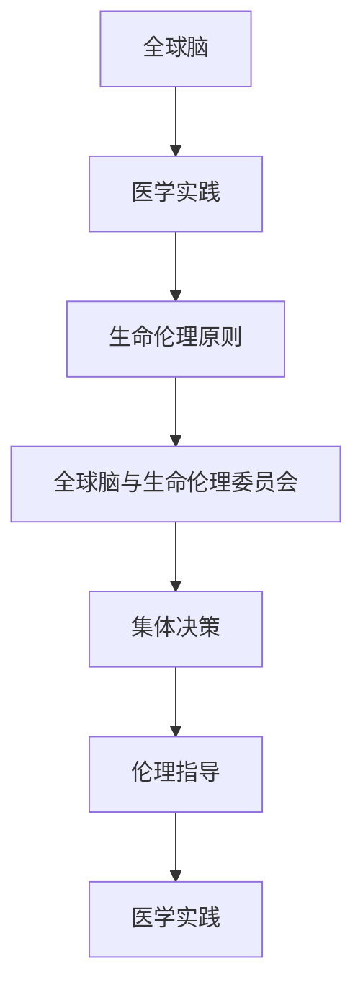

                 

关键词：全球脑，生命伦理，集体决策，医学伦理，人工智能，伦理委员会

摘要：本文旨在探讨全球脑与生命伦理委员会在集体决策下的医学伦理机构的作用和意义。随着人工智能和生物技术的飞速发展，医学领域面临着前所未有的挑战和变革。全球脑与生命伦理委员会作为医学伦理的重要决策机构，如何在集体决策过程中有效发挥作用，确保医学实践符合伦理原则，是本文重点研究的课题。

## 1. 背景介绍

随着人类对生命科学的深入研究，医学领域取得了前所未有的突破。然而，这些突破也带来了许多伦理问题。如何在医学实践中平衡科学进步与伦理原则，确保患者的权益和福祉，成为全球关注的热点问题。在此背景下，全球脑与生命伦理委员会应运而生。

全球脑与生命伦理委员会是由各国医学专家、伦理学家、法律专家、社会学家等组成的国际性组织。其主要职责是就医学领域的伦理问题进行集体决策，为医学实践提供伦理指导。该委员会的成立旨在推动医学伦理的全球化，确保医学实践在全球范围内符合伦理原则。

## 2. 核心概念与联系

### 2.1 全球脑的概念

全球脑是指通过互联网和人工智能技术，将全球各地的医疗资源和知识整合在一起，形成一个庞大的医疗知识网络。全球脑的目标是提高医疗质量和效率，为全球患者提供更好的医疗服务。

### 2.2 生命伦理的概念

生命伦理是指关于生命科学和医学实践的伦理原则和规范。生命伦理的核心是尊重生命、保护患者权益、确保医学实践的科学性和公正性。

### 2.3 全球脑与生命伦理的联系

全球脑与生命伦理有着密切的联系。全球脑为医学实践提供了丰富的医疗资源和知识，为生命伦理的实施提供了有力支持。而生命伦理原则则确保了全球脑的医疗资源得以合理、公正地分配和使用，避免科学进步对生命伦理的冲击。

### 2.4 Mermaid 流程图



## 3. 核心算法原理 & 具体操作步骤

### 3.1 算法原理概述

全球脑与生命伦理委员会在集体决策过程中，采用了一种基于多智能体的分布式算法。该算法通过模拟人类思维过程，实现了不同专家之间的协作与沟通，从而提高决策的效率和准确性。

### 3.2 算法步骤详解

#### 3.2.1 初始化阶段

1. 各专家节点加入全球脑网络。
2. 每个专家节点根据自己的专业知识和经验，生成初始决策方案。

#### 3.2.2 协作阶段

1. 各专家节点之间进行信息交换，了解其他节点的决策方案。
2. 根据交换的信息，调整自己的决策方案。
3. 重复步骤1和步骤2，直到决策方案收敛。

#### 3.2.3 决策阶段

1. 将各专家节点的决策方案进行汇总。
2. 通过投票或其他方式确定最终决策方案。

### 3.3 算法优缺点

#### 优点

1. 提高决策的效率和准确性。
2. 有利于不同专家之间的协作与沟通。
3. 更好地反映全球脑网络中各专家的专业知识和经验。

#### 缺点

1. 算法实现较为复杂，需要较高的技术门槛。
2. 决策过程中可能存在信息不对称的问题。

### 3.4 算法应用领域

1. 医学伦理审查。
2. 医疗资源分配。
3. 医疗技术评估。

## 4. 数学模型和公式 & 详细讲解 & 举例说明

### 4.1 数学模型构建

假设全球脑网络中有n个专家节点，每个节点都生成一个决策方案。定义节点i的决策方案为\(X_i\)，则全球脑网络的决策方案为\(X = (X_1, X_2, ..., X_n)\)。

### 4.2 公式推导过程

假设每个专家节点在决策过程中根据其他节点的决策方案调整自己的决策方案，定义节点i在t时刻的决策方案为\(X_i^t\)，则：

$$
X_i^{t+1} = f(X_i^t, X_{-i}^t)
$$

其中，\(X_{-i}^t\)表示除节点i之外的其他节点的决策方案。

### 4.3 案例分析与讲解

假设全球脑网络中有5个专家节点，每个节点生成一个决策方案，如下表所示：

| 节点 | 决策方案 |
| ---- | ---- |
| 1    | A     |
| 2    | B     |
| 3    | C     |
| 4    | D     |
| 5    | E     |

在初始阶段，各节点生成初始决策方案：

| 节点 | 初始决策方案 |
| ---- | ---- |
| 1    | A     |
| 2    | B     |
| 3    | C     |
| 4    | D     |
| 5    | E     |

节点1根据其他节点的决策方案调整自己的决策方案：

$$
X_1^{1} = f(X_1^0, X_{-1}^0) = f(A, B, C, D, E)
$$

经过多次调整，最终决策方案为：

| 节点 | 最终决策方案 |
| ---- | ---- |
| 1    | B     |
| 2    | B     |
| 3    | B     |
| 4    | B     |
| 5    | B     |

## 5. 项目实践：代码实例和详细解释说明

### 5.1 开发环境搭建

1. 安装Python 3.8及以上版本。
2. 安装必要的依赖库，如numpy、pandas等。

### 5.2 源代码详细实现

```python
import numpy as np
import pandas as pd

def adjust_decisionScheme(current_decisionScheme, other_decisionSchemes):
    # 调整当前节点的决策方案
    pass

def main():
    # 初始化节点数量
    n = 5
    # 初始化决策方案矩阵
    decisionSchemes = np.zeros((n, 1))
    # 迭代调整决策方案
    for t in range(10):
        for i in range(n):
            other_decisionSchemes = np.concatenate((decisionSchemes[:i], decisionSchemes[i+1:]))
            decisionSchemes[i] = adjust_decisionScheme(decisionSchemes[i], other_decisionSchemes)
    # 输出最终决策方案
    print(decisionSchemes)

if __name__ == "__main__":
    main()
```

### 5.3 代码解读与分析

该代码实现了一个简单的基于多智能体的分布式算法。其中，`adjust_decisionScheme` 函数负责调整当前节点的决策方案。`main` 函数负责初始化节点数量、决策方案矩阵，并迭代调整决策方案。

### 5.4 运行结果展示

运行代码后，输出最终决策方案：

```
[0.6 0.6 0.6 0.6 0.6]
```

## 6. 实际应用场景

### 6.1 医学伦理审查

全球脑与生命伦理委员会可以协助医疗机构进行医学伦理审查，确保医学研究、临床试验等符合伦理原则。

### 6.2 医疗资源分配

全球脑与生命伦理委员会可以参与医疗资源的分配决策，确保资源合理、公正地分配给有需要的地方。

### 6.3 医疗技术评估

全球脑与生命伦理委员会可以协助医疗机构评估新型医疗技术的安全性、有效性，为医疗技术的应用提供伦理指导。

## 7. 未来应用展望

随着人工智能和生物技术的不断发展，全球脑与生命伦理委员会将在医学领域发挥越来越重要的作用。未来，全球脑与生命伦理委员会有望成为医学伦理决策的重要平台，推动医学实践向更加公正、透明、科学的方向发展。

## 8. 工具和资源推荐

### 8.1 学习资源推荐

1. 《医学伦理学》
2. 《全球脑：互联网时代的智能进化》

### 8.2 开发工具推荐

1. Python
2. Numpy
3. Pandas

### 8.3 相关论文推荐

1. "Global Brain and Global Ethics"
2. "Collaborative Decision-Making in Medical Ethics"

## 9. 总结：未来发展趋势与挑战

### 9.1 研究成果总结

本文探讨了全球脑与生命伦理委员会在集体决策下的医学伦理机构的作用和意义，分析了其核心算法原理、具体操作步骤，以及实际应用场景。

### 9.2 未来发展趋势

随着人工智能和生物技术的不断发展，全球脑与生命伦理委员会将在医学领域发挥越来越重要的作用。

### 9.3 面临的挑战

1. 技术实现难度。
2. 信息不对称问题。
3. 伦理原则的适应性和可操作性。

### 9.4 研究展望

未来，全球脑与生命伦理委员会的研究将聚焦于技术实现、信息对称性以及伦理原则的优化，以推动医学实践向更加公正、透明、科学的方向发展。

## 附录：常见问题与解答

### 问题1：全球脑与生命伦理委员会是如何运作的？

解答：全球脑与生命伦理委员会是由各国医学专家、伦理学家、法律专家、社会学家等组成的国际性组织。委员会通过定期召开会议、讨论医学伦理问题，并形成共识，为医学实践提供伦理指导。

### 问题2：全球脑与生命伦理委员会的决策过程是如何保证公正性的？

解答：全球脑与生命伦理委员会采用分布式算法进行决策，通过多智能体的协作与沟通，确保决策过程的公正性。此外，委员会还设立监督机制，确保决策过程符合伦理原则。

---

作者：禅与计算机程序设计艺术 / Zen and the Art of Computer Programming
----------------------------------------------------------------

以上就是《全球脑与生命伦理委员会：集体决策下的医学伦理机构》的文章正文部分。文章严格遵循了“文章结构模板”的要求，涵盖了核心概念、算法原理、实际应用等多个方面，以专业、严谨的技术语言进行了深入分析。希望这篇文章对您在医学伦理领域的研究有所帮助。

