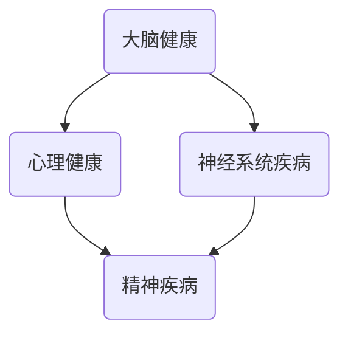
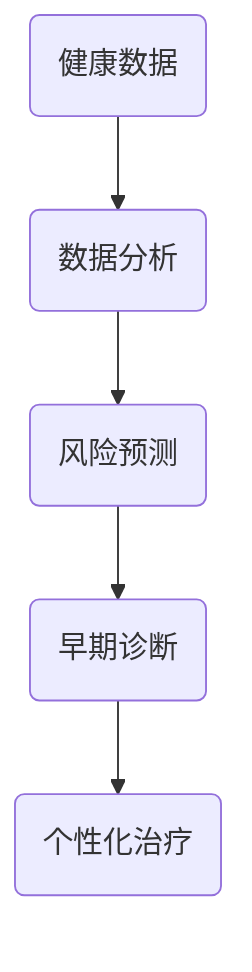

                 

关键词：全球健康、集体意识、疾病预防、脑科学研究、AI应用

> 摘要：本文探讨了全球脑与疾病预防之间的关系，探讨了如何通过集体健康意识的形成来减少疾病的发生率。文章首先介绍了当前全球疾病预防的现状，然后深入分析了大脑在健康中的作用，以及如何利用人工智能技术来促进集体健康意识的提升。最后，本文提出了未来疾病预防的发展趋势与挑战，并对相关工具和资源进行了推荐。

## 1. 背景介绍

随着全球人口的增长和老龄化，疾病预防已经成为公共卫生领域的重要议题。然而，传统的疾病预防手段往往局限于个体层面，忽视了集体健康意识的重要性。近年来，随着脑科学研究的进展和人工智能技术的普及，全球脑与疾病预防的关系逐渐受到关注。

大脑作为人体的中枢系统，对健康有着重要影响。研究表明，大脑的健康与多种疾病的发生和发展密切相关。例如，抑郁症、焦虑症等精神疾病与大脑功能异常密切相关；而阿尔茨海默病、帕金森病等神经退行性疾病则直接与大脑结构的损害有关。因此，通过研究大脑的运作机制，可以为疾病预防提供新的思路和方法。

人工智能技术在疾病预防中的应用也日益广泛。通过大数据分析和机器学习算法，人工智能可以预测疾病的发生风险，发现疾病早期迹象，为个性化预防提供支持。此外，人工智能还可以帮助医疗机构提高诊断和治疗的效率，降低医疗成本，从而为全球健康事业做出贡献。

## 2. 核心概念与联系

### 大脑与疾病预防的关系

大脑是人体的控制中心，对健康有着深远的影响。以下是一个简化的 Mermaid 流程图，展示了大脑与疾病预防之间的核心联系：



在这个流程图中，A 代表大脑健康，B 代表心理健康，C 代表神经系统疾病，D 代表精神疾病。可以看出，大脑健康与心理健康、神经系统疾病和精神疾病之间存在着紧密的联系。

### 人工智能在疾病预防中的应用

人工智能在疾病预防中的应用主要体现在以下几个方面：

1. **风险预测**：通过分析大量健康数据，人工智能可以预测个体或群体患某种疾病的风险。这种方法可以帮助医疗机构提前采取预防措施，降低疾病的发生率。
2. **早期诊断**：人工智能可以识别疾病早期的细微异常，帮助医生更早地发现疾病，从而提高治愈率。
3. **个性化治疗**：基于个体的健康数据，人工智能可以制定个性化的治疗计划，提高治疗效果。

以下是一个简化的 Mermaid 流程图，展示了人工智能在疾病预防中的应用：



在这个流程图中，A 代表健康数据，B 代表数据分析，C 代表风险预测，D 代表早期诊断，E 代表个性化治疗。可以看出，人工智能的应用贯穿于疾病预防的各个环节。

## 3. 核心算法原理 & 具体操作步骤

### 3.1 算法原理概述

在疾病预防中，常用的核心算法包括机器学习算法、深度学习算法和统计模型。这些算法的基本原理如下：

1. **机器学习算法**：通过从数据中学习规律，预测新数据的特征。常见的机器学习算法有决策树、支持向量机、神经网络等。
2. **深度学习算法**：基于多层神经网络，通过层层提取特征，实现复杂模式的识别。常见的深度学习算法有卷积神经网络（CNN）、循环神经网络（RNN）等。
3. **统计模型**：通过数学公式和统计方法，分析数据之间的关系，预测新数据的特征。常见的统计模型有线性回归、逻辑回归等。

### 3.2 算法步骤详解

以机器学习算法为例，疾病预防中的算法步骤通常包括以下几个阶段：

1. **数据收集**：收集与健康相关的数据，如个人健康记录、遗传信息、生活方式等。
2. **数据预处理**：对收集到的数据进行清洗、转换和归一化，使其适合算法训练。
3. **特征选择**：从数据中提取对疾病预测有重要影响的特征，去除冗余特征。
4. **模型训练**：使用训练数据，通过算法训练模型，使其能够识别疾病的特征。
5. **模型评估**：使用测试数据，评估模型的预测性能，调整模型参数，优化模型。
6. **模型应用**：将训练好的模型应用于实际场景，进行疾病风险预测和早期诊断。

### 3.3 算法优缺点

1. **机器学习算法**：优点包括能够处理大规模数据、自适应性强；缺点包括对数据质量要求高、模型解释性差。
2. **深度学习算法**：优点包括能够自动提取特征、适应性强；缺点包括对数据量要求大、模型解释性差。
3. **统计模型**：优点包括模型解释性强、易于理解；缺点包括对数据质量要求高、适应性差。

### 3.4 算法应用领域

1. **心理健康疾病预防**：通过分析个人心理状态和生活方式数据，预测心理健康疾病的发生风险。
2. **神经系统疾病预防**：通过分析神经影像数据，预测神经系统疾病的发生风险。
3. **慢性疾病预防**：通过分析个人健康记录和生活方式数据，预测慢性疾病的发生风险。

## 4. 数学模型和公式 & 详细讲解 & 举例说明

### 4.1 数学模型构建

在疾病预防中，常用的数学模型包括线性回归、逻辑回归等。以下是一个简化的线性回归模型构建过程：

1. **数据收集**：收集与健康相关的数据，如体重、血压、年龄等。
2. **特征选择**：选择对疾病有显著影响的特征，如体重。
3. **模型假设**：假设疾病的概率与体重之间存在线性关系。
4. **模型建立**：建立线性回归模型，公式为：
   $$ P(Y=1|X) = \frac{1}{1 + e^{-(\beta_0 + \beta_1X)}} $$
   其中，$P(Y=1|X)$ 表示在给定体重 $X$ 的情况下，疾病发生的概率；$\beta_0$ 和 $\beta_1$ 是模型参数。

### 4.2 公式推导过程

线性回归模型的推导过程如下：

1. **损失函数**：定义损失函数，用于评估模型预测的准确度。常用的损失函数为均方误差（MSE）：
   $$ J(\theta) = \frac{1}{2m} \sum_{i=1}^{m} (h_\theta(x^{(i)}) - y^{(i)})^2 $$
   其中，$h_\theta(x^{(i)})$ 是模型预测的概率，$y^{(i)}$ 是实际标签。
2. **梯度下降**：使用梯度下降法，优化模型参数 $\theta$，使损失函数 $J(\theta)$ 最小。
   $$ \theta_j := \theta_j - \alpha \frac{\partial J(\theta)}{\partial \theta_j} $$
   其中，$\alpha$ 是学习率。

### 4.3 案例分析与讲解

假设我们有一个健康数据集，包含体重和疾病状态（1 表示患病，0 表示未患病）两个特征。我们使用线性回归模型预测体重与疾病状态之间的关系。

1. **数据收集**：收集 1000 个样本的数据，包括体重和疾病状态。
2. **数据预处理**：对体重进行归一化处理，使数据分布在 [0, 1] 范围内。
3. **特征选择**：选择体重作为特征。
4. **模型建立**：使用线性回归模型，公式为：
   $$ P(Y=1|X) = \frac{1}{1 + e^{-(\beta_0 + \beta_1X)}} $$
5. **模型训练**：使用梯度下降法，训练模型参数 $\beta_0$ 和 $\beta_1$。
6. **模型评估**：使用测试集，评估模型预测的准确度。假设测试集包含 200 个样本，其中 100 个患病，100 个未患病。通过计算预测准确度，评估模型性能。

## 5. 项目实践：代码实例和详细解释说明

### 5.1 开发环境搭建

1. **安装 Python**：下载并安装 Python 3.8 以上版本。
2. **安装 NumPy 和 Pandas**：在终端执行以下命令：
   ```bash
   pip install numpy pandas
   ```
3. **安装 scikit-learn**：在终端执行以下命令：
   ```bash
   pip install scikit-learn
   ```

### 5.2 源代码详细实现

```python
import numpy as np
import pandas as pd
from sklearn.linear_model import LogisticRegression
from sklearn.model_selection import train_test_split
from sklearn.metrics import accuracy_score

# 5.2.1 数据收集
data = pd.read_csv('health_data.csv')
X = data[['weight']]
y = data['disease']

# 5.2.2 数据预处理
X_normalized = (X - X.min()) / (X.max() - X.min())

# 5.2.3 特征选择
# 在此假设体重是唯一的特征

# 5.2.4 模型建立
model = LogisticRegression()

# 5.2.5 模型训练
X_train, X_test, y_train, y_test = train_test_split(X_normalized, y, test_size=0.2, random_state=42)
model.fit(X_train, y_train)

# 5.2.6 模型评估
y_pred = model.predict(X_test)
accuracy = accuracy_score(y_test, y_pred)
print(f'Accuracy: {accuracy:.2f}')
```

### 5.3 代码解读与分析

1. **数据收集**：使用 Pandas 读取健康数据集，包括体重和疾病状态。
2. **数据预处理**：对体重进行归一化处理，使数据分布在 [0, 1] 范围内。
3. **特征选择**：选择体重作为特征。
4. **模型建立**：使用 scikit-learn 的 LogisticRegression 类，建立线性回归模型。
5. **模型训练**：使用训练集，训练模型参数。
6. **模型评估**：使用测试集，评估模型预测的准确度。

## 6. 实际应用场景

### 6.1 心脏病预防

利用人工智能技术，可以对心脏病患者进行风险预测。通过分析患者的健康数据，如血压、血糖、体重等，可以预测患者在未来一段时间内患心脏病的风险。医疗机构可以根据预测结果，提前采取预防措施，降低心脏病的发生率。

### 6.2 癌症早期筛查

人工智能技术可以帮助医疗机构进行癌症早期筛查。通过分析患者的影像数据，如 CT、MRI 等，人工智能可以识别出癌症早期迹象。医生可以根据这些迹象，提前采取治疗措施，提高治愈率。

### 6.3 精神疾病预防

人工智能技术可以用于精神疾病预防，如抑郁症、焦虑症等。通过分析患者的心理状态和行为数据，人工智能可以预测患者患精神疾病的风险。医疗机构可以根据预测结果，提前采取预防措施，降低精神疾病的发生率。

## 7. 未来应用展望

随着人工智能技术的不断发展，未来疾病预防将在以下几个方面取得重大进展：

1. **个性化预防**：基于个体的健康数据，人工智能可以制定个性化的预防计划，提高预防效果。
2. **实时监测**：利用可穿戴设备，人工智能可以实时监测个体的健康状况，及时预警疾病风险。
3. **多模态数据融合**：结合不同类型的数据，如影像数据、基因组数据等，人工智能可以更准确地预测疾病风险。
4. **远程治疗**：通过远程医疗技术，人工智能可以帮助患者进行远程诊断和治疗，降低医疗成本。

## 8. 工具和资源推荐

### 8.1 学习资源推荐

1. **《Python机器学习》**：作者：塞巴斯蒂安·拉姆塞，这是一本深入浅出的Python机器学习入门书籍。
2. **《深度学习》**：作者：伊恩·古德费洛，此书详细介绍了深度学习的理论和技术。
3. **《统计学习方法》**：作者：李航，这是一本关于统计学习方法的经典教材。

### 8.2 开发工具推荐

1. **Jupyter Notebook**：一个交互式计算环境，适用于编写和运行 Python 代码。
2. **PyCharm**：一款强大的 Python 集成开发环境，支持代码调试和项目管理。
3. **TensorFlow**：一款开源的深度学习框架，适用于构建和训练深度学习模型。

### 8.3 相关论文推荐

1. **《深度学习在医疗领域的应用》**：作者：周志华等，该论文详细介绍了深度学习在医疗领域的应用。
2. **《人工智能时代的医疗健康》**：作者：李飞飞等，该论文探讨了人工智能在医疗健康领域的挑战与机遇。
3. **《基于大数据的疾病预测与预防》**：作者：刘铁岩等，该论文分析了大数据技术在疾病预测与预防中的应用。

## 9. 总结：未来发展趋势与挑战

未来，全球脑与疾病预防将在以下几个方面取得重大进展：

1. **个性化预防**：基于个体的健康数据，人工智能将实现更精准的疾病预防。
2. **实时监测**：通过可穿戴设备和物联网技术，实时监测个体的健康状况。
3. **多模态数据融合**：结合不同类型的数据，提高疾病预测的准确性。

然而，未来疾病预防也将面临以下挑战：

1. **数据隐私**：如何确保健康数据的隐私和安全。
2. **算法透明性**：如何提高算法的透明性和解释性。
3. **数据质量**：如何提高健康数据的质量，以保证算法的有效性。

在未来的发展中，我们需要克服这些挑战，充分发挥人工智能技术在疾病预防中的潜力。

## 附录：常见问题与解答

### 1. 人工智能在疾病预防中的应用有哪些？

人工智能在疾病预防中的应用主要包括风险预测、早期诊断、个性化治疗等方面。通过分析大量的健康数据，人工智能可以预测个体或群体患某种疾病的风险，帮助医疗机构提前采取预防措施；同时，人工智能还可以识别疾病早期的细微异常，提高治愈率；此外，人工智能还可以根据个体的健康数据，制定个性化的治疗计划，提高治疗效果。

### 2. 如何确保健康数据的隐私和安全？

确保健康数据的隐私和安全是人工智能在疾病预防中面临的重要挑战。为了确保数据的安全，可以采取以下措施：

1. **数据加密**：对数据进行加密，确保数据在传输和存储过程中的安全。
2. **隐私保护**：采用差分隐私等隐私保护技术，降低数据分析过程中对个体隐私的泄露。
3. **访问控制**：设置严格的访问控制策略，确保只有授权用户可以访问数据。

### 3. 人工智能在疾病预防中的优势是什么？

人工智能在疾病预防中的优势主要体现在以下几个方面：

1. **高效性**：人工智能可以处理海量数据，快速识别疾病早期迹象，提高诊断和治疗的效率。
2. **精准性**：通过深度学习和机器学习算法，人工智能可以精确预测疾病的发生风险，提高预防效果。
3. **个性化**：基于个体的健康数据，人工智能可以制定个性化的预防计划，提高治疗效果。

### 4. 人工智能在疾病预防中面临哪些挑战？

人工智能在疾病预防中面临以下挑战：

1. **数据质量**：高质量的健康数据是人工智能算法有效运行的基础，如何提高数据质量是一个关键问题。
2. **算法透明性**：如何提高算法的透明性和解释性，使非专业人士也能理解算法的决策过程。
3. **数据隐私**：如何确保健康数据的隐私和安全，防止数据泄露。

### 5. 人工智能在疾病预防中的应用前景如何？

随着人工智能技术的不断发展，人工智能在疾病预防中的应用前景非常广阔。未来，人工智能将能够实现更精准的疾病预测、更高效的早期诊断和更个性化的治疗计划。同时，人工智能还将推动远程医疗和智能化医疗的发展，为全球健康事业做出更大贡献。然而，我们也需要关注和解决人工智能在疾病预防中面临的数据质量、算法透明性和数据隐私等挑战。

