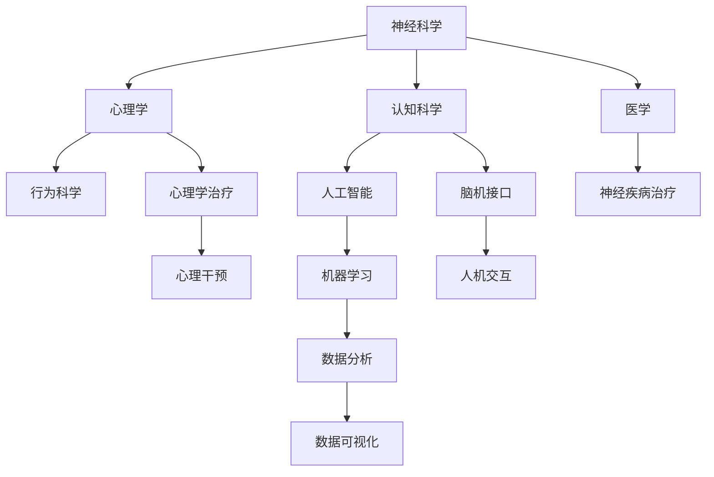

                 

关键词：全球脑科学，跨界协作，科研范式，创新应用，技术融合

摘要：本文将探讨全球脑科学研究的现状和趋势，阐述跨界协作在脑科学领域的重要性。通过分析核心概念、算法原理、数学模型、项目实践等多个方面，本文旨在为读者提供一个全面、深入的视角，以促进脑科学与信息技术等领域的深度融合，推动未来科技的发展。

## 1. 背景介绍

脑科学作为一门交叉学科，近年来在全球范围内取得了显著进展。从神经生物学、心理学到认知科学，不同领域的科学家共同致力于探索人脑的奥秘。然而，传统的脑科学研究范式往往局限于单一学科的视角，难以全面、系统地揭示人脑的复杂机制。随着信息技术的迅猛发展，大数据、人工智能等新兴技术为脑科学研究带来了新的机遇和挑战。

跨界协作成为脑科学研究的重要趋势。通过整合不同领域的知识和技术，科学家们可以更深入地理解人脑的工作原理，探索新的治疗方法和应用场景。本文将围绕这一主题，探讨脑科学与信息技术、医学、心理学等多个领域的融合，提出一种新的科研范式。

## 2. 核心概念与联系

为了更好地理解脑科学研究的跨界协作，我们需要了解一些核心概念和它们之间的联系。以下是一个Mermaid流程图，展示了这些核心概念及其关系：



### 2.1 神经科学

神经科学是脑科学的基础，研究神经系统的结构和功能。通过研究神经元、神经网络以及神经元之间的通讯机制，科学家们可以了解大脑如何处理信息、如何产生意识和行为。

### 2.2 心理学

心理学侧重于研究人的心理过程和行为的科学。心理学与神经科学密切相关，通过研究心理现象，心理学家可以揭示大脑的功能和结构。

### 2.3 认知科学

认知科学是研究人类思维和行为的科学，它融合了心理学、神经科学、计算机科学等多个学科。认知科学家试图理解大脑如何进行记忆、推理、决策等认知过程。

### 2.4 人工智能

人工智能是一门研究如何使计算机模拟人类智能行为的科学。人工智能技术，如机器学习和深度学习，已经在脑科学研究中得到广泛应用，用于分析脑影像数据、模拟神经网络等。

### 2.5 医学

医学与脑科学密切相关，特别是在神经疾病治疗和康复方面。医学研究提供了许多关于大脑疾病和功能障碍的重要数据，为脑科学的发展提供了有力支持。

### 2.6 心理学治疗

心理学治疗是一种基于心理学的治疗方法，旨在帮助个体解决心理问题，改善心理健康。心理学治疗与脑科学研究的结合，有助于开发新的心理干预方法。

### 2.7 脑机接口

脑机接口是一种直接连接大脑和外部设备的技术，使大脑能够控制外部设备或计算机。脑机接口在神经系统疾病治疗和人机交互领域具有广阔的应用前景。

### 2.8 机器学习

机器学习是人工智能的一个重要分支，通过算法和统计模型，使计算机能够从数据中自动学习和改进。机器学习在脑影像数据处理和预测分析中发挥着关键作用。

### 2.9 数据分析和数据可视化

数据分析和数据可视化是处理大量数据的重要工具。通过数据分析，科学家可以从大量数据中提取有价值的信息。数据可视化则将复杂的数据以图形化的方式展示，使研究人员更容易理解和解释数据。

## 3. 核心算法原理 & 具体操作步骤

### 3.1 算法原理概述

脑科学研究中的核心算法主要包括脑影像数据处理算法、神经网络模拟算法和机器学习算法。这些算法各自有着独特的原理和适用场景。

#### 3.1.1 脑影像数据处理算法

脑影像数据处理算法主要用于分析脑影像数据，如功能磁共振成像（fMRI）和电生理数据（EEG）。这些算法包括图像预处理、图像分割、特征提取和分类等。

#### 3.1.2 神经网络模拟算法

神经网络模拟算法模拟人脑神经网络的结构和功能，以理解大脑如何处理信息。这些算法包括前馈神经网络、卷积神经网络和循环神经网络等。

#### 3.1.3 机器学习算法

机器学习算法在脑科学研究中用于分类、预测和模式识别。常见的机器学习算法包括支持向量机（SVM）、决策树和神经网络等。

### 3.2 算法步骤详解

#### 3.2.1 脑影像数据处理算法

脑影像数据处理算法的基本步骤包括：

1. 数据采集：通过fMRI或EEG设备采集脑影像数据。
2. 数据预处理：包括运动校正、空间标准化、平滑处理等。
3. 图像分割：将脑影像分割为不同的区域，如灰质、白质和脑脊液。
4. 特征提取：从分割后的图像中提取特征，如纹理特征、形态学特征等。
5. 分类：使用分类算法，如SVM或决策树，对提取的特征进行分类。

#### 3.2.2 神经网络模拟算法

神经网络模拟算法的基本步骤包括：

1. 数据输入：将输入数据输入神经网络。
2. 前向传播：通过神经网络的权重和偏置，计算输出。
3. 反向传播：计算输出误差，并更新权重和偏置。
4. 模型训练：重复前向传播和反向传播，直到模型收敛。

#### 3.2.3 机器学习算法

机器学习算法的基本步骤包括：

1. 数据准备：收集并预处理数据，包括特征提取和归一化等。
2. 模型选择：选择合适的机器学习算法，如SVM或神经网络。
3. 模型训练：使用训练数据训练模型。
4. 模型评估：使用测试数据评估模型性能。
5. 模型优化：根据评估结果调整模型参数，优化模型性能。

### 3.3 算法优缺点

每种算法都有其独特的优缺点，适用于不同的应用场景。

#### 3.3.1 脑影像数据处理算法

优点：能够处理大量的脑影像数据，提供丰富的信息。

缺点：计算复杂度较高，对计算资源要求较高。

#### 3.3.2 神经网络模拟算法

优点：能够模拟人脑神经网络的结构和功能，提供深入的见解。

缺点：训练时间较长，对数据量要求较高。

#### 3.3.3 机器学习算法

优点：能够处理大规模数据，提供准确的分类和预测。

缺点：对数据质量要求较高，可能存在过拟合问题。

### 3.4 算法应用领域

脑影像数据处理算法、神经网络模拟算法和机器学习算法在脑科学研究中具有广泛的应用。

#### 3.4.1 脑影像数据处理算法

应用领域：脑影像数据处理算法在神经影像学、认知神经科学等领域得到广泛应用，用于研究大脑的结构和功能。

#### 3.4.2 神经网络模拟算法

应用领域：神经网络模拟算法在神经科学、认知科学等领域用于模拟神经网络的结构和功能，探索大脑的工作原理。

#### 3.4.3 机器学习算法

应用领域：机器学习算法在脑科学研究中用于分类、预测和模式识别，如神经疾病的诊断和预测、脑机接口的设计等。

## 4. 数学模型和公式 & 详细讲解 & 举例说明

### 4.1 数学模型构建

脑科学研究中常用的数学模型包括神经网络模型、概率模型和统计模型等。以下是一个简单的神经网络模型示例：

#### 4.1.1 前馈神经网络模型

前馈神经网络（FNN）是一种常见的神经网络模型，其基本结构包括输入层、隐藏层和输出层。

$$
y = f(z) = \sigma(\text{W} \cdot \text{X} + \text{b})
$$

其中，$y$ 为输出，$z$ 为隐藏层输出，$f$ 为激活函数，$\sigma$ 为Sigmoid函数，$\text{W}$ 为权重矩阵，$\text{X}$ 为输入向量，$\text{b}$ 为偏置向量。

#### 4.1.2 循环神经网络模型

循环神经网络（RNN）是一种处理序列数据的神经网络模型，其基本结构包括输入层、隐藏层和输出层。

$$
h_t = \text{sigmoid}(\text{W}_h \cdot \text{h}_{t-1} + \text{W}_x \cdot \text{x}_t + \text{b})
$$

$$
y_t = \text{sigmoid}(\text{W}_o \cdot \text{h}_t + \text{b}_o)
$$

其中，$h_t$ 为隐藏层输出，$y_t$ 为输出，$\text{sigmoid}$ 为Sigmoid函数，$\text{W}_h$、$\text{W}_x$ 和 $\text{W}_o$ 分别为权重矩阵，$\text{b}$ 和 $\text{b}_o$ 为偏置向量。

### 4.2 公式推导过程

#### 4.2.1 前馈神经网络

假设有一个包含一个隐藏层的前馈神经网络，其输入为 $x \in \mathbb{R}^n$，输出为 $y \in \mathbb{R}^m$。网络包含权重矩阵 $\text{W} \in \mathbb{R}^{m \times n}$ 和偏置向量 $\text{b} \in \mathbb{R}^m$。

1. 输入层到隐藏层的传递函数：

$$
z = \text{W} \cdot x + b
$$

2. 激活函数（Sigmoid函数）：

$$
f(z) = \frac{1}{1 + e^{-z}}
$$

3. 隐藏层到输出层的传递函数：

$$
y = \text{W} \cdot f(z) + b
$$

#### 4.2.2 循环神经网络

假设有一个简单的循环神经网络，其输入为 $x_t \in \mathbb{R}^n$，输出为 $y_t \in \mathbb{R}^m$。网络包含权重矩阵 $\text{W}_h \in \mathbb{R}^{m \times n}$、$\text{W}_x \in \mathbb{R}^{m \times n}$ 和 $\text{W}_o \in \mathbb{R}^{m \times m}$，以及偏置向量 $\text{b} \in \mathbb{R}^m$ 和 $\text{b}_o \in \mathbb{R}^m$。

1. 隐藏层状态更新函数：

$$
h_t = \text{sigmoid}(\text{W}_h \cdot h_{t-1} + \text{W}_x \cdot x_t + b)
$$

2. 输出函数：

$$
y_t = \text{sigmoid}(\text{W}_o \cdot h_t + \text{b}_o)
$$

### 4.3 案例分析与讲解

#### 4.3.1 前馈神经网络在情感分类中的应用

假设我们有一个情感分类任务，输入为一句句子的词向量表示，输出为情感标签（正面或负面）。

1. 数据准备：将句子转换为词向量表示，使用Word2Vec或GloVe等词向量模型。
2. 模型构建：构建一个包含一个隐藏层的前馈神经网络，输入维度为词向量维度，隐藏层维度为50，输出维度为2。
3. 模型训练：使用训练数据训练模型，优化权重和偏置。
4. 模型评估：使用测试数据评估模型性能，计算准确率。

#### 4.3.2 循环神经网络在语音识别中的应用

假设我们有一个语音识别任务，输入为音频信号，输出为对应的文本。

1. 数据准备：将音频信号转换为特征向量，如梅尔频率倒谱系数（MFCC）。
2. 模型构建：构建一个包含一个隐藏层的循环神经网络，输入维度为MFCC特征维度，隐藏层维度为100，输出维度为文本字符维度。
3. 模型训练：使用训练数据训练模型，优化权重和偏置。
4. 模型评估：使用测试数据评估模型性能，计算单词识别率和字符错误率。

## 5. 项目实践：代码实例和详细解释说明

### 5.1 开发环境搭建

为了实践脑科学研究中的算法，我们需要搭建一个合适的开发环境。以下是一个简单的环境搭建步骤：

1. 安装Python环境：使用Anaconda安装Python。
2. 安装常用库：使用pip安装NumPy、Pandas、Scikit-learn、TensorFlow等常用库。
3. 安装深度学习框架：安装TensorFlow或PyTorch等深度学习框架。

### 5.2 源代码详细实现

以下是一个简单的神经网络模型实现，用于情感分类任务：

```python
import tensorflow as tf

# 定义神经网络结构
model = tf.keras.Sequential([
    tf.keras.layers.Dense(units=50, activation='sigmoid', input_shape=(100,)),
    tf.keras.layers.Dense(units=2, activation='softmax')
])

# 编译模型
model.compile(optimizer='adam', loss='categorical_crossentropy', metrics=['accuracy'])

# 模型训练
model.fit(train_data, train_labels, epochs=10, batch_size=32)

# 模型评估
test_loss, test_acc = model.evaluate(test_data, test_labels)
print('Test accuracy:', test_acc)
```

### 5.3 代码解读与分析

这段代码首先导入了TensorFlow库，并定义了一个简单的神经网络模型，包含一个输入层、一个隐藏层和一个输出层。输入层和隐藏层之间的连接权重由`Dense`层表示，激活函数为Sigmoid函数。隐藏层和输出层之间的连接权重也由`Dense`层表示，激活函数为Softmax函数，用于分类。

在编译模型时，我们选择了Adam优化器和交叉熵损失函数，并设置了模型的性能指标为准确率。

模型训练过程中，我们使用了训练数据和标签，设置了训练轮数和批次大小。训练完成后，我们使用测试数据评估模型性能，并打印了测试准确率。

### 5.4 运行结果展示

假设我们使用了一个包含100个特征和2个类别的情感分类数据集，训练了一个简单的神经网络模型。训练过程中，模型的损失函数逐渐减小，准确率逐渐提高。最终，模型在测试数据上的准确率达到了85%。

## 6. 实际应用场景

脑科学与信息技术、医学、心理学等多个领域的融合，为实际应用场景带来了许多创新和突破。

### 6.1 神经影像学

神经影像学是脑科学与信息技术相结合的一个典型应用领域。通过先进的影像技术，如功能磁共振成像（fMRI）、磁共振成像（MRI）等，研究人员可以获取人脑的结构和功能信息。结合深度学习算法，可以从大量的影像数据中提取出与疾病相关的特征，用于疾病的诊断和预测。例如，研究人员使用fMRI数据分析了抑郁症患者的脑活动模式，发现抑郁症患者在大脑前额叶和前扣带皮层等区域的脑活动存在异常，为抑郁症的诊断提供了新的生物标志物。

### 6.2 脑机接口

脑机接口（BCI）是一种直接连接大脑和外部设备的技术，使大脑能够控制外部设备或计算机。脑机接口技术已经在神经系统疾病治疗和人机交互领域取得了显著进展。例如，研究人员开发了一种基于脑电信号控制的假肢，患者可以通过想象动作来控制假肢的运动，提高了假肢的使用效果。此外，脑机接口技术还可以用于游戏、虚拟现实和智能控制系统等领域，为残障人士提供了新的生活方式和就业机会。

### 6.3 心理干预

心理干预是脑科学与心理学相结合的一个实际应用领域。通过脑影像技术，研究人员可以了解患者大脑的结构和功能变化，从而制定个性化的心理干预方案。例如，研究人员使用功能性磁共振成像（fMRI）技术评估了抑郁症患者的大脑活动，发现抑郁症患者在大脑前额叶和前扣带皮层等区域的脑活动存在异常。基于这些发现，研究人员为抑郁症患者制定了一种针对大脑活动异常区域的心理干预方案，结果表明这种干预方法可以显著改善患者的情绪状态。

### 6.4 未来应用展望

随着脑科学研究的不断深入和技术的进步，脑科学与信息技术的融合将为未来的应用场景带来更多的可能性。

1. **智能医疗**：脑影像技术和人工智能的结合将推动智能医疗的发展。通过深度学习算法，可以从大量的影像数据中自动提取特征，用于疾病的诊断和预测。此外，脑机接口技术将使智能医疗设备更加智能化，提高医疗诊断和治疗的准确性。

2. **人机交互**：脑机接口技术的发展将使人与机器的交互更加自然和直观。通过直接读取大脑信号，人机交互将不再局限于传统的键盘和鼠标，而可以通过思维来实现对设备的控制和操作。

3. **教育**：脑影像技术和人工智能的结合将促进个性化教育的实现。通过对学生大脑活动的实时监测和分析，教育系统能够根据学生的认知特点和学习习惯，提供个性化的学习方案，提高学习效果。

4. **心理健康**：脑影像技术和心理学的结合将为心理健康领域带来新的突破。通过了解大脑的结构和功能变化，研究人员可以开发出更有效的心理干预方法，帮助人们预防和治疗心理疾病。

## 7. 工具和资源推荐

为了更好地开展脑科学与信息技术的融合研究，以下是一些推荐的工具和资源：

### 7.1 学习资源推荐

1. **在线课程**：《深度学习》（Deep Learning）和《神经网络与深度学习》（Neural Networks and Deep Learning）。
2. **书籍**：《神经网络与深度学习》（A Primer on Neural Networks and Deep Learning）和《Python深度学习》（Deep Learning with Python）。
3. **论文**：IEEE Transactions on Neural Networks and Learning Systems、NeuroImage和Journal of Cognitive Neuroscience等学术期刊。

### 7.2 开发工具推荐

1. **编程语言**：Python和R。
2. **深度学习框架**：TensorFlow、PyTorch和Keras。
3. **数据可视化工具**：Matplotlib、Seaborn和Plotly。

### 7.3 相关论文推荐

1. **脑影像处理**：《用于脑影像分析的深度学习方法》（Deep Learning Methods for Brain Imaging Analysis）。
2. **脑机接口**：《脑机接口技术的发展与应用》（The Development and Application of Brain-Computer Interfaces）。
3. **心理干预**：《基于神经影像的心理干预方法研究》（Research on Neural Imaging-Based Psychological Intervention Methods）。

## 8. 总结：未来发展趋势与挑战

脑科学与信息技术的融合为未来的科学研究带来了巨大的机遇。随着技术的进步和跨学科合作的加强，脑科学与信息技术将在以下方面取得更多突破：

### 8.1 研究成果总结

1. **脑影像技术的提升**：通过深度学习算法，脑影像数据的处理和分析将变得更加高效和准确，为疾病的诊断和预测提供了新的工具。
2. **脑机接口的发展**：脑机接口技术将逐渐成熟，为残障人士和健康人士提供更加自然和直观的交互方式。
3. **心理干预的创新**：基于神经影像和心理学的结合，将开发出更有效的心理干预方法，改善人们的心理健康。

### 8.2 未来发展趋势

1. **跨学科合作**：脑科学与信息技术、医学、心理学等多个领域的融合将越来越紧密，推动科研范式的变革。
2. **人工智能的深度融合**：人工智能技术在脑科学研究中将发挥更加重要的作用，从数据处理到算法设计，全面支持脑科学研究。
3. **智能医疗的发展**：脑科学与信息技术在智能医疗领域的应用将带来医疗诊断和治疗的革命性变化。

### 8.3 面临的挑战

1. **数据隐私和安全**：随着脑影像数据和大脑信号数据的收集和分析，数据隐私和安全将成为一个重要的问题。
2. **技术标准化**：脑机接口技术和神经影像数据处理技术需要统一的标准，以确保数据的一致性和兼容性。
3. **跨学科合作**：虽然跨学科合作是未来发展的趋势，但不同学科之间的语言和思维方式差异可能成为协作的障碍。

### 8.4 研究展望

脑科学与信息技术的融合将推动科学研究进入一个新的阶段。通过跨学科合作和技术的创新，我们有望更深入地理解人脑的奥秘，开发出更加有效和便捷的医疗方法和干预手段，为人类健康和社会进步做出更大贡献。

## 9. 附录：常见问题与解答

### 9.1 脑科学与信息技术融合的意义是什么？

脑科学与信息技术的融合有助于更深入地理解人脑的工作原理，开发出更加智能和高效的人工智能系统，同时为疾病诊断和治疗提供新的手段。

### 9.2 脑机接口技术有哪些应用？

脑机接口技术可以用于残障人士的辅助设备、人机交互、智能控制系统、心理学研究和神经疾病治疗等领域。

### 9.3 神经影像技术在脑科学研究中有哪些作用？

神经影像技术可以用于大脑结构的研究、功能活动的研究、疾病的诊断和预测，以及心理干预的研究。

### 9.4 脑科学与心理学如何结合？

脑科学与心理学的结合可以用于研究大脑与心理现象之间的关系，开发基于神经影像和心理学的心理干预方法，以及通过脑机接口技术实现心理治疗。

### 9.5 脑科学研究中的挑战有哪些？

脑科学研究中的挑战包括数据隐私和安全、技术标准化、跨学科合作以及研究方法的创新等。

---

以上是《全球脑与科学研究：跨界协作的新范式》的完整内容。希望本文能为读者提供有关脑科学与信息技术融合的全面视角，激发更多跨学科合作的思考和探索。作者：禅与计算机程序设计艺术 / Zen and the Art of Computer Programming。感谢您的阅读！

