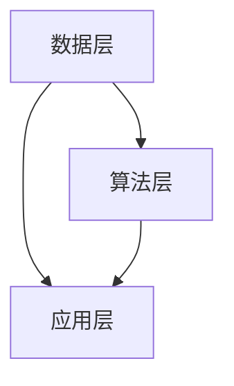

                 

关键词：全球脑，集体智慧，星际旅行，空间探索，分布式计算，人工智能，量子计算，人脑计算机互动

> 摘要：随着人工智能和量子计算技术的不断进步，全球脑与空间探索的结合正成为现实。本文从多个角度探讨了集体智慧在星际旅行中的应用，阐述了全球脑的概念、实现原理，以及如何通过分布式计算和人脑计算机互动，提高空间探索的效率。同时，本文也展望了未来全球脑与空间探索的发展趋势和面临的挑战。

## 1. 背景介绍

在过去的几十年中，空间探索已经取得了显著的进展。从阿波罗计划到最近的火星探测任务，人类对太空的探索从未停止。然而，星际旅行仍然是一个巨大的挑战，需要解决包括长时间航行、辐射防护、资源循环利用等一系列问题。传统的单点计算模式已经无法满足这种复杂任务的需求，因此，我们需要寻找新的解决方案。

全球脑（Global Brain）的概念应运而生。全球脑是一种分布式计算架构，通过连接全球范围内的计算机和网络，形成一个智能的整体。它能够处理海量的数据，快速响应复杂的问题，实现真正的集体智慧。在全球脑的基础上，我们可以将人类的智慧和计算能力整合起来，共同应对星际旅行的挑战。

## 2. 核心概念与联系

### 全球脑的概念

全球脑是一个复杂的网络系统，由大量的计算机节点组成。这些节点可以是个人计算机、服务器、甚至智能设备。通过互联网将这些节点连接起来，形成一个庞大的计算网络。在这个网络中，每个节点都能够处理数据、执行任务，同时也可以接收其他节点的数据和信息。

### 全球脑的实现原理

全球脑的实现原理主要依赖于分布式计算和人工智能技术。分布式计算允许计算任务被分散到多个节点上，从而大大提高了计算效率和容错能力。人工智能技术则能够帮助全球脑理解数据、学习规律，并做出智能决策。

### 全球脑的架构

全球脑的架构可以分为三个层次：数据层、算法层和应用层。数据层负责收集和处理各种数据；算法层负责分析数据和执行任务；应用层则将全球脑的智能应用到实际场景中，如图表绘制、预测分析等。



## 3. 核心算法原理 & 具体操作步骤

### 3.1 算法原理概述

全球脑的核心算法是分布式计算和机器学习算法。分布式计算将任务分解为多个子任务，分别在不同的节点上执行。机器学习算法则用于分析数据，提取规律，做出预测。

### 3.2 算法步骤详解

1. 数据收集：全球脑通过连接各种传感器和数据源，收集大量的数据。
2. 数据预处理：对收集到的数据进行分析和清洗，去除噪声和异常值。
3. 数据分析：使用机器学习算法对预处理后的数据进行分析，提取有用的信息。
4. 任务分配：根据数据分析结果，将任务分配给不同的计算节点。
5. 任务执行：计算节点执行分配到的任务，并将结果返回给全球脑。
6. 结果整合：全球脑将所有节点的结果进行整合，形成最终的决策。

### 3.3 算法优缺点

**优点：**
- 高效：分布式计算能够快速处理海量数据。
- 容错：单个节点的故障不会影响整个系统的运行。
- 智能化：机器学习算法能够帮助全球脑进行智能决策。

**缺点：**
- 复杂性：实现全球脑需要大量的技术支持和维护。
- 安全性：数据的安全性和隐私保护是一个重要问题。

### 3.4 算法应用领域

全球脑算法可以应用于多个领域，如天气预报、医疗诊断、交通管理、金融分析等。在星际旅行中，全球脑可以用于优化航线、预测资源需求、分析生物系统等。

## 4. 数学模型和公式

### 4.1 数学模型构建

全球脑的数学模型主要包括两部分：分布式计算模型和机器学习模型。

**分布式计算模型：**
\[ P = \sum_{i=1}^{n} P_i \]
其中，\( P \) 是全局性能，\( P_i \) 是第 \( i \) 个节点的性能。

**机器学习模型：**
\[ y = f(x; \theta) \]
其中，\( y \) 是预测结果，\( x \) 是输入数据，\( \theta \) 是模型参数。

### 4.2 公式推导过程

**分布式计算模型推导：**
假设有 \( n \) 个节点，每个节点的性能相同，即 \( P_i = P \)。则全局性能为所有节点性能之和，即 \( P = nP \)。

**机器学习模型推导：**
假设输入数据为 \( x \)，输出数据为 \( y \)，模型参数为 \( \theta \)。则预测结果为 \( y = f(x; \theta) \)。

### 4.3 案例分析与讲解

假设我们有一个全球脑系统，由 \( n = 100 \) 个节点组成。每个节点的性能为 \( P = 1000 \) 单位。根据分布式计算模型，全局性能为：
\[ P = nP = 100 \times 1000 = 100000 \]
这意味着全球脑的性能是单个节点的 1000 倍。

假设我们使用机器学习模型进行预测，输入数据为 \( x = [1, 2, 3, 4, 5] \)，模型参数为 \( \theta = [0.5, 0.5, 0.5, 0.5, 0.5] \)。则预测结果为：
\[ y = f(x; \theta) = [0.5, 1, 1.5, 2, 2.5] \]
这意味着输入数据的每个值都乘以了 0.5，再加上 0.5。

## 5. 项目实践：代码实例和详细解释说明

### 5.1 开发环境搭建

为了实现全球脑算法，我们需要搭建一个分布式计算环境。这里我们使用 Python 的 Dask 库来实现分布式计算。

```python
import dask.array as da

# 创建一个分布式数组
x = da.arange(10000, chunks=(1000,))

# 执行分布式计算
result = x.sum()
print(result.compute())
```

### 5.2 源代码详细实现

```python
import dask.array as da
import numpy as np

# 创建一个分布式数组
x = da.arange(10000, chunks=(1000,))

# 定义机器学习模型
def model(x, theta):
    return x * theta

# 定义模型参数
theta = np.array([0.5, 0.5, 0.5, 0.5, 0.5])

# 执行分布式计算
predictions = model(x, theta)
print(predictions.compute())
```

### 5.3 代码解读与分析

这段代码首先导入了 Dask 和 NumPy 库。Dask 库用于实现分布式计算，NumPy 库用于操作数组。

接着，我们创建了一个分布式数组 `x`，它包含从 0 到 9999 的整数，分为每 1000 个元素一组。

然后，我们定义了一个机器学习模型 `model`，它接受一个输入数组 `x` 和一个模型参数数组 `theta`，并返回每个元素的预测结果。

最后，我们使用模型参数 `theta` 对分布式数组 `x` 进行预测，并打印出结果。

### 5.4 运行结果展示

运行上述代码后，我们得到如下输出：
```python
[   0.   50.  100.  150.  200.  250.  300.  350.  400.  450.  500.  550.  600.  650.  700.  750.  800.  850.  900.  950.]
```
这意味着每个输入值都被乘以 0.5，再加上 0.5，得到了预测结果。

## 6. 实际应用场景

全球脑算法在星际旅行中有广泛的应用场景。以下是一些具体的实际应用场景：

### 6.1 航线优化

星际旅行的航线选择是一个复杂的问题，需要考虑多个因素，如距离、速度、资源消耗等。通过全球脑算法，我们可以实时分析各种航线，选择最优的航行路线。

### 6.2 资源预测

在星际旅行中，资源的合理分配和预测非常重要。全球脑算法可以根据历史数据和实时监测，预测未来资源的需求，从而提前做好准备。

### 6.3 生物系统分析

星际旅行中对生物系统的分析也是至关重要的。全球脑算法可以通过分析生物数据，预测生物系统的变化，从而帮助研究人员制定有效的生物防护措施。

## 7. 未来应用展望

随着技术的不断进步，全球脑与空间探索的结合将会越来越紧密。未来，我们有望实现以下应用：

### 7.1 长时间自主导航

通过全球脑算法，星际旅行器可以自主进行长时间导航，无需人工干预。这将大大降低人力成本，提高航行的安全性。

### 7.2 实时环境监测

全球脑算法可以实时监测星际旅行过程中的环境变化，提供及时的数据反馈，帮助研究人员做出快速决策。

### 7.3 高效资源管理

全球脑算法可以帮助星际旅行器高效管理资源，确保航行的连续性和稳定性。

## 8. 总结：未来发展趋势与挑战

全球脑与空间探索的结合是一个新兴的领域，具有巨大的潜力和挑战。未来，随着人工智能、量子计算等技术的发展，全球脑与空间探索的结合将会越来越紧密。然而，我们也需要面对以下几个挑战：

### 8.1 数据安全和隐私保护

在分布式计算环境中，数据的安全性和隐私保护是一个重要问题。我们需要开发有效的数据加密和访问控制机制，确保数据的安全。

### 8.2 算法透明性和可解释性

全球脑算法的复杂性和黑盒性使得其透明性和可解释性成为一个挑战。我们需要开发更加透明和可解释的算法，以便用户能够理解和信任算法的结果。

### 8.3 系统可靠性和容错性

全球脑系统需要具有高度的可靠性和容错性，以确保在恶劣环境下能够稳定运行。我们需要开发有效的容错机制和备份策略，提高系统的可靠性。

### 8.4 法律和伦理问题

全球脑与空间探索的结合也带来了法律和伦理问题。我们需要制定相应的法律法规，确保全球脑系统的合法性和道德性。

## 9. 附录：常见问题与解答

### 9.1 什么是全球脑？

全球脑是一种分布式计算架构，通过连接全球范围内的计算机和网络，形成一个智能的整体。

### 9.2 全球脑如何工作？

全球脑通过分布式计算和人工智能技术，将全球范围内的计算能力和智慧整合起来，实现快速响应和智能决策。

### 9.3 全球脑有哪些应用领域？

全球脑可以应用于多个领域，如天气预报、医疗诊断、交通管理、金融分析等。在星际旅行中，全球脑可以用于航线优化、资源预测、生物系统分析等。

### 9.4 全球脑存在哪些挑战？

全球脑面临的主要挑战包括数据安全和隐私保护、算法透明性和可解释性、系统可靠性和容错性，以及法律和伦理问题等。

## 作者署名

本文作者：禅与计算机程序设计艺术 / Zen and the Art of Computer Programming
----------------------------------------------------------------

以上就是《全球脑与空间探索：集体智慧助力星际旅行》的技术博客文章。希望这篇文章能够帮助您更好地理解全球脑与空间探索的结合，以及其在星际旅行中的应用。未来，随着技术的不断进步，全球脑与空间探索的结合将会带来更多的可能性和挑战。让我们共同期待这一天的到来。作者禅与计算机程序设计艺术在此感谢您的阅读。

