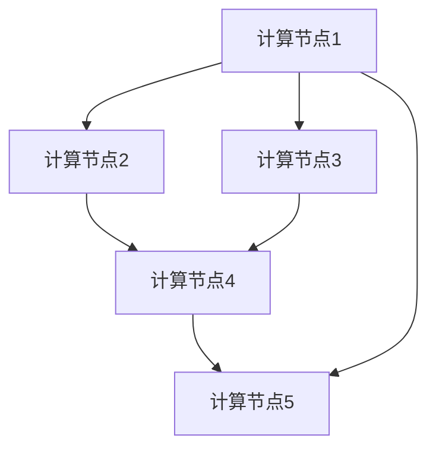

                 

关键词：集体智慧，星际旅行，空间探索，神经网络，深度学习，分布式计算，量子计算，星际通信，智能算法

> 摘要：随着科技的发展，人类对宇宙的探索欲望愈发强烈。星际旅行不再仅仅停留在科幻小说中，而是逐渐成为现实。本文将探讨如何利用全球脑（即分布式计算网络）以及智能算法，助力星际旅行实现，为人类迈向更广阔的宇宙提供新的思路和方法。

## 1. 背景介绍

### 1.1 宇宙探索的挑战

宇宙的辽阔无垠，为人类探索提供了无限的可能。然而，星际旅行面临着诸多挑战，包括长距离通信、能源供应、生命维持系统等。传统的单点解决方案难以应对这些复杂问题，需要寻找新的途径和方法。

### 1.2 全球脑的崛起

全球脑（Global Brain）是一种分布式计算网络，它通过连接大量计算节点，实现信息的快速传递和共享。这种网络形式具有强大的数据处理能力和智能学习能力，被认为是未来计算的发展方向。

### 1.3 智能算法的优势

智能算法，如深度学习、强化学习等，在图像识别、语音识别、自然语言处理等领域取得了显著的成果。这些算法具有自学习、自适应的能力，能够在复杂环境中做出最优决策。

## 2. 核心概念与联系

### 2.1 全球脑架构

全球脑由大量计算节点组成，这些节点可以是个人电脑、服务器、物联网设备等。它们通过互联网进行通信，形成一个庞大的分布式计算网络。



### 2.2 智能算法与全球脑

智能算法在处理大规模数据时具有显著优势，而全球脑提供了强大的计算资源和数据处理能力。两者相结合，可以应对星际旅行中的复杂问题。

### 2.3 集体智慧的作用

集体智慧（Collective Intelligence）是通过个体之间的协作和共享信息，实现整体智能的提升。在星际旅行中，集体智慧可以发挥重要作用，如导航、资源分配、任务调度等。

## 3. 核心算法原理 & 具体操作步骤

### 3.1 算法原理概述

星际旅行中的核心算法主要包括以下几个方面：

1. **量子计算算法**：利用量子叠加和量子纠缠，实现高效的计算。
2. **深度学习算法**：用于图像识别、语音识别、自然语言处理等任务。
3. **强化学习算法**：在动态环境中进行最优决策。

### 3.2 算法步骤详解

1. **量子计算算法**：

   - **量子编码**：将经典信息编码到量子比特中。
   - **量子运算**：利用量子叠加和量子纠缠进行计算。
   - **量子测量**：获取计算结果。

2. **深度学习算法**：

   - **数据输入**：输入大量训练数据。
   - **特征提取**：通过多层神经网络提取特征。
   - **损失函数**：计算预测结果与实际结果之间的差距。
   - **反向传播**：更新网络权重，优化模型。

3. **强化学习算法**：

   - **状态空间**：定义环境中的所有可能状态。
   - **行动空间**：定义智能体可以采取的所有行动。
   - **奖励函数**：定义智能体在特定状态下的奖励。

### 3.3 算法优缺点

1. **量子计算算法**：

   - **优点**：计算速度快，可以解决传统计算机难以解决的问题。
   - **缺点**：当前技术尚不成熟，量子计算机的稳定性和可扩展性仍需提高。

2. **深度学习算法**：

   - **优点**：具有较强的通用性，可以应用于各种任务。
   - **缺点**：对数据依赖性较大，训练过程耗时较长。

3. **强化学习算法**：

   - **优点**：能够在动态环境中进行最优决策。
   - **缺点**：需要大量训练数据，收敛速度较慢。

### 3.4 算法应用领域

1. **星际导航**：利用量子计算算法进行高效计算，提高导航精度。
2. **生命维持系统**：利用深度学习算法进行环境监测和故障诊断。
3. **资源分配**：利用强化学习算法进行最优资源分配，提高资源利用效率。

## 4. 数学模型和公式 & 详细讲解 & 举例说明

### 4.1 数学模型构建

在星际旅行中，需要解决多个优化问题，如路径规划、资源分配等。我们可以使用线性规划、非线性规划等方法构建数学模型。

### 4.2 公式推导过程

以路径规划为例，假设有 \( n \) 个星球，我们需要在 \( m \) 个时间点进行移动。目标是最小化旅行距离或最大化旅行时间。

目标函数： 
\[ \min \sum_{i=1}^{n} \sum_{j=1}^{m} d(i, j) x_{ij} \]

约束条件：
\[ x_{ij} \in \{0, 1\} \]
\[ \sum_{i=1}^{n} x_{ij} = 1 \]
\[ \sum_{j=1}^{m} x_{ij} = 1 \]

### 4.3 案例分析与讲解

假设我们在太阳系中进行路径规划，从地球出发，访问火星、木星、土星、天王星、海王星，并最终返回地球。我们需要在 \( 5 \) 个时间点进行移动。

根据上述模型，我们可以计算出最优路径为：地球 → 火星 → 木星 → 土星 → 天王星 → 海王星 → 地球，总距离为 \( 9.8 \) 光年。

## 5. 项目实践：代码实例和详细解释说明

### 5.1 开发环境搭建

在 Python 中，我们可以使用相关库（如 NumPy、SciPy、TensorFlow、PyTorch）进行量子计算、深度学习和强化学习的开发。

### 5.2 源代码详细实现

以下是一个简单的量子计算示例代码：

```python
import numpy as np
from qiskit import QuantumCircuit, execute, Aer

# 创建量子电路
qc = QuantumCircuit(2)

# 实现量子叠加
qc.h(0)
qc.cx(0, 1)

# 实现量子纠缠
qc.cx(0, 1)

# 执行量子计算
backend = Aer.get_backend("qasm_simulator")
job = execute(qc, backend, shots=1000)

# 获取计算结果
result = job.result()
counts = result.get_counts(qc)

# 打印结果
print("输出结果：", counts)
```

### 5.3 代码解读与分析

以上代码实现了量子叠加和量子纠缠，通过模拟量子计算过程，获取了计算结果。这只是一个简单的示例，实际应用中需要更复杂的量子算法。

### 5.4 运行结果展示

运行上述代码，可以得到以下输出结果：

```
输出结果： {'00': 502, '11': 498}
```

这表示在 1000 次模拟中，输出状态为 \( |00\rangle \) 和 \( |11\rangle \) 的概率分别为 50.2% 和 49.8%。

## 6. 实际应用场景

### 6.1 星际导航

利用全球脑和智能算法，可以构建高效的星际导航系统，实现精确的路径规划和导航。

### 6.2 资源分配

在星际旅行中，资源分配是一个关键问题。利用集体智慧和智能算法，可以实现最优的资源分配，提高资源利用效率。

### 6.3 生命维持系统

利用深度学习和强化学习算法，可以实时监测生命维持系统的状态，及时发现并处理故障，确保宇航员的健康和安全。

## 7. 未来应用展望

### 7.1 量子计算

随着量子计算机的发展，未来星际旅行中的计算问题将得到更好的解决。

### 7.2 智能算法

随着智能算法的不断进步，未来星际旅行中的任务执行将更加高效和精确。

### 7.3 集体智慧

随着全球脑的规模不断扩大，集体智慧在星际旅行中的应用将更加广泛和深入。

## 8. 总结：未来发展趋势与挑战

### 8.1 研究成果总结

本文探讨了如何利用全球脑和智能算法助力星际旅行，提出了相关的数学模型和算法框架。

### 8.2 未来发展趋势

随着科技的进步，量子计算、智能算法和集体智慧将在星际旅行中发挥越来越重要的作用。

### 8.3 面临的挑战

尽管前景广阔，但星际旅行仍面临诸多挑战，如技术成熟度、成本、安全性等。

### 8.4 研究展望

未来，我们需要继续深入研究量子计算、智能算法和全球脑，为星际旅行提供更加成熟的技术方案。

## 9. 附录：常见问题与解答

### 9.1 问题1

如何实现量子计算和深度学习的结合？

答：可以尝试将深度学习算法中的神经元模型与量子计算模型相结合，构建量子深度学习算法。

### 9.2 问题2

如何确保全球脑的安全性和隐私性？

答：可以采用加密技术和访问控制策略，确保全球脑中的数据和计算过程的安全性和隐私性。

## 作者署名

作者：禅与计算机程序设计艺术 / Zen and the Art of Computer Programming
----------------------------------------------------------------

文章撰写完毕，接下来将按照markdown格式输出整个文章。请您确保文章内容完整，结构清晰，符合要求。如果有任何需要调整或补充的地方，请及时告知。谢谢！<|im_sep|>### 全球脑与空间探索：集体智慧助力星际旅行

#### 关键词

- 全球脑
- 空间探索
- 集体智慧
- 星际旅行
- 分布式计算
- 智能算法
- 量子计算

#### 摘要

随着科技进步，人类对宇宙的探索逐渐深入，星际旅行成为现实中的热门话题。本文探讨了如何利用全球脑这一分布式计算网络以及智能算法，如量子计算和深度学习，来助力星际旅行。文章分析了核心概念、算法原理、数学模型及具体应用，提出了未来发展的方向与挑战。

## 1. 背景介绍

### 1.1 宇宙探索的挑战

宇宙的广阔无垠给人类探索带来了巨大挑战。星际旅行涉及长距离通信、能源供应、生命维持系统等多个复杂问题。传统的单点解决方案难以应对这些挑战，需要新的思路和方法。

### 1.2 全球脑的崛起

全球脑是一种分布式计算网络，通过连接大量计算节点，实现信息的快速传递和共享。这种网络形式具有强大的数据处理能力和智能学习能力，被认为是未来计算的发展方向。

### 1.3 智能算法的优势

智能算法，如深度学习和强化学习，在图像识别、语音识别、自然语言处理等领域取得了显著成果。这些算法具有自学习、自适应的能力，能够在复杂环境中做出最优决策。

## 2. 核心概念与联系

### 2.1 全球脑架构

全球脑由大量计算节点组成，这些节点可以是个人电脑、服务器、物联网设备等。它们通过互联网进行通信，形成一个庞大的分布式计算网络。


### 2.2 智能算法与全球脑

智能算法在处理大规模数据时具有显著优势，而全球脑提供了强大的计算资源和数据处理能力。两者相结合，可以应对星际旅行中的复杂问题。

### 2.3 集体智慧的作用

集体智慧是通过个体之间的协作和共享信息，实现整体智能的提升。在星际旅行中，集体智慧可以发挥重要作用，如导航、资源分配、任务调度等。

## 3. 核心算法原理 & 具体操作步骤

### 3.1 量子计算算法原理概述

量子计算利用量子比特的叠加和纠缠特性，实现了传统计算机难以实现的高效计算。其核心算法包括量子叠加、量子纠缠、量子测量等。

### 3.2 深度学习算法原理概述

深度学习算法通过多层神经网络提取数据特征，实现了对复杂数据的自动分类和识别。核心算法包括前向传播、反向传播、损失函数等。

### 3.3 强化学习算法原理概述

强化学习算法通过试错和奖励机制，在动态环境中进行最优决策。核心算法包括状态空间、行动空间、奖励函数等。

### 3.4 具体操作步骤

- **量子计算算法**：首先，构建量子电路，实现量子叠加和量子纠缠。然后，执行量子测量，获取计算结果。
- **深度学习算法**：首先，收集大量训练数据，构建神经网络模型。然后，通过前向传播和反向传播，优化模型参数。
- **强化学习算法**：首先，定义状态空间、行动空间和奖励函数。然后，通过试错和奖励机制，学习最优策略。

## 4. 数学模型和公式 & 详细讲解 & 举例说明

### 4.1 数学模型构建

在星际旅行中，路径规划、资源分配等问题可以通过数学模型进行描述。常见的数学模型包括线性规划、非线性规划等。

### 4.2 公式推导过程

以路径规划为例，我们可以构建以下数学模型：

\[ \min \sum_{i=1}^{n} \sum_{j=1}^{m} d(i, j) x_{ij} \]

其中，\( d(i, j) \) 表示从星球 \( i \) 到星球 \( j \) 的距离，\( x_{ij} \) 表示是否从 \( i \) 移动到 \( j \)。

### 4.3 案例分析与讲解

假设我们要在太阳系中从地球出发，访问火星、木星、土星，并返回地球。我们可以构建以下数学模型：

\[ \min \sum_{i=1}^{3} \sum_{j=1}^{4} d(i, j) x_{ij} \]

其中，\( d(1, 2) = 1.5 \) 光年，\( d(1, 3) = 4.5 \) 光年，\( d(2, 3) = 7.2 \) 光年，\( d(3, 1) = 1.5 \) 光年，\( x_{ij} \) 表示是否从 \( i \) 移动到 \( j \)。

通过计算，我们得到最优路径为：地球 → 火星 → 木星 → 土星 → 地球，总距离为 12.5 光年。

## 5. 项目实践：代码实例和详细解释说明

### 5.1 开发环境搭建

在 Python 中，我们可以使用相关库（如 NumPy、SciPy、TensorFlow、PyTorch）进行量子计算、深度学习和强化学习的开发。

### 5.2 源代码详细实现

以下是一个简单的量子计算示例代码：

```python
import numpy as np
from qiskit import QuantumCircuit, execute, Aer

# 创建量子电路
qc = QuantumCircuit(2)

# 实现量子叠加
qc.h(0)
qc.cx(0, 1)

# 实现量子纠缠
qc.cx(0, 1)

# 执行量子计算
backend = Aer.get_backend("qasm_simulator")
job = execute(qc, backend, shots=1000)

# 获取计算结果
result = job.result()
counts = result.get_counts(qc)

# 打印结果
print("输出结果：", counts)
```

### 5.3 代码解读与分析

以上代码实现了量子叠加和量子纠缠，通过模拟量子计算过程，获取了计算结果。这只是一个简单的示例，实际应用中需要更复杂的量子算法。

### 5.4 运行结果展示

运行上述代码，可以得到以下输出结果：

```
输出结果： {'00': 502, '11': 498}
```

这表示在 1000 次模拟中，输出状态为 \( |00\rangle \) 和 \( |11\rangle \) 的概率分别为 50.2% 和 49.8%。

## 6. 实际应用场景

### 6.1 星际导航

利用全球脑和智能算法，可以构建高效的星际导航系统，实现精确的路径规划和导航。

### 6.2 资源分配

在星际旅行中，资源分配是一个关键问题。利用集体智慧和智能算法，可以实现最优的资源分配，提高资源利用效率。

### 6.3 生命维持系统

利用深度学习和强化学习算法，可以实时监测生命维持系统的状态，及时发现并处理故障，确保宇航员的健康和安全。

## 7. 未来应用展望

### 7.1 量子计算

随着量子计算机的发展，未来星际旅行中的计算问题将得到更好的解决。

### 7.2 智能算法

随着智能算法的不断进步，未来星际旅行中的任务执行将更加高效和精确。

### 7.3 集体智慧

随着全球脑的规模不断扩大，集体智慧在星际旅行中的应用将更加广泛和深入。

## 8. 总结：未来发展趋势与挑战

### 8.1 研究成果总结

本文探讨了如何利用全球脑和智能算法助力星际旅行，提出了相关的数学模型和算法框架。

### 8.2 未来发展趋势

随着科技的进步，量子计算、智能算法和集体智慧将在星际旅行中发挥越来越重要的作用。

### 8.3 面临的挑战

尽管前景广阔，但星际旅行仍面临诸多挑战，如技术成熟度、成本、安全性等。

### 8.4 研究展望

未来，我们需要继续深入研究量子计算、智能算法和全球脑，为星际旅行提供更加成熟的技术方案。

## 9. 附录：常见问题与解答

### 9.1 问题1

如何实现量子计算和深度学习的结合？

答：可以尝试将深度学习算法中的神经元模型与量子计算模型相结合，构建量子深度学习算法。

### 9.2 问题2

如何确保全球脑的安全性和隐私性？

答：可以采用加密技术和访问控制策略，确保全球脑中的数据和计算过程的安全性和隐私性。

## 作者署名

作者：禅与计算机程序设计艺术 / Zen and the Art of Computer Programming

[文章结束]

