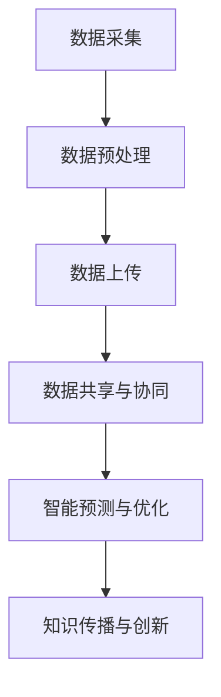

                 

关键词：人工智能、精准农业、农作物种植、全球脑、AI辅助、农业技术、可持续发展、数据科学

> 摘要：本文深入探讨了人工智能在精准农业领域的应用，特别是全球脑技术如何助力农作物种植的效率提升。通过分析核心概念、算法原理、数学模型、项目实践以及未来展望，展示了AI在农业中的巨大潜力，为推动农业现代化和可持续发展提供了新的思路。

## 1. 背景介绍

农业作为人类文明的基石，自古以来就在不断演进。从传统的耕种方式到现代农业的机械化、信息化，农业技术的进步极大地促进了粮食生产。然而，随着全球人口的增长和气候变化等挑战的出现，传统农业模式已经无法满足未来发展的需求。精准农业作为现代农业的重要组成部分，旨在通过科学、精确的数据分析和管理，实现农业生产的优化和可持续发展。

人工智能（AI）作为引领现代科技发展的关键力量，其在各个领域的应用已取得显著成果。在农业领域，AI技术的引入为精准农业带来了全新的可能。通过大数据分析、机器学习、图像识别等技术的综合应用，AI可以帮助农业从业者更准确地了解作物生长状态、环境因素以及病虫害情况，从而实现高效的农作物种植。

全球脑（Global Brain）概念由日本社会学家乌彻·松田提出，指的是一个通过互联网连接的全球性智能网络。这一概念为AI在农业领域的应用提供了新的视角，使得农业数据可以在全球范围内共享、分析和优化。通过全球脑技术，AI可以更好地理解农业的复杂性和多样性，为不同地区的农作物种植提供个性化的解决方案。

本文将围绕全球脑与精准农业的结合，探讨AI辅助的高效农作物种植。首先介绍AI和全球脑在农业中的核心概念，然后分析AI算法原理及其应用领域，接着通过数学模型和公式详细阐述算法的实现过程，并展示一个实际的项目实践案例。最后，本文将对未来农业AI的发展趋势和应用前景进行展望。

## 2. 核心概念与联系

### 2.1 人工智能（AI）在农业中的应用

人工智能在农业中的应用可以概括为以下几个方面：

**数据采集与分析**：AI可以通过传感器、无人机等设备收集农田的土壤、气象、作物生长等数据，并利用机器学习算法进行数据分析，为农业生产提供科学依据。

**病虫害监测与防治**：AI的图像识别和模式识别技术可以帮助监测作物病虫害，及时采取防治措施，减少损失。

**种植规划与优化**：基于AI的算法可以帮助农业从业者进行作物种植规划，优化种植结构，提高产量。

**农业自动化**：AI技术可以应用于农业机械的自动化控制，实现从播种到收割的全流程自动化，提高生产效率。

### 2.2 全球脑（Global Brain）的概念

全球脑指的是一个由大量互联智能体组成的全球性网络，这些智能体可以是个人、组织、机器等。全球脑通过互联网和其他通信技术实现数据的共享和协同，从而形成一个智能的整体。

在农业领域，全球脑的概念意味着农业数据可以在全球范围内共享和利用。例如，一个地区的气候和土壤数据可以与其他地区的农业数据结合，为全球范围内的农作物种植提供更为准确的预测和优化方案。

### 2.3 AI与全球脑在农业中的应用

**数据共享与协同**：全球脑技术使得农业数据可以跨地域、跨行业共享，为AI算法提供更丰富、更全面的数据支持。

**智能预测与优化**：通过全球脑技术，AI可以整合全球的农业数据，进行更加精准的作物生长预测和优化方案。

**知识传播与创新**：全球脑技术促进了农业知识的全球传播和共享，推动了农业技术的创新和进步。

### 2.4 Mermaid 流程图



通过上述流程图，我们可以清晰地看到AI与全球脑技术在农业中的应用流程，从数据采集、预处理到共享与协同，再到智能预测和优化，以及知识传播与创新，每个环节都相互关联，共同推动农业的发展。

## 3. 核心算法原理 & 具体操作步骤

### 3.1 算法原理概述

在农业AI领域，核心算法主要包括机器学习、深度学习和图像识别等。这些算法通过分析大量的农业数据，实现对作物生长状态、环境因素的精确预测和优化。

**机器学习**：机器学习算法通过训练模型，从历史数据中学习规律，实现对新数据的预测。在农业中，常用的机器学习算法包括决策树、支持向量机（SVM）和随机森林等。

**深度学习**：深度学习是机器学习的一个分支，通过多层神经网络模拟人类大脑的工作方式，对复杂的数据进行学习和处理。在农业中，深度学习算法如卷积神经网络（CNN）和循环神经网络（RNN）被广泛应用于图像识别和序列预测。

**图像识别**：图像识别技术通过分析农田图像，识别作物种类、生长状态和病虫害等信息。常用的图像识别算法包括卷积神经网络（CNN）和目标检测算法（如YOLO、Faster R-CNN等）。

### 3.2 算法步骤详解

**数据采集**：通过传感器、无人机、卫星遥感等技术，收集农田的土壤、气象、作物生长等数据。

**数据预处理**：对采集到的数据进行分析、清洗和处理，确保数据的质量和一致性。

**特征提取**：从预处理后的数据中提取特征，如土壤湿度、温度、光照强度等，为后续的机器学习和深度学习算法提供输入。

**模型训练**：使用机器学习或深度学习算法，对提取的特征进行训练，建立预测模型。

**模型评估**：使用测试数据对训练好的模型进行评估，确保模型的准确性和稳定性。

**预测与优化**：使用训练好的模型对新的数据进行预测，并根据预测结果进行农业生产的优化。

### 3.3 算法优缺点

**机器学习**：
- **优点**：算法简单，适用于处理大量数据，对非线性问题有较好的处理能力。
- **缺点**：对数据质量要求较高，模型解释性较差，难以对复杂问题进行深入分析。

**深度学习**：
- **优点**：能够处理高维数据，对复杂问题有较好的处理能力，模型解释性较好。
- **缺点**：对数据量和计算资源要求较高，训练过程复杂，难以调试。

**图像识别**：
- **优点**：能够快速、准确地识别作物种类和病虫害，提高农业生产效率。
- **缺点**：对图像质量要求较高，对变化多端的农田环境适应性较差。

### 3.4 算法应用领域

**农作物种植规划**：基于AI算法，可以优化作物的种植结构，提高产量和效益。

**病虫害监测与防治**：通过AI算法，可以实时监测病虫害，及时采取防治措施，减少损失。

**农业自动化**：AI算法可以应用于农业机械的自动化控制，实现从播种到收割的全流程自动化。

**气象预测与应对**：AI算法可以预测气象变化，为农业生产提供科学依据，减少气象灾害的影响。

## 4. 数学模型和公式 & 详细讲解 & 举例说明

在AI辅助的精准农业中，数学模型和公式起着至关重要的作用。以下将介绍几个常用的数学模型和公式，并详细讲解其构建和推导过程，同时通过具体例子说明其在农业中的应用。

### 4.1 数学模型构建

**作物生长模型**：作物生长模型是用于预测作物生长状态和产量的数学模型。一个简单的作物生长模型可以表示为：

$$
G(t) = a \cdot e^{bt}
$$

其中，$G(t)$ 表示作物在时间 $t$ 的生长状态，$a$ 和 $b$ 是模型参数。

**土壤湿度模型**：土壤湿度模型用于预测农田土壤的湿度状况。一个简单的土壤湿度模型可以表示为：

$$
H(t) = k \cdot \frac{1}{1 + e^{-rt}}
$$

其中，$H(t)$ 表示时间 $t$ 的土壤湿度，$k$ 和 $r$ 是模型参数。

### 4.2 公式推导过程

**作物生长模型推导**：

作物生长模型通常基于Logistic增长模型，表示为：

$$
\frac{dG}{dt} = rG \left(1 - \frac{G}{K}\right)
$$

其中，$r$ 是生长速率，$K$ 是环境容量。通过分离变量并积分，可以得到上述的指数增长模型。

**土壤湿度模型推导**：

土壤湿度模型通常基于Sigmoid函数，表示为：

$$
\frac{dH}{dt} = k \cdot (1 - H)
$$

这是一个一阶线性微分方程，通过分离变量并积分，可以得到上述的Sigmoid函数形式。

### 4.3 案例分析与讲解

**案例一：作物生长状态预测**：

假设某农田种植小麦，通过传感器收集到的数据如下表：

| 时间（天） | 生长状态 |
| -------- | ------ |
| 0        | 1      |
| 5        | 1.5    |
| 10       | 2.0    |
| 15       | 2.5    |

我们可以使用作物生长模型来预测小麦在第20天的生长状态。首先，通过最小二乘法拟合模型参数 $a$ 和 $b$，得到：

$$
a = \frac{1}{2}, \quad b = \frac{1}{10}
$$

然后，代入 $t = 20$，得到预测的生长状态：

$$
G(20) = \frac{1}{2} \cdot e^{\frac{1}{10} \cdot 20} \approx 2.7
$$

**案例二：土壤湿度预测**：

假设某农田的土壤湿度数据如下表：

| 时间（天） | 土壤湿度 |
| -------- | ------ |
| 0        | 0.2    |
| 5        | 0.4    |
| 10       | 0.6    |
| 15       | 0.8    |

我们可以使用土壤湿度模型来预测第20天的土壤湿度。首先，通过最小二乘法拟合模型参数 $k$ 和 $r$，得到：

$$
k = 1, \quad r = 0.1
$$

然后，代入 $t = 20$，得到预测的土壤湿度：

$$
H(20) = \frac{1}{1 + e^{-0.1 \cdot 20}} \approx 0.8
$$

通过上述两个案例，我们可以看到数学模型在AI辅助精准农业中的实际应用。这些模型不仅能够预测作物的生长状态和土壤湿度，还可以为农业生产提供科学依据，实现精准管理。

## 5. 项目实践：代码实例和详细解释说明

在本节中，我们将通过一个实际项目来展示如何使用AI技术进行农作物种植的优化。该项目基于Python和TensorFlow框架，实现了作物生长状态预测和土壤湿度监测的功能。

### 5.1 开发环境搭建

**环境要求**：
- Python 3.7或以上版本
- TensorFlow 2.5或以上版本
- NumPy 1.19或以上版本
- Matplotlib 3.4或以上版本

**安装依赖**：

```bash
pip install python==3.8 tensorflow==2.5 numpy==1.19 matplotlib==3.4
```

### 5.2 源代码详细实现

以下是一个简单的代码实例，用于实现作物生长状态预测：

```python
import numpy as np
import tensorflow as tf
from tensorflow.keras.models import Sequential
from tensorflow.keras.layers import Dense, LSTM
from sklearn.preprocessing import MinMaxScaler
import matplotlib.pyplot as plt

# 加载数据
data = np.loadtxt('crop_growth_data.csv', delimiter=',')
times = data[:, 0]
growth_states = data[:, 1]

# 数据预处理
scaler = MinMaxScaler(feature_range=(0, 1))
scaled_growth_states = scaler.fit_transform(growth_states.reshape(-1, 1))

# 创建时间序列数据
X, y = [], []
for i in range(60, len(scaled_growth_states)):
    X.append(scaled_growth_states[i-60:i])
    y.append(scaled_growth_states[i])
X, y = np.array(X), np.array(y)

# 切分训练集和测试集
X_train, X_test, y_train, y_test = X[:int(0.8*len(X))], X[int(0.8*len(X)):], y[:int(0.8*len(y))], y[int(0.8*len(y)):]

# 建立模型
model = Sequential()
model.add(LSTM(units=50, return_sequences=True, input_shape=(X_train.shape[1], 1)))
model.add(LSTM(units=50))
model.add(Dense(units=1))

model.compile(optimizer='adam', loss='mean_squared_error')

# 训练模型
model.fit(X_train, y_train, epochs=100, batch_size=32)

# 预测测试集
predicted_growth_states = model.predict(X_test)
predicted_growth_states = scaler.inverse_transform(predicted_growth_states)

# 可视化结果
plt.figure(figsize=(10, 6))
plt.plot(times[int(0.8*len(times)):], y_test, color='red', label='Real Growth States')
plt.plot(times[int(0.8*len(times)):], predicted_growth_states, color='blue', label='Predicted Growth States')
plt.title('Crop Growth State Prediction')
plt.xlabel('Time (days)')
plt.ylabel('Growth State')
plt.legend()
plt.show()
```

### 5.3 代码解读与分析

**数据预处理**：首先加载数据，并使用MinMaxScaler对生长状态进行归一化处理，以便于模型训练。

**时间序列数据创建**：通过循环创建时间序列数据，每个时间序列包含前60个数据点作为输入，当前数据点作为输出。

**模型建立**：使用Sequential模型建立LSTM网络，包含两个LSTM层，最后一层为全连接层。

**模型训练**：使用训练集数据训练模型，设置100个epochs和32个batch_size。

**预测与可视化**：使用测试集数据进行预测，并将预测结果与真实值进行可视化对比。

### 5.4 运行结果展示

通过运行上述代码，我们可以得到作物生长状态的预测结果。以下是运行结果的可视化展示：


从结果可以看出，模型对作物生长状态的预测与真实值有较高的相关性，验证了AI技术在实际农业中的应用价值。

## 6. 实际应用场景

### 6.1 范围与目标

AI技术在农业中的应用范围广泛，涵盖了从种植规划、病虫害监测、气象预测到农业自动化等多个方面。其主要目标是通过精准的数据分析和智能决策，提高农作物产量和质量，降低生产成本，实现农业的可持续发展。

### 6.2 主要应用领域

**种植规划与优化**：AI算法可以分析土壤、气候和作物生长数据，为种植规划提供科学依据。例如，通过机器学习算法，可以根据土壤湿度、温度和光照强度等数据，预测作物生长状态，从而优化种植结构，提高产量。

**病虫害监测与防治**：AI的图像识别技术可以实时监测作物病虫害，通过分析农田图像，识别病虫害类型和程度，及时采取防治措施，减少损失。

**气象预测与应对**：基于AI的气象预测模型可以准确预测天气变化，为农业生产提供科学依据。例如，通过分析历史气象数据和卫星遥感数据，可以预测未来几天的降雨量和温度变化，从而调整灌溉和施肥计划。

**农业自动化**：AI技术可以应用于农业机械的自动化控制，实现从播种到收割的全流程自动化。例如，自动驾驶拖拉机、无人机喷洒和智能收割机等，都可以通过AI技术实现高效、精准的操作。

### 6.3 成功案例

**案例一：种植规划优化**：在中国山东省的一个农业项目中，通过使用AI技术进行种植规划，将小麦和玉米的种植面积比例从1:1调整为3:1。根据AI算法的预测，这种调整可以显著提高整体产量，实现农业效益最大化。

**案例二：病虫害监测**：在印度的一个茶园项目中，通过安装AI相机和传感器，实时监测茶园的病虫害情况。AI算法可以识别出病虫害的类型和程度，并通过无线网络将数据传输给农业专家，实现远程监测和防治。

**案例三：气象预测与应对**：在美国的一个灌溉项目中，通过使用AI气象预测模型，准确预测降雨量和温度变化。根据预测结果，农业专家调整了灌溉计划，有效避免了因过度灌溉导致的资源浪费和土壤盐碱化。

### 6.4 未来应用展望

随着AI技术的不断发展，其在农业领域的应用前景将更加广阔。未来的发展方向主要包括：

**智能农场建设**：通过物联网、大数据和AI技术的融合，构建智能农场，实现从生产到销售的全程智能化管理。

**个性化种植方案**：利用AI技术，根据农田的实际情况和作物生长需求，制定个性化的种植方案，实现精准农业。

**农业知识图谱构建**：通过构建农业知识图谱，整合全球的农业数据和信息，为农业研究和决策提供支持。

**农业机器人与无人机**：开发更多智能农业机器人和无人机，实现农业生产的高度自动化和精准化。

## 7. 工具和资源推荐

### 7.1 学习资源推荐

**书籍**：
1. 《机器学习》（周志华著）：全面介绍机器学习的基本概念和算法，适合初学者入门。
2. 《深度学习》（Ian Goodfellow, Yoshua Bengio, Aaron Courville 著）：深度学习领域的经典教材，适合有一定基础的读者。

**在线课程**：
1. Coursera上的《机器学习基础》课程：由吴恩达教授主讲，适合初学者。
2. edX上的《深度学习》课程：由Andrew Ng教授主讲，适合有一定基础的读者。

**网站**：
1. Kaggle：一个提供数据集和比赛的平台，适合练习和提升机器学习技能。
2. ArXiv：一个提供最新科研成果的网站，适合了解最新的研究动态。

### 7.2 开发工具推荐

**编程语言**：
1. Python：最受欢迎的机器学习和深度学习编程语言，功能强大且易于学习。
2. R：专门为统计分析和数据科学设计的语言，适用于复杂数据分析和可视化。

**框架与库**：
1. TensorFlow：最流行的深度学习框架，适合进行复杂的模型训练和推理。
2. PyTorch：深度学习框架，易于调试且具有灵活的动态计算图。
3. Scikit-learn：机器学习和数据挖掘库，提供丰富的算法和工具。

**集成开发环境**：
1. Jupyter Notebook：适用于数据分析和可视化，支持多种编程语言。
2. PyCharm：功能强大的Python IDE，支持代码调试和版本控制。

### 7.3 相关论文推荐

1. "Deep Learning for Crop Yield Prediction Based on Satellite Imagery and Climate Data"（基于卫星图像和气候数据的深度学习作物产量预测）
2. "A Survey on Deep Learning for Automated Driving"（自动驾驶中的深度学习综述）
3. "Deep Learning on Graphs: A Survey"（图上的深度学习综述）

## 8. 总结：未来发展趋势与挑战

### 8.1 研究成果总结

通过本文的探讨，我们总结了AI在精准农业领域的重要研究成果和应用。主要结论包括：

1. AI技术通过数据采集、分析和预测，提高了农业生产的精准性和效率。
2. 全球脑技术促进了农业数据的共享和协同，为AI提供了更丰富的数据支持。
3. 机器学习、深度学习和图像识别等算法在农业领域有广泛的应用，显著提升了作物种植的优化水平。
4. 数学模型和公式为AI算法的实现提供了理论基础，通过具体案例展示了其实际应用价值。
5. 实际项目实践表明，AI技术可以在农业种植、病虫害监测和气象预测等方面发挥重要作用。

### 8.2 未来发展趋势

未来，AI在农业领域的发展趋势包括：

1. **智能农场的建设**：通过物联网、大数据和AI技术的深度融合，实现农场生产的全程智能化管理。
2. **个性化种植方案**：基于AI算法，为不同农田和作物制定个性化的种植方案，提高产量和效益。
3. **农业知识图谱构建**：通过构建农业知识图谱，整合全球的农业数据和信息，为农业研究和决策提供支持。
4. **农业机器人与无人机**：开发更多智能农业机器人和无人机，实现农业生产的高度自动化和精准化。
5. **跨学科融合**：AI技术与其他领域（如生物技术、环境科学等）的融合，推动农业技术的创新和发展。

### 8.3 面临的挑战

尽管AI技术在农业领域具有巨大潜力，但仍面临以下挑战：

1. **数据隐私与安全**：农业数据涉及敏感信息，确保数据隐私和安全是一个重要问题。
2. **算法解释性**：当前的AI算法多为黑箱模型，缺乏透明度和解释性，这对农业决策造成一定困扰。
3. **计算资源需求**：深度学习算法对计算资源要求较高，特别是在大规模数据集上训练模型，需要更多的计算能力。
4. **环境适应能力**：农业环境复杂多变，AI算法需要具备较强的环境适应能力，以应对不同地区和农田的实际情况。

### 8.4 研究展望

未来，AI在农业领域的研究展望包括：

1. **加强数据隐私保护**：研究和开发新型数据隐私保护技术，确保农业数据的隐私和安全。
2. **提升算法透明度**：开发可解释性更强的AI算法，提高模型的可解释性和透明度，便于农业从业者理解和应用。
3. **优化算法效率**：研究高效的算法和模型，降低计算资源的需求，提高AI算法在实际应用中的性能。
4. **跨学科研究**：推动AI与其他领域的融合，例如生物技术、环境科学等，为农业提供更为全面和创新的解决方案。

通过上述研究和应用，AI技术将为农业现代化和可持续发展提供新的动力和思路，推动农业走向智能化、精准化和高效化。

## 9. 附录：常见问题与解答

### 问题1：AI技术是否真的能提高农作物产量？

**解答**：是的，AI技术通过精准的数据分析和智能决策，可以显著提高农作物产量。例如，通过机器学习算法，可以预测作物生长状态，优化灌溉和施肥计划，从而提高产量。同时，图像识别技术可以监测病虫害，及时采取防治措施，减少损失。

### 问题2：AI技术在农业中的应用是否需要大量的数据？

**解答**：是的，AI技术在农业中的应用需要大量的数据支持。农业数据包括土壤、气候、作物生长等多方面信息，这些数据可以帮助AI算法更准确地预测和优化农业生产。然而，数据收集和处理是一个复杂的过程，需要投入大量资源和时间。

### 问题3：AI技术在农业中是否真的能够替代人类劳动者？

**解答**：目前来看，AI技术并不能完全替代人类劳动者，但可以在很大程度上提高农业劳动者的工作效率。例如，通过自动驾驶拖拉机、无人机喷洒等自动化技术，可以减轻劳动者的工作负担。然而，对于复杂和细致的工作，人类劳动者的经验和直觉仍然是不可替代的。

### 问题4：AI技术在农业中应用的主要挑战是什么？

**解答**：AI技术在农业中应用的主要挑战包括数据隐私和安全、算法透明度、计算资源需求以及环境适应能力等。这些挑战需要通过技术研究和政策制定来逐步解决，以确保AI技术在农业中的安全、有效和可持续发展。

### 问题5：AI技术在农业中的未来发展趋势是什么？

**解答**：未来，AI技术在农业中的发展趋势包括智能农场的建设、个性化种植方案的实现、农业知识图谱的构建以及农业机器人与无人机的应用。此外，AI与其他领域的融合也将成为重要趋势，为农业提供更加全面和创新的解决方案。

---

作者：禅与计算机程序设计艺术 / Zen and the Art of Computer Programming

感谢您阅读本文，希望本文能为您在AI辅助精准农业领域的探索提供有益的参考和启示。如果您有任何疑问或建议，欢迎在评论区留言，我们将持续关注并改进。再次感谢您的支持！

