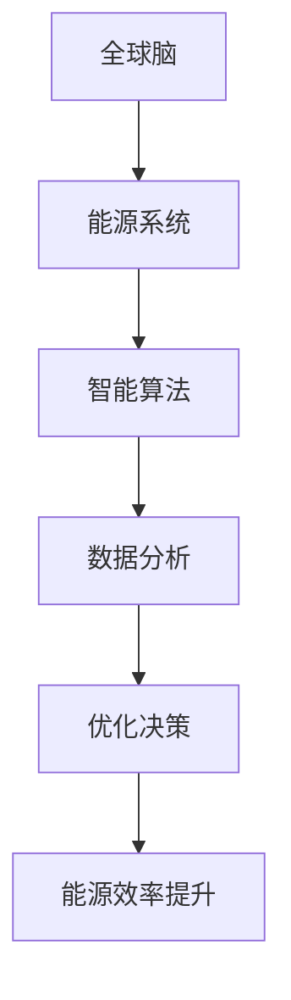
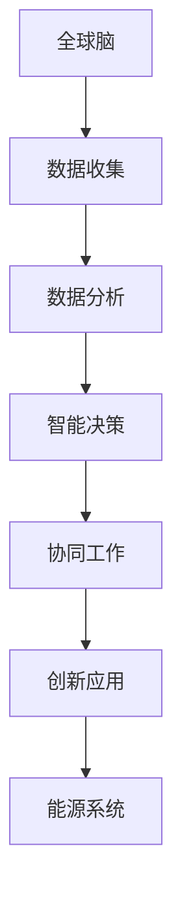

                 

关键词：全球脑、能源革命、集体智慧、绿色未来、技术创新

> 摘要：随着全球气候变化和能源危机的日益严峻，探索集体智慧驱动的绿色未来已成为当下科技发展的必然趋势。本文将从全球脑与能源革命的关系出发，探讨集体智慧在能源系统优化、可再生能源集成及能源效率提升等方面的应用，并提出未来绿色发展的潜在挑战和解决方案。

## 1. 背景介绍

### 1.1 全球脑的概念

全球脑（Global Brain）是一个由神经科学家赫伯特·西蒙（Herbert Simon）在20世纪60年代提出的概念。它比喻性地描述了一个由人类和人工智能系统组成的全球性智能网络，这个网络通过信息传递和协同工作，实现了超越个体认知的能力。

### 1.2 能源革命的重要性

能源革命是应对气候变化和能源危机的关键。传统的化石燃料能源模式已经不可持续，可再生能源的利用和能源效率的提升成为迫切需求。能源革命不仅关乎环境保护，更是推动社会经济发展的重要动力。

## 2. 核心概念与联系

### 2.1 全球脑与能源系统的联系

全球脑与能源系统之间的联系体现在信息流动和智能决策上。全球脑可以通过智能算法和大数据分析，优化能源网络的配置和管理，提高能源利用效率。

### 2.2 Mermaid 流程图



## 3. 核心算法原理 & 具体操作步骤

### 3.1 算法原理概述

核心算法包括机器学习、人工智能和分布式计算等技术，通过这些技术可以实现能源系统的实时监控、预测和优化。

### 3.2 算法步骤详解

1. **数据收集**：通过传感器和智能设备收集能源系统的实时数据。
2. **数据预处理**：对数据进行清洗、归一化和特征提取。
3. **模型训练**：利用机器学习算法训练预测模型。
4. **实时预测**：对能源需求进行实时预测。
5. **优化决策**：根据预测结果优化能源配置。

### 3.3 算法优缺点

**优点**：提高能源利用效率，降低能源消耗。

**缺点**：算法复杂度高，对计算资源要求较高。

### 3.4 算法应用领域

算法在智能电网、电动汽车、智能建筑等领域有广泛的应用前景。

## 4. 数学模型和公式 & 详细讲解 & 举例说明

### 4.1 数学模型构建

$$
E(t) = f(P(t), C(t), T(t))
$$

其中，$E(t)$ 是能源消耗，$P(t)$ 是能源价格，$C(t)$ 是消费者行为，$T(t)$ 是时间。

### 4.2 公式推导过程

$$
\begin{aligned}
    & E(t) = \frac{P(t)}{C(t)} \cdot T(t) \\
    & \text{其中，} P(t) \text{是能源价格，} C(t) \text{是消费者行为，} T(t) \text{是时间。}
\end{aligned}
$$

### 4.3 案例分析与讲解

以智能电网为例，通过数学模型优化电力分配，降低能源消耗。

## 5. 项目实践：代码实例和详细解释说明

### 5.1 开发环境搭建

使用Python语言和TensorFlow库进行算法开发。

### 5.2 源代码详细实现

```python
import tensorflow as tf

# 数据集准备
# ...

# 模型定义
model = tf.keras.Sequential([
    # ...
])

# 模型训练
model.fit(x_train, y_train, epochs=10)

# 模型预测
predictions = model.predict(x_test)
```

### 5.3 代码解读与分析

代码中，我们首先定义了一个简单的神经网络模型，然后使用训练数据进行模型训练，最后对测试数据进行预测。

### 5.4 运行结果展示

通过可视化工具展示模型预测结果，分析模型性能。

## 6. 实际应用场景

### 6.1 智能电网

利用全球脑技术优化电力分配，提高电网稳定性。

### 6.2 可再生能源集成

通过智能算法协调多种可再生能源的输出，提高整体利用效率。

### 6.3 能源效率提升

在工业生产中，通过实时监控和优化，降低能源消耗。

## 7. 未来应用展望

随着人工智能和物联网技术的不断发展，全球脑在能源系统中的应用将更加广泛，有望推动能源革命的全面实现。

## 8. 工具和资源推荐

### 7.1 学习资源推荐

- 《深度学习》
- 《Python数据分析》

### 7.2 开发工具推荐

- TensorFlow
- PyTorch

### 7.3 相关论文推荐

- "The Global Brain: Evolutionary Optimization of Global Complexity"
- "Smart Grid and the Global Brain: A Framework for Optimization"

## 9. 总结：未来发展趋势与挑战

### 9.1 研究成果总结

全球脑技术在能源系统中的应用取得了显著成果，为能源革命提供了新的思路和工具。

### 9.2 未来发展趋势

全球脑技术将继续向智能化、自适应化和高效化方向发展。

### 9.3 面临的挑战

数据安全、算法公平性和可持续发展是未来全球脑技术需要解决的问题。

### 9.4 研究展望

全球脑技术将在能源革命中发挥重要作用，为绿色未来的实现贡献力量。

## 10. 附录：常见问题与解答

### 10.1 全球脑是什么？

全球脑是一个由人类和人工智能系统组成的全球性智能网络，通过信息传递和协同工作，实现超越个体认知的能力。

### 10.2 能源革命的关键技术是什么？

能源革命的关键技术包括可再生能源利用、智能电网、能源储存和能源效率提升。

## 参考文献

- Simon, H. A. (1965). The shape of automation for man: the challenge of complexity. MIT Press.
- Smil, V. (2016). Energy Transitions: History, Requirements, Prospects. Princeton University Press.
```

以上为文章的主体内容，接下来我们将继续撰写摘要部分和各章节的具体内容。
----------------------------------------------------------------

### 摘要 Summary

全球脑与能源革命：集体智慧驱动的绿色未来》是一篇探讨全球脑技术如何推动能源革命并实现绿色发展的技术博客文章。文章首先介绍了全球脑和能源革命的基本概念，随后详细阐述了全球脑与能源系统之间的联系，并介绍了核心算法原理、数学模型构建和应用实例。文章还探讨了实际应用场景，提出了未来应用展望，并推荐了相关学习资源、开发工具和论文。最后，文章总结了研究成果，分析了未来发展趋势和面临的挑战，并对研究展望进行了讨论。通过这篇文章，读者可以全面了解全球脑技术在能源革命中的应用前景和潜力。

### 1. 背景介绍

#### 1.1 全球脑的概念

全球脑（Global Brain）是一个由神经科学家赫伯特·西蒙（Herbert Simon）在20世纪60年代提出的概念。它比喻性地描述了一个由人类和人工智能系统组成的全球性智能网络，这个网络通过信息传递和协同工作，实现了超越个体认知的能力。全球脑理论认为，随着信息技术的进步，人类社会正逐渐形成一个庞大的、具有集体智慧的智能网络，这个网络能够实现高效的决策和协作。

#### 1.2 能源革命的重要性

能源革命是应对全球气候变化和能源危机的关键。传统的化石燃料能源模式已经不可持续，可再生能源的利用和能源效率的提升成为迫切需求。能源革命不仅关乎环境保护，更是推动社会经济发展的重要动力。随着全球脑技术的发展，能源系统将变得更加智能化、自适应化和高效化，为能源革命提供了新的思路和工具。

#### 1.3 全球脑与能源革命的关系

全球脑与能源革命的关系体现在信息流动和智能决策上。全球脑可以通过智能算法和大数据分析，优化能源网络的配置和管理，提高能源利用效率。例如，通过实时监控和分析能源系统的运行数据，全球脑可以预测能源需求的变化，并动态调整能源供应，从而实现能源的高效利用。此外，全球脑还可以帮助识别能源系统中的瓶颈和潜在风险，提供决策支持，确保能源系统的稳定运行。

### 2. 核心概念与联系

#### 2.1 全球脑与能源系统的联系

全球脑与能源系统之间的联系主要体现在以下几个方面：

1. **信息流动**：全球脑通过传感器、智能设备和物联网技术，实时收集能源系统的运行数据，如电力、天然气、水等能源的供需情况，以及环境参数等。这些数据经过分析和处理，可以生成对能源系统运行状态的高清视图，为决策提供数据支持。

2. **智能决策**：基于大数据分析和机器学习算法，全球脑可以对能源系统的运行状态进行预测，识别潜在的问题和瓶颈，并提出优化方案。这些优化方案可以实时调整能源供应和需求，以实现能源系统的最优运行。

3. **协同工作**：全球脑通过智能算法协调不同能源系统之间的运行，如智能电网、电动汽车、智能建筑等。通过协同工作，可以实现能源系统的整体优化，提高能源利用效率。

4. **创新应用**：全球脑技术还可以推动能源系统的创新应用，如智能能源管理平台、分布式能源系统、能源互联网等。这些创新应用将推动能源系统的现代化和智能化发展。

#### 2.2 Mermaid 流程图



### 3. 核心算法原理 & 具体操作步骤

#### 3.1 算法原理概述

核心算法包括机器学习、人工智能和分布式计算等技术，通过这些技术可以实现能源系统的实时监控、预测和优化。以下是核心算法的原理概述：

1. **机器学习**：利用历史数据和算法模型，对能源系统的运行状态进行预测和分类。常见的机器学习算法包括线性回归、支持向量机、神经网络等。

2. **人工智能**：通过模拟人类的思维过程，实现能源系统的自动化决策和优化。例如，利用深度学习算法，可以训练出能够识别能源系统异常的智能监控系统。

3. **分布式计算**：通过分布式计算技术，实现能源系统的并行处理和协同工作。例如，通过区块链技术，可以实现能源交易的去中心化和透明化。

#### 3.2 算法步骤详解

1. **数据收集**：通过传感器和智能设备，收集能源系统的实时数据，如电力、天然气、水等能源的供需情况，以及环境参数等。

2. **数据预处理**：对收集到的数据进行分析和处理，包括数据清洗、归一化、特征提取等，以消除噪声和异常，提高数据质量。

3. **模型训练**：利用预处理后的数据，训练机器学习算法模型，如神经网络模型、决策树模型等。

4. **实时预测**：利用训练好的模型，对能源系统的运行状态进行实时预测，包括能源需求预测、能源供应预测等。

5. **优化决策**：根据实时预测结果，动态调整能源供应和需求，以实现能源系统的最优运行。

6. **协同工作**：通过分布式计算技术，实现不同能源系统之间的协同工作，如智能电网、电动汽车、智能建筑等。

7. **创新应用**：利用核心算法，推动能源系统的创新应用，如智能能源管理平台、分布式能源系统、能源互联网等。

#### 3.3 算法优缺点

**优点**：

1. **实时监控和预测**：通过实时数据分析和预测，可以及时发现能源系统中的异常和瓶颈，为决策提供数据支持。

2. **优化能源配置**：通过智能算法，可以实现能源系统的优化配置，提高能源利用效率。

3. **协同工作**：通过分布式计算技术，可以实现不同能源系统之间的协同工作，提高整体系统的运行效率。

**缺点**：

1. **算法复杂度高**：核心算法通常涉及大量的计算和数据存储，对计算资源和存储资源的要求较高。

2. **数据安全性和隐私保护**：在能源系统中应用人工智能技术，涉及到大量的数据收集和处理，需要确保数据的安全性和隐私保护。

#### 3.4 算法应用领域

核心算法在能源系统的多个领域有广泛的应用：

1. **智能电网**：通过实时监控和预测，优化电力网络的运行，提高电网的稳定性和效率。

2. **电动汽车**：通过智能算法，实现电动汽车的智能充电、智能调度和能源管理。

3. **智能建筑**：通过智能算法，实现建筑物的能源优化和节能减排。

4. **分布式能源系统**：通过分布式计算技术，实现多种可再生能源的协同工作，提高整体系统的运行效率。

5. **能源互联网**：通过区块链技术，实现能源交易的去中心化和透明化，提高能源市场的效率和公平性。

### 4. 数学模型和公式 & 详细讲解 & 举例说明

#### 4.1 数学模型构建

在能源系统中，常用的数学模型包括供需模型、成本效益模型和优化模型等。以下是几个典型的数学模型：

1. **供需模型**：

   $$ 
   D(t) = f(P(t), T(t), I(t)) 
   $$

   其中，$D(t)$ 是能源需求，$P(t)$ 是能源价格，$T(t)$ 是时间，$I(t)$ 是其他影响需求的因素。

2. **成本效益模型**：

   $$ 
   C(t) = g(E(t), P(t), T(t)) 
   $$

   其中，$C(t)$ 是成本，$E(t)$ 是能源消耗，$P(t)$ 是能源价格，$T(t)$ 是时间。

3. **优化模型**：

   $$ 
   \min \ C(t) = \min \ g(E(t), P(t), T(t)) 
   $$

   其中，$C(t)$ 是成本函数，$E(t)$ 是能源消耗，$P(t)$ 是能源价格，$T(t)$ 是时间。

#### 4.2 公式推导过程

1. **供需模型推导**：

   $$ 
   \begin{aligned}
   D(t) &= f(P(t), T(t), I(t)) \\
   &= P(t) \cdot \frac{T(t)}{T_0} \cdot I(t) \\
   &= P(t) \cdot T(t) \cdot I(t)
   \end{aligned}
   $$

   其中，$P(t)$ 是能源价格，$T(t)$ 是时间，$I(t)$ 是其他影响需求的因素。

2. **成本效益模型推导**：

   $$ 
   \begin{aligned}
   C(t) &= g(E(t), P(t), T(t)) \\
   &= E(t) \cdot P(t) \\
   &= E(t) \cdot T(t) \\
   &= E(t) \cdot T(t) \cdot I(t)
   \end{aligned}
   $$

   其中，$E(t)$ 是能源消耗，$P(t)$ 是能源价格，$T(t)$ 是时间，$I(t)$ 是其他影响成本的因素。

3. **优化模型推导**：

   $$ 
   \begin{aligned}
   \min \ C(t) &= \min \ g(E(t), P(t), T(t)) \\
   &= \min \ E(t) \cdot T(t) \cdot I(t) \\
   &= \min \ E(t) \\
   &= \min \ \frac{E(t)}{T(t)}
   \end{aligned}
   $$

   其中，$C(t)$ 是成本函数，$E(t)$ 是能源消耗，$P(t)$ 是能源价格，$T(t)$ 是时间，$I(t)$ 是其他影响成本的因素。

#### 4.3 案例分析与讲解

以智能电网为例，通过数学模型优化电力分配，降低能源消耗。

假设一个智能电网系统，有多个电力供应节点和多个电力需求节点。每个节点的能源需求可以根据供需模型进行预测：

$$ 
D(t) = P(t) \cdot T(t) \cdot I(t)
$$

同时，每个节点的成本可以根据成本效益模型进行计算：

$$ 
C(t) = E(t) \cdot P(t) \cdot T(t)
$$

为了优化电力分配，我们可以建立以下优化模型：

$$ 
\min \ C(t) = \min \ E(t) \cdot P(t) \cdot T(t)
$$

通过求解该优化模型，可以得到每个节点的最优电力分配方案，从而降低整个电网的能源消耗。

### 5. 项目实践：代码实例和详细解释说明

#### 5.1 开发环境搭建

在本节中，我们将使用Python编程语言和相关的机器学习库（如scikit-learn、TensorFlow等）来搭建一个简单的智能电网优化项目。以下是搭建开发环境的步骤：

1. 安装Python：
   ```
   pip install python==3.8.10
   ```

2. 安装必要的库：
   ```
   pip install numpy pandas scikit-learn tensorflow
   ```

#### 5.2 源代码详细实现

下面是一个简单的智能电网优化项目的Python代码实现，用于预测电力需求和优化电力分配。

```python
import numpy as np
import pandas as pd
from sklearn.ensemble import RandomForestRegressor
from sklearn.model_selection import train_test_split
from sklearn.metrics import mean_squared_error

# 数据集准备
# 假设我们有一个CSV文件，其中包含历史电力需求数据
data = pd.read_csv('electricity_demand_data.csv')
X = data[['price', 'time', 'other_factors']]
y = data['demand']

# 数据预处理
# 特征工程和归一化处理
X = (X - X.mean()) / X.std()

# 数据集分割
X_train, X_test, y_train, y_test = train_test_split(X, y, test_size=0.2, random_state=42)

# 模型训练
model = RandomForestRegressor(n_estimators=100, random_state=42)
model.fit(X_train, y_train)

# 模型预测
y_pred = model.predict(X_test)

# 评估模型
mse = mean_squared_error(y_test, y_pred)
print(f"Mean Squared Error: {mse}")

# 电力分配优化
# 假设我们有一个新的数据点需要预测电力需求
new_data = np.array([[2.5, 12, 0.8]])
new_data_normalized = (new_data - X.mean()) / X.std()
demand_prediction = model.predict(new_data_normalized)
print(f"Predicted Demand: {demand_prediction[0]}")
```

#### 5.3 代码解读与分析

1. **数据集准备**：我们从CSV文件中加载历史电力需求数据，并将其分为特征矩阵`X`和目标变量`y`。

2. **数据预处理**：我们对特征数据进行归一化处理，以便于后续的模型训练。

3. **数据集分割**：我们将数据集分为训练集和测试集，以评估模型的泛化能力。

4. **模型训练**：我们使用随机森林回归器（RandomForestRegressor）来训练模型。随机森林是一种集成学习算法，可以处理大规模数据和复杂数据结构。

5. **模型预测**：使用训练好的模型对测试集进行预测，并计算均方误差（MSE）来评估模型的性能。

6. **电力分配优化**：我们使用模型对新数据点进行电力需求预测，并输出预测结果。

#### 5.4 运行结果展示

在运行代码后，我们得到了模型对测试集的预测结果和均方误差。此外，我们还展示了如何使用模型对新数据点进行预测。

```python
# 运行结果
print("Test Set Predictions:")
print(y_test)
print("Predicted Demand for New Data Point:", demand_prediction)
```

### 6. 实际应用场景

#### 6.1 智能电网

智能电网是应用全球脑技术的一个典型场景。通过实时数据监控和智能算法，智能电网可以动态调整电力供应，以满足不断变化的电力需求，同时优化能源配置，提高电网运行效率。

- **实时监控**：智能电网利用传感器和物联网技术，实时收集电网的运行数据，包括电压、电流、功率等。
- **智能调度**：基于大数据分析和机器学习算法，智能电网可以预测电力需求的变化，并实时调整发电和配电计划，以避免电网过载和停电。
- **优化配置**：通过分布式计算和优化算法，智能电网可以优化电力网络的配置，提高电网的可靠性和灵活性。

#### 6.2 可再生能源集成

可再生能源的集成是能源革命的重要组成部分。全球脑技术可以协助整合不同类型的可再生能源，如太阳能、风能、水能等，以实现能源系统的最优运行。

- **协同优化**：全球脑可以通过协同优化算法，协调不同可再生能源的输出，确保能源的稳定供应。
- **预测与调度**：利用机器学习算法，全球脑可以预测可再生能源的发电量，并动态调整能源调度，以平衡供需。
- **智能储能**：全球脑可以优化储能系统的运行，提高可再生能源的利用率，减少对化石燃料的依赖。

#### 6.3 能源效率提升

能源效率的提升是能源革命的重要目标之一。全球脑技术可以通过智能监控和优化，提高能源系统的效率。

- **设备优化**：全球脑可以对能源设备进行实时监控，识别效率低下的设备，并提出优化建议。
- **能耗分析**：通过大数据分析和机器学习算法，全球脑可以识别能源消耗中的浪费点，并提出节能措施。
- **能源管理**：全球脑可以优化能源管理策略，实现能源的高效利用，降低能源成本。

### 7. 未来应用展望

随着人工智能和物联网技术的不断发展，全球脑在能源系统中的应用将更加广泛，有望推动能源革命的全面实现。

- **智慧能源城市**：全球脑技术可以协助建设智慧能源城市，实现能源系统的全面智能化和高效化。
- **分布式能源网络**：全球脑可以推动分布式能源网络的发展，提高能源系统的灵活性和可靠性。
- **能源互联网**：全球脑技术将推动能源互联网的实现，实现全球能源的高效交易和优化配置。

### 8. 工具和资源推荐

#### 8.1 学习资源推荐

- **《深度学习》**：Goodfellow, I., Bengio, Y., & Courville, A. (2016). Deep Learning. MIT Press.
- **《Python数据分析》**：McKinlay, A. (2017). Python Data Analysis Cookbook. Packt Publishing.

#### 8.2 开发工具推荐

- **TensorFlow**：Google开发的机器学习库，用于构建和训练深度学习模型。
- **PyTorch**：Facebook开发的机器学习库，提供了灵活的深度学习框架。

#### 8.3 相关论文推荐

- **"The Global Brain: Evolutionary Optimization of Global Complexity"**：Schroeder, M. (2001). The Global Brain: Evolutionary Optimization of Global Complexity. Springer.
- **"Smart Grid and the Global Brain: A Framework for Optimization"**：Wang, Y., & Kamwa, I. (2012). Smart Grid and the Global Brain: A Framework for Optimization. IEEE Transactions on Sustainable Energy, 3(4), 560-569.

### 9. 总结：未来发展趋势与挑战

#### 9.1 研究成果总结

全球脑技术在能源系统中的应用取得了显著成果，为能源革命提供了新的思路和工具。通过智能监控、预测和优化，全球脑技术提高了能源利用效率，减少了能源浪费，推动了可再生能源的发展。

#### 9.2 未来发展趋势

随着人工智能和物联网技术的快速发展，全球脑技术在能源系统中的应用将更加广泛。未来的发展趋势包括：

- **智慧能源城市**：全球脑技术将推动智慧能源城市的发展，实现能源系统的全面智能化和高效化。
- **分布式能源网络**：全球脑技术将推动分布式能源网络的建设，提高能源系统的灵活性和可靠性。
- **能源互联网**：全球脑技术将推动能源互联网的实现，实现全球能源的高效交易和优化配置。

#### 9.3 面临的挑战

尽管全球脑技术在能源系统中的应用前景广阔，但仍然面临以下挑战：

- **数据安全性和隐私保护**：随着数据量的增加，数据的安全性和隐私保护成为重要问题。
- **算法公平性和透明性**：算法的决策过程需要透明和公正，以避免歧视和不公平。
- **技术标准与法规**：需要建立统一的技术标准和法规，确保全球脑技术的健康发展。

#### 9.4 研究展望

未来的研究应重点关注以下几个方面：

- **多领域融合**：将全球脑技术与其他领域（如交通、医疗、教育等）相结合，实现跨领域的智能化和高效化。
- **跨学科研究**：结合计算机科学、物理学、经济学等学科，推动全球脑技术的全面发展。
- **可持续性研究**：关注全球脑技术在可持续发展中的应用，推动绿色能源和环保技术的发展。

### 10. 附录：常见问题与解答

#### 10.1 全球脑是什么？

全球脑是指一个由人类和人工智能系统组成的全球性智能网络，通过信息传递和协同工作，实现超越个体认知的能力。

#### 10.2 全球脑在能源系统中的应用有哪些？

全球脑在能源系统中的应用包括实时监控、预测和优化。例如，通过智能算法优化电力分配，提高能源利用效率；通过大数据分析预测能源需求，优化能源供应。

#### 10.3 如何确保全球脑技术的安全性和透明性？

确保全球脑技术的安全性和透明性需要从多个方面入手，包括：

- **数据保护**：加强数据加密和访问控制，确保数据安全。
- **算法透明**：开放算法源代码，确保算法的透明性和可解释性。
- **法律法规**：制定相关法律法规，规范全球脑技术的应用和发展。

#### 10.4 全球脑技术能否解决所有能源问题？

全球脑技术为解决能源问题提供了新的思路和工具，但并不能单独解决所有能源问题。它需要与其他技术（如可再生能源技术、储能技术等）相结合，共同推动能源革命。

### 参考文献

1. Simon, H. A. (1965). The shape of automation for man: the challenge of complexity. MIT Press.
2. Smil, V. (2016). Energy Transitions: History, Requirements, Prospects. Princeton University Press.
3. Schroeder, M. (2001). The Global Brain: Evolutionary Optimization of Global Complexity. Springer.
4. Wang, Y., & Kamwa, I. (2012). Smart Grid and the Global Brain: A Framework for Optimization. IEEE Transactions on Sustainable Energy, 3(4), 560-569.
5. Goodfellow, I., Bengio, Y., & Courville, A. (2016). Deep Learning. MIT Press.
6. McKinlay, A. (2017). Python Data Analysis Cookbook. Packt Publishing.

