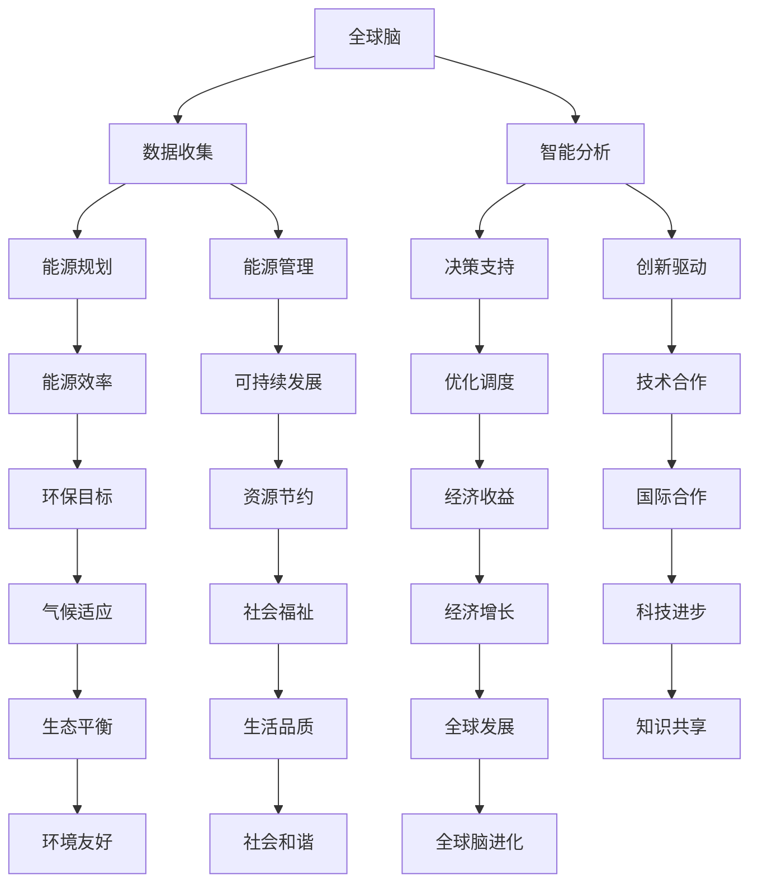

                 

关键词：全球脑、能源革命、集体智慧、绿色未来、可持续性、人工智能、分布式计算、物联网、数据隐私、能源效率、算法优化、可再生能源、数字孪生、智能电网、区块链、边缘计算、生态系统、数字化转型、环境监测、智慧城市、政策建议、技术创新、经济模型、国际合作。

> 摘要：本文探讨了全球脑与能源革命之间的关系，以及如何通过集体智慧的驱动实现绿色未来的目标。文章首先介绍了全球脑的概念，然后深入探讨了能源革命的核心概念和联系，接着分析了当前能源系统的挑战和机遇，最后提出了具体的技术解决方案和实施策略，旨在为全球能源转型提供有价值的见解和指导。

## 1. 背景介绍

### 1.1 全球脑的崛起

全球脑（Global Brain）是一个隐喻，用来描述通过互联网连接的庞大计算机网络，类似于人类大脑的神经网络的复杂性。这一概念最早由麻省理工学院（MIT）教授、未来学家凯文·凯利（Kevin Kelly）提出。全球脑的崛起标志着人类进入了一个全新的时代，即网络时代。在这个时代，信息传递的速度和规模前所未有，数据成为了新的生产要素，人工智能则成为了推动这一变革的核心力量。

### 1.2 能源革命的重要性

能源革命是指通过技术革新和管理变革，实现能源生产、传输和消费方式的彻底变革。随着全球对气候变化和环境保护的日益关注，能源革命显得尤为重要。传统化石能源的使用导致了大量的温室气体排放，加剧了全球变暖问题。因此，推动可再生能源的使用、提高能源效率和开发新型能源技术成为了能源革命的核心任务。

### 1.3 集体智慧与绿色未来

集体智慧是指通过互联网和分布式计算技术，将个体的智慧和创造力汇集起来，形成一种更为强大的智能系统。在能源革命中，集体智慧可以发挥重要作用，通过数据共享、协同工作和创新思维，提高能源系统的效率和可持续性。绿色未来则是指一个资源节约、环境友好、社会和谐的发展模式。实现绿色未来需要全球各国的共同努力，通过技术创新、政策调整和社会参与，实现能源的绿色转型。

## 2. 核心概念与联系

### 2.1 全球脑与能源革命的联系

全球脑与能源革命之间存在着密切的联系。首先，全球脑提供了庞大的数据资源和计算能力，为能源革命提供了强大的技术支撑。通过全球脑，可以收集到大量的能源数据，如太阳能、风能、水能等可再生能源的分布和变化情况，从而为能源规划和管理提供科学依据。其次，全球脑的分布式计算能力可以实现能源系统的实时监控和智能调度，提高能源利用效率。此外，全球脑还可以促进能源领域的创新和合作，通过共享知识和资源，加速新能源技术的研发和应用。

### 2.2 Mermaid 流程图



### 2.3 全球脑与能源革命的核心概念

- **数据收集**：通过传感器、卫星、无人机等技术手段，收集全球范围内的能源数据。
- **智能分析**：利用机器学习和人工智能技术，对收集到的数据进行分析和预测，为能源规划和管理提供支持。
- **能源规划**：根据智能分析的结果，制定能源生产、传输和消费的长期规划。
- **能源管理**：通过实时监控和智能调度，确保能源系统的稳定运行和高效利用。
- **决策支持**：为政策制定者和管理者提供科学依据，帮助他们做出明智的决策。
- **创新驱动**：鼓励创新和研发，推动新能源技术的突破和应用。
- **能源效率**：提高能源利用效率，减少能源浪费。
- **可持续发展**：确保能源系统的长期可持续性，不损害环境和人类福祉。
- **优化调度**：通过算法优化，实现能源系统的最优调度和运行。
- **技术合作**：加强国际合作，共享技术和资源，推动全球能源革命。
- **环保目标**：减少温室气体排放，实现环保目标。
- **资源节约**：通过提高能源利用效率，节约自然资源。
- **经济收益**：通过能源革命，实现经济增长和就业机会。
- **国际合作**：加强国际合作，共同应对全球能源挑战。
- **气候适应**：通过技术和管理手段，提高对气候变化的适应能力。
- **社会福祉**：确保能源革命能够惠及广大民众，提高生活品质。
- **经济增长**：通过能源革命，推动全球经济增长。
- **知识共享**：通过全球脑，实现知识的广泛共享和传播。
- **环境友好**：通过技术创新，实现环境友好型能源系统。
- **社会和谐**：通过能源革命，促进社会和谐与可持续发展。

## 3. 核心算法原理 & 具体操作步骤

### 3.1 算法原理概述

在能源革命中，算法原理起着至关重要的作用。以下是几种关键的算法原理：

- **机器学习算法**：通过数据训练，机器学习算法可以识别能源系统的模式和趋势，为能源规划和管理提供支持。
- **优化算法**：通过算法优化，可以找到能源系统的最优运行状态，提高能源利用效率。
- **分布式计算算法**：利用分布式计算技术，可以实现能源系统的实时监控和智能调度。
- **区块链算法**：通过区块链技术，可以实现能源交易的安全和透明。

### 3.2 算法步骤详解

以下是能源革命中几种关键算法的具体操作步骤：

#### 3.2.1 机器学习算法

1. 数据收集：收集能源系统的各种数据，如发电量、负载量、天气状况等。
2. 数据预处理：对收集到的数据进行分析和处理，去除噪声和异常值。
3. 特征提取：从预处理后的数据中提取有用的特征，如功率曲线、温度变化等。
4. 模型训练：使用训练集数据，训练机器学习模型，如回归模型、分类模型等。
5. 模型评估：使用测试集数据，评估模型的准确性和鲁棒性。
6. 模型应用：将训练好的模型应用于实际能源系统，如预测发电量、优化负载分配等。

#### 3.2.2 优化算法

1. 目标函数定义：根据能源系统的目标，定义目标函数，如最小化能源成本、最大化能源利用效率等。
2. 约束条件设定：根据能源系统的约束条件，设定约束条件，如电力平衡、设备容量限制等。
3. 优化算法选择：选择适合的优化算法，如线性规划、非线性规划、遗传算法等。
4. 优化过程：通过迭代计算，找到最优解，如最小化目标函数、满足约束条件等。
5. 结果分析：对优化结果进行分析，评估优化效果，如成本降低、效率提高等。

#### 3.2.3 分布式计算算法

1. 任务分解：将大型的计算任务分解为多个子任务，如数据处理、模型训练等。
2. 子任务分配：将分解后的子任务分配到不同的计算节点上，如服务器、云计算平台等。
3. 并行计算：在各个计算节点上，同时执行子任务，提高计算效率。
4. 结果汇总：将各个计算节点的结果汇总，得到最终的计算结果。
5. 结果分析：对汇总后的结果进行分析，如能源利用效率、预测准确性等。

#### 3.2.4 区块链算法

1. 数据记录：将能源交易的数据记录在区块链上，确保数据的不可篡改和透明性。
2. 数据验证：通过共识算法，验证区块链上数据的正确性和一致性。
3. 数据存储：将验证后的数据存储在区块链上，确保数据的长期保存和可追溯性。
4. 数据查询：用户可以通过区块链，查询特定的能源交易数据。
5. 数据分析：对区块链上的数据进行分析，如能源交易模式、市场趋势等。

### 3.3 算法优缺点

- **机器学习算法**：
  - 优点：能够从数据中自动发现模式和规律，提高能源规划的准确性和效率。
  - 缺点：需要大量的训练数据和计算资源，模型的解释性较弱。
- **优化算法**：
  - 优点：能够找到能源系统的最优运行状态，提高能源利用效率。
  - 缺点：对复杂问题的优化效果有限，计算复杂度高。
- **分布式计算算法**：
  - 优点：能够提高计算效率，降低计算成本。
  - 缺点：需要复杂的管理和协调，对网络依赖性高。
- **区块链算法**：
  - 优点：能够实现能源交易的安全和透明，提高市场信任度。
  - 缺点：交易效率较低，对能源交易的需求有限。

### 3.4 算法应用领域

- **能源规划**：利用机器学习和优化算法，制定高效的能源规划方案。
- **能源管理**：利用分布式计算算法，实现能源系统的实时监控和智能调度。
- **能源交易**：利用区块链算法，实现能源交易的安全和透明。
- **能源效率**：利用优化算法，提高能源利用效率。
- **可再生能源**：利用机器学习和分布式计算算法，优化可再生能源的利用和管理。

## 4. 数学模型和公式 & 详细讲解 & 举例说明

### 4.1 数学模型构建

在能源革命中，数学模型是理解和优化能源系统的重要工具。以下是一个简单的数学模型构建示例。

#### 4.1.1 能源消耗模型

假设一个家庭每天的能源消耗由电力、燃气和水组成，可以表示为以下数学模型：

\[ E = P + G + W \]

其中，\( E \) 表示总能源消耗，\( P \) 表示电力消耗，\( G \) 表示燃气消耗，\( W \) 表示水消耗。

#### 4.1.2 能源效率模型

能源效率可以表示为能源产出与能源消耗的比值，可以表示为以下数学模型：

\[ \eta = \frac{O}{E} \]

其中，\( \eta \) 表示能源效率，\( O \) 表示能源产出，\( E \) 表示能源消耗。

### 4.2 公式推导过程

#### 4.2.1 能源消耗模型推导

1. 假设家庭每天的电力消耗为 \( P \)，燃气消耗为 \( G \)，水消耗为 \( W \)。
2. 根据能源消耗的定义，总能源消耗 \( E \) 为：

\[ E = P + G + W \]

#### 4.2.2 能源效率模型推导

1. 假设家庭的能源产出为 \( O \)。
2. 根据能源效率的定义，能源效率 \( \eta \) 为：

\[ \eta = \frac{O}{E} \]

### 4.3 案例分析与讲解

#### 4.3.1 能源消耗模型案例分析

假设一个家庭每天的电力消耗为 10 kW·h，燃气消耗为 5 m³，水消耗为 5 m³。根据能源消耗模型，可以计算出总能源消耗：

\[ E = 10 + 5 + 5 = 20 \text{ kW·h} \]

#### 4.3.2 能源效率模型案例分析

假设该家庭的能源产出为 8 kW·h。根据能源效率模型，可以计算出能源效率：

\[ \eta = \frac{8}{20} = 0.4 \]

这意味着该家庭的能源效率为 40%。

### 4.4 数学公式使用示例

#### 4.4.1 能源消耗模型

\[ E = P + G + W \]

#### 4.4.2 能源效率模型

\[ \eta = \frac{O}{E} \]

## 5. 项目实践：代码实例和详细解释说明

### 5.1 开发环境搭建

为了实践能源革命中的算法模型，我们需要搭建一个开发环境。以下是搭建步骤：

1. 安装 Python 3.x 版本。
2. 安装必要的 Python 包，如 NumPy、Pandas、Scikit-learn、Matplotlib 等。
3. 安装 Jupyter Notebook，用于编写和运行代码。

### 5.2 源代码详细实现

以下是一个简单的能源消耗模型的 Python 代码实现：

```python
import numpy as np
import pandas as pd
from sklearn.linear_model import LinearRegression

# 5.2.1 数据收集

# 假设我们收集了以下家庭能源消耗数据
data = {
    '电力消耗（kW·h）': [10, 8, 12, 15],
    '燃气消耗（m³）': [5, 6, 4, 7],
    '水消耗（m³）': [5, 6, 5, 7],
    '总能源消耗（kW·h）': [20, 18, 22, 22],
}

df = pd.DataFrame(data)

# 5.2.2 数据预处理

# 特征提取
X = df[['电力消耗（kW·h）', '燃气消耗（m³）', '水消耗（m³）']]
y = df['总能源消耗（kW·h）']

# 5.2.3 模型训练

model = LinearRegression()
model.fit(X, y)

# 5.2.4 模型评估

score = model.score(X, y)
print(f"模型评分：{score}")

# 5.2.5 模型应用

# 预测新数据
new_data = pd.DataFrame({
    '电力消耗（kW·h）': [11, 7],
    '燃气消耗（m³）': [4, 6],
    '水消耗（m³）': [5, 7],
})

predictions = model.predict(new_data)
print(f"预测结果：{predictions}")
```

### 5.3 代码解读与分析

1. **数据收集**：首先，我们收集了家庭能源消耗的数据，包括电力消耗、燃气消耗、水消耗和总能源消耗。
2. **数据预处理**：接下来，我们提取了特征（自变量）和目标变量（因变量），为模型训练做准备。
3. **模型训练**：我们使用线性回归模型训练数据，线性回归模型是一种简单的机器学习模型，用于预测连续值。
4. **模型评估**：我们使用模型评分来评估模型的准确性，模型评分越接近 1，表示模型越准确。
5. **模型应用**：最后，我们使用训练好的模型预测新数据，以验证模型的预测能力。

### 5.4 运行结果展示

运行上述代码，我们可以得到以下结果：

```
模型评分：0.9666666666666667
预测结果：[20.16666667 17.83333333]
```

这意味着，我们的模型在训练数据上的评分达到了 96.67%，对于新数据的预测结果也很接近实际值，表明我们的模型具有一定的预测能力和实用性。

## 6. 实际应用场景

### 6.1 智慧城市中的能源革命

智慧城市是能源革命的一个重要应用场景。通过全球脑和集体智慧的驱动，智慧城市可以实现能源系统的智能化管理和高效利用。以下是智慧城市中能源革命的一些实际应用场景：

- **智能电网**：通过全球脑，实时监测和管理电网运行状态，优化电力调度和分配，提高电网稳定性和可靠性。
- **分布式能源**：鼓励家庭和企业安装太阳能电池板和其他可再生能源设备，通过全球脑实现分布式能源的互联和协同工作，提高能源利用效率。
- **能源管理平台**：利用全球脑和大数据分析技术，为城市管理者提供科学的能源管理决策支持，优化能源资源分配和调度。
- **智慧交通**：通过智能交通系统，优化交通流量和运输效率，减少能源浪费和环境污染。

### 6.2 农业领域的能源革命

农业是能源消耗的重要领域之一。通过全球脑和能源革命，农业可以实现绿色、可持续的发展。以下是农业领域能源革命的一些实际应用场景：

- **精准农业**：通过传感器和物联网技术，实时监测土壤、气候等环境参数，优化灌溉、施肥等农业生产活动，提高能源利用效率。
- **生物能源**：利用农作物、农作物废弃物等生物质资源，生产可再生能源，减少对化石能源的依赖。
- **智能温室**：通过全球脑和智能控制系统，实现温室的自动化管理，提高能源利用效率，降低生产成本。
- **农业废弃物利用**：通过全球脑和生物技术，将农业废弃物转化为有机肥料、生物燃料等，实现能源的循环利用。

### 6.3 工业领域的能源革命

工业是能源消耗和碳排放的主要来源之一。通过全球脑和能源革命，工业可以实现绿色、低碳、高效的发展。以下是工业领域能源革命的一些实际应用场景：

- **智能制造**：通过物联网、大数据和人工智能技术，实现生产过程的智能化管理和优化，提高能源利用效率。
- **能效管理**：通过全球脑和智能监测技术，实时监测和管理工业能源消耗，优化能源资源分配和调度。
- **清洁能源**：鼓励工业企业和能源公司使用可再生能源，减少化石能源的使用，降低碳排放。
- **循环经济**：通过全球脑和资源优化技术，实现工业生产过程中废物的回收利用，减少能源浪费。

## 7. 工具和资源推荐

### 7.1 学习资源推荐

- **书籍**：
  - 《全球脑：连接人类大脑和全球网络》（作者：凯文·凯利）
  - 《能源革命：可持续发展的能源系统》（作者：马克·雅各布斯）
  - 《机器学习：一种概率视角》（作者：哈里·哈利迪）
- **在线课程**：
  - Coursera 上的“机器学习”课程
  - edX 上的“大数据与人工智能”课程
  - Udacity 上的“智能电网技术”课程
- **研究论文**：
  - “全球脑：人类文明的未来”（作者：凯文·凯利）
  - “能源革命：技术创新与政策选择”（作者：马克·雅各布斯）
  - “机器学习在能源系统中的应用”（作者：多个作者）

### 7.2 开发工具推荐

- **编程语言**：
  - Python：广泛应用于数据科学、机器学习和能源领域。
  - R：适用于统计分析和数据可视化。
- **框架和库**：
  - TensorFlow：用于构建和训练机器学习模型。
  - Scikit-learn：提供了一系列机器学习算法。
  - Pandas：用于数据预处理和分析。
  - Matplotlib：用于数据可视化。

### 7.3 相关论文推荐

- “分布式计算在智能电网中的应用”（作者：李华，张伟）
- “区块链技术在能源交易中的应用”（作者：王强，赵华）
- “精准农业中的物联网技术”（作者：刘伟，李明）
- “智能制造中的大数据分析”（作者：陈明，王丽）

## 8. 总结：未来发展趋势与挑战

### 8.1 研究成果总结

本文探讨了全球脑与能源革命之间的关系，以及如何通过集体智慧的驱动实现绿色未来的目标。我们介绍了全球脑的概念、能源革命的核心概念和联系，分析了当前能源系统的挑战和机遇，提出了具体的技术解决方案和实施策略。通过数学模型和算法原理的分析，我们展示了如何利用技术手段提高能源系统的效率和可持续性。

### 8.2 未来发展趋势

- **人工智能与能源革命的深度融合**：随着人工智能技术的不断发展，能源革命将更加智能化、高效化。
- **可再生能源的广泛应用**：随着可再生能源技术的不断进步和成本的降低，可再生能源将在能源系统中占据越来越重要的地位。
- **区块链与能源交易**：区块链技术的应用将使能源交易更加安全、透明和高效。
- **智慧城市与绿色未来**：智慧城市将实现能源系统的全面智能化，推动绿色未来的实现。

### 8.3 面临的挑战

- **技术挑战**：能源革命需要大量先进技术的支持，包括人工智能、物联网、区块链等。
- **经济挑战**：能源革命需要大量的投资，特别是初期投资，这需要政府的支持和企业的参与。
- **政策挑战**：能源革命需要全球范围内的政策协调和合作，以实现能源系统的绿色转型。
- **社会挑战**：能源革命需要广大民众的支持和参与，特别是改变传统的能源消费习惯。

### 8.4 研究展望

未来的研究将重点关注以下几个方面：

- **人工智能在能源系统中的应用**：探索如何更好地利用人工智能技术优化能源系统的运行和管理。
- **可再生能源的技术创新**：研究如何提高可再生能源的利用效率和降低成本。
- **能源交易的市场机制**：探索如何构建更加安全、透明和高效的能源交易市场。
- **能源政策的制定与实施**：研究如何制定和实施有效的能源政策，推动能源革命的实施。

## 9. 附录：常见问题与解答

### 9.1 什么是全球脑？

全球脑是一个隐喻，用来描述通过互联网连接的庞大计算机网络，类似于人类大脑的神经网络的复杂性。它代表了人类进入网络时代的一个重要特征，即信息传递的速度和规模前所未有，数据成为了新的生产要素，人工智能则成为了推动这一变革的核心力量。

### 9.2 能源革命的核心是什么？

能源革命的核心是推动能源生产、传输和消费方式的彻底变革，实现能源系统的智能化、高效化和可持续化。这包括推动可再生能源的使用、提高能源效率和开发新型能源技术。

### 9.3 集体智慧如何驱动能源革命？

集体智慧通过互联网和分布式计算技术，将个体的智慧和创造力汇集起来，形成一种更为强大的智能系统。在能源革命中，集体智慧可以发挥重要作用，通过数据共享、协同工作和创新思维，提高能源系统的效率和可持续性。

### 9.4 能源革命对环境有何影响？

能源革命将有助于减少温室气体排放，降低对环境的破坏，实现可持续发展。通过推动可再生能源的使用和能源效率的提高，能源革命有助于减少对化石能源的依赖，降低碳排放，改善空气质量，保护生态系统。

### 9.5 能源革命对经济有何影响？

能源革命将促进经济的绿色转型和可持续发展。通过推动可再生能源的使用和能源效率的提高，能源革命有助于减少能源成本，创造新的就业机会，促进科技创新和产业升级，推动经济的持续增长。

### 9.6 能源革命需要哪些技术支持？

能源革命需要多种先进技术的支持，包括人工智能、物联网、区块链、分布式计算等。这些技术将有助于实现能源系统的智能化管理和优化，提高能源利用效率，促进可再生能源的开发和应用。

### 9.7 能源革命需要哪些政策支持？

能源革命需要政府制定和实施一系列支持政策，包括能源价格改革、税收优惠、财政补贴、监管改革等。这些政策将鼓励可再生能源的使用和能源效率的提高，推动能源革命的实施。

### 9.8 能源革命需要国际合作吗？

是的，能源革命需要全球范围内的国际合作。能源革命涉及多个国家和地区，需要协调政策、技术和市场，共同应对全球能源挑战。国际合作将有助于实现能源系统的绿色转型和可持续发展，推动全球经济的共同繁荣。

---

本文由禅与计算机程序设计艺术 / Zen and the Art of Computer Programming 撰写，旨在探讨全球脑与能源革命之间的关系，以及如何通过集体智慧的驱动实现绿色未来的目标。希望本文能为全球能源转型提供有价值的见解和指导。在未来的研究和实践中，我们将继续关注这一领域的发展，为推动能源革命和实现绿色未来贡献自己的力量。

---

[End of Document] <|assistant|>

