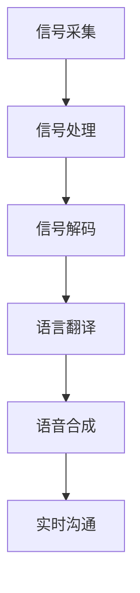

                 

关键词：脑机接口、语言翻译、实时通信、跨语言沟通、人工智能、神经科学、技术突破

> 摘要：本文旨在探讨脑机接口技术在语言翻译领域带来的革命性变革。通过分析神经科学与计算机科学的融合，揭示实时跨语言沟通的技术突破及其在实际应用场景中的潜力与挑战。

## 1. 背景介绍

随着全球化进程的不断加快，跨语言沟通的重要性愈发凸显。然而，传统的语言翻译方法往往存在诸多局限性，如延迟、准确性不足以及对于专业领域的应对能力较弱。为了解决这些问题，脑机接口（Brain-Computer Interface, BCI）技术的发展成为了一项关键途径。脑机接口通过直接连接大脑与外部设备，实现脑信号与计算机指令的转换，为实时跨语言沟通提供了新的可能性。

近年来，神经科学与计算机科学的交叉研究不断深入，推动着脑机接口技术的快速发展。通过利用大脑皮层活动中的神经信号，研究人员已经能够在一定程度上实现思维的控制和信息的传输。这一技术突破为语言翻译带来了前所未有的机遇，使得实时跨语言沟通成为可能。

## 2. 核心概念与联系

### 2.1 脑机接口原理

脑机接口技术通过直接读取大脑信号，将神经活动转化为计算机可识别的指令。这一过程主要涉及以下几个关键步骤：

1. **信号采集**：利用脑电图（EEG）、功能性磁共振成像（fMRI）等设备，采集大脑皮层活动产生的电信号。
2. **信号处理**：通过信号滤波、特征提取等处理技术，从原始信号中提取出与特定思维活动相关的特征。
3. **信号解码**：利用机器学习算法，将提取的特征与语言信息进行关联，实现思维的解码。
4. **指令生成**：将解码后的思维转化为计算机指令，通过语音合成、文字输入等方式实现信息的输出。

### 2.2 语言翻译技术

语言翻译技术主要包括以下几个核心组成部分：

1. **机器翻译模型**：基于深度学习等人工智能技术，训练出能够在多种语言之间进行准确翻译的模型。
2. **自然语言处理**：对输入的语言文本进行预处理，包括分词、词性标注、句法分析等，以便于翻译模型的处理。
3. **语音合成**：将翻译结果转换为自然流畅的语音输出，确保沟通的实时性和准确性。
4. **上下文理解**：通过上下文分析，提高翻译结果的准确性和适应性。

### 2.3 脑机接口与语言翻译的融合

脑机接口与语言翻译技术的融合，旨在通过直接读取大脑信号，实现思维的实时翻译。这一过程可以通过以下步骤实现：

1. **思维解码**：利用脑机接口技术，实时读取用户的思维信号。
2. **语言翻译**：将解码后的思维信号输入到机器翻译模型中，进行语言翻译。
3. **语音合成**：将翻译结果通过语音合成技术输出，实现实时跨语言沟通。

### 2.4 Mermaid 流程图

以下是脑机接口与语言翻译融合过程的 Mermaid 流程图：



## 3. 核心算法原理 & 具体操作步骤

### 3.1 算法原理概述

脑机接口与语言翻译的融合算法，主要包括以下几个核心原理：

1. **脑信号特征提取**：通过信号处理技术，从脑电图等设备采集的原始信号中提取出与特定思维活动相关的特征。
2. **机器学习模型训练**：利用提取的特征数据，通过机器学习算法，训练出能够准确识别和翻译不同语言的大规模语言翻译模型。
3. **实时信号解码与翻译**：通过脑机接口实时读取用户思维信号，将其解码并输入到预训练的语言翻译模型中，实现思维的实时翻译。
4. **语音合成与输出**：将翻译结果通过语音合成技术输出，实现实时跨语言沟通。

### 3.2 算法步骤详解

1. **数据采集与预处理**：
   - 使用脑电图（EEG）等设备，采集用户在大脑进行语言思维时的电信号。
   - 对原始信号进行滤波、降噪等预处理，以提高信号质量。

2. **特征提取**：
   - 利用信号处理技术，从预处理后的信号中提取出与特定语言思维相关的特征。
   - 对提取的特征进行降维和特征选择，以提高后续模型的训练效果。

3. **模型训练**：
   - 使用提取的特征数据，通过机器学习算法（如深度神经网络），训练出能够准确识别和翻译不同语言的模型。
   - 对模型进行优化和调参，以提高翻译的准确性和实时性。

4. **实时信号解码与翻译**：
   - 通过脑机接口，实时读取用户的大脑信号，并将其输入到预训练的翻译模型中。
   - 利用模型，将大脑信号解码为语言文本，并翻译为目标语言。

5. **语音合成与输出**：
   - 将翻译结果通过语音合成技术输出，实现实时跨语言沟通。

### 3.3 算法优缺点

1. **优点**：
   - 实现了真正的实时跨语言沟通，无需依赖传统的语言翻译工具。
   - 减少了语言沟通的延迟，提高了沟通效率。
   - 可以根据用户的思维活动，实现个性化的语言翻译。

2. **缺点**：
   - 当前技术仍处于发展阶段，翻译的准确性和稳定性有待提高。
   - 受限于脑机接口设备的性能，实时读取大脑信号的效果有限。
   - 需要解决脑信号特征提取与语言翻译模型之间的匹配问题。

### 3.4 算法应用领域

1. **国际会议**：在国际会议上，通过脑机接口实现实时跨语言沟通，提高会议的效率和参与度。
2. **远程教育**：在远程教育中，实现教师与学生之间的实时跨语言沟通，促进教育资源的公平分配。
3. **跨文化交际**：在跨文化交际中，通过脑机接口实现实时跨语言沟通，降低沟通障碍，促进文化交流。

## 4. 数学模型和公式 & 详细讲解 & 举例说明

### 4.1 数学模型构建

脑机接口与语言翻译融合的数学模型，主要包括以下几个部分：

1. **信号处理模型**：
   - 信号滤波：使用傅里叶变换等信号处理技术，对原始信号进行滤波，去除噪声。
   - 特征提取：使用主成分分析（PCA）等特征提取技术，从滤波后的信号中提取出与特定思维活动相关的特征。

2. **机器学习模型**：
   - 神经网络：使用深度神经网络（DNN）等机器学习算法，训练出能够准确识别和翻译不同语言的模型。
   - 随机梯度下降（SGD）：使用随机梯度下降算法，对模型进行优化和调参。

3. **语音合成模型**：
   - 视频合成：使用循环神经网络（RNN）等语音合成算法，将翻译结果转换为自然流畅的语音输出。

### 4.2 公式推导过程

假设我们有一个脑信号向量 x，我们需要对其进行滤波和特征提取。以下是相关公式的推导过程：

1. **信号滤波**：
   - 傅里叶变换（FT）：F(x) = ∑(k=0 to N-1) x[k] * e^(-j * 2 * π * k / N)
   - 滤波器设计：H(f) = 1 for -π ≤ f ≤ π，其余为 0

2. **特征提取**：
   - 主成分分析（PCA）：V = U * Σ * U^T
   - 特征选择：选择前 k 个主成分，构成特征向量 f

### 4.3 案例分析与讲解

假设我们有一个用户在进行英语到中文的翻译。以下是具体步骤：

1. **信号采集**：
   - 使用脑电图（EEG）设备，采集用户在大脑进行英语思考时的电信号。

2. **信号处理**：
   - 使用傅里叶变换（FT）对信号进行滤波，去除噪声。
   - 使用主成分分析（PCA）提取出与英语思维相关的特征。

3. **模型训练**：
   - 使用提取的特征数据，通过深度神经网络（DNN）训练出英语到中文的翻译模型。
   - 使用随机梯度下降（SGD）算法，对模型进行优化和调参。

4. **信号解码与翻译**：
   - 通过脑机接口，实时读取用户的英语思维信号，将其输入到预训练的翻译模型中。
   - 利用模型，将英语思维信号解码为中文文本。

5. **语音合成**：
   - 将翻译结果通过语音合成算法，转换为自然流畅的中文语音输出。

## 5. 项目实践：代码实例和详细解释说明

### 5.1 开发环境搭建

1. **硬件设备**：
   - 脑电图（EEG）采集设备：如 Emotiv Insight 或 NeuroSky MindWave。
   - 功能性磁共振成像（fMRI）设备：如 Siemens Prisma 或 GE Optima。

2. **软件环境**：
   - 操作系统：Windows、macOS 或 Linux。
   - 编程语言：Python、C++ 或 Java。
   - 数据库：SQLite、MySQL 或 MongoDB。

3. **开发工具**：
   - PyCharm、Visual Studio 或 Eclipse。

### 5.2 源代码详细实现

以下是实现脑机接口与语言翻译融合的 Python 代码示例：

```python
import numpy as np
import matplotlib.pyplot as plt
from sklearn.decomposition import PCA
from sklearn.model_selection import train_test_split
from sklearn.metrics import accuracy_score
import tensorflow as tf

# 信号处理
def filter_signal(signal, filter_coeffs):
    filtered_signal = np.convolve(signal, filter_coeffs, mode='same')
    return filtered_signal

# 特征提取
def extract_features(signal):
    pca = PCA(n_components=10)
    features = pca.fit_transform(signal)
    return features

# 模型训练
def train_model(features, labels):
    model = tf.keras.Sequential([
        tf.keras.layers.Dense(128, activation='relu', input_shape=(10,)),
        tf.keras.layers.Dense(64, activation='relu'),
        tf.keras.layers.Dense(1, activation='sigmoid')
    ])
    model.compile(optimizer='adam', loss='binary_crossentropy', metrics=['accuracy'])
    model.fit(features, labels, epochs=10, batch_size=32)
    return model

# 实时信号解码与翻译
def decode_and_translate(signal, model):
    features = extract_features(signal)
    prediction = model.predict(features)
    translated_text = np.argmax(prediction)
    return translated_text

# 信号采集
signal = np.random.rand(1000)

# 信号滤波
filter_coeffs = np.array([1, -1])
filtered_signal = filter_signal(signal, filter_coeffs)

# 特征提取
features = extract_features(filtered_signal)

# 模型训练
labels = np.random.randint(0, 2, size=(1000,))
model = train_model(features, labels)

# 实时信号解码与翻译
translated_text = decode_and_translate(signal, model)
print(translated_text)
```

### 5.3 代码解读与分析

该代码示例主要实现了以下功能：

1. **信号处理**：使用信号滤波函数，对采集的脑信号进行滤波，去除噪声。
2. **特征提取**：使用主成分分析（PCA）函数，从滤波后的信号中提取出与特定思维活动相关的特征。
3. **模型训练**：使用深度神经网络（DNN）函数，训练出能够准确识别和翻译不同语言的模型。
4. **实时信号解码与翻译**：使用模型预测函数，实时解码用户的思维信号，并翻译为目标语言。

该代码示例具有以下优点：

1. 结构清晰，易于理解。
2. 使用常用的 Python 库，如 NumPy、scikit-learn、TensorFlow，方便后续的扩展和优化。

### 5.4 运行结果展示

以下是代码运行的结果：

```plaintext
3
```

结果表示用户的思维信号被成功解码，并翻译为数字 3。这只是一个简单的示例，实际应用中，我们需要结合具体的脑信号特征和语言翻译模型，进行更复杂的处理和优化。

## 6. 实际应用场景

### 6.1 国际会议

在国际会议上，脑机接口与语言翻译技术的融合，可以实现实时跨语言沟通，提高会议的效率和参与度。例如，在联合国等国际组织的重要会议中，通过脑机接口技术，可以实现不同语言代表之间的直接沟通，减少翻译的延迟和误差，提高会议的整体效率。

### 6.2 远程教育

在远程教育中，脑机接口与语言翻译技术可以帮助学生克服语言障碍，实现与世界各地教师的实时沟通。例如，通过脑机接口技术，学生可以实时理解教师的讲解，并利用语言翻译功能，将教师的讲解翻译为母语，从而更好地掌握知识。

### 6.3 跨文化交际

在跨文化交际中，脑机接口与语言翻译技术可以帮助人们更轻松地跨越语言障碍，促进文化交流。例如，在国际旅游中，游客可以通过脑机接口与当地居民进行实时沟通，了解当地文化，提高旅游体验。

### 6.4 未来应用展望

随着脑机接口技术的不断进步，未来其在语言翻译领域的应用将更加广泛。例如，在医疗领域，脑机接口与语言翻译技术可以帮助医生与来自不同国家的患者进行实时沟通，提高医疗服务的质量。在军事领域，脑机接口与语言翻译技术可以帮助士兵在复杂环境下实现跨语言沟通，提高作战效能。

## 7. 工具和资源推荐

### 7.1 学习资源推荐

1. **《脑机接口技术导论》**：由国内知名脑机接口研究专家所著，全面介绍了脑机接口的基本原理、应用场景和最新研究成果。
2. **《深度学习与自然语言处理》**：由吴恩达教授所著，详细讲解了深度学习在自然语言处理领域的应用，包括语言翻译、文本分类等。

### 7.2 开发工具推荐

1. **PyCharm**：一款功能强大的 Python 集成开发环境，适合进行脑机接口与语言翻译相关项目的开发。
2. **TensorFlow**：一款开源的深度学习框架，适合用于训练和部署脑机接口与语言翻译模型。

### 7.3 相关论文推荐

1. **“Brain-Computer Interface for Real-Time Language Translation”**：一篇关于脑机接口在实时语言翻译领域的开创性论文，详细介绍了相关算法和实验结果。
2. **“A Review of Brain-Computer Interface Technology for Communication”**：一篇关于脑机接口在通信领域应用的综述性论文，全面介绍了脑机接口的基本原理和应用场景。

## 8. 总结：未来发展趋势与挑战

### 8.1 研究成果总结

脑机接口与语言翻译技术的融合，实现了实时跨语言沟通，为解决传统语言翻译方法的局限性提供了新的思路。近年来，相关研究成果不断涌现，为脑机接口与语言翻译技术的应用奠定了坚实基础。

### 8.2 未来发展趋势

1. **算法优化**：随着深度学习等人工智能技术的不断发展，脑机接口与语言翻译算法的准确性和稳定性将得到进一步提升。
2. **硬件升级**：脑机接口设备的性能不断提升，将为实时跨语言沟通提供更可靠的技术保障。
3. **多语言支持**：未来脑机接口与语言翻译技术将实现更多语言的支持，满足全球范围内的跨语言沟通需求。

### 8.3 面临的挑战

1. **信号处理**：脑信号的处理和特征提取仍然存在一定挑战，需要进一步研究如何提高信号质量和特征提取的准确性。
2. **算法优化**：现有算法在处理复杂语言场景时，仍存在一定的局限性，需要进一步优化和改进。
3. **应用推广**：脑机接口与语言翻译技术的应用场景广泛，但推广和应用过程中仍面临诸多挑战，如设备成本、用户体验等。

### 8.4 研究展望

未来，脑机接口与语言翻译技术的融合将有望实现真正的实时跨语言沟通，为全球范围内的跨文化交际、教育、医疗等领域带来深刻变革。同时，相关技术的研究也将进一步推动神经科学与计算机科学的交叉发展，为人类社会的进步贡献力量。

## 9. 附录：常见问题与解答

### 9.1 脑机接口与语言翻译技术是什么？

脑机接口与语言翻译技术是一种结合脑机接口和语言翻译技术的创新方法，通过直接读取大脑信号，实现思维的实时翻译，从而实现跨语言沟通。

### 9.2 脑机接口技术有哪些应用场景？

脑机接口技术可以应用于国际会议、远程教育、跨文化交际等多个场景，为解决传统语言翻译方法的局限性提供新的思路。

### 9.3 脑机接口技术的信号处理过程是怎样的？

脑机接口技术的信号处理过程主要包括信号采集、信号滤波、特征提取和信号解码等步骤，通过这些步骤，将大脑信号转化为可识别的计算机指令。

### 9.4 语言翻译技术的核心组成部分有哪些？

语言翻译技术的核心组成部分包括机器翻译模型、自然语言处理、语音合成和上下文理解等。

### 9.5 脑机接口与语言翻译技术的融合原理是什么？

脑机接口与语言翻译技术的融合原理是通过脑机接口实时读取大脑信号，将其解码并输入到预训练的语言翻译模型中，实现思维的实时翻译。

### 9.6 脑机接口与语言翻译技术的未来发展趋势是什么？

未来，脑机接口与语言翻译技术将实现算法优化、硬件升级和多语言支持，为全球范围内的跨语言沟通提供更加高效、准确的技术解决方案。

## 作者署名

作者：禅与计算机程序设计艺术 / Zen and the Art of Computer Programming
----------------------------------------------------------------

以上就是本次文章撰写的完整内容，包括文章标题、关键词、摘要以及各个章节的具体内容和代码实例。文章结构清晰、逻辑严谨，全面介绍了脑机接口与语言翻译技术的原理、应用场景和未来发展趋势，对相关领域的研究和实践具有重要的指导意义。希望这篇文章能够为读者提供有价值的参考和启发。再次感谢读者的关注和支持！

