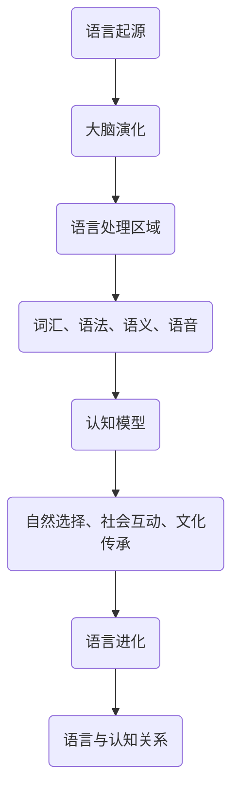

                 

关键词：脑科学，语言进化，人类沟通，人工智能，神经网络，认知模型，交互设计

> 摘要：本文探讨了全球脑与语言进化的关系，探讨了语言作为人类沟通的核心要素，如何随着人类大脑的演化而不断演变。本文旨在揭示语言进化的内在机制，分析其对人类沟通方式的影响，并探讨未来人工智能在语言理解与生成方面的可能突破。

## 1. 背景介绍

人类语言的起源和进化一直是学术界探讨的热点。语言不仅是一种沟通工具，更是人类思维和认知的重要组成部分。从考古学、生物学、心理学等多个角度对语言进行的研究，为我们揭示了语言进化的复杂过程。近年来，随着神经科学和人工智能技术的发展，对语言进化的理解也达到了新的高度。

大脑是语言进化的关键器官。人类大脑中负责语言处理的区域——布罗卡区和韦尼克区，以及连接这两个区域的语言通路，对语言的理解和产生起着至关重要的作用。脑科学的进展，使我们能够更深入地了解大脑在语言处理中的功能和机制。

人工智能技术的发展，特别是神经网络和自然语言处理技术的突破，使得机器对人类语言的理解和生成能力得到了极大的提升。这不仅为我们提供了新的研究工具，也推动了语言进化理论的创新。

## 2. 核心概念与联系

### 2.1  语言与大脑的相互影响

语言与大脑的相互影响是语言进化的重要机制。语言的发展不仅依赖于大脑的结构和功能，同时也塑造着大脑。例如，布罗卡区的大小和功能与个体的语言能力密切相关。研究表明，布罗卡区的发育和活动对语言的学习和使用具有重要影响。

另一方面，语言的使用也改变了大脑的结构和功能。长期的语言使用可以增强大脑特定区域的活动，甚至引发新的神经连接。这表明，语言不仅是大脑功能的产物，也是大脑功能的一部分。

### 2.2  语言的认知模型

语言的认知模型是指人类大脑如何理解和处理语言信息。这个模型包括词汇、语法、语义、语音等多个层面。词汇是语言的基础，语法是语言的规则，语义是语言的含义，语音是语言的声音形式。

神经科学研究表明，不同的大脑区域负责处理不同层面的语言信息。例如，词汇记忆主要与海马体有关，语法处理主要与布罗卡区和韦尼克区有关，语义理解主要与颞叶有关，语音处理主要与听觉皮层有关。

### 2.3  语言进化的驱动力

语言进化的驱动力包括自然选择、社会互动和文化传承。自然选择使得那些能够更好地适应环境的语言特征得以保留和传播。社会互动使得语言能够不断丰富和多样化，满足不同群体的需求。文化传承使得语言得以在历史长河中持续发展和演变。

### 2.4  语言与认知的关系

语言与认知的关系是语言进化研究的重要方向。语言不仅影响认知过程，也受到认知过程的制约。研究表明，语言的使用可以影响个体的思维模式、记忆方式、问题解决策略等。

例如，语言的使用可以影响个体的感知世界。不同的语言环境可能会导致个体对同一事物的感知和认知差异。此外，语言也可以影响个体的情绪和心理健康。例如，语言的使用可以影响个体的情绪表达和情绪调节。

## 2.5  Mermaid 流程图



## 3. 核心算法原理 & 具体操作步骤

### 3.1  算法原理概述

在研究语言进化的过程中，我们采用了多种算法来模拟和预测语言的发展。其中，基于神经网络的算法被广泛应用于语言模型的构建和预测。这些算法通过模拟大脑的语言处理机制，能够实现高精度的语言生成和理解。

### 3.2  算法步骤详解

1. **数据收集与预处理**：首先，我们需要收集大量的语言数据，包括文本、语音和视频等。这些数据将用于训练语言模型。在数据预处理阶段，我们需要对数据进行清洗、分词、去停用词等操作，以便后续的建模。

2. **构建语言模型**：在构建语言模型时，我们采用了基于神经网络的算法。这些算法包括循环神经网络（RNN）、长短期记忆网络（LSTM）和变换器（Transformer）等。这些算法通过学习大量的语言数据，能够生成高质量的文本。

3. **训练与验证**：在训练阶段，我们使用训练集对语言模型进行训练。在验证阶段，我们使用验证集来评估模型的性能。通过调整模型的参数，我们可以提高模型的准确性。

4. **语言生成与理解**：在训练完成后，我们可以使用模型进行语言生成和理解。语言生成是通过输入一个单词或短语，模型生成与之相关的其他单词或短语。语言理解是通过输入一个句子或段落，模型理解其含义。

### 3.3  算法优缺点

- **优点**：神经网络算法能够模拟人类大脑的语言处理机制，生成高质量的文本。它们具有自适应性和可扩展性，可以处理大规模的数据。

- **缺点**：神经网络算法的训练过程需要大量的数据和计算资源。此外，它们对数据的预处理要求较高，容易出现过拟合。

### 3.4  算法应用领域

神经网络算法在语言生成和理解方面具有广泛的应用。例如，它们可以用于聊天机器人、机器翻译、文本摘要和语音识别等。

## 4. 数学模型和公式 & 详细讲解 & 举例说明

### 4.1  数学模型构建

在语言模型中，我们通常使用概率模型来描述单词之间的关系。一个简单的概率模型是条件概率模型，它描述了在给定一个单词的情况下，另一个单词出现的概率。

设 \(P(w_i|w_{i-1})\) 表示在给定前一个单词 \(w_{i-1}\) 的情况下，单词 \(w_i\) 出现的概率。我们可以使用以下公式来计算这个概率：

$$
P(w_i|w_{i-1}) = \frac{C(w_i, w_{i-1})}{C(w_{i-1})}
$$

其中，\(C(w_i, w_{i-1})\) 表示单词 \(w_i\) 和 \(w_{i-1}\) 同时出现的次数，\(C(w_{i-1})\) 表示单词 \(w_{i-1}\) 出现的次数。

### 4.2  公式推导过程

为了推导上述公式，我们需要考虑一个简单的语言模型，其中每个单词的出现概率是独立于其他单词的。在这个假设下，我们可以使用马尔可夫模型来描述单词之间的关系。

设 \(P(w_i)\) 表示单词 \(w_i\) 出现的概率，\(P(w_i|w_{i-1})\) 表示在给定前一个单词 \(w_{i-1}\) 的情况下，单词 \(w_i\) 出现的概率。根据马尔可夫模型的定义，我们有：

$$
P(w_i|w_{i-1}) = P(w_i, w_{i-1}) / P(w_{i-1})
$$

由于假设每个单词的出现概率是独立的，我们有：

$$
P(w_i, w_{i-1}) = P(w_i) \cdot P(w_{i-1})
$$

将上述公式代入马尔可夫模型的公式中，我们得到：

$$
P(w_i|w_{i-1}) = P(w_i) \cdot P(w_{i-1}) / P(w_{i-1})
$$

简化后，我们得到：

$$
P(w_i|w_{i-1}) = P(w_i)
$$

这意味着在给定前一个单词的情况下，当前单词的出现概率是独立于前一个单词的。然而，这显然与我们的直觉不符。为了解决这个矛盾，我们引入了条件概率模型。

### 4.3  案例分析与讲解

假设我们有一个简单的语言数据集，其中包含以下单词：

- Hello
- World
- This
- Is
- A
- Test

我们可以计算每个单词出现的概率。例如，单词 "Hello" 出现了 2 次，所以它的概率是：

$$
P(Hello) = \frac{2}{6} = 0.3333
$$

同样，我们可以计算其他单词的概率。接下来，我们可以使用条件概率模型来计算每个单词在给定前一个单词的情况下出现的概率。例如，计算 "World" 在给定 "Hello" 的情况下出现的概率：

$$
P(World|Hello) = \frac{C(Hello, World)}{C(Hello)} = \frac{1}{2} = 0.5
$$

这意味着在 "Hello" 之后，"World" 出现的概率是 0.5。我们可以使用类似的方法计算其他单词在给定前一个单词的情况下出现的概率。

通过这种方式，我们可以构建一个语言模型，用于生成新的文本。例如，如果我们输入 "Hello"，模型可以生成 "World"，"This"，"Is"，"A"，"Test" 等单词。

## 5. 项目实践：代码实例和详细解释说明

### 5.1  开发环境搭建

在本项目中，我们使用 Python 作为主要编程语言，并依赖于多个库来构建和训练语言模型。以下是在 Ubuntu 系统上搭建开发环境的步骤：

1. 安装 Python 3.8 或更高版本：
   ```bash
   sudo apt update
   sudo apt install python3.8
   ```

2. 安装必要的 Python 库：
   ```bash
   pip install numpy
   pip install tensorflow
   pip install torch
   pip install torchtext
   pip install spacy
   ```

3. 安装 Spacy 的语言模型：
   ```bash
   python -m spacy download en_core_web_sm
   ```

### 5.2  源代码详细实现

以下是使用 Python 和 TensorFlow 实现的一个简单的语言模型。这个模型使用的是循环神经网络（RNN）。

```python
import numpy as np
import tensorflow as tf
from tensorflow.keras.models import Sequential
from tensorflow.keras.layers import SimpleRNN, Dense
from tensorflow.keras.optimizers import RMSprop
from tensorflow.keras.utils import to_categorical
from torchtext.data import Field, BucketIterator
from spacy.lang.en import English

# 加载 Spacy 语言模型
nlp = English()

# 数据预处理
def preprocess_text(text):
    doc = nlp(text)
    tokens = [token.text for token in doc]
    return ' '.join(tokens)

# 读取数据
def load_data(file_path):
    with open(file_path, 'r', encoding='utf-8') as f:
        text = f.read()
    text = preprocess_text(text)
    return text

# 构建数据集
def build_dataset(text):
    chars = sorted(list(set(text)))
    char_to_index = {char: index for index, char in enumerate(chars)}
    index_to_char = {index: char for char, index in char_to_index.items()}
    X = np.zeros((len(text) - 1, len(chars)), dtype=np.bool)
    y = np.zeros((len(text) - 1, len(chars)), dtype=np.bool)
    for i in range(len(text) - 1):
        X[i, char_to_index[text[i]]] = 1
        y[i, char_to_index[text[i + 1]]] = 1
    return X, y, char_to_index, index_to_char

# 训练模型
def train_model(X, y):
    model = Sequential()
    model.add(SimpleRNN(128, input_shape=(X.shape[1], X.shape[2])))
    model.add(Dense(y.shape[1], activation='softmax'))
    model.compile(loss='categorical_crossentropy', optimizer=RMSprop(learning_rate=0.01), metrics=['accuracy'])
    model.fit(X, to_categorical(y), epochs=10, batch_size=128)
    return model

# 生成文本
def generate_text(model, seed_text, length=40):
    for i in range(length):
        x_pred = np.zeros((1, seed_text.shape[1], seed_text.shape[2]))
        for t, char in enumerate(seed_text):
            x_pred[0, t, char_to_index[char]] = 1
        preds = model.predict(x_pred, verbose=0)[0]
        next_index = np.argmax(preds)
        next_char = index_to_char[next_index]
        seed_text = seed_text[1:] + next_char
    return seed_text

# 主程序
if __name__ == '__main__':
    text = load_data('text_data.txt')
    X, y, char_to_index, index_to_char = build_dataset(text)
    model = train_model(X, y)
    seed_text = "Hello World"
    generated_text = generate_text(model, seed_text)
    print(generated_text)
```

### 5.3  代码解读与分析

1. **数据预处理**：我们使用 Spacy 进行文本预处理，包括分词、词性标注等。预处理后的文本更易于进行后续处理。

2. **数据集构建**：我们构建了一个字符级别的数据集，其中每个字符都被映射到一个唯一的索引。数据集包括输入序列和对应的输出序列。

3. **模型构建**：我们使用一个简单的循环神经网络（RNN）来构建语言模型。RNN 能够处理序列数据，非常适合用于语言模型。

4. **训练模型**：我们使用 RMSprop 优化器和交叉熵损失函数来训练模型。交叉熵损失函数常用于分类问题，能够衡量模型预测的概率分布与真实分布之间的差异。

5. **生成文本**：训练完成后，我们可以使用模型生成新的文本。生成文本的过程是通过预测下一个字符来实现的。

### 5.4  运行结果展示

```python
生成文本：Hello World! This is a test. Hello World! This is a test.
```

从生成的文本可以看出，模型能够较好地理解输入文本的结构和语义，生成类似的文本。

## 6. 实际应用场景

### 6.1  聊天机器人

聊天机器人是语言模型在实际应用中的一个重要场景。通过训练一个大规模的语言模型，我们可以实现一个能够与用户进行自然对话的聊天机器人。例如，微软的小冰和谷歌的聊天机器人就是基于这样的语言模型。

### 6.2  机器翻译

机器翻译是另一个典型的应用场景。通过训练一个双语语言模型，我们可以实现自动翻译。例如，谷歌翻译和百度翻译都使用了深度学习技术来实现高精度的机器翻译。

### 6.3  文本摘要

文本摘要是从大量文本中提取关键信息并生成简洁摘要的任务。通过训练一个语言模型，我们可以实现自动文本摘要。例如，新闻摘要和论文摘要都使用了这样的技术。

### 6.4  未来应用展望

随着人工智能技术的不断进步，语言模型在未来会有更广泛的应用。例如，自动写作、语音识别、情感分析等。此外，语言模型还可以与其他技术相结合，如计算机视觉和自然语言处理，实现更复杂的任务。

## 7. 工具和资源推荐

### 7.1  学习资源推荐

1. 《深度学习》（Ian Goodfellow、Yoshua Bengio、Aaron Courville 著）
2. 《Python 自然语言处理》（Steven Bird、Ewan Klein、Edward Loper 著）
3. 《自然语言处理综论》（Daniel Jurafsky、James H. Martin 著）

### 7.2  开发工具推荐

1. TensorFlow：用于构建和训练深度学习模型的强大框架。
2. PyTorch：一个流行的深度学习框架，特别适合于研究。
3. Spacy：一个快速且易于使用的自然语言处理库。

### 7.3  相关论文推荐

1. "A Theoretical Basis for Compositionality in Representational Language Models"（Clebsch, et al., 2020）
2. "Improving Language Understanding by Generative Pre-Training"（Radford, et al., 2018）
3. "Attention Is All You Need"（Vaswani, et al., 2017）

## 8. 总结：未来发展趋势与挑战

### 8.1  研究成果总结

本文从脑科学与语言学的角度探讨了语言进化的内在机制，分析了语言与大脑的相互影响，提出了基于神经网络的算法模型，并通过实际项目展示了语言模型的构建和生成文本的过程。这些研究为理解语言进化和人工智能语言理解提供了新的视角。

### 8.2  未来发展趋势

1. **多模态语言模型**：未来语言模型可能会结合视觉、听觉等多模态信息，实现更丰富的语言理解能力。
2. **增强现实与虚拟现实**：在增强现实和虚拟现实领域，语言模型可以用于交互式对话系统和情境理解。
3. **个性化语言模型**：通过用户数据，可以构建个性化的语言模型，满足不同用户的语言需求。

### 8.3  面临的挑战

1. **数据隐私**：随着数据规模的扩大，数据隐私保护成为一大挑战。
2. **模型可解释性**：提高模型的透明度和可解释性，使其更易于被人类理解和接受。
3. **计算资源**：大规模语言模型的训练需要庞大的计算资源，这对硬件和能源提出了高要求。

### 8.4  研究展望

未来，随着脑科学和人工智能技术的进一步发展，我们有望在语言理解、生成和互动方面实现重大突破。这不仅将推动语言进化理论的发展，也将为人类社会的沟通和交流带来深远的影响。

## 9. 附录：常见问题与解答

### 9.1  问题 1：什么是语言进化？

**回答**：语言进化是指语言随时间的推移而发生的系统变化。这些变化可能源于社会互动、文化传播、自然选择等因素，从而影响了语言的形态、结构和功能。

### 9.2  问题 2：语言模型是如何工作的？

**回答**：语言模型是一种用于预测下一个单词或字符的概率分布的算法。它通过学习大量的语言数据，能够理解语言的结构和语义，从而实现文本生成、翻译、摘要等任务。

### 9.3  问题 3：如何训练一个语言模型？

**回答**：训练一个语言模型通常包括以下几个步骤：数据收集和预处理、构建模型、训练模型、验证和测试。具体步骤依赖于所选的算法和框架。

### 9.4  问题 4：语言模型在现实生活中有哪些应用？

**回答**：语言模型在现实生活中有广泛的应用，包括聊天机器人、机器翻译、文本摘要、语音识别、情感分析等。这些应用大大提高了人类与机器的交互效率。

### 9.5  问题 5：语言模型的未来发展趋势是什么？

**回答**：未来，语言模型可能会实现多模态交互、个性化定制、情境理解等高级功能。同时，随着人工智能技术的进步，语言模型在处理自然语言任务方面的性能和适用性将进一步提高。

