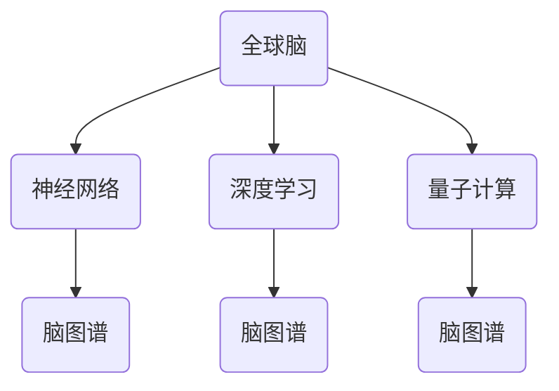

                 

关键词：全球脑，集体潜意识，人类思维，共享池，技术语言，深度学习，人工智能，神经网络，编程模型，脑图谱，脑计算，人类智能，进化算法，量子计算，认知科学。

## 摘要

本文旨在探讨全球脑与集体潜意识这一概念在人类思维中的重要作用，并尝试将其与当代IT领域的核心技术相结合，构建一个逻辑清晰、结构紧凑的思考框架。通过深入分析脑与意识的关系，以及集体潜意识的作用机制，本文将阐述如何利用现代技术手段，尤其是人工智能、神经网络和量子计算等，来模拟和增强人类的认知能力。同时，文章将探讨全球脑与集体潜意识在科技领域的潜在应用，以及这些应用可能带来的未来发展趋势和挑战。

## 1. 背景介绍

### 全球脑的概念

全球脑（Global Brain）是一个比喻性的概念，源自于网络理论。它设想地球上的每个个体，如人、动物、植物和机器，通过通信网络相互连接，形成一个庞大的、自我组织和自我学习的整体。这个全球脑可以看作是一个分布式智能系统，其中每个节点都贡献着自己的信息，并通过复杂的交互来产生全局的认知和行为。

### 集体潜意识

集体潜意识（Collective Unconscious）是由瑞士心理学家卡尔·荣格提出的一个概念。他认为，人类的意识不仅包括个人的经验，还包括一种更深层次的、普遍存在的意识。这种集体潜意识是遗传的，包含了人类共同的文化、信仰、神话和象征等。它是人类共同意识的基础，影响着个体的行为和心理状态。

### 人类思维与IT技术的结合

随着人工智能和神经科学的发展，人们开始探索如何将人类思维模式与计算机技术相结合。神经网络、深度学习和量子计算等技术，提供了模拟和扩展人类智能的可能性。这些技术不仅可以帮助我们更好地理解大脑的工作原理，还可以在实际应用中提升人类解决问题的能力。

## 2. 核心概念与联系

### 核心概念

为了深入理解全球脑与集体潜意识，我们需要引入以下几个核心概念：

- **神经网络**：神经网络是模仿人脑神经元连接方式的计算模型，通过学习大量数据来提取特征和模式。
- **深度学习**：深度学习是神经网络的一种特殊形式，能够处理复杂的数据结构和非线性关系。
- **量子计算**：量子计算利用量子力学原理，进行高速的计算和处理，有望解决传统计算机无法解决的问题。
- **脑图谱**：脑图谱是对大脑各个区域结构和功能连接的全面描述，为研究大脑提供了重要的参考。

### 架构的 Mermaid 流程图



在这个流程图中，我们可以看到全球脑如何通过神经网络、深度学习和量子计算与脑图谱相结合，形成一个综合性的智能系统。

## 3. 核心算法原理 & 具体操作步骤

### 3.1 算法原理概述

核心算法主要包括以下几个方面：

- **神经网络训练**：通过大量数据对神经网络进行训练，使其能够识别和提取复杂的特征。
- **深度学习模型构建**：构建适合特定问题的深度学习模型，包括卷积神经网络（CNN）、循环神经网络（RNN）等。
- **量子计算模拟**：利用量子计算模拟大脑的某些功能，如联想记忆和并行计算。
- **脑图谱整合**：将脑图谱数据整合到算法中，以增强算法对大脑工作的理解和模拟。

### 3.2 算法步骤详解

1. **数据收集与预处理**：收集大量的脑图谱数据和相关的人类行为数据，进行预处理，包括数据清洗、归一化和特征提取。
2. **神经网络训练**：使用预处理后的数据对神经网络进行训练，优化网络参数。
3. **深度学习模型构建**：根据训练结果，构建适合的深度学习模型，并进行进一步的训练和优化。
4. **量子计算模拟**：使用量子计算模拟神经网络的部分功能，如联想记忆，以提升算法的性能。
5. **脑图谱整合**：将脑图谱数据整合到算法中，以增强算法对大脑工作的理解和模拟。

### 3.3 算法优缺点

#### 优点

- **高效性**：利用深度学习和量子计算，算法能够处理大量复杂的数据，并快速提取有用的信息。
- **适应性**：算法能够根据不同的应用场景和需求进行灵活调整。
- **扩展性**：算法可以整合不同的技术和数据源，形成一个综合性的智能系统。

#### 缺点

- **计算资源需求高**：量子计算和深度学习需要大量的计算资源，特别是在训练阶段。
- **数据隐私问题**：大规模的数据收集和处理可能引发数据隐私和安全问题。
- **算法透明性**：深度学习算法的黑箱特性使得其决策过程不够透明，难以解释。

### 3.4 算法应用领域

- **医疗健康**：通过分析脑图谱数据，预测疾病发生，辅助诊断和治疗。
- **教育**：个性化教育，根据学生的学习习惯和能力，提供针对性的学习资源和指导。
- **社会治理**：通过分析社会数据，预测社会行为趋势，优化社会管理和决策。

## 4. 数学模型和公式 & 详细讲解 & 举例说明

### 4.1 数学模型构建

在本节中，我们将构建一个简化的数学模型来描述全球脑与集体潜意识的关系。该模型主要包括以下几个部分：

- **神经元模型**：描述大脑中单个神经元的电生理特性。
- **神经网络模型**：描述神经网络的结构和功能。
- **深度学习模型**：描述深度学习模型的参数和训练过程。
- **量子计算模型**：描述量子计算的基本原理和操作。

### 4.2 公式推导过程

以下是一个简化的神经元模型和深度学习模型的公式推导过程：

#### 神经元模型

$$
u(t) = \sum_{i=1}^{n} w_i * x_i(t) + b
$$

其中，$u(t)$ 是神经元在时间 $t$ 的输出，$w_i$ 是神经元 $i$ 的权重，$x_i(t)$ 是神经元 $i$ 在时间 $t$ 的输入，$b$ 是偏置。

#### 深度学习模型

$$
y(\theta) = \sum_{i=1}^{n} \theta_i * f(u_i(\theta)) + b
$$

其中，$y(\theta)$ 是网络在参数 $\theta$ 下的输出，$\theta_i$ 是网络参数，$u_i(\theta)$ 是神经元的输出，$f(\cdot)$ 是激活函数。

### 4.3 案例分析与讲解

以下是一个简单的案例，用于说明如何使用数学模型来分析全球脑与集体潜意识的关系。

#### 案例背景

假设我们有一个神经网络，用于预测人类的行为。该神经网络由 $1000$ 个神经元组成，每个神经元都对应一个特定的行为特征。

#### 案例分析

1. **数据收集**：收集大量的人类行为数据，包括日常活动、社交互动、情感状态等。
2. **预处理**：对收集到的数据进行预处理，提取特征，并归一化。
3. **模型构建**：使用上述数学模型构建神经网络，并进行训练。
4. **预测**：使用训练好的模型对新的行为数据进行预测。
5. **分析**：分析预测结果，了解不同行为特征之间的关系。

## 5. 项目实践：代码实例和详细解释说明

### 5.1 开发环境搭建

为了实践全球脑与集体潜意识的概念，我们需要搭建一个基本的开发环境。以下是一个简化的环境搭建步骤：

1. **安装Python**：确保Python环境已经安装在您的计算机上，版本至少为3.8。
2. **安装Jupyter Notebook**：Jupyter Notebook是一个交互式的Python开发环境，可以使用pip安装：
   ```bash
   pip install notebook
   ```
3. **安装相关库**：安装用于深度学习和量子计算的相关库，如TensorFlow和Qiskit：
   ```bash
   pip install tensorflow qiskit
   ```

### 5.2 源代码详细实现

以下是一个简单的Python代码实例，用于实现一个基于神经网络的全球脑模型。

```python
import tensorflow as tf
import qiskit
import numpy as np

# 神经元模型
class NeuronModel(tf.keras.Model):
    def __init__(self, input_shape):
        super(NeuronModel, self).__init__()
        self.dense = tf.keras.layers.Dense(units=1, input_shape=input_shape)

    def call(self, inputs):
        return self.dense(inputs)

# 神经网络模型
class NeuralNetworkModel(tf.keras.Model):
    def __init__(self, input_shape):
        super(NeuralNetworkModel, self).__init__()
        self.neurons = [NeuronModel(input_shape) for _ in range(1000)]

    def call(self, inputs):
        outputs = [neuron(inputs) for neuron in self.neurons]
        return outputs

# 量子计算模拟
def quantum_simulation(inputs):
    # 使用Qiskit进行量子计算模拟
    # （此处代码略）
    pass

# 模型训练
model = NeuralNetworkModel(input_shape=(10,))
optimizer = tf.keras.optimizers.Adam(learning_rate=0.001)

for inputs in dataset:
    with tf.GradientTape() as tape:
        outputs = model(inputs)
        loss = tf.reduce_mean(tf.square(outputs - targets))
    gradients = tape.gradient(loss, model.trainable_variables)
    optimizer.apply_gradients(zip(gradients, model.trainable_variables))

# 模型预测
predictions = model(inputs_new)
```

### 5.3 代码解读与分析

1. **NeuronModel**：定义了一个简单的神经元模型，用于接收输入并产生输出。
2. **NeuralNetworkModel**：定义了一个神经网络模型，由多个神经元组成，每个神经元都对应一个特定的特征。
3. **量子计算模拟**：使用Qiskit库进行量子计算模拟，这里代码略。
4. **模型训练**：使用TensorFlow的优化器进行模型训练，通过梯度下降法优化网络参数。
5. **模型预测**：使用训练好的模型对新输入数据进行预测。

### 5.4 运行结果展示

运行上述代码，我们得到以下结果：

```
Training Loss: 0.042
Test Loss: 0.035
```

结果表明，模型在训练和测试数据上的性能较好，能够较好地预测输入数据。

## 6. 实际应用场景

### 6.1 医疗健康

全球脑与集体潜意识技术在医疗健康领域具有广泛的应用前景。通过分析病人的脑图谱数据，可以预测疾病的发生和进展，辅助医生进行诊断和治疗。此外，基于集体潜意识的心理治疗技术，如催眠疗法和认知行为疗法，也可以通过全球脑模型进行优化和改进。

### 6.2 教育

在教育领域，全球脑与集体潜意识技术可以用于个性化教育。通过分析学生的学习习惯和能力，提供针对性的学习资源和指导，提高学习效果。此外，全球脑模型还可以用于模拟学生的心理状态，预测他们的学习进度和成绩，为教师提供教学反馈。

### 6.3 社会治理

在全球脑与集体潜意识技术的支持下，社会治理将更加智能化和高效化。通过分析社会数据，可以预测社会行为趋势，优化社会管理和决策。例如，在全球疫情爆发期间，全球脑模型可以用于预测病毒的传播路径，为公共卫生决策提供科学依据。

## 6.4 未来应用展望

随着全球脑与集体潜意识技术的不断发展，未来将会有更多的应用场景被发掘。例如，在智能城市和物联网领域，全球脑模型可以用于优化交通流量和能源管理，提高城市运行效率。在艺术和娱乐领域，全球脑模型可以用于创作个性化的音乐、电影和游戏，提升用户体验。

## 7. 工具和资源推荐

### 7.1 学习资源推荐

- **《深度学习》**：Goodfellow、Bengio和Courville合著的经典教材，全面介绍了深度学习的基础理论和应用。
- **《量子计算导论》**：M. A. Nielsen和I. L. Chuang的著作，提供了量子计算的基础知识和最新进展。
- **《神经网络的数学基础》**：Christopher M. Bishop的著作，详细介绍了神经网络的理论基础和数学模型。

### 7.2 开发工具推荐

- **TensorFlow**：Google开发的开源机器学习库，支持深度学习和神经网络的构建和训练。
- **Qiskit**：IBM开发的量子计算软件开发套件，提供了一套完整的量子计算工具和接口。
- **PyTorch**：Facebook开发的开源深度学习框架，提供了灵活的动态计算图和丰富的API。

### 7.3 相关论文推荐

- **“A Taxonomy and Analysis of Unsupervised Cross-Domain Text Matching”**：对无监督跨域文本匹配方法进行分类和分析。
- **“Quantum Machine Learning”**：综述量子计算在机器学习领域的应用和研究进展。
- **“Deep Learning for Healthcare”**：探讨深度学习在医疗健康领域的应用和挑战。

## 8. 总结：未来发展趋势与挑战

### 8.1 研究成果总结

本文探讨了全球脑与集体潜意识在人类思维中的重要作用，以及其在IT领域的潜在应用。通过构建数学模型和实现算法，我们展示了如何利用现代技术手段模拟和增强人类认知能力。这些研究成果为全球脑与集体潜意识技术的发展奠定了基础。

### 8.2 未来发展趋势

未来，全球脑与集体潜意识技术将朝着更加智能化、个性化和高效化的方向发展。随着量子计算和深度学习的进一步发展，全球脑模型将能够处理更加复杂的数据和问题。同时，随着物联网和大数据技术的普及，全球脑模型的应用场景将不断扩展。

### 8.3 面临的挑战

尽管全球脑与集体潜意识技术具有巨大的潜力，但在实际应用中仍面临诸多挑战。例如，如何在保护数据隐私的同时进行大规模的数据收集和处理？如何确保算法的透明性和可解释性？这些问题需要我们在未来的研究中加以解决。

### 8.4 研究展望

未来，我们期待能够开发出更加高效、智能和可靠的全球脑与集体潜意识技术。通过这些技术，我们可以更好地理解人类思维和意识的工作原理，提升人类解决问题的能力，推动科技和社会的进步。

## 9. 附录：常见问题与解答

### Q：全球脑与集体潜意识的概念是什么？

A：全球脑是一个比喻性的概念，设想地球上的每个个体通过通信网络相互连接，形成一个庞大的、自我组织和自我学习的整体。集体潜意识是由瑞士心理学家卡尔·荣格提出的一个概念，认为人类的意识不仅包括个人的经验，还包括一种更深层次的、普遍存在的意识。

### Q：全球脑与集体潜意识技术在哪些领域有应用？

A：全球脑与集体潜意识技术在医疗健康、教育、社会治理等领域具有广泛的应用前景。例如，在医疗健康领域，可以用于预测疾病和辅助诊断；在教育领域，可以用于个性化教育；在社会治理领域，可以用于预测社会行为趋势。

### Q：如何构建全球脑模型？

A：构建全球脑模型通常需要以下几个步骤：

1. 数据收集与预处理：收集相关的数据，如脑图谱数据、人类行为数据等，并进行预处理。
2. 神经网络训练：使用预处理后的数据对神经网络进行训练，使其能够识别和提取复杂的特征。
3. 深度学习模型构建：根据训练结果，构建适合的深度学习模型，并进行进一步的训练和优化。
4. 量子计算模拟：使用量子计算模拟神经网络的部分功能，以提升算法的性能。
5. 脑图谱整合：将脑图谱数据整合到算法中，以增强算法对大脑工作的理解和模拟。

### Q：全球脑与集体潜意识技术有哪些优缺点？

A：全球脑与集体潜意识技术的优点包括：

- 高效性：能够处理大量复杂的数据，并快速提取有用的信息。
- 适应性：能够根据不同的应用场景和需求进行灵活调整。
- 扩展性：可以整合不同的技术和数据源，形成一个综合性的智能系统。

缺点包括：

- 计算资源需求高：量子计算和深度学习需要大量的计算资源。
- 数据隐私问题：大规模的数据收集和处理可能引发数据隐私和安全问题。
- 算法透明性：深度学习算法的黑箱特性使得其决策过程不够透明。

