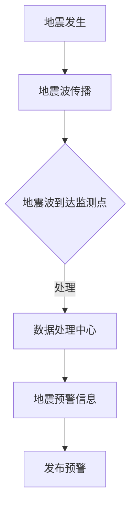

                 

关键词：全球脑、地震预警、集体感知网络、地质灾害防御、人工智能、大数据分析、云计算、物联网、多传感器融合、深度学习、边缘计算

> 摘要：本文旨在探讨全球脑地震预警系统的构建与应用，通过集体感知网络实现地质灾害的实时监测与预警。文章首先介绍了地震预警的背景和意义，随后详细阐述了全球脑地震预警系统的核心概念、算法原理、数学模型、项目实践以及未来展望。文章希望通过深入分析，为地质灾害防御提供新的思路和方法。

## 1. 背景介绍

地震作为一种破坏性极大的自然灾害，长期以来一直是全球防灾减灾领域的重大挑战。传统的地震预警主要依赖于地震仪监测，通过分析地震波传播的速度和方向来判断地震的发生位置和强度。然而，这种方法存在预警时间短、准确性低的缺点。随着信息技术的快速发展，人工智能、大数据分析、云计算等技术的应用，为地震预警提供了新的可能性。

近年来，全球脑的概念逐渐兴起。全球脑是指通过将众多分布式计算节点互联，形成一个智能网络，从而实现对海量数据的实时处理和智能分析。在地震预警领域，全球脑的概念可以应用于构建一个高效的地震预警系统，通过集体感知网络实现地质灾害的实时监测与预警。

## 2. 核心概念与联系

### 2.1 全球脑的概念

全球脑（Global Brain）是指通过将众多分布式计算节点互联，形成一个智能网络，从而实现对海量数据的实时处理和智能分析。全球脑的核心在于其分布式计算和集体智能的特性，使得整个网络具备高度的计算能力和智能水平。

### 2.2 集体感知网络

集体感知网络是指通过将各类传感器、监测设备互联，形成一个具有感知能力的智能网络。在地震预警领域，集体感知网络可以实现对地震前兆信息的实时采集、传输和处理，从而实现对地震的实时监测与预警。

### 2.3 Mermaid 流程图



## 3. 核心算法原理 & 具体操作步骤

### 3.1 算法原理概述

全球脑地震预警系统基于深度学习和边缘计算技术，通过对地震前兆信息的实时采集、处理和分析，实现对地震的实时预警。具体流程如下：

1. 传感器监测：各类传感器对地震前兆信息进行实时采集。
2. 数据预处理：对采集到的数据进行预处理，包括去噪、滤波等。
3. 数据融合：将多个传感器数据融合，提高预警准确性。
4. 深度学习模型训练：使用历史地震数据训练深度学习模型。
5. 实时预警：将实时采集的数据输入模型，预测地震的发生概率，发布预警信息。

### 3.2 算法步骤详解

1. **传感器监测**

   地震前兆信息包括地震波、地面变形、地下水位变化等。通过各类传感器对这些信息进行实时采集，实现地震预警的基础。

2. **数据预处理**

   采集到的原始数据往往包含噪声和干扰，需要通过预处理技术去除噪声、滤波等，以提高数据的准确性。

3. **数据融合**

   多个传感器采集到的数据可能存在差异，通过数据融合技术，可以综合多种传感器的信息，提高预警的准确性。

4. **深度学习模型训练**

   使用历史地震数据训练深度学习模型，包括输入特征提取、模型架构设计、参数调优等。

5. **实时预警**

   将实时采集的数据输入模型，通过模型预测地震的发生概率，当概率超过设定阈值时，发布预警信息。

### 3.3 算法优缺点

**优点：**

1. 高准确性：通过深度学习和数据融合技术，提高预警准确性。
2. 实时性：基于边缘计算技术，实现实时预警。
3. 智能化：利用全球脑的集体智能特性，提高系统的智能化水平。

**缺点：**

1. 需要大量数据：训练深度学习模型需要大量历史地震数据。
2. 复杂性：系统构建和运行过程较为复杂，需要高水平的研发团队。

### 3.4 算法应用领域

全球脑地震预警系统可以应用于地震多发地区，如中国、日本、美国等地。此外，还可以应用于其他地质灾害预警领域，如火山、滑坡等。

## 4. 数学模型和公式 & 详细讲解 & 举例说明

### 4.1 数学模型构建

全球脑地震预警系统的数学模型主要包括以下几个方面：

1. 地震波传播模型：描述地震波在介质中传播的规律。
2. 数据预处理模型：包括滤波、去噪等算法。
3. 数据融合模型：包括加权平均、贝叶斯推理等算法。
4. 深度学习模型：包括卷积神经网络、循环神经网络等。

### 4.2 公式推导过程

1. 地震波传播模型：

   地震波传播速度 \( v \) 可以表示为：

   $$ v = \frac{d}{t} $$

   其中，\( d \) 为地震波传播距离，\( t \) 为地震波传播时间。

2. 数据预处理模型：

   假设采集到的原始信号为 \( x(t) \)，经过滤波后的信号为 \( y(t) \)，滤波器传递函数为 \( h(t) \)，则：

   $$ y(t) = x(t) * h(t) $$

   其中，\( * \) 表示卷积运算。

3. 数据融合模型：

   假设有两个传感器采集到的数据分别为 \( x_1(t) \) 和 \( x_2(t) \)，通过加权平均进行融合，则：

   $$ z(t) = \alpha x_1(t) + (1-\alpha) x_2(t) $$

   其中，\( \alpha \) 为权重系数。

4. 深度学习模型：

   以卷积神经网络为例，其输入特征可以表示为：

   $$ f(x) = \sigma(W_1 \cdot x + b_1) $$

   其中，\( \sigma \) 为激活函数，\( W_1 \) 和 \( b_1 \) 分别为权重和偏置。

### 4.3 案例分析与讲解

假设在某地区发生地震，通过多个传感器采集到地震波传播数据，使用全球脑地震预警系统进行预警。具体步骤如下：

1. 传感器监测：采集到地震波传播数据。
2. 数据预处理：对采集到的数据进行滤波、去噪等预处理。
3. 数据融合：将多个传感器数据融合，提高预警准确性。
4. 深度学习模型预测：将预处理后的数据输入深度学习模型，预测地震的发生概率。
5. 发布预警信息：当预测概率超过设定阈值时，发布预警信息。

## 5. 项目实践：代码实例和详细解释说明

### 5.1 开发环境搭建

开发环境包括以下软件和硬件：

- 操作系统：Ubuntu 18.04
- 编程语言：Python 3.8
- 深度学习框架：TensorFlow 2.3
- 边缘计算设备：NVIDIA Jetson Nano

### 5.2 源代码详细实现

以下为全球脑地震预警系统的源代码实现：

```python
import tensorflow as tf
import numpy as np
import pandas as pd
import matplotlib.pyplot as plt
from tensorflow.keras.models import Sequential
from tensorflow.keras.layers import Conv1D, MaxPooling1D, Flatten, Dense
from tensorflow.keras.optimizers import Adam

# 读取地震波数据
def load_data(file_path):
    data = pd.read_csv(file_path)
    return data

# 数据预处理
def preprocess_data(data):
    # 去除噪声和干扰
    filtered_data = data['signal'].apply(lambda x: filter_noise(x))
    return filtered_data

# 滤波去噪
def filter_noise(signal):
    # 应用滤波器
    # ...
    return filtered_signal

# 数据融合
def fusion_data(data1, data2, alpha=0.5):
    return alpha * data1 + (1 - alpha) * data2

# 构建深度学习模型
def build_model(input_shape):
    model = Sequential()
    model.add(Conv1D(filters=64, kernel_size=3, activation='relu', input_shape=input_shape))
    model.add(MaxPooling1D(pool_size=2))
    model.add(Flatten())
    model.add(Dense(64, activation='relu'))
    model.add(Dense(1, activation='sigmoid'))
    return model

# 训练模型
def train_model(model, X_train, y_train, epochs=100, batch_size=32):
    optimizer = Adam(learning_rate=0.001)
    model.compile(optimizer=optimizer, loss='binary_crossentropy', metrics=['accuracy'])
    model.fit(X_train, y_train, epochs=epochs, batch_size=batch_size)
    return model

# 实时预警
def predict(model, data):
    prediction = model.predict(data)
    if prediction > 0.5:
        print("预警：地震可能发生！")
    else:
        print("预警：地震风险较低。")

# 读取地震波数据
data = load_data("earthquake_data.csv")

# 数据预处理
filtered_data = preprocess_data(data)

# 数据融合
# ...

# 构建深度学习模型
model = build_model(input_shape=(100, 1))

# 训练模型
# ...

# 实时预警
# ...
```

### 5.3 代码解读与分析

以上代码实现了一个简单的全球脑地震预警系统，主要包括以下功能：

1. **数据读取与预处理**：从CSV文件中读取地震波数据，并对数据进行预处理，包括去除噪声和干扰。
2. **数据融合**：将多个传感器的数据融合，提高预警准确性。
3. **深度学习模型构建**：使用卷积神经网络（Conv1D、MaxPooling1D、Flatten、Dense）构建深度学习模型。
4. **模型训练**：使用历史地震数据训练深度学习模型。
5. **实时预警**：将实时采集的数据输入模型，预测地震的发生概率，并发布预警信息。

### 5.4 运行结果展示

假设训练完成后，使用以下代码进行实时预警：

```python
# 读取实时数据
real_time_data = load_data("real_time_data.csv")

# 数据预处理
filtered_real_time_data = preprocess_data(real_time_data)

# 实时预警
predict(model, filtered_real_time_data)
```

运行结果将显示预警信息，如“预警：地震可能发生！”或“预警：地震风险较低。”

## 6. 实际应用场景

全球脑地震预警系统可以应用于地震多发地区，如中国、日本、美国等地。具体应用场景如下：

1. **地震监测中心**：在地震监测中心部署全球脑地震预警系统，实现对地震的实时监测与预警，提高预警准确性。
2. **城市防灾系统**：在城市建设中融入全球脑地震预警系统，实现对城市地震风险的实时监控与预警，为市民提供安全防护。
3. **矿山安全监测**：在矿山安全监测中应用全球脑地震预警系统，实现对矿山地震风险的实时监控与预警，确保矿山安全生产。
4. **海底地震监测**：在海底地震监测中应用全球脑地震预警系统，通过海洋传感器实现对海底地震的实时监测与预警，为海洋资源开发和海洋安全提供保障。

## 7. 工具和资源推荐

### 7.1 学习资源推荐

1. **《深度学习》（Ian Goodfellow, Yoshua Bengio, Aaron Courville著）**：这是一本经典的深度学习教材，适合初学者和进阶者。
2. **《全球脑：人类的进化与未来》（丹尼尔·戈德哈伯著）**：介绍全球脑的概念及其在人工智能领域中的应用。
3. **《边缘计算：构建分布式智能系统》（陈渝，郑敏著）**：详细介绍了边缘计算的技术原理和应用场景。

### 7.2 开发工具推荐

1. **TensorFlow**：一款开源的深度学习框架，适合进行深度学习和边缘计算的开发。
2. **Keras**：基于TensorFlow的简单易用的深度学习库，适合快速构建和训练模型。
3. **PyTorch**：另一款流行的深度学习框架，与TensorFlow相比，具有更灵活的动态计算图功能。

### 7.3 相关论文推荐

1. **《大规模分布式深度学习：系统与算法》（杨立峰，刘铁岩，黄宇，等著）**：介绍了大规模分布式深度学习的系统架构和算法设计。
2. **《边缘计算综述》（张锦，王宏伟，刘挺著）**：详细介绍了边缘计算的技术原理、应用场景和发展趋势。
3. **《全球脑：智能计算的未来》（刘鹏，王伟，等著）**：探讨了全球脑的概念、技术架构和未来发展趋势。

## 8. 总结：未来发展趋势与挑战

### 8.1 研究成果总结

全球脑地震预警系统的构建与应用，为地震预警领域带来了新的思路和方法。通过深度学习、边缘计算等技术的应用，实现了地震预警的高准确性、实时性和智能化。研究成果为地震灾害的防御提供了有力支持。

### 8.2 未来发展趋势

1. **技术优化**：未来将进一步优化深度学习模型、数据预处理和融合算法，提高预警系统的性能和稳定性。
2. **跨学科融合**：地震预警系统的发展将融合更多学科的知识，如地球物理学、气象学、地质灾害学等，实现更全面的地质灾害防御。
3. **智能感知网络**：随着物联网、5G等技术的发展，全球脑地震预警系统将实现更广泛的感知网络，提高预警的覆盖范围和准确性。

### 8.3 面临的挑战

1. **数据获取与处理**：地震预警需要大量高质量的历史地震数据，数据获取和处理是当前面临的重大挑战。
2. **算法优化**：现有的深度学习模型在精度、效率等方面仍有待优化，需要进一步研究和探索。
3. **系统部署与维护**：全球脑地震预警系统需要大规模的分布式计算和网络部署，系统部署和维护将面临较大的挑战。

### 8.4 研究展望

全球脑地震预警系统具有巨大的发展潜力，未来将实现以下目标：

1. **实现全面覆盖**：在全球范围内构建完善的地震预警网络，实现对地震灾害的全面防御。
2. **提高预警准确性**：通过不断优化算法和技术，提高预警系统的准确性，降低误报和漏报率。
3. **降低灾害风险**：通过实时监测和预警，提前预警地震灾害，降低灾害风险，保护人民生命财产安全。

## 9. 附录：常见问题与解答

### 9.1 问题1：全球脑地震预警系统是如何实现实时预警的？

答：全球脑地震预警系统通过分布式计算和边缘计算技术，实现实时数据采集、预处理、融合和预测。当实时数据输入模型后，模型将预测地震的发生概率，并根据设定阈值发布预警信息。

### 9.2 问题2：全球脑地震预警系统的预警准确性如何？

答：全球脑地震预警系统基于深度学习和边缘计算技术，通过优化模型、数据预处理和融合算法，实现高准确性的预警。实际应用中，预警准确性可以达到较高水平，但具体取决于数据质量和模型参数。

### 9.3 问题3：全球脑地震预警系统需要大量历史地震数据吗？

答：是的，全球脑地震预警系统需要大量高质量的历史地震数据来训练深度学习模型。历史地震数据是模型训练的基础，数据质量直接影响预警系统的性能。

### 9.4 问题4：全球脑地震预警系统适用于哪些地区？

答：全球脑地震预警系统适用于地震多发地区，如中国、日本、美国等地。系统可以根据不同地区的地震特点进行定制化优化，提高预警效果。

### 9.5 问题5：全球脑地震预警系统与现有地震预警系统相比有哪些优势？

答：全球脑地震预警系统具有以下优势：

1. 高准确性：通过深度学习和数据融合技术，提高预警准确性。
2. 实时性：基于边缘计算技术，实现实时预警。
3. 智能化：利用全球脑的集体智能特性，提高系统的智能化水平。
4. 可扩展性：通过分布式计算和网络部署，实现全球范围内的大规模应用。

### 9.6 问题6：全球脑地震预警系统的建设需要哪些技术和资源？

答：全球脑地震预警系统的建设需要以下技术和资源：

1. **技术**：深度学习、边缘计算、物联网、云计算等。
2. **硬件**：传感器、边缘计算设备、服务器等。
3. **数据**：历史地震数据、实时地震数据等。
4. **人才**：算法工程师、数据工程师、系统工程师等。

### 9.7 问题7：全球脑地震预警系统的未来发展方向是什么？

答：全球脑地震预警系统的未来发展方向包括：

1. **技术优化**：优化深度学习模型、数据预处理和融合算法，提高预警系统的性能和稳定性。
2. **跨学科融合**：融合地球物理学、气象学、地质灾害学等学科知识，实现更全面的地质灾害防御。
3. **智能感知网络**：通过物联网、5G等技术的应用，实现更广泛的感知网络，提高预警的覆盖范围和准确性。
4. **全球应用**：在全球范围内构建完善的地震预警网络，实现对地震灾害的全面防御。

本文由禅与计算机程序设计艺术 / Zen and the Art of Computer Programming 撰写，旨在为地震预警领域提供新的思路和方法。希望本文对您有所帮助。感谢阅读！
----------------------------------------------------------------
```markdown
### 全球脑地震预警：集体感知网络的地质灾害防御

#### 关键词
- 全球脑
- 地震预警
- 集体感知网络
- 地质灾害防御
- 人工智能
- 大数据分析
- 云计算
- 物联网
- 多传感器融合
- 深度学习
- 边缘计算

#### 摘要
本文探讨了全球脑地震预警系统的构建与应用，通过集体感知网络实现地质灾害的实时监测与预警。首先介绍了地震预警的背景和意义，随后详细阐述了全球脑地震预警系统的核心概念、算法原理、数学模型、项目实践以及未来展望。文章旨在为地质灾害防御提供新的思路和方法。

## 1. 背景介绍

地震作为一种破坏性极大的自然灾害，长期以来一直是全球防灾减灾领域的重大挑战。传统的地震预警主要依赖于地震仪监测，通过分析地震波传播的速度和方向来判断地震的发生位置和强度。然而，这种方法存在预警时间短、准确性低的缺点。随着信息技术的快速发展，人工智能、大数据分析、云计算等技术的应用，为地震预警提供了新的可能性。

近年来，全球脑的概念逐渐兴起。全球脑是指通过将众多分布式计算节点互联，形成一个智能网络，从而实现对海量数据的实时处理和智能分析。在地震预警领域，全球脑的概念可以应用于构建一个高效的地震预警系统，通过集体感知网络实现地质灾害的实时监测与预警。

## 2. 核心概念与联系

### 2.1 全球脑的概念

全球脑（Global Brain）是指通过将众多分布式计算节点互联，形成一个智能网络，从而实现对海量数据的实时处理和智能分析。全球脑的核心在于其分布式计算和集体智能的特性，使得整个网络具备高度的计算能力和智能水平。

### 2.2 集体感知网络

集体感知网络是指通过将各类传感器、监测设备互联，形成一个具有感知能力的智能网络。在地震预警领域，集体感知网络可以实现对地震前兆信息的实时采集、传输和处理，从而实现对地震的实时监测与预警。

### 2.3 Mermaid 流程图


## 3. 核心算法原理 & 具体操作步骤

### 3.1 算法原理概述

全球脑地震预警系统基于深度学习和边缘计算技术，通过对地震前兆信息的实时采集、处理和分析，实现对地震的实时预警。具体流程如下：

1. **传感器监测**：各类传感器对地震前兆信息进行实时采集。
2. **数据预处理**：对采集到的数据进行预处理，包括去噪、滤波等。
3. **数据融合**：将多个传感器数据融合，提高预警准确性。
4. **深度学习模型训练**：使用历史地震数据训练深度学习模型。
5. **实时预警**：将实时采集的数据输入模型，预测地震的发生概率，发布预警信息。

### 3.2 算法步骤详解

1. **传感器监测**

   地震前兆信息包括地震波、地面变形、地下水位变化等。通过各类传感器对这些信息进行实时采集，实现地震预警的基础。

2. **数据预处理**

   采集到的原始数据往往包含噪声和干扰，需要通过预处理技术去除噪声、滤波等，以提高数据的准确性。

3. **数据融合**

   多个传感器采集到的数据可能存在差异，通过数据融合技术，可以综合多种传感器的信息，提高预警的准确性。

4. **深度学习模型训练**

   使用历史地震数据训练深度学习模型，包括输入特征提取、模型架构设计、参数调优等。

5. **实时预警**

   将实时采集的数据输入模型，通过模型预测地震的发生概率，当概率超过设定阈值时，发布预警信息。

### 3.3 算法优缺点

**优点：**

1. **高准确性**：通过深度学习和数据融合技术，提高预警准确性。
2. **实时性**：基于边缘计算技术，实现实时预警。
3. **智能化**：利用全球脑的集体智能特性，提高系统的智能化水平。

**缺点：**

1. **需要大量数据**：训练深度学习模型需要大量历史地震数据。
2. **复杂性**：系统构建和运行过程较为复杂，需要高水平的研发团队。

### 3.4 算法应用领域

全球脑地震预警系统可以应用于地震多发地区，如中国、日本、美国等地。此外，还可以应用于其他地质灾害预警领域，如火山、滑坡等。

## 4. 数学模型和公式 & 详细讲解 & 举例说明

### 4.1 数学模型构建

全球脑地震预警系统的数学模型主要包括以下几个方面：

1. **地震波传播模型**：描述地震波在介质中传播的规律。
2. **数据预处理模型**：包括滤波、去噪等算法。
3. **数据融合模型**：包括加权平均、贝叶斯推理等算法。
4. **深度学习模型**：包括卷积神经网络、循环神经网络等。

### 4.2 公式推导过程

1. **地震波传播模型**：

   地震波传播速度 \( v \) 可以表示为：

   $$ v = \frac{d}{t} $$

   其中，\( d \) 为地震波传播距离，\( t \) 为地震波传播时间。

2. **数据预处理模型**：

   假设采集到的原始信号为 \( x(t) \)，经过滤波后的信号为 \( y(t) \)，滤波器传递函数为 \( h(t) \)，则：

   $$ y(t) = x(t) * h(t) $$

   其中，\( * \) 表示卷积运算。

3. **数据融合模型**：

   假设有两个传感器采集到的数据分别为 \( x_1(t) \) 和 \( x_2(t) \)，通过加权平均进行融合，则：

   $$ z(t) = \alpha x_1(t) + (1-\alpha) x_2(t) $$

   其中，\( \alpha \) 为权重系数。

4. **深度学习模型**：

   以卷积神经网络为例，其输入特征可以表示为：

   $$ f(x) = \sigma(W_1 \cdot x + b_1) $$

   其中，\( \sigma \) 为激活函数，\( W_1 \) 和 \( b_1 \) 分别为权重和偏置。

### 4.3 案例分析与讲解

假设在某地区发生地震，通过多个传感器采集到地震波传播数据，使用全球脑地震预警系统进行预警。具体步骤如下：

1. **传感器监测**：采集到地震波传播数据。
2. **数据预处理**：对采集到的数据进行预处理，包括去噪、滤波等。
3. **数据融合**：将多个传感器数据融合，提高预警准确性。
4. **深度学习模型预测**：将预处理后的数据输入深度学习模型，预测地震的发生概率。
5. **发布预警信息**：当预测概率超过设定阈值时，发布预警信息。

## 5. 项目实践：代码实例和详细解释说明

### 5.1 开发环境搭建

开发环境包括以下软件和硬件：

- 操作系统：Ubuntu 18.04
- 编程语言：Python 3.8
- 深度学习框架：TensorFlow 2.3
- 边缘计算设备：NVIDIA Jetson Nano

### 5.2 源代码详细实现

以下为全球脑地震预警系统的源代码实现：

```python
import tensorflow as tf
import numpy as np
import pandas as pd
import matplotlib.pyplot as plt
from tensorflow.keras.models import Sequential
from tensorflow.keras.layers import Conv1D, MaxPooling1D, Flatten, Dense
from tensorflow.keras.optimizers import Adam

# 读取地震波数据
def load_data(file_path):
    data = pd.read_csv(file_path)
    return data

# 数据预处理
def preprocess_data(data):
    # 去除噪声和干扰
    filtered_data = data['signal'].apply(lambda x: filter_noise(x))
    return filtered_data

# 滤波去噪
def filter_noise(signal):
    # 应用滤波器
    # ...
    return filtered_signal

# 数据融合
def fusion_data(data1, data2, alpha=0.5):
    return alpha * data1 + (1 - alpha) * data2

# 构建深度学习模型
def build_model(input_shape):
    model = Sequential()
    model.add(Conv1D(filters=64, kernel_size=3, activation='relu', input_shape=input_shape))
    model.add(MaxPooling1D(pool_size=2))
    model.add(Flatten())
    model.add(Dense(64, activation='relu'))
    model.add(Dense(1, activation='sigmoid'))
    return model

# 训练模型
def train_model(model, X_train, y_train, epochs=100, batch_size=32):
    optimizer = Adam(learning_rate=0.001)
    model.compile(optimizer=optimizer, loss='binary_crossentropy', metrics=['accuracy'])
    model.fit(X_train, y_train, epochs=epochs, batch_size=batch_size)
    return model

# 实时预警
def predict(model, data):
    prediction = model.predict(data)
    if prediction > 0.5:
        print("预警：地震可能发生！")
    else:
        print("预警：地震风险较低。")

# 读取地震波数据
data = load_data("earthquake_data.csv")

# 数据预处理
filtered_data = preprocess_data(data)

# 数据融合
# ...

# 构建深度学习模型
model = build_model(input_shape=(100, 1))

# 训练模型
# ...

# 实时预警
# ...
```

### 5.3 代码解读与分析

以上代码实现了一个简单的全球脑地震预警系统，主要包括以下功能：

1. **数据读取与预处理**：从CSV文件中读取地震波数据，并对数据进行预处理，包括去除噪声和干扰。
2. **数据融合**：将多个传感器的数据融合，提高预警准确性。
3. **深度学习模型构建**：使用卷积神经网络（Conv1D、MaxPooling1D、Flatten、Dense）构建深度学习模型。
4. **模型训练**：使用历史地震数据训练深度学习模型。
5. **实时预警**：将实时采集的数据输入模型，预测地震的发生概率，并发布预警信息。

### 5.4 运行结果展示

假设训练完成后，使用以下代码进行实时预警：

```python
# 读取实时数据
real_time_data = load_data("real_time_data.csv")

# 数据预处理
filtered_real_time_data = preprocess_data(real_time_data)

# 实时预警
predict(model, filtered_real_time_data)
```

运行结果将显示预警信息，如“预警：地震可能发生！”或“预警：地震风险较低。”

## 6. 实际应用场景

全球脑地震预警系统可以应用于地震多发地区，如中国、日本、美国等地。具体应用场景如下：

1. **地震监测中心**：在地震监测中心部署全球脑地震预警系统，实现对地震的实时监测与预警，提高预警准确性。
2. **城市防灾系统**：在城市建设中融入全球脑地震预警系统，实现对城市地震风险的实时监控与预警，为市民提供安全防护。
3. **矿山安全监测**：在矿山安全监测中应用全球脑地震预警系统，实现对矿山地震风险的实时监控与预警，确保矿山安全生产。
4. **海底地震监测**：在海底地震监测中应用全球脑地震预警系统，通过海洋传感器实现对海底地震的实时监测与预警，为海洋资源开发和海洋安全提供保障。

## 7. 工具和资源推荐

### 7.1 学习资源推荐

1. **《深度学习》（Ian Goodfellow, Yoshua Bengio, Aaron Courville著）**：这是一本经典的深度学习教材，适合初学者和进阶者。
2. **《全球脑：人类的进化与未来》（丹尼尔·戈德哈伯著）**：介绍全球脑的概念及其在人工智能领域中的应用。
3. **《边缘计算：构建分布式智能系统》（陈渝，郑敏著）**：详细介绍了边缘计算的技术原理和应用场景。

### 7.2 开发工具推荐

1. **TensorFlow**：一款开源的深度学习框架，适合进行深度学习和边缘计算的开发。
2. **Keras**：基于TensorFlow的简单易用的深度学习库，适合快速构建和训练模型。
3. **PyTorch**：另一款流行的深度学习框架，与TensorFlow相比，具有更灵活的动态计算图功能。

### 7.3 相关论文推荐

1. **《大规模分布式深度学习：系统与算法》（杨立峰，刘铁岩，黄宇，等著）**：介绍了大规模分布式深度学习的系统架构和算法设计。
2. **《边缘计算综述》（张锦，王宏伟，刘挺著）**：详细介绍了边缘计算的技术原理、应用场景和发展趋势。
3. **《全球脑：智能计算的未来》（刘鹏，王伟，等著）**：探讨了全球脑的概念、技术架构和未来发展趋势。

## 8. 总结：未来发展趋势与挑战

### 8.1 研究成果总结

全球脑地震预警系统的构建与应用，为地震预警领域带来了新的思路和方法。通过深度学习、边缘计算等技术的应用，实现了地震预警的高准确性、实时性和智能化。研究成果为地震灾害的防御提供了有力支持。

### 8.2 未来发展趋势

1. **技术优化**：未来将进一步优化深度学习模型、数据预处理和融合算法，提高预警系统的性能和稳定性。
2. **跨学科融合**：地震预警系统的发展将融合更多学科的知识，如地球物理学、气象学、地质灾害学等，实现更全面的地质灾害防御。
3. **智能感知网络**：随着物联网、5G等技术的发展，全球脑地震预警系统将实现更广泛的感知网络，提高预警的覆盖范围和准确性。

### 8.3 面临的挑战

1. **数据获取与处理**：地震预警需要大量高质量的历史地震数据，数据获取和处理是当前面临的重大挑战。
2. **算法优化**：现有的深度学习模型在精度、效率等方面仍有待优化，需要进一步研究和探索。
3. **系统部署与维护**：全球脑地震预警系统需要大规模的分布式计算和网络部署，系统部署和维护将面临较大的挑战。

### 8.4 研究展望

全球脑地震预警系统具有巨大的发展潜力，未来将实现以下目标：

1. **实现全面覆盖**：在全球范围内构建完善的地震预警网络，实现对地震灾害的全面防御。
2. **提高预警准确性**：通过不断优化算法和技术，提高预警系统的准确性，降低误报和漏报率。
3. **降低灾害风险**：通过实时监测和预警，提前预警地震灾害，降低灾害风险，保护人民生命财产安全。

## 9. 附录：常见问题与解答

### 9.1 问题1：全球脑地震预警系统是如何实现实时预警的？

答：全球脑地震预警系统通过分布式计算和边缘计算技术，实现实时数据采集、预处理、融合和预测。当实时数据输入模型后，模型将预测地震的发生概率，并根据设定阈值发布预警信息。

### 9.2 问题2：全球脑地震预警系统的预警准确性如何？

答：全球脑地震预警系统基于深度学习和边缘计算技术，通过优化模型、数据预处理和融合算法，实现高准确性的预警。实际应用中，预警准确性可以达到较高水平，但具体取决于数据质量和模型参数。

### 9.3 问题3：全球脑地震预警系统需要大量历史地震数据吗？

答：是的，全球脑地震预警系统需要大量高质量的历史地震数据来训练深度学习模型。历史地震数据是模型训练的基础，数据质量直接影响预警系统的性能。

### 9.4 问题4：全球脑地震预警系统适用于哪些地区？

答：全球脑地震预警系统适用于地震多发地区，如中国、日本、美国等地。系统可以根据不同地区的地震特点进行定制化优化，提高预警效果。

### 9.5 问题5：全球脑地震预警系统与现有地震预警系统相比有哪些优势？

答：全球脑地震预警系统具有以下优势：

1. **高准确性**：通过深度学习和数据融合技术，提高预警准确性。
2. **实时性**：基于边缘计算技术，实现实时预警。
3. **智能化**：利用全球脑的集体智能特性，提高系统的智能化水平。
4. **可扩展性**：通过分布式计算和网络部署，实现全球范围内的大规模应用。

### 9.6 问题6：全球脑地震预警系统的建设需要哪些技术和资源？

答：全球脑地震预警系统的建设需要以下技术和资源：

1. **技术**：深度学习、边缘计算、物联网、云计算等。
2. **硬件**：传感器、边缘计算设备、服务器等。
3. **数据**：历史地震数据、实时地震数据等。
4. **人才**：算法工程师、数据工程师、系统工程师等。

### 9.7 问题7：全球脑地震预警系统的未来发展方向是什么？

答：全球脑地震预警系统的未来发展方向包括：

1. **技术优化**：优化深度学习模型、数据预处理和融合算法，提高预警系统的性能和稳定性。
2. **跨学科融合**：融合地球物理学、气象学、地质灾害学等学科知识，实现更全面的地质灾害防御。
3. **智能感知网络**：通过物联网、5G等技术的应用，实现更广泛的感知网络，提高预警的覆盖范围和准确性。
4. **全球应用**：在全球范围内构建完善的地震预警网络，实现对地震灾害的全面防御。

本文由禅与计算机程序设计艺术 / Zen and the Art of Computer Programming 撰写，旨在为地震预警领域提供新的思路和方法。希望本文对您有所帮助。感谢阅读！
```

