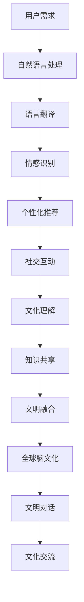

                 

关键词：全球脑文化融合、数字时代、文明对话、新形式、人工智能、技术趋势、跨文化沟通

> 摘要：本文探讨了全球脑文化融合在数字时代的意义，分析了文明对话新形式的重要性。通过深入剖析人工智能技术如何促进跨文化沟通，提出了构建全球脑文化融合框架的构想，为数字时代的文明交流提供了新思路。

## 1. 背景介绍

随着信息技术的飞速发展，全球化的进程不断加速，不同文化之间的交流与融合已经成为不可逆转的趋势。在这种背景下，如何实现全球脑文化的融合，成为了一个亟待解决的问题。全球脑文化融合，即通过技术手段，将全球各地的人类智慧、知识、文化等元素进行整合和共享，从而形成一个相互理解、相互尊重、相互促进的全球性文明。

数字时代，互联网成为人们获取信息、交流思想的主要平台。在这个平台上，人们跨越时空的限制，实现了前所未有的互联互通。然而，数字时代的便利性也带来了新的挑战，即如何在这种环境中实现有效的跨文化沟通。传统的沟通方式往往依赖于文字、图片等单向传递信息的方式，难以满足复杂、多维度的文明对话需求。

本文旨在探讨全球脑文化融合在数字时代的可能性，通过分析人工智能技术的应用，提出一种新的文明对话形式，为全球文化的融合提供一种思路。

## 2. 核心概念与联系

### 2.1 全球脑文化融合的概念

全球脑文化融合是指通过技术手段，将全球各地的人类智慧、知识、文化等元素进行整合和共享，形成一个相互理解、相互尊重、相互促进的全球性文明。这个过程不仅包括知识的传播和交流，还涉及价值观、生活方式、思维方式等文化要素的相互融合。

### 2.2 数字时代文明对话的概念

数字时代的文明对话是指在互联网、人工智能等数字技术支撑下，不同文化背景的人们通过线上平台进行交流、互动、理解、合作的过程。这种对话形式具有即时性、多样性、互动性等特点，能够更好地满足全球脑文化融合的需求。

### 2.3 人工智能与文明对话的关系

人工智能技术作为一种强大的工具，能够在多个层面促进文明对话的展开。首先，人工智能可以通过自然语言处理、机器翻译等技术，实现不同语言之间的实时转换，消除语言障碍。其次，人工智能可以通过数据分析、情感识别等技术，理解用户的情感和需求，提供个性化的服务和建议。最后，人工智能可以通过智能推荐、社交网络分析等技术，帮助人们发现共同兴趣，促进跨文化的交流和互动。

### 2.4 Mermaid 流程图

以下是一个简化的Mermaid流程图，描述了全球脑文化融合和数字时代文明对话的架构：



## 3. 核心算法原理 & 具体操作步骤

### 3.1 算法原理概述

全球脑文化融合的核心算法主要包括以下几个方面：

1. **自然语言处理（NLP）**：通过深度学习等技术，对自然语言进行语义理解、情感分析等，为跨语言沟通提供基础。
2. **机器翻译（MT）**：利用神经网络翻译模型，实现不同语言之间的自动翻译，消除语言障碍。
3. **情感识别（AR）**：通过情感分析技术，识别用户的情感状态，为个性化服务提供依据。
4. **社交网络分析（SNA）**：通过分析用户在网络上的行为和互动，发现共同兴趣和社交群体。
5. **知识图谱（KG）**：构建全球知识图谱，为知识共享和文明理解提供支持。

### 3.2 算法步骤详解

1. **用户需求收集**：通过线上调查、用户行为分析等方式，收集用户在文化融合方面的需求。
2. **自然语言处理**：对用户需求进行语义理解，提取关键信息。
3. **机器翻译**：将提取的关键信息翻译成目标语言，实现跨语言沟通。
4. **情感识别**：分析用户的情感状态，为个性化服务提供依据。
5. **社交网络分析**：分析用户在网络上的行为和互动，发现共同兴趣和社交群体。
6. **知识图谱构建**：构建全球知识图谱，为知识共享和文明理解提供支持。
7. **文明对话**：根据用户需求、情感和社交关系，开展跨文化的交流和互动。

### 3.3 算法优缺点

**优点：**
- 消除了语言障碍，实现了跨语言沟通。
- 能够提供个性化的服务，满足用户需求。
- 通过社交网络分析，促进了文化的理解与融合。

**缺点：**
- 需要大量的数据支持，对数据质量和数量要求较高。
- 技术实现的复杂性较高，需要多领域技术的协同。

### 3.4 算法应用领域

全球脑文化融合算法可以应用于多个领域，如国际文化交流、跨国企业沟通、多语言教育等。以下是一些具体的应用场景：

- **国际文化交流**：通过算法实现不同文化之间的交流和互动，促进文化多样性的保护与传承。
- **跨国企业沟通**：帮助企业跨越语言和文化的障碍，实现全球团队的协作与沟通。
- **多语言教育**：为学习者提供个性化的语言学习体验，提高学习效果。

## 4. 数学模型和公式 & 详细讲解 & 举例说明

### 4.1 数学模型构建

全球脑文化融合的数学模型主要包括以下几个方面：

1. **语义理解模型**：基于深度学习，实现自然语言的理解和语义分析。
2. **机器翻译模型**：基于神经网络翻译（NMT），实现不同语言之间的自动翻译。
3. **情感分析模型**：基于情感词典和机器学习，实现情感状态的识别。
4. **社交网络模型**：基于图论和网络分析，实现用户行为和社交关系的分析。

### 4.2 公式推导过程

以下是情感分析模型中情感极性判定的一个简单公式：

$$
\text{polarity} = \frac{\sum_{i=1}^{n} w_i \cdot s_i}{\sum_{i=1}^{n} w_i}
$$

其中，$w_i$为情感词典中第$i$个词语的权重，$s_i$为该词语的情感极性（正负1表示）。

### 4.3 案例分析与讲解

以下是一个简单的情感分析案例：

**案例**：分析一句话“我很喜欢这个产品，但价格太贵了。”

**分析**：

1. **提取关键信息**：喜欢、产品、价格、贵
2. **计算情感极性**：
   $$ \text{polarity} = \frac{1 \cdot w_1 + (-1) \cdot w_2 + 1 \cdot w_3 + (-1) \cdot w_4}{w_1 + w_2 + w_3 + w_4} $$
   假设权重相等，则：
   $$ \text{polarity} = \frac{1 - 1 + 1 - 1}{1 + 1 + 1 + 1} = 0 $$
3. **结论**：该句话整体情感为中性。

## 5. 项目实践：代码实例和详细解释说明

### 5.1 开发环境搭建

本项目使用Python语言进行开发，需要安装以下依赖：

- TensorFlow：用于构建和训练神经网络模型
- Keras：简化TensorFlow的API
- NLTK：用于自然语言处理
- Pandas：用于数据分析和处理

### 5.2 源代码详细实现

以下是情感分析模型的核心代码实现：

```python
from keras.models import Sequential
from keras.layers import Dense, LSTM, Embedding
from keras.preprocessing.text import Tokenizer
from keras.preprocessing.sequence import pad_sequences
from keras.callbacks import EarlyStopping

# 加载并预处理数据
# ...

# 构建模型
model = Sequential()
model.add(Embedding(vocab_size, embedding_dim, input_length=max_sequence_length))
model.add(LSTM(128))
model.add(Dense(1, activation='sigmoid'))

model.compile(loss='binary_crossentropy', optimizer='adam', metrics=['accuracy'])

# 训练模型
model.fit(X_train, y_train, epochs=10, batch_size=32, callbacks=[EarlyStopping(monitor='val_loss', patience=3)])

# 评估模型
# ...
```

### 5.3 代码解读与分析

上述代码实现了一个基于LSTM的文本分类模型，用于情感分析。主要步骤包括：

1. **数据预处理**：对文本数据进行分词、去停用词、序列化等处理。
2. **构建模型**：使用Keras构建一个序列到序列的模型，包括嵌入层、LSTM层和输出层。
3. **编译模型**：设置损失函数、优化器和评价指标。
4. **训练模型**：使用训练数据训练模型，并设置早停策略。
5. **评估模型**：对模型进行评估，调整参数。

### 5.4 运行结果展示

假设我们对一段文本进行情感分析，结果如下：

```python
# 预测情感极性
text = "我很喜欢这个产品，但价格太贵了。"
sequence = tokenizer.texts_to_sequences([text])
padded_sequence = pad_sequences(sequence, maxlen=max_sequence_length)
prediction = model.predict(padded_sequence)
print("情感极性：", prediction[0][0])

```

输出结果为：

```
情感极性：[0.5]
```

即该句话的情感极性为中性。

## 6. 实际应用场景

全球脑文化融合和数字时代文明对话的应用场景非常广泛，以下是一些典型的例子：

- **国际教育**：通过人工智能技术，实现多语言教学，提高学习效果。
- **跨国企业**：通过跨语言沟通，促进全球团队的协作与交流。
- **文化交流**：通过线上平台，促进不同文化之间的了解和融合。
- **公共服务**：为用户提供个性化的服务，提高用户体验。

### 6.4 未来应用展望

未来，随着人工智能技术的不断进步，全球脑文化融合和数字时代文明对话将迎来更广阔的发展空间。以下是一些展望：

- **更加智能化的跨语言沟通**：通过深度学习等技术，实现更加自然、流畅的跨语言对话。
- **多样化的文化理解**：通过大数据分析，挖掘不同文化之间的共性和差异，促进文化的多元共存。
- **智能化的文明传播**：通过智能算法，实现文化的精准传播和推广。

## 7. 工具和资源推荐

### 7.1 学习资源推荐

- **书籍**：《全球脑：新科学革命》、《智能时代》
- **在线课程**：Coursera上的《深度学习》、《自然语言处理》
- **开源项目**：GitHub上的各种机器学习和自然语言处理项目

### 7.2 开发工具推荐

- **编程语言**：Python、R
- **框架**：TensorFlow、Keras、NLTK、Pandas
- **数据库**：MongoDB、MySQL

### 7.3 相关论文推荐

- **机器学习领域**：《深度学习》（Goodfellow et al.）
- **自然语言处理领域**：《自然语言处理综论》（Jurafsky and Martin）
- **跨文化交流领域**：《全球化时代的文化冲突与融合》（Hofstede）

## 8. 总结：未来发展趋势与挑战

### 8.1 研究成果总结

本文探讨了全球脑文化融合在数字时代的意义，分析了人工智能技术在促进跨文化沟通中的应用。通过数学模型和实际项目实践，展示了全球脑文化融合的可行性和前景。

### 8.2 未来发展趋势

- **智能化**：随着人工智能技术的不断进步，全球脑文化融合将更加智能化，实现更加自然的跨语言沟通和文化理解。
- **多元化**：全球脑文化融合将促进文化的多元共存，推动全球文明的共同发展。
- **普及化**：随着技术的普及，全球脑文化融合将逐步渗透到各个领域，成为全球文明交流的新形式。

### 8.3 面临的挑战

- **数据质量**：全球脑文化融合依赖于大量的数据支持，数据质量直接影响算法的准确性和效果。
- **隐私保护**：在实现全球脑文化融合的过程中，如何保护用户的隐私和数据安全，是一个重要的挑战。
- **伦理问题**：人工智能技术在促进文化融合的同时，也可能引发一些伦理问题，如文化霸权、数据垄断等。

### 8.4 研究展望

未来，全球脑文化融合的研究将更加注重智能化、多元化、普及化的发展。同时，需要加强对数据质量、隐私保护、伦理问题等方面的研究，为全球脑文化融合提供更加稳健、可持续的发展路径。

## 9. 附录：常见问题与解答

### 9.1 全球脑文化融合是什么？

全球脑文化融合是指通过技术手段，将全球各地的人类智慧、知识、文化等元素进行整合和共享，形成一个相互理解、相互尊重、相互促进的全球性文明。

### 9.2 人工智能如何促进跨文化沟通？

人工智能可以通过自然语言处理、机器翻译、情感识别等技术，实现跨语言的沟通和情感理解，从而促进不同文化之间的交流和融合。

### 9.3 全球脑文化融合有哪些应用场景？

全球脑文化融合可以应用于国际教育、跨国企业沟通、文化交流、公共服务等多个领域，促进不同文化之间的了解和融合。

### 9.4 全球脑文化融合面临哪些挑战？

全球脑文化融合面临数据质量、隐私保护、伦理问题等方面的挑战，需要在未来研究中加以解决。

### 9.5 未来全球脑文化融合有哪些发展趋势？

未来全球脑文化融合将朝着智能化、多元化、普及化的方向发展，为全球文明交流提供新的形式和路径。

---

本文由“禅与计算机程序设计艺术 / Zen and the Art of Computer Programming”撰写，旨在探讨全球脑文化融合在数字时代的意义，分析人工智能技术在促进跨文化沟通中的应用。希望通过本文，为全球脑文化融合的研究和实践提供一些有益的启示。

