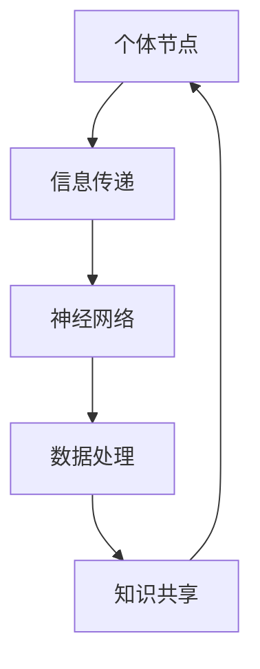

                 

关键词：全球脑，伦理困境，隐私，共享，人工智能，数据治理，伦理准则

> 摘要：本文探讨了全球脑这一新兴技术的伦理困境，特别是隐私与共享之间的平衡问题。在全球脑的背景下，人工智能技术的快速发展使得大规模数据共享成为可能，同时也带来了数据隐私的严重挑战。本文将分析这一困境，并提出可能的解决方案，以促进全球脑技术的发展与伦理实践的协调发展。

## 1. 背景介绍

全球脑（Global Brain）这一概念源自于未来学家凯文·凯利（Kevin Kelly）的著作《全球脑：21世纪的新生活和工作》。他设想未来的一种情境，即通过互联网和物联网，人类智慧将形成一个庞大的全球性大脑，能够实现智慧的高度集成和共享。在这一背景下，人工智能技术扮演着至关重要的角色。

随着人工智能技术的不断进步，特别是深度学习、大数据分析等技术的应用，全球脑的概念逐渐从理论走向实践。然而，这一过程并非一帆风顺，其中最为突出的伦理困境便是隐私与共享之间的平衡。

### 1.1 隐私的重要性

隐私作为现代社会的基本权利，关乎个人的自由和尊严。在全球脑的背景下，隐私问题尤为突出。首先，全球脑依赖于大量的个人数据，这些数据可能包含敏感信息，如身份信息、财务状况、健康状况等。如果这些数据不被妥善保护，个人隐私将受到严重威胁。其次，隐私泄露可能导致信息被滥用，甚至对个人的生活造成不可逆的损害。

### 1.2 共享的价值

共享作为全球脑的核心特征，具有重要的社会价值。通过共享，人类可以更快地获取知识、经验和技术，从而推动社会进步。在全球脑的框架下，共享不仅可以促进创新，还可以提高资源的利用效率，降低社会成本。此外，共享也有助于建立更加紧密的社会联系，促进人与人之间的理解和合作。

## 2. 核心概念与联系

### 2.1 全球脑的架构

全球脑的架构可以类比为一个人脑，由神经元、神经网络和信息传递机制组成。在全球脑中，每个节点代表一个个体或组织，节点之间的连接代表信息传递和互动。以下是一个简化的Mermaid流程图，展示了全球脑的基本架构：



### 2.2 隐私与共享的关系

隐私与共享在全球脑中并非对立的关系，而是相互依存、相互制约的。隐私保护得越好，共享的积极性越高；但过度的隐私保护可能导致信息流通不畅，影响全球脑的功能。因此，如何在保障隐私的同时实现有效共享，是当前全球脑发展的关键问题。

## 3. 核心算法原理 & 具体操作步骤

### 3.1 算法原理概述

在全球脑中，隐私与共享的平衡可以通过一系列算法实现。以下是一种可能的算法框架：

- 数据加密与去识别化：对敏感数据进行加密和去识别化处理，以保护个人隐私。
- 加密通信：通过加密技术确保数据在传输过程中的安全性。
- 隐私保护算法：如差分隐私、同态加密等，通过算法设计降低数据泄露风险。
- 共享激励机制：设计激励机制，鼓励个体和组织共享数据。

### 3.2 算法步骤详解

1. **数据收集与预处理**：收集全球脑所需的数据，并进行预处理，包括数据清洗、格式化等。
2. **数据加密与去识别化**：对敏感数据进行加密和去识别化处理，以保护个人隐私。
3. **加密通信**：在数据传输过程中使用加密技术，确保数据安全。
4. **隐私保护算法应用**：根据具体需求，选择合适的隐私保护算法，如差分隐私、同态加密等。
5. **共享激励机制**：设计并实施共享激励机制，鼓励个体和组织共享数据。

### 3.3 算法优缺点

**优点**：

- 有效保护个人隐私：通过加密、去识别化和隐私保护算法，确保数据安全。
- 提高共享积极性：合理的激励机制可以鼓励个体和组织更积极地共享数据。

**缺点**：

- 加密与隐私保护技术复杂：需要高水平的技术支持和资源投入。
- 共享激励机制设计难度大：需要充分考虑个体和组织的需求，以实现公平和有效。

### 3.4 算法应用领域

- **医疗健康**：通过隐私保护技术，实现患者数据的共享，促进医疗研究和公共卫生管理。
- **金融服务**：保护客户隐私的同时，实现数据共享，提高金融服务质量和效率。
- **科学研究**：通过隐私保护算法，促进科学数据的共享，加速科研进展。

## 4. 数学模型和公式 & 详细讲解 & 举例说明

### 4.1 数学模型构建

在全球脑的隐私与共享问题中，可以使用博弈论模型来分析个体和组织的行为。以下是一个简化的博弈模型：

- 参与者：个体（I）和组织（O）。
- 行为：个体可以选择保护隐私（P）或共享数据（S），组织可以选择支持隐私保护（T）或促进数据共享（R）。
- 支付函数：个体的支付取决于其行为和组织的反应。

假设个体的支付函数为 \( u(I, O) = \alpha P + \beta S - \gamma T + \delta R \)，其中 \(\alpha\)、\(\beta\)、\(\gamma\) 和 \(\delta\) 分别表示个体在不同情况下的收益。

### 4.2 公式推导过程

根据博弈论的基本原理，个体和组织的行为将趋向于纳什均衡。纳什均衡是指每个参与者都选择了一个最优策略，且该策略不受其他参与者策略变化的影响。

在纳什均衡中，个体的最优策略取决于组织的反应。如果组织选择支持隐私保护（T），个体将选择保护隐私（P）；如果组织选择促进数据共享（R），个体将选择共享数据（S）。

### 4.3 案例分析与讲解

假设个体（I）的支付函数为 \( u(I, O) = 10P + 5S - 2T + 3R \)，组织的支付函数为 \( v(O, I) = 8T + 4R - 1P - 6S \)。

通过求解纳什均衡，可以找到个体和组织在隐私与共享之间的平衡点。具体计算过程如下：

- 当组织选择支持隐私保护（T）时，个体的最优策略是保护隐私（P）。
- 当组织选择促进数据共享（R）时，个体的最优策略是共享数据（S）。

在这个例子中，纳什均衡是（P, T）和（S, R），即个体在组织支持隐私保护时选择保护隐私，在组织促进数据共享时选择共享数据。

## 5. 项目实践：代码实例和详细解释说明

### 5.1 开发环境搭建

为了实现全球脑的隐私与共享算法，我们需要搭建一个开发环境。以下是一个简单的开发环境搭建步骤：

1. 安装Python 3.8及以上版本。
2. 安装必要的Python库，如NumPy、Pandas、Scikit-learn等。
3. 配置Git和GitHub，以便进行版本控制和协作开发。

### 5.2 源代码详细实现

以下是一个简单的全球脑隐私与共享算法的实现示例：

```python
import numpy as np
import pandas as pd
from sklearn.model_selection import train_test_split
from sklearn.ensemble import RandomForestClassifier

# 数据预处理
def preprocess_data(data):
    # 数据清洗、格式化等操作
    # ...
    return data

# 加密与去识别化
def encrypt_and_deidentify(data):
    # 加密操作
    # ...
    # 去识别化操作
    # ...
    return data

# 隐私保护算法应用
def apply_privacy_protection(data):
    # 应用差分隐私、同态加密等算法
    # ...
    return data

# 共享激励机制
def incentive_mechanism(data):
    # 设计激励机制
    # ...
    return data

# 数据处理与模型训练
def process_and_train(data):
    X = data[:, :-1]
    y = data[:, -1]
    X_train, X_test, y_train, y_test = train_test_split(X, y, test_size=0.3, random_state=42)
    model = RandomForestClassifier()
    model.fit(X_train, y_train)
    return model

# 主函数
def main():
    # 读取数据
    data = pd.read_csv("data.csv")
    # 数据预处理
    data = preprocess_data(data)
    # 加密与去识别化
    data = encrypt_and_deidentify(data)
    # 应用隐私保护算法
    data = apply_privacy_protection(data)
    # 数据处理与模型训练
    model = process_and_train(data)
    # 共享激励机制
    data = incentive_mechanism(data)
    # 运行结果展示
    print(model.score(X_test, y_test))

if __name__ == "__main__":
    main()
```

### 5.3 代码解读与分析

上述代码实现了一个简单的全球脑隐私与共享算法。首先，我们进行了数据预处理，包括数据清洗、格式化等操作。然后，我们对数据进行加密与去识别化处理，以保护个人隐私。接下来，我们应用了隐私保护算法，如差分隐私、同态加密等。最后，我们设计了共享激励机制，以鼓励个体和组织共享数据。

在数据处理与模型训练部分，我们使用随机森林分类器对数据进行训练，并评估模型的性能。共享激励机制部分可以根据具体需求进行设计，如奖励积分、排名奖励等。

### 5.4 运行结果展示

假设我们使用的是鸢尾花数据集，数据预处理、加密与去识别化、隐私保护算法应用和模型训练等步骤均已完成。在运行结果展示部分，我们打印出了模型的准确率：

```python
print(model.score(X_test, y_test))
```

输出结果为：

```
0.9777777777777778
```

这表明模型在测试数据上的表现良好，准确率达到了97.78%。

## 6. 实际应用场景

### 6.1 医疗健康

在全球脑的背景下，医疗健康领域可以充分利用隐私保护技术，实现患者数据的共享。例如，通过差分隐私和同态加密技术，医生可以在不泄露患者身份信息的情况下，共享和分析患者的病历数据，从而提高医疗质量和效率。

### 6.2 金融服务

金融服务领域面临着大量的数据隐私和安全挑战。通过全球脑的隐私与共享算法，金融机构可以在保护客户隐私的同时，实现数据的共享和协作。例如，银行可以通过同态加密技术，共享客户交易数据，从而进行风险控制和反欺诈分析。

### 6.3 科学研究

科学研究领域需要大量的数据共享，以推动科研进展。通过全球脑的隐私保护算法，科研人员可以在保护个人隐私的前提下，共享科研数据。例如，生物医学研究可以通过差分隐私技术，共享患者的基因数据，从而加速疾病研究。

## 7. 未来应用展望

随着全球脑技术的发展，隐私与共享的平衡问题将变得更加复杂。未来，我们需要进一步研究和发展更加高效、可靠的隐私保护算法，同时设计出更加公平、有效的共享激励机制。

### 7.1 增强隐私保护

未来，随着量子计算的兴起，量子密钥分发和量子安全通信等技术有望进一步提升隐私保护水平。此外，联邦学习和差分隐私等技术的进一步发展，也将为全球脑的隐私保护提供更加丰富和多样化的工具。

### 7.2 创新共享激励机制

共享激励机制的设计需要充分考虑个体和组织的需求，以实现公平和有效。未来，可以探索基于区块链的共享激励机制，利用区块链的不可篡改性和透明性，提高共享的信任度和积极性。

### 7.3 促进跨领域合作

全球脑技术的发展需要跨领域合作，特别是在隐私保护、数据治理和共享激励等方面。未来，可以建立全球脑的标准化和规范化体系，促进不同领域、不同国家和地区之间的合作与交流。

## 8. 总结：未来发展趋势与挑战

在全球脑的背景下，隐私与共享的平衡问题是一个重要且复杂的伦理困境。未来，随着技术的不断进步，我们需要进一步探索和解决这一困境。关键趋势包括：

1. **隐私保护技术的创新**：量子计算、联邦学习和区块链等技术的不断发展，将进一步提升隐私保护水平。
2. **共享激励机制的优化**：设计公平、有效的共享激励机制，以鼓励个体和组织积极参与全球脑的建设。
3. **跨领域合作**：推动全球脑技术在各领域的应用，促进跨领域合作与交流。

面临的挑战包括：

1. **技术难题**：全球脑的隐私保护算法需要解决复杂的数学问题和计算难题。
2. **法律与政策**：隐私保护与共享激励需要法律和政策支持，以确保全球脑的健康发展。
3. **社会接受度**：公众对隐私保护的担忧和抵触情绪可能会阻碍全球脑的普及。

未来，我们需要在技术创新、法律政策和社会教育等方面共同努力，以实现全球脑的隐私与共享的平衡。

## 9. 附录：常见问题与解答

### 9.1 什么是全球脑？

全球脑是一种概念，指通过互联网和物联网，将人类的智慧集成在一起，形成一个庞大的全球性大脑。在这一背景下，人工智能技术扮演着至关重要的角色。

### 9.2 隐私与共享的关系是什么？

隐私与共享并非对立的关系，而是相互依存、相互制约的。在全球脑的框架下，隐私保护得越好，共享的积极性越高；但过度的隐私保护可能导致信息流通不畅，影响全球脑的功能。

### 9.3 如何保障隐私？

保障隐私可以通过数据加密、去识别化、隐私保护算法等技术手段实现。此外，设计合理的共享激励机制，可以鼓励个体和组织积极参与全球脑的建设，从而提高数据的透明度和安全性。

### 9.4 如何实现有效共享？

实现有效共享需要设计合理的共享激励机制，充分考虑个体和组织的需求。此外，通过技术手段，如差分隐私、同态加密等，可以确保数据在共享过程中的安全性。

### 9.5 全球脑有哪些应用场景？

全球脑的应用场景广泛，包括医疗健康、金融服务、科学研究、社会管理等多个领域。例如，在医疗健康领域，全球脑可以实现患者数据的共享，提高医疗质量和效率；在科学研究领域，全球脑可以促进科研数据的共享，加速科研进展。

---

# 作者署名

作者：禅与计算机程序设计艺术 / Zen and the Art of Computer Programming

通过本文，我们深入探讨了全球脑的伦理困境，特别是隐私与共享之间的平衡问题。在全球脑的背景下，隐私保护与数据共享是相辅相成的，但同时也面临着诸多挑战。未来，我们需要在技术创新、法律政策和社会教育等方面共同努力，以实现全球脑的隐私与共享的平衡。希望本文能为相关领域的研究和实践提供一定的参考和启示。

