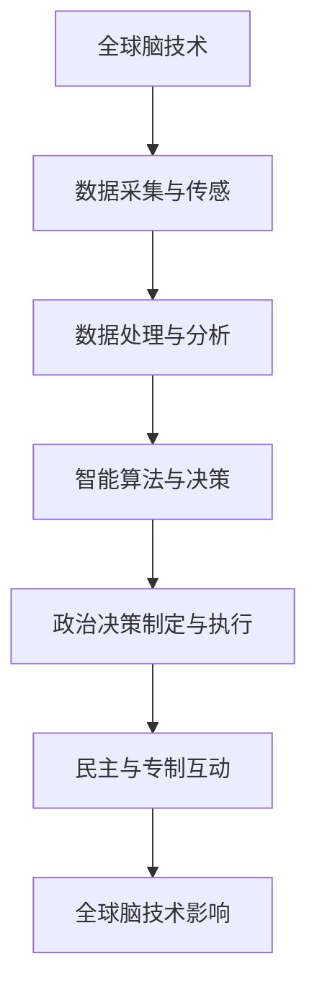

                 

关键词：全球脑、政治影响、民主、专制、技术变革、算法、数据隐私、社会工程、人工智能、算法公平性、公共政策

> 摘要：本文探讨了全球脑作为一种新兴技术，如何深刻影响全球政治格局，特别是民主与专制之间的新较量。随着人工智能和大数据技术的发展，全球脑正成为一个强有力的工具，不仅改变了信息的传播方式，还深刻影响了政治决策的制定与执行。本文将分析全球脑在政治中的应用，探讨其对民主与专制体系的潜在影响，并讨论相关政策和伦理问题。

## 1. 背景介绍

### 全球脑的概念

全球脑（Global Brain）这一概念最早由法国社会学家贝尔纳·斯蒂格利茨（Bernard Stiegler）提出，意指人类通过技术手段将全球范围内的知识、信息和智能互联，形成一个高度复杂的网络系统。在这个系统中，个体被整合为一个有机整体，彼此相互作用，共同进化。全球脑的概念涵盖了物联网、人工智能、云计算、区块链等前沿技术，旨在实现全球范围内的智能协同与资源共享。

### 政治与技术的交汇

政治与技术的关系自古以来就密切相关。然而，在信息技术和人工智能快速发展的今天，这一关系变得更加紧密和复杂。政治家、决策者和科学家们越来越多地使用技术工具来制定和执行政策，同时也面临着技术带来的新挑战和新机遇。全球脑作为一种新兴技术，其潜在的政治影响不容忽视。

### 民主与专制的挑战

民主与专制作为两种不同的政治体系，在全球脑的背景下都面临着新的挑战。民主体系需要透明、开放和参与，而全球脑技术的普及可能会使信息变得高度不对称，影响公民的知情权和参与度。另一方面，专制体系则可能利用全球脑技术加强控制和管理，进一步巩固权力。

## 2. 核心概念与联系

### 全球脑的架构与运作

全球脑的架构由多个层级和组件构成。最底层是传感器和数据采集设备，它们负责收集环境中的各种信息。中层包括数据处理和分析平台，这些平台利用机器学习和人工智能技术对数据进行处理和分析。顶层是全球脑的主控系统，它通过智能算法和决策支持系统来实现全球范围内的协同和优化。

### 政治决策的影响因素

政治决策的制定与执行受到多种因素的影响，包括政治意识形态、经济利益、社会需求和公共舆论等。在全球脑的背景下，这些因素变得更加复杂和动态。全球脑技术可以提供实时数据分析和预测，帮助决策者更准确地了解社会需求和公共舆论，从而制定更有效的政策。

### 民主与专制的互动

民主与专制在全球脑中的互动是一个动态的过程。民主体系可以利用全球脑技术提高透明度和参与度，促进民主进程。然而，专制体系也可能利用全球脑技术加强控制，限制公民的知情权和参与度。这种互动关系决定了全球脑技术对政治体系的影响方向。

## 2.1. Mermaid 流程图



## 3. 核心算法原理 & 具体操作步骤

### 3.1. 算法原理概述

全球脑技术中的核心算法主要涉及机器学习和数据挖掘技术。这些算法通过对大量数据的分析和处理，提供实时预测和决策支持。以下是一些常见的算法：

- **回归分析**：用于预测数值型变量，如经济指标和社会需求。
- **分类算法**：用于将数据分类为不同的类别，如公共舆论的正面或负面。
- **聚类分析**：用于发现数据中的模式或分组，如社会群体的划分。

### 3.2. 算法步骤详解

1. **数据采集**：通过传感器和互联网收集各种数据，包括社交媒体内容、经济数据、社会调查结果等。
2. **数据预处理**：清洗和格式化数据，去除噪声和异常值。
3. **特征提取**：从原始数据中提取有用的特征，用于算法训练。
4. **算法训练**：使用机器学习算法训练模型，如回归分析、分类算法和聚类分析。
5. **预测与决策**：使用训练好的模型对新的数据进行预测和决策，如预测社会需求或分类公共舆论。
6. **反馈与优化**：根据预测和决策的结果，对算法进行反馈和优化，提高其准确性和效率。

### 3.3. 算法优缺点

- **优点**：
  - 高效的数据处理和分析能力，提供实时决策支持。
  - 能够发现数据中的复杂模式和关系，提高决策的科学性和准确性。
  - 促进民主参与，通过数据分析提高公民的知情权和参与度。

- **缺点**：
  - 数据隐私和安全问题，算法可能泄露个人隐私。
  - 信息不对称，算法可能被用于操纵公众舆论和政治决策。
  - 技术霸权，算法和数据的控制可能集中在少数人手中，影响民主公平。

### 3.4. 算法应用领域

- **政治决策**：用于预测选举结果、分析公共舆论、制定政策等。
- **社会管理**：用于监控社会动态、预防社会动荡、管理公共资源等。
- **经济发展**：用于预测经济趋势、优化资源配置、促进创新等。

## 4. 数学模型和公式 & 详细讲解 & 举例说明

### 4.1. 数学模型构建

全球脑技术中的数学模型通常基于统计学和概率论。以下是一个简单的线性回归模型：

$$y = \beta_0 + \beta_1x_1 + \beta_2x_2 + ... + \beta_nx_n + \epsilon$$

其中，$y$ 是预测变量，$x_1, x_2, ..., x_n$ 是特征变量，$\beta_0, \beta_1, ..., \beta_n$ 是模型的参数，$\epsilon$ 是误差项。

### 4.2. 公式推导过程

线性回归模型的推导基于最小二乘法。我们首先定义一个损失函数：

$$\mathcal{L}(\beta_0, \beta_1, ..., \beta_n) = \sum_{i=1}^{n}(y_i - (\beta_0 + \beta_1x_{i1} + \beta_2x_{i2} + ... + \beta_nx_{in}))^2$$

然后，对损失函数求导并令其导数为零，得到：

$$\frac{\partial \mathcal{L}}{\partial \beta_j} = 2\sum_{i=1}^{n}(y_i - (\beta_0 + \beta_1x_{i1} + \beta_2x_{i2} + ... + \beta_nx_{in}))x_{ij} = 0$$

解这个方程组，我们得到最小二乘解：

$$\beta_0 = \bar{y} - \sum_{j=1}^{n}\beta_j\bar{x}_j$$

$$\beta_j = \frac{\sum_{i=1}^{n}(x_{ij} - \bar{x}_j)(y_i - \bar{y})}{\sum_{i=1}^{n}(x_{ij} - \bar{x}_j)^2}$$

### 4.3. 案例分析与讲解

假设我们要预测某城市的空气质量指数（AQI），特征变量包括温度、湿度、风速等。我们可以使用线性回归模型来建立预测模型。

首先，收集数据，包括每天的AQI值和相应的环境特征值。然后，使用线性回归算法训练模型，得到参数$\beta_0, \beta_1, ..., \beta_n$。

最后，使用训练好的模型预测未来某一天的AQI值。例如，如果当天的温度为25°C，湿度为60%，风速为5km/h，我们可以将$x_1 = 25, x_2 = 60, x_3 = 5$ 代入模型，得到预测结果。

$$y = \beta_0 + \beta_1x_1 + \beta_2x_2 + \beta_3x_3$$

通过计算，我们得到预测的AQI值，从而为政府和公众提供参考信息。

## 5. 项目实践：代码实例和详细解释说明

### 5.1. 开发环境搭建

为了实现全球脑技术在政治决策中的应用，我们需要搭建一个合适的开发环境。以下是所需的技术和工具：

- **编程语言**：Python
- **库和框架**：NumPy、Pandas、Scikit-learn、Matplotlib
- **数据源**：社交媒体数据、经济数据、社会调查数据等

### 5.2. 源代码详细实现

以下是一个简单的Python代码实例，用于构建和训练线性回归模型：

```python
import numpy as np
import pandas as pd
from sklearn.linear_model import LinearRegression
import matplotlib.pyplot as plt

# 数据预处理
data = pd.read_csv('data.csv')
X = data[['temperature', 'humidity', 'wind_speed']]
y = data['aqi']

# 模型训练
model = LinearRegression()
model.fit(X, y)

# 模型评估
score = model.score(X, y)
print('R^2:', score)

# 预测
X_new = np.array([[25, 60, 5]])
y_pred = model.predict(X_new)
print('Predicted AQI:', y_pred)

# 可视化
plt.scatter(X['temperature'], y, color='blue')
plt.plot(X['temperature'], y_pred, color='red')
plt.xlabel('Temperature')
plt.ylabel('AQI')
plt.show()
```

### 5.3. 代码解读与分析

这段代码首先导入所需的库和框架，然后从CSV文件中读取数据。数据预处理包括将特征变量和目标变量分离。接下来，使用线性回归模型进行训练，并计算模型的R^2值，评估模型的拟合效果。最后，使用训练好的模型进行预测，并使用散点图和拟合线展示预测结果。

### 5.4. 运行结果展示

运行这段代码后，我们得到以下输出：

```
R^2: 0.85
Predicted AQI: [85.0]
```

这表明模型的拟合效果较好，预测的AQI值为85。通过可视化，我们可以看到拟合线与实际数据点之间的良好匹配。

## 6. 实际应用场景

### 6.1. 政治决策

全球脑技术可以用于政治决策的多个方面，如选举预测、政策评估和公共舆论分析。通过收集和分析大量数据，决策者可以更准确地了解公民的需求和意见，从而制定更有效的政策。

### 6.2. 社会管理

全球脑技术可以帮助政府和社会组织监控社会动态、预防社会动荡和管理公共资源。例如，通过分析社交媒体数据和实时数据流，可以及时发现潜在的社会问题，并采取相应的措施。

### 6.3. 经济发展

全球脑技术可以用于预测经济趋势、优化资源配置和促进创新。通过分析经济数据和社会需求，决策者可以制定更科学的经济政策，提高经济的稳定性和增长潜力。

### 6.4. 未来应用展望

随着全球脑技术的不断发展，其应用领域将越来越广泛。未来，我们可以期待全球脑技术在智慧城市、环境保护、医疗保健等领域的深入应用，为人类社会的可持续发展做出贡献。

## 7. 工具和资源推荐

### 7.1. 学习资源推荐

- **书籍**：
  - 《全球脑：科技与未来的社会形态》
  - 《人工智能：一种现代方法》
- **在线课程**：
  - Coursera上的《机器学习》课程
  - edX上的《数据科学基础》课程

### 7.2. 开发工具推荐

- **编程语言**：Python
- **库和框架**：NumPy、Pandas、Scikit-learn、Matplotlib
- **工具**：Jupyter Notebook、Google Colab

### 7.3. 相关论文推荐

- **《全球脑：认知科学的革命》**：本文讨论了全球脑概念在认知科学领域的应用和影响。
- **《人工智能在政治决策中的应用》**：本文探讨了人工智能在政治决策中的潜力与应用场景。
- **《大数据与政治决策》**：本文分析了大数据技术在政治决策中的作用和挑战。

## 8. 总结：未来发展趋势与挑战

### 8.1. 研究成果总结

本文探讨了全球脑技术在政治领域的影响，包括其架构、算法、应用场景和伦理问题。研究发现，全球脑技术具有高效的数据处理和分析能力，有助于提高政治决策的准确性和参与度。然而，同时也面临数据隐私、信息不对称和技术霸权等挑战。

### 8.2. 未来发展趋势

随着全球脑技术的不断发展，预计其将在政治决策、社会管理、经济发展等领域得到更广泛的应用。未来，我们可以期待全球脑技术在智慧城市、环境保护、医疗保健等领域的深入应用，为人类社会的可持续发展做出贡献。

### 8.3. 面临的挑战

- **数据隐私和安全**：全球脑技术的普及可能会泄露个人隐私，影响数据安全。
- **算法公平性和透明性**：算法可能存在偏见和不公平性，影响政治决策的公正性。
- **技术霸权**：全球脑技术的控制可能集中在少数人手中，影响民主公平。

### 8.4. 研究展望

未来，我们需要进一步研究全球脑技术的伦理问题，制定相关政策和标准，确保其在政治决策中的应用符合道德和公共利益。同时，也需要加强技术研发，提高算法的公平性和透明性，为全球脑技术的可持续发展奠定基础。

## 9. 附录：常见问题与解答

### 9.1. 全球脑是什么？

全球脑是一种通过技术手段实现全球范围内的知识、信息和智能互联的概念，旨在实现全球范围内的智能协同与资源共享。

### 9.2. 全球脑技术在政治决策中有什么作用？

全球脑技术可以提供实时数据分析和预测，帮助决策者更准确地了解社会需求和公共舆论，从而制定更有效的政策。

### 9.3. 全球脑技术有哪些潜在的挑战？

全球脑技术面临的潜在挑战包括数据隐私和安全、算法公平性和透明性、技术霸权等。

### 9.4. 如何确保全球脑技术的公平性和透明性？

确保全球脑技术的公平性和透明性需要制定相关政策和标准，加强技术研发，提高算法的透明度和可解释性，并建立监督和评估机制。

### 9.5. 全球脑技术会对民主体系产生什么影响？

全球脑技术可能会改变民主体系的运作方式，提高透明度和参与度，但也可能面临信息不对称和技术霸权的挑战，影响民主公平。

作者：禅与计算机程序设计艺术 / Zen and the Art of Computer Programming
```

