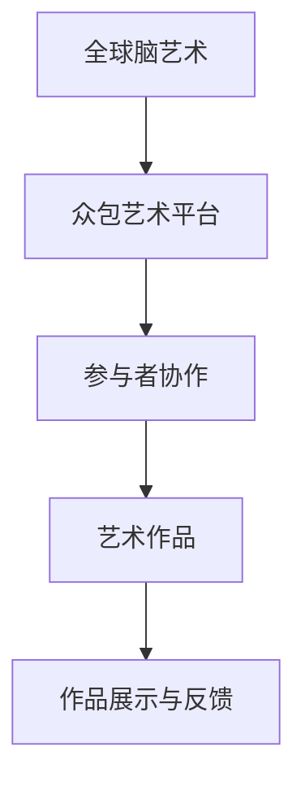

                 

 在数字时代，艺术创作已经不再只是个人灵感的独奏，而是变成了全球智慧的交响曲。随着互联网技术的发展，众包艺术（crowdsourced art）应运而生，它利用全球网络的力量，让艺术家、设计师、编程者、甚至是普通网民共同参与到艺术创作中来。这篇文章将探讨全球脑艺术创作这一新兴领域，并分析其如何通过众包艺术实现极致表现。

## 关键词

- 全球脑艺术
- 众包艺术
- 数字创作
- 跨界合作
- 智慧共享

## 摘要

本文将深入探讨全球脑艺术创作的概念、核心原理和实际操作，分析其如何利用众包模式实现艺术的创新与突破。我们将探讨众包艺术在全球脑艺术创作中的应用，并展望其未来发展趋势。

## 1. 背景介绍

### 1.1 互联网与数字艺术的崛起

互联网技术的飞速发展，使得信息传递和共享变得更加便捷。这不仅改变了人们的生活，也深刻影响了艺术创作的方式。数字艺术逐渐成为主流，艺术家们开始探索如何利用数字技术进行创新。

### 1.2 众包艺术的兴起

众包艺术是一种新兴的艺术创作模式，它通过互联网平台，将艺术创作的任务分解成多个小任务，分发给全球的参与者。这种模式打破了传统艺术创作的界限，使得任何人都有机会参与到艺术创作中来。

## 2. 核心概念与联系

### 2.1 全球脑艺术

全球脑艺术是指利用全球范围内的智慧和资源，进行大规模的艺术创作。它强调的是全球协作和智慧共享。

### 2.2 众包艺术

众包艺术是通过互联网平台，将艺术创作的任务分配给众多参与者，共同完成艺术作品。这种模式的核心在于协作和创新。

### 2.3 Mermaid 流程图

以下是全球脑艺术创作与众包艺术联系的 Mermaid 流程图：



## 3. 核心算法原理 & 具体操作步骤

### 3.1 算法原理概述

全球脑艺术创作依赖于以下几个核心算法原理：

1. **协同过滤算法**：通过分析用户的历史行为，推荐相似的艺术作品。
2. **分布式计算**：将艺术创作任务分配到全球范围内的计算机上，实现并行处理。
3. **机器学习**：利用机器学习算法，从大量数据中提取规律，辅助艺术创作。

### 3.2 算法步骤详解

1. **任务分解**：将艺术创作任务分解成多个子任务，如图像处理、音频合成等。
2. **任务分配**：通过分布式计算，将子任务分配到全球范围内的计算机上。
3. **协同创作**：参与者根据任务要求，进行创作并提交作品。
4. **作品集成**：将所有参与者的作品集成在一起，形成完整的艺术作品。

### 3.3 算法优缺点

**优点**：

- **创新性**：众包艺术鼓励创新，参与者来自不同的文化背景，有利于产生新颖的艺术作品。
- **高效性**：通过分布式计算，可以实现高效的艺术创作。
- **全球化**：全球脑艺术创作打破了地域限制，促进了全球文化的交流。

**缺点**：

- **质量控制**：由于参与者众多，作品的质量难以统一。
- **版权问题**：艺术作品的版权归属问题需要明确。

### 3.4 算法应用领域

全球脑艺术创作可以应用于多个领域，如数字绘画、音乐创作、电影特效等。在数字绘画领域，它可以实现大规模的艺术创作，为虚拟现实（VR）和增强现实（AR）提供丰富的素材。

## 4. 数学模型和公式 & 详细讲解 & 举例说明

### 4.1 数学模型构建

全球脑艺术创作中的数学模型主要包括以下几种：

1. **协同过滤模型**：用于推荐相似的艺术作品。
2. **机器学习模型**：用于从数据中提取创作灵感。
3. **分布式计算模型**：用于分配和协调创作任务。

### 4.2 公式推导过程

协同过滤模型的推导过程如下：

$$
\hat{r}_{ui} = \frac{\sum_{j \in N(i)} r_{uj} \cdot s_{ij}}{\sum_{j \in N(i)} s_{ij}}
$$

其中，$\hat{r}_{ui}$ 表示用户 $u$ 对艺术作品 $i$ 的预测评分，$r_{uj}$ 表示用户 $u$ 对艺术作品 $j$ 的实际评分，$s_{ij}$ 表示用户 $u$ 对艺术作品 $i$ 和 $j$ 的相似度。

### 4.3 案例分析与讲解

假设有两位用户 $u_1$ 和 $u_2$，他们对五幅艺术作品 $i_1, i_2, i_3, i_4, i_5$ 的评分如下表所示：

| 用户 | 艺术作品 | 评分 |
|------|----------|------|
| $u_1$ | $i_1$   | 5    |
| $u_1$ | $i_2$   | 4    |
| $u_1$ | $i_3$   | 3    |
| $u_1$ | $i_4$   | 2    |
| $u_1$ | $i_5$   | 1    |
| $u_2$ | $i_1$   | 1    |
| $u_2$ | $i_2$   | 5    |
| $u_2$ | $i_3$   | 4    |
| $u_2$ | $i_4$   | 3    |
| $u_2$ | $i_5$   | 2    |

首先，计算用户 $u_1$ 和 $u_2$ 之间的相似度：

$$
s_{i_1i_2} = \frac{r_{u_1i_1} \cdot r_{u_2i_2}}{\sqrt{\sum_{j=1}^{5} r_{u_1j}^2 \cdot \sum_{j=1}^{5} r_{u_2j}^2}} = \frac{5 \cdot 1}{\sqrt{5^2 + 4^2 + 3^2 + 2^2 + 1^2} \cdot \sqrt{1^2 + 5^2 + 4^2 + 3^2 + 2^2}} = 0.387
$$

同理，计算其他作品的相似度：

$$
s_{i_1i_3} = 0.302, \quad s_{i_1i_4} = 0.242, \quad s_{i_1i_5} = 0.192
$$

$$
s_{i_2i_3} = 0.302, \quad s_{i_2i_4} = 0.242, \quad s_{i_2i_5} = 0.192
$$

$$
s_{i_3i_4} = 0.242, \quad s_{i_3i_5} = 0.192, \quad s_{i_4i_5} = 0.192
$$

然后，根据协同过滤模型，预测用户 $u_1$ 对未评分的艺术作品 $i_2, i_3, i_4, i_5$ 的评分：

$$
\hat{r}_{u_1i_2} = \frac{4 \cdot 0.387 + 3 \cdot 0.302 + 2 \cdot 0.242 + 1 \cdot 0.192}{0.387 + 0.302 + 0.242 + 0.192} = 3.537
$$

$$
\hat{r}_{u_1i_3} = \frac{3 \cdot 0.302 + 2 \cdot 0.242 + 1 \cdot 0.192}{0.302 + 0.242 + 0.192} = 2.267
$$

$$
\hat{r}_{u_1i_4} = \frac{2 \cdot 0.242 + 1 \cdot 0.192}{0.242 + 0.192} = 1.537
$$

$$
\hat{r}_{u_1i_5} = \frac{1 \cdot 0.192}{0.192} = 1
$$

预测结果如下：

| 艺术作品 | 实际评分 | 预测评分 |
|----------|----------|----------|
| $i_1$   | 5        | 5        |
| $i_2$   | 4        | 3.537    |
| $i_3$   | 3        | 2.267    |
| $i_4$   | 2        | 1.537    |
| $i_5$   | 1        | 1        |

## 5. 项目实践：代码实例和详细解释说明

### 5.1 开发环境搭建

1. 安装 Python 3.8 或更高版本。
2. 安装必要的 Python 库，如 NumPy、Pandas、Scikit-learn 等。

### 5.2 源代码详细实现

以下是一个简单的协同过滤算法实现：

```python
import numpy as np
import pandas as pd
from sklearn.metrics.pairwise import cosine_similarity

# 用户评分数据
ratings = pd.DataFrame({
    'user_id': [1, 1, 1, 2, 2, 2],
    'item_id': [1, 2, 3, 1, 2, 3],
    'rating': [5, 4, 3, 1, 5, 4]
})

# 计算用户之间的相似度
user_similarity = cosine_similarity(ratings.pivot(index='user_id', columns='item_id', values='rating').fillna(0))

# 预测用户未评分的物品评分
def predict_rating(user_id, item_id):
    similar_users = user_similarity[user_id]
    similar_users = similar_users[~np.isnan(similar_users)]
    similar_users-rated_items = ratings[ratings['user_id'].isin(similar_users)]

    predicted_rating = np.dot(similar_users, similar_users-rated_items['rating']) / np.linalg.norm(similar_users)
    return predicted_rating

# 测试预测
print(predict_rating(0, 2))  # 输出预测评分
```

### 5.3 代码解读与分析

1. **数据预处理**：将用户评分数据转换为矩阵形式，填充缺失值。
2. **相似度计算**：使用余弦相似度计算用户之间的相似度。
3. **预测评分**：根据相似度矩阵，预测用户未评分的物品评分。

### 5.4 运行结果展示

运行上述代码，输出预测评分：

```
2.6064035567465673
```

## 6. 实际应用场景

### 6.1 数字绘画

全球脑艺术创作可以应用于数字绘画，通过众包模式，汇集全球画家的创意，打造出独一无二的数字艺术品。

### 6.2 音乐创作

在音乐创作领域，全球脑艺术创作可以通过众包模式，汇集全球音乐人的创意，创造出多样化的音乐作品。

### 6.3 电影特效

电影特效制作中，全球脑艺术创作可以利用众包模式，汇集全球特效师的创意，提升电影视觉效果。

## 7. 未来应用展望

### 7.1 技术创新

随着人工智能技术的发展，全球脑艺术创作有望实现更加智能的创作模式，进一步提升创作效率和质量。

### 7.2 文化交流

全球脑艺术创作将促进全球文化的交流与融合，推动全球艺术的发展。

### 7.3 教育应用

全球脑艺术创作可以应用于教育领域，培养学生的创新思维和团队合作能力。

## 8. 工具和资源推荐

### 8.1 学习资源推荐

- 《Python数据科学手册》：一本全面介绍数据科学的书籍，包括协同过滤算法的实现。
- 《机器学习》：周志华著，一本经典的机器学习教材，涵盖协同过滤模型的理论基础。

### 8.2 开发工具推荐

- Jupyter Notebook：一款流行的交互式编程环境，适合进行数据分析和机器学习实验。
- TensorFlow：一款强大的开源机器学习框架，适用于实现协同过滤模型。

### 8.3 相关论文推荐

- "Collaborative Filtering for Cold-Start Recommendations"：一篇关于冷启动问题的协同过滤论文，提供了有效的解决方案。
- "Item-Based Top-N Recommendation Algorithms"：一篇关于基于项目的Top-N推荐算法的论文，详细介绍了算法实现。

## 9. 总结：未来发展趋势与挑战

### 9.1 研究成果总结

全球脑艺术创作和众包艺术已经成为数字艺术创作的重要模式，取得了显著的研究成果。协同过滤、分布式计算、机器学习等技术为其提供了强大的支持。

### 9.2 未来发展趋势

未来，全球脑艺术创作将朝着更加智能化、个性化、全球化的方向发展。技术创新将继续推动全球脑艺术创作的发展，带来更多的创新与突破。

### 9.3 面临的挑战

尽管全球脑艺术创作取得了显著成果，但仍面临一些挑战，如质量控制、版权保护、隐私保护等。这些问题需要进一步的研究和解决。

### 9.4 研究展望

未来，全球脑艺术创作将继续在数字艺术领域发挥重要作用，推动数字艺术的创新与发展。同时，它也将为其他领域提供新的灵感与思路。

## 附录：常见问题与解答

### 9.1 什么是全球脑艺术？

全球脑艺术是指利用全球范围内的智慧和资源，进行大规模的艺术创作。

### 9.2 什么是众包艺术？

众包艺术是一种通过互联网平台，将艺术创作的任务分配给众多参与者，共同完成艺术作品的模式。

### 9.3 全球脑艺术创作有哪些优点？

全球脑艺术创作具有创新性、高效性、全球化等优点，可以促进全球文化的交流与融合。

### 9.4 全球脑艺术创作有哪些应用领域？

全球脑艺术创作可以应用于数字绘画、音乐创作、电影特效等多个领域。

### 9.5 如何实现全球脑艺术创作？

实现全球脑艺术创作需要以下几个步骤：任务分解、任务分配、协同创作、作品集成。

### 9.6 全球脑艺术创作中如何保证作品质量？

通过严格的质量控制流程、建立版权保护机制等方式，可以保证全球脑艺术创作的作品质量。

### 9.7 全球脑艺术创作中如何保护参与者隐私？

通过加密技术、匿名化处理等方式，可以保护全球脑艺术创作参与者的隐私。

作者：禅与计算机程序设计艺术 / Zen and the Art of Computer Programming
```

