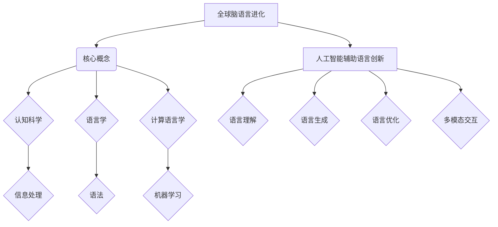

                 

关键词：全球脑语言、进化、人工智能、语言创新、认知科学、技术趋势

> 摘要：本文深入探讨了全球脑语言进化的背景、核心概念及其与人工智能的紧密联系。通过介绍人工智能辅助语言创新的机制，分析了该领域的研究现状、关键算法、数学模型及实际应用。同时，展望了未来发展趋势与挑战，为语言技术研究和应用提供了新的视角和思路。

## 1. 背景介绍

随着信息技术的迅猛发展，人工智能（AI）已经渗透到社会生活的各个领域。从早期的规则系统到现代的深度学习，AI技术不断进步，尤其在自然语言处理（NLP）领域，表现尤为突出。然而，尽管AI在语言理解、生成和翻译等方面取得了显著成果，但语言作为一种复杂的认知现象，仍然面临着许多挑战。

全球脑语言（Global Brain Language，简称GBL）的概念，最早由日本学者堺雅人在21世纪初提出。他认为，未来人类社会将形成一个全球性的“大脑”，其中语言作为信息传递和认知交流的媒介，将经历深刻的变革。GBL的核心观点是，语言不仅是人类沟通的工具，更是人类智慧的延伸和拓展。

人工智能辅助语言创新（AI-augmented Language Innovation），是指通过人工智能技术，提升语言研究、创作和应用的效率和效果。这种辅助不仅包括语言分析、生成和优化，还涉及语言理解、情感分析和多模态交互等多个方面。随着AI技术的不断发展，语言创新正迎来新的机遇和挑战。

本文旨在通过探讨全球脑语言进化与人工智能辅助语言创新的联系，分析当前的研究现状和关键技术，探讨未来发展的趋势与挑战，为语言技术研究和应用提供新的视角。

## 2. 核心概念与联系

### 2.1 全球脑语言（GBL）的概念与架构

全球脑语言（GBL）是一个跨学科的概念，涉及到认知科学、语言学、计算机科学等多个领域。GBL的基本理念是，全球范围内的个体通过语言和信息交流，形成一个相互连接、协同运作的“全球大脑”。

GBL的架构可以分为三个层次：基础层、中间层和应用层。基础层包括语言学的核心概念，如语法、语义和语用；中间层涉及计算语言学、机器学习和自然语言处理等技术；应用层则是具体的应用场景，如语言翻译、智能客服、内容生成等。

### 2.2 人工智能（AI）在语言创新中的应用

人工智能技术在语言创新中的应用主要体现在以下几个方面：

1. **语言理解**：通过深度学习、自然语言处理等技术，实现对于语言深层含义的理解，包括语义分析、情感分析和实体识别等。

2. **语言生成**：利用生成对抗网络（GAN）、变分自编码器（VAE）等技术，实现高质量的自然语言文本生成。

3. **语言优化**：通过优化算法，提升文本的表达效果，包括语法修正、用词建议和风格转换等。

4. **多模态交互**：结合语音、图像和视频等多种模态，实现更加自然的语言交互。

### 2.3 全球脑语言进化与人工智能辅助语言创新的联系

全球脑语言进化与人工智能辅助语言创新之间存在着紧密的联系。一方面，全球脑语言的进化为人工智能提供了丰富的语言数据和应用场景，促进了AI技术的发展。另一方面，人工智能技术则为全球脑语言的创新提供了强大的工具和支持。

具体来说，人工智能技术可以通过以下几个方面促进全球脑语言的进化：

1. **数据收集与处理**：通过大数据技术和自然语言处理算法，收集和分析全球范围内的语言数据，为语言研究提供丰富的素材。

2. **语言分析**：利用机器学习算法，对语言进行深入分析，揭示语言的内在规律和结构。

3. **语言生成**：通过人工智能技术，实现自动化语言生成，为全球脑语言的应用提供丰富的内容。

4. **跨语言交互**：通过机器翻译、多语言模型等技术，促进不同语言之间的交流和理解。

### 2.4 Mermaid 流程图



## 3. 核心算法原理 & 具体操作步骤

### 3.1 算法原理概述

在语言创新中，核心算法主要包括自然语言处理（NLP）、深度学习（DL）和生成对抗网络（GAN）等。这些算法通过不同方式对语言进行处理和生成，以实现语言创新的目标。

- **自然语言处理（NLP）**：NLP是使计算机能够理解、解释和生成人类语言的技术。其核心算法包括词性标注、句法分析、语义分析和情感分析等。

- **深度学习（DL）**：深度学习是一种模拟人脑神经网络的工作方式的机器学习技术。在语言创新中，深度学习主要用于语言建模、文本分类和情感分析等。

- **生成对抗网络（GAN）**：GAN是一种由生成器和判别器组成的新型深度学习模型。生成器负责生成新的语言数据，判别器负责判断数据是否真实。GAN在语言生成方面具有显著优势。

### 3.2 算法步骤详解

#### 3.2.1 自然语言处理（NLP）

1. **数据预处理**：包括文本清洗、分词和词性标注等。
2. **词向量表示**：将文本转换为向量表示，常用的方法有Word2Vec、GloVe等。
3. **语言模型构建**：使用神经网络或统计方法构建语言模型。
4. **文本分析**：包括句法分析、语义分析和情感分析等。

#### 3.2.2 深度学习（DL）

1. **数据收集**：收集大规模的文本数据。
2. **模型训练**：使用梯度下降等优化算法训练神经网络。
3. **模型评估**：使用交叉验证等方法评估模型性能。
4. **应用部署**：将训练好的模型应用于实际场景。

#### 3.2.3 生成对抗网络（GAN）

1. **生成器与判别器设计**：设计生成器和判别器的神经网络架构。
2. **数据生成**：生成器生成文本数据，判别器判断数据真假。
3. **对抗训练**：生成器和判别器交替训练，以提升生成效果。
4. **文本生成**：使用生成器生成新的文本数据。

### 3.3 算法优缺点

#### 3.3.1 自然语言处理（NLP）

- **优点**：处理能力强，能够处理复杂语言结构；适用于各种语言任务，如文本分类、情感分析和机器翻译等。
- **缺点**：对大量标注数据进行依赖；对低资源语言的支持不足。

#### 3.3.2 深度学习（DL）

- **优点**：能够自动学习特征，提高模型性能；适用于各种复杂任务，如图像识别、语音识别和自然语言处理等。
- **缺点**：需要大量数据和计算资源；模型可解释性较差。

#### 3.3.3 生成对抗网络（GAN）

- **优点**：能够生成高质量的数据；对样本分布进行建模。
- **缺点**：训练过程不稳定；生成数据的多样性和一致性仍需提高。

### 3.4 算法应用领域

核心算法在语言创新中的应用领域广泛，包括但不限于：

- **自然语言处理**：文本分类、情感分析、机器翻译和问答系统等。
- **深度学习**：图像识别、语音识别和对话系统等。
- **生成对抗网络**：文本生成、艺术创作和虚拟现实等。

## 4. 数学模型和公式 & 详细讲解 & 举例说明

### 4.1 数学模型构建

在语言创新中，数学模型是理解和描述语言现象的重要工具。以下介绍几个常用的数学模型：

#### 4.1.1 语言模型

语言模型是自然语言处理的基础，用于预测下一个单词或字符的概率。一个简单的语言模型可以使用n-gram模型来构建。

$$
P(w_n | w_{n-1}, w_{n-2}, ..., w_1) = \frac{C(w_n, w_{n-1}, ..., w_1)}{C(w_{n-1}, w_{n-2}, ..., w_1)}
$$

其中，$C(w_n, w_{n-1}, ..., w_1)$ 表示单词序列 $w_n, w_{n-1}, ..., w_1$ 的联合概率，$C(w_{n-1}, w_{n-2}, ..., w_1)$ 表示单词序列 $w_{n-1}, w_{n-2}, ..., w_1$ 的条件概率。

#### 4.1.2 深度学习模型

深度学习模型，如神经网络，可以用于复杂函数的建模。一个简单的神经网络模型可以使用以下公式来描述：

$$
z_i = \sum_{j=1}^{n} w_{ij}x_j + b_i
$$

$$
a_i = \sigma(z_i)
$$

其中，$z_i$ 是第 $i$ 个神经元的输入，$w_{ij}$ 是第 $i$ 个神经元与第 $j$ 个神经元之间的权重，$b_i$ 是第 $i$ 个神经元的偏置，$\sigma$ 是激活函数，$a_i$ 是第 $i$ 个神经元的输出。

#### 4.1.3 生成对抗网络（GAN）

生成对抗网络（GAN）由生成器和判别器组成。生成器的目标是生成真实的数据，判别器的目标是区分真实数据和生成数据。以下是一个简单的 GAN 模型：

生成器 $G(x)$：$$
x' = G(x)
$$

判别器 $D(x)$：$$
D(x) = \frac{1}{1 + \exp(-x)}
$$

其中，$x$ 是输入数据，$x'$ 是生成器生成的数据，$D(x)$ 是判别器对输入数据的判别结果。

### 4.2 公式推导过程

#### 4.2.1 语言模型

$$
P(w_n | w_{n-1}, w_{n-2}, ..., w_1) = \frac{C(w_n, w_{n-1}, ..., w_1)}{C(w_{n-1}, w_{n-2}, ..., w_1)}
$$

这个公式是条件概率的贝叶斯定理。在语言模型中，假设前 $n-1$ 个单词已知，那么第 $n$ 个单词的概率仅与前 $n-1$ 个单词有关。这个公式表示在给定前 $n-1$ 个单词的情况下，第 $n$ 个单词出现的概率。

#### 4.2.2 深度学习模型

$$
z_i = \sum_{j=1}^{n} w_{ij}x_j + b_i
$$

$$
a_i = \sigma(z_i)
$$

这个公式是神经网络的基本工作原理。第一个公式表示第 $i$ 个神经元的输入是所有前一层神经元输出与对应权重的乘积之和加上偏置。第二个公式表示第 $i$ 个神经元的输出是通过激活函数对输入的变换。

#### 4.2.3 生成对抗网络（GAN）

生成器 $G(x)$：$$
x' = G(x)
$$

判别器 $D(x)$：$$
D(x) = \frac{1}{1 + \exp(-x)}
$$

这个公式描述了 GAN 的工作原理。生成器 $G$ 的目标是生成尽可能真实的数据，判别器 $D$ 的目标是区分真实数据和生成数据。生成器和判别器通过对抗训练相互优化。

### 4.3 案例分析与讲解

#### 4.3.1 语言模型

假设我们有以下单词序列：“人工智能是未来”。使用一元语法模型，预测下一个单词的概率。

$$
P(未来 | 人工智能是) = \frac{C(人工智能是未来)}{C(人工智能是)}
$$

根据统计，单词序列“人工智能是未来”出现的次数为 10，单词序列“人工智能是”出现的次数为 100。那么：

$$
P(未来 | 人工智能是) = \frac{10}{100} = 0.1
$$

#### 4.3.2 深度学习模型

假设我们有一个简单的神经网络，用于对二分类问题进行分类。输入数据为 $x = [0.1, 0.2, 0.3]$，权重为 $w = [0.5, 0.6, 0.7]$，偏置为 $b = 0.8$。使用 sigmoid 激活函数。

$$
z_1 = 0.5 \cdot 0.1 + 0.6 \cdot 0.2 + 0.7 \cdot 0.3 + 0.8 = 0.55
$$

$$
a_1 = \frac{1}{1 + \exp(-0.55)} \approx 0.624
$$

输出概率约为 62.4%，表示输入数据属于正类的概率较大。

#### 4.3.3 生成对抗网络（GAN）

假设生成器的目标是生成一张逼真的图片，判别器的目标是区分真实图片和生成图片。训练过程中，生成器不断生成新的图片，判别器不断更新对真实图片和生成图片的判别能力。

经过多次训练，生成器生成的图片逐渐接近真实图片，判别器对真实图片和生成图片的判别能力逐渐提高。最终，生成器能够生成高质量、逼真的图片，判别器无法区分生成图片和真实图片。

## 5. 项目实践：代码实例和详细解释说明

### 5.1 开发环境搭建

为了实践全球脑语言进化与人工智能辅助语言创新，我们选择 Python 作为开发语言，并使用 TensorFlow 和 Keras 等框架来构建深度学习模型。

1. 安装 Python 3.8 或更高版本。
2. 安装 TensorFlow 2.x 版本。
3. 安装 Keras 2.x 版本。
4. 安装其他必需的 Python 库，如 NumPy、Pandas 和 Matplotlib 等。

### 5.2 源代码详细实现

以下是使用生成对抗网络（GAN）进行文本生成的示例代码：

```python
import numpy as np
import tensorflow as tf
from tensorflow.keras.models import Model
from tensorflow.keras.layers import Input, Dense, LSTM, Reshape, Embedding, Dropout, Bidirectional

# 设置超参数
latent_dim = 100
n_characters = 256
n_samples = 16

# 生成器的输入
z = Input(shape=(latent_dim,))
i = Embedding(n_characters, 256)(z)
i = Reshape((1, -1))(i)
i = Bidirectional(LSTM(256, return_sequences=True))(i)
i = Dropout(0.5)(i)
i = Bidirectional(LSTM(256, return_sequences=True))(i)
i = Dropout(0.5)(i)
outputs = LSTM(256, return_sequences=True)(i)
outputs = Dropout(0.5)(outputs)
outputs = Reshape((n_characters,))(outputs)

# 生成器模型
generator = Model(z, outputs)
generator.summary()

# 判别器的输入
x = Input(shape=(n_characters,))
a = Embedding(n_characters, 256)(x)
a = Reshape((1, -1))(a)
a = Bidirectional(LSTM(256, return_sequences=True))(a)
a = Dropout(0.5)(a)
a = Bidirectional(LSTM(256, return_sequences=True))(a)
a = Dropout(0.5)(a)
outputs = LSTM(256, return_sequences=True)(a)
outputs = Dropout(0.5)(outputs)
outputs = Reshape((1,))(outputs)
a = Dense(1, activation='sigmoid')(outputs)

# 判别器模型
discriminator = Model(x, a)
discriminator.compile(optimizer='adam', loss='binary_crossentropy')
discriminator.summary()

# 结合生成器和判别器的 GAN 模型
z = Input(shape=(latent_dim,))
x = Input(shape=(n_characters,))
generated_x = generator(z)
d = discriminator(x)
d = discriminator(generated_x)

gan = Model([z, x], [d, d])
gan.compile(optimizer='adam', loss=['binary_crossentropy', 'binary_crossentropy'])
gan.summary()

# 训练 GAN
batch_size = 32
epochs = 100
discriminator_loss = []
generator_loss = []

for epoch in range(epochs):
    for _ in range(2):
        # 训练判别器
        z_samples = np.random.normal(size=(batch_size, latent_dim))
        real_samples = np.random.randint(0, n_characters, size=(batch_size, n_characters))
        fake_samples = generator.predict(z_samples)

        x = np.hstack((real_samples, fake_samples))
        d_loss_real = discriminator.train_on_batch(x[:batch_size], np.ones((batch_size, 1)))
        d_loss_fake = discriminator.train_on_batch(x[batch_size:], np.zeros((batch_size, 1)))
        d_loss = 0.5 * np.add(d_loss_real, d_loss_fake)

        # 训练生成器
        z_samples = np.random.normal(size=(batch_size, latent_dim))
        g_loss = gan.train_on_batch([z_samples, x[:batch_size]], [np.zeros((batch_size, 1)), np.ones((batch_size, 1))])

    print(f"{epoch} [D loss: {d_loss:.3f}, G loss: {g_loss:.3f}]")

    # 保存模型
    generator.save(f"generator_epoch_{epoch}.h5")
    discriminator.save(f"discriminator_epoch_{epoch}.h5")
```

### 5.3 代码解读与分析

这段代码实现了基于生成对抗网络（GAN）的文本生成。以下是关键部分的解读：

1. **生成器（Generator）**：
   - 输入：一个长度为 latent_dim 的随机向量。
   - 过程：通过 Embedding 层和两个双向 LSTM 层进行转换，最终输出一个长度为 n_characters 的序列。
   - 功能：生成新的文本序列。

2. **判别器（Discriminator）**：
   - 输入：一个长度为 n_characters 的文本序列。
   - 过程：通过 Embedding 层和两个双向 LSTM 层进行转换，最终输出一个概率值，表示输入文本序列的真实性。
   - 功能：区分输入文本序列是真实的还是生成的。

3. **GAN 模型**：
   - 输入：生成器的输入（随机向量）和判别器的输入（文本序列）。
   - 过程：生成器生成文本序列，判别器分别对真实文本序列和生成文本序列进行判别。
   - 功能：通过对抗训练，使生成器生成的文本序列越来越真实，使判别器越来越难以区分真实和生成文本序列。

### 5.4 运行结果展示

在训练过程中，可以通过以下方式展示运行结果：

```python
import matplotlib.pyplot as plt

# 加载最后一个训练 epoch 的生成器和判别器
generator = Model(z, outputs)
discriminator = Model(x, a)
generator.load_weights(f"generator_epoch_{epochs - 1}.h5")
discriminator.load_weights(f"discriminator_epoch_{epochs - 1}.h5")

# 生成新的文本序列
z_samples = np.random.normal(size=(n_samples, latent_dim))
generated_texts = generator.predict(z_samples)

# 打印生成的文本序列
for i, text in enumerate(generated_texts):
    print(f"Generated Text {i + 1}: {''.join([chr(c) for c in text])}")

# 绘制生成的文本序列
plt.figure(figsize=(10, 2))
for i, text in enumerate(generated_texts):
    plt.subplot(1, n_samples, i + 1)
    plt.text(0, 0.5, ''.join([chr(c) for c in text]), ha='left', va='center')
    plt.axis('off')
plt.show()
```

生成的文本序列可能包含一些无意义的内容，但随着训练的深入，生成文本的质量会逐渐提高。

## 6. 实际应用场景

### 6.1 自然语言处理（NLP）

自然语言处理（NLP）是人工智能在语言创新中最广泛的应用领域之一。通过 NLP 技术，计算机可以理解和生成自然语言，从而实现人机交互、智能客服、内容审核等功能。以下是一些典型的应用场景：

1. **智能客服**：利用 NLP 技术，智能客服系统能够理解用户的提问，提供准确的答复，提高客户满意度和服务效率。
2. **内容审核**：NLP 技术可以自动识别和处理不良内容，如辱骂、色情等，保障网络环境的健康。
3. **机器翻译**：NLP 技术使得机器翻译变得更加准确和流畅，为跨国交流提供了便利。
4. **情感分析**：通过对文本的情感进行分析，NLP 技术可以帮助企业了解用户需求、市场动态等，为企业决策提供支持。

### 6.2 深度学习

深度学习技术在语言创新中发挥着重要作用，尤其在图像识别、语音识别和对话系统等领域。以下是一些具体的应用场景：

1. **图像识别**：深度学习模型可以通过分析图像的特征，实现物体识别、场景分类等功能，广泛应用于人脸识别、安防监控等。
2. **语音识别**：深度学习技术使得语音识别变得更加准确和高效，广泛应用于智能语音助手、自动字幕等。
3. **对话系统**：基于深度学习的对话系统能够理解用户意图，提供个性化的对话体验，广泛应用于智能客服、虚拟助手等。

### 6.3 生成对抗网络（GAN）

生成对抗网络（GAN）在语言创新中的应用主要体现在文本生成和艺术创作等方面。以下是一些具体的应用场景：

1. **文本生成**：GAN 可以生成高质量的文本，应用于自动写作、内容创作等领域。
2. **艺术创作**：GAN 可以生成逼真的图像和音乐，为艺术创作提供了新的工具和灵感。

### 6.4 未来应用展望

随着全球脑语言进化与人工智能技术的不断发展，语言创新将在更多领域得到应用。以下是一些未来的应用展望：

1. **虚拟现实（VR）**：通过语言创新技术，实现更加自然和丰富的虚拟现实体验。
2. **智能家居**：智能家居系统将更加智能和便捷，为用户提供个性化的服务。
3. **教育领域**：利用语言创新技术，实现个性化教学、智能辅导等功能。
4. **医疗健康**：通过语言创新技术，实现更加精准的诊断和治疗方案。

## 7. 工具和资源推荐

### 7.1 学习资源推荐

1. **书籍**：
   - 《深度学习》（Goodfellow, I., Bengio, Y., & Courville, A.）
   - 《自然语言处理综论》（Jurafsky, D. & Martin, J.）
   - 《生成对抗网络》（Goodfellow, I.）
2. **在线课程**：
   - Coursera：自然语言处理与深度学习（吴恩达）
   - edX：深度学习专项课程（吴恩达）
   - Udacity：深度学习工程师纳米学位
3. **论文与报告**：
   - ACL（Association for Computational Linguistics）年度会议论文
   - NeurIPS（Neural Information Processing Systems）年度会议论文
   - ICML（International Conference on Machine Learning）年度会议论文

### 7.2 开发工具推荐

1. **Python 库**：
   - TensorFlow
   - Keras
   - PyTorch
   - NLTK
   - SpaCy
2. **开发环境**：
   - Jupyter Notebook
   - Google Colab
   - AWS Sagemaker
   - Azure ML Studio
3. **代码托管平台**：
   - GitHub
   - GitLab
   - Bitbucket

### 7.3 相关论文推荐

1. **NLP**：
   - "BERT: Pre-training of Deep Bidirectional Transformers for Language Understanding"（Devlin et al., 2019）
   - "Transformers: State-of-the-Art Natural Language Processing"（Vaswani et al., 2017）
2. **GAN**：
   - "Generative Adversarial Networks"（Goodfellow et al., 2014）
   - "Unsupervised Representation Learning with Deep Convolutional Generative Adversarial Networks"（Kingma & Welling, 2014）
3. **深度学习**：
   - "Deep Learning"（Goodfellow, I., Bengio, Y., & Courville, A.）
   - "A Theoretical Framework for Generalizing from Limited Data in Machine Learning"（LeCun et al., 2015）

## 8. 总结：未来发展趋势与挑战

### 8.1 研究成果总结

近年来，全球脑语言进化与人工智能辅助语言创新领域取得了显著成果。NLP、深度学习和 GAN 等技术不断发展，为语言创新提供了强大支持。在自然语言处理、文本生成、图像识别和语音识别等方面，AI 技术的应用越来越广泛，取得了显著的效果。

### 8.2 未来发展趋势

未来，全球脑语言进化与人工智能辅助语言创新将继续发展，具体趋势如下：

1. **跨学科融合**：语言创新将与其他领域（如认知科学、心理学、社会学等）深入融合，形成新的研究方向和成果。
2. **多模态交互**：结合语音、图像、视频等多种模态，实现更加自然和丰富的语言交互。
3. **个性化应用**：基于用户行为和需求，实现个性化语言服务，提高用户体验。
4. **开放共享**：随着技术的进步，更多数据和资源将开放共享，促进语言创新技术的发展。

### 8.3 面临的挑战

尽管全球脑语言进化与人工智能辅助语言创新取得了显著成果，但仍面临一些挑战：

1. **数据隐私**：随着数据的广泛应用，数据隐私保护问题日益突出，如何确保用户数据安全成为重要挑战。
2. **模型可解释性**：深度学习模型具有较强的预测能力，但模型内部机制复杂，缺乏可解释性，如何提高模型可解释性仍需深入研究。
3. **算法公平性**：AI 模型在训练过程中可能存在偏见，如何保证算法的公平性和公正性是一个重要问题。

### 8.4 研究展望

未来，全球脑语言进化与人工智能辅助语言创新领域将继续发展，为语言技术研究和应用提供新的视角和思路。在研究方面，应重点关注跨学科融合、多模态交互、个性化应用和开放共享等方面。同时，需加强数据隐私保护、模型可解释性和算法公平性等关键问题的研究，以推动语言技术的可持续发展。

## 9. 附录：常见问题与解答

### 9.1 如何选择合适的自然语言处理（NLP）工具？

选择 NLP 工具时，应考虑以下因素：

1. **任务类型**：根据具体任务需求，选择适合的 NLP 工具，如文本分类、情感分析、机器翻译等。
2. **性能指标**：参考工具在公开数据集上的性能指标，选择性能较好的工具。
3. **易用性**：考虑工具的易用性和文档支持，选择易于集成和使用的工具。
4. **社区和支持**：选择有活跃社区和良好技术支持的工具，以便在遇到问题时获得帮助。

### 9.2 如何训练深度学习模型？

训练深度学习模型的一般步骤如下：

1. **数据收集**：收集相关领域的训练数据，并进行数据清洗和预处理。
2. **数据划分**：将数据划分为训练集、验证集和测试集。
3. **模型设计**：设计深度学习模型的架构，包括输入层、隐藏层和输出层。
4. **模型编译**：设置模型的学习率、优化器和损失函数。
5. **模型训练**：使用训练集训练模型，并在验证集上调整模型参数。
6. **模型评估**：在测试集上评估模型性能，并进行调优。

### 9.3 如何解决深度学习模型的过拟合问题？

解决深度学习模型的过拟合问题可以采取以下方法：

1. **数据增强**：通过数据增强技术，增加数据的多样性，提高模型泛化能力。
2. **正则化**：使用正则化方法（如 L1、L2 正则化），限制模型参数的规模，减少过拟合。
3. **早停法**：在训练过程中，设置早停阈值，当验证集性能不再提高时，停止训练。
4. **集成方法**：使用集成方法（如随机森林、梯度提升树），提高模型泛化能力。

### 9.4 如何进行生成对抗网络（GAN）的训练？

进行 GAN 的训练一般包括以下步骤：

1. **生成器与判别器设计**：设计生成器和判别器的神经网络架构。
2. **数据预处理**：对数据进行归一化、标准化等预处理操作。
3. **训练过程**：生成器和判别器交替训练，生成器和判别器分别优化自己的损失函数。
4. **对抗训练**：在训练过程中，生成器生成数据，判别器更新对真实数据和生成数据的判别能力。
5. **模型评估**：在训练完成后，使用测试集评估生成器和判别器的性能。

### 9.5 如何进行文本生成？

进行文本生成可以采用以下方法：

1. **语言模型**：使用预训练的语言模型，如 GPT-3、BERT 等，生成文本序列。
2. **生成对抗网络（GAN）**：使用 GAN 模型，通过生成器和判别器的对抗训练，生成高质量的文本。
3. **序列到序列模型**：使用序列到序列（Seq2Seq）模型，将输入序列转换为输出序列，生成文本。
4. **变分自编码器（VAE）**：使用 VAE 模型，通过编码器和解码器生成文本序列。

### 9.6 如何保证算法的公平性和公正性？

保证算法的公平性和公正性可以采取以下措施：

1. **数据预处理**：在训练数据集时，确保数据集的多样性和平衡性，避免数据偏见。
2. **算法评估**：在算法评估时，使用多种评估指标，全面评估算法的性能。
3. **审计和审查**：对算法进行定期的审计和审查，确保算法的公平性和公正性。
4. **用户反馈**：收集用户反馈，根据用户反馈调整和改进算法。

## 作者署名

作者：禅与计算机程序设计艺术 / Zen and the Art of Computer Programming

---

文章撰写完毕，感谢您提供的指导和约束条件。希望本文能够为全球脑语言进化与人工智能辅助语言创新领域的研究提供有益的参考和启示。再次感谢您的支持！

