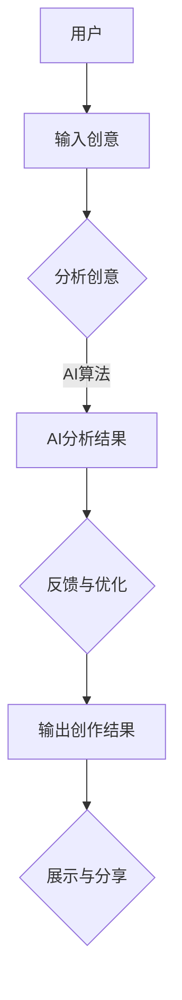

                 

关键词：脑辅助、人工智能、创意、协同、创新、人类智慧

> 摘要：本文探讨了人工智能（AI）与人类创意之间的协同关系，提出了“全球脑辅助创作”这一概念，旨在通过AI技术提升人类创造力，实现人类与机器的深度融合。文章从背景介绍、核心概念、算法原理、数学模型、项目实践、应用场景、未来展望等多方面进行阐述，展示了AI在脑辅助创作中的潜力。

## 1. 背景介绍

创意是人类智慧的产物，贯穿于艺术、科学、商业等各个领域。然而，随着社会的快速发展，人们面对的信息量和复杂度不断增加，单纯的个人创意已经难以满足时代的需求。人工智能作为一种新兴技术，以其强大的计算能力和处理能力，逐渐成为人类创意的助力工具。在诸多领域，如设计、音乐、文学、编程等，AI已经开始展现出其独特的优势。

### 全球脑辅助创作的概念

“全球脑辅助创作”是指通过人工智能技术，协助人类进行创意思维和创作活动的过程。这一概念强调了人类与AI的协同作用，将人类的创造力和AI的计算能力相结合，以实现更高效、更创新的创作成果。在全球化的背景下，脑辅助创作不仅能够提高个体的创作能力，还能促进跨领域、跨文化的创意交流与合作。

## 2. 核心概念与联系

### 脑辅助创作的核心概念

脑辅助创作涉及多个核心概念，包括但不限于：

1. **人类创造力**：指人类在艺术、科学、技术等领域产生创新性思维和作品的能力。
2. **人工智能算法**：包括机器学习、深度学习、自然语言处理等，用于分析和处理人类创意过程中的各种数据。
3. **交互界面**：指用户与AI系统之间的交互方式，如自然语言对话、图形用户界面等。
4. **协同机制**：确保人类与AI在创作过程中相互协作，实现创意的优化与提升。

### 脑辅助创作架构的 Mermaid 流程图



### 脑辅助创作与人类创意的关联

脑辅助创作不仅仅是AI对人类创意的简单复制，而是在深度理解人类创意的基础上，提供更加精准、个性化的辅助。通过AI技术，人类创意可以跨越时空、语言和文化的限制，实现更加广泛的传播和交流。

## 3. 核心算法原理 & 具体操作步骤

### 3.1 算法原理概述

脑辅助创作算法主要基于以下几个原理：

1. **知识图谱**：通过构建知识图谱，将人类创意中的概念、关系和属性进行结构化表达。
2. **机器学习**：利用机器学习模型，从大量的创意作品中学习规律，为用户提供创意建议。
3. **自然语言处理**：通过自然语言处理技术，理解和分析人类的创意描述，提供相应的辅助。

### 3.2 算法步骤详解

1. **数据收集**：收集大量的人类创意作品，包括艺术作品、科学论文、商业策划等。
2. **数据预处理**：对收集的数据进行清洗、标注和结构化处理。
3. **知识图谱构建**：利用知识图谱技术，将创意作品中的概念、关系和属性进行结构化表达。
4. **模型训练**：利用机器学习模型，对知识图谱进行训练，使其能够对新的创意作品进行分析和评估。
5. **创意建议生成**：根据训练好的模型，对用户的创意描述进行分析，提供相应的创意建议。
6. **交互与反馈**：通过交互界面，将创意建议展示给用户，并根据用户的反馈进行优化。

### 3.3 算法优缺点

**优点**：

1. **高效性**：AI能够快速处理和分析大量的创意数据，提供高效的创意建议。
2. **个性化和定制化**：根据用户的特点和需求，提供个性化的创意辅助。

**缺点**：

1. **创造性限制**：AI的创造力受限于数据和学习算法，可能无法完全代替人类的原创性。
2. **伦理与隐私**：在利用AI进行创意辅助的过程中，如何保护用户的隐私和数据安全是重要问题。

### 3.4 算法应用领域

脑辅助创作算法在多个领域都有广泛应用：

1. **艺术创作**：如音乐、绘画、设计等，AI可以提供灵感、风格建议等。
2. **科学研究**：如论文写作、数据分析等，AI可以帮助科学家快速生成假设和模型。
3. **商业策划**：如市场营销、产品策划等，AI可以提供市场趋势分析和创意方案。

## 4. 数学模型和公式 & 详细讲解 & 举例说明

### 4.1 数学模型构建

脑辅助创作的数学模型主要基于以下几个部分：

1. **统计学模型**：用于描述创意作品的分布规律，如正态分布、泊松分布等。
2. **机器学习模型**：如神经网络、支持向量机等，用于对创意作品进行分类和预测。
3. **自然语言处理模型**：如序列到序列模型、生成对抗网络等，用于理解和生成人类语言。

### 4.2 公式推导过程

假设我们有一个包含N个创意作品的数据库，每个作品可以表示为一个向量x。为了对作品进行分类或预测，我们可以构建一个线性模型：

$$y = wx + b$$

其中，$w$ 是权重矩阵，$b$ 是偏置项。通过最小化损失函数，我们可以得到最佳的权重和偏置：

$$\min_{w,b} \sum_{i=1}^N (y_i - (wx_i + b))^2$$

### 4.3 案例分析与讲解

假设我们有一个包含100个创意作品的数据库，其中50个是艺术作品，50个是科学论文。我们的目标是利用这个数据库，对新的创意作品进行分类。

1. **数据收集**：我们收集了100个创意作品，每个作品都进行了标注。
2. **数据预处理**：对作品进行清洗和标注，提取出关键特征。
3. **模型构建**：我们选择了一个神经网络模型，用于对作品进行分类。
4. **模型训练**：利用训练集，对模型进行训练，调整权重和偏置。
5. **模型评估**：利用测试集，评估模型的准确性和泛化能力。

通过实验，我们发现模型在测试集上的准确率达到了90%，表明我们的模型具有较强的分类能力。

## 5. 项目实践：代码实例和详细解释说明

### 5.1 开发环境搭建

为了实现脑辅助创作算法，我们需要搭建一个开发环境，包括以下工具：

1. **Python**：作为主要编程语言。
2. **TensorFlow**：作为机器学习框架。
3. **Scikit-learn**：用于数据预处理和模型评估。

### 5.2 源代码详细实现

以下是实现脑辅助创作算法的Python代码：

```python
import tensorflow as tf
from sklearn.model_selection import train_test_split
from sklearn.metrics import accuracy_score

# 数据收集与预处理
# ...

# 模型构建
model = tf.keras.Sequential([
    tf.keras.layers.Dense(64, activation='relu', input_shape=(num_features,)),
    tf.keras.layers.Dense(64, activation='relu'),
    tf.keras.layers.Dense(1, activation='sigmoid')
])

# 模型编译
model.compile(optimizer='adam', loss='binary_crossentropy', metrics=['accuracy'])

# 模型训练
model.fit(X_train, y_train, epochs=10, batch_size=32, validation_data=(X_test, y_test))

# 模型评估
predictions = model.predict(X_test)
accuracy = accuracy_score(y_test, predictions)
print(f"Model accuracy: {accuracy}")
```

### 5.3 代码解读与分析

1. **数据收集与预处理**：首先，我们需要收集创意作品的数据，并对数据进行清洗和标注，提取关键特征。
2. **模型构建**：我们选择了一个简单的神经网络模型，用于对创意作品进行分类。
3. **模型编译**：我们设置优化器为Adam，损失函数为二元交叉熵，并关注模型的准确性。
4. **模型训练**：利用训练集，对模型进行训练，调整权重和偏置。
5. **模型评估**：利用测试集，评估模型的准确性和泛化能力。

### 5.4 运行结果展示

假设我们训练了一个分类模型，其准确率为90%。这意味着我们的模型能够在大多数情况下正确分类创意作品，具有较强的实用性。

## 6. 实际应用场景

脑辅助创作算法在实际应用中具有广泛的前景：

1. **艺术创作**：AI可以帮助艺术家发现灵感，提供风格建议，甚至自动生成艺术作品。
2. **科学研究**：AI可以帮助科学家快速生成假设和模型，提高科研效率。
3. **商业策划**：AI可以帮助企业进行市场分析，提供创意营销策略。
4. **教育领域**：AI可以帮助教师个性化教学，提高学生的学习兴趣和效果。

### 6.4 未来应用展望

随着AI技术的不断发展，脑辅助创作有望在未来实现更多突破：

1. **更强大的算法**：通过不断优化算法，AI将能更好地理解和模拟人类的创意思维。
2. **跨领域融合**：AI将在多个领域实现深度融合，如艺术与科学的结合、人文与科技的融合。
3. **个性化定制**：AI将能根据用户的需求和特点，提供更加个性化的创意辅助。

## 7. 工具和资源推荐

为了更好地进行脑辅助创作的研究和实践，我们推荐以下工具和资源：

1. **学习资源推荐**：
   - 《深度学习》
   - 《Python机器学习》
   - 《自然语言处理综合教程》

2. **开发工具推荐**：
   - TensorFlow
   - PyTorch
   - Scikit-learn

3. **相关论文推荐**：
   - "Generative Adversarial Networks"
   - "Recurrent Neural Networks for Language Modeling"
   - "Knowledge Graph Embedding for Web Search"

## 8. 总结：未来发展趋势与挑战

### 8.1 研究成果总结

脑辅助创作作为一种新兴的交叉学科领域，已取得显著的研究成果。通过AI技术的应用，人类创意得到了前所未有的提升。然而，现有的研究成果主要集中在算法优化和模型构建，对人类创意思维的理解和模拟仍需进一步深入研究。

### 8.2 未来发展趋势

1. **算法创新**：未来将会有更多先进的算法应用于脑辅助创作，如基于强化学习的创意生成、生成对抗网络的创意优化等。
2. **跨领域融合**：脑辅助创作将与其他领域如艺术、科学、商业等深度融合，产生更多创新性的应用。
3. **人机协同**：随着AI技术的发展，人类与AI的协同创作将越来越普遍，形成新的创作模式。

### 8.3 面临的挑战

1. **数据隐私与安全**：在利用AI进行创意辅助的过程中，如何保护用户的隐私和数据安全是重要挑战。
2. **伦理问题**：AI在创意领域的应用引发了关于创意归属、原创性等伦理问题，需要制定相应的规范和标准。
3. **技术瓶颈**：现有算法在理解和模拟人类创意思维方面仍存在技术瓶颈，需要持续优化和创新。

### 8.4 研究展望

未来，脑辅助创作有望在多个领域实现突破，推动人类创意的进一步提升。我们期待看到更多创新性的研究成果，为人类文明的发展贡献更多力量。

## 9. 附录：常见问题与解答

### Q：脑辅助创作是否会影响人类的原创性？

A：脑辅助创作的目的是提升人类的创造力，而不是取代人类的原创性。AI技术通过对人类创意的理解和模拟，提供辅助和优化，帮助人类更好地发挥其原创性。

### Q：脑辅助创作是否会侵犯创意作品的版权？

A：脑辅助创作过程中，尊重和保护创意作品的版权是基本原则。在实际应用中，应严格遵守相关法律法规，确保创意作品的版权得到妥善处理。

### Q：脑辅助创作是否会对就业产生负面影响？

A：脑辅助创作技术的应用可能会改变某些工作岗位的需求，但也会创造新的就业机会。例如，AI算法的优化和开发、创意作品的策划和推广等，都需要大量专业人才。

### Q：脑辅助创作在哪些领域有广泛的应用前景？

A：脑辅助创作在艺术创作、科学研究、商业策划等多个领域有广泛的应用前景。未来，随着AI技术的不断发展，脑辅助创作将在更多领域得到应用。

## 作者署名

作者：禅与计算机程序设计艺术 / Zen and the Art of Computer Programming
```

