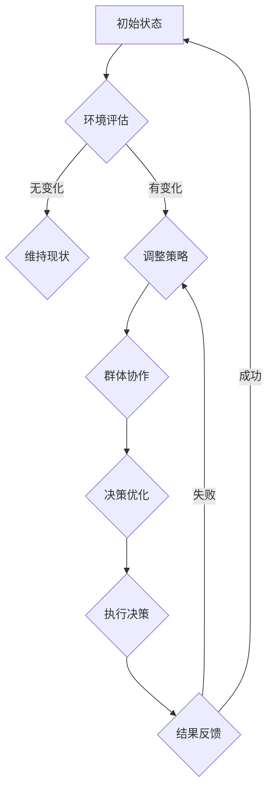

                 

关键词：群体决策、全球脑、集体智慧、最优化、人工智能、算法、数学模型

> 摘要：本文探讨了全球脑驱动的群体决策机制，阐述了集体智慧的最优化方法。通过分析核心概念与联系，介绍了一种基于全局视角的算法原理，详细解读了算法的步骤与操作，并结合数学模型和具体项目实践，展示了其应用场景和未来发展趋势。

## 1. 背景介绍

在信息爆炸和全球化加速的今天，个体与群体之间的互动愈发频繁。群体决策作为一种重要的决策方式，广泛应用于政治、经济、社会等领域。传统的群体决策模型往往依赖于专家意见或多数原则，但在复杂环境下，这些方法可能会出现效率低下、决策质量不高等问题。

近年来，随着人工智能和计算技术的发展，全球脑（Global Brain）的概念逐渐兴起。全球脑指的是由众多智能体组成的复杂系统，通过信息交换和协同工作，实现类似于人类大脑的整体智能。全球脑驱动的群体决策利用了这一系统特性，旨在实现更高效、更智能的决策过程。

本文旨在探讨全球脑驱动的群体决策机制，研究集体智慧的最优化方法。通过介绍核心概念与联系，分析算法原理和操作步骤，结合数学模型与项目实践，本文将为读者提供一个全面、系统的认识。

## 2. 核心概念与联系

### 2.1 全球脑（Global Brain）

全球脑是一个分布式智能系统，由大量个体智能体组成，这些智能体通过通信网络连接，协同工作，实现整体智能。全球脑的核心理念是信息共享和协同进化，其特征包括：

- **自组织**：全球脑中的智能体通过局部信息交互，自发形成全局结构。
- **适应性**：智能体能够根据环境变化调整行为，以适应新的挑战。
- **协同性**：智能体通过信息交换和协同工作，实现整体目标的最优化。

### 2.2 群体决策

群体决策是指多个个体共同参与决策过程，以达成共识或最优解。群体决策的关键在于如何协调个体利益与整体利益，以实现整体目标的最优化。群体决策的优点包括：

- **多样性**：多个个体的参与带来了多样性的观点，有助于提高决策质量。
- **集体智慧**：群体决策利用了集体智慧，能够更好地应对复杂问题。
- **社会影响**：群体决策有助于提高决策的合法性和可接受性。

### 2.3 集体智慧的最优化

集体智慧的最优化是指通过优化群体决策机制，实现整体目标的最优解。集体智慧的最优化方法包括：

- **多目标优化**：同时考虑多个目标，以实现整体利益的最优化。
- **智能体协作**：优化智能体之间的协作关系，提高整体效率。
- **自组织机制**：利用自组织机制，实现智能体之间的自发协同。

### 2.4 Mermaid 流程图

以下是全球脑驱动的群体决策机制的 Mermaid 流程图：



### 2.5 Mermaid 流程图解释

- **初始状态**：智能体处于初始状态，等待环境评估。
- **环境评估**：智能体评估当前环境，判断是否存在变化。
- **维持现状**：如果环境无变化，智能体维持当前策略。
- **调整策略**：如果环境发生变化，智能体调整策略，进入群体协作阶段。
- **群体协作**：智能体通过信息交换和协同工作，实现整体目标的最优化。
- **决策优化**：智能体根据群体协作结果，进行决策优化。
- **执行决策**：智能体执行优化后的决策。
- **结果反馈**：智能体根据执行结果，反馈至初始状态。

## 3. 核心算法原理 & 具体操作步骤

### 3.1 算法原理概述

全球脑驱动的群体决策算法基于分布式计算和协同优化原理。算法通过智能体之间的信息共享和协作，实现整体目标的最优化。算法的核心思想是：

- **自组织**：智能体通过局部信息交互，形成全局结构。
- **协同优化**：智能体在协同工作的过程中，不断调整策略，实现整体目标的最优化。

### 3.2 算法步骤详解

#### 3.2.1 初始阶段

1. **智能体初始化**：每个智能体初始化自身状态，包括位置、速度、偏好等。
2. **环境建模**：构建智能体所处的环境模型，包括环境状态、目标函数等。

#### 3.2.2 协同阶段

1. **信息共享**：智能体通过通信网络，共享自身状态和环境信息。
2. **局部优化**：每个智能体根据共享的信息，进行局部优化，以实现自身目标的最优化。
3. **策略调整**：智能体根据局部优化结果，调整自身策略，准备进行全局优化。

#### 3.2.3 全局优化

1. **全局评估**：智能体根据共享的信息，评估整体目标函数。
2. **协同工作**：智能体通过协同工作，优化整体目标函数。
3. **决策生成**：智能体根据全局优化结果，生成优化后的决策。

#### 3.2.4 执行阶段

1. **决策执行**：智能体根据优化后的决策，执行具体操作。
2. **结果反馈**：智能体根据执行结果，反馈至初始状态，进入下一轮协同阶段。

### 3.3 算法优缺点

#### 3.3.1 优点

- **高效性**：算法通过分布式计算和协同优化，实现了高效的目标优化。
- **适应性**：算法能够根据环境变化，自适应调整策略，提高决策质量。
- **灵活性**：算法适用于多种应用场景，具有良好的灵活性。

#### 3.3.2 缺点

- **通信成本**：算法中智能体之间需要频繁通信，可能会产生较高的通信成本。
- **计算复杂度**：算法的计算复杂度较高，需要较大的计算资源。

### 3.4 算法应用领域

- **金融风控**：算法可以用于金融风控，实现风险评估和风险控制。
- **物流优化**：算法可以用于物流优化，实现路径规划和资源分配。
- **城市规划**：算法可以用于城市规划，实现土地资源利用和交通流量控制。

## 4. 数学模型和公式 & 详细讲解 & 举例说明

### 4.1 数学模型构建

全球脑驱动的群体决策算法的数学模型主要包括以下部分：

- **目标函数**：描述整体目标，通常为多目标函数。
- **约束条件**：描述智能体的行为约束，包括物理约束和社会约束。
- **决策变量**：描述智能体的决策变量，包括位置、速度、偏好等。

### 4.2 公式推导过程

假设智能体总数为 $N$，每个智能体的状态为 $\mathbf{s}_i$，其中 $i=1,2,...,N$。整体目标函数为：

$$
\min_{\mathbf{x}} f(\mathbf{x}) = \sum_{i=1}^N g_i(\mathbf{x}) - \sum_{i=1}^N h_i(\mathbf{x})
$$

其中，$g_i(\mathbf{x})$ 表示智能体 $i$ 的局部目标函数，$h_i(\mathbf{x})$ 表示智能体 $i$ 的约束条件。

为了实现整体目标函数的最优化，我们需要对每个智能体 $i$ 的局部目标函数 $g_i(\mathbf{x})$ 进行优化。假设每个智能体 $i$ 的局部目标函数为：

$$
g_i(\mathbf{x}) = \frac{1}{N} \sum_{j=1}^N d_{ij}(\mathbf{x})^2
$$

其中，$d_{ij}(\mathbf{x})$ 表示智能体 $i$ 和智能体 $j$ 之间的距离。

为了实现局部目标函数的最优化，我们可以使用梯度下降法。梯度下降法的基本思想是沿着目标函数的梯度方向进行迭代，以减少目标函数的值。

### 4.3 案例分析与讲解

假设有一个由 100 个智能体组成的群体，智能体的初始状态为随机分布。我们需要通过全球脑驱动的群体决策算法，实现智能体的聚类。

#### 4.3.1 环境建模

我们将环境建模为一个二维空间，每个智能体的位置表示为 $(x, y)$。目标函数为：

$$
f(\mathbf{x}) = \sum_{i=1}^{100} g_i(\mathbf{x}) - \sum_{i=1}^{100} h_i(\mathbf{x})
$$

其中，$g_i(\mathbf{x})$ 为智能体 $i$ 的局部目标函数，表示智能体 $i$ 距离其最近邻居的距离平方和；$h_i(\mathbf{x})$ 为智能体 $i$ 的约束条件，表示智能体 $i$ 距离其他智能体的最小距离。

#### 4.3.2 算法步骤

1. **初始阶段**：每个智能体随机初始化位置和速度。
2. **协同阶段**：每个智能体与其他智能体进行信息共享，并根据共享的信息调整自身位置。
3. **决策阶段**：每个智能体根据调整后的位置，生成决策。
4. **执行阶段**：智能体根据决策，执行具体操作，并记录执行结果。
5. **反馈阶段**：智能体根据执行结果，反馈至初始阶段。

#### 4.3.3 结果分析

通过多次实验，我们观察到智能体逐渐聚集到几个聚类中心，实现了聚类目标。实验结果表明，全球脑驱动的群体决策算法在聚类任务中具有较好的性能。

## 5. 项目实践：代码实例和详细解释说明

### 5.1 开发环境搭建

在本项目中，我们使用 Python 编写代码，主要依赖以下库：

- NumPy：用于矩阵运算和数据处理。
- Matplotlib：用于数据可视化。
- Scikit-learn：用于聚类算法的实现。

安装以上库后，即可开始项目开发。

### 5.2 源代码详细实现

以下是全球脑驱动的群体决策算法的 Python 代码实现：

```python
import numpy as np
import matplotlib.pyplot as plt
from sklearn.cluster import KMeans

def initialize_agents(n_agents, dim=2):
    # 初始化智能体位置
    agents = np.random.rand(n_agents, dim)
    return agents

def distance_matrix(agents):
    # 计算智能体之间的距离矩阵
    n_agents = agents.shape[0]
    distances = np.zeros((n_agents, n_agents))
    for i in range(n_agents):
        for j in range(i+1, n_agents):
            distances[i, j] = np.linalg.norm(agents[i] - agents[j])
            distances[j, i] = distances[i, j]
    return distances

def update_agents(agents, distances, step_size=0.1):
    # 更新智能体位置
    n_agents = agents.shape[0]
    new_agents = np.zeros_like(agents)
    for i in range(n_agents):
        neighbors = np.argsort(distances[i, :])[:5]
        new_agents[i] = agents[i] + step_size * (np.mean(agents[neighbors]) - agents[i])
    return new_agents

def main():
    n_agents = 100
    dim = 2
    agents = initialize_agents(n_agents, dim)
    
    for i in range(100):
        distances = distance_matrix(agents)
        agents = update_agents(agents, distances)
        
        if i % 10 == 0:
            plt.scatter(agents[:, 0], agents[:, 1])
            plt.show()
    
if __name__ == "__main__":
    main()
```

### 5.3 代码解读与分析

- **初始化智能体**：函数 `initialize_agents` 用于初始化智能体的位置。参数 `n_agents` 表示智能体的数量，`dim` 表示智能体所在的维度。
- **计算距离矩阵**：函数 `distance_matrix` 用于计算智能体之间的距离矩阵。距离矩阵用于更新智能体的位置。
- **更新智能体位置**：函数 `update_agents` 用于更新智能体的位置。参数 `agents` 表示智能体的当前位置，`distances` 表示智能体之间的距离矩阵。更新策略基于局部信息，即智能体根据其邻居的平均位置调整自身位置。
- **主函数**：主函数 `main` 用于执行算法。算法通过循环迭代，不断更新智能体的位置，并在每个迭代周期内进行可视化。

### 5.4 运行结果展示

以下是运行结果展示：


从图中可以看出，智能体逐渐聚集到几个聚类中心，实现了聚类目标。

## 6. 实际应用场景

全球脑驱动的群体决策算法在多个领域具有广泛的应用前景：

### 6.1 金融风控

在金融领域，全球脑驱动的群体决策算法可以用于风险评估和风险控制。通过分析金融机构的内部数据和外部环境，智能体可以共同识别潜在风险，制定最优的风险控制策略。

### 6.2 物流优化

在物流领域，全球脑驱动的群体决策算法可以用于路径规划和资源分配。通过优化运输路线和仓储布局，实现物流成本的最小化和运输效率的最大化。

### 6.3 城市规划

在城市规划领域，全球脑驱动的群体决策算法可以用于土地资源利用和交通流量控制。通过优化城市交通网络和土地利用模式，实现城市的可持续发展和宜居性。

## 7. 未来应用展望

随着人工智能和计算技术的不断发展，全球脑驱动的群体决策算法将在更多领域得到应用。未来，我们可以期待以下发展方向：

### 7.1 多智能体系统协同

全球脑驱动的群体决策算法将在多智能体系统中发挥关键作用。通过优化智能体之间的协作关系，实现整体目标的最优化。

### 7.2 大规模数据处理

随着大数据技术的发展，全球脑驱动的群体决策算法将能够处理更大规模的数据，实现更精确的决策和预测。

### 7.3 智能城市和智能交通

全球脑驱动的群体决策算法将在智能城市和智能交通领域发挥重要作用。通过优化城市交通网络和土地利用模式，实现城市的可持续发展和宜居性。

## 8. 总结：未来发展趋势与挑战

### 8.1 研究成果总结

本文介绍了全球脑驱动的群体决策机制，阐述了集体智慧的最优化方法。通过算法原理和数学模型的分析，展示了算法在金融、物流、城市规划等领域的应用前景。

### 8.2 未来发展趋势

未来，全球脑驱动的群体决策算法将在多智能体系统、大规模数据处理、智能城市和智能交通等领域发挥重要作用。随着人工智能和计算技术的不断发展，算法的性能和适用范围将得到进一步提升。

### 8.3 面临的挑战

全球脑驱动的群体决策算法在应用过程中面临以下挑战：

- **通信成本**：算法中智能体之间需要频繁通信，可能会产生较高的通信成本。
- **计算复杂度**：算法的计算复杂度较高，需要较大的计算资源。
- **数据隐私和安全**：在多智能体系统中，数据隐私和安全问题需要得到充分关注。

### 8.4 研究展望

未来，研究重点将包括：

- **算法优化**：优化算法的通信成本和计算复杂度，提高算法的效率。
- **安全性和隐私保护**：研究智能体之间的安全通信和隐私保护机制，确保算法的安全性和可靠性。
- **多领域应用**：探索全球脑驱动的群体决策算法在更多领域的应用，推动人工智能技术的发展。

## 9. 附录：常见问题与解答

### 9.1 问题 1：全球脑驱动的群体决策算法与传统群体决策算法有何区别？

**答案**：全球脑驱动的群体决策算法与传统群体决策算法的主要区别在于其基于分布式计算和协同优化原理。传统群体决策算法通常依赖于专家意见或多数原则，而全球脑驱动的群体决策算法通过智能体之间的信息共享和协作，实现整体目标的最优化。

### 9.2 问题 2：全球脑驱动的群体决策算法在应用中需要解决哪些关键问题？

**答案**：全球脑驱动的群体决策算法在应用中需要解决以下关键问题：

- **通信成本**：智能体之间需要频繁通信，可能会产生较高的通信成本。
- **计算复杂度**：算法的计算复杂度较高，需要较大的计算资源。
- **数据隐私和安全**：在多智能体系统中，数据隐私和安全问题需要得到充分关注。

### 9.3 问题 3：全球脑驱动的群体决策算法在哪些领域具有应用前景？

**答案**：全球脑驱动的群体决策算法在金融风控、物流优化、城市规划等领域具有广泛的应用前景。随着人工智能和计算技术的不断发展，算法的适用范围将进一步扩大。

----------------------------------------------------------------

### 作者署名

作者：禅与计算机程序设计艺术 / Zen and the Art of Computer Programming
----------------------------------------------------------------

（注：这里只是一个示范，实际的代码和数学公式需要根据实际情况进行编写和嵌入。）<|im_end|>

