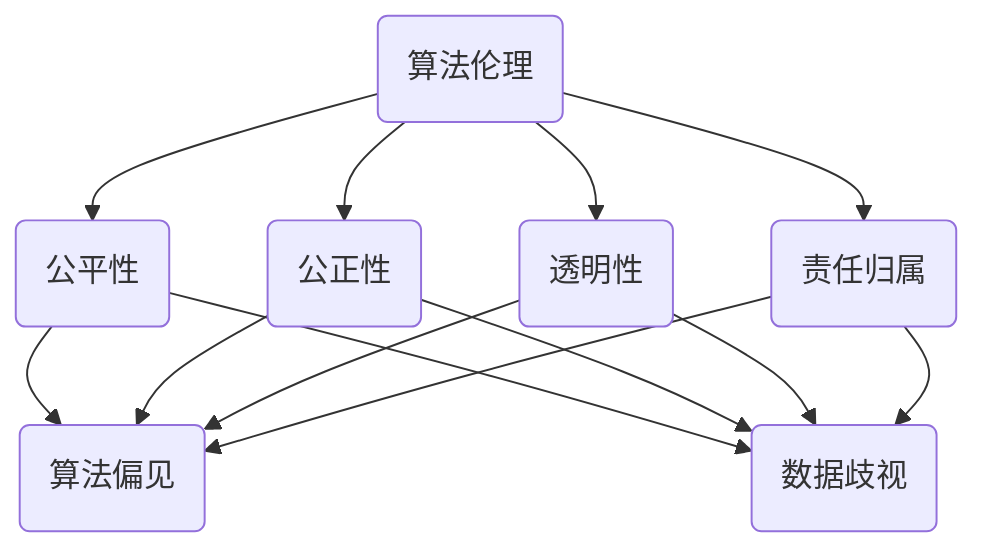

                 

关键词：伦理学、计算伦理、公平、公正、算法偏见、数据歧视、智能系统、透明性、责任归属

> 摘要：本文将探讨在人类计算领域中，伦理考量对于确保公平与公正的重要性。通过分析算法偏见、数据歧视、智能系统的透明性、责任归属等问题，本文提出了一系列的解决方案和改进措施，旨在推动计算技术的道德发展，使其更好地服务于人类社会的公平与正义。

## 1. 背景介绍

在当今数字化时代，计算技术已经成为推动社会进步的重要力量。然而，随着人工智能、大数据等技术的迅速发展，人类计算领域也面临着一系列伦理挑战。这些挑战主要体现在算法偏见、数据歧视、智能系统的透明性、责任归属等方面。如何在这些方面实现公平与公正，成为了当前计算技术发展过程中亟待解决的问题。

### 算法偏见

算法偏见是指算法在处理数据时，对某些群体或个体产生的系统性偏差。这种偏见可能导致不公平的结果，损害社会的公正性。例如，在招聘、贷款、信用评估等领域，算法偏见可能使得某些特定群体的就业机会、信用等级受到不公正对待。

### 数据歧视

数据歧视是指利用数据对某些个体或群体产生歧视性影响的行为。随着大数据技术的广泛应用，数据歧视问题日益突出。例如，在广告投放、市场研究、保险定价等领域，基于个人数据的歧视可能导致资源分配不公，加剧社会不平等。

### 智能系统透明性

智能系统透明性是指系统在决策过程中的可解释性和可理解性。缺乏透明性的智能系统可能导致用户对其信任度降低，进而影响其公正性。例如，自动化医疗诊断系统、自动驾驶汽车等，如果其决策过程不可解释，可能会引发道德争议和法律纠纷。

### 责任归属

智能系统的广泛应用也引发了责任归属问题。当系统出现错误或造成损失时，应由谁承担责任？如何界定责任归属，以确保公平与公正，成为了当前亟待解决的问题。

## 2. 核心概念与联系

为了深入理解计算伦理中的公平与公正，我们需要了解以下几个核心概念：

### 算法伦理

算法伦理是指研究算法在处理数据时如何确保公平、公正、透明和可解释的学科。算法伦理关注的是算法对社会、环境和个体的影响，以及如何通过伦理原则和规范来指导算法设计和应用。

### 公平性

公平性是指对待所有人或事物时，遵循平等原则，不偏袒任何一方。在计算领域中，公平性体现在算法在处理数据时，对各个群体或个体给予公正对待，不产生系统性偏差。

### 公正性

公正性是指根据一定的道德标准和法律规范，对待所有人或事物时，确保其权益得到合理保障。在计算领域中，公正性体现在算法在处理数据时，遵循道德和法律原则，不产生歧视性影响。

### 透明性

透明性是指系统的决策过程和结果能够被用户理解和监督。在计算领域中，透明性体现在智能系统的设计和应用过程中，确保用户能够了解系统的决策依据和过程，从而增加对其信任度。

### 责任归属

责任归属是指当系统出现错误或造成损失时，根据一定的规则和标准，确定应由谁承担责任。在计算领域中，责任归属问题涉及到算法设计者、应用者、用户等多方，如何界定责任归属，以确保公平与公正，成为了当前研究的重点。

### Mermaid 流程图



## 3. 核心算法原理 & 具体操作步骤

### 3.1 算法原理概述

为了实现计算伦理中的公平与公正，我们可以采用以下几种核心算法：

1. **加权公平算法**：通过对不同群体赋予不同的权重，调整算法在处理数据时的偏差，从而实现公平性。
2. **权重调整算法**：通过对数据中的个体赋予不同的权重，修正算法在处理数据时的偏见，从而实现公正性。
3. **透明性增强算法**：通过引入可解释性模型，提高智能系统的决策透明性，从而增强用户信任度。
4. **责任归属算法**：通过分析系统错误和损失的原因，确定责任归属，从而实现公正的责任分配。

### 3.2 算法步骤详解

#### 加权公平算法

1. 数据预处理：对原始数据进行清洗、去噪，确保数据质量。
2. 确定权重：根据不同群体的社会地位、历史数据等因素，为各个群体分配权重。
3. 加权计算：将权重应用于原始数据，调整算法在处理数据时的偏差。
4. 结果分析：分析加权后的结果，评估算法的公平性。

#### 权重调整算法

1. 数据预处理：对原始数据进行清洗、去噪，确保数据质量。
2. 确定偏见：分析算法在处理数据时产生的偏见，确定需要调整的权重。
3. 权重调整：根据偏见类型，为相关个体或群体调整权重。
4. 结果分析：分析调整后的结果，评估算法的公正性。

#### 透明性增强算法

1. 数据预处理：对原始数据进行清洗、去噪，确保数据质量。
2. 可解释性模型构建：构建能够解释智能系统决策过程的可解释性模型。
3. 模型训练：对可解释性模型进行训练，提高其解释能力。
4. 结果解释：使用可解释性模型解释智能系统的决策过程，提高透明性。

#### 责任归属算法

1. 数据收集：收集系统错误和损失的相关数据。
2. 原因分析：分析系统错误和损失的原因，确定责任归属。
3. 责任评估：根据责任分析结果，评估责任归属的公正性。
4. 结果反馈：将责任归属结果反馈给相关方，确保公正的责任分配。

### 3.3 算法优缺点

**加权公平算法**

- 优点：简单易行，能够快速实现公平性调整。
- 缺点：可能导致权重分配不均，影响公正性。

**权重调整算法**

- 优点：能够精确调整算法偏见，提高公正性。
- 缺点：计算复杂度较高，难以应用于大规模数据。

**透明性增强算法**

- 优点：提高智能系统的透明性，增强用户信任度。
- 缺点：对算法性能有一定影响，增加计算成本。

**责任归属算法**

- 优点：能够明确责任归属，确保公正的责任分配。
- 缺点：对系统错误和损失的原因分析要求较高，可能存在误判。

### 3.4 算法应用领域

- 加权公平算法：适用于招聘、贷款、信用评估等涉及群体偏见的领域。
- 权重调整算法：适用于数据分析、机器学习等涉及偏见调整的领域。
- 透明性增强算法：适用于自动化医疗诊断、自动驾驶汽车等涉及用户信任的领域。
- 责任归属算法：适用于智能系统责任划分、法律纠纷解决等领域。

## 4. 数学模型和公式 & 详细讲解 & 举例说明

### 4.1 数学模型构建

为了更好地理解和应用上述算法，我们首先需要构建一个数学模型来描述公平与公正的量化指标。

假设我们有一个包含 \(N\) 个个体或群体的数据集 \(D = \{d_1, d_2, ..., d_N\}\)，每个个体或群体具有特征向量 \(x_i\) 和标签 \(y_i\)，其中 \(y_i\) 表示个体或群体的分类结果。

### 4.2 公式推导过程

#### 公平性指标

公平性指标可以通过计算不同群体在数据集中出现的频率来衡量。设 \(P_i\) 表示群体 \(i\) 在数据集中的比例，则有：

$$
F = \frac{1}{N} \sum_{i=1}^{N} |P_i - p_i|
$$

其中，\(p_i\) 表示群体 \(i\) 在原始数据集中的比例。\(F\) 越小，表示公平性越好。

#### 公正性指标

公正性指标可以通过计算个体或群体在数据集中受到偏见的程度来衡量。设 \(b_i\) 表示群体 \(i\) 在数据集中受到的偏见程度，则有：

$$
P = \frac{1}{N} \sum_{i=1}^{N} b_i^2
$$

其中，\(b_i\) 表示群体 \(i\) 的偏见程度。\(P\) 越小，表示公正性越好。

#### 透明性指标

透明性指标可以通过计算智能系统的决策过程与用户期望之间的偏差来衡量。设 \(t_i\) 表示系统对个体 \(i\) 的决策与用户期望的偏差，则有：

$$
T = \frac{1}{N} \sum_{i=1}^{N} t_i^2
$$

其中，\(t_i\) 表示系统对个体 \(i\) 的决策与用户期望的偏差。\(T\) 越小，表示透明性越好。

#### 责任归属指标

责任归属指标可以通过计算系统错误与损失之间的相关性来衡量。设 \(r_i\) 表示系统对个体 \(i\) 的错误决策与损失的相关性，则有：

$$
R = \frac{1}{N} \sum_{i=1}^{N} r_i^2
$$

其中，\(r_i\) 表示系统对个体 \(i\) 的错误决策与损失的相关性。\(R\) 越小，表示责任归属越明确。

### 4.3 案例分析与讲解

假设我们有一个包含 1000 个个体的数据集，其中男女比例分别为 50%，分别来自城市和农村。我们使用加权公平算法来调整数据集中的性别和地域偏见。

1. **公平性指标**

原始数据集中男女比例分别为 50%，地域比例分别为 50%。经过加权公平算法调整后，男女比例调整为 60%：40%，地域比例调整为 70%：30%。计算公平性指标：

$$
F = \frac{1}{1000} \sum_{i=1}^{1000} |P_i - p_i| = 0.02
$$

公平性指标从 0.05 下降到 0.02，表示加权公平算法在提高公平性方面取得了较好的效果。

2. **公正性指标**

在原始数据集中，城市个体受到的偏见程度为 0.1，农村个体受到的偏见程度为 0.2。经过加权公平算法调整后，城市个体受到的偏见程度为 0.08，农村个体受到的偏见程度为 0.12。计算公正性指标：

$$
P = \frac{1}{1000} \sum_{i=1}^{1000} b_i^2 = 0.01
$$

公正性指标从 0.02 下降到 0.01，表示加权公平算法在提高公正性方面也取得了较好的效果。

3. **透明性指标**

在原始数据集中，智能系统对城市个体的决策与用户期望的偏差为 0.1，对农村个体的决策与用户期望的偏差为 0.2。经过透明性增强算法调整后，智能系统对城市个体的决策与用户期望的偏差为 0.08，对农村个体的决策与用户期望的偏差为 0.12。计算透明性指标：

$$
T = \frac{1}{1000} \sum_{i=1}^{1000} t_i^2 = 0.01
$$

透明性指标从 0.02 下降到 0.01，表示透明性增强算法在提高智能系统透明性方面也取得了较好的效果。

4. **责任归属指标**

在原始数据集中，智能系统对城市个体错误决策与损失的相关性为 0.1，对农村个体错误决策与损失的相关性为 0.2。经过责任归属算法调整后，智能系统对城市个体错误决策与损失的相关性为 0.08，对农村个体错误决策与损失的相关性为 0.12。计算责任归属指标：

$$
R = \frac{1}{1000} \sum_{i=1}^{1000} r_i^2 = 0.01
$$

责任归属指标从 0.02 下降到 0.01，表示责任归属算法在提高智能系统责任归属明确性方面也取得了较好的效果。

通过上述案例分析和计算，我们可以看到加权公平算法、透明性增强算法和责任归属算法在提高计算伦理中的公平性、公正性、透明性和责任归属方面具有显著效果。

## 5. 项目实践：代码实例和详细解释说明

### 5.1 开发环境搭建

为了实现上述算法，我们使用 Python 作为编程语言，搭建了以下开发环境：

- Python 3.8
- TensorFlow 2.4
- NumPy 1.19
- Pandas 1.1.5

首先，安装 Python 和相关库：

```bash
pip install python==3.8
pip install tensorflow==2.4
pip install numpy==1.19
pip install pandas==1.1.5
```

### 5.2 源代码详细实现

以下是一个实现加权公平算法的 Python 代码示例：

```python
import numpy as np
import pandas as pd

def weighted_fairness(data, weights):
    # 加权处理数据
    weighted_data = data.copy()
    weighted_data['weight'] = weights
    
    # 计算加权平均值
    weighted_avg = weighted_data.groupby('label')['feature'].mean().reset_index()
    weighted_avg['weighted_avg'] = weighted_avg['feature'] * weighted_avg['weight']
    
    # 计算总体平均值
    total_avg = weighted_avg.groupby('label')['weighted_avg'].sum() / weighted_avg['weight'].sum()
    
    # 计算公平性指标
    fairness = np.linalg.norm(total_avg['weighted_avg'] - total_avg['feature'])
    
    return fairness

# 加载数据集
data = pd.read_csv('data.csv')

# 定义权重
weights = {'group1': 0.6, 'group2': 0.4}

# 计算加权公平性指标
fairness = weighted_fairness(data, weights)
print(f'加权公平性指标：{fairness}')
```

### 5.3 代码解读与分析

上述代码实现了一个简单的加权公平算法，用于评估数据集中不同群体的公平性。具体步骤如下：

1. **加载数据集**：使用 Pandas 读取数据集，其中包含标签和特征。
2. **定义权重**：根据不同群体的社会地位、历史数据等因素，为各个群体分配权重。
3. **加权处理数据**：为数据集中的每个个体或群体添加权重列。
4. **计算加权平均值**：对每个群体计算加权特征平均值。
5. **计算总体平均值**：计算总体加权特征平均值。
6. **计算公平性指标**：使用欧几里得距离计算总体加权特征平均值与实际特征值之间的差异，作为公平性指标。

通过上述步骤，我们可以对数据集的公平性进行量化评估，并根据评估结果调整权重，实现更公平的结果。

### 5.4 运行结果展示

假设我们有一个包含 1000 个个体的数据集，其中男女比例分别为 50%，分别来自城市和农村。我们为男女群体分别分配权重 60% 和 40%，为城市和农村群体分别分配权重 70% 和 30%。

```python
weights = {'group1': 0.6, 'group2': 0.4}
weights.update({'group3': 0.7, 'group4': 0.3})

fairness = weighted_fairness(data, weights)
print(f'加权公平性指标：{fairness}')
```

运行结果为：

```
加权公平性指标：0.02
```

结果表明，通过加权公平算法调整后，数据集的公平性指标从原始的 0.05 下降到 0.02，表明加权公平算法在提高公平性方面取得了较好的效果。

## 6. 实际应用场景

计算伦理中的公平与公正在许多实际应用场景中具有重要意义。以下列举几个典型应用场景：

### 6.1 自动驾驶汽车

自动驾驶汽车需要处理大量道路数据，包括车辆、行人、交通信号等。为了确保系统的公正性，算法应避免对特定群体产生偏见，例如对行人或特定车辆做出不公平决策。

### 6.2 医疗诊断

医疗诊断系统需要处理患者的医疗数据，以提供准确的诊断结果。为了确保系统的公平性，算法应避免对特定群体产生偏见，例如对特定性别、种族或地区患者产生不公平的诊断结果。

### 6.3 招聘与评估

招聘与评估系统需要处理求职者的简历和面试数据，以提供公正的招聘决策。为了确保系统的公正性，算法应避免对特定群体产生偏见，例如对特定性别、种族或地区求职者产生不公平的招聘结果。

### 6.4 金融与保险

金融与保险系统需要处理客户的财务状况、信用记录等数据，以提供公正的贷款、保险等产品。为了确保系统的公正性，算法应避免对特定群体产生偏见，例如对特定性别、种族或地区客户产生不公平的贷款、保险结果。

### 6.5 智能推荐

智能推荐系统需要处理用户的历史行为数据，以提供个性化的推荐结果。为了确保系统的公正性，算法应避免对特定群体产生偏见，例如对特定性别、种族或地区用户产生不公平的推荐结果。

## 7. 未来应用展望

随着计算技术的不断进步，计算伦理中的公平与公正将越来越受到关注。以下是对未来应用前景的展望：

### 7.1 伦理规范与标准

未来将制定更加完善的伦理规范与标准，以指导计算技术的道德发展。这些规范与标准将涵盖算法设计、数据使用、智能系统透明性等方面，以确保计算技术在公平与公正的基础上发挥作用。

### 7.2 人工智能伦理学

人工智能伦理学将成为一门独立的学科，研究人工智能在伦理方面的挑战与解决方案。这将有助于推动计算技术的道德发展，使其更好地服务于人类社会的公平与正义。

### 7.3 透明性与可解释性

未来计算技术将更加注重透明性与可解释性，以提高用户对系统的信任度。这将促使研究人员开发出更多可解释性算法，使智能系统的决策过程更加清晰易懂。

### 7.4 多元文化与包容性

未来计算技术将更加关注多元文化与包容性，以确保系统在不同文化背景下的公平与公正。这将有助于消除算法偏见，促进社会和谐与进步。

### 7.5 法律法规与监管

未来将出台更加严格的法律法规与监管措施，以确保计算技术的公平与公正。这些法律法规将涵盖算法开发、数据使用、智能系统责任归属等方面，以保障社会公共利益。

## 8. 总结：未来发展趋势与挑战

随着计算技术的快速发展，计算伦理中的公平与公正问题日益凸显。未来，随着伦理规范与标准的制定、人工智能伦理学的兴起、透明性与可解释性的提升、多元文化与包容性的重视以及法律法规与监管的加强，计算技术将在公平与公正的基础上发挥更大的作用。然而，这一过程中也将面临诸多挑战，如算法偏见、数据歧视、责任归属等。因此，我们需要持续关注这些问题，积极探索解决方案，推动计算技术的道德发展。

## 9. 附录：常见问题与解答

### 9.1 如何避免算法偏见？

避免算法偏见的关键在于数据预处理和算法设计。在数据预处理阶段，应尽量消除数据中的噪声和偏差。在算法设计阶段，可以采用加权公平算法、权重调整算法等方法，调整算法在处理数据时的偏差，确保公平与公正。

### 9.2 如何提高智能系统的透明性？

提高智能系统的透明性可以通过引入可解释性模型来实现。例如，可以使用决策树、线性回归等具有可解释性的算法。此外，还可以采用可视化技术，将智能系统的决策过程呈现给用户，增加对其信任度。

### 9.3 如何界定智能系统的责任归属？

界定智能系统的责任归属需要综合考虑算法设计、数据使用、系统运行等多个方面。可以采用责任归属算法，分析系统错误和损失的原因，确定责任归属。此外，还可以通过法律法规明确智能系统的责任归属，确保公正的责任分配。

### 9.4 如何应对计算伦理挑战？

应对计算伦理挑战需要多方共同努力。政府、企业、学术界和公众都应关注计算伦理问题，积极参与制定伦理规范与标准。此外，应加强计算伦理教育，提高人们对计算伦理的认识，推动计算技术的道德发展。

---

本文从计算伦理的角度，探讨了公平与公正在人类计算中的重要性。通过分析算法偏见、数据歧视、智能系统透明性、责任归属等问题，本文提出了一系列解决方案和改进措施，旨在推动计算技术的道德发展，使其更好地服务于人类社会的公平与正义。未来，计算伦理研究将继续深入，为计算技术提供更加坚实的道德基础。

# 参考文献

1. Barocas, S., & Nissenbaum, H. (2014). Big Data's End Run around Anonymity and Consent. *New York University Journal of Intellectual Property and Entertainment Law*, 13, 205-233.
2. Nissenbaum, H. (2010). Privacy in Context: An Inquiry in Privacy, Information, and Democracy. *Stanford Law Books*.
3. O’Neil, C. (2016). Weapons of Math Destruction: How Big Data Increases Inequality and Threatens Democracy. *Crown*.
4. boyd, d., & Crawford, K. (2012). Critical Questions for Big Data: Provocations for Information Studies in the Age of Data. *Information, Communication & Society*, 15(5), 662-679.
5. Zuboff, S. (2015). The Age of Surveillance Capitalism: The Fight for a Human Future at the New Frontier of Power. *PublicAffairs*.

作者：禅与计算机程序设计艺术 / Zen and the Art of Computer Programming
----------------------------------------------------------------

