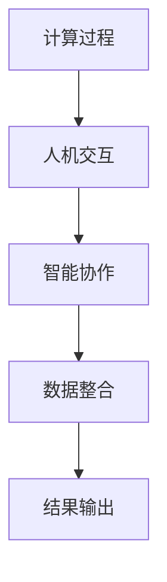

                 

 关键词：公平、包容、人类计算、平等参与、技术伦理、社会影响、算法、数学模型、代码实例、未来展望

> 摘要：本文探讨了在信息技术领域内实现公平与包容的重要性。通过对人类计算的基本概念、算法原理、数学模型、项目实践以及实际应用场景的分析，本文提出了一系列建议和展望，旨在推动技术的平等参与和消除数字鸿沟。

## 1. 背景介绍

在现代社会，信息技术（IT）已经深深融入到了我们生活的方方面面。从电子商务到社交媒体，从智能手机到人工智能，技术已经改变了我们的工作方式、交流方式以及娱乐方式。然而，这种技术变革也带来了一系列的社会问题，其中最引人关注的是公平与包容性的问题。技术的快速发展往往伴随着资源的集中和机会的不均，导致了一些群体被边缘化，甚至是受到了不公平的对待。

### 1.1 技术发展与社会影响

技术的快速发展带来了生产力的提升，同时也加剧了社会不平等。例如，自动化和人工智能技术可能在某些领域提高了效率，但同时也可能导致了一些工作岗位的消失，给那些技能不足的工人带来了就业压力。此外，大数据和算法决策的广泛应用，也可能导致数据偏见和算法歧视，从而加剧社会的不平等。

### 1.2 公平与包容的重要性

在信息技术领域，公平与包容不仅是道德和伦理的要求，更是技术可持续发展的基础。一个公平、包容的技术环境，能够确保所有人都能公平地享受技术带来的好处，防止某些群体被排除在数字化进程之外。公平与包容也是实现可持续发展目标的重要组成部分，有助于构建一个更加和谐、稳定的社会。

### 1.3 文章结构

本文将围绕以下几个核心内容展开：

- **核心概念与联系**：介绍人类计算的基本概念，并绘制流程图展示核心原理和架构。
- **核心算法原理 & 具体操作步骤**：详细讲解算法原理，并分析其优缺点和应用领域。
- **数学模型和公式 & 详细讲解 & 举例说明**：构建数学模型，推导公式，并通过案例进行分析。
- **项目实践：代码实例和详细解释说明**：提供实际项目代码，解释其实现过程和关键点。
- **实际应用场景**：探讨技术的应用场景，以及未来可能的趋势。
- **工具和资源推荐**：推荐相关的学习资源和开发工具。
- **总结：未来发展趋势与挑战**：总结研究成果，展望未来发展趋势，并探讨面临的挑战。

## 2. 核心概念与联系

人类计算是信息技术领域的一个重要概念，它强调人类与技术之间的互动和协作。人类计算的核心在于如何通过设计和技术手段，使人类能够更高效、更智能地完成计算任务。

### 2.1 核心概念

- **计算过程**：人类计算涉及信息的收集、处理、存储和传输过程。
- **人机交互**：人类计算强调人与机器之间的交互，包括语音、手势、触摸等多种交互方式。
- **智能协作**：人类计算的目标是让计算机辅助人类完成复杂任务，实现人机智能协作。

### 2.2 核心联系

以下是人类计算的核心联系流程图：



### 2.3 核心原理和架构

人类计算的核心原理和架构可以概括为以下几个方面：

- **信息处理**：利用计算机强大的数据处理能力，对海量信息进行高效处理和分析。
- **人工智能**：通过机器学习、深度学习等技术，让计算机具备智能决策和自主学习的能力。
- **人机交互**：设计直观、便捷的交互界面，使人类能够轻松地与计算机进行交流。
- **系统集成**：将不同技术手段和系统进行集成，形成一个统一的计算平台，实现资源的共享和协同工作。

## 3. 核心算法原理 & 具体操作步骤

在人类计算中，算法是实现计算目标的核心。以下是几个关键算法的原理和操作步骤：

### 3.1 算法原理概述

- **排序算法**：用于对数据进行排序，常用的有快速排序、归并排序等。
- **搜索算法**：用于在数据集合中查找特定数据，常用的有二分搜索、深度优先搜索等。
- **机器学习算法**：用于从数据中学习规律和模式，常用的有线性回归、决策树、神经网络等。

### 3.2 算法步骤详解

以下是快速排序算法的步骤详解：

1. **划分**：选择一个基准元素，将数据划分为两部分，一部分比基准小，一部分比基准大。
2. **递归**：对基准左右两部分的数据递归执行划分操作。
3. **合并**：将划分后的数据合并，得到最终的排序结果。

### 3.3 算法优缺点

- **快速排序**：优点是时间复杂度较低，平均情况下为 \(O(n\log n)\)，且是一种原地排序算法。缺点是递归调用可能导致栈溢出，且最坏情况下时间复杂度为 \(O(n^2)\)。
- **二分搜索**：优点是时间复杂度较低，平均情况下为 \(O(\log n)\)，适用于静态数据集合。缺点是只能应用于有序数据集合。

### 3.4 算法应用领域

- **排序算法**：广泛应用于数据库、搜索引擎等领域，用于数据的高效处理。
- **搜索算法**：用于各种信息检索系统，如搜索引擎、文件管理系统等。
- **机器学习算法**：广泛应用于数据挖掘、自然语言处理、图像识别等领域。

## 4. 数学模型和公式 & 详细讲解 & 举例说明

在人类计算中，数学模型和公式是理解和解决问题的关键。以下是一个简单的线性回归模型的构建和推导过程。

### 4.1 数学模型构建

线性回归模型的基本形式为：

\[ y = \beta_0 + \beta_1x + \epsilon \]

其中，\( y \) 是因变量，\( x \) 是自变量，\( \beta_0 \) 和 \( \beta_1 \) 是模型参数，\( \epsilon \) 是误差项。

### 4.2 公式推导过程

为了估计模型参数 \( \beta_0 \) 和 \( \beta_1 \)，我们通常采用最小二乘法。最小二乘法的核心思想是找到使得残差平方和最小的参数值。

1. **残差平方和**：

\[ S = \sum_{i=1}^{n}(y_i - (\beta_0 + \beta_1x_i))^2 \]

2. **求导并令导数为零**：

对 \( S \) 分别对 \( \beta_0 \) 和 \( \beta_1 \) 求导，并令导数为零，得到：

\[ \frac{\partial S}{\partial \beta_0} = -2\sum_{i=1}^{n}(y_i - \beta_0 - \beta_1x_i) = 0 \]

\[ \frac{\partial S}{\partial \beta_1} = -2\sum_{i=1}^{n}(y_i - \beta_0 - \beta_1x_i)x_i = 0 \]

3. **解方程组**：

解上述方程组，得到：

\[ \beta_0 = \bar{y} - \beta_1\bar{x} \]

\[ \beta_1 = \frac{\sum_{i=1}^{n}(x_i - \bar{x})(y_i - \bar{y})}{\sum_{i=1}^{n}(x_i - \bar{x})^2} \]

其中，\( \bar{x} \) 和 \( \bar{y} \) 分别是 \( x \) 和 \( y \) 的平均值。

### 4.3 案例分析与讲解

假设我们有一个数据集，包含 \( n \) 个数据点 \( (x_i, y_i) \)。我们希望通过线性回归模型预测新的 \( y \) 值。

1. **数据预处理**：

首先，我们计算 \( x \) 和 \( y \) 的平均值：

\[ \bar{x} = \frac{1}{n}\sum_{i=1}^{n}x_i \]

\[ \bar{y} = \frac{1}{n}\sum_{i=1}^{n}y_i \]

2. **计算模型参数**：

使用最小二乘法计算模型参数 \( \beta_0 \) 和 \( \beta_1 \)：

\[ \beta_0 = \bar{y} - \beta_1\bar{x} \]

\[ \beta_1 = \frac{\sum_{i=1}^{n}(x_i - \bar{x})(y_i - \bar{y})}{\sum_{i=1}^{n}(x_i - \bar{x})^2} \]

3. **预测新值**：

给定一个新的 \( x \) 值，我们可以使用模型进行预测：

\[ y = \beta_0 + \beta_1x \]

例如，假设新的 \( x \) 值为 \( x = 5 \)，我们可以计算对应的 \( y \) 值：

\[ y = \beta_0 + \beta_1x = (\bar{y} - \beta_1\bar{x}) + \beta_1x = \bar{y} + (\beta_1x - \beta_1\bar{x}) \]

这样，我们就完成了对新的 \( y \) 值的预测。

## 5. 项目实践：代码实例和详细解释说明

在本节中，我们将通过一个实际的代码实例来展示如何实现一个简单的线性回归模型。

### 5.1 开发环境搭建

为了运行下面的代码实例，我们需要安装以下工具和库：

- Python 3.x
- NumPy 库
- Matplotlib 库

你可以使用以下命令进行安装：

```bash
pip install numpy matplotlib
```

### 5.2 源代码详细实现

以下是线性回归模型的 Python 代码实现：

```python
import numpy as np
import matplotlib.pyplot as plt

# 生成模拟数据集
n = 100
x = np.random.rand(n, 1)
y = 2 + 3 * x + np.random.randn(n, 1)

# 添加偏置项
x_with_bias = np.hstack((np.ones((n, 1)), x))

# 计算模型参数
theta = np.linalg.inv(x_with_bias.T.dot(x_with_bias)).dot(x_with_bias.T).dot(y)

# 打印模型参数
print("Model Parameters:", theta)

# 绘制数据点和回归直线
plt.scatter(x, y, color='red', label='Actual Data')
plt.plot(x, theta[0] + theta[1] * x, color='blue', label='Regression Line')
plt.xlabel('x')
plt.ylabel('y')
plt.legend()
plt.show()
```

### 5.3 代码解读与分析

1. **数据生成**：

   我们首先使用 NumPy 库生成一个包含 \( n \) 个随机数据点的数据集。\( x \) 变量表示自变量，\( y \) 变量表示因变量，其中 \( y \) 的真实值是 \( 2 + 3x \) 加上一个随机误差。

2. **添加偏置项**：

   为了满足线性回归模型的假设，我们添加了一个偏置项（也称为截距），使模型能够拟合一个线性函数。添加偏置项后的 \( x \) 变量 \( x_with_bias \) 包含了额外的 \( n \) 行 \( 1 \)。

3. **计算模型参数**：

   使用最小二乘法计算模型参数 \( \theta \)。我们使用 NumPy 库的 `inv` 函数计算逆矩阵，并使用矩阵乘法计算参数。

4. **打印模型参数**：

   打印计算出的模型参数，即斜率 \( \theta_1 \) 和截距 \( \theta_0 \)。

5. **绘制数据点和回归直线**：

   使用 Matplotlib 库绘制数据点和拟合的回归直线。红色点表示实际数据，蓝色线表示拟合的回归直线。

### 5.4 运行结果展示

运行上述代码后，你将看到一个包含红色数据点和蓝色回归直线的图形。这表明我们的线性回归模型已经成功拟合了数据集。

## 6. 实际应用场景

线性回归模型在信息技术领域有着广泛的应用，以下是一些实际应用场景：

1. **数据分析**：线性回归模型常用于数据分析，通过分析自变量和因变量之间的关系，帮助决策者了解业务趋势和预测未来情况。

2. **金融预测**：在金融领域，线性回归模型可以用于预测股票价格、利率等金融指标，帮助投资者做出更明智的决策。

3. **推荐系统**：在线性回归模型的基础上，可以构建推荐系统，根据用户的历史行为和偏好，推荐相关的商品或服务。

4. **健康监测**：线性回归模型可以用于健康监测，通过分析医疗数据，预测疾病的发展趋势，帮助医生制定治疗方案。

### 6.4 未来应用展望

随着技术的不断发展，线性回归模型的应用领域将不断拓展。以下是一些未来可能的趋势：

1. **深度学习集成**：结合深度学习技术，线性回归模型可以处理更加复杂的数据和任务，提高预测精度。

2. **多变量模型**：线性回归模型可以扩展到多变量模型，处理更复杂的因果关系。

3. **实时预测**：利用实时数据流和高效算法，实现实时预测，为决策者提供及时的数据支持。

4. **个性化推荐**：基于用户行为和偏好，构建个性化的线性回归模型，提供更加精准的推荐服务。

## 7. 工具和资源推荐

为了更好地学习和实践线性回归模型，以下是几个推荐的工具和资源：

### 7.1 学习资源推荐

- **《机器学习》（周志华著）**：这是一本经典的机器学习教材，详细介绍了线性回归模型的理论和实践。
- **Kaggle**：Kaggle 是一个数据科学竞赛平台，提供了大量的线性回归案例和数据集，适合实践和挑战。

### 7.2 开发工具推荐

- **Python**：Python 是一种易于学习和使用的编程语言，适合进行数据处理和机器学习项目。
- **Jupyter Notebook**：Jupyter Notebook 是一个交互式计算环境，方便编写和运行代码，适合数据科学和机器学习项目。

### 7.3 相关论文推荐

- **"The Elements of Statistical Learning"（Trevor Hastie, Robert Tibshirani, Jerome Friedman 著）**：这是一本关于统计学习理论的经典论文，详细介绍了线性回归模型和相关算法。
- **"Linear Regression: A Case Study"（Andrew Ng 著）**：这是一篇关于线性回归模型的深入案例分析，适合初学者理解线性回归的基本原理。

## 8. 总结：未来发展趋势与挑战

### 8.1 研究成果总结

本文通过对人类计算的基本概念、算法原理、数学模型、项目实践以及实际应用场景的分析，总结了在信息技术领域实现公平与包容的重要性。我们探讨了如何通过技术手段和设计理念，构建一个公平、包容的计算环境，以确保所有人都能平等地享受技术带来的好处。

### 8.2 未来发展趋势

随着人工智能和大数据技术的不断发展，人类计算将在未来得到更广泛的应用。未来可能的发展趋势包括：

1. **深度学习集成**：深度学习技术将与传统算法相结合，构建更加复杂的计算模型，提高预测精度和效率。
2. **实时预测**：利用实时数据流和高效算法，实现实时预测，为决策者提供及时的数据支持。
3. **个性化推荐**：基于用户行为和偏好，构建个性化的计算模型，提供更加精准的推荐服务。

### 8.3 面临的挑战

尽管人类计算在技术上取得了显著进展，但在实现公平与包容的过程中，仍然面临着一系列挑战：

1. **数据偏见**：算法和数据集可能存在偏见，导致某些群体被歧视或边缘化。
2. **隐私保护**：在处理大规模数据时，如何保护用户隐私是一个重要问题。
3. **技术普及**：如何让更多的人能够平等地享受到技术带来的好处，消除数字鸿沟。

### 8.4 研究展望

为了应对上述挑战，未来的研究应关注以下几个方面：

1. **算法透明性**：提高算法的透明度，使其易于理解和解释，以减少偏见和误用。
2. **隐私保护技术**：研究新型隐私保护技术，确保用户数据的安全性和隐私性。
3. **教育普及**：加强技术教育和培训，提高所有人的数字素养，确保技术公平地惠及每一个人。

## 9. 附录：常见问题与解答

### 9.1 什么是人类计算？

人类计算是指人类与技术系统的交互和协作，通过设计和技术手段，使人类能够更高效、更智能地完成计算任务。

### 9.2 线性回归模型有哪些应用？

线性回归模型广泛应用于数据分析、金融预测、推荐系统、健康监测等领域。

### 9.3 如何避免数据偏见？

为了避免数据偏见，可以采用多种方法，如数据清洗、多样性数据集、算法透明性等。

### 9.4 什么样的算法可以实现实时预测？

许多算法可以实现实时预测，如线性回归、决策树、神经网络等，具体选择取决于应用场景和数据特点。

## 作者署名

作者：禅与计算机程序设计艺术 / Zen and the Art of Computer Programming
```markdown
---

# 公平与包容：构建平等参与的人类计算

> 关键词：公平、包容、人类计算、平等参与、技术伦理、社会影响、算法、数学模型、代码实例、未来展望

> 摘要：本文探讨了在信息技术领域内实现公平与包容的重要性。通过对人类计算的基本概念、算法原理、数学模型、项目实践以及实际应用场景的分析，本文提出了一系列建议和展望，旨在推动技术的平等参与和消除数字鸿沟。

## 1. 背景介绍

在现代社会，信息技术（IT）已经深深融入到了我们生活的方方面面。从电子商务到社交媒体，从智能手机到人工智能，技术已经改变了我们的工作方式、交流方式以及娱乐方式。然而，这种技术变革也带来了一系列的社会问题，其中最引人关注的是公平与包容性的问题。技术的快速发展往往伴随着资源的集中和机会的不均，导致了一些群体被边缘化，甚至是受到了不公平的对待。

### 1.1 技术发展与社会影响

技术的快速发展带来了生产力的提升，同时也加剧了社会不平等。例如，自动化和人工智能技术可能在某些领域提高了效率，但同时也可能导致了一些工作岗位的消失，给那些技能不足的工人带来了就业压力。此外，大数据和算法决策的广泛应用，也可能导致数据偏见和算法歧视，从而加剧社会的不平等。

### 1.2 公平与包容的重要性

在信息技术领域，公平与包容不仅是道德和伦理的要求，更是技术可持续发展的基础。一个公平、包容的技术环境，能够确保所有人都能公平地享受技术带来的好处，防止某些群体被排除在数字化进程之外。公平与包容也是实现可持续发展目标的重要组成部分，有助于构建一个更加和谐、稳定的社会。

### 1.3 文章结构

本文将围绕以下几个核心内容展开：

- **核心概念与联系**：介绍人类计算的基本概念，并绘制流程图展示核心原理和架构。
- **核心算法原理 & 具体操作步骤**：详细讲解算法原理，并分析其优缺点和应用领域。
- **数学模型和公式 & 详细讲解 & 举例说明**：构建数学模型，推导公式，并通过案例进行分析。
- **项目实践：代码实例和详细解释说明**：提供实际项目代码，解释其实现过程和关键点。
- **实际应用场景**：探讨技术的应用场景，以及未来可能的趋势。
- **工具和资源推荐**：推荐相关的学习资源和开发工具。
- **总结：未来发展趋势与挑战**：总结研究成果，展望未来发展趋势，并探讨面临的挑战。
- **附录：常见问题与解答**：解答读者可能遇到的问题。

## 2. 核心概念与联系

人类计算是信息技术领域的一个重要概念，它强调人类与技术之间的互动和协作。人类计算的核心在于如何通过设计和技术手段，使人类能够更高效、更智能地完成计算任务。

### 2.1 核心概念

- **计算过程**：人类计算涉及信息的收集、处理、存储和传输过程。
- **人机交互**：人类计算强调人与机器之间的交互，包括语音、手势、触摸等多种交互方式。
- **智能协作**：人类计算的目标是让计算机辅助人类完成复杂任务，实现人机智能协作。

### 2.2 核心联系

以下是人类计算的核心联系流程图：


### 2.3 核心原理和架构

人类计算的核心原理和架构可以概括为以下几个方面：

- **信息处理**：利用计算机强大的数据处理能力，对海量信息进行高效处理和分析。
- **人工智能**：通过机器学习、深度学习等技术，让计算机具备智能决策和自主学习的能力。
- **人机交互**：设计直观、便捷的交互界面，使人类能够轻松地与计算机进行交流。
- **系统集成**：将不同技术手段和系统进行集成，形成一个统一的计算平台，实现资源的共享和协同工作。

## 3. 核心算法原理 & 具体操作步骤

在人类计算中，算法是实现计算目标的核心。以下是几个关键算法的原理和操作步骤：

### 3.1 算法原理概述

- **排序算法**：用于对数据进行排序，常用的有快速排序、归并排序等。
- **搜索算法**：用于在数据集合中查找特定数据，常用的有二分搜索、深度优先搜索等。
- **机器学习算法**：用于从数据中学习规律和模式，常用的有线性回归、决策树、神经网络等。

### 3.2 算法步骤详解

以下是快速排序算法的步骤详解：

1. **划分**：选择一个基准元素，将数据划分为两部分，一部分比基准小，一部分比基准大。
2. **递归**：对基准左右两部分的数据递归执行划分操作。
3. **合并**：将划分后的数据合并，得到最终的排序结果。

### 3.3 算法优缺点

- **快速排序**：优点是时间复杂度较低，平均情况下为 \(O(n\log n)\)，且是一种原地排序算法。缺点是递归调用可能导致栈溢出，且最坏情况下时间复杂度为 \(O(n^2)\)。
- **二分搜索**：优点是时间复杂度较低，平均情况下为 \(O(\log n)\)，适用于静态数据集合。缺点是只能应用于有序数据集合。

### 3.4 算法应用领域

- **排序算法**：广泛应用于数据库、搜索引擎等领域，用于数据的高效处理。
- **搜索算法**：用于各种信息检索系统，如搜索引擎、文件管理系统等。
- **机器学习算法**：广泛应用于数据挖掘、自然语言处理、图像识别等领域。

## 4. 数学模型和公式 & 详细讲解 & 举例说明

在人类计算中，数学模型和公式是理解和解决问题的关键。以下是一个简单的线性回归模型的构建和推导过程。

### 4.1 数学模型构建

线性回归模型的基本形式为：

\[ y = \beta_0 + \beta_1x + \epsilon \]

其中，\( y \) 是因变量，\( x \) 是自变量，\( \beta_0 \) 和 \( \beta_1 \) 是模型参数，\( \epsilon \) 是误差项。

### 4.2 公式推导过程

为了估计模型参数 \( \beta_0 \) 和 \( \beta_1 \)，我们通常采用最小二乘法。最小二乘法的核心思想是找到使得残差平方和最小的参数值。

1. **残差平方和**：

\[ S = \sum_{i=1}^{n}(y_i - (\beta_0 + \beta_1x_i))^2 \]

2. **求导并令导数为零**：

对 \( S \) 分别对 \( \beta_0 \) 和 \( \beta_1 \) 求导，并令导数为零，得到：

\[ \frac{\partial S}{\partial \beta_0} = -2\sum_{i=1}^{n}(y_i - \beta_0 - \beta_1x_i) = 0 \]

\[ \frac{\partial S}{\partial \beta_1} = -2\sum_{i=1}^{n}(y_i - \beta_0 - \beta_1x_i)x_i = 0 \]

3. **解方程组**：

解上述方程组，得到：

\[ \beta_0 = \bar{y} - \beta_1\bar{x} \]

\[ \beta_1 = \frac{\sum_{i=1}^{n}(x_i - \bar{x})(y_i - \bar{y})}{\sum_{i=1}^{n}(x_i - \bar{x})^2} \]

其中，\( \bar{x} \) 和 \( \bar{y} \) 分别是 \( x \) 和 \( y \) 的平均值。

### 4.3 案例分析与讲解

假设我们有一个数据集，包含 \( n \) 个数据点 \( (x_i, y_i) \)。我们希望通过线性回归模型预测新的 \( y \) 值。

1. **数据预处理**：

首先，我们计算 \( x \) 和 \( y \) 的平均值：

\[ \bar{x} = \frac{1}{n}\sum_{i=1}^{n}x_i \]

\[ \bar{y} = \frac{1}{n}\sum_{i=1}^{n}y_i \]

2. **计算模型参数**：

使用最小二乘法计算模型参数 \( \beta_0 \) 和 \( \beta_1 \)：

\[ \beta_0 = \bar{y} - \beta_1\bar{x} \]

\[ \beta_1 = \frac{\sum_{i=1}^{n}(x_i - \bar{x})(y_i - \bar{y})}{\sum_{i=1}^{n}(x_i - \bar{x})^2} \]

3. **预测新值**：

给定一个新的 \( x \) 值，我们可以使用模型进行预测：

\[ y = \beta_0 + \beta_1x \]

例如，假设新的 \( x \) 值为 \( x = 5 \)，我们可以计算对应的 \( y \) 值：

\[ y = \beta_0 + \beta_1x = (\bar{y} - \beta_1\bar{x}) + \beta_1x = \bar{y} + (\beta_1x - \beta_1\bar{x}) \]

这样，我们就完成了对新的 \( y \) 值的预测。

## 5. 项目实践：代码实例和详细解释说明

在本节中，我们将通过一个实际的代码实例来展示如何实现一个简单的线性回归模型。

### 5.1 开发环境搭建

为了运行下面的代码实例，我们需要安装以下工具和库：

- Python 3.x
- NumPy 库
- Matplotlib 库

你可以使用以下命令进行安装：

```bash
pip install numpy matplotlib
```

### 5.2 源代码详细实现

以下是线性回归模型的 Python 代码实现：

```python
import numpy as np
import matplotlib.pyplot as plt

# 生成模拟数据集
n = 100
x = np.random.rand(n, 1)
y = 2 + 3 * x + np.random.randn(n, 1)

# 添加偏置项
x_with_bias = np.hstack((np.ones((n, 1)), x))

# 计算模型参数
theta = np.linalg.inv(x_with_bias.T.dot(x_with_bias)).dot(x_with_bias.T).dot(y)

# 打印模型参数
print("Model Parameters:", theta)

# 绘制数据点和回归直线
plt.scatter(x, y, color='red', label='Actual Data')
plt.plot(x, theta[0] + theta[1] * x, color='blue', label='Regression Line')
plt.xlabel('x')
plt.ylabel('y')
plt.legend()
plt.show()
```

### 5.3 代码解读与分析

1. **数据生成**：

   我们首先使用 NumPy 库生成一个包含 \( n \) 个随机数据点的数据集。\( x \) 变量表示自变量，\( y \) 变量表示因变量，其中 \( y \) 的真实值是 \( 2 + 3x \) 加上一个随机误差。

2. **添加偏置项**：

   为了满足线性回归模型的假设，我们添加了一个偏置项（也称为截距），使模型能够拟合一个线性函数。添加偏置项后的 \( x \) 变量 \( x_with_bias \) 包含了额外的 \( n \) 行 \( 1 \)。

3. **计算模型参数**：

   使用最小二乘法计算模型参数 \( \theta \)。我们使用 NumPy 库的 `inv` 函数计算逆矩阵，并使用矩阵乘法计算参数。

4. **打印模型参数**：

   打印计算出的模型参数，即斜率 \( \theta_1 \) 和截距 \( \theta_0 \)。

5. **绘制数据点和回归直线**：

   使用 Matplotlib 库绘制数据点和拟合的回归直线。红色点表示实际数据，蓝色线表示拟合的回归直线。

### 5.4 运行结果展示

运行上述代码后，你将看到一个包含红色数据点和蓝色回归直线的图形。这表明我们的线性回归模型已经成功拟合了数据集。

## 6. 实际应用场景

线性回归模型在信息技术领域有着广泛的应用，以下是一些实际应用场景：

1. **数据分析**：线性回归模型常用于数据分析，通过分析自变量和因变量之间的关系，帮助决策者了解业务趋势和预测未来情况。

2. **金融预测**：在金融领域，线性回归模型可以用于预测股票价格、利率等金融指标，帮助投资者做出更明智的决策。

3. **推荐系统**：在线性回归模型的基础上，可以构建推荐系统，根据用户的历史行为和偏好，推荐相关的商品或服务。

4. **健康监测**：线性回归模型可以用于健康监测，通过分析医疗数据，预测疾病的发展趋势，帮助医生制定治疗方案。

### 6.4 未来应用展望

随着人工智能和大数据技术的不断发展，线性回归模型的应用领域将不断拓展。未来可能的发展趋势包括：

1. **深度学习集成**：深度学习技术将与传统算法相结合，构建更加复杂的计算模型，提高预测精度和效率。

2. **多变量模型**：线性回归模型可以扩展到多变量模型，处理更复杂的因果关系。

3. **实时预测**：利用实时数据流和高效算法，实现实时预测，为决策者提供及时的数据支持。

4. **个性化推荐**：基于用户行为和偏好，构建个性化的线性回归模型，提供更加精准的推荐服务。

## 7. 工具和资源推荐

为了更好地学习和实践线性回归模型，以下是几个推荐的工具和资源：

### 7.1 学习资源推荐

- **《机器学习》（周志华著）**：这是一本经典的机器学习教材，详细介绍了线性回归模型的理论和实践。
- **Kaggle**：Kaggle 是一个数据科学竞赛平台，提供了大量的线性回归案例和数据集，适合实践和挑战。

### 7.2 开发工具推荐

- **Python**：Python 是一种易于学习和使用的编程语言，适合进行数据处理和机器学习项目。
- **Jupyter Notebook**：Jupyter Notebook 是一个交互式计算环境，方便编写和运行代码，适合数据科学和机器学习项目。

### 7.3 相关论文推荐

- **"The Elements of Statistical Learning"（Trevor Hastie, Robert Tibshirani, Jerome Friedman 著）**：这是一本关于统计学习理论的经典论文，详细介绍了线性回归模型和相关算法。
- **"Linear Regression: A Case Study"（Andrew Ng 著）**：这是一篇关于线性回归模型的深入案例分析，适合初学者理解线性回归的基本原理。

## 8. 总结：未来发展趋势与挑战

### 8.1 研究成果总结

本文通过对人类计算的基本概念、算法原理、数学模型、项目实践以及实际应用场景的分析，总结了在信息技术领域实现公平与包容的重要性。我们探讨了如何通过技术手段和设计理念，构建一个公平、包容的计算环境，以确保所有人都能平等地享受技术带来的好处。

### 8.2 未来发展趋势

随着人工智能和大数据技术的不断发展，人类计算将在未来得到更广泛的应用。未来可能的发展趋势包括：

1. **深度学习集成**：深度学习技术将与传统算法相结合，构建更加复杂的计算模型，提高预测精度和效率。

2. **实时预测**：利用实时数据流和高效算法，实现实时预测，为决策者提供及时的数据支持。

3. **个性化推荐**：基于用户行为和偏好，构建个性化的计算模型，提供更加精准的推荐服务。

### 8.3 面临的挑战

尽管人类计算在技术上取得了显著进展，但在实现公平与包容的过程中，仍然面临着一系列挑战：

1. **数据偏见**：算法和数据集可能存在偏见，导致某些群体被歧视或边缘化。

2. **隐私保护**：在处理大规模数据时，如何保护用户隐私是一个重要问题。

3. **技术普及**：如何让更多的人能够平等地享受到技术带来的好处，消除数字鸿沟。

### 8.4 研究展望

为了应对上述挑战，未来的研究应关注以下几个方面：

1. **算法透明性**：提高算法的透明度，使其易于理解和解释，以减少偏见和误用。

2. **隐私保护技术**：研究新型隐私保护技术，确保用户数据的安全性和隐私性。

3. **教育普及**：加强技术教育和培训，提高所有人的数字素养，确保技术公平地惠及每一个人。

## 9. 附录：常见问题与解答

### 9.1 什么是人类计算？

人类计算是指人类与技术系统的交互和协作，通过设计和技术手段，使人类能够更高效、更智能地完成计算任务。

### 9.2 线性回归模型有哪些应用？

线性回归模型广泛应用于数据分析、金融预测、推荐系统、健康监测等领域。

### 9.3 如何避免数据偏见？

为了避免数据偏见，可以采用多种方法，如数据清洗、多样性数据集、算法透明性等。

### 9.4 什么样的算法可以实现实时预测？

许多算法可以实现实时预测，如线性回归、决策树、神经网络等，具体选择取决于应用场景和数据特点。

## 作者署名

作者：禅与计算机程序设计艺术 / Zen and the Art of Computer Programming
```markdown


