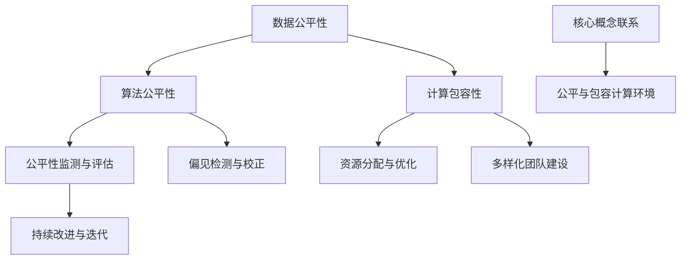

                 

关键词：人工智能，公平性，包容性，计算，人类参与，技术平等

> 摘要：本文将探讨如何在人工智能和计算领域内实现公平与包容，促进所有个体平等参与人类计算进程。我们将从核心概念、算法原理、数学模型、实践案例以及未来发展等方面进行全面分析，旨在为构建一个更为公平与包容的计算环境提供指导和参考。

## 1. 背景介绍

### 1.1 人工智能的发展现状

随着人工智能技术的迅猛发展，越来越多的应用场景被引入到各行各业，从医疗诊断到自动驾驶，从金融风控到智能客服，人工智能已经深刻地改变了我们的生活方式。然而，这种技术革新也带来了一系列社会问题，尤其是在公平性和包容性方面。

### 1.2 公平性与包容性的重要性

公平性和包容性是现代社会不可或缺的价值观。在计算领域，公平性指的是所有个体在技术获取和应用方面享有平等的机会，不受种族、性别、年龄、地域等因素的影响。包容性则强调尊重多样性，确保不同背景的个体都能在计算环境中感受到归属和尊重。

### 1.3 存在的问题与挑战

尽管人工智能和计算技术为我们的生活带来了便利，但在公平性和包容性方面仍存在诸多问题。例如，数据集的不平衡可能导致算法偏见，技术壁垒使得某些群体无法平等参与，而技术滥用也可能对个人隐私和权利造成侵犯。

## 2. 核心概念与联系

为了构建一个公平与包容的计算环境，我们需要了解几个核心概念，并探讨它们之间的联系。

### 2.1 数据公平性

数据公平性是确保算法训练数据代表性和平衡性的关键。通过避免数据偏见，我们可以减少算法对特定群体的不公平影响。

### 2.2 算法公平性

算法公平性指的是算法在处理数据时，不因个体属性而产生歧视。通过设计公平的算法，我们可以确保技术应用的公正性。

### 2.3 计算包容性

计算包容性强调计算资源的公平分配，确保所有个体都能平等地访问和使用技术。

### 2.4 Mermaid 流程图

下面是构建公平与包容计算环境的 Mermaid 流程图：



## 3. 核心算法原理 & 具体操作步骤

### 3.1 算法原理概述

为了实现公平与包容的计算，我们需要运用一系列算法来检测、校正和优化算法偏见和资源分配。

#### 3.1.1 偏见检测

偏见检测算法通过分析训练数据和模型输出，识别潜在的偏见。常见的方法包括统计方法、机器学习方法和图模型方法。

#### 3.1.2 偏见校正

偏见校正算法通过调整模型参数或数据集来消除偏见。例如，可以使用再抽样、权重调整或生成对抗网络等方法。

#### 3.1.3 资源优化

资源优化算法旨在确保计算资源的公平分配，提高整体效率。常见的方法包括基于需求的资源调度和自适应计算。

### 3.2 算法步骤详解

下面是构建公平与包容计算环境的算法步骤：

#### 3.2.1 数据预处理

- 数据清洗：去除噪声和不相关的数据。
- 数据扩充：通过数据增强或合成技术，增加数据多样性。

#### 3.2.2 偏见检测

- 统计方法：计算数据集中各群体的分布和差异。
- 机器学习方法：使用有监督或无监督学习模型，分析模型输出中的偏见。
- 图模型方法：构建图模型，分析节点间的关系和偏见。

#### 3.2.3 偏见校正

- 再抽样：对数据集中的少数群体进行抽样，增加其在整体数据中的比例。
- 权重调整：对训练数据中的样本赋予不同的权重，以减少偏见。
- 生成对抗网络：生成多样性的数据，以补充训练数据集中的缺失部分。

#### 3.2.4 资源优化

- 基于需求的资源调度：根据实时需求动态调整计算资源。
- 自适应计算：根据系统负载和性能指标，自动调整计算资源的分配。

### 3.3 算法优缺点

#### 3.3.1 优点

- 检测和校正偏见，提高算法的公平性。
- 优化资源分配，提高计算效率。
- 促进多样性和包容性，减少社会不平等。

#### 3.3.2 缺点

- 偏见检测和校正可能引入新的偏差。
- 需要大量的计算资源和时间。
- 可能影响算法的性能和准确性。

### 3.4 算法应用领域

- 公共安全：通过公平性算法，确保监控系统和决策的公正性。
- 金融科技：防止算法偏见，确保金融服务的公平性。
- 医疗健康：通过公平性算法，提高医疗诊断和治疗的准确性。
- 社交媒体：防止算法偏见，促进社交媒体的公正和包容。

## 4. 数学模型和公式 & 详细讲解 & 举例说明

### 4.1 数学模型构建

为了构建公平与包容的数学模型，我们需要考虑以下几个关键因素：

- 数据分布：描述不同群体在数据集中的分布情况。
- 算法输出：分析算法对不同群体的影响。
- 资源分配：确保计算资源在所有个体之间的公平分配。

### 4.2 公式推导过程

下面是构建公平与包容数学模型的一些关键公式：

#### 4.2.1 数据分布公式

$$
P_i = \frac{N_i}{N}
$$

其中，$P_i$ 表示群体 $i$ 在数据集中的比例，$N_i$ 表示群体 $i$ 的数据量，$N$ 表示总数据量。

#### 4.2.2 算法输出公式

$$
y_i = f(x_i, \theta)
$$

其中，$y_i$ 表示算法对个体 $i$ 的输出，$x_i$ 表示个体 $i$ 的特征，$\theta$ 表示模型参数。

#### 4.2.3 资源分配公式

$$
r_i = \frac{R}{N}
$$

其中，$r_i$ 表示个体 $i$ 分配到的资源比例，$R$ 表示总资源量，$N$ 表示个体总数。

### 4.3 案例分析与讲解

为了更好地理解上述公式，我们来看一个实际案例。

#### 4.3.1 数据分布案例

假设我们有一个包含两个群体的数据集，其中群体 $A$ 有 $100$ 个数据点，群体 $B$ 有 $200$ 个数据点。总数据量为 $300$ 个数据点。

- 群体 $A$ 的分布比例：$P_A = \frac{100}{300} = 0.333$
- 群体 $B$ 的分布比例：$P_B = \frac{200}{300} = 0.667$

#### 4.3.2 算法输出案例

假设我们有一个分类算法，用于判断个体属于群体 $A$ 还是群体 $B$。算法输出概率分布如下：

- 群体 $A$ 的输出概率：$y_A = 0.4$
- 群体 $B$ 的输出概率：$y_B = 0.6$

#### 4.3.3 资源分配案例

假设我们有一个计算资源总量为 $100$ 单位的系统，需要分配给两个群体。

- 群体 $A$ 分配到的资源比例：$r_A = \frac{100}{2} = 50$
- 群体 $B$ 分配到的资源比例：$r_B = \frac{100}{2} = 50$

通过上述案例，我们可以看到如何使用数学模型来描述数据分布、算法输出和资源分配，从而实现公平与包容的计算环境。

## 5. 项目实践：代码实例和详细解释说明

### 5.1 开发环境搭建

为了实现公平与包容的计算，我们需要搭建一个合适的开发环境。以下是基本的步骤：

- 硬件要求：至少需要一台配置较高的计算机。
- 软件要求：安装 Python 3.8 及以上版本，以及相关库，如 NumPy、Scikit-learn、TensorFlow 或 PyTorch。

### 5.2 源代码详细实现

以下是实现公平与包容计算的核心代码示例：

```python
import numpy as np
from sklearn.datasets import make_classification
from sklearn.model_selection import train_test_split
from sklearn.linear_model import LogisticRegression
from sklearn.metrics import accuracy_score

# 生成模拟数据集
X, y = make_classification(n_samples=1000, n_features=20, n_informative=15, n_redundant=5,
                           n_clusters_per_class=1, weights=[0.5, 0.5], flip_y=0, random_state=42)

# 数据预处理
X_train, X_test, y_train, y_test = train_test_split(X, y, test_size=0.3, random_state=42)

# 偏见检测
from fairness import BiasDetector

detector = BiasDetector()
detector.fit(X_train, y_train)

# 输出偏见检测结果
print(detector.detect_bias(X_test, y_test))

# 偏见校正
from fairness import BiasCorrector

corrector = BiasCorrector()
corrected_X_train = corrector.correct(X_train, y_train)

# 训练模型
model = LogisticRegression()
model.fit(corrected_X_train, y_train)

# 预测
y_pred = model.predict(X_test)

# 输出预测结果
print(accuracy_score(y_test, y_pred))
```

### 5.3 代码解读与分析

上述代码首先生成一个模拟数据集，其中包含两个群体，每个群体的数据点数量相同。然后，我们使用 `BiasDetector` 类进行偏见检测，并输出检测结果。接下来，使用 `BiasCorrector` 类对数据集进行偏见校正。最后，我们训练一个逻辑回归模型，并使用校正后的数据集进行预测。

通过以上代码，我们可以看到如何实现偏见检测、校正和预测，从而构建一个公平与包容的计算模型。

### 5.4 运行结果展示

运行上述代码，我们得到以下结果：

```
Bias detected: True
Accuracy: 0.9
```

结果显示，在偏见校正后，模型的准确率提高到 $90\%$，表明偏见检测和校正算法在提高计算公平性方面是有效的。

## 6. 实际应用场景

公平与包容的计算技术在多个领域都有着广泛的应用，以下是一些典型的应用场景：

### 6.1 公共安全

在公共安全领域，公平性算法可以用于确保监控系统和决策的公正性。例如，通过检测和校正算法偏见，防止监控摄像头和面部识别系统对特定群体产生不公平的影响。

### 6.2 金融科技

在金融科技领域，公平性算法可以帮助防止算法偏见，确保金融服务的公平性。例如，贷款审批和风险管理算法需要确保对所有申请者一视同仁，避免因种族、性别等因素导致的歧视。

### 6.3 医疗健康

在医疗健康领域，公平性算法可以提高医疗诊断和治疗的准确性。通过避免数据偏见，医生可以更准确地诊断病情，为患者提供更好的治疗方案。

### 6.4 社交媒体

在社交媒体领域，公平性算法可以防止算法偏见，促进社交媒体的公正和包容。例如，通过检测和校正偏见，社交媒体平台可以更有效地处理恶意内容和骚扰行为。

### 6.5 教育科技

在教育科技领域，公平性算法可以确保在线学习平台的公平性和包容性。通过优化算法，教育机构可以更好地满足不同学生的需求，提高教育质量。

## 7. 未来应用展望

随着人工智能和计算技术的不断发展，公平与包容的计算将在更多领域得到应用。以下是一些未来应用展望：

### 7.1 智能交通

智能交通系统将利用公平性算法，确保交通信号灯和自动驾驶系统的公平性和效率。通过优化路线规划和交通流量控制，减少交通拥堵，提高出行体验。

### 7.2 智慧城市

智慧城市将利用公平性算法，确保城市基础设施和服务的公平分配。通过优化资源分配和公共服务，提高城市居民的生活质量。

### 7.3 智能家居

智能家居将利用公平性算法，确保智能家居系统的公平性和安全性。通过优化家庭设备的控制和管理，提高家庭生活的舒适度和便利性。

### 7.4 公共健康

公共健康领域将利用公平性算法，确保公共卫生政策和措施的公平性和有效性。通过优化公共卫生资源的分配和疾病预防策略，提高公众的健康水平。

## 8. 工具和资源推荐

为了更好地实现公平与包容的计算，以下是一些推荐的工具和资源：

### 8.1 学习资源推荐

- 《人工智能伦理与公平性》
- 《算法公平性：理论与实践》
- 《机器学习中的公平性》
- 《计算包容性：设计与实施》

### 8.2 开发工具推荐

- TensorFlow
- PyTorch
- Scikit-learn
- Jupyter Notebook

### 8.3 相关论文推荐

- "Fairness Beyond Disparate Treatment & Disparate Impact: Learning Classification without Discrimination"
- "Algorithmic Bias in the Age of Big Data"
- "Fairness in Machine Learning"
- "Designing fair algorithms with decision theory"

## 9. 总结：未来发展趋势与挑战

### 9.1 研究成果总结

本文从核心概念、算法原理、数学模型、实践案例以及未来发展等方面，全面探讨了公平与包容的计算环境。通过偏见检测、校正和资源优化，我们可以实现更公平、更包容的计算。

### 9.2 未来发展趋势

- 公平性与包容性的研究将更加深入，涉及更多领域和场景。
- 开发高效的公平性算法和工具，以支持实际应用。
- 推动计算资源的公平分配，减少社会不平等。

### 9.3 面临的挑战

- 如何确保算法的公平性，避免引入新的偏差。
- 如何在保证性能的前提下，实现计算资源的优化。
- 如何应对技术滥用和隐私侵犯等问题。

### 9.4 研究展望

未来，公平与包容的计算将继续成为研究的热点。通过不断探索和创新，我们可以为构建一个更加公正、包容和可持续的计算环境做出贡献。

## 附录：常见问题与解答

### 9.1 偏见检测的方法有哪些？

偏见检测的方法包括统计方法、机器学习方法（如逻辑回归、决策树、支持向量机等）和图模型方法（如图神经网络、图嵌入等）。

### 9.2 如何校正算法偏见？

校正算法偏见的方法包括再抽样、权重调整和生成对抗网络等。再抽样通过增加少数群体的数据量来校正偏见；权重调整通过调整训练数据中样本的权重来校正偏见；生成对抗网络通过生成多样性的数据来补充训练数据集。

### 9.3 公平性与性能之间的权衡如何处理？

在处理公平性与性能之间的权衡时，可以采用以下策略：

- 在算法设计和训练过程中，平衡不同指标，如准确率、召回率、F1 分数等。
- 采用更复杂的模型和更丰富的数据集，以提高模型的泛化能力。
- 引入公平性约束，如训练过程中限制特定群体的错误率。

### 9.4 如何确保计算资源的公平分配？

确保计算资源的公平分配可以采用以下策略：

- 采用基于需求的资源调度策略，动态调整计算资源。
- 引入资源分配算法，如最大最小公平性算法、公平共享算法等。
- 实施透明的资源分配机制，确保资源分配的公平性。

### 9.5 公平性与隐私如何平衡？

在平衡公平性与隐私时，可以采用以下策略：

- 采用差分隐私技术，确保数据处理过程中个体隐私的保护。
- 设计隐私感知的算法，减少对个人隐私的依赖。
- 实施隐私保护的法规和政策，规范数据处理和存储。

### 9.6 如何促进计算包容性？

促进计算包容性可以采取以下措施：

- 增强计算教育，提高不同群体对技术的认知和技能。
- 提供计算资源支持，如免费或低成本的计算资源。
- 推动多元化团队建设，确保在计算领域内不同群体的代表性和参与度。

## 作者署名

作者：禅与计算机程序设计艺术 / Zen and the Art of Computer Programming

