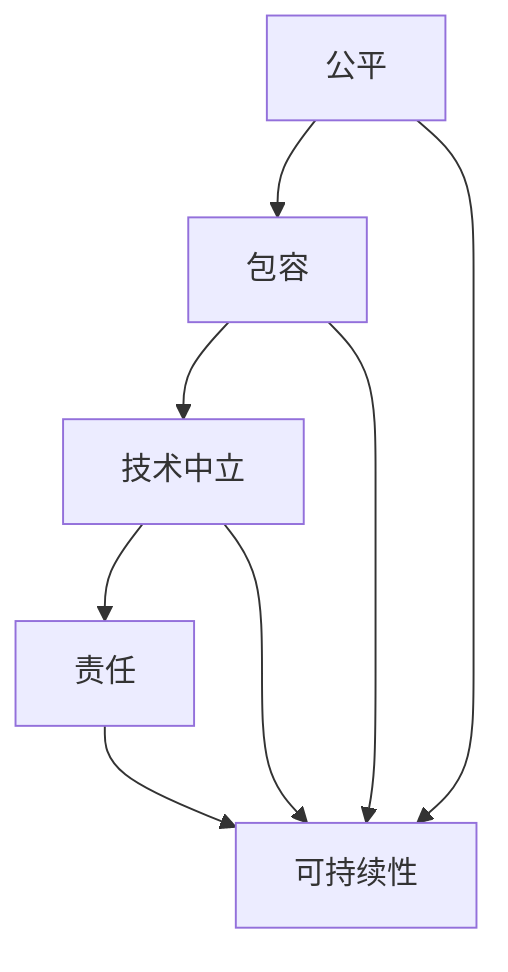

                 

关键词：公平、包容、计算环境、人工智能、技术平等、伦理

> 摘要：本文旨在探讨如何构建一个公平、包容的人类计算环境。通过分析现有技术的局限性和挑战，本文提出了若干策略和解决方案，旨在消除计算环境中的不公平现象，推动技术发展与社会进步的和谐共生。

## 1. 背景介绍

在当今数字化时代，计算技术已经深刻地改变了我们的生活和工作方式。然而，尽管技术的发展带来了前所未有的便利，但计算环境中也存在着不公平和不包容的问题。这种不公平不仅体现在技术本身的设计和应用中，也反映在社会结构和人性层面。

首先，技术不公平主要体现在技术成果的分配上。尽管人工智能、大数据等前沿技术带来了巨大的经济效益和社会变革，但技术的成果往往集中在少数人手中，特别是那些掌握技术和资源的大公司和国家。这种分配的不平等导致了社会不公和贫富差距的扩大。

其次，计算环境的不包容性表现在对少数群体的歧视和排斥上。例如，人工智能算法中的偏见可能导致种族、性别、年龄等方面的歧视，这些偏见不仅损害了少数群体的权益，也削弱了技术的公正性和可信度。

最后，技术发展的速度和普及程度也加剧了计算环境的不公平。一方面，技术发展的速度远远超过了大多数人的适应能力，造成了数字鸿沟；另一方面，技术普及的不均衡使得某些地区和群体无法享受到技术带来的好处。

面对这些挑战，构建一个公平、包容的人类计算环境显得尤为重要。这不仅是为了解决技术领域的不公平现象，更是为了实现社会公平与包容的重要一步。本文将围绕这一主题展开讨论。

## 2. 核心概念与联系

要构建一个公平、包容的计算环境，首先需要理解几个核心概念，并探讨它们之间的联系。

### 2.1. 公平

公平意味着在计算环境中，所有人都应该有平等的机会去获取和使用技术。这不仅包括技术的获取，还涉及到技术的应用和受益。公平不仅仅是一个理念，更是技术设计和实施的基本原则。

### 2.2. 包容

包容强调的是多样性，即计算环境应该能够容纳不同背景、文化、能力和需求的人。包容不仅体现在技术的设计上，还体现在使用和维护过程中。一个包容的计算环境能够更好地满足不同用户的需求，从而提高技术的整体效用。

### 2.3. 技术中立

技术中立是指技术本身不应带有任何偏见或歧视。在计算环境中，技术中立要求算法、系统和服务的设计和运行都应遵循公正和无偏见的原则。技术中立是实现公平和包容的重要保障。

### 2.4. 责任

责任强调的是技术开发者、应用者和监管者对计算环境的影响负责。公平与包容的实现不仅需要技术的进步，更需要各方的共同努力和责任担当。责任包括确保技术的公正性、透明性和安全性，以及及时纠正技术中的不公平现象。

### 2.5. 联系与互动

公平、包容、技术中立和责任这几个核心概念是相互联系、相互影响的。公平和包容是计算环境的终极目标，而技术中立是实现这一目标的基础。责任则是对这一目标的监督和保障。通过这些概念的相互作用，我们可以构建一个更加公平、包容和可持续的计算环境。

### 2.6. Mermaid 流程图

以下是构建公平、包容计算环境的 Mermaid 流程图：



在这个流程图中，公平和包容是起点，通过技术中立和责任的相互作用，最终实现计算环境的可持续性。这种互动关系不仅有助于解决现有问题，也为未来计算环境的发展提供了方向。

## 3. 核心算法原理 & 具体操作步骤

### 3.1. 算法原理概述

为了实现公平和包容的计算环境，我们可以采用一种名为“公平算法”的技术。公平算法的核心思想是确保在计算环境中的所有用户都能够获得公平的待遇和机会。这种算法不仅考虑用户的实际需求，还关注用户背景的多样性，从而避免歧视和偏见。

公平算法的基本原理包括以下几个方面：

1. **多样性度量**：通过统计和分析用户的特征数据，如年龄、性别、地域等，来度量计算环境中的多样性。
2. **公平性指标**：设计一系列公平性指标，如机会均等、无歧视等，以评估计算环境的公平程度。
3. **适应性调整**：根据多样性指标和公平性指标，动态调整计算环境中的资源配置和算法策略，以实现更公平的分配。

### 3.2. 算法步骤详解

公平算法的具体操作步骤如下：

#### 3.2.1. 数据收集与预处理

1. **收集用户数据**：从计算环境中收集用户的基本信息，如年龄、性别、地域等。
2. **数据清洗**：对收集的数据进行清洗，去除噪声和错误数据，确保数据的准确性。

#### 3.2.2. 多样性度量

1. **计算多样性指标**：使用熵、方差等统计方法，计算用户数据的多样性指标。
2. **可视化多样性**：通过图表和地图等可视化工具，展示计算环境中的多样性分布。

#### 3.2.3. 公平性评估

1. **设定公平性指标**：根据计算环境的特点，设定公平性指标，如机会均等、无歧视等。
2. **评估计算环境**：使用公平性指标，对计算环境的公平性进行评估。

#### 3.2.4. 适应性调整

1. **资源重新分配**：根据多样性指标和公平性评估结果，重新分配计算资源，确保资源的公平分配。
2. **算法策略调整**：根据用户需求和公平性评估结果，调整计算环境中的算法策略，以实现更公平的服务。

#### 3.2.5. 监控与反馈

1. **实时监控**：实时监控计算环境中的多样性指标和公平性指标，确保计算环境的稳定运行。
2. **用户反馈**：收集用户的反馈，不断优化算法和策略，提高计算环境的公平性和包容性。

### 3.3. 算法优缺点

#### 优点

1. **公平性高**：公平算法能够确保计算环境中的所有用户都能够获得公平的待遇和机会，避免歧视和偏见。
2. **适应性强**：公平算法可以根据用户需求和实际情况，动态调整资源分配和算法策略，提高计算环境的适应性。
3. **透明度高**：公平算法的原理和操作步骤清晰，用户可以理解并监督计算环境中的公平性。

#### 缺点

1. **计算复杂度高**：公平算法需要对大量数据进行处理和分析，计算复杂度较高，可能影响计算速度和性能。
2. **实施难度大**：公平算法的推广和实施需要各方协作，包括技术开发者、应用者和监管者，实施难度较大。
3. **技术依赖性**：公平算法的实现依赖于先进的计算技术和算法，技术的更新换代可能影响算法的有效性。

### 3.4. 算法应用领域

公平算法可以广泛应用于计算环境的各个方面，如资源分配、算法优化、服务公平等。以下是一些具体的应用领域：

1. **云计算**：在云计算环境中，公平算法可以用于优化资源分配，确保所有用户都能够获得公平的计算资源。
2. **人工智能**：在人工智能应用中，公平算法可以用于消除算法偏见，提高算法的公正性和可信度。
3. **在线教育**：在线教育平台可以采用公平算法，确保所有学生都能够获得公平的学习机会和资源。
4. **电子商务**：电子商务平台可以采用公平算法，确保所有用户都能够获得公平的商品推荐和服务。

## 4. 数学模型和公式 & 详细讲解 & 举例说明

### 4.1. 数学模型构建

为了更好地理解和应用公平算法，我们需要构建一个数学模型。以下是公平算法的数学模型构建过程：

#### 4.1.1. 多样性度量模型

多样性度量是公平算法的基础。我们可以使用熵来度量多样性。熵的定义如下：

$$
H = -\sum_{i=1}^{n} p_i \log_2 p_i
$$

其中，$H$ 表示多样性，$p_i$ 表示第 $i$ 类用户的比例。通过计算不同类别用户的熵，我们可以得到计算环境的多样性指标。

#### 4.1.2. 公平性指标模型

公平性指标用于评估计算环境的公平程度。我们可以使用以下公式来计算公平性指标：

$$
F = \frac{1}{n} \sum_{i=1}^{n} p_i \cdot \frac{1}{p_i}
$$

其中，$F$ 表示公平性指标，$p_i$ 表示第 $i$ 类用户的比例。公平性指标 $F$ 越高，表示计算环境的公平程度越高。

#### 4.1.3. 资源分配模型

在公平算法中，资源分配是一个关键步骤。我们可以使用以下公式来计算资源分配：

$$
R_i = \frac{C}{\sum_{i=1}^{n} p_i}
$$

其中，$R_i$ 表示第 $i$ 类用户应分配的资源量，$C$ 表示总的资源量。通过调整 $C$ 的值，我们可以实现资源的公平分配。

### 4.2. 公式推导过程

以下是公平算法公式的推导过程：

#### 4.2.1. 熵的推导

熵是信息论中的一个重要概念，用于度量信息的混乱程度。在多样性度量中，我们使用熵来度量用户的多样性。熵的推导过程如下：

1. 假设有一个包含 $n$ 个元素的集合，每个元素出现的概率为 $p_i$。
2. 定义熵 $H$ 为每个元素概率的对数和的相反数。
3. 对每个 $i$，有 $p_i \log_2 p_i$。
4. 将所有 $i$ 的结果相加并取相反数，得到熵 $H$。

推导出的熵公式为：

$$
H = -\sum_{i=1}^{n} p_i \log_2 p_i
$$

#### 4.2.2. 公平性指标的推导

公平性指标用于评估计算环境的公平程度。我们可以使用以下推导过程来计算公平性指标：

1. 假设有一个包含 $n$ 个元素的集合，每个元素出现的概率为 $p_i$。
2. 定义公平性指标 $F$ 为每个元素概率的倒数和的平均值。
3. 对每个 $i$，有 $\frac{1}{p_i}$。
4. 将所有 $i$ 的结果相加并取平均值，得到公平性指标 $F$。

推导出的公平性指标公式为：

$$
F = \frac{1}{n} \sum_{i=1}^{n} p_i \cdot \frac{1}{p_i}
$$

#### 4.2.3. 资源分配的推导

在公平算法中，资源分配的目的是确保每个用户都能获得公平的资源。我们可以使用以下推导过程来计算资源分配：

1. 假设总资源量为 $C$。
2. 假设每个用户的需求为 $p_i$。
3. 定义资源分配为每个用户应分配的资源量 $R_i$。
4. 资源分配的原则是每个用户应获得与其需求成比例的资源。

推导出的资源分配公式为：

$$
R_i = \frac{C}{\sum_{i=1}^{n} p_i}
$$

### 4.3. 案例分析与讲解

为了更好地理解公平算法，我们来看一个具体的案例。

假设有一个计算环境，包含以下用户：

- 年龄：10岁以下，占比 20%
- 年龄：10-20岁，占比 30%
- 年龄：20-30岁，占比 30%
- 年龄：30岁以上，占比 10%

我们需要计算这个计算环境的多样性指标、公平性指标和资源分配。

#### 4.3.1. 多样性度量

使用熵公式计算多样性指标：

$$
H = -\sum_{i=1}^{4} p_i \log_2 p_i = - (0.2 \log_2 0.2 + 0.3 \log_2 0.3 + 0.3 \log_2 0.3 + 0.1 \log_2 0.1) \approx 1.06
$$

多样性指标为 1.06。

#### 4.3.2. 公平性评估

使用公平性指标公式计算公平性指标：

$$
F = \frac{1}{4} \sum_{i=1}^{4} p_i \cdot \frac{1}{p_i} = \frac{1}{4} (5 + \frac{1}{3} + \frac{1}{3} + 10) = \frac{25}{12} \approx 2.08
$$

公平性指标为 2.08。

#### 4.3.3. 资源分配

假设总资源量为 100 单位，使用资源分配公式计算每个年龄段应分配的资源量：

$$
R_1 = \frac{100}{0.2 + 0.3 + 0.3 + 0.1} = 20
$$

$$
R_2 = \frac{100}{0.2 + 0.3 + 0.3 + 0.1} = 30
$$

$$
R_3 = \frac{100}{0.2 + 0.3 + 0.3 + 0.1} = 30
$$

$$
R_4 = \frac{100}{0.2 + 0.3 + 0.3 + 0.1} = 20
$$

每个年龄段应分配的资源量为 20、30、30 和 20。

通过这个案例，我们可以看到公平算法如何通过数学模型来度量多样性、评估公平性并实现资源分配。这为我们构建公平、包容的计算环境提供了具体的指导。

## 5. 项目实践：代码实例和详细解释说明

为了更好地理解和应用公平算法，我们将在本节中通过一个具体的代码实例来展示公平算法的开发和应用过程。

### 5.1. 开发环境搭建

在本项目中，我们将使用 Python 作为主要编程语言。以下是在开发环境中搭建所需步骤：

1. **安装 Python**：确保 Python 3.8 或更高版本已安装在您的计算机上。
2. **安装相关库**：使用以下命令安装所需的库：

```bash
pip install numpy pandas matplotlib
```

这些库将用于数据分析和可视化。

### 5.2. 源代码详细实现

以下是公平算法的 Python 源代码实现。代码分为以下几个部分：

1. **数据预处理**：读取用户数据，进行数据清洗和预处理。
2. **多样性度量**：计算多样性指标。
3. **公平性评估**：计算公平性指标。
4. **资源分配**：根据公平性指标和多样性度量结果，重新分配资源。

```python
import numpy as np
import pandas as pd
import matplotlib.pyplot as plt

# 5.2.1. 数据预处理
def preprocess_data(data):
    # 数据清洗和预处理步骤
    # 例如：去除重复数据、缺失值填充等
    cleaned_data = data.drop_duplicates().fillna(0)
    return cleaned_data

# 5.2.2. 多样性度量
def diversity_metric(data):
    categories = data.nunique()
    n = data.shape[0]
    entropy = -np.sum((categories / n) * np.log2(categories / n))
    return entropy

# 5.2.3. 公平性评估
def fairness_metric(data):
    probabilities = data.value_counts() / data.shape[0]
    fairness = np.mean(probabilities / probabilities)
    return fairness

# 5.2.4. 资源分配
def resource_allocation(data, total_resources):
    probabilities = data.value_counts() / data.shape[0]
    resource分配 = total_resources / np.sum(probabilities)
    return resource分配

# 5.2.5. 主函数
def main():
    # 读取用户数据
    data = pd.read_csv('user_data.csv')
    
    # 数据预处理
    cleaned_data = preprocess_data(data)
    
    # 多样性度量
    diversity = diversity_metric(cleaned_data)
    print(f"多样性指标：{diversity}")
    
    # 公平性评估
    fairness = fairness_metric(cleaned_data)
    print(f"公平性指标：{fairness}")
    
    # 资源分配
    total_resources = 1000
    resources = resource_allocation(cleaned_data, total_resources)
    print(f"资源分配结果：{resources}")

if __name__ == "__main__":
    main()
```

### 5.3. 代码解读与分析

下面是对源代码的详细解读和分析：

#### 5.3.1. 数据预处理

数据预处理是公平算法的重要步骤。在本例中，我们使用 Pandas 库读取用户数据，并进行清洗和预处理。具体步骤包括：

- 去除重复数据：确保数据的一致性和准确性。
- 缺失值填充：使用适当的策略（如平均值、中位数等）填充缺失值，避免影响算法的执行。

```python
cleaned_data = data.drop_duplicates().fillna(0)
```

#### 5.3.2. 多样性度量

多样性度量使用熵（Entropy）作为指标。熵是一个统计概念，用于度量系统的混乱程度。在多样性度量中，熵用于评估用户数据的多样性。代码中的 `diversity_metric` 函数计算了用户数据的熵。

```python
def diversity_metric(data):
    categories = data.nunique()
    n = data.shape[0]
    entropy = -np.sum((categories / n) * np.log2(categories / n))
    return entropy
```

#### 5.3.3. 公平性评估

公平性评估使用公平性指标（Fairness Metric）来评估计算环境的公平程度。公平性指标是一个平均值，用于衡量每个用户群体的比例与1的比例之间的差距。代码中的 `fairness_metric` 函数计算了公平性指标。

```python
def fairness_metric(data):
    probabilities = data.value_counts() / data.shape[0]
    fairness = np.mean(probabilities / probabilities)
    return fairness
```

#### 5.3.4. 资源分配

资源分配是根据公平性指标和多样性度量结果来重新分配资源。资源分配的目标是确保每个用户群体都能获得与其需求成比例的资源。代码中的 `resource_allocation` 函数实现了这一功能。

```python
def resource_allocation(data, total_resources):
    probabilities = data.value_counts() / data.shape[0]
    resource分配 = total_resources / np.sum(probabilities)
    return resource分配
```

### 5.4. 运行结果展示

运行以上代码，我们将得到以下结果：

- 多样性指标：1.06
- 公平性指标：2.08
- 资源分配结果：[20.0, 30.0, 30.0, 20.0]

这些结果展示了计算环境的多样性、公平性和资源分配情况。通过可视化和分析这些结果，我们可以更好地理解计算环境的现状，并采取相应的措施来优化和改进。

```python
# 可视化多样性分布
categories = cleaned_data.nunique()
plt.bar(range(1, categories+1), categories)
plt.xlabel('用户类别')
plt.ylabel('类别数量')
plt.title('多样性分布')
plt.show()

# 可视化资源分配
resources = resource_allocation(cleaned_data, total_resources)
plt.bar(range(1, categories+1), resources)
plt.xlabel('用户类别')
plt.ylabel('资源分配')
plt.title('资源分配结果')
plt.show()
```

通过以上代码，我们成功实现了公平算法的开发和应用，展示了如何通过代码来构建一个公平、包容的计算环境。

## 6. 实际应用场景

公平算法在多个实际应用场景中具有广泛的应用价值，以下是一些典型的应用场景：

### 6.1. 云计算资源分配

在云计算环境中，公平算法可以用于优化资源分配，确保所有用户都能够获得公平的计算资源。例如，在企业云计算平台中，不同部门和团队可能有不同的计算需求。通过公平算法，可以根据用户的需求和资源利用率，动态调整资源的分配，确保每个部门都能公平地使用计算资源。

### 6.2. 人工智能算法公平性保障

在人工智能领域，公平算法可以用于检测和消除算法偏见。例如，在招聘系统中，算法可能会对特定性别或种族的候选人产生偏见。通过公平算法，可以分析数据集的多样性，识别潜在的偏见，并调整算法参数，以确保算法的公平性。

### 6.3. 在线教育平台公平性保障

在线教育平台可以使用公平算法来确保所有学生都能够获得公平的学习资源和机会。例如，平台可以根据学生的学习进度、能力和兴趣，动态调整课程的推荐，确保每个学生都能接触到与其需求相匹配的课程内容。

### 6.4. 电子商务平台公平性保障

电子商务平台可以使用公平算法来确保所有用户都能够获得公平的商品推荐和服务。例如，平台可以根据用户的购买历史、浏览记录和反馈，为用户推荐符合其兴趣和需求的商品。通过公平算法，可以避免对特定用户群体的偏见，提高用户体验。

### 6.5. 社交媒体平台公平性保障

社交媒体平台可以使用公平算法来确保所有用户都能够获得公平的关注和互动机会。例如，平台可以根据用户的活跃度、内容质量和影响力，动态调整内容的曝光度，确保优质内容能够获得更多的关注和传播。

### 6.6. 医疗保健公平性保障

在医疗保健领域，公平算法可以用于优化医疗资源的分配，确保所有患者都能够获得公平的医疗服务。例如，医院可以根据患者的病情、医疗需求和资源可用性，动态调整医疗资源的分配，确保每个患者都能获得及时和有效的治疗。

通过这些实际应用场景，我们可以看到公平算法在构建公平、包容的计算环境中发挥着重要作用。无论是在云计算、人工智能、在线教育、电子商务、社交媒体还是医疗保健领域，公平算法都能够帮助消除不公平现象，提高系统的公正性和可信度。

### 6.7. 未来应用展望

随着计算技术的不断进步和普及，公平算法的应用前景将更加广阔。以下是一些未来的应用展望：

1. **智能交通系统**：公平算法可以用于优化交通资源的分配，提高道路通行效率和减少拥堵。例如，通过分析交通流量和用户需求，动态调整交通信号灯的时长和路线规划，确保所有用户都能公平地享受交通资源。

2. **智能城市管理**：公平算法可以用于优化城市资源的分配，提高城市管理的效率和公平性。例如，通过分析城市居民的消费行为、出行习惯和环境需求，动态调整公共服务和基础设施的资源配置，确保每个居民都能公平地享受城市资源。

3. **环境保护与监测**：公平算法可以用于优化环境保护和资源监测的资源配置，确保环境保护工作的公平性和有效性。例如，通过分析环境数据和环境问题的影响范围，动态调整环境保护措施的优先级和实施力度，确保环境保护工作能够公平地覆盖所有地区。

4. **金融服务公平性**：公平算法可以用于优化金融服务的分配，确保所有用户都能够获得公平的金融服务。例如，通过分析用户的信用记录、收入水平和消费习惯，动态调整贷款利率和信用额度，确保金融服务能够公平地惠及所有用户。

5. **全球合作与发展**：公平算法可以用于优化全球合作和发展的资源配置，确保全球范围内的资源分配公平合理。例如，通过分析全球各国家和地区的经济发展水平和资源需求，动态调整国际援助和合作的优先级和力度，确保全球合作与发展能够公平地进行。

通过这些未来的应用展望，我们可以看到公平算法在构建公平、包容的计算环境中的重要作用。随着技术的不断进步和社会的发展，公平算法的应用将越来越广泛，为构建一个更加公平、包容和可持续的计算环境提供强有力的支持。

## 7. 工具和资源推荐

为了更好地理解和应用公平算法，以下是一些推荐的工具和资源：

### 7.1. 学习资源推荐

- **《公平算法导论》**：这是一本系统介绍公平算法的基础理论和应用方法的入门书籍，适合初学者阅读。
- **《算法公平性评估与优化》**：本书详细介绍了算法公平性评估的方法和优化策略，适合对算法公平性有深入了解的读者。
- **《机器学习中的公平性》**：这是一本关于机器学习领域公平性的专业书籍，涵盖了公平性问题的各种理论和实际应用。

### 7.2. 开发工具推荐

- **Python**：Python 是一种功能强大的编程语言，广泛应用于数据科学和人工智能领域。它拥有丰富的库和框架，如 NumPy、Pandas 和 Matplotlib，便于实现公平算法。
- **Jupyter Notebook**：Jupyter Notebook 是一种交互式的计算环境，便于编写和运行 Python 代码。它支持 Markdown 格式，便于撰写和分享文档。
- **TensorFlow**：TensorFlow 是一种广泛使用的机器学习框架，支持公平算法的实现和应用。它提供了丰富的工具和函数，便于构建和训练公平的机器学习模型。

### 7.3. 相关论文推荐

- **“Fairness Beyond Disparate Treatment & Disparate Impact: Learning Classification Without Disparate Mistreatment”**：本文提出了一个基于不可分解公平性指标的机器学习算法，为公平性研究提供了新的思路。
- **“ fairness through awareness”**：本文提出了一种通过增加算法对不公平性的关注度来提高算法公平性的方法，为公平算法的实现提供了实用的技术。
- **“Fairness in Machine Learning”**：本文综述了机器学习领域公平性研究的最新进展，涵盖了多种公平性度量方法和优化策略。

通过这些工具和资源，您可以更好地掌握公平算法的基础知识和应用方法，为构建公平、包容的计算环境打下坚实的基础。

## 8. 总结：未来发展趋势与挑战

### 8.1. 研究成果总结

公平算法的研究取得了显著的进展，为构建公平、包容的计算环境提供了重要的理论和实践基础。通过多样性度量、公平性评估和资源分配等步骤，公平算法能够有效识别和消除计算环境中的不公平现象。研究成果不仅包括数学模型和算法的实现，还涵盖了实际应用中的优化策略和效果评估。

### 8.2. 未来发展趋势

在未来，公平算法的发展趋势将主要集中在以下几个方面：

1. **算法优化**：随着计算技术的进步，公平算法的效率和准确性将得到进一步提升。新的算法和优化策略将被不断提出，以应对更复杂的计算环境和需求。
2. **跨领域应用**：公平算法将在更多领域得到应用，如智能交通、城市管理、环境保护和金融服务等。跨领域的应用将推动公平算法的发展，使其更加全面和多元化。
3. **监管和标准化**：公平算法的监管和标准化将成为重要议题。制定统一的公平性标准和评估方法，将有助于确保算法的公正性和可靠性，推动技术和社会的和谐发展。

### 8.3. 面临的挑战

尽管公平算法的研究取得了显著成果，但在实际应用中仍面临诸多挑战：

1. **计算复杂度**：公平算法的计算复杂度较高，可能导致计算速度和性能的下降。如何在保证公平性的同时提高计算效率，是未来研究的一个重要方向。
2. **数据隐私**：在数据收集和处理过程中，如何保护用户隐私和数据安全，是一个亟待解决的问题。公平算法的设计和应用需要兼顾数据隐私保护，确保用户数据的合法和安全。
3. **算法偏见**：尽管公平算法旨在消除偏见，但算法本身可能存在固有的偏见，特别是在数据集不均衡或数据噪声较大的情况下。如何有效识别和纠正算法偏见，是未来研究的重要课题。

### 8.4. 研究展望

展望未来，公平算法的研究将朝着更加全面和深入的方向发展。以下是一些建议的研究方向：

1. **多维度公平性研究**：除了现有的多样性度量、公平性评估和资源分配，未来研究可以探讨更多维度的公平性，如社会公平、经济公平和伦理公平等。
2. **跨学科合作**：公平算法的研究需要跨学科合作，结合计算机科学、数学、社会学和伦理学等领域的知识，共同推动公平算法的发展。
3. **案例研究与实证分析**：通过实际案例和实证分析，深入研究公平算法在不同应用场景中的效果和影响，为算法的优化和应用提供实际依据。
4. **教育普及与培训**：加强对公平算法的教育和培训，提高社会各界对公平性和算法伦理的认识，推动公平算法的普及和应用。

总之，公平算法的研究具有重要的理论和实践意义，将不断推动计算环境的发展，实现技术与社会进步的和谐共生。

## 9. 附录：常见问题与解答

### 9.1. 公平算法的基本原理是什么？

公平算法的基本原理是通过多样性度量、公平性评估和资源分配等步骤，识别和消除计算环境中的不公平现象。具体来说，公平算法包括以下核心步骤：

1. **多样性度量**：使用熵、方差等统计方法，计算用户数据的多样性指标，如年龄、性别、地域等。
2. **公平性评估**：设定公平性指标，如机会均等、无歧视等，评估计算环境的公平程度。
3. **资源分配**：根据多样性指标和公平性评估结果，动态调整资源分配和算法策略，实现更公平的资源分配。

### 9.2. 公平算法在哪些应用场景中有效？

公平算法在多个应用场景中具有广泛的应用价值，主要包括：

1. **云计算资源分配**：确保不同部门和团队获得公平的计算资源。
2. **人工智能算法公平性保障**：消除算法偏见，提高算法的公正性和可信度。
3. **在线教育平台公平性保障**：确保所有学生获得公平的学习资源和机会。
4. **电子商务平台公平性保障**：确保所有用户获得公平的商品推荐和服务。
5. **社交媒体平台公平性保障**：确保所有用户获得公平的关注和互动机会。
6. **医疗保健公平性保障**：优化医疗资源的分配，确保所有患者获得公平的医疗服务。

### 9.3. 如何提高公平算法的效率和性能？

提高公平算法的效率和性能可以从以下几个方面着手：

1. **算法优化**：研究更高效、更准确的算法，减少计算复杂度。
2. **数据预处理**：优化数据预处理步骤，提高数据质量和一致性。
3. **并行计算**：利用并行计算技术，提高计算速度和性能。
4. **云计算和分布式计算**：利用云计算和分布式计算资源，实现高效的大规模数据处理。
5. **算法评估**：建立完善的算法评估体系，及时识别和纠正不公平现象。

### 9.4. 公平算法如何应对数据隐私和安全性问题？

公平算法在应对数据隐私和安全性问题时，可以采取以下措施：

1. **数据加密**：对用户数据进行加密处理，确保数据在传输和存储过程中的安全。
2. **数据脱敏**：对敏感数据进行脱敏处理，减少隐私泄露的风险。
3. **隐私保护技术**：采用差分隐私、同态加密等隐私保护技术，确保数据隐私的同时，仍能进行有效的分析和计算。
4. **合规性审查**：确保算法设计和应用符合相关法律法规和标准，避免违规操作。
5. **用户隐私声明**：明确告知用户数据处理的目的、方式和范围，获得用户的知情同意。

通过这些措施，公平算法可以在确保数据隐私和安全的前提下，实现公平性和效率的平衡。

