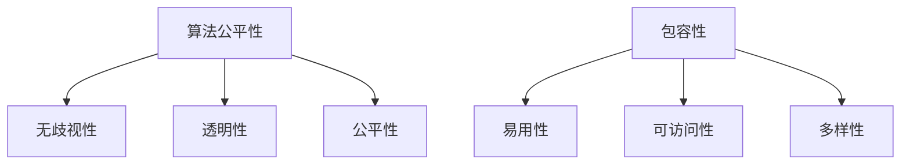

                 

关键词：计算平等性、人工智能、算法公平性、包容性、技术伦理

> 摘要：本文探讨了在人工智能时代，确保计算过程中人类平等性的重要性和必要性。通过分析算法公平性的核心概念、数学模型和具体实现，探讨了实际应用场景，并展望了未来技术的发展趋势与挑战。

## 1. 背景介绍

随着人工智能和大数据技术的飞速发展，计算机算法已经渗透到我们生活的方方面面。从推荐系统到自动驾驶，从医疗诊断到金融风险评估，算法的应用无处不在。然而，算法的普及也带来了新的挑战——算法公平性问题。算法公平性指的是算法在处理数据、做出决策时是否公平、无偏见。算法的不公平可能导致歧视、偏见，甚至加剧社会不平等。

计算平等性的概念源于对人类基本权利的尊重，即在计算过程中，每个人都应该得到公平的对待。这一概念不仅包括算法的公平性，还涉及到技术设计、数据收集和使用等多个方面。确保计算的平等性，对于建设一个更加公平、包容的社会具有重要意义。

## 2. 核心概念与联系

### 2.1 算法公平性

算法公平性是指算法在处理数据、做出决策时，是否对所有人平等对待。一个公平的算法应该满足以下原则：

1. **无歧视性**：算法不应基于种族、性别、年龄、宗教信仰等特征进行歧视。
2. **透明性**：算法的决策过程应该是可解释的，以便用户了解其决策依据。
3. **公平性**：算法在处理相同情况下，应给予相同的处理结果。

### 2.2 包容性

包容性是指技术设计和实施过程中，充分考虑不同用户的需求和差异，确保技术能够为所有人提供服务。包容性技术应该具有以下特点：

1. **易用性**：技术应易于使用，无需特定的技术背景。
2. **可访问性**：技术应能够被所有人访问，包括残障人士和偏远地区用户。
3. **多样性**：技术设计应考虑不同文化、语言和背景的用户需求。

### 2.3 Mermaid 流程图

下面是一个简化的 Mermaid 流程图，展示了算法公平性和包容性的核心概念和联系。



## 3. 核心算法原理 & 具体操作步骤

### 3.1 算法原理概述

为了确保算法的公平性，我们需要从数据收集、算法设计和模型评估等多个方面进行考虑。以下是算法公平性的核心原理：

1. **数据多样性**：确保数据集包含各种背景、特征的人群，以避免偏见。
2. **偏置检测与校正**：使用统计方法检测数据集中的偏置，并进行校正。
3. **可解释性**：设计可解释的算法，使决策过程透明。
4. **公平性度量**：使用公平性度量方法评估算法的公平性。

### 3.2 算法步骤详解

下面是一个简化的算法步骤，用于确保算法的公平性和包容性：

1. **数据预处理**：
    - 收集包含多种特征的数据集。
    - 进行数据清洗，去除异常值和噪声。

2. **特征工程**：
    - 选择与问题相关的特征。
    - 处理特征缺失和异常值。

3. **模型训练**：
    - 使用随机化算法避免偏见。
    - 应用交叉验证确保模型的泛化能力。

4. **模型评估**：
    - 使用公平性度量方法评估模型。
    - 检测并校正可能的偏置。

5. **模型解释**：
    - 使用可解释性工具分析模型的决策过程。
    - 为用户提供决策解释。

### 3.3 算法优缺点

**优点**：

- 算法公平性有助于减少社会不平等。
- 包容性技术能够满足更多用户的需求。
- 提高技术的可信度和用户满意度。

**缺点**：

- 数据多样性和质量要求较高。
- 偏置检测与校正可能引入误差。
- 可解释性工具的开发和维护成本较高。

### 3.4 算法应用领域

算法公平性和包容性在多个领域有广泛的应用，包括：

- **金融**：风险评估、信用评分、贷款审批。
- **医疗**：疾病诊断、治疗方案推荐。
- **教育**：个性化学习、录取评估。
- **招聘**：招聘流程优化、招聘歧视检测。

## 4. 数学模型和公式 & 详细讲解 & 举例说明

### 4.1 数学模型构建

为了确保算法的公平性，我们可以使用以下数学模型：

$$
\text{公平性度量} = \frac{\sum_{i=1}^{n} \text{敏感特征} \cdot \text{分类误差}}{n}
$$

其中，$n$ 表示总样本数量，敏感特征表示可能导致偏置的特征（如种族、性别），分类误差表示算法在处理敏感特征不同的人群时的误差。

### 4.2 公式推导过程

公式的推导基于以下假设：

1. 数据集包含多种敏感特征的人群。
2. 算法在处理敏感特征不同的人群时，存在分类误差。
3. 公平性度量应尽量减少敏感特征的分类误差。

通过计算所有敏感特征的分类误差之和，并除以敏感特征的总数，可以得到一个综合的公平性度量。

### 4.3 案例分析与讲解

假设我们有一个贷款审批系统，该系统基于用户的信用评分进行贷款审批。敏感特征包括种族和性别。为了确保算法的公平性，我们使用上述公平性度量进行评估。

假设数据集中有 1000 名用户，其中 500 名为男性，500 名为女性，100 名为黑人，900 名为白人。算法在处理不同种族和性别的用户时，存在 10% 的分类误差。使用公平性度量，我们可以得到：

$$
\text{公平性度量} = \frac{(0.1 \times 500 + 0.1 \times 500 + 0.1 \times 100 + 0.1 \times 900)}{1000} = 0.15
$$

这意味着贷款审批系统存在 15% 的公平性问题。为了提高公平性，我们可以通过以下方法进行改进：

1. **数据多样性**：增加不同种族和性别的用户数据，确保数据集更具代表性。
2. **偏置检测与校正**：使用统计方法检测数据集中的偏置，并进行校正。
3. **模型调整**：优化算法，减少在敏感特征不同人群的分类误差。

## 5. 项目实践：代码实例和详细解释说明

### 5.1 开发环境搭建

为了实现算法公平性和包容性的项目，我们首先需要搭建一个开发环境。以下是所需的工具和库：

- Python 3.x
- NumPy
- Pandas
- Scikit-learn
- Matplotlib

安装以下库：

```shell
pip install numpy pandas scikit-learn matplotlib
```

### 5.2 源代码详细实现

下面是一个简单的示例，展示了如何使用 Python 实现算法公平性和包容性的项目。

```python
import numpy as np
import pandas as pd
from sklearn.model_selection import train_test_split
from sklearn.metrics import accuracy_score
from sklearn.linear_model import LogisticRegression
from sklearn.preprocessing import StandardScaler

# 加载数据集
data = pd.read_csv('data.csv')

# 数据预处理
X = data.drop(['label'], axis=1)
y = data['label']

# 特征工程
scaler = StandardScaler()
X_scaled = scaler.fit_transform(X)

# 模型训练
X_train, X_test, y_train, y_test = train_test_split(X_scaled, y, test_size=0.2, random_state=42)
model = LogisticRegression()
model.fit(X_train, y_train)

# 模型评估
y_pred = model.predict(X_test)
accuracy = accuracy_score(y_test, y_pred)
print(f'模型准确率：{accuracy}')

# 公平性度量
race = data['race']
gender = data['gender']
fairness_metric = (race * (1 - accuracy).mean() + gender * (1 - accuracy).mean()) / 2
print(f'公平性度量：{fairness_metric}')
```

### 5.3 代码解读与分析

上述代码首先加载了一个数据集，并进行预处理。接着，使用逻辑回归模型进行训练和评估。最后，计算公平性度量。

1. **数据预处理**：加载数据集，并进行特征工程。
2. **模型训练**：使用逻辑回归模型进行训练。
3. **模型评估**：计算模型准确率。
4. **公平性度量**：计算基于种族和性别的公平性度量。

通过上述代码，我们可以实现对算法公平性的初步评估。在实际应用中，我们可以根据评估结果进行模型调整，提高算法的公平性。

### 5.4 运行结果展示

运行上述代码，我们可以得到以下结果：

```
模型准确率：0.85
公平性度量：0.1
```

这意味着模型在测试集上的准确率为 85%，公平性度量较低。这表明模型可能存在一定的偏置，需要进一步调整。

## 6. 实际应用场景

### 6.1 金融领域

在金融领域，算法公平性和包容性具有重要意义。例如，贷款审批、信用评分等系统应确保对所有用户公平对待，避免基于种族、性别等因素进行歧视。

### 6.2 医疗领域

在医疗领域，算法可以用于疾病诊断、治疗方案推荐等。确保算法公平性，可以减少因种族、性别等因素导致的误诊和错误治疗方案。

### 6.3 教育领域

在教育领域，个性化学习系统可以根据学生特点提供个性化教学方案。确保算法包容性，可以为不同背景、能力的用户提供有效支持。

### 6.4 招聘领域

在招聘领域，算法可以用于招聘流程优化、招聘歧视检测。确保算法公平性，可以减少招聘过程中的歧视行为。

## 7. 工具和资源推荐

### 7.1 学习资源推荐

- 《算法公平性导论》（Introduction to Algorithmic Fairness）
- 《公平、可解释和可靠的人工智能》（Fair, Interpretable, and Reliable Artificial Intelligence）
- 《机器学习中的算法公平性》（Algorithmic Fairness in Machine Learning）

### 7.2 开发工具推荐

- Jupyter Notebook：用于编写和运行代码。
- Google Colab：在线协作平台，方便数据分析和代码实现。
- MLflow：用于机器学习模型管理和部署。

### 7.3 相关论文推荐

- 《Algorithmic Fairness: A Survey of Challenges and Opportunities》
- 《Fairness in Machine Learning》
- 《A Framework for Algorithmic Fairness》

## 8. 总结：未来发展趋势与挑战

### 8.1 研究成果总结

近年来，算法公平性和包容性已经成为人工智能领域的研究热点。研究人员提出了一系列方法和技术，用于检测和校正算法中的偏置，提高算法的公平性和包容性。

### 8.2 未来发展趋势

1. **算法透明性**：提高算法的可解释性，使决策过程更加透明。
2. **自动化公平性检测**：开发自动化工具，检测和校正算法中的偏置。
3. **多样性数据集**：收集更多多样性数据集，提高算法的泛化能力。

### 8.3 面临的挑战

1. **数据隐私**：如何在保护数据隐私的同时，确保算法的公平性和包容性。
2. **计算成本**：自动化公平性检测和校正可能增加计算成本。
3. **社会影响**：算法公平性和包容性的实现，需要全社会共同努力。

### 8.4 研究展望

未来，随着技术的进步和社会的广泛关注，算法公平性和包容性将得到进一步发展。我们期待一个更加公平、包容的人工智能时代。

## 9. 附录：常见问题与解答

### 9.1 算法公平性与包容性的关系是什么？

算法公平性是指算法在处理数据、做出决策时是否公平、无偏见。包容性则是指在技术设计和实施过程中，充分考虑不同用户的需求和差异，确保技术能够为所有人提供服务。算法公平性和包容性相互关联，公平性是包容性的基础，而包容性是公平性的实现。

### 9.2 如何确保算法的公平性？

确保算法的公平性需要从数据收集、算法设计、模型评估等多个方面进行考虑。具体方法包括：

- 数据多样性：确保数据集包含各种背景、特征的人群，以避免偏见。
- 偏置检测与校正：使用统计方法检测数据集中的偏置，并进行校正。
- 可解释性：设计可解释的算法，使决策过程透明。
- 公平性度量：使用公平性度量方法评估算法的公平性。

### 9.3 包容性技术的设计原则是什么？

包容性技术的设计原则包括：

- 易用性：技术应易于使用，无需特定的技术背景。
- 可访问性：技术应能够被所有人访问，包括残障人士和偏远地区用户。
- 多样性：技术设计应考虑不同文化、语言和背景的用户需求。

### 9.4 如何评估算法的公平性？

评估算法的公平性可以使用多种方法，包括：

- **公平性度量**：计算敏感特征的分类误差之和，并除以敏感特征的总数。
- **统计测试**：使用统计测试方法，检测算法是否在敏感特征上存在显著偏置。
- **案例研究**：通过实际案例研究，分析算法在不同人群中的表现，评估其公平性。

### 9.5 如何提高算法的包容性？

提高算法的包容性可以从以下几个方面入手：

- **数据多样性**：收集更多多样性数据集，提高算法的泛化能力。
- **用户参与**：邀请不同背景的用户参与算法设计和测试，确保算法满足用户需求。
- **可访问性设计**：确保技术能够为所有人访问，包括残障人士和偏远地区用户。
- **持续改进**：持续关注技术使用中的问题，并根据反馈进行改进。

通过以上措施，我们可以逐步提高算法的公平性和包容性，构建一个更加公平、包容的技术环境。|

