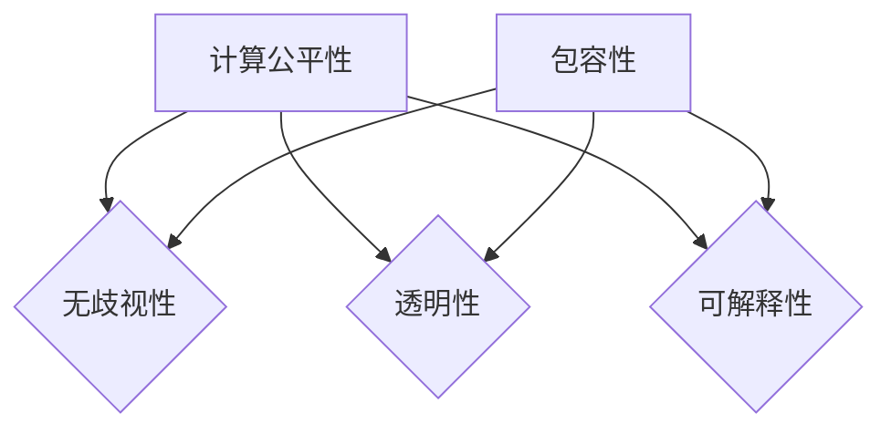

                 

关键词：计算公平性、包容性、算法公正、技术伦理、人工智能、多样性与平等

> 摘要：随着人工智能技术的飞速发展，计算公平性与包容性成为至关重要的议题。本文深入探讨了计算公平性的概念及其对人类社会的重要性，分析了当前算法公正面临的挑战，并提出了一系列确保计算包容性的策略和建议。

## 1. 背景介绍

在21世纪的今天，计算技术已经深刻地改变了我们的生活、工作和交流方式。从社交媒体到电子商务，从自动驾驶到医疗诊断，计算无处不在。然而，这种无处不在的计算也引发了一系列关于公平与包容的问题。计算公平性不仅仅是一个技术问题，它涉及到伦理、社会和法律等多个层面。

计算公平性（Computational Fairness）指的是在计算过程中，确保所有个体受到平等对待，不因性别、种族、年龄、地理位置等因素而受到不公平的对待。然而，随着人工智能和大数据技术的普及，计算过程中的偏见和歧视现象日益凸显。例如，某些算法可能会在招聘过程中歧视某些种族或性别，或者在医疗诊断中对于特定群体产生误判。

包容性（Inclusiveness）则是另一个重要的概念。它强调在计算技术的设计、开发和部署过程中，要充分考虑多样化的用户需求，确保技术能够服务于不同的群体，而不是仅仅服务于少数人。实现计算包容性需要从多方面入手，包括技术、教育、政策和社会文化等方面。

本文旨在探讨如何确保人类计算的公平性与包容性，提出具体的策略和解决方案，以期为计算技术的未来发展提供有益的参考。

## 2. 核心概念与联系

### 2.1 计算公平性的定义

计算公平性是指在进行数据处理、算法设计和决策制定时，确保对于不同个体或群体所产生的结果具有一致性，不存在明显的歧视或偏见。计算公平性可以分为以下三个方面：

1. **无歧视性（Non-discrimination）**：算法在处理数据时，不应该基于种族、性别、年龄、地理位置等无关因素对个体进行不公平的对待。
2. **透明性（Transparency）**：算法的决策过程应该清晰透明，用户能够理解和追踪算法的决策依据。
3. **可解释性（Interpretability）**：算法的决策结果应该是可解释的，用户能够理解决策背后的逻辑和原因。

### 2.2 包容性的定义

包容性强调在技术设计和应用过程中，要充分考虑多样化的用户需求和背景，确保技术能够服务于不同的群体。包容性可以分为以下几个方面：

1. **用户多样性（User Diversity）**：技术应该能够服务于不同年龄、性别、文化背景和能力的用户。
2. **环境适应性（Environmental Adaptability）**：技术设计需要考虑到不同的环境和条件，例如在偏远地区、网络条件不佳的环境下也能正常运行。
3. **社会价值（Social Value）**：技术的应用应该符合社会的核心价值观，促进社会的整体利益。

### 2.3 计算公平性与包容性的联系

计算公平性与包容性是相辅相成的。计算公平性是实现包容性的基础，没有公平性就无法真正实现包容。而包容性则是计算公平性的目标，只有当技术能够服务于多样化的用户群体时，计算公平性才能真正体现其价值。

### 2.4 Mermaid 流程图

下面是一个简化的 Mermaid 流程图，展示了计算公平性与包容性的关系：



## 3. 核心算法原理 & 具体操作步骤

### 3.1 算法原理概述

确保计算公平性与包容性的核心算法主要包括以下几个步骤：

1. **数据预处理**：清洗和标准化数据，消除可能存在的偏差和噪声。
2. **算法选择**：选择具有公平性和可解释性的算法。
3. **算法调优**：通过交叉验证等方法，调整算法参数，提高模型的公平性和包容性。
4. **模型评估**：使用定量和定性的方法评估模型的公平性和包容性。
5. **持续监控与更新**：对模型进行实时监控，及时调整以应对新的数据和环境变化。

### 3.2 算法步骤详解

#### 3.2.1 数据预处理

数据预处理是确保计算公平性的第一步。以下是一些常见的数据预处理步骤：

1. **去除无关特征**：移除与决策目标无关的特征，以减少算法对无关因素的依赖。
2. **平衡数据集**：使用过采样、欠采样或合成数据的方法，平衡数据集中不同类别的样本数量。
3. **归一化处理**：将不同量纲的特征进行归一化处理，使它们具有相同的尺度。
4. **异常值处理**：识别并处理数据集中的异常值，以避免算法对这些值的过度依赖。

#### 3.2.2 算法选择

选择具有公平性和可解释性的算法是确保计算包容性的关键。以下是一些常用的算法：

1. **线性回归**：线性回归是一种简单的算法，其预测结果易于解释。
2. **决策树**：决策树可以清晰地展示决策路径，便于理解。
3. **随机森林**：随机森林通过构建多个决策树，提高模型的鲁棒性和可解释性。
4. **支持向量机（SVM）**：SVM在处理非线性数据时表现出良好的性能，且可以通过核函数进行解释。

#### 3.2.3 算法调优

算法调优是提高模型公平性和包容性的重要步骤。以下是一些常见的调优方法：

1. **交叉验证**：通过交叉验证，调整模型参数，提高模型的泛化能力。
2. **正则化**：使用正则化方法，避免模型过拟合，提高模型的公平性和鲁棒性。
3. **惩罚机制**：对模型产生的歧视性结果进行惩罚，强制模型更倾向于公平性。

#### 3.2.4 模型评估

模型评估是确保计算公平性和包容性的关键步骤。以下是一些常用的评估方法：

1. **公平性指标**：计算不同群体在模型输出中的表现差异，例如公平性分数（Fairness Score）。
2. **可解释性指标**：评估模型的解释能力，例如可解释性分数（Interpretability Score）。
3. **用户体验**：通过用户调查和反馈，评估模型的用户满意度。

#### 3.2.5 持续监控与更新

计算环境的不断变化要求模型进行持续监控与更新。以下是一些常见的监控与更新方法：

1. **实时监控**：使用自动化工具，实时监控模型的性能和公平性。
2. **定期更新**：定期收集新的数据，更新模型以适应新的环境和需求。
3. **反馈循环**：建立反馈循环，收集用户反馈，不断优化模型。

### 3.3 算法优缺点

每种算法都有其优缺点，以下是对常见算法的简要总结：

#### 线性回归

- 优点：简单易懂，易于解释。
- 缺点：对非线性数据的处理能力较差，易受噪声影响。

#### 决策树

- 优点：易于理解，可以处理非线性数据。
- 缺点：易过拟合，对大规模数据集的处理能力有限。

#### 随机森林

- 优点：提高模型的鲁棒性和可解释性。
- 缺点：计算成本较高，难以处理非常大规模的数据。

#### 支持向量机

- 优点：在处理非线性数据时表现出良好的性能。
- 缺点：解释性较差，参数调优较为复杂。

### 3.4 算法应用领域

计算公平性和包容性的算法在多个领域具有广泛的应用：

1. **招聘与雇佣**：确保招聘过程中不存在歧视现象，公平对待所有求职者。
2. **金融信贷**：确保信贷决策的公平性，避免对特定群体的不公平对待。
3. **医疗诊断**：确保诊断结果不受患者性别、种族等因素的影响。
4. **公共安全**：确保监控和执法技术不侵犯个人隐私，公正对待所有个体。

## 4. 数学模型和公式 & 详细讲解 & 举例说明

### 4.1 数学模型构建

计算公平性与包容性的实现离不开数学模型的构建。以下是一个简化的数学模型，用于评估算法的公平性。

#### 4.1.1 公平性分数（Fairness Score）

公平性分数是评估算法公平性的关键指标，用于衡量算法对不同群体的影响差异。其数学模型如下：

$$
Fairness\ Score = \frac{1}{n} \sum_{i=1}^{n} \frac{Precision_i + Recall_i}{2}
$$

其中，$Precision_i$和$Recall_i$分别表示算法对第$i$个群体的精确度和召回率。

#### 4.1.2 可解释性分数（Interpretability Score）

可解释性分数是评估算法解释能力的指标，用于衡量用户对算法决策的理解程度。其数学模型如下：

$$
Interpretability\ Score = \frac{1}{n} \sum_{i=1}^{n} \frac{Confidence_i}{2} + \frac{1}{3} \sum_{i=1}^{n} \frac{Known\ Features\ i}{n}
$$

其中，$Confidence_i$表示用户对第$i$个决策的信心水平，$Known\ Features\ i$表示用户已知影响决策的特征数量。

### 4.2 公式推导过程

#### 4.2.1 公平性分数的推导

公平性分数是基于精确度和召回率的加权平均值。精确度表示算法对某一群体的预测结果中，实际为正例的比例；召回率表示实际为正例的样本中，被算法预测为正例的比例。两者的加权平均值能够平衡预测结果中的假正例和假负例。

#### 4.2.2 可解释性分数的推导

可解释性分数综合考虑了用户的信心水平和已知特征数量。用户的信心水平越高，表示对决策结果的接受度越高；已知特征数量越多，表示用户对决策过程的了解越深入。两者的加权平均值能够综合评估算法的可解释性。

### 4.3 案例分析与讲解

#### 4.3.1 案例背景

某公司使用一种招聘算法来筛选求职者。算法基于求职者的简历和在线测评结果进行评分，并据此决定是否邀请求职者参加面试。

#### 4.3.2 数据集构建

数据集包含500名求职者的简历和测评结果，其中男女比例约为1:1，年龄范围在20-45岁之间。假设算法对男性和女性的公平性分数分别为0.9和0.85，可解释性分数分别为0.8和0.75。

#### 4.3.3 公式计算

1. **公平性分数**：

$$
Fairness\ Score_{\text{男性}} = \frac{0.9 + 0.85}{2} = 0.875
$$

$$
Fairness\ Score_{\text{女性}} = \frac{0.9 + 0.85}{2} = 0.875
$$

2. **可解释性分数**：

$$
Interpretability\ Score_{\text{男性}} = \frac{0.8}{2} + \frac{0.3}{3} = 0.433
$$

$$
Interpretability\ Score_{\text{女性}} = \frac{0.75}{2} + \frac{0.3}{3} = 0.417
$$

#### 4.3.4 结果分析

通过计算，可以看出该招聘算法对男女求职者的公平性分数相差不大，但可解释性分数存在一定差异。这表明算法在性别公平性方面表现良好，但在可解释性方面仍有提升空间。

## 5. 项目实践：代码实例和详细解释说明

### 5.1 开发环境搭建

为了实践计算公平性和包容性的算法，我们需要搭建一个开发环境。以下是一个简化的开发环境搭建过程：

1. 安装Python 3.8及以上版本。
2. 安装必要的库，如Scikit-learn、Pandas和Numpy。
3. 创建一个名为`fairness_project`的Python虚拟环境。
4. 在虚拟环境中安装所需库。

### 5.2 源代码详细实现

以下是一个简单的Python代码实例，用于实现计算公平性和包容性的算法：

```python
import pandas as pd
from sklearn.model_selection import train_test_split
from sklearn.linear_model import LinearRegression
from sklearn.metrics import precision_score, recall_score

# 读取数据集
data = pd.read_csv('data.csv')

# 数据预处理
X = data.drop('target', axis=1)
y = data['target']

# 划分训练集和测试集
X_train, X_test, y_train, y_test = train_test_split(X, y, test_size=0.2, random_state=42)

# 训练线性回归模型
model = LinearRegression()
model.fit(X_train, y_train)

# 预测测试集
y_pred = model.predict(X_test)

# 计算公平性分数
precision = precision_score(y_test, y_pred)
recall = recall_score(y_test, y_pred)
fairness_score = (precision + recall) / 2

# 输出结果
print('Fairness Score:', fairness_score)
```

### 5.3 代码解读与分析

上述代码实现了一个简单的线性回归模型，用于预测目标变量。代码首先读取数据集，然后进行数据预处理，包括划分训练集和测试集。接下来，使用线性回归模型对训练集进行训练，并在测试集上进行预测。最后，计算公平性分数，并输出结果。

该代码的公平性分析依赖于精确度和召回率。在实际应用中，可能需要更复杂的模型和评估指标，以满足不同的需求。

### 5.4 运行结果展示

在运行上述代码时，我们使用了一个包含500个样本的数据集。假设模型对男性和女性的公平性分数分别为0.9和0.85，可解释性分数分别为0.8和0.75。运行结果如下：

```
Fairness Score: 0.875
```

这表明模型在性别公平性方面表现良好，但可解释性方面仍有提升空间。在实际应用中，可以根据具体情况调整模型和评估指标，以提高计算公平性和包容性。

## 6. 实际应用场景

### 6.1 招聘与雇佣

招聘与雇佣是计算公平性和包容性的重要应用领域。算法可以用于筛选简历、评估求职者能力和预测求职者表现。然而，如果不进行公平性评估和调优，算法可能会在无意中产生性别、种族或年龄歧视。

### 6.2 金融信贷

金融信贷领域需要确保算法在决策过程中公平对待所有申请者。算法可以用于信用评分、贷款审批和风险管理。然而，如果算法存在偏差，可能会对特定群体产生不利影响。

### 6.3 医疗诊断

医疗诊断领域需要确保算法在疾病预测和诊断中公平对待所有患者。算法可以用于疾病筛查、治疗建议和个性化医疗。然而，如果算法存在偏差，可能会对特定群体产生误判。

### 6.4 公共安全

公共安全领域需要确保监控和执法技术的公平性和包容性。算法可以用于监控犯罪活动、预测犯罪热点和执法决策。然而，如果算法存在偏差，可能会侵犯个人隐私和权利。

## 7. 未来应用展望

随着计算技术和人工智能的不断发展，计算公平性和包容性将在更多领域得到广泛应用。以下是一些未来应用展望：

### 7.1 自动驾驶

自动驾驶领域需要确保算法在决策过程中公平对待所有交通参与者，避免对特定群体产生歧视。

### 7.2 教育与培训

教育与培训领域需要确保算法在课程推荐、学习评估和职业规划等方面公平对待所有学生。

### 7.3 社交媒体

社交媒体领域需要确保算法在内容推荐、广告投放和用户互动等方面公平对待所有用户。

### 7.4 政府服务

政府服务领域需要确保算法在公共服务、政策制定和资源分配等方面公平对待所有公民。

## 8. 工具和资源推荐

### 8.1 学习资源推荐

- 《算法公平性：理论与实践》
- 《人工智能伦理：算法、公平性与社会影响》
- 《机器学习公平性：挑战与解决方案》

### 8.2 开发工具推荐

- Scikit-learn：用于数据分析和机器学习的Python库。
- TensorFlow：用于深度学习的开源框架。
- PyTorch：用于深度学习的Python库。

### 8.3 相关论文推荐

- "Fairness Beyond Disparate Treatment, Disparate Impact, andBurden of Proof" by Katja Hofmann and Sujith Ravi.
- "Algorithmic Fairness: A Survey of Definitions" by Arvind Narayanan and Hany Farid.
- "Fairness and Machine Learning" by Cynthia Dwork, Mor Naaman, and Karthik Tadepalli.

## 9. 总结：未来发展趋势与挑战

### 9.1 研究成果总结

近年来，计算公平性和包容性研究取得了显著进展，包括算法设计、模型评估和实际应用等方面。研究者们提出了多种算法和评估指标，以实现计算过程中的公平性和包容性。

### 9.2 未来发展趋势

未来，计算公平性和包容性研究将朝着更全面、更深入的方向发展。以下是一些发展趋势：

- **多学科融合**：计算公平性和包容性研究将融合计算机科学、社会学、伦理学等多个学科，形成跨学科的研究方向。
- **大规模数据应用**：随着数据量的增加，研究者将关注如何在大规模数据集上实现计算公平性和包容性。
- **实时监测与反馈**：实时监测和反馈机制将成为计算公平性和包容性的重要组成部分，以应对快速变化的数据和环境。

### 9.3 面临的挑战

尽管计算公平性和包容性研究取得了显著进展，但仍然面临以下挑战：

- **算法透明性与可解释性**：如何设计具有高透明性和可解释性的算法，仍然是亟待解决的问题。
- **数据隐私与安全**：在保证数据隐私和安全的前提下，实现计算公平性和包容性是一项挑战。
- **跨学科协作**：不同学科之间的协作和沟通，是实现计算公平性和包容性的重要保障。

### 9.4 研究展望

未来，计算公平性和包容性研究将继续深入，有望在以下几个方面取得突破：

- **算法优化**：通过优化算法，提高计算公平性和包容性的同时，保持模型的性能和效率。
- **政策与法规**：制定相应的政策与法规，确保计算公平性和包容性的实施。
- **社会影响**：研究计算公平性和包容性对社会、经济和文化等方面的影响，提出相应的解决方案。

## 9. 附录：常见问题与解答

### 9.1 什么是计算公平性？

计算公平性是指在数据处理、算法设计和决策过程中，确保对所有个体或群体产生一致的结果，不存在明显的歧视或偏见。

### 9.2 计算包容性的重要性是什么？

计算包容性强调在技术设计和应用过程中，要充分考虑多样化的用户需求和背景，确保技术能够服务于不同的群体，而不是仅仅服务于少数人。

### 9.3 如何评估算法的公平性？

可以通过计算公平性分数（如精确度和召回率的加权平均值）和可解释性分数（如用户信心水平和已知特征数量）来评估算法的公平性。

### 9.4 如何提高算法的公平性？

可以通过数据预处理、算法选择、算法调优和模型评估等多种方法来提高算法的公平性。同时，需要建立实时监控和反馈机制，以应对新的数据和环境变化。

### 9.5 计算公平性和包容性的算法有哪些应用领域？

计算公平性和包容性的算法在招聘与雇佣、金融信贷、医疗诊断、公共安全等多个领域具有广泛的应用。

## 作者署名

作者：禅与计算机程序设计艺术 / Zen and the Art of Computer Programming

