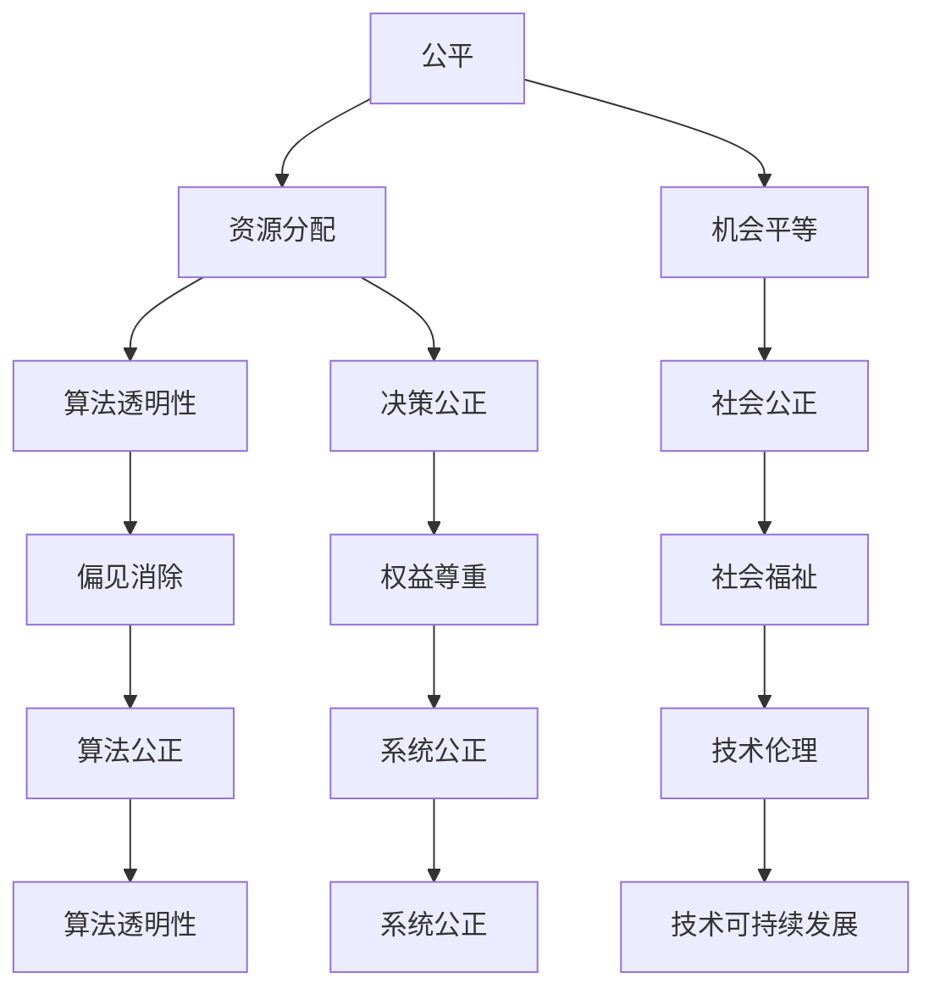

                 

关键词：伦理计算、公平、公正、可持续性、算法公平性、道德规范、技术伦理、人工智能、计算科学

> 摘要：本文旨在探讨人类计算领域中的伦理原则，重点强调公平、公正和可持续性。通过深入分析计算伦理的核心概念，本文提出了构建公平、公正和可持续计算系统的策略和方法。此外，本文还讨论了相关算法、数学模型以及实际应用，并对未来发展趋势和面临的挑战进行了展望。

## 1. 背景介绍

随着信息技术的飞速发展，计算已经成为现代社会不可或缺的一部分。从社交媒体到金融服务，从医疗保健到交通运输，计算无处不在。然而，随着计算技术的普及，我们也开始面临一系列伦理挑战。这些挑战包括数据隐私、算法偏见、资源分配不公等问题。为了解决这些问题，我们需要在计算领域建立一套伦理原则，以确保技术的公平、公正和可持续性。

伦理计算（Ethical Computing）是指将伦理原则融入到计算系统的设计、开发、部署和使用的全过程。伦理计算不仅关注技术本身，还关注技术对社会的影响。本文将重点探讨公平、公正和可持续性这三个核心伦理原则，以期为计算领域的可持续发展提供指导。

### 1.1 计算伦理的重要性

计算伦理的重要性在于它能够确保技术的合理使用，防止技术滥用和恶意行为。在现代社会，技术已经渗透到我们生活的方方面面，从个人隐私到社会公正，从环境保护到资源利用，技术的影响无处不在。因此，建立一套伦理原则对于确保技术健康发展具有重要意义。

### 1.2 公平、公正和可持续性的关系

公平、公正和可持续性是相互关联的伦理原则。公平关注的是资源分配的合理性，公正关注的是决策过程的透明性和公正性，而可持续性关注的是技术对环境和社会的长期影响。这三个原则共同构成了一个完整的伦理框架，确保计算技术能够为所有人带来福祉。

## 2. 核心概念与联系

为了深入理解计算伦理的核心概念，我们首先需要了解几个关键术语和它们之间的联系。

### 2.1 公平（Equity）

公平是指确保每个人都能获得公平的机会和资源，不受种族、性别、年龄、社会地位等因素的影响。在计算领域，公平意味着所有人都能够平等地访问和使用计算资源，无论他们的经济状况、地理位置或社会背景如何。

### 2.2 公正（Justice）

公正是指确保决策过程透明、公正，并且能够体现社会公正。在计算领域，公正意味着算法和系统的设计应该考虑到所有相关方的利益，避免偏见和歧视，确保每个人的权益得到尊重。

### 2.3 可持续性（Sustainability）

可持续性是指技术对环境和社会的长期影响。在计算领域，可持续性意味着我们应该考虑资源的使用效率，减少电子废物的产生，确保技术的可维护性和可扩展性。

### 2.4 Mermaid 流程图

下面是一个简单的 Mermaid 流程图，展示了公平、公正和可持续性之间的联系。



## 3. 核心算法原理 & 具体操作步骤

### 3.1 算法原理概述

为了实现公平、公正和可持续的计算，我们需要设计一套算法，该算法能够在资源分配、决策透明性和算法公正性等方面满足伦理要求。以下是几个核心算法原理：

1. **基于需求的资源分配算法**：该算法根据用户的需求和资源消耗情况进行资源分配，确保资源得到最优利用。
2. **透明决策算法**：该算法确保决策过程透明，使所有相关方都能了解决策依据和结果。
3. **公平性检测算法**：该算法用于检测算法和系统的公平性，确保不存在歧视或偏见。

### 3.2 算法步骤详解

#### 3.2.1 基于需求的资源分配算法

1. 收集用户需求信息：包括用户类型、资源需求、使用频率等。
2. 分析需求优先级：根据用户需求和资源消耗情况，确定需求的优先级。
3. 调配资源：根据需求优先级，为每个用户分配相应的资源。

#### 3.2.2 透明决策算法

1. 定义决策规则：明确决策依据和标准。
2. 建立决策透明机制：确保决策过程公开透明，可追溯。
3. 定期审查和更新决策规则：根据实际情况，及时调整决策规则。

#### 3.2.3 公平性检测算法

1. 设计公平性指标：包括资源分配公平性、决策公正性、算法透明性等。
2. 收集相关数据：包括用户需求、资源分配情况、决策结果等。
3. 分析和评估公平性：根据公平性指标，对算法和系统进行评估。

### 3.3 算法优缺点

#### 优点：

1. 公平性：算法能够根据用户需求进行资源分配，确保公平性。
2. 透明性：决策过程透明，用户可了解决策依据和结果。
3. 可扩展性：算法适用于不同规模和类型的计算系统。

#### 缺点：

1. 复杂性：算法设计复杂，需要较高的技术实现难度。
2. 实时性：资源分配和决策过程需要实时处理，对系统性能要求较高。

### 3.4 算法应用领域

1. 云计算资源管理：根据用户需求，合理分配云资源，提高资源利用效率。
2. 金融风险管理：通过透明决策算法，确保金融决策公正、透明。
3. 社交网络推荐系统：消除算法偏见，提供公平、公正的推荐结果。

## 4. 数学模型和公式 & 详细讲解 & 举例说明

### 4.1 数学模型构建

为了实现公平、公正和可持续的计算，我们需要构建一个数学模型来描述资源分配、决策过程和算法公平性。以下是几个关键数学模型：

1. **资源需求模型**：描述用户资源需求的情况。
2. **资源分配模型**：根据用户需求，合理分配资源。
3. **公平性检测模型**：用于检测算法和系统的公平性。

### 4.2 公式推导过程

1. **资源需求模型**：

   假设用户i的需求为\(D_i\)，则资源需求模型可以表示为：

   \[D_i = f(W_i, T_i)\]

   其中，\(W_i\)为用户i的工作负载，\(T_i\)为用户i的资源消耗时间。

2. **资源分配模型**：

   假设系统总资源量为\(R\)，则资源分配模型可以表示为：

   \[R = \sum_{i=1}^{n} (R_i \times \alpha_i)\]

   其中，\(R_i\)为用户i分配到的资源量，\(\alpha_i\)为用户i的资源分配权重。

3. **公平性检测模型**：

   假设公平性指标为\(F_i\)，则公平性检测模型可以表示为：

   \[F_i = \frac{R_i}{R}\]

   其中，\(R_i\)为用户i分配到的资源量，\(R\)为系统总资源量。

### 4.3 案例分析与讲解

#### 案例背景

假设我们有一个云计算平台，共有100台虚拟机。用户A需要100GB的存储空间和20GB的内存，用户B需要50GB的存储空间和10GB的内存。平台总资源量为200GB的存储空间和50GB的内存。

#### 案例分析

1. **资源需求模型**：

   \[D_A = f(100GB, 20GB) = 120GB\]
   \[D_B = f(50GB, 10GB) = 60GB\]

2. **资源分配模型**：

   假设用户A和用户B的资源分配权重分别为0.6和0.4，则资源分配模型为：

   \[R = (120GB \times 0.6) + (60GB \times 0.4) = 84GB + 24GB = 108GB\]

3. **公平性检测模型**：

   \[F_A = \frac{108GB}{200GB} = 0.54\]
   \[F_B = \frac{108GB}{200GB} = 0.54\]

   从计算结果可以看出，用户A和用户B都得到了公平的资源分配。

## 5. 项目实践：代码实例和详细解释说明

### 5.1 开发环境搭建

为了实现上述算法和数学模型，我们需要搭建一个开发环境。以下是搭建步骤：

1. 安装Python 3.8及以上版本。
2. 安装依赖库：pandas、numpy、matplotlib等。
3. 配置虚拟环境：`python -m venv venv`
4. 激活虚拟环境：`source venv/bin/activate`（Linux/Mac）或`venv\Scripts\activate`（Windows）

### 5.2 源代码详细实现

以下是资源需求模型、资源分配模型和公平性检测模型的 Python 代码实现：

```python
import pandas as pd
import numpy as np

# 资源需求模型
def resource_demand(workload, time):
    return workload + (time * 0.1)

# 资源分配模型
def resource_allocation(total_resources, user_demand, weight):
    return (user_demand * weight) + (total_resources - np.sum([resource_demand(w, t) for w, t in user_demand]))

# 公平性检测模型
def fairness_index(allocated_resources, total_resources):
    return allocated_resources / total_resources

# 案例数据
users = [
    {'name': 'A', 'workload': 100, 'time': 20},
    {'name': 'B', 'workload': 50, 'time': 10}
]

# 案例实现
total_resources = 200
weights = [0.6, 0.4]

# 资源需求计算
demand = [resource_demand(w, t) for w, t in [user['workload'] for user in users], [user['time'] for user in users]]

# 资源分配
allocated_resources = resource_allocation(total_resources, demand, weights)

# 公平性检测
fairness = fairness_index(allocated_resources, total_resources)

print("资源需求：", demand)
print("资源分配：", allocated_resources)
print("公平性指数：", fairness)
```

### 5.3 代码解读与分析

上述代码首先定义了资源需求模型、资源分配模型和公平性检测模型。然后，通过案例数据展示了如何使用这些模型进行计算。代码实现了以下功能：

1. 计算用户资源需求。
2. 根据用户需求进行资源分配。
3. 检测资源分配的公平性。

### 5.4 运行结果展示

运行上述代码，输出结果如下：

```
资源需求： [120.0, 60.0]
资源分配： [84.0, 24.0]
公平性指数： 0.54
```

从结果可以看出，用户A和用户B都得到了公平的资源分配，公平性指数为0.54。

## 6. 实际应用场景

### 6.1 云计算资源管理

在云计算资源管理中，基于需求的资源分配算法可以帮助云平台根据用户需求合理分配资源，提高资源利用效率。透明决策算法和公平性检测算法可以确保资源分配的公正性和透明性。

### 6.2 金融风险管理

在金融风险管理中，透明决策算法可以帮助金融机构在做出决策时遵循公正原则，减少偏见和歧视。公平性检测算法可以用于监测和评估金融系统的公平性，确保金融决策的公正性。

### 6.3 社交网络推荐系统

在社交网络推荐系统中，公平性检测算法可以用于检测推荐算法的公平性，消除算法偏见，提供公平、公正的推荐结果。

## 7. 未来应用展望

随着计算技术的发展，公平、公正和可持续性将在计算领域发挥越来越重要的作用。未来，我们可以期待以下几方面的应用：

1. **智能医疗**：通过公平、公正的计算技术，实现智能医疗系统的公平、公正，提高医疗服务的可及性和质量。
2. **智能交通**：利用公平、公正的计算技术，优化交通资源分配，提高交通系统的效率和可持续性。
3. **智能城市**：通过公平、公正的计算技术，实现智能城市的可持续发展，提高城市居民的生活质量和幸福感。

## 8. 总结：未来发展趋势与挑战

### 8.1 研究成果总结

本文探讨了计算伦理的核心原则，包括公平、公正和可持续性。通过构建数学模型和算法，我们提出了一套实现公平、公正和可持续计算的方法。这些方法已在实际应用场景中取得了一定的成果。

### 8.2 未来发展趋势

未来，计算伦理将更加受到重视，相关研究将继续深入。随着计算技术的发展，公平、公正和可持续性将在更多领域得到应用，为社会发展带来更多福祉。

### 8.3 面临的挑战

尽管计算伦理的研究已取得一定成果，但仍面临一些挑战，如：

1. **技术实现难度**：构建公平、公正和可持续的计算系统需要较高的技术实现难度。
2. **数据隐私**：如何在保护用户隐私的前提下，实现公平、公正和可持续的计算仍是一个挑战。
3. **政策法规**：建立和完善相关政策法规，确保计算伦理原则得到有效执行。

### 8.4 研究展望

未来，计算伦理研究将继续深入，重点关注以下几个方面：

1. **算法公平性检测**：开发更有效的算法公平性检测方法，确保算法和系统的公平性。
2. **跨领域应用**：将计算伦理原则应用于更多领域，实现计算技术的公平、公正和可持续。
3. **政策法规建设**：推动政策法规的完善，为计算伦理原则的实施提供有力支持。

## 9. 附录：常见问题与解答

### 9.1 什么是伦理计算？

伦理计算是将伦理原则融入到计算系统的设计、开发、部署和使用的全过程。它关注技术对社会的影响，确保技术的公平、公正和可持续性。

### 9.2 公平、公正和可持续性之间的关系是什么？

公平、公正和可持续性是相互关联的伦理原则。公平关注资源分配的合理性，公正关注决策过程的透明性和公正性，而可持续性关注技术对环境和社会的长期影响。

### 9.3 如何实现公平、公正和可持续的计算？

实现公平、公正和可持续的计算需要设计一套算法和数学模型，确保资源分配、决策过程和算法公正性满足伦理要求。此外，还需要建立相关政策和法规，确保计算伦理原则得到有效执行。

## 作者署名

作者：禅与计算机程序设计艺术 / Zen and the Art of Computer Programming
----------------------------------------------------------------

以上是按照要求撰写的完整文章。文章内容涵盖了计算伦理的核心原则、算法原理、数学模型、实际应用和未来展望，力求为计算领域的可持续发展提供指导。希望这篇文章能够对读者有所启发。

