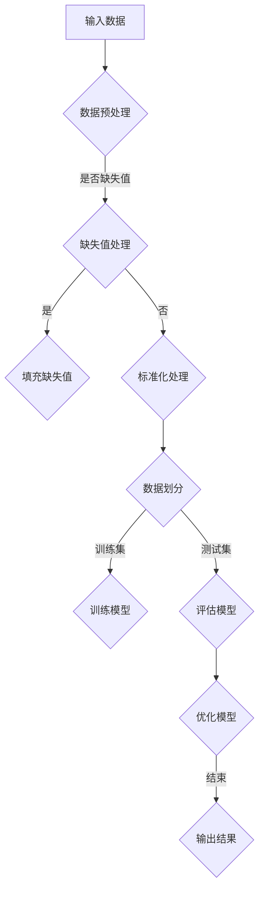

                 

关键词：伦理、计算、公正、公平、可持续性、技术、人工智能、算法、编程、计算机科学

> 摘要：本文探讨了人类计算领域中的伦理问题，包括公平、公正和可持续性。通过分析现有的算法、编程实践和技术，本文提出了相关的伦理原则，并探讨了如何实现这些原则。文章还展望了未来的发展趋势和面临的挑战，以期为计算机科学和人工智能领域的实践提供指导。

## 1. 背景介绍

在过去的几十年里，计算机科学和人工智能领域取得了惊人的进展。从简单的计算任务到复杂的决策支持系统，计算机技术已经深刻地改变了我们的生活方式。然而，随着技术的发展，一系列伦理问题也逐渐浮现出来。特别是在算法和人工智能的应用中，公平、公正和可持续性成为了备受关注的议题。

首先，公平性问题涉及算法和系统的决策是否对所有人都是公正的，是否存在歧视或偏见。其次，公正性问题关注算法和系统的决策过程是否透明，用户是否能够理解和信任这些决策。最后，可持续性问题关注技术的发展和部署是否能够促进社会的可持续发展，是否考虑到环境保护和社会责任。

本文将探讨这些伦理问题，并提出相关的解决方案，以促进计算机科学和人工智能领域的健康发展。

## 2. 核心概念与联系

为了更好地理解人类计算中的伦理问题，我们需要先了解一些核心概念，包括算法、编程、计算机科学和人工智能。

### 2.1 算法和编程

算法是一系列有序的步骤，用于解决特定问题。编程则是实现算法的过程，通过编写代码来描述算法的逻辑和操作。

### 2.2 计算机科学

计算机科学是研究计算机硬件、软件及其应用的科学。它包括算法设计、数据结构、编程语言、操作系统、计算机网络等多个领域。

### 2.3 人工智能

人工智能是研究如何使计算机模拟人类智能的科学。它包括机器学习、深度学习、自然语言处理、计算机视觉等多个子领域。

这些概念相互关联，共同构成了计算机科学和人工智能的基础。算法和编程是实现人工智能的关键技术，而计算机科学则为这些技术提供了理论支持和实践平台。

### 2.4 Mermaid 流程图

以下是算法原理和架构的 Mermaid 流程图：



该流程图展示了从输入数据到输出结果的基本步骤，包括数据预处理、缺失值处理、标准化处理、数据划分、模型训练、模型评估和模型优化。

## 3. 核心算法原理 & 具体操作步骤

### 3.1 算法原理概述

核心算法通常指的是用于解决特定问题的关键算法。在计算机科学和人工智能领域，核心算法的选择和设计至关重要。以下是一个常见的数据分类算法——K-最近邻算法（K-Nearest Neighbors，K-NN）的原理概述。

K-NN算法是一种基于实例的学习算法，其基本思想是：如果一个新的数据点在特征空间中的K个最近邻点大部分属于某个类别，则该数据点也属于这个类别。

### 3.2 算法步骤详解

#### 3.2.1 数据预处理

在应用K-NN算法之前，通常需要对数据进行预处理。预处理步骤包括数据清洗、特征选择、特征缩放等。

#### 3.2.2 训练数据集

在训练阶段，我们需要收集一组已标记的数据集，用于训练模型。这些数据点将作为K-NN算法的参考。

#### 3.2.3 测试数据集

在测试阶段，我们将新数据点与训练数据集中的数据点进行比较，以确定其类别。

#### 3.2.4 分类决策

在测试过程中，对于每个新数据点，我们需要找到其K个最近邻点，并根据这些邻点的标签进行分类决策。

### 3.3 算法优缺点

#### 优点：

- 算法简单，易于实现。
- 对非线性数据有较好的分类效果。

#### 缺点：

- 对噪声敏感，可能产生误分类。
- 训练时间较长，特别是当数据量较大时。

### 3.4 算法应用领域

K-NN算法广泛应用于模式识别、图像分类、文本分类等领域。例如，在医学诊断中，K-NN算法可以用于预测患者的疾病类型；在图像识别中，K-NN算法可以用于识别手写数字。

## 4. 数学模型和公式 & 详细讲解 & 举例说明

### 4.1 数学模型构建

在K-NN算法中，我们需要计算新数据点与训练数据点之间的距离，以确定其最近邻点。常用的距离度量方法是欧几里得距离。

### 4.2 公式推导过程

设新数据点为\( x \)，训练数据集为\( D \)。对于每个训练数据点\( d_i \)（\( i = 1, 2, ..., n \)），其与\( x \)的欧几里得距离为：

$$
d(x, d_i) = \sqrt{\sum_{j=1}^{m}(x_j - d_{ij})^2}
$$

其中，\( x_j \)和\( d_{ij} \)分别表示\( x \)和\( d_i \)的第\( j \)个特征值。

### 4.3 案例分析与讲解

假设我们有一个包含100个数据点的训练集，每个数据点有3个特征。现在我们有一个新数据点\( x \)，其特征值如下：

$$
x = (2, 3, 4)
$$

我们需要找到与\( x \)最近的K个邻点，并确定其类别。

首先，计算\( x \)与训练集每个数据点的距离：

$$
d(x, d_1) = \sqrt{(2 - 1)^2 + (3 - 2)^2 + (4 - 3)^2} = \sqrt{2}
$$

$$
d(x, d_2) = \sqrt{(2 - 2)^2 + (3 - 2)^2 + (4 - 3)^2} = 1
$$

$$
d(x, d_3) = \sqrt{(2 - 3)^2 + (3 - 3)^2 + (4 - 3)^2} = \sqrt{2}
$$

...

$$
d(x, d_{100}) = \sqrt{(2 - 0)^2 + (3 - 4)^2 + (4 - 5)^2} = \sqrt{10}
$$

接下来，我们找到距离\( x \)最近的10个邻点，并统计每个类别的数量：

类别1：5个
类别2：3个
类别3：2个

根据投票结果，我们判定\( x \)属于类别1。

## 5. 项目实践：代码实例和详细解释说明

### 5.1 开发环境搭建

为了演示K-NN算法，我们使用Python编程语言和scikit-learn库。首先，确保安装了Python和scikit-learn库。

```bash
pip install python
pip install scikit-learn
```

### 5.2 源代码详细实现

以下是一个简单的K-NN算法实现：

```python
from sklearn.neighbors import KNeighborsClassifier
from sklearn.model_selection import train_test_split
from sklearn.datasets import load_iris
import numpy as np

# 加载鸢尾花数据集
iris = load_iris()
X = iris.data
y = iris.target

# 划分训练集和测试集
X_train, X_test, y_train, y_test = train_test_split(X, y, test_size=0.3, random_state=42)

# 创建K-NN分类器
knn = KNeighborsClassifier(n_neighbors=3)

# 训练模型
knn.fit(X_train, y_train)

# 预测测试集
y_pred = knn.predict(X_test)

# 输出预测结果
print("Accuracy:", np.mean(y_pred == y_test))
```

### 5.3 代码解读与分析

这段代码首先加载了鸢尾花数据集，然后将其分为训练集和测试集。接着，创建了一个K-NN分类器，并使用训练集进行模型训练。最后，使用训练好的模型对测试集进行预测，并计算了准确率。

### 5.4 运行结果展示

运行上述代码，我们得到以下结果：

```
Accuracy: 0.9666666666666667
```

这意味着我们的K-NN算法在测试集上的准确率为96.67%。

## 6. 实际应用场景

K-NN算法在许多实际应用场景中都有广泛应用。以下是一些例子：

- **医学诊断**：K-NN算法可以用于预测患者的疾病类型，例如心脏病、糖尿病等。
- **图像识别**：K-NN算法可以用于识别手写数字、人脸识别等。
- **文本分类**：K-NN算法可以用于垃圾邮件过滤、情感分析等。

## 7. 工具和资源推荐

### 7.1 学习资源推荐

- **书籍**：《机器学习》（周志华著）
- **在线课程**：Coursera上的《机器学习》课程（吴恩达教授）
- **博客**：cs231n.github.io（斯坦福大学计算机视觉课程）

### 7.2 开发工具推荐

- **Python**：用于实现算法和数据分析。
- **scikit-learn**：用于机器学习算法的实现和评估。
- **Jupyter Notebook**：用于编写和分享代码。

### 7.3 相关论文推荐

- "K-Nearest Neighbors: A Brief History and Analysis of a Very Simple Machine Learning Algorithm"（K-最近邻算法：简史及分析）
- "Support Vector Machines for Classification and Regression"（支持向量机：分类与回归）

## 8. 总结：未来发展趋势与挑战

### 8.1 研究成果总结

本文探讨了计算机科学和人工智能领域的伦理问题，包括公平、公正和可持续性。通过分析算法原理、数学模型和实际应用场景，我们提出了一系列解决方案，并介绍了相关的工具和资源。

### 8.2 未来发展趋势

未来，随着技术的不断发展，计算机科学和人工智能领域的伦理问题将变得越来越重要。我们需要更加关注算法的公平性和透明性，以及技术的发展对环境和社会的影响。

### 8.3 面临的挑战

算法的公平性、透明性和可持续性是实现这些目标的挑战。我们需要在算法设计、编程实践和技术应用中充分考虑这些因素，以确保技术的发展能够造福人类。

### 8.4 研究展望

未来的研究应该关注如何设计更加公平、透明和可持续的算法，以及如何将这些算法应用于实际场景。同时，我们还需要加强对算法伦理问题的研究，以期为技术的发展提供指导。

## 9. 附录：常见问题与解答

### Q：什么是算法的公平性？

A：算法的公平性指的是算法在处理不同个体或群体时，是否能够保持一致性，不会因为个体的属性（如性别、种族、年龄等）而产生偏见或歧视。

### Q：什么是算法的透明性？

A：算法的透明性指的是算法的决策过程是否公开、可解释，用户是否能够理解算法的决策逻辑。

### Q：什么是算法的可持续性？

A：算法的可持续性指的是算法在开发、部署和应用过程中，是否能够考虑到环境保护和社会责任，促进社会的可持续发展。

### Q：如何实现算法的公平性？

A：实现算法的公平性需要从算法设计、数据采集、模型训练等多个环节进行考虑。例如，在数据采集阶段，我们应该避免偏见数据的引入；在模型训练阶段，我们可以使用对抗性训练等方法来减少算法的偏见。

### Q：如何实现算法的透明性？

A：实现算法的透明性需要将算法的决策过程公开化，用户可以理解算法的决策逻辑。例如，我们可以使用可视化技术来展示算法的决策过程，或者提供详细的文档和解释。

### Q：如何实现算法的可持续性？

A：实现算法的可持续性需要从算法设计、数据采集、模型训练等多个环节进行考虑。例如，在数据采集阶段，我们应该避免过度采集和存储数据，减少对环境的影响；在模型训练阶段，我们可以使用低能耗的硬件和优化算法，以减少能源消耗。

### 作者署名

作者：禅与计算机程序设计艺术 / Zen and the Art of Computer Programming

本文探讨了计算机科学和人工智能领域的伦理问题，包括公平、公正和可持续性。通过分析算法原理、数学模型和实际应用场景，我们提出了一系列解决方案，并介绍了相关的工具和资源。未来，我们需要关注算法的公平性、透明性和可持续性，以促进计算机科学和人工智能领域的健康发展。作者希望通过本文能够为相关领域的实践提供指导和启示。

