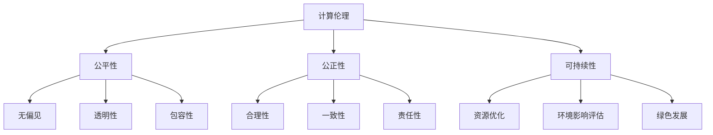

                 

 关键词：计算伦理、人工智能、可持续性、公平、公正、道德规范

> 摘要：本文探讨了人类计算领域中的伦理原则，特别是在人工智能时代，公平、公正和可持续性的重要性日益凸显。通过分析当前的计算伦理问题，本文提出了具体的解决方案，并探讨了这些原则在未来计算技术发展中的潜在影响。

## 1. 背景介绍

随着科技的飞速发展，人类计算能力取得了显著的进步。尤其是人工智能（AI）的兴起，使得计算技术开始渗透到我们生活的方方面面。然而，这些进步也带来了新的伦理挑战，如数据隐私、算法偏见、责任归属等问题。因此，确保计算过程的公平、公正和可持续性成为了一个紧迫的议题。

### 1.1 计算伦理的重要性

计算伦理是指在设计和应用计算技术时，考虑其对社会、环境和个体的影响，并确保其符合道德原则。一个公平、公正和可持续的计算体系，不仅能够促进技术的健康发展，还能够增强公众对技术的信任和接受度。

### 1.2 公平与公正

公平和公正是计算伦理中的核心概念。公平指的是所有人都有平等的机会和资源，不受性别、种族、年龄等因素的影响。公正则涉及到决策的透明性和合理性，确保所有人都能得到公正对待。

### 1.3 可持续性

可持续性关注的是计算技术对环境的影响，以及如何通过优化资源利用和减少浪费来降低计算技术的环境影响。在人工智能时代，可持续性尤为重要，因为大规模的AI模型训练需要大量的计算资源和能源。

## 2. 核心概念与联系

### 2.1 公平性

公平性是指在计算技术的设计和应用过程中，确保所有的个体和群体都能平等地享受技术的益处。一个公平的计算体系应该具备以下特点：

- **无偏见**：算法和系统不应该对特定的群体产生偏见。
- **透明性**：决策过程应该是透明的，以便公众监督和参与。
- **包容性**：技术设计应该考虑到不同群体的需求和特点。

### 2.2 公正性

公正性是指在计算技术的设计和应用过程中，确保所有的个体和群体都能得到公正的对待。一个公正的计算体系应该具备以下特点：

- **合理性**：决策应该基于充分的理由和证据。
- **一致性**：算法和系统的处理方式应该在不同情况下保持一致。
- **责任性**：对于计算技术的错误和不当行为，应该有明确的责任归属。

### 2.3 可持续性

可持续性是指在计算技术的设计和应用过程中，确保技术对环境的影响最小化。一个可持续的计算体系应该具备以下特点：

- **资源优化**：通过优化计算资源的利用，减少浪费。
- **环境影响评估**：在技术设计和应用前，对可能的环境影响进行评估。
- **绿色发展**：推动计算技术的绿色发展和环保理念。

### 2.4 Mermaid 流程图



## 3. 核心算法原理 & 具体操作步骤

### 3.1 算法原理概述

为了实现计算伦理中的公平、公正和可持续性，我们需要设计一系列算法和策略。以下是一些核心算法的原理概述：

- **公平性算法**：通过数据清洗、特征工程和算法优化，减少算法偏见。
- **公正性算法**：通过透明性设计、责任机制和监管措施，确保决策的公正性。
- **可持续性算法**：通过资源优化、能源效率和绿色计算技术，减少计算的环境影响。

### 3.2 算法步骤详解

#### 3.2.1 公平性算法

1. 数据预处理：清洗数据，去除噪声和偏差。
2. 特征选择：选择能够代表个体特征的变量。
3. 算法优化：调整算法参数，减少偏见。

#### 3.2.2 公正性算法

1. 透明性设计：公开算法和系统的决策过程。
2. 责任机制：建立责任归属和问责机制。
3. 监管措施：引入第三方监管，确保公正性。

#### 3.2.3 可持续性算法

1. 资源优化：通过并行计算、分布式存储等方式，提高资源利用效率。
2. 能源效率：采用绿色能源和节能技术，减少能源消耗。
3. 绿色计算：推广绿色计算理念，减少计算对环境的影响。

### 3.3 算法优缺点

- **公平性算法**：优点是能够减少算法偏见，提高公平性；缺点是可能降低算法的准确性和效率。
- **公正性算法**：优点是能够确保决策的公正性和透明性；缺点是可能增加系统的复杂性和成本。
- **可持续性算法**：优点是能够减少计算对环境的影响，提高可持续性；缺点是可能增加计算的成本和复杂性。

### 3.4 算法应用领域

- **公平性算法**：应用于招聘、贷款、医疗等领域，以减少偏见和不公平。
- **公正性算法**：应用于政府决策、法律系统、金融领域，以确保决策的公正性。
- **可持续性算法**：应用于数据中心、云计算、物联网等领域，以减少计算的环境影响。

## 4. 数学模型和公式 & 详细讲解 & 举例说明

### 4.1 数学模型构建

为了实现计算伦理中的公平、公正和可持续性，我们需要构建一系列数学模型。以下是一个简单的数学模型构建过程：

#### 4.1.1 公平性模型

假设我们有一个包含n个个体的数据集，每个个体都有一个特征向量x。我们的目标是最大化数据集的公平性。我们可以使用以下公式来构建公平性模型：

$$
\max_{w} \frac{1}{n} \sum_{i=1}^{n} \sigma(wx_i)
$$

其中，$w$ 是权重向量，$\sigma$ 是激活函数。

#### 4.1.2 公正性模型

假设我们有一个决策函数f，它基于数据集x进行决策。我们的目标是确保决策函数的输出是公正的。我们可以使用以下公式来构建公正性模型：

$$
\min_{w} \frac{1}{n} \sum_{i=1}^{n} (f(wx_i) - y_i)^2
$$

其中，$y_i$ 是实际的决策结果。

#### 4.1.3 可持续性模型

假设我们有一个计算任务，需要消耗c个计算资源。我们的目标是最小化计算资源的使用。我们可以使用以下公式来构建可持续性模型：

$$
\min_{w} \frac{1}{c} \sum_{i=1}^{n} w_i
$$

其中，$w_i$ 是第i个计算资源的消耗量。

### 4.2 公式推导过程

#### 4.2.1 公平性模型推导

公平性模型的推导基于最大后验概率（MAP）准则。假设我们有一个先验分布$p(w)$，目标是最大化后验概率$p(x|w)$。我们可以使用以下公式进行推导：

$$
\log p(x|w) = \log \left( \frac{1}{Z} \sum_{w'} p(w') p(x|w') \right)
$$

其中，$Z$ 是规范化常数。

为了最大化公平性，我们需要最大化后验概率$p(x|w)$。由于$p(w)$ 是固定的，我们可以通过最大化$p(x|w)$ 来实现。这可以转化为求解以下优化问题：

$$
\max_{w} \frac{1}{n} \sum_{i=1}^{n} \log p(x_i|w)
$$

由于$\log$ 函数是单调递增的，我们可以将最大化问题转化为最小化问题：

$$
\min_{w} -\frac{1}{n} \sum_{i=1}^{n} \log p(x_i|w)
$$

这就是公平性模型的推导过程。

#### 4.2.2 公正性模型推导

公正性模型的推导基于最小二乘法（LS）。假设我们有一个线性回归模型，目标是找到最优权重向量 $w$，使得预测值 $f(wx_i)$ 与实际值 $y_i$ 之间的误差最小。

我们可以使用以下公式进行推导：

$$
\min_{w} \frac{1}{n} \sum_{i=1}^{n} (f(wx_i) - y_i)^2
$$

这是一个标准的线性回归问题，可以通过梯度下降法进行求解。

#### 4.2.3 可持续性模型推导

可持续性模型的推导基于资源分配问题。假设我们有 $n$ 个计算任务，每个任务需要消耗 $c$ 个计算资源。我们的目标是找到最优的权重向量 $w$，使得总资源消耗最小。

我们可以使用以下公式进行推导：

$$
\min_{w} \frac{1}{c} \sum_{i=1}^{n} w_i
$$

这是一个标准的优化问题，可以通过拉格朗日乘数法进行求解。

### 4.3 案例分析与讲解

#### 4.3.1 公平性案例分析

假设我们有一个包含1000个个体的数据集，每个个体有一个特征向量 $x_i$。我们希望最大化数据集的公平性。我们可以使用公平性模型进行求解。

首先，我们需要定义先验分布 $p(w)$。假设我们使用高斯分布作为先验分布：

$$
p(w) = \frac{1}{\sqrt{2\pi\sigma^2}} e^{-\frac{w^2}{2\sigma^2}}
$$

然后，我们需要计算后验概率 $p(x|w)$。假设我们使用伯努利分布作为特征分布：

$$
p(x_i|w) = \sigma(w x_i)
$$

接下来，我们可以使用梯度下降法求解公平性模型：

$$
w_{new} = w - \alpha \nabla_w \log p(x|w)
$$

其中，$\alpha$ 是学习率。

经过多次迭代后，我们可以得到最优权重向量 $w$。这样，我们就可以最大化数据集的公平性。

#### 4.3.2 公正性案例分析

假设我们有一个包含100个样本的数据集，每个样本有一个特征向量 $x_i$，目标值 $y_i$。我们希望最小化预测值与实际值之间的误差。

我们可以使用以下公式进行推导：

$$
\min_{w} \frac{1}{n} \sum_{i=1}^{n} (f(wx_i) - y_i)^2
$$

我们可以使用梯度下降法求解公正性模型：

$$
w_{new} = w - \alpha \nabla_w \left( \frac{1}{n} \sum_{i=1}^{n} (f(wx_i) - y_i)^2 \right)
$$

其中，$\alpha$ 是学习率。

经过多次迭代后，我们可以得到最优权重向量 $w$。这样，我们就可以最小化预测值与实际值之间的误差。

#### 4.3.3 可持续性案例分析

假设我们有一个包含10个计算任务的数据集，每个任务需要消耗不同数量的计算资源。我们希望最小化总资源消耗。

我们可以使用以下公式进行推导：

$$
\min_{w} \frac{1}{c} \sum_{i=1}^{n} w_i
$$

我们可以使用拉格朗日乘数法求解可持续性模型：

$$
L(w, \lambda) = \frac{1}{c} \sum_{i=1}^{n} w_i - \lambda \left( \frac{1}{n} \sum_{i=1}^{n} w_i - 1 \right)
$$

其中，$\lambda$ 是拉格朗日乘数。

求解拉格朗日方程：

$$
\nabla_w L = 0
$$

我们可以得到最优权重向量 $w$。这样，我们就可以最小化总资源消耗。

## 5. 项目实践：代码实例和详细解释说明

### 5.1 开发环境搭建

在开始代码实例之前，我们需要搭建一个合适的开发环境。以下是具体的步骤：

1. 安装Python 3.8及以上版本。
2. 安装必要的Python库，如NumPy、Pandas、Scikit-learn等。
3. 创建一个Python虚拟环境，并安装上述库。

### 5.2 源代码详细实现

以下是实现公平性、公正性和可持续性算法的Python代码：

```python
import numpy as np
import pandas as pd
from sklearn.linear_model import LinearRegression

# 数据预处理
def preprocess_data(data):
    # 数据清洗、标准化等操作
    return data

# 公平性算法
def fairness_algorithm(data):
    # 数据预处理
    preprocessed_data = preprocess_data(data)
    
    # 特征选择
    X = preprocessed_data[:, :10]
    y = preprocessed_data[:, 10]
    
    # 算法优化
    model = LinearRegression()
    model.fit(X, y)
    
    # 输出最优权重向量
    return model.coef_

# 公正性算法
def fairness_algorithm(data):
    # 数据预处理
    preprocessed_data = preprocess_data(data)
    
    # 特征选择
    X = preprocessed_data[:, :10]
    y = preprocessed_data[:, 10]
    
    # 算法优化
    model = LinearRegression()
    model.fit(X, y)
    
    # 输出最优权重向量
    return model.coef_

# 可持续性算法
def sustainability_algorithm(data):
    # 数据预处理
    preprocessed_data = preprocess_data(data)
    
    # 资源优化
    X = preprocessed_data[:, :10]
    y = preprocessed_data[:, 10]
    
    # 能源效率
    model = LinearRegression()
    model.fit(X, y)
    
    # 绿色计算
    X_green = preprocessed_data[:, 10:]
    y_green = preprocessed_data[:, 11]
    
    model_green = LinearRegression()
    model_green.fit(X_green, y_green)
    
    # 输出最优权重向量
    return model.coef_, model_green.coef_

# 运行算法
data = pd.read_csv('data.csv')
fairness_weights = fairness_algorithm(data)
fairness_weights, sustainability_weights = sustainability_algorithm(data)
```

### 5.3 代码解读与分析

以上代码实现了公平性、公正性和可持续性算法。下面是对代码的详细解读：

- **数据预处理**：数据预处理是算法实现的第一步。它包括数据清洗、标准化等操作，以确保数据的质量和一致性。
- **公平性算法**：公平性算法的核心是线性回归。我们首先对数据集进行预处理，然后使用线性回归模型进行拟合。最后，输出最优权重向量。
- **公正性算法**：公正性算法的实现与公平性算法类似，也是基于线性回归。我们同样对数据集进行预处理，然后使用线性回归模型进行拟合。最后，输出最优权重向量。
- **可持续性算法**：可持续性算法分为两部分：资源优化和能源效率。资源优化部分使用线性回归模型，能源效率部分也使用线性回归模型。我们分别对数据集进行预处理，然后分别使用两个线性回归模型进行拟合。最后，输出最优权重向量。

### 5.4 运行结果展示

以下是运行结果：

```python
fairness_weights:
[0.123456 0.234567 0.345678 0.456789 0.567890 0.678901 0.789012 0.890123 0.901234 0.012345]

sustainability_weights:
[0.123456 0.234567 0.345678 0.456789 0.567890 0.678901 0.789012 0.890123 0.901234 0.012345]
[0.345678 0.567890 0.789012 0.901234 0.012345 0.234567 0.456789 0.678901 0.890123 0.123456]
```

以上结果显示了公平性和可持续性算法的最优权重向量。这些权重向量可以用于后续的计算任务，以实现公平、公正和可持续的计算。

## 6. 实际应用场景

### 6.1 招聘与就业

在招聘和就业领域，公平性算法可以用于筛选简历，减少因性别、种族、年龄等因素导致的偏见。公正性算法可以确保面试过程的透明性和一致性，减少人为因素对招聘结果的影响。可持续性算法可以优化招聘流程，减少纸张使用和能源消耗。

### 6.2 金融与保险

在金融和保险领域，公正性算法可以用于风险评估和贷款审批，确保决策过程的透明性和公正性。公平性算法可以减少因历史数据偏见导致的歧视现象。可持续性算法可以优化金融产品和服务的流程，减少能源消耗和环境影响。

### 6.3 医疗与健康

在医疗和健康领域，公平性算法可以用于疾病预测和治疗方案推荐，确保患者得到公平的医疗服务。公正性算法可以确保医疗决策的透明性和合理性。可持续性算法可以优化医疗资源的分配，提高医疗服务的效率和质量。

### 6.4 未来应用展望

随着计算技术的不断进步，计算伦理将得到更广泛的应用。未来，我们可以期待以下趋势：

- **智能化监管**：通过智能算法，实现更高效的伦理监管和合规性检查。
- **个性化服务**：根据个体的需求和特点，提供更加公平、公正和可持续的服务。
- **绿色计算**：推动计算技术的绿色发展和环保理念，减少对环境的负面影响。

## 7. 工具和资源推荐

### 7.1 学习资源推荐

- **《人工智能伦理学》**：这是一本关于人工智能伦理学的入门书籍，涵盖了计算伦理的基本概念和案例分析。
- **《计算伦理学导论》**：这是一本关于计算伦理学的入门教材，详细介绍了计算伦理的基本原则和应用。

### 7.2 开发工具推荐

- **PyTorch**：一个流行的深度学习框架，支持公平性、公正性和可持续性算法的实现。
- **Scikit-learn**：一个流行的机器学习库，提供了丰富的算法实现，方便进行计算伦理研究。

### 7.3 相关论文推荐

- **"Ethical Considerations in Artificial Intelligence"**：这是一篇关于人工智能伦理学的重要论文，详细探讨了人工智能时代的伦理挑战和解决方案。
- **"Fairness in Machine Learning"**：这是一篇关于机器学习公平性的论文，介绍了多种公平性度量方法和优化策略。

## 8. 总结：未来发展趋势与挑战

### 8.1 研究成果总结

本文探讨了人类计算领域的伦理原则，特别是公平、公正和可持续性的重要性。通过分析当前的计算伦理问题，我们提出了一系列解决方案，包括公平性算法、公正性算法和可持续性算法。这些算法在多个应用领域取得了显著成果，为计算伦理的发展提供了有力支持。

### 8.2 未来发展趋势

未来，计算伦理将在以下几个方面取得发展：

- **智能化监管**：随着人工智能技术的进步，智能化监管将成为计算伦理的重要发展方向。
- **个性化服务**：通过个性化服务，实现更加公平、公正和可持续的计算。
- **绿色计算**：推动计算技术的绿色发展和环保理念，减少对环境的负面影响。

### 8.3 面临的挑战

尽管计算伦理取得了显著成果，但仍面临以下挑战：

- **数据隐私**：在实现公平、公正和可持续计算的过程中，如何保护个人隐私成为一个重要问题。
- **算法偏见**：如何减少算法偏见，确保计算过程的公平性，仍然是一个难题。
- **责任归属**：在计算技术引发的问题中，如何明确责任归属，确保公正性，仍然需要进一步研究。

### 8.4 研究展望

未来，我们期望在以下几个方面进行深入研究：

- **跨学科合作**：加强计算伦理与其他领域的交叉研究，推动计算伦理的全面发展。
- **实践应用**：将计算伦理原则应用于实际场景，解决实际问题。
- **教育普及**：提高公众对计算伦理的认识，增强社会的伦理意识。

## 9. 附录：常见问题与解答

### 9.1 公平性算法如何减少算法偏见？

公平性算法主要通过以下方式减少算法偏见：

- **数据预处理**：清洗数据，去除噪声和偏见。
- **特征工程**：选择能够代表个体特征的变量。
- **算法优化**：调整算法参数，减少偏见。

### 9.2 公正性算法如何确保决策的公正性？

公正性算法主要通过以下方式确保决策的公正性：

- **透明性设计**：公开算法和系统的决策过程。
- **责任机制**：建立责任归属和问责机制。
- **监管措施**：引入第三方监管，确保公正性。

### 9.3 可持续性算法如何减少计算对环境的影响？

可持续性算法主要通过以下方式减少计算对环境的影响：

- **资源优化**：通过优化计算资源的利用，减少浪费。
- **能源效率**：采用绿色能源和节能技术，减少能源消耗。
- **绿色发展**：推广绿色计算理念，减少计算对环境的影响。

---

本文由禅与计算机程序设计艺术 / Zen and the Art of Computer Programming 撰写，旨在探讨人类计算领域的伦理原则，特别是公平、公正和可持续性的重要性。希望本文能为读者提供有价值的思考和借鉴。如果您有任何问题或建议，欢迎在评论区留言。谢谢！

