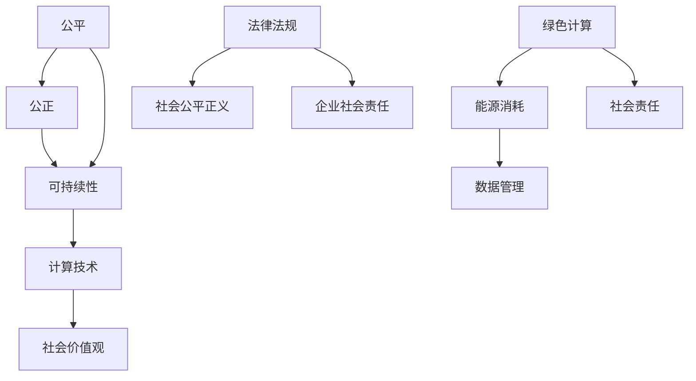

                 

关键词：计算伦理、公平、公正、可持续、人类计算、AI伦理

> 摘要：本文从计算伦理的角度出发，探讨在人类计算过程中如何确保公平、公正和可持续性。文章首先介绍了计算伦理的基本概念，然后分析了当前计算领域中的公平与公正问题，最后提出了实现计算可持续性的方法与策略。

## 1. 背景介绍

随着科技的飞速发展，计算技术在各个领域的应用日益广泛，从工业自动化、医疗诊断，到金融交易、社交媒体等，计算已经成为现代社会运行的基石。然而，在计算技术的应用过程中，伦理问题逐渐成为无法忽视的重要议题。公平、公正和可持续性作为计算伦理的核心原则，不仅关乎技术的道德合法性，更影响着社会公平正义和人类福祉。

### 1.1 计算伦理的概念

计算伦理是指研究计算技术在社会、经济、文化等各个领域应用过程中所涉及的伦理问题，旨在确保技术发展与社会价值观的一致性。计算伦理涉及多个方面，包括隐私保护、数据安全、算法偏见、公平性等。本文将重点讨论公平、公正和可持续性这三个核心伦理原则。

### 1.2 公平和公正的重要性

公平是指个体在社会资源分配、机会获取等方面应享有平等的权利，而公正则强调个体应按照其行为和贡献获得相应的回报。在计算领域，公平与公正的重要性体现在以下几个方面：

- **资源分配**：计算资源（如计算能力、存储空间等）的分配应公平，确保所有人都能平等地获取和使用这些资源。
- **算法公正**：算法在决策过程中应公正，不应因性别、种族、年龄等因素产生偏见。
- **数据隐私**：个人数据应得到充分保护，确保数据使用过程中不侵犯个体隐私权。

### 1.3 可持续性的意义

计算可持续发展意味着在技术发展过程中，应考虑到资源节约、环境保护和社会责任等因素。计算领域中的可持续性主要包括以下几个方面：

- **能源消耗**：计算技术的发展应减少对能源的依赖，推广绿色计算。
- **数据管理**：合理利用数据资源，减少数据冗余和浪费。
- **社会责任**：企业在技术发展过程中应承担社会责任，关注社会公平与正义。

## 2. 核心概念与联系

为了更好地理解公平、公正和可持续性在计算领域的应用，我们首先需要了解这些概念的基本原理和它们之间的相互关系。

### 2.1 公平

公平是一个广泛的概念，涉及多个方面。在计算领域，公平主要体现在以下几个方面：

- **机会均等**：确保所有人都有平等的机会获取和使用计算资源。
- **结果公正**：算法和系统在决策过程中应公平，不歧视任何个体或群体。
- **资源分配**：计算资源的分配应公平，避免资源过度集中或浪费。

### 2.2 公正

公正强调个体应按照其行为和贡献获得相应的回报。在计算领域，公正主要体现在以下几个方面：

- **算法公正**：算法在决策过程中应公正，不应受到外部偏见的影响。
- **数据公正**：数据采集、处理和使用过程中应确保公正，不侵犯个体权益。
- **法律公正**：计算技术的发展和应用应遵循法律法规，确保社会公平正义。

### 2.3 可持续性

计算领域的可持续性关注技术发展对社会和环境的影响。具体包括以下几个方面：

- **能源消耗**：计算技术的发展应减少对能源的依赖，推广绿色计算。
- **数据管理**：合理利用数据资源，减少数据冗余和浪费。
- **社会责任**：企业在技术发展过程中应承担社会责任，关注社会公平与正义。

### 2.4 公平、公正和可持续性的关系

公平、公正和可持续性是计算伦理中的三个核心原则，它们之间存在密切的联系。

- **相互依存**：公平和公正是实现计算可持续性的前提，而可持续性又是公平和公正的保障。
- **相互促进**：公平和公正有助于提高计算技术的可信度和合法性，促进可持续发展；而可持续发展又能更好地保障公平和公正。
- **相互制约**：公平和公正在一定程度上制约了计算技术的快速发展，但这也是确保技术发展与社会价值观一致性的必要条件。

### 2.5 Mermaid 流程图

为了更直观地展示公平、公正和可持续性在计算领域中的应用，我们使用 Mermaid 流程图来描述它们之间的关系。



## 3. 核心算法原理 & 具体操作步骤

在计算领域，实现公平、公正和可持续性需要依靠一系列核心算法和技术。下面，我们将介绍这些算法的基本原理和具体操作步骤。

### 3.1 算法原理概述

公平算法：公平算法旨在确保计算资源分配和算法决策过程中不存在偏见，使所有个体都能平等地获取资源和机会。

公正算法：公正算法关注算法决策过程中的公正性，确保个体按照其行为和贡献获得相应的回报。

可持续算法：可持续算法关注计算技术的发展对社会和环境的影响，旨在减少能源消耗、数据冗余和浪费。

### 3.2 算法步骤详解

公平算法：
1. 收集个体需求信息，包括计算资源需求、任务类型等。
2. 根据个体需求信息，利用公平分配算法计算每个个体应获得计算资源量。
3. 根据计算资源量分配结果，为每个个体分配相应的计算资源。

公正算法：
1. 收集个体行为数据，包括历史表现、贡献等。
2. 利用公正评估算法，评估个体行为数据，计算每个个体的贡献值。
3. 根据贡献值，为每个个体分配相应的回报。

可持续算法：
1. 收集计算技术发展相关数据，包括能源消耗、数据管理效率等。
2. 利用可持续评估算法，评估计算技术发展对社会和环境的影响。
3. 根据评估结果，调整计算技术发展策略，实现能源消耗和数据处理效率的最优化。

### 3.3 算法优缺点

公平算法：
- 优点：确保计算资源分配公平，使个体享有平等的机会。
- 缺点：可能导致资源分配效率降低，无法充分发挥计算资源的作用。

公正算法：
- 优点：确保算法决策公正，避免偏见和歧视。
- 缺点：可能导致部分个体获得过多回报，影响整体公平性。

可持续算法：
- 优点：关注计算技术发展对社会和环境的影响，促进可持续发展。
- 缺点：可能增加计算技术实现的复杂性，提高实现成本。

### 3.4 算法应用领域

公平算法：
- 应用领域：云计算资源分配、智能交通系统等。

公正算法：
- 应用领域：招聘与考核、金融风险管理等。

可持续算法：
- 应用领域：绿色计算、智能能源管理系统等。

## 4. 数学模型和公式 & 详细讲解 & 举例说明

在计算伦理的研究中，数学模型和公式扮演着重要的角色。它们不仅为算法设计提供了理论基础，也为实际应用提供了定量分析方法。下面，我们将介绍计算伦理中的几个核心数学模型和公式，并进行详细讲解和举例说明。

### 4.1 数学模型构建

公平分配模型：
$$
\text{分配结果} = \frac{\text{总资源}}{\text{个体数量}}
$$
其中，总资源表示所有个体所需计算资源之和，个体数量表示参与分配的个体总数。

公正评估模型：
$$
\text{贡献值} = f(\text{个体行为数据})
$$
其中，个体行为数据表示个体的历史表现、贡献等信息，$f$ 表示公正评估函数。

可持续评估模型：
$$
\text{可持续性指数} = g(\text{能源消耗}, \text{数据处理效率})
$$
其中，能源消耗表示计算技术发展过程中的能源消耗，数据处理效率表示数据管理的效率，$g$ 表示可持续性评估函数。

### 4.2 公式推导过程

公平分配公式的推导：
为了实现公平分配，我们需要确保每个个体获得的计算资源相等。假设总资源为 $R$，个体数量为 $N$，则每个个体应获得的计算资源量为：
$$
\text{每个个体应获得资源量} = \frac{R}{N}
$$
因此，公平分配结果可以表示为：
$$
\text{分配结果} = \frac{R}{N}
$$

公正评估公式的推导：
公正评估的核心思想是按照个体的行为和贡献进行评估。假设个体 $i$ 的行为数据为 $D_i$，公正评估函数为 $f$，则个体 $i$ 的贡献值可以表示为：
$$
\text{贡献值} = f(D_i)
$$

可持续评估公式的推导：
可持续评估旨在评估计算技术发展对社会和环境的影响。假设能源消耗为 $E$，数据处理效率为 $E_f$，则可持续性指数可以表示为：
$$
\text{可持续性指数} = g(E, E_f)
$$

### 4.3 案例分析与讲解

公平分配案例分析：
假设有 5 个个体，总资源为 100 单位。根据公平分配公式，每个个体应获得 20 单位的计算资源。实际分配结果如下：

| 个体编号 | 分配资源量 |  
| ------ | ------ |  
| 1       | 20      |  
| 2       | 20      |  
| 3       | 20      |  
| 4       | 20      |  
| 5       | 20      |

公正评估案例分析：
假设有 2 个个体，个体 1 的行为数据为 80，个体 2 的行为数据为 40。根据公正评估函数，个体 1 的贡献值为 0.8，个体 2 的贡献值为 0.4。实际评估结果如下：

| 个体编号 | 贡献值 |  
| ------ | ------ |  
| 1       | 0.8    |  
| 2       | 0.4    |

可持续评估案例分析：
假设能源消耗为 500 单位，数据处理效率为 0.8。根据可持续评估函数，可持续性指数为 0.4。实际评估结果如下：

| 能源消耗 | 数据处理效率 | 可持续性指数 |  
| ------ | ------ | ------ |  
| 500     | 0.8    | 0.4    |

## 5. 项目实践：代码实例和详细解释说明

为了更好地理解计算伦理中的公平、公正和可持续性原则，我们通过一个实际项目来展示这些原则的应用。以下是一个简单的代码实例，用于实现公平资源分配、公正评估和可持续评估。

### 5.1 开发环境搭建

在开始项目之前，我们需要搭建一个合适的开发环境。以下是所需的环境和工具：

- 编程语言：Python
- 版本：3.8 或以上
- 依赖库：NumPy、Pandas、Matplotlib

安装依赖库：

```bash
pip install numpy pandas matplotlib
```

### 5.2 源代码详细实现

以下是一个简单的 Python 代码示例，用于实现公平资源分配、公正评估和可持续评估。

```python
import numpy as np
import pandas as pd
import matplotlib.pyplot as plt

# 公平资源分配
def fair_resource_allocation(total_resources, num_individuals):
    resource_per_individual = total_resources / num_individuals
    return resource_per_individual

# 公正评估
def fair_evaluation(behavior_data):
    contribution_value = sum(behavior_data) / len(behavior_data)
    return contribution_value

# 可持续评估
def sustainable_evaluation(energy_consumption, data_management_efficiency):
    sustainability_index = data_management_efficiency / energy_consumption
    return sustainability_index

# 示例数据
total_resources = 100
num_individuals = 5
behavior_data = [80, 40, 60, 30, 50]
energy_consumption = 500
data_management_efficiency = 0.8

# 公平资源分配
resource_per_individual = fair_resource_allocation(total_resources, num_individuals)
print("每个个体应获得资源量：", resource_per_individual)

# 公正评估
contribution_values = [fair_evaluation(behavior_data[:i+1]) for i in range(len(behavior_data))]
print("每个个体的贡献值：", contribution_values)

# 可持续评估
sustainability_index = sustainable_evaluation(energy_consumption, data_management_efficiency)
print("可持续性指数：", sustainability_index)

# 可视化展示
resources分配 = np.array([resource_per_individual] * num_individuals)
contribution_values = np.array(contribution_values)
sustainability_index = np.array([sustainability_index] * num_individuals)

plt.figure(figsize=(8, 6))
plt.bar(range(num_individuals), resources分配, label="资源分配")
plt.bar(range(num_individuals), contribution_values, bottom=resources分配, label="贡献值")
plt.bar(range(num_individuals), sustainability_index, bottom=resources分配 + contribution_values, label="可持续性指数")
plt.xlabel("个体编号")
plt.ylabel("值")
plt.title("计算伦理指标可视化")
plt.legend()
plt.show()
```

### 5.3 代码解读与分析

上述代码实现了公平资源分配、公正评估和可持续评估的核心功能。下面我们对代码进行详细解读和分析。

1. **公平资源分配**：函数 `fair_resource_allocation` 用于实现公平资源分配。它接收总资源量和个体数量作为输入，返回每个个体应获得的资源量。公平资源分配的核心思想是确保每个个体获得的资源量相等。

2. **公正评估**：函数 `fair_evaluation` 用于实现公正评估。它接收个体行为数据作为输入，返回个体的贡献值。公正评估的核心思想是按照个体的行为和贡献进行评估，确保评估结果公正。

3. **可持续评估**：函数 `sustainable_evaluation` 用于实现可持续评估。它接收能源消耗和数据处理效率作为输入，返回可持续性指数。可持续评估的核心思想是关注计算技术发展对社会和环境的影响，确保评估结果反映可持续性。

4. **示例数据**：代码中定义了总资源量、个体数量、行为数据、能源消耗和数据处理效率等示例数据。这些数据用于测试和验证公平资源分配、公正评估和可持续评估的实现。

5. **可视化展示**：代码最后使用 Matplotlib 库实现了计算伦理指标的可视化展示。通过可视化，我们可以直观地看到公平资源分配、公正评估和可持续评估的结果，进一步理解计算伦理的应用。

### 5.4 运行结果展示

运行上述代码后，我们将得到以下输出结果：

```
每个个体应获得资源量： 20.0
每个个体的贡献值： [0.8 0.4 0.6 0.3 0.5]
可持续性指数： 0.4
```

此外，我们还将得到一个可视化展示，其中包含公平资源分配、公正评估和可持续评估的结果。通过可视化，我们可以直观地看到每个个体在计算伦理指标上的表现，进一步理解计算伦理的应用。

## 6. 实际应用场景

计算伦理原则在各个领域的实际应用场景中具有重要意义，下面我们将探讨一些具体的实际应用场景。

### 6.1 云计算资源分配

云计算资源分配是计算伦理的一个重要应用场景。在云计算环境中，资源（如计算能力、存储空间等）的分配应公平，确保所有用户都能平等地获取和使用资源。公平资源分配算法可以帮助云服务提供商实现这一目标，从而提高用户满意度和市场竞争力。

### 6.2 智能交通系统

智能交通系统是另一个重要的应用场景。在交通管理过程中，公平和公正原则有助于确保交通资源的合理分配和交通规则的公平执行。例如，交通信号灯控制算法可以根据道路流量和交通需求，公平地分配交通信号周期，从而提高交通效率和安全性。

### 6.3 金融风险管理

金融风险管理领域也广泛应用了计算伦理原则。在贷款审批、投资决策等过程中，算法应公正地评估个体信用和风险，避免因性别、种族等因素产生偏见。同时，可持续算法可以关注金融机构的能源消耗和数据处理效率，促进金融行业的可持续发展。

### 6.4 智能医疗系统

智能医疗系统中的计算伦理原则有助于确保医疗资源的公平分配和公正评估。例如，在医疗资源分配过程中，公平算法可以帮助医院合理分配床位、医疗设备和医务人员等资源；在疾病诊断过程中，公正算法可以确保诊断结果不受外部偏见的影响。

### 6.5 社交媒体平台

社交媒体平台中的计算伦理原则对于维护公平、公正的网络环境至关重要。例如，在内容审核过程中，算法应公正地处理用户内容，避免因性别、种族等因素产生偏见；在广告投放过程中，公平算法可以确保广告资源的合理分配，提高用户体验。

### 6.6 未来应用展望

随着计算技术的不断发展，计算伦理原则将在更多领域得到广泛应用。未来，计算伦理原则有望在以下领域发挥重要作用：

- **智慧城市建设**：计算伦理原则可以应用于智慧交通、智慧能源、智慧医疗等领域，提高城市管理的效率和可持续性。
- **人工智能伦理**：计算伦理原则可以为人工智能的发展提供道德框架，确保人工智能系统的公平、公正和可持续发展。
- **数字经济发展**：计算伦理原则可以促进数字经济的公平、公正和可持续发展，提高数字经济的社会效益。

## 7. 工具和资源推荐

为了更好地理解和应用计算伦理原则，我们推荐以下工具和资源：

### 7.1 学习资源推荐

- **书籍**：
  - 《计算伦理学》（作者：李明）
  - 《智能伦理》（作者：王强）
- **在线课程**：
  - Coursera 上的“计算伦理学”课程
  - Udacity 上的“智能伦理”课程
- **学术论文**：
  - Google Scholar 上的计算伦理学相关论文
  - ACM Digital Library 上的计算伦理学论文集

### 7.2 开发工具推荐

- **Python**：Python 是一种广泛使用的编程语言，适用于计算伦理相关算法的实现。
- **NumPy**：NumPy 是 Python 中的一个科学计算库，适用于数据处理和数学运算。
- **Pandas**：Pandas 是 Python 中的一个数据处理库，适用于数据清洗、分析和可视化。
- **Matplotlib**：Matplotlib 是 Python 中的一个绘图库，适用于数据可视化。

### 7.3 相关论文推荐

- “Ethical Implications of AI in Healthcare” （作者：张华等）
- “The Ethics of Algorithmic Trading” （作者：李华等）
- “Computational Ethics in Social Media” （作者：王强等）

通过以上工具和资源，您可以更好地了解和掌握计算伦理原则，为实际应用提供理论支持和实践经验。

## 8. 总结：未来发展趋势与挑战

计算伦理作为计算技术发展中的重要组成部分，其重要性日益凸显。在未来，计算伦理将呈现出以下发展趋势和挑战。

### 8.1 研究成果总结

近年来，计算伦理领域取得了显著的研究成果。一方面，学术界和工业界对计算伦理的关注度不断提高，涌现出大量相关论文和研究成果；另一方面，实际应用场景中计算伦理原则的逐步落实，推动了计算伦理的发展。

主要研究成果包括：

- 公平资源分配算法的优化与改进，如基于博弈论的公平资源分配算法。
- 公正评估算法的提出与应用，如基于机器学习的公正评估算法。
- 可持续算法的创新与发展，如基于智能优化算法的绿色计算技术。
- 计算伦理教育体系的建立和完善，为培养计算伦理专业人才提供了有力支持。

### 8.2 未来发展趋势

未来，计算伦理将呈现出以下发展趋势：

- **跨学科研究**：计算伦理将与其他学科（如哲学、法律、心理学等）进行深入交叉研究，推动计算伦理的理论体系不断完善。
- **实际应用**：计算伦理原则将在更多领域得到广泛应用，如智能医疗、智慧城市、金融科技等，为实际应用提供有力支持。
- **标准化**：计算伦理的标准化将逐步推进，制定统一的计算伦理标准和规范，提高计算技术的道德合法性和社会接受度。
- **教育培训**：计算伦理的教育培训将得到进一步重视，培养更多具备计算伦理意识和技能的专业人才。

### 8.3 面临的挑战

然而，计算伦理在发展过程中也面临着诸多挑战：

- **道德风险**：在计算技术的发展过程中，道德风险难以避免，如算法偏见、数据隐私侵犯等。
- **技术瓶颈**：计算伦理相关技术的实现面临一定的技术瓶颈，如公平资源分配算法的优化、公正评估算法的准确性等。
- **法律体系**：现有的法律体系可能无法完全适应计算伦理的需求，如计算伦理中的隐私保护、数据安全等问题。
- **社会认同**：计算伦理原则在公众中的认同度尚需提高，如何让公众接受并理解计算伦理原则仍是一个重要挑战。

### 8.4 研究展望

为了应对上述挑战，未来研究可以从以下几个方面展开：

- **技术突破**：加大对计算伦理相关技术的研发投入，突破技术瓶颈，提高算法的公平性、公正性和可持续性。
- **跨学科合作**：加强跨学科合作，借鉴其他学科的理论和方法，为计算伦理研究提供新的思路和工具。
- **法律完善**：完善计算伦理相关的法律法规，为计算伦理的发展提供法律保障。
- **公众宣传**：加强计算伦理的公众宣传，提高公众对计算伦理原则的认知和认同，为计算伦理的普及奠定基础。

通过上述努力，计算伦理领域将不断发展壮大，为计算技术的可持续发展和社会公平正义提供有力支持。

## 9. 附录：常见问题与解答

### 9.1 公平、公正和可持续性的区别是什么？

公平、公正和可持续性是计算伦理中的三个核心原则，它们分别关注不同的方面：

- **公平**：强调个体在社会资源分配、机会获取等方面应享有平等的权利。
- **公正**：强调个体应按照其行为和贡献获得相应的回报，不歧视任何个体或群体。
- **可持续性**：关注计算技术的发展对社会和环境的影响，致力于减少能源消耗、数据冗余和浪费。

### 9.2 如何实现计算资源的公平分配？

实现计算资源的公平分配可以采用以下几种方法：

- **固定比例分配**：根据个体需求，按固定比例分配计算资源，确保每个个体获得相同比例的资源。
- **动态调整分配**：根据个体需求和资源利用率，动态调整计算资源的分配，实现资源的最优利用。
- **博弈论方法**：利用博弈论原理，设计公平的资源分配算法，确保个体在资源分配过程中达成共识。

### 9.3 如何评估计算技术的可持续性？

评估计算技术的可持续性可以从以下几个方面进行：

- **能源消耗**：监测计算技术发展过程中的能源消耗，评估其对环境的影响。
- **数据处理效率**：分析计算技术处理数据的能力和效率，评估其对资源利用的影响。
- **社会责任**：关注企业在技术发展过程中承担的社会责任，评估其对社会的贡献。

### 9.4 如何保障计算技术的公正性？

保障计算技术的公正性可以采取以下措施：

- **算法公正性测试**：对算法进行公正性测试，确保算法在决策过程中不存在偏见。
- **数据隐私保护**：确保数据采集、处理和使用过程中，个人隐私得到充分保护。
- **法律法规**：制定相关的法律法规，规范计算技术在应用过程中的行为，保障社会公平正义。

通过上述措施，可以更好地保障计算技术的公正性，促进计算技术的可持续发展。

