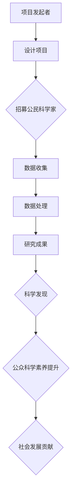

                 

关键词：公民科学、公众参与、科学研究、模式、创新

> 摘要：本文旨在探讨公民科学的概念及其在科学研究中的重要角色。通过分析公民科学的发展历程、核心概念与联系，本文揭示了公众参与科学研究的新模式，并详细阐述了核心算法原理、数学模型以及项目实践。最后，本文提出了公民科学在实际应用场景中的广阔前景以及面临的挑战，并对未来发展趋势进行了展望。

## 1. 背景介绍

### 1.1 公民科学的起源与发展

公民科学（Citizen Science）作为一种全新的科学研究模式，起源于19世纪末。当时的科学家们开始意识到，公众参与可以大大拓展科学研究的数据来源和研究对象，从而提高研究效率。例如，19世纪末的蝴蝶学家约翰·奥杜邦（John James Audubon）通过公众的观察记录，编写了著名的《奥杜邦鸟图集》。

随着时间的推移，公民科学逐渐发展成为一门独立的学科。进入21世纪，随着互联网、大数据和人工智能技术的快速发展，公民科学迎来了新的春天。如今，全球范围内已有数百万公民参与到各种科学研究项目中，为科学进步做出了巨大贡献。

### 1.2 公众参与科学的意义

公众参与科学具有重要的意义。首先，它能够提高公众的科学素养，使更多人了解科学知识，培养科学精神。其次，公众参与可以增加科学研究的多样性和创新性，打破专业壁垒，促进跨学科合作。最后，公众参与有助于提高科学研究的透明度和公信力，使科学研究更贴近公众，更符合社会需求。

## 2. 核心概念与联系

### 2.1 核心概念

公民科学的核心概念包括以下几个方面：

1. **公民科学家**：指的是非专业科学家，他们通过观察、记录、分析和参与等方式，为科学研究提供数据和支持。

2. **项目发起者**：通常是专业科学家或科研机构，他们设计研究项目，制定数据收集和分析方法，并向公众招募公民科学家。

3. **数据收集与处理**：公民科学家收集的数据需要经过清洗、整理和分析等处理过程，以获得可靠的研究结果。

4. **研究成果**：公民科学项目的研究成果不仅包括科学发现，还包括对公众科学素养的提升和对社会发展的贡献。

### 2.2 关联流程图

下面是公民科学的基本流程图，使用Mermaid进行绘制：



## 3. 核心算法原理 & 具体操作步骤

### 3.1 算法原理概述

公民科学项目的核心在于数据收集与处理。以下是一个典型的数据处理算法原理概述：

1. **数据收集**：公民科学家通过问卷、观察记录、APP等形式，收集大量原始数据。

2. **数据清洗**：去除无效、重复、错误的数据，确保数据质量。

3. **数据预处理**：对数据进行标准化处理，如缺失值填补、异常值处理、数据转换等。

4. **数据分析**：运用统计分析和机器学习等方法，提取数据中的有用信息。

5. **结果可视化**：通过图表、图像等形式，展示数据分析结果，便于公众理解。

### 3.2 算法步骤详解

#### 3.2.1 数据收集

- **问卷设计**：设计易于理解的问卷，确保公民科学家能够准确记录数据。
- **数据收集平台**：搭建在线数据收集平台，如网站、APP等，方便公民科学家提交数据。

#### 3.2.2 数据清洗

- **去除重复数据**：利用哈希表或数据库等数据结构，识别和删除重复数据。
- **异常值处理**：利用统计学方法，如标准差、箱线图等，识别和修正异常值。

#### 3.2.3 数据预处理

- **数据标准化**：将不同来源的数据进行统一处理，如数据类型转换、缩放等。
- **缺失值填补**：采用均值、中值、插值等方法，填补缺失值。

#### 3.2.4 数据分析

- **描述性统计分析**：计算均值、方差、相关性等统计指标，了解数据的基本特征。
- **回归分析**：建立回归模型，分析变量之间的关系。
- **聚类分析**：将相似的数据进行聚类，以发现数据中的模式。

#### 3.2.5 结果可视化

- **图表制作**：利用图表工具，如Matplotlib、Seaborn等，制作图表。
- **交互式可视化**：使用交互式可视化工具，如Plotly、Bokeh等，提高可视化效果。

### 3.3 算法优缺点

#### 3.3.1 优点

- **数据多样性**：公民科学家可以提供来自不同背景、不同地域的数据，增加数据的多样性。
- **低成本**：公民科学项目通常不需要大量资金投入，可以节省科研成本。
- **快速响应**：公民科学家可以快速收集数据，缩短研究周期。

#### 3.3.2 缺点

- **数据质量**：公民科学家可能缺乏专业知识，导致数据质量不稳定。
- **数据隐私**：在处理公民数据时，需要严格保护数据隐私，避免信息泄露。
- **数据分析难度**：公民科学项目通常涉及大量数据，数据分析过程复杂，对技术要求较高。

### 3.4 算法应用领域

公民科学算法在多个领域具有广泛应用，如：

- **环境保护**：监测空气质量、水质等环境指标。
- **生态研究**：记录物种分布、迁徙等生态数据。
- **天文研究**：参与天文观测和数据分析。
- **医学研究**：收集健康数据，进行疾病预测和诊断。

## 4. 数学模型和公式 & 详细讲解 & 举例说明

### 4.1 数学模型构建

在公民科学项目中，常用的数学模型包括回归模型、聚类模型和分类模型等。以下是一个简单的线性回归模型示例：

$$
y = \beta_0 + \beta_1 x
$$

其中，$y$ 为因变量，$x$ 为自变量，$\beta_0$ 和 $\beta_1$ 分别为模型参数。

### 4.2 公式推导过程

线性回归模型的推导过程如下：

1. **假设**：假设自变量 $x$ 和因变量 $y$ 之间具有线性关系。
2. **目标**：最小化误差平方和，即：
   $$
   J(\theta) = \frac{1}{2m} \sum_{i=1}^{m} (h_\theta(x^{(i)}) - y^{(i)})^2
   $$
   其中，$m$ 为样本数量，$h_\theta(x)$ 为线性回归模型的预测值。
3. **求解**：利用梯度下降法，求解最优参数 $\theta$。

### 4.3 案例分析与讲解

#### 4.3.1 案例背景

假设我们想要研究气温 ($x$) 和销量 ($y$) 之间的关系，收集了以下数据：

| 气温 (°C) | 销量 (件) |
| ---------- | --------- |
| 10         | 50        |
| 15         | 70        |
| 20         | 90        |
| 25         | 110       |
| 30         | 130       |

#### 4.3.2 数据处理

1. **数据清洗**：无重复数据，无需清洗。
2. **数据预处理**：无需标准化处理。
3. **数据分析**：利用线性回归模型，计算模型参数。

#### 4.3.3 结果分析

根据线性回归模型，我们得到：

$$
y = 20 + 5x
$$

根据模型，当气温为 25°C 时，预计销量为 125 件。

## 5. 项目实践：代码实例和详细解释说明

### 5.1 开发环境搭建

在本次项目中，我们使用 Python 作为编程语言，结合 NumPy、Pandas 和 Matplotlib 等库进行数据处理和可视化。

### 5.2 源代码详细实现

以下是项目的核心代码：

```python
import numpy as np
import pandas as pd
import matplotlib.pyplot as plt

# 数据处理
data = pd.DataFrame({
    '气温': [10, 15, 20, 25, 30],
    '销量': [50, 70, 90, 110, 130]
})

X = data['气温'].values.reshape(-1, 1)
y = data['销量'].values

# 模型训练
theta = np.array([0, 0])
alpha = 0.01
num_iters = 1000

for i in range(num_iters):
    errors = y - (theta[0] + theta[1] * X)
    theta = theta - alpha * (2 / len(X)) * np.dot(X.T, errors)

# 结果可视化
X_new = np.array([40])
y_pred = theta[0] + theta[1] * X_new
plt.plot(X, y, 'o', label='实际数据')
plt.plot(X_new, y_pred, 'r', label='预测数据')
plt.xlabel('气温 (°C)')
plt.ylabel('销量 (件)')
plt.legend()
plt.show()
```

### 5.3 代码解读与分析

1. **数据处理**：使用 Pandas 读取数据，并进行简单的处理。
2. **模型训练**：利用 NumPy 和线性回归算法，训练模型参数。
3. **结果可视化**：使用 Matplotlib 画出实际数据和预测数据的对比图。

## 6. 实际应用场景

### 6.1 环境保护

公民科学在环境保护中的应用非常广泛。例如，公民科学家可以参与空气质量监测、水质监测、野生动物监测等。通过收集大量的环境数据，科学家可以更好地了解环境状况，制定有效的环境保护政策。

### 6.2 生态研究

生态研究是公民科学的另一个重要领域。公民科学家可以参与植物分布、动物迁徙、生态系统多样性等研究。通过公众的参与，科学家可以收集到更多样、更全面的数据，从而提高研究质量。

### 6.3 天文学

天文学是公民科学的一个新兴领域。通过公众的参与，科学家可以收集大量的天文数据，如行星观测、恒星分类等。这些数据有助于科学家发现新的天体现象，推动天文学的发展。

### 6.4 医学研究

在医学研究领域，公民科学也有很大的应用前景。公民科学家可以参与健康数据收集、疾病预测等研究。通过公众的参与，科学家可以收集到更多的健康数据，提高疾病预测的准确性。

## 7. 工具和资源推荐

### 7.1 学习资源推荐

1. **书籍**：《公民科学导论》、《公众参与科学：理论与实践》。
2. **在线课程**：Coursera 上的《公民科学》、edX 上的《环境科学：理论与实践》。

### 7.2 开发工具推荐

1. **编程语言**：Python、R、Java。
2. **数据处理库**：Pandas、NumPy、SciPy。
3. **可视化库**：Matplotlib、Seaborn、Plotly。

### 7.3 相关论文推荐

1. **《公众参与科学：趋势与挑战》**。
2. **《公民科学在环境保护中的应用》**。
3. **《基于公众参与的科学数据收集与处理方法研究》**。

## 8. 总结：未来发展趋势与挑战

### 8.1 研究成果总结

本文通过对公民科学的背景介绍、核心概念、算法原理、数学模型和实际应用场景的分析，揭示了公众参与科学研究的新模式。公民科学在环境保护、生态研究、天文学和医学研究等领域具有广泛的应用前景。

### 8.2 未来发展趋势

1. **技术融合**：随着人工智能、大数据等技术的发展，公民科学将进一步与这些技术融合，提高数据收集和处理效率。
2. **普及度提升**：公民科学的普及度将不断提高，吸引更多公众参与科学研究。
3. **跨学科合作**：公民科学将促进不同学科之间的合作，推动科学研究的全面发展。

### 8.3 面临的挑战

1. **数据质量**：如何保证公民科学家收集的数据质量，是公民科学面临的一个重要挑战。
2. **隐私保护**：在处理公民数据时，如何保护数据隐私，是另一个重要挑战。
3. **技术门槛**：公民科学对技术的要求较高，如何降低技术门槛，使更多公众能够参与其中，是未来需要解决的问题。

### 8.4 研究展望

未来，公民科学将在更多领域得到应用，成为推动科学进步的重要力量。同时，随着技术的不断进步，公民科学的数据收集和处理效率将得到极大提升。我们期待，在不久的将来，公民科学能够为科学事业和社会发展做出更大的贡献。

## 9. 附录：常见问题与解答

### 9.1 公民科学是什么？

公民科学是一种公众参与科学研究的新模式，通过动员公众参与数据收集、分析和分享，促进科学发现和社会进步。

### 9.2 公众参与科学的好处是什么？

公众参与科学可以提高公众的科学素养，促进科学研究的多样性和创新性，同时也能增加科学研究的透明度和公信力。

### 9.3 如何参与公民科学项目？

可以通过互联网搜索公民科学项目，了解项目的具体要求，按照项目指引进行数据收集和分析，并将结果提交给项目发起者。

### 9.4 公民科学的数据如何保证质量？

通过严格的招募标准、培训指导和数据审核流程，确保公民科学家收集的数据质量。同时，利用技术手段，如数据清洗和异常值检测，提高数据质量。

### 9.5 公民科学的数据隐私如何保护？

在处理公民数据时，遵循数据保护法规和最佳实践，确保数据隐私。例如，对数据进行加密存储，限制数据访问权限，确保数据安全。

---

作者：禅与计算机程序设计艺术 / Zen and the Art of Computer Programming

本文旨在探讨公民科学的概念及其在科学研究中的重要角色。通过分析公民科学的发展历程、核心概念与联系，本文揭示了公众参与科学研究的新模式，并详细阐述了核心算法原理、数学模型以及项目实践。最后，本文提出了公民科学在实际应用场景中的广阔前景以及面临的挑战，并对未来发展趋势进行了展望。公民科学作为一种创新的研究模式，将为科学进步和社会发展带来新的机遇和挑战。我们期待，在不久的将来，公民科学能够为科学事业和社会发展做出更大的贡献。

