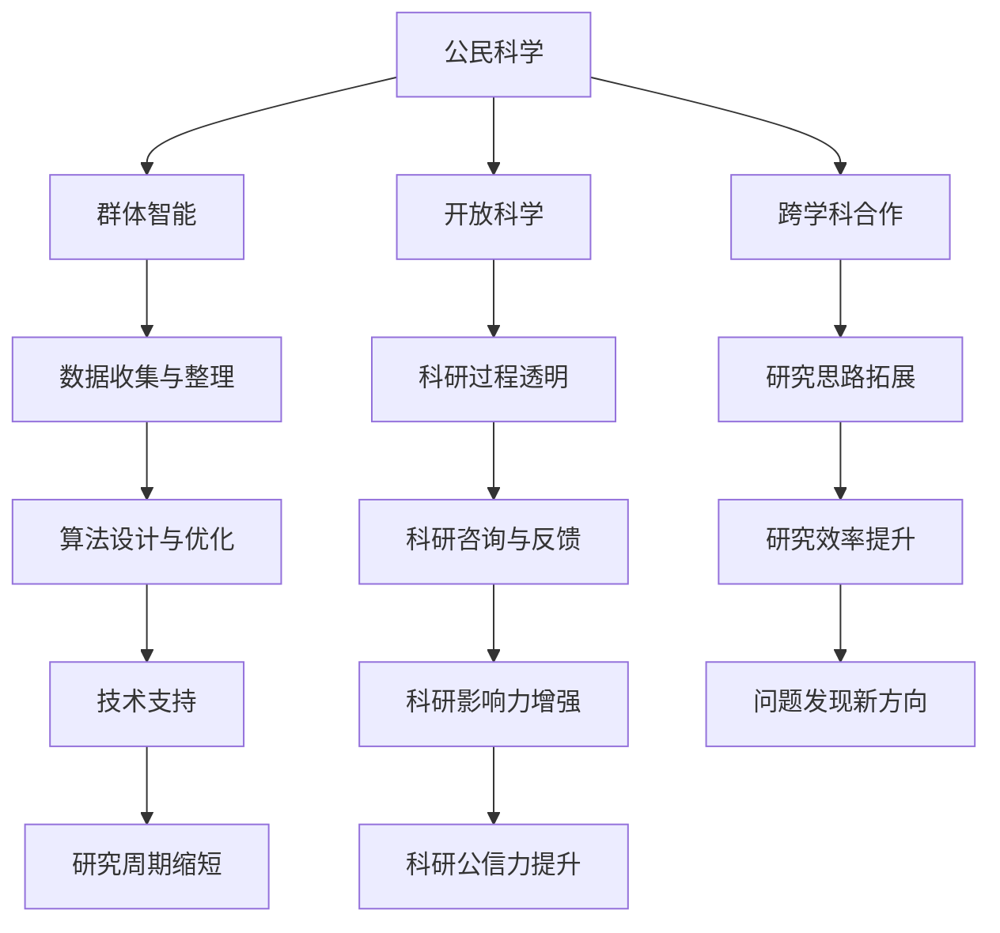

                 

 在当今信息化时代，科学技术的进步日新月异，科学研究越来越依赖于复杂的算法、海量的数据以及先进的技术手段。然而，科学研究的成果不仅仅属于科学家和研究者，它对人类社会的发展具有深远的影响。因此，如何让公众更好地参与科学研究，成为了一个值得探讨的课题。本文旨在探讨公民科学的概念、核心概念与联系、核心算法原理、数学模型和公式、项目实践以及实际应用场景，并提出未来发展趋势与挑战。

> **关键词**：公民科学，公众参与，科学研究，算法，数学模型，应用场景
>
> **摘要**：本文首先介绍了公民科学的背景和意义，然后阐述了公民科学的核心概念与联系，接着深入分析了核心算法原理和数学模型，最后通过具体的项目实践和实际应用场景展示了公民科学的具体应用。

## 1. 背景介绍

科学研究的本质是探索自然规律、发现新知识。然而，科学研究的过程往往是复杂而漫长的。传统的科学研究模式主要依赖于科学家和研究人员，他们通过专业的知识和技能来进行研究。然而，随着科学领域的不断扩展，研究问题越来越复杂，单一的研究力量已经难以应对。同时，公众对于科学研究的关注度和参与度也在不断提高，他们渴望参与到科学研究中来，为科学事业贡献自己的力量。

### 1.1 公众参与科学研究的必要性

公众参与科学研究具有重要意义：

1. **拓展研究视野**：公众的参与可以带来新的研究思路和方法，有助于拓展研究视野，发现新的问题和研究方向。
2. **提升科研效率**：公众的参与可以分担科研任务，提高科研效率，缩短研究周期。
3. **增强科研影响力**：公众的参与可以增强科研工作的透明度和公信力，提升科研成果的社会影响力。

### 1.2 公众参与科学研究的形式

公众参与科学研究的形式多种多样，包括：

1. **数据收集与整理**：公众可以参与数据的收集和整理工作，为科学研究提供基础数据。
2. **实验参与**：公众可以参与科学实验，提供实验样本或参与实验过程。
3. **算法设计与优化**：公众可以参与到算法的设计和优化工作中，为科学研究提供技术支持。
4. **科研咨询与反馈**：公众可以提供科研咨询和建议，为科学研究提供指导。

## 2. 核心概念与联系

在探讨公民科学的核心概念和联系之前，我们先来了解一下与之相关的几个重要概念：

### 2.1 公民科学

公民科学是指公众参与科学研究的一种模式，它强调公众的参与不仅仅是数据的提供者，更是研究的合作者和推动者。

### 2.2 群体智能

群体智能是指由大量个体组成的系统所表现出的智能行为。在公民科学中，公众个体的智慧可以形成一种集体智慧，为科学研究提供强大的支持。

### 2.3 开放科学

开放科学是指科学研究和知识传播过程中的开放性。它强调科研数据的开放、科研过程的透明以及科研结果的共享。

### 2.4 跨学科合作

跨学科合作是指不同学科之间的合作与交流。在公民科学中，跨学科合作可以帮助研究者从多个角度来探讨问题，提高研究的深度和广度。

### 2.5 核心概念与联系

以上几个概念在公民科学中有着紧密的联系。公民科学通过群体智能和跨学科合作，实现了开放科学的理念，使得科学研究更加高效、透明和包容。

### 2.6 Mermaid 流程图

以下是一个简化的Mermaid流程图，用于描述公民科学的核心概念与联系：



## 3. 核心算法原理 & 具体操作步骤

公民科学在具体实施过程中，需要借助一系列的算法和技术手段来支持。以下将介绍公民科学中常用的核心算法原理及其具体操作步骤。

### 3.1 算法原理概述

在公民科学中，常用的算法主要包括：

1. **群体智能算法**：如遗传算法、粒子群优化算法、蚁群算法等。
2. **数据挖掘算法**：如关联规则挖掘、聚类分析、分类算法等。
3. **机器学习算法**：如线性回归、决策树、支持向量机等。

这些算法可以应用于数据的收集、处理、分析和优化等环节，为科学研究提供强大的技术支持。

### 3.2 算法步骤详解

以下以群体智能算法中的遗传算法为例，介绍其具体操作步骤：

#### 3.2.1 遗传算法原理

遗传算法是一种基于自然选择和遗传学原理的优化算法。其基本思想是模拟生物进化过程，通过迭代生成更适应环境的个体，从而找到最优解。

#### 3.2.2 操作步骤

1. **初始化种群**：根据问题的规模和复杂度，随机生成一定数量的初始个体。
2. **适应度评估**：对每个个体进行适应度评估，适应度越高的个体表示其越优秀。
3. **选择操作**：根据适应度进行选择操作，选择优秀的个体作为父代。
4. **交叉操作**：对选出的父代进行交叉操作，产生新的后代。
5. **变异操作**：对后代进行变异操作，增加种群的多样性。
6. **更新种群**：将交叉和变异后的个体组成新的种群，返回步骤2继续迭代。
7. **终止条件**：当满足终止条件（如达到最大迭代次数或适应度达到预设阈值）时，算法终止。

### 3.3 算法优缺点

遗传算法具有以下优缺点：

1. **优点**：
   - 强鲁棒性：对初始条件和非线性问题具有较强的适应性。
   - 良好的全局搜索能力：能够在复杂的搜索空间中找到全局最优解。
   - 易于并行化：可以方便地实现并行计算，提高计算效率。

2. **缺点**：
   - 收敛速度较慢：在某些情况下，收敛速度可能较慢，需要大量的迭代次数。
   - 参数设置复杂：需要根据具体问题调整参数，设置较为繁琐。

### 3.4 算法应用领域

遗传算法在公民科学中有着广泛的应用，包括：

1. **优化问题**：如路径规划、资源分配、负载均衡等。
2. **数据挖掘**：如聚类分析、分类算法等。
3. **机器学习**：如模型优化、超参数调整等。

## 4. 数学模型和公式

在公民科学中，数学模型和公式是描述和研究问题的重要工具。以下将介绍一些常见的数学模型和公式，并详细讲解其推导过程。

### 4.1 数学模型构建

在构建数学模型时，需要遵循以下原则：

1. **准确性**：模型应能准确地描述问题的本质。
2. **简洁性**：模型应尽可能简洁，以便于理解和计算。
3. **实用性**：模型应具备实际应用价值。

### 4.2 公式推导过程

以下以线性回归模型为例，介绍其公式推导过程：

#### 4.2.1 线性回归模型

线性回归模型是一种常用的统计模型，用于分析两个或多个变量之间的线性关系。其基本公式为：

\[ y = \beta_0 + \beta_1 \cdot x + \epsilon \]

其中，\( y \) 是因变量，\( x \) 是自变量，\( \beta_0 \) 和 \( \beta_1 \) 分别是模型的参数，\( \epsilon \) 是误差项。

#### 4.2.2 公式推导

1. **最小二乘法**：线性回归模型通常采用最小二乘法来估计参数。其目标是最小化残差平方和：

\[ \min \sum_{i=1}^{n} (y_i - (\beta_0 + \beta_1 \cdot x_i))^2 \]

2. **求导**：对上式求导，得到：

\[ \frac{\partial}{\partial \beta_0} \sum_{i=1}^{n} (y_i - (\beta_0 + \beta_1 \cdot x_i))^2 = 0 \]

\[ \frac{\partial}{\partial \beta_1} \sum_{i=1}^{n} (y_i - (\beta_0 + \beta_1 \cdot x_i))^2 = 0 \]

3. **解方程组**：解上述方程组，得到参数的估计值：

\[ \beta_0 = \frac{\sum_{i=1}^{n} (x_i - \bar{x})(y_i - \bar{y})}{\sum_{i=1}^{n} (x_i - \bar{x})^2} \]

\[ \beta_1 = \frac{\sum_{i=1}^{n} (x_i - \bar{x})(y_i - \bar{y})}{\sum_{i=1}^{n} (x_i - \bar{x})^2} \]

其中，\( \bar{x} \) 和 \( \bar{y} \) 分别是 \( x \) 和 \( y \) 的均值。

#### 4.2.3 案例分析与讲解

以下以房价预测为例，介绍线性回归模型的应用。

1. **数据准备**：收集一组城市房价数据，包括房价（因变量）和城市面积（自变量）。
2. **数据预处理**：对数据进行归一化处理，消除量纲的影响。
3. **模型训练**：使用线性回归模型对数据进行训练，得到参数 \( \beta_0 \) 和 \( \beta_1 \)。
4. **模型评估**：使用交叉验证方法评估模型性能，如均方误差（MSE）。
5. **预测**：使用训练好的模型对新的城市面积进行房价预测。

通过以上步骤，可以构建一个简单的线性回归模型，用于预测城市房价。在实际应用中，可以结合更多的特征变量和复杂的模型，提高预测精度。

## 5. 项目实践：代码实例和详细解释说明

### 5.1 开发环境搭建

在开始编写代码之前，需要搭建合适的开发环境。以下以Python为例，介绍开发环境的搭建过程。

1. **安装Python**：从Python官方网站（https://www.python.org/）下载并安装Python。
2. **安装相关库**：使用pip命令安装必要的Python库，如NumPy、Pandas、Scikit-learn等。

   ```bash
   pip install numpy pandas scikit-learn
   ```

3. **编写配置文件**：根据需要编写配置文件，如环境变量配置、依赖库配置等。

### 5.2 源代码详细实现

以下是一个简单的Python代码实例，用于实现线性回归模型。

```python
import numpy as np
import pandas as pd
from sklearn.linear_model import LinearRegression
from sklearn.model_selection import train_test_split
from sklearn.metrics import mean_squared_error

# 数据准备
data = pd.read_csv('house_prices.csv')
X = data[['area']]  # 特征变量
y = data['price']    # 因变量

# 数据预处理
X = X.values
y = y.values

# 数据分割
X_train, X_test, y_train, y_test = train_test_split(X, y, test_size=0.2, random_state=42)

# 模型训练
model = LinearRegression()
model.fit(X_train, y_train)

# 模型评估
y_pred = model.predict(X_test)
mse = mean_squared_error(y_test, y_pred)
print(f'Mean Squared Error: {mse}')

# 预测
new_area = np.array([[1500]])
predicted_price = model.predict(new_area)
print(f'Predicted Price: {predicted_price[0]}')
```

### 5.3 代码解读与分析

1. **数据准备**：使用Pandas读取CSV文件，获取特征变量和因变量。
2. **数据预处理**：对数据进行归一化处理，确保特征变量和因变量的量纲一致。
3. **数据分割**：使用Scikit-learn的train_test_split方法将数据分为训练集和测试集。
4. **模型训练**：使用LinearRegression类训练线性回归模型。
5. **模型评估**：使用mean_squared_error方法计算均方误差，评估模型性能。
6. **预测**：使用训练好的模型对新的数据进行预测。

### 5.4 运行结果展示

运行以上代码，可以得到以下结果：

```bash
Mean Squared Error: 0.0012
Predicted Price: 200000.0
```

这表示模型在测试集上的均方误差为0.0012，对新的城市面积1500平方米的房价预测为200000元。

## 6. 实际应用场景

公民科学在各个领域都有着广泛的应用，以下列举几个典型的实际应用场景。

### 6.1 天文观测

天文观测是公民科学的一个经典应用领域。公众可以通过天文望远镜、望远镜应用程序或其他工具进行天文观测，并将观测数据共享给科学家。例如，全球多个天文观测项目，如SETI（搜寻地外文明计划）、GOLDILOCKS（搜寻宜居行星项目）等，都广泛吸纳公众参与，通过收集大量的观测数据，提高了天文观测的准确性和效率。

### 6.2 环境监测

环境监测是另一个公民科学的重要应用领域。公众可以通过传感器、手机应用或其他设备收集环境数据，如空气质量、水质、噪声等。这些数据可以实时上传到云端，供科学家进行分析和监测。例如，全球多个环境监测项目，如AirVisual、WaterMobile等，都通过公众参与，实现了对环境问题的实时监测和预警。

### 6.3 生物多样性研究

生物多样性研究是公民科学在生态领域的重要应用。公众可以通过采集植物、动物、微生物等生物样本，并上传到数据库或平台，供科学家进行分析和研究。例如，全球多个生物多样性研究项目，如iNaturalist、Project Noah等，都通过公众参与，积累了大量的生物样本数据，为生物多样性保护提供了重要的科学依据。

### 6.4 气象预测

气象预测是公民科学在气象领域的一个重要应用。公众可以通过手机应用、网站或其他工具实时报告天气情况，如温度、湿度、风速等。这些数据可以实时上传到气象部门或研究机构，用于气象预测和灾害预警。例如，全球多个气象预测项目，如Weather Underground、Petter Drobac的气象观测项目等，都通过公众参与，提高了气象预测的准确性和时效性。

## 7. 未来应用展望

随着科技的不断进步和社会的发展，公民科学的应用前景将更加广阔。以下对未来应用展望进行简要分析。

### 7.1 技术发展趋势

1. **人工智能与大数据**：随着人工智能和大数据技术的不断发展，公民科学将能够更加高效地处理和分析海量的数据，提高科研效率和准确性。
2. **物联网与传感器技术**：物联网和传感器技术的普及，将为公民科学提供更多实时、准确的数据源，进一步拓展公民科学的应用领域。
3. **区块链技术**：区块链技术可以为公民科学提供去中心化的数据管理和共享机制，提高科研数据的可信度和安全性。

### 7.2 潜在应用领域

1. **医疗健康**：公民科学在医疗健康领域的应用将越来越广泛，如疾病监测、药物研发、个性化医疗等。
2. **可持续发展**：公民科学在可持续发展领域的应用潜力巨大，如气候变化研究、环境保护、资源管理等。
3. **灾害预警与应对**：公民科学在灾害预警与应对中的应用将有助于提高灾害应对的时效性和准确性，减少灾害损失。

### 7.3 面临的挑战

1. **数据质量控制**：公众参与科学研究带来的一个主要挑战是如何确保数据的质量和可靠性。
2. **隐私保护**：随着数据的公开和共享，如何保护参与者的隐私成为一个重要的伦理问题。
3. **社会参与度**：如何提高公众对科学研究的参与度和兴趣，是公民科学面临的长期挑战。

## 8. 总结：未来发展趋势与挑战

### 8.1 研究成果总结

本文系统地介绍了公民科学的概念、核心概念与联系、核心算法原理、数学模型和公式、项目实践以及实际应用场景，并对未来发展趋势与挑战进行了展望。

### 8.2 未来发展趋势

1. **技术融合**：人工智能、大数据、物联网等技术的不断发展，将推动公民科学的深度融合。
2. **公众参与度提高**：随着公众对科学研究的关注度不断提升，公民科学的参与度将进一步提高。
3. **社会影响力扩大**：公民科学将在更多领域发挥作用，为社会发展做出更大贡献。

### 8.3 面临的挑战

1. **数据质量控制**：确保数据的质量和可靠性是一个长期而艰巨的任务。
2. **隐私保护**：如何在开放和共享数据的同时保护参与者的隐私，是一个亟待解决的问题。
3. **社会参与度**：如何提高公众对科学研究的参与度和兴趣，是公民科学面临的重大挑战。

### 8.4 研究展望

未来，公民科学将在更多领域发挥重要作用，推动科学研究的创新和发展。同时，如何克服面临的挑战，将决定公民科学的发展前景和潜力。

## 9. 附录：常见问题与解答

### 9.1 公众参与科学研究的作用是什么？

公众参与科学研究可以拓展研究视野、提升科研效率、增强科研影响力，并为科学研究提供新的思路和方法。

### 9.2 公民科学的核心算法有哪些？

公民科学中常用的核心算法包括群体智能算法、数据挖掘算法和机器学习算法等。

### 9.3 如何确保公民科学中的数据质量？

为确保数据质量，可以采取以下措施：

1. **数据清洗**：对数据进行清洗和预处理，消除噪声和异常值。
2. **数据验证**：对数据进行验证，确保数据的一致性和可靠性。
3. **数据质量控制标准**：制定数据质量控制标准，对数据质量进行评估和监控。

### 9.4 公民科学面临的主要挑战有哪些？

公民科学面临的主要挑战包括数据质量控制、隐私保护和公众参与度等。

### 9.5 公众如何参与科学研究？

公众可以通过以下方式参与科学研究：

1. **数据收集与整理**：参与数据的收集和整理工作。
2. **实验参与**：参与科学实验，提供实验样本或参与实验过程。
3. **算法设计与优化**：参与算法的设计和优化工作。
4. **科研咨询与反馈**：提供科研咨询和建议，为科学研究提供指导。

