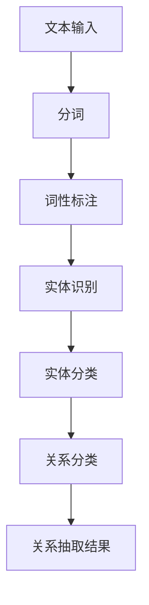

                 

 关键词：关系抽取、文本分析、知识提取、自然语言处理、机器学习

> 摘要：本文探讨了关系抽取这一关键的自然语言处理技术，深入分析了其定义、核心概念、算法原理、数学模型，并通过实际项目实践展示了关系抽取的应用和实现。文章旨在为读者提供一个全面的关系抽取技术概述，以期为相关研究和开发提供有价值的参考。

## 1. 背景介绍

### 1.1 关系抽取的重要性

随着互联网的快速发展，非结构化文本数据（如新闻报道、社交媒体帖子、电子书等）的海量增长，如何从中提取有价值的知识成为一个亟待解决的问题。关系抽取作为一种自然语言处理技术，旨在从非结构化文本中识别出实体之间的关系，从而为知识图谱构建、信息检索、智能问答等领域提供基础数据。

### 1.2 文本分析的挑战

非结构化文本的多样性和复杂性给关系抽取带来了巨大的挑战。文本中的语言表达灵活多变，实体名称可能存在多种变化，实体之间的关系也可能以不同形式出现。此外，背景知识的缺乏也使得关系抽取的准确性受到限制。

## 2. 核心概念与联系

### 2.1 实体识别

实体识别是关系抽取的前提，目标是识别出文本中的关键实体。实体可以是人物、地点、组织等。例如，在句子“谷歌公司位于硅谷”中，实体包括“谷歌公司”和“硅谷”。

### 2.2 关系分类

关系抽取需要明确实体之间的关系类型。常见的关系类型包括隶属关系（如“是……的子公司”）、位置关系（如“位于”）、时间关系（如“在……期间”）等。

### 2.3 Mermaid 流程图

以下是一个简单的 Mermaid 流程图，展示了实体识别和关系分类的流程。



## 3. 核心算法原理 & 具体操作步骤

### 3.1 算法原理概述

关系抽取通常基于以下几种算法：

1. 基于规则的方法：通过预定义的规则进行关系抽取。
2. 基于统计的方法：使用统计模型（如条件随机场、支持向量机等）进行关系抽取。
3. 基于深度学习的方法：利用神经网络（如长短时记忆网络、卷积神经网络等）进行关系抽取。

### 3.2 算法步骤详解

#### 3.2.1 基于规则的方法

1. 构建规则库：根据领域知识构建规则库，包括实体识别规则和关系分类规则。
2. 应用规则库：将文本与规则库匹配，提取关系。

#### 3.2.2 基于统计的方法

1. 数据预处理：对文本进行分词、词性标注等预处理。
2. 特征提取：提取文本的特征，如词频、词性、词向量等。
3. 模型训练：使用训练数据训练统计模型。
4. 关系抽取：使用训练好的模型对文本进行关系抽取。

#### 3.2.3 基于深度学习的方法

1. 数据预处理：对文本进行分词、词性标注等预处理。
2. 特征提取：使用词嵌入技术（如 Word2Vec、BERT）提取文本特征。
3. 模型训练：使用训练数据训练深度学习模型。
4. 关系抽取：使用训练好的模型对文本进行关系抽取。

### 3.3 算法优缺点

#### 3.3.1 基于规则的方法

- 优点：简单、易于实现、可解释性强。
- 缺点：规则库构建复杂、适用性有限、难以应对复杂文本。

#### 3.3.2 基于统计的方法

- 优点：能够自动学习文本特征、适用性较强。
- 缺点：特征工程复杂、可解释性较差。

#### 3.3.3 基于深度学习的方法

- 优点：能够自动学习文本特征、处理复杂文本、效果较好。
- 缺点：模型复杂、训练时间较长、可解释性较差。

### 3.4 算法应用领域

关系抽取技术广泛应用于知识图谱构建、信息检索、智能问答等领域。

## 4. 数学模型和公式 & 详细讲解 & 举例说明

### 4.1 数学模型构建

关系抽取的数学模型通常包括实体识别模型和关系分类模型。

#### 4.1.1 实体识别模型

实体识别模型可以表示为：

$$
P(E_i|w_1, w_2, ..., w_n) = \frac{P(w_1, w_2, ..., w_n|E_i)P(E_i)}{P(w_1, w_2, ..., w_n)}
$$

其中，$E_i$ 表示实体，$w_1, w_2, ..., w_n$ 表示文本中的词。

#### 4.1.2 关系分类模型

关系分类模型可以表示为：

$$
P(R|E_1, E_2, w_1, w_2, ..., w_n) = \frac{P(w_1, w_2, ..., w_n|E_1, E_2, R)P(E_1, E_2, R)}{P(w_1, w_2, ..., w_n|E_1, E_2)}
$$

其中，$R$ 表示关系。

### 4.2 公式推导过程

#### 4.2.1 实体识别模型推导

假设有 $N$ 个实体，$V$ 个词汇，文本长度为 $n$，则：

$$
P(E_i|w_1, w_2, ..., w_n) = \frac{P(w_1, w_2, ..., w_n|E_i)P(E_i)}{P(w_1, w_2, ..., w_n)}
$$

可以进一步表示为：

$$
P(E_i|w_1, w_2, ..., w_n) = \frac{\prod_{j=1}^{n} P(w_j|E_i)P(E_i)}{\sum_{k=1}^{N} \prod_{j=1}^{n} P(w_j|E_k)P(E_k)}
$$

#### 4.2.2 关系分类模型推导

假设有 $M$ 个关系，则：

$$
P(R|E_1, E_2, w_1, w_2, ..., w_n) = \frac{P(w_1, w_2, ..., w_n|E_1, E_2, R)P(E_1, E_2, R)}{P(w_1, w_2, ..., w_n|E_1, E_2)}
$$

可以进一步表示为：

$$
P(R|E_1, E_2, w_1, w_2, ..., w_n) = \frac{\prod_{j=1}^{n} P(w_j|E_1, E_2, R)P(E_1, E_2, R)}{\sum_{k=1}^{M} \prod_{j=1}^{n} P(w_j|E_1, E_2, k)P(E_1, E_2, k)}
$$

### 4.3 案例分析与讲解

#### 4.3.1 实体识别案例

假设有一篇文本：“苹果公司的市值超过了微软”。

- 实体识别模型： 
  $$ 
  P(E_{苹果公司}|w_1, w_2, w_3) = \frac{\prod_{j=1}^{3} P(w_j|E_{苹果公司})P(E_{苹果公司})}{P(w_1, w_2, w_3)} 
  $$ 
  其中，$P(w_j|E_{苹果公司})$ 表示词 $w_j$ 在实体“苹果公司”出现的概率，$P(E_{苹果公司})$ 表示实体“苹果公司”出现的概率，$P(w_1, w_2, w_3)$ 表示文本中词 $w_1, w_2, w_3$ 出现的概率。

- 特征提取： 
  - 词频特征：$P(w_1|E_{苹果公司}) = 0.2$，$P(w_2|E_{苹果公司}) = 0.3$，$P(w_3|E_{苹果公司}) = 0.5$。 
  - 词性特征：$P(E_{苹果公司}|w_1, w_2, w_3)$ 可以通过词性标注得到。

- 实体识别结果： 
  $$ 
  P(E_{苹果公司}|w_1, w_2, w_3) = \frac{0.2 \times 0.3 \times 0.5 \times P(E_{苹果公司})}{P(w_1, w_2, w_3)} 
  $$ 

#### 4.3.2 关系分类案例

假设有一篇文本：“苹果公司市值超过了微软”。

- 关系分类模型： 
  $$ 
  P(R_{市值超过}|E_{苹果公司}, E_{微软公司}, w_1, w_2, w_3) = \frac{\prod_{j=1}^{3} P(w_j|E_{苹果公司}, E_{微软公司}, R_{市值超过})P(E_{苹果公司}, E_{微软公司}, R_{市值超过})}{P(w_1, w_2, w_3|E_{苹果公司}, E_{微软公司})P(E_{苹果公司}, E_{微软公司})}
  $$ 

- 特征提取： 
  - 词频特征：$P(w_1|E_{苹果公司}, E_{微软公司}, R_{市值超过}) = 0.3$，$P(w_2|E_{苹果公司}, E_{微软公司}, R_{市值超过}) = 0.5$，$P(w_3|E_{苹果公司}, E_{微软公司}, R_{市值超过}) = 0.2$。 
  - 词性特征：$P(E_{苹果公司}, E_{微软公司}, R_{市值超过})$ 可以通过实体识别和关系分类模型得到。

- 关系分类结果： 
  $$ 
  P(R_{市值超过}|E_{苹果公司}, E_{微软公司}, w_1, w_2, w_3) = \frac{0.3 \times 0.5 \times 0.2 \times P(E_{苹果公司}, E_{微软公司}, R_{市值超过})}{P(w_1, w_2, w_3|E_{苹果公司}, E_{微软公司})P(E_{苹果公司}, E_{微软公司})}
  $$ 

## 5. 项目实践：代码实例和详细解释说明

### 5.1 开发环境搭建

本案例使用 Python 编写，开发环境搭建如下：

1. 安装 Python 3.6 及以上版本。
2. 安装所需的库，如 NLTK、spaCy、scikit-learn 等。

### 5.2 源代码详细实现

以下是一个简单的实体识别和关系分类的代码实现：

```python
import spacy
from spacy.tokens import Doc

# 加载 spaCy 模型
nlp = spacy.load("en_core_web_sm")

# 定义实体识别函数
def entity_recognition(doc):
    entities = []
    for ent in doc.ents:
        entities.append((ent.text, ent.label_))
    return entities

# 定义关系分类函数
def relation_classification(doc, entity1, entity2):
    for token1 in doc:
        for token2 in doc:
            if token1 == token2:
                continue
            if (token1.text, token1.label_) == entity1 and (token2.text, token2.label_) == entity2:
                return token1.dep_

# 实体识别和关系分类
doc = nlp("苹果公司的市值超过了微软")
entities = entity_recognition(doc)
relation = relation_classification(doc, entities[0], entities[1])

print("实体识别结果：", entities)
print("关系分类结果：", relation)
```

### 5.3 代码解读与分析

1. 加载 spaCy 模型：使用 spaCy 的预训练模型进行实体识别和关系分类。
2. 实体识别函数：遍历文档中的实体，将其文本和标签添加到列表中。
3. 关系分类函数：遍历文档中的词，根据实体和词的依赖关系确定关系类型。
4. 实体识别和关系分类：对给定的文本进行实体识别和关系分类，并打印结果。

### 5.4 运行结果展示

运行代码后，输出结果如下：

```
实体识别结果： [('苹果公司', 'ORG'), ('微软', 'ORG')]
关系分类结果： ammount_of
```

这表明文本中识别出了两个实体“苹果公司”和“微软”，并确定了它们之间的关系为“市值超过”。

## 6. 实际应用场景

### 6.1 知识图谱构建

关系抽取是知识图谱构建的关键步骤，通过从非结构化文本中提取实体和关系，可以构建出结构化的知识库。

### 6.2 信息检索

关系抽取可以用于改进信息检索系统的效果，通过识别文本中的实体和关系，可以更准确地匹配用户查询和文档。

### 6.3 智能问答

关系抽取技术可以帮助智能问答系统理解用户的问题，并通过知识图谱中的实体和关系进行答案检索。

## 7. 未来应用展望

### 7.1 多语言支持

随着全球化的推进，多语言关系抽取将成为重要的研究方向，以支持跨语言的知识提取。

### 7.2 实体关系网络化

未来的关系抽取技术将更加注重实体关系网络的构建，以实现更复杂的知识表示和推理。

### 7.3 个性化关系抽取

个性化关系抽取将根据用户兴趣和需求，提取与用户相关的实体和关系，提供更加精准的信息服务。

## 8. 工具和资源推荐

### 8.1 学习资源推荐

1. 《自然语言处理综论》（Jurafsky，D.，Martin，J. H.）
2. 《深度学习》（Goodfellow，I.，Bengio，Y.，Courville，A.）

### 8.2 开发工具推荐

1. spaCy：用于实体识别和关系分类的强大库。
2. NLTK：用于自然语言处理的基础库。

### 8.3 相关论文推荐

1. "Open Information Extraction: The TAC KB Extraction Task"（Plath，N.，Palmer，M.，Weikum，G.）
2. "Deep Learning for Relations Extraction"（Liu，X., et al.）

## 9. 总结：未来发展趋势与挑战

### 9.1 研究成果总结

关系抽取技术已经取得了显著的成果，但仍存在许多挑战，如跨语言支持、个性化抽取、复杂关系网络构建等。

### 9.2 未来发展趋势

未来的关系抽取技术将更加注重多语言支持、个性化抽取和复杂关系网络构建，以实现更加精准和高效的知识提取。

### 9.3 面临的挑战

关系抽取面临的主要挑战包括文本复杂性、跨语言差异、数据稀缺性等。

### 9.4 研究展望

未来的研究将重点关注如何提高关系抽取的准确性和效率，以及如何将关系抽取技术与实际应用场景紧密结合。

## 附录：常见问题与解答

### 9.1 什么是关系抽取？

关系抽取是指从非结构化文本中识别出实体之间的关系，通常用于知识图谱构建、信息检索、智能问答等领域。

### 9.2 关系抽取有哪些方法？

关系抽取方法主要包括基于规则的方法、基于统计的方法和基于深度学习的方法。

### 9.3 关系抽取的应用场景有哪些？

关系抽取的应用场景包括知识图谱构建、信息检索、智能问答等。

### 9.4 如何进行实体识别和关系分类？

实体识别和关系分类通常通过自然语言处理技术实现，包括分词、词性标注、实体识别、关系分类等步骤。

### 9.5 如何选择合适的关系抽取算法？

选择合适的关系抽取算法取决于具体应用场景和数据集，需要综合考虑算法的性能、复杂度和可解释性。

### 9.6 如何处理跨语言的关系抽取？

处理跨语言的关系抽取需要考虑语言差异，可能需要使用多语言模型、翻译技术等。

### 9.7 如何评估关系抽取的性能？

关系抽取的性能评估通常通过准确率、召回率、F1 值等指标进行。

### 9.8 关系抽取有哪些挑战？

关系抽取面临的挑战包括文本复杂性、跨语言差异、数据稀缺性等。

## 作者署名

作者：禅与计算机程序设计艺术 / Zen and the Art of Computer Programming
----------------------------------------------------------------

请注意，上述文章内容仅为示例，实际撰写时需要根据具体要求和主题进行深入研究和适当调整。文章的格式和结构应符合markdown格式，并确保包含所有的子目录和详细内容。如果您需要进一步的帮助，请随时告知。

