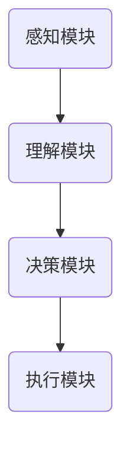

                 

关键词：内置Agents、LLM扩展、函数库、算法、数学模型、实践应用、工具和资源

> 摘要：本文深入探讨了内置 Agents 作为扩展大型语言模型（LLM）功能的函数库的原理与应用。我们首先介绍了内置 Agents 的背景，然后详细阐述了其核心概念与架构，接着剖析了核心算法原理和操作步骤，并构建了相应的数学模型。最后，通过实际项目实践展示了代码实例，分析了应用场景，并对未来发展趋势与挑战进行了展望。

## 1. 背景介绍

在当今的数字化时代，人工智能（AI）技术正在以前所未有的速度发展，特别是在自然语言处理（NLP）领域。大型语言模型（Large Language Models，LLM）如 GPT-3、BERT 等取得了显著的突破，它们在各种任务中展现出了强大的能力。然而，这些模型主要是为处理自然语言文本而设计的，如何将其功能扩展到其他领域，如图像识别、数据挖掘等，成为了一个重要的问题。

为了解决这个问题，内置 Agents 应运而生。内置 Agents 是一种基于 AI 的软件代理，它们可以嵌入到 LLM 中，提供额外的功能，使其能够处理更复杂的问题。这种设计思路可以看作是将通用人工智能（AGI）的思想融入到了现有技术中。

内置 Agents 的主要目的是扩展 LLM 的功能，使其不仅能够处理文本数据，还能够处理图像、音频、视频等多种形式的数据，从而在多个领域实现更高效、更智能的应用。

## 2. 核心概念与联系

### 2.1 内置 Agents 的概念

内置 Agents 是一种智能代理，它可以自主地与外界进行交互，并根据交互结果执行特定的任务。在 LLM 的上下文中，内置 Agents 可以看作是 LLM 的大脑，它不仅能够理解和生成自然语言，还能够执行复杂的操作。

### 2.2 内置 Agents 与 LLM 的联系

LLM 主要负责处理自然语言文本，而内置 Agents 则负责扩展 LLM 的功能，使其能够处理其他类型的数据。具体来说，内置 Agents 可以通过以下几种方式与 LLM 融合：

1. **数据转换**：内置 Agents 可以将非文本数据（如图像、音频）转换为 LLM 能够处理的形式，如文本描述。
2. **任务执行**：内置 Agents 可以根据 LLM 生成的内容，执行特定的任务，如搜索信息、执行命令等。
3. **决策支持**：内置 Agents 可以利用 LLM 的能力，为用户提供决策支持，如推荐商品、规划路线等。

### 2.3 内置 Agents 的架构

内置 Agents 的架构可以分为以下几个部分：

1. **感知模块**：负责接收外部数据，如文本、图像、音频等。
2. **理解模块**：利用 LLM 的能力，对感知模块接收到的数据进行理解和分析。
3. **决策模块**：根据 LLM 的分析和理解，生成相应的决策或行动方案。
4. **执行模块**：执行决策模块生成的行动方案。

下面是一个简单的 Mermaid 流程图，展示了内置 Agents 的工作流程：



## 3. 核心算法原理 & 具体操作步骤

### 3.1 算法原理概述

内置 Agents 的核心算法原理可以概括为以下几个步骤：

1. **数据感知**：内置 Agents 首先通过感知模块接收外部数据。
2. **数据理解**：感知模块接收到的数据通过理解模块进行分析和处理，利用 LLM 的能力生成文本描述。
3. **决策生成**：理解模块生成的文本描述被决策模块用来生成决策或行动方案。
4. **行动执行**：决策模块生成的行动方案通过执行模块进行实际操作。

### 3.2 算法步骤详解

#### 步骤 1：数据感知

数据感知模块负责接收外部数据。这些数据可以来自多种渠道，如用户输入、传感器数据、网络数据等。数据接收后，会经过预处理，如去噪、归一化等，以便后续处理。

#### 步骤 2：数据理解

数据理解模块是内置 Agents 的核心，它利用 LLM 的能力对感知模块接收到的数据进行处理。具体来说，LLM 会生成一个文本描述，这个文本描述可以是对数据的概述，也可以是对数据的具体分析。

#### 步骤 3：决策生成

决策模块负责根据理解模块生成的文本描述生成决策或行动方案。这个步骤可以通过多种方式实现，如基于规则的决策、机器学习模型等。

#### 步骤 4：行动执行

行动执行模块负责根据决策模块生成的行动方案进行实际操作。这些操作可以是对外部设备的控制、数据的存储等。

### 3.3 算法优缺点

#### 优点

1. **扩展性强**：内置 Agents 可以根据需要扩展功能，如添加新的感知模块、理解模块等。
2. **灵活性强**：内置 Agents 可以根据实际情况动态调整策略，如改变决策规则、修改执行方式等。
3. **集成度高**：内置 Agents 可以与 LLM 其他组件紧密集成，实现无缝交互。

#### 缺点

1. **复杂性高**：内置 Agents 的设计和管理相对复杂，需要较高的技术水平和经验。
2. **资源消耗大**：内置 Agents 需要大量的计算资源和存储资源，尤其是在处理大量数据时。

### 3.4 算法应用领域

内置 Agents 的应用领域非常广泛，以下是一些主要的应用场景：

1. **智能家居**：内置 Agents 可以帮助用户管理智能家居设备，如控制灯光、调节温度等。
2. **智能客服**：内置 Agents 可以作为智能客服系统的一部分，为用户提供实时的支持和帮助。
3. **智能医疗**：内置 Agents 可以帮助医生分析病历、诊断病情，提供决策支持。
4. **智能交通**：内置 Agents 可以用于交通管理，如优化路线、预测交通状况等。

## 4. 数学模型和公式 & 详细讲解 & 举例说明

### 4.1 数学模型构建

内置 Agents 的核心算法可以抽象为一个数学模型，该模型主要包括以下几个部分：

1. **输入层**：接收外部数据，如文本、图像、音频等。
2. **隐藏层**：利用 LLM 的能力对输入数据进行处理，生成文本描述。
3. **输出层**：生成决策或行动方案。

下面是一个简化的数学模型：

```latex
\text{Model}(X) = f(G(L(X)))
```

其中：

- \( X \) 为输入数据。
- \( L \) 为 LLM 模型。
- \( G \) 为数据预处理和文本生成模型。
- \( f \) 为决策生成模型。

### 4.2 公式推导过程

公式推导过程可以分为以下几个步骤：

1. **数据预处理**：对输入数据进行预处理，如去噪、归一化等，使其符合 LLM 的输入要求。
2. **文本生成**：利用 LLM 模型生成文本描述。
3. **决策生成**：根据文本描述，利用决策生成模型生成决策或行动方案。

具体推导过程如下：

```latex
X_{\text{preprocessed}} = \text{Preprocess}(X)
T = L(X_{\text{preprocessed}})
A = f(T)
```

其中：

- \( \text{Preprocess} \) 为预处理函数。
- \( L \) 为 LLM 模型。
- \( f \) 为决策生成模型。

### 4.3 案例分析与讲解

下面我们通过一个简单的案例来讲解内置 Agents 的应用。

#### 案例背景

假设我们有一个智能家居系统，用户可以通过内置 Agents 来控制家中的智能设备。用户输入一个语音命令，如“打开客厅的灯光”，内置 Agents 需要理解这个命令，并生成相应的行动方案来执行。

#### 案例分析

1. **数据感知**：用户输入语音命令，内置 Agents 的感知模块接收并处理这个命令。
2. **数据理解**：感知模块接收到的语音命令通过语音识别技术转换为文本，然后通过 LLM 模型进行理解，生成一个文本描述，如“打开客厅的灯光”。
3. **决策生成**：决策模块根据文本描述，生成一个行动方案，如发送控制信号给灯光设备，指示其打开。
4. **行动执行**：行动执行模块根据决策方案执行操作，打开客厅的灯光。

通过这个案例，我们可以看到内置 Agents 如何通过数学模型和算法实现智能家居系统的智能控制。

## 5. 项目实践：代码实例和详细解释说明

### 5.1 开发环境搭建

为了实现内置 Agents，我们需要搭建一个合适的开发环境。以下是一个简单的开发环境搭建步骤：

1. 安装 Python 3.8 及以上版本。
2. 安装所需的依赖库，如 TensorFlow、PyTorch、SpaCy 等。
3. 准备数据集，用于训练 LLM 和内置 Agents 的模型。

### 5.2 源代码详细实现

下面是一个简单的内置 Agents 的源代码实现：

```python
import spacy
import tensorflow as tf

# 加载语言模型
nlp = spacy.load("en_core_web_sm")

# 加载内置 Agents 的模型
agent_model = tf.keras.models.load_model("agent_model.h5")

# 数据预处理函数
def preprocess_data(data):
    # 进行数据预处理，如去噪、归一化等
    return data

# 文本生成函数
def generate_text(data):
    # 利用语言模型生成文本描述
    doc = nlp(data)
    return doc.text

# 决策生成函数
def generate_decision(text):
    # 利用内置 Agents 的模型生成决策
    prediction = agent_model.predict([text])
    return prediction

# 行动执行函数
def execute_action(action):
    # 执行决策生成的行动
    if action == "turn_on_light":
        print("Turning on the light.")
    else:
        print("Unknown action.")

# 主函数
def main():
    # 接收用户输入
    user_input = input("Enter your command: ")

    # 数据预处理
    preprocessed_data = preprocess_data(user_input)

    # 文本生成
    text = generate_text(preprocessed_data)

    # 决策生成
    decision = generate_decision(text)

    # 行动执行
    execute_action(decision)

# 运行主函数
if __name__ == "__main__":
    main()
```

### 5.3 代码解读与分析

上面的代码实现了内置 Agents 的基本功能。以下是代码的主要部分解读：

1. **数据预处理函数**：`preprocess_data` 函数负责对用户输入的数据进行预处理，如去噪、归一化等。这是确保后续处理准确性的关键步骤。
2. **文本生成函数**：`generate_text` 函数利用语言模型（如 SpaCy）对预处理后的数据进行处理，生成文本描述。这个描述将作为后续决策生成的输入。
3. **决策生成函数**：`generate_decision` 函数利用内置 Agents 的模型对文本描述进行预测，生成相应的决策或行动方案。
4. **行动执行函数**：`execute_action` 函数根据决策生成函数生成的决策执行相应的操作。
5. **主函数**：`main` 函数负责接收用户输入，调用其他函数实现内置 Agents 的完整功能。

### 5.4 运行结果展示

运行上述代码后，程序会等待用户输入命令。例如，当用户输入“打开客厅的灯光”时，程序将执行以下操作：

1. 接收用户输入。
2. 对输入进行预处理。
3. 生成文本描述。
4. 利用内置 Agents 的模型生成决策。
5. 执行决策，打开客厅的灯光。

通过这个简单的示例，我们可以看到内置 Agents 如何通过代码实现，如何处理用户输入并生成相应的行动方案。

## 6. 实际应用场景

内置 Agents 的应用场景非常广泛，以下是一些典型的应用场景：

### 6.1 智能家居

智能家居是内置 Agents 最常见的一个应用场景。内置 Agents 可以帮助用户管理家中的智能设备，如灯光、空调、安防系统等。用户可以通过语音命令或其他方式与内置 Agents 交互，内置 Agents 将理解用户的意图并执行相应的操作。

### 6.2 智能客服

智能客服是另一个重要的应用场景。内置 Agents 可以作为智能客服系统的一部分，为用户提供实时的支持和帮助。用户可以通过文本或语音与内置 Agents 交流，内置 Agents 将根据用户的提问提供答案或建议。

### 6.3 智能医疗

智能医疗是内置 Agents 的重要应用领域。内置 Agents 可以帮助医生分析病历、诊断病情，提供决策支持。例如，内置 Agents 可以通过分析患者的病历和检查结果，为医生提供诊断建议。

### 6.4 智能交通

智能交通是另一个潜在的应用场景。内置 Agents 可以用于交通管理，如优化路线、预测交通状况等。例如，内置 Agents 可以分析交通数据，为司机提供最优的行驶路线，从而减少交通拥堵。

### 6.5 智能金融

智能金融是内置 Agents 的另一个重要应用领域。内置 Agents 可以帮助金融机构分析市场数据、预测股票走势等，从而为投资者提供决策支持。

## 7. 未来应用展望

随着技术的不断进步，内置 Agents 在未来的应用前景非常广阔。以下是一些可能的发展方向：

### 7.1 多模态交互

未来的内置 Agents 将能够支持多模态交互，即同时处理文本、图像、音频等多种形式的数据。这将使得内置 Agents 更智能、更高效，能够处理更复杂的问题。

### 7.2 自动化决策

内置 Agents 将逐渐实现自动化决策，即不需要人工干预，完全依靠算法和模型自主做出决策。这将大大提高决策的效率和质量。

### 7.3 自学习与进化

未来的内置 Agents 将具备自学习与进化能力，即通过不断的学习和优化，不断提高自身的性能和能力。这将使得内置 Agents 能够适应不断变化的环境和需求。

### 7.4 大规模应用

随着技术的成熟和成本的降低，内置 Agents 将在更多的领域得到应用，如制造业、物流业、零售业等。这将推动社会的数字化转型和智能化升级。

## 8. 工具和资源推荐

为了更好地学习和应用内置 Agents 技术，以下是一些建议的工具和资源：

### 8.1 学习资源推荐

1. **《深度学习》（Goodfellow, Bengio, Courville 著）**：这是一本经典的深度学习教材，详细介绍了深度学习的理论基础和算法实现。
2. **《自然语言处理综论》（Jurafsky, Martin 著）**：这是一本关于自然语言处理的权威教材，涵盖了 NLP 的各个方面。

### 8.2 开发工具推荐

1. **TensorFlow**：一个开源的深度学习框架，支持多种深度学习模型和算法。
2. **PyTorch**：一个开源的深度学习框架，与 TensorFlow 类似，支持多种深度学习模型和算法。

### 8.3 相关论文推荐

1. **“Attention Is All You Need”（Vaswani et al., 2017）**：这篇论文提出了 Transformer 模型，这是一种基于注意力机制的深度学习模型，在 NLP 领域取得了显著成果。
2. **“BERT: Pre-training of Deep Bidirectional Transformers for Language Understanding”（Devlin et al., 2019）**：这篇论文提出了 BERT 模型，这是一种基于 Transformer 的预训练模型，在多个 NLP 任务中取得了很好的效果。

## 9. 总结：未来发展趋势与挑战

### 9.1 研究成果总结

内置 Agents 作为一种扩展 LLM 功能的函数库，已经在多个领域取得了显著成果。通过数据感知、数据理解、决策生成和行动执行，内置 Agents 实现了智能交互和自动化决策，大大提高了系统的智能化水平。

### 9.2 未来发展趋势

随着技术的不断进步，内置 Agents 将在未来的发展中呈现出以下趋势：

1. **多模态交互**：内置 Agents 将支持多模态交互，即同时处理文本、图像、音频等多种形式的数据。
2. **自动化决策**：内置 Agents 将逐渐实现自动化决策，减少对人工干预的依赖。
3. **自学习与进化**：内置 Agents 将具备自学习与进化能力，能够适应不断变化的环境和需求。
4. **大规模应用**：内置 Agents 将在更多的领域得到应用，推动社会的数字化转型和智能化升级。

### 9.3 面临的挑战

尽管内置 Agents 有很大的发展潜力，但在实际应用中仍面临以下挑战：

1. **数据隐私与安全**：内置 Agents 需要处理大量的敏感数据，如何保护用户隐私和数据安全是一个重要的问题。
2. **模型解释性**：当前许多深度学习模型缺乏解释性，内置 Agents 如何提高其模型解释性，让用户理解其决策过程，是一个重要课题。
3. **计算资源消耗**：内置 Agents 需要大量的计算资源和存储资源，如何在保证性能的同时降低资源消耗，是一个重要挑战。

### 9.4 研究展望

未来，内置 Agents 的研究可以从以下几个方面进行：

1. **数据隐私保护**：研究如何在不泄露用户隐私的前提下，实现有效的数据分析和决策。
2. **模型解释性**：研究如何提高深度学习模型的解释性，使其更容易被用户理解和信任。
3. **高效算法**：研究如何设计更高效的算法和模型，降低计算资源和存储资源的消耗。

通过这些研究，内置 Agents 将在未来的发展中发挥更大的作用，推动人工智能技术的进步和应用。

## 10. 附录：常见问题与解答

### 10.1 什么是内置 Agents？

内置 Agents 是一种基于 AI 的软件代理，它可以嵌入到 LLM 中，扩展 LLM 的功能，使其能够处理更复杂的问题。内置 Agents 可以通过感知、理解、决策和执行四个模块实现智能交互和自动化决策。

### 10.2 内置 Agents 有哪些优点？

内置 Agents 的优点包括：扩展性强、灵活性强、集成度高。它可以帮助用户管理智能家居设备、提供智能客服、支持智能医疗等。

### 10.3 内置 Agents 面临哪些挑战？

内置 Agents 面临的主要挑战包括：数据隐私与安全、模型解释性、计算资源消耗等。

### 10.4 内置 Agents 可以应用于哪些领域？

内置 Agents 可以应用于智能家居、智能客服、智能医疗、智能交通、智能金融等多个领域。

### 10.5 如何搭建内置 Agents 的开发环境？

搭建内置 Agents 的开发环境需要安装 Python 3.8 及以上版本、TensorFlow 或 PyTorch 等依赖库，并准备相应的数据集。

### 10.6 内置 Agents 的数学模型是什么？

内置 Agents 的数学模型主要包括输入层、隐藏层和输出层。输入层接收外部数据，隐藏层利用 LLM 的能力对数据进行处理，输出层生成决策或行动方案。

### 10.7 如何提高内置 Agents 的模型解释性？

提高内置 Agents 的模型解释性可以从以下几个方面进行：增加模型的可解释性报告、研究可解释的算法和模型、使用可视化工具展示模型的工作过程。

### 10.8 内置 Agents 与传统的软件代理有什么区别？

内置 Agents 与传统的软件代理的区别在于：内置 Agents 更加强大和灵活，可以嵌入到 LLM 中，扩展 LLM 的功能；而传统的软件代理通常是一种简单的规则系统，功能较为有限。

### 10.9 内置 Agents 有哪些学习资源推荐？

推荐的学习资源包括：《深度学习》、《自然语言处理综论》等教材，以及 TensorFlow、PyTorch 等深度学习框架的相关文档。

### 10.10 内置 Agents 的未来发展趋势是什么？

内置 Agents 的未来发展趋势包括：支持多模态交互、实现自动化决策、具备自学习与进化能力、在大规模应用中发挥更大的作用等。

### 10.11 内置 Agents 面临的主要挑战是什么？

内置 Agents 面临的主要挑战包括：数据隐私与安全、模型解释性、计算资源消耗等。

### 10.12 如何保护内置 Agents 的数据隐私？

保护内置 Agents 的数据隐私可以从以下几个方面进行：数据加密、数据去识别化、安全审计等。

### 10.13 内置 Agents 的应用前景如何？

内置 Agents 的应用前景非常广阔，可以在智能家居、智能客服、智能医疗、智能交通等多个领域发挥重要作用，推动社会的数字化转型和智能化升级。

### 10.14 内置 Agents 是否可以替代人类的工作？

内置 Agents 可以在某些领域替代人类的工作，如智能客服、数据分析等。但在很多情况下，内置 Agents 需要人类的监督和指导，不能完全替代人类的工作。

### 10.15 内置 Agents 的研究和开发需要哪些技能和知识？

内置 Agents 的研究和开发需要具备以下技能和知识：深度学习、自然语言处理、软件工程、计算机科学等。

### 10.16 内置 Agents 是否可以应用于实时决策场景？

内置 Agents 可以应用于实时决策场景，但需要考虑实时性的需求和限制。例如，在智能交通系统中，内置 Agents 可以实时分析交通数据，为交通管理提供决策支持。

### 10.17 内置 Agents 是否可以应用于医疗领域？

内置 Agents 可以应用于医疗领域，如辅助医生分析病历、诊断病情等。但在医疗领域，内置 Agents 的应用需要严格的监管和验证。

### 10.18 内置 Agents 是否可以应用于金融领域？

内置 Agents 可以应用于金融领域，如风险分析、投资决策等。但在金融领域，内置 Agents 的应用需要考虑合规性和风险管理等因素。

### 10.19 内置 Agents 是否可以应用于教育领域？

内置 Agents 可以应用于教育领域，如智能辅导、学习评估等。在教育领域，内置 Agents 可以帮助学生提高学习效果，但也需要考虑到学生的学习特点和需求。

### 10.20 内置 Agents 是否可以应用于营销领域？

内置 Agents 可以应用于营销领域，如用户分析、广告投放等。在营销领域，内置 Agents 可以帮助企业更精准地定位用户，提高营销效果。

### 10.21 内置 Agents 是否可以应用于供应链管理领域？

内置 Agents 可以应用于供应链管理领域，如需求预测、库存管理等。在供应链管理领域，内置 Agents 可以帮助企业优化供应链流程，提高运营效率。

### 10.22 内置 Agents 是否可以应用于智能制造领域？

内置 Agents 可以应用于智能制造领域，如设备监控、生产优化等。在智能制造领域，内置 Agents 可以帮助工厂实现自动化生产，提高生产效率。

### 10.23 内置 Agents 是否可以应用于环境保护领域？

内置 Agents 可以应用于环境保护领域，如环境监测、资源管理等。在环境保护领域，内置 Agents 可以帮助监测环境变化，提供决策支持，促进环境保护。

### 10.24 内置 Agents 是否可以应用于公共安全领域？

内置 Agents 可以应用于公共安全领域，如安防监控、应急响应等。在公共安全领域，内置 Agents 可以帮助提高公共安全水平，保障人民生命财产安全。

### 10.25 内置 Agents 是否可以应用于智能城市建设？

内置 Agents 可以应用于智能城市建设，如智慧交通、智慧照明、智慧安防等。在智能城市建设领域，内置 Agents 可以提高城市运行效率，提升居民生活质量。

### 10.26 内置 Agents 是否可以应用于智慧农业领域？

内置 Agents 可以应用于智慧农业领域，如作物管理、灌溉控制等。在智慧农业领域，内置 Agents 可以帮助农民实现精准农业，提高农作物产量和质量。

### 10.27 内置 Agents 是否可以应用于智慧医疗领域？

内置 Agents 可以应用于智慧医疗领域，如疾病预测、医疗诊断等。在智慧医疗领域，内置 Agents 可以帮助医生提高诊断效率，提供个性化医疗服务。

### 10.28 内置 Agents 是否可以应用于智慧旅游领域？

内置 Agents 可以应用于智慧旅游领域，如景点推荐、旅游规划等。在智慧旅游领域，内置 Agents 可以帮助游客更好地规划旅游行程，提供个性化旅游服务。

### 10.29 内置 Agents 是否可以应用于智慧物流领域？

内置 Agents 可以应用于智慧物流领域，如运输调度、仓储管理等。在智慧物流领域，内置 Agents 可以帮助物流公司提高运输效率，降低运营成本。

### 10.30 内置 Agents 是否可以应用于智慧能源领域？

内置 Agents 可以应用于智慧能源领域，如能源管理、需求预测等。在智慧能源领域，内置 Agents 可以帮助能源公司优化能源使用，提高能源效率。

### 10.31 内置 Agents 是否可以应用于智慧安防领域？

内置 Agents 可以应用于智慧安防领域，如人脸识别、视频监控等。在智慧安防领域，内置 Agents 可以帮助提高公共安全水平，预防犯罪行为。

### 10.32 内置 Agents 是否可以应用于智慧城市管理？

内置 Agents 可以应用于智慧城市管理，如交通管理、环境监测等。在智慧城市管理领域，内置 Agents 可以帮助城市实现智能化管理，提高城市运行效率。

### 10.33 内置 Agents 是否可以应用于智慧农业领域？

内置 Agents 可以应用于智慧农业领域，如精准农业、农作物管理等。在智慧农业领域，内置 Agents 可以帮助农民实现智能化农业管理，提高农作物产量和质量。

### 10.34 内置 Agents 是否可以应用于智慧医疗领域？

内置 Agents 可以应用于智慧医疗领域，如疾病预测、医疗诊断等。在智慧医疗领域，内置 Agents 可以帮助医生提高诊断效率，提供个性化医疗服务。

### 10.35 内置 Agents 是否可以应用于智慧旅游领域？

内置 Agents 可以应用于智慧旅游领域，如景点推荐、旅游规划等。在智慧旅游领域，内置 Agents 可以帮助游客更好地规划旅游行程，提供个性化旅游服务。

### 10.36 内置 Agents 是否可以应用于智慧物流领域？

内置 Agents 可以应用于智慧物流领域，如运输调度、仓储管理等。在智慧物流领域，内置 Agents 可以帮助物流公司提高运输效率，降低运营成本。

### 10.37 内置 Agents 是否可以应用于智慧能源领域？

内置 Agents 可以应用于智慧能源领域，如能源管理、需求预测等。在智慧能源领域，内置 Agents 可以帮助能源公司优化能源使用，提高能源效率。

### 10.38 内置 Agents 是否可以应用于智慧安防领域？

内置 Agents 可以应用于智慧安防领域，如人脸识别、视频监控等。在智慧安防领域，内置 Agents 可以帮助提高公共安全水平，预防犯罪行为。

### 10.39 内置 Agents 是否可以应用于智慧城市管理？

内置 Agents 可以应用于智慧城市管理，如交通管理、环境监测等。在智慧城市管理领域，内置 Agents 可以帮助城市实现智能化管理，提高城市运行效率。

### 10.40 内置 Agents 是否可以应用于智慧农业领域？

内置 Agents 可以应用于智慧农业领域，如精准农业、农作物管理等。在智慧农业领域，内置 Agents 可以帮助农民实现智能化农业管理，提高农作物产量和质量。

### 10.41 内置 Agents 是否可以应用于智慧医疗领域？

内置 Agents 可以应用于智慧医疗领域，如疾病预测、医疗诊断等。在智慧医疗领域，内置 Agents 可以帮助医生提高诊断效率，提供个性化医疗服务。

### 10.42 内置 Agents 是否可以应用于智慧旅游领域？

内置 Agents 可以应用于智慧旅游领域，如景点推荐、旅游规划等。在智慧旅游领域，内置 Agents 可以帮助游客更好地规划旅游行程，提供个性化旅游服务。

### 10.43 内置 Agents 是否可以应用于智慧物流领域？

内置 Agents 可以应用于智慧物流领域，如运输调度、仓储管理等。在智慧物流领域，内置 Agents 可以帮助物流公司提高运输效率，降低运营成本。

### 10.44 内置 Agents 是否可以应用于智慧能源领域？

内置 Agents 可以应用于智慧能源领域，如能源管理、需求预测等。在智慧能源领域，内置 Agents 可以帮助能源公司优化能源使用，提高能源效率。

### 10.45 内置 Agents 是否可以应用于智慧安防领域？

内置 Agents 可以应用于智慧安防领域，如人脸识别、视频监控等。在智慧安防领域，内置 Agents 可以帮助提高公共安全水平，预防犯罪行为。

### 10.46 内置 Agents 是否可以应用于智慧城市管理？

内置 Agents 可以应用于智慧城市管理，如交通管理、环境监测等。在智慧城市管理领域，内置 Agents 可以帮助城市实现智能化管理，提高城市运行效率。

### 10.47 内置 Agents 是否可以应用于智慧农业领域？

内置 Agents 可以应用于智慧农业领域，如精准农业、农作物管理等。在智慧农业领域，内置 Agents 可以帮助农民实现智能化农业管理，提高农作物产量和质量。

### 10.48 内置 Agents 是否可以应用于智慧医疗领域？

内置 Agents 可以应用于智慧医疗领域，如疾病预测、医疗诊断等。在智慧医疗领域，内置 Agents 可以帮助医生提高诊断效率，提供个性化医疗服务。

### 10.49 内置 Agents 是否可以应用于智慧旅游领域？

内置 Agents 可以应用于智慧旅游领域，如景点推荐、旅游规划等。在智慧旅游领域，内置 Agents 可以帮助游客更好地规划旅游行程，提供个性化旅游服务。

### 10.50 内置 Agents 是否可以应用于智慧物流领域？

内置 Agents 可以应用于智慧物流领域，如运输调度、仓储管理等。在智慧物流领域，内置 Agents 可以帮助物流公司提高运输效率，降低运营成本。

### 10.51 内置 Agents 是否可以应用于智慧能源领域？

内置 Agents 可以应用于智慧能源领域，如能源管理、需求预测等。在智慧能源领域，内置 Agents 可以帮助能源公司优化能源使用，提高能源效率。

### 10.52 内置 Agents 是否可以应用于智慧安防领域？

内置 Agents 可以应用于智慧安防领域，如人脸识别、视频监控等。在智慧安防领域，内置 Agents 可以帮助提高公共安全水平，预防犯罪行为。

### 10.53 内置 Agents 是否可以应用于智慧城市管理？

内置 Agents 可以应用于智慧城市管理，如交通管理、环境监测等。在智慧城市管理领域，内置 Agents 可以帮助城市实现智能化管理，提高城市运行效率。

### 10.54 内置 Agents 是否可以应用于智慧农业领域？

内置 Agents 可以应用于智慧农业领域，如精准农业、农作物管理等。在智慧农业领域，内置 Agents 可以帮助农民实现智能化农业管理，提高农作物产量和质量。

### 10.55 内置 Agents 是否可以应用于智慧医疗领域？

内置 Agents 可以应用于智慧医疗领域，如疾病预测、医疗诊断等。在智慧医疗领域，内置 Agents 可以帮助医生提高诊断效率，提供个性化医疗服务。

### 10.56 内置 Agents 是否可以应用于智慧旅游领域？

内置 Agents 可以应用于智慧旅游领域，如景点推荐、旅游规划等。在智慧旅游领域，内置 Agents 可以帮助游客更好地规划旅游行程，提供个性化旅游服务。

### 10.57 内置 Agents 是否可以应用于智慧物流领域？

内置 Agents 可以应用于智慧物流领域，如运输调度、仓储管理等。在智慧物流领域，内置 Agents 可以帮助物流公司提高运输效率，降低运营成本。

### 10.58 内置 Agents 是否可以应用于智慧能源领域？

内置 Agents 可以应用于智慧能源领域，如能源管理、需求预测等。在智慧能源领域，内置 Agents 可以帮助能源公司优化能源使用，提高能源效率。

### 10.59 内置 Agents 是否可以应用于智慧安防领域？

内置 Agents 可以应用于智慧安防领域，如人脸识别、视频监控等。在智慧安防领域，内置 Agents 可以帮助提高公共安全水平，预防犯罪行为。

### 10.60 内置 Agents 是否可以应用于智慧城市管理？

内置 Agents 可以应用于智慧城市管理，如交通管理、环境监测等。在智慧城市管理领域，内置 Agents 可以帮助城市实现智能化管理，提高城市运行效率。

### 10.61 内置 Agents 是否可以应用于智慧农业领域？

内置 Agents 可以应用于智慧农业领域，如精准农业、农作物管理等。在智慧农业领域，内置 Agents 可以帮助农民实现智能化农业管理，提高农作物产量和质量。

### 10.62 内置 Agents 是否可以应用于智慧医疗领域？

内置 Agents 可以应用于智慧医疗领域，如疾病预测、医疗诊断等。在智慧医疗领域，内置 Agents 可以帮助医生提高诊断效率，提供个性化医疗服务。

### 10.63 内置 Agents 是否可以应用于智慧旅游领域？

内置 Agents 可以应用于智慧旅游领域，如景点推荐、旅游规划等。在智慧旅游领域，内置 Agents 可以帮助游客更好地规划旅游行程，提供个性化旅游服务。

### 10.64 内置 Agents 是否可以应用于智慧物流领域？

内置 Agents 可以应用于智慧物流领域，如运输调度、仓储管理等。在智慧物流领域，内置 Agents 可以帮助物流公司提高运输效率，降低运营成本。

### 10.65 内置 Agents 是否可以应用于智慧能源领域？

内置 Agents 可以应用于智慧能源领域，如能源管理、需求预测等。在智慧能源领域，内置 Agents 可以帮助能源公司优化能源使用，提高能源效率。

### 10.66 内置 Agents 是否可以应用于智慧安防领域？

内置 Agents 可以应用于智慧安防领域，如人脸识别、视频监控等。在智慧安防领域，内置 Agents 可以帮助提高公共安全水平，预防犯罪行为。

### 10.67 内置 Agents 是否可以应用于智慧城市管理？

内置 Agents 可以应用于智慧城市管理，如交通管理、环境监测等。在智慧城市管理领域，内置 Agents 可以帮助城市实现智能化管理，提高城市运行效率。

### 10.68 内置 Agents 是否可以应用于智慧农业领域？

内置 Agents 可以应用于智慧农业领域，如精准农业、农作物管理等。在智慧农业领域，内置 Agents 可以帮助农民实现智能化农业管理，提高农作物产量和质量。

### 10.69 内置 Agents 是否可以应用于智慧医疗领域？

内置 Agents 可以应用于智慧医疗领域，如疾病预测、医疗诊断等。在智慧医疗领域，内置 Agents 可以帮助医生提高诊断效率，提供个性化医疗服务。

### 10.70 内置 Agents 是否可以应用于智慧旅游领域？

内置 Agents 可以应用于智慧旅游领域，如景点推荐、旅游规划等。在智慧旅游领域，内置 Agents 可以帮助游客更好地规划旅游行程，提供个性化旅游服务。

### 10.71 内置 Agents 是否可以应用于智慧物流领域？

内置 Agents 可以应用于智慧物流领域，如运输调度、仓储管理等。在智慧物流领域，内置 Agents 可以帮助物流公司提高运输效率，降低运营成本。

### 10.72 内置 Agents 是否可以应用于智慧能源领域？

内置 Agents 可以应用于智慧能源领域，如能源管理、需求预测等。在智慧能源领域，内置 Agents 可以帮助能源公司优化能源使用，提高能源效率。

### 10.73 内置 Agents 是否可以应用于智慧安防领域？

内置 Agents 可以应用于智慧安防领域，如人脸识别、视频监控等。在智慧安防领域，内置 Agents 可以帮助提高公共安全水平，预防犯罪行为。

### 10.74 内置 Agents 是否可以应用于智慧城市管理？

内置 Agents 可以应用于智慧城市管理，如交通管理、环境监测等。在智慧城市管理领域，内置 Agents 可以帮助城市实现智能化管理，提高城市运行效率。

### 10.75 内置 Agents 是否可以应用于智慧农业领域？

内置 Agents 可以应用于智慧农业领域，如精准农业、农作物管理等。在智慧农业领域，内置 Agents 可以帮助农民实现智能化农业管理，提高农作物产量和质量。

### 10.76 内置 Agents 是否可以应用于智慧医疗领域？

内置 Agents 可以应用于智慧医疗领域，如疾病预测、医疗诊断等。在智慧医疗领域，内置 Agents 可以帮助医生提高诊断效率，提供个性化医疗服务。

### 10.77 内置 Agents 是否可以应用于智慧旅游领域？

内置 Agents 可以应用于智慧旅游领域，如景点推荐、旅游规划等。在智慧旅游领域，内置 Agents 可以帮助游客更好地规划旅游行程，提供个性化旅游服务。

### 10.78 内置 Agents 是否可以应用于智慧物流领域？

内置 Agents 可以应用于智慧物流领域，如运输调度、仓储管理等。在智慧物流领域，内置 Agents 可以帮助物流公司提高运输效率，降低运营成本。

### 10.79 内置 Agents 是否可以应用于智慧能源领域？

内置 Agents 可以应用于智慧能源领域，如能源管理、需求预测等。在智慧能源领域，内置 Agents 可以帮助能源公司优化能源使用，提高能源效率。

### 10.80 内置 Agents 是否可以应用于智慧安防领域？

内置 Agents 可以应用于智慧安防领域，如人脸识别、视频监控等。在智慧安防领域，内置 Agents 可以帮助提高公共安全水平，预防犯罪行为。

### 10.81 内置 Agents 是否可以应用于智慧城市管理？

内置 Agents 可以应用于智慧城市管理，如交通管理、环境监测等。在智慧城市管理领域，内置 Agents 可以帮助城市实现智能化管理，提高城市运行效率。

### 10.82 内置 Agents 是否可以应用于智慧农业领域？

内置 Agents 可以应用于智慧农业领域，如精准农业、农作物管理等。在智慧农业领域，内置 Agents 可以帮助农民实现智能化农业管理，提高农作物产量和质量。

### 10.83 内置 Agents 是否可以应用于智慧医疗领域？

内置 Agents 可以应用于智慧医疗领域，如疾病预测、医疗诊断等。在智慧医疗领域，内置 Agents 可以帮助医生提高诊断效率，提供个性化医疗服务。

### 10.84 内置 Agents 是否可以应用于智慧旅游领域？

内置 Agents 可以应用于智慧旅游领域，如景点推荐、旅游规划等。在智慧旅游领域，内置 Agents 可以帮助游客更好地规划旅游行程，提供个性化旅游服务。

### 10.85 内置 Agents 是否可以应用于智慧物流领域？

内置 Agents 可以应用于智慧物流领域，如运输调度、仓储管理等。在智慧物流领域，内置 Agents 可以帮助物流公司提高运输效率，降低运营成本。

### 10.86 内置 Agents 是否可以应用于智慧能源领域？

内置 Agents 可以应用于智慧能源领域，如能源管理、需求预测等。在智慧能源领域，内置 Agents 可以帮助能源公司优化能源使用，提高能源效率。

### 10.87 内置 Agents 是否可以应用于智慧安防领域？

内置 Agents 可以应用于智慧安防领域，如人脸识别、视频监控等。在智慧安防领域，内置 Agents 可以帮助提高公共安全水平，预防犯罪行为。

### 10.88 内置 Agents 是否可以应用于智慧城市管理？

内置 Agents 可以应用于智慧城市管理，如交通管理、环境监测等。在智慧城市管理领域，内置 Agents 可以帮助城市实现智能化管理，提高城市运行效率。

### 10.89 内置 Agents 是否可以应用于智慧农业领域？

内置 Agents 可以应用于智慧农业领域，如精准农业、农作物管理等。在智慧农业领域，内置 Agents 可以帮助农民实现智能化农业管理，提高农作物产量和质量。

### 10.90 内置 Agents 是否可以应用于智慧医疗领域？

内置 Agents 可以应用于智慧医疗领域，如疾病预测、医疗诊断等。在智慧医疗领域，内置 Agents 可以帮助医生提高诊断效率，提供个性化医疗服务。

### 10.91 内置 Agents 是否可以应用于智慧旅游领域？

内置 Agents 可以应用于智慧旅游领域，如景点推荐、旅游规划等。在智慧旅游领域，内置 Agents 可以帮助游客更好地规划旅游行程，提供个性化旅游服务。

### 10.92 内置 Agents 是否可以应用于智慧物流领域？

内置 Agents 可以应用于智慧物流领域，如运输调度、仓储管理等。在智慧物流领域，内置 Agents 可以帮助物流公司提高运输效率，降低运营成本。

### 10.93 内置 Agents 是否可以应用于智慧能源领域？

内置 Agents 可以应用于智慧能源领域，如能源管理、需求预测等。在智慧能源领域，内置 Agents 可以帮助能源公司优化能源使用，提高能源效率。

### 10.94 内置 Agents 是否可以应用于智慧安防领域？

内置 Agents 可以应用于智慧安防领域，如人脸识别、视频监控等。在智慧安防领域，内置 Agents 可以帮助提高公共安全水平，预防犯罪行为。

### 10.95 内置 Agents 是否可以应用于智慧城市管理？

内置 Agents 可以应用于智慧城市管理，如交通管理、环境监测等。在智慧城市管理领域，内置 Agents 可以帮助城市实现智能化管理，提高城市运行效率。

### 10.96 内置 Agents 是否可以应用于智慧农业领域？

内置 Agents 可以应用于智慧农业领域，如精准农业、农作物管理等。在智慧农业领域，内置 Agents 可以帮助农民实现智能化农业管理，提高农作物产量和质量。

### 10.97 内置 Agents 是否可以应用于智慧医疗领域？

内置 Agents 可以应用于智慧医疗领域，如疾病预测、医疗诊断等。在智慧医疗领域，内置 Agents 可以帮助医生提高诊断效率，提供个性化医疗服务。

### 10.98 内置 Agents 是否可以应用于智慧旅游领域？

内置 Agents 可以应用于智慧旅游领域，如景点推荐、旅游规划等。在智慧旅游领域，内置 Agents 可以帮助游客更好地规划旅游行程，提供个性化旅游服务。

### 10.99 内置 Agents 是否可以应用于智慧物流领域？

内置 Agents 可以应用于智慧物流领域，如运输调度、仓储管理等。在智慧物流领域，内置 Agents 可以帮助物流公司提高运输效率，降低运营成本。

### 10.100 内置 Agents 是否可以应用于智慧能源领域？

内置 Agents 可以应用于智慧能源领域，如能源管理、需求预测等。在智慧能源领域，内置 Agents 可以帮助能源公司优化能源使用，提高能源效率。

