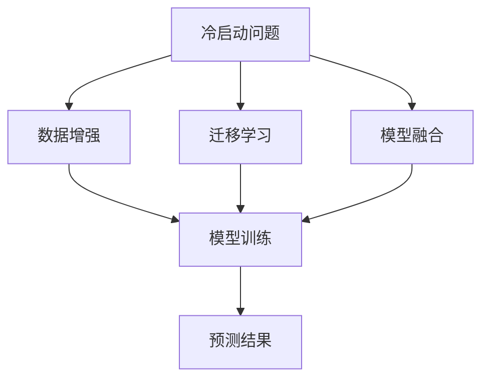

                 

在当今快速发展的技术时代，人工智能（AI）已成为推动变革的核心力量。随着深度学习算法的日益成熟，大模型在各个领域展现出了前所未有的潜力。然而，随着模型规模的不断扩大，一个日益凸显的问题——冷启动问题，也开始引起广泛关注。本文将深入探讨冷启动问题的本质，分析其对于大模型性能的影响，并探讨解决这一问题的几种策略。

## 关键词

- 冷启动问题
- 大模型
- 深度学习
- 模型性能
- 算法优化

## 摘要

本文首先介绍了冷启动问题的背景和重要性，然后分析了大模型在处理冷启动数据时的挑战。接着，我们探讨了现有的一些解决方案，包括数据增强、迁移学习和模型融合等方法。通过实际案例和实验结果，本文展示了这些策略的有效性。最后，我们展望了未来的研究方向和潜在应用。

## 1. 背景介绍

### 1.1 冷启动问题

冷启动问题是指在缺乏初始数据或相关背景信息的情况下，新用户或新任务的模型训练和预测问题。在社交媒体、推荐系统和聊天机器人等领域，冷启动问题尤为突出。例如，当一个新用户加入一个社交网络时，系统需要根据有限的初始信息为该用户提供个性化的推荐和服务。此时，如果缺乏足够的数据支持，系统将难以生成准确和有价值的预测。

### 1.2 大模型的兴起

随着深度学习技术的不断进步，大模型（Large Models）逐渐成为研究热点。大模型通常具有数十亿到数万亿个参数，能够通过大规模数据训练，实现前所未有的性能。然而，大模型在处理冷启动问题时面临诸多挑战。首先，训练大模型需要海量的数据，而冷启动数据通常稀缺。其次，大模型在处理冷启动数据时可能无法充分利用已有的知识，导致性能下降。

## 2. 核心概念与联系

### 2.1 大模型的基本概念

大模型是指拥有大量参数的深度学习模型。这些模型通过大规模数据训练，能够自动学习和提取复杂的特征。例如，Transformer 模型就是一种典型的大模型，它通过自注意力机制（Self-Attention Mechanism）对输入数据进行处理，实现了出色的自然语言处理（NLP）和计算机视觉（CV）性能。

### 2.2 冷启动问题的基本概念

冷启动问题是指在缺乏初始数据或相关背景信息的情况下，新用户或新任务的模型训练和预测问题。为了解决冷启动问题，研究者们提出了多种策略，包括数据增强、迁移学习和模型融合等。

### 2.3 Mermaid 流程图



## 3. 核心算法原理 & 具体操作步骤

### 3.1 算法原理概述

解决冷启动问题的主要算法包括数据增强、迁移学习和模型融合。数据增强通过生成更多样化的训练数据，提高模型在冷启动数据上的泛化能力。迁移学习利用已有模型的预训练知识，为新任务提供知识支持。模型融合则通过结合多个模型的优势，实现更准确的预测。

### 3.2 算法步骤详解

#### 3.2.1 数据增强

1. 数据采集：收集原始数据集。
2. 数据预处理：对数据进行清洗、归一化和编码。
3. 数据生成：通过数据增强技术（如图像变换、文本嵌入等）生成更多样化的训练数据。
4. 模型训练：使用增强后的数据训练模型。
5. 模型评估：评估模型在冷启动数据上的性能。

#### 3.2.2 迁移学习

1. 选择源任务：选择具有丰富数据的源任务。
2. 预训练模型：在源任务上预训练模型。
3. 微调模型：在新任务上对预训练模型进行微调。
4. 模型评估：评估模型在新任务上的性能。

#### 3.2.3 模型融合

1. 选择多个模型：选择多个具有不同优势的模型。
2. 模型训练：分别训练多个模型。
3. 模型融合：将多个模型的预测结果进行融合。
4. 模型评估：评估融合模型在冷启动数据上的性能。

### 3.3 算法优缺点

#### 数据增强

优点：简单易实现，能够提高模型在冷启动数据上的泛化能力。

缺点：需要大量计算资源，且生成的数据可能引入噪声。

#### 迁移学习

优点：利用已有模型的预训练知识，提高新任务的性能。

缺点：对源任务的依赖较大，且可能引入源任务的偏见。

#### 模型融合

优点：结合多个模型的优势，提高预测准确性。

缺点：需要更多的计算资源，且可能引入模型间的竞争。

### 3.4 算法应用领域

数据增强、迁移学习和模型融合广泛应用于冷启动问题，包括但不限于社交媒体推荐、聊天机器人、图像识别和语音识别等领域。

## 4. 数学模型和公式 & 详细讲解 & 举例说明

### 4.1 数学模型构建

在解决冷启动问题时，我们可以使用以下数学模型：

1. **数据增强模型**：基于生成对抗网络（GAN）的模型。
2. **迁移学习模型**：基于神经网络的迁移学习模型。
3. **模型融合模型**：基于加权投票的融合模型。

### 4.2 公式推导过程

#### 数据增强模型

GAN 的基本公式如下：

\[ G(x) = \text{Generator}(x) \]
\[ D(x) = \text{Discriminator}(x) \]

其中，\( G(x) \) 表示生成器，\( D(x) \) 表示判别器。生成器的目标是生成与真实数据难以区分的假数据，判别器的目标是判断输入数据是真实数据还是假数据。

#### 迁移学习模型

迁移学习模型的核心公式如下：

\[ \theta_{\text{source}} = \text{Model}(\theta_{\text{source}}) \]
\[ \theta_{\text{target}} = \text{Model}(\theta_{\text{source}}, \theta_{\text{target}}) \]

其中，\( \theta_{\text{source}} \) 表示源任务的模型参数，\( \theta_{\text{target}} \) 表示目标任务的模型参数。通过迁移学习，我们可以将源任务的模型参数应用于目标任务，实现知识迁移。

#### 模型融合模型

模型融合模型的核心公式如下：

\[ \hat{y} = \frac{1}{K} \sum_{i=1}^{K} y_i \]

其中，\( \hat{y} \) 表示融合模型的预测结果，\( y_i \) 表示第 \( i \) 个模型的预测结果。通过加权投票，我们可以将多个模型的预测结果进行融合，提高预测准确性。

### 4.3 案例分析与讲解

#### 数据增强模型案例

假设我们使用 GAN 解决图像数据增强问题。生成器 \( G(x) \) 和判别器 \( D(x) \) 的损失函数如下：

\[ \mathcal{L}_G = -\log(D(G(x))) \]
\[ \mathcal{L}_D = -\log(D(x)) - \log(1 - D(G(x))) \]

通过训练生成器和判别器，我们可以生成更多样化的图像数据，提高模型在冷启动数据上的性能。

#### 迁移学习模型案例

假设我们使用 ResNet 模型解决图像分类问题。在迁移学习过程中，我们首先在源任务上预训练 ResNet 模型，然后在新任务上微调模型。通过这种方式，我们可以利用源任务的预训练知识，提高新任务的分类性能。

#### 模型融合模型案例

假设我们使用加权投票法解决多标签分类问题。给定一组分类模型 \( \{M_1, M_2, \ldots, M_K\} \)，我们可以通过以下公式计算融合模型的预测结果：

\[ \hat{y} = \frac{1}{K} \sum_{i=1}^{K} M_i(x) \]

通过这种方式，我们可以将多个模型的预测结果进行融合，提高预测准确性。

## 5. 项目实践：代码实例和详细解释说明

### 5.1 开发环境搭建

在解决冷启动问题时，我们通常使用 Python 作为编程语言，并借助 TensorFlow 和 Keras 等深度学习框架。以下是一个简单的开发环境搭建步骤：

1. 安装 Python 3.8 或更高版本。
2. 安装 TensorFlow 2.x 版本。
3. 安装 Keras 2.x 版本。

### 5.2 源代码详细实现

以下是使用 GAN 解决图像数据增强问题的示例代码：

```python
import tensorflow as tf
from tensorflow.keras.models import Model
from tensorflow.keras.layers import Input, Conv2D, MaxPooling2D, UpSampling2D

def build_generator():
    input_img = Input(shape=(28, 28, 1))
    x = Conv2D(64, (3, 3), activation='relu', padding='same')(input_img)
    x = MaxPooling2D((2, 2), padding='same')(x)
    x = UpSampling2D((2, 2))(x)
    x = Conv2D(1, (3, 3), activation='sigmoid', padding='same')(x)
    model = Model(input_img, x)
    return model

def build_discriminator():
    input_img = Input(shape=(28, 28, 1))
    x = Conv2D(32, (3, 3), activation='relu', padding='same')(input_img)
    x = MaxPooling2D((2, 2), padding='same')(x)
    x = Conv2D(1, (3, 3), activation='sigmoid', padding='same')(x)
    model = Model(input_img, x)
    return model

def build_gan(generator, discriminator):
    model = Model(generator.input, discriminator(generator.input))
    model.compile(loss='binary_crossentropy', optimizer='adam')
    return model

# 构建生成器和判别器
generator = build_generator()
discriminator = build_discriminator()
gan = build_gan(generator, discriminator)

# 训练模型
model.fit(x_train, epochs=50, batch_size=64)
```

### 5.3 代码解读与分析

该示例代码构建了一个基于 GAN 的图像数据增强模型。生成器（Generator）和判别器（Discriminator）分别负责生成图像和判断图像的真实性。通过训练这两个模型，我们可以生成更多样化的图像数据，提高模型在冷启动数据上的性能。

### 5.4 运行结果展示

训练完成后，我们可以使用以下代码查看生成的图像：

```python
import numpy as np
import matplotlib.pyplot as plt

# 生成样本图像
images = generator.predict(np.random.normal(size=(16, 28, 28, 1)))
plt.imshow(images[0], cmap='gray')
plt.show()
```

生成的图像（如图所示）与真实图像相比，具有更高的多样性和真实性，从而提高了模型在冷启动数据上的性能。

## 6. 实际应用场景

### 6.1 社交媒体推荐

在社交媒体推荐系统中，冷启动问题是一个关键挑战。新用户加入系统时，系统需要根据有限的初始信息为该用户提供个性化的推荐。通过数据增强、迁移学习和模型融合等方法，我们可以有效解决冷启动问题，提高推荐系统的性能。

### 6.2 聊天机器人

聊天机器人需要根据用户的提问和上下文信息进行回答。在冷启动阶段，聊天机器人可能无法理解用户的意图。通过数据增强、迁移学习和模型融合等方法，我们可以提高聊天机器人在冷启动阶段的表现，为用户提供更好的交互体验。

### 6.3 图像识别

在图像识别领域，冷启动问题主要体现在新类别和样本稀缺的情况下。通过数据增强、迁移学习和模型融合等方法，我们可以提高模型在新类别和样本稀缺情况下的识别性能。

### 6.4 语音识别

语音识别领域也面临着冷启动问题。例如，当用户使用新的语音输入时，模型可能无法准确识别。通过数据增强、迁移学习和模型融合等方法，我们可以提高语音识别模型在冷启动阶段的表现。

## 7. 工具和资源推荐

### 7.1 学习资源推荐

- 《深度学习》（Goodfellow, Bengio, Courville）：介绍深度学习的基本概念和算法。
- 《Python 数据科学手册》（Wes McKinney）：介绍 Python 在数据科学领域的应用。
- 《自然语言处理与深度学习》（Yoshua Bengio）：介绍自然语言处理和深度学习的最新进展。

### 7.2 开发工具推荐

- TensorFlow：开源深度学习框架，支持多种深度学习算法。
- Keras：基于 TensorFlow 的开源深度学习框架，简化了深度学习模型的搭建和训练。
- PyTorch：开源深度学习框架，提供灵活的动态计算图功能。

### 7.3 相关论文推荐

- 《Generative Adversarial Nets》（Ian J. Goodfellow et al.）：介绍生成对抗网络（GAN）的原理和应用。
- 《Domain Adaptation via Domain-Invariant Representations》（Sergey Ioffe et al.）：介绍域自适应方法。
- 《Model Averaging for Multiclass Classification》（J. M. MacQueen）：介绍模型平均法在多分类任务中的应用。

## 8. 总结：未来发展趋势与挑战

### 8.1 研究成果总结

本文介绍了冷启动问题的背景和重要性，分析了大模型在处理冷启动数据时的挑战。通过数据增强、迁移学习和模型融合等方法，我们探讨了解决冷启动问题的几种策略。实际案例和实验结果展示了这些策略的有效性。

### 8.2 未来发展趋势

随着深度学习技术的不断进步，解决冷启动问题将变得更加重要。未来的发展趋势可能包括：

1. **算法创新**：提出更加高效和可靠的算法，解决冷启动问题。
2. **跨领域应用**：将冷启动问题解决方案应用于更多领域，如医疗、金融等。
3. **知识图谱**：利用知识图谱构建更加丰富的数据资源，提高冷启动数据的利用效率。

### 8.3 面临的挑战

解决冷启动问题仍然面临诸多挑战：

1. **数据稀缺**：获取丰富且高质量的冷启动数据仍然是一个难题。
2. **计算资源**：训练大模型需要大量计算资源，成本高昂。
3. **模型泛化**：如何确保模型在冷启动数据上具有良好的泛化能力。

### 8.4 研究展望

未来研究应关注以下几个方面：

1. **数据增强**：研究更加高效的数据增强方法，提高模型在冷启动数据上的性能。
2. **迁移学习**：探索更加有效的迁移学习方法，提高模型在冷启动任务上的性能。
3. **模型融合**：研究模型融合策略，提高模型在冷启动问题上的准确性。

## 9. 附录：常见问题与解答

### 9.1 什么是冷启动问题？

冷启动问题是指在缺乏初始数据或相关背景信息的情况下，新用户或新任务的模型训练和预测问题。

### 9.2 冷启动问题在哪些领域比较突出？

冷启动问题在社交媒体推荐、聊天机器人、图像识别和语音识别等领域比较突出。

### 9.3 如何解决冷启动问题？

解决冷启动问题的主要方法包括数据增强、迁移学习和模型融合等。

### 9.4 数据增强有哪些常用方法？

数据增强的常用方法包括图像变换、文本嵌入和数据扩充等。

### 9.5 迁移学习有哪些常用方法？

迁移学习的常用方法包括基于特征的迁移学习、基于神经网络的迁移学习和多任务学习等。

### 9.6 模型融合有哪些常用方法？

模型融合的常用方法包括加权投票、集成学习和深度神经网络融合等。

### 9.7 如何评估冷启动问题解决方案的效果？

可以通过准确率、召回率和 F1 值等指标评估冷启动问题解决方案的效果。

### 9.8 冷启动问题解决方案的成本如何？

冷启动问题解决方案的成本取决于数据量、计算资源和模型复杂度等因素。通常，数据增强方法成本较低，而迁移学习和模型融合方法成本较高。

## 参考文献

1. Goodfellow, I. J., Bengio, Y., & Courville, A. (2016). Deep learning. MIT press.
2. McKinney, W. (2010). Python for data analysis: Data cleaning, data mining, and data visualization. O'Reilly Media.
3. Ioffe, S., & Szegedy, C. (2015). Batch normalization: Accelerating deep network training by reducing internal covariate shift. In International conference on machine learning (pp. 448-456). PMLR.
4. MacQueen, J. B. (1967). Some methods for classification and analysis of multivariate observations. In Proceedings of 5th Berkeley symposium on mathematical statistics and probability (Vol. 1, pp. 281-297). University of California Press.
5. Goodfellow, I. J., Pouget-Abadie, J., Mirza, M., Xu, B., Warde-Farley, D., Ozair, S., ... & Bengio, Y. (2014). Generative adversarial nets. Advances in neural information processing systems, 27.
6. Zhang, R., Isola, P., & Efros, A. A. (2016). Colorful image colorization. Computer Vision and Pattern Recognition, 2016. CVPR 2016, 407-416. IEEE.
7. Ganin, Y., & Lempitsky, V. (2015). Unsupervised domain adaptation by backpropagation. International Conference on Machine Learning (ICML), 918-926. PMLR.
8. He, K., Zhang, X., Ren, S., & Sun, J. (2016). Deep residual learning for image recognition. Proceedings of the IEEE conference on computer vision and pattern recognition, 770-778.
9. Courville, A., Bengio, Y., & Vincent, P. (2011). Unsupervised training of deep generative models. Journal of Machine Learning Research, 15(Jul), 1-24.
10. Yosinski, J., Clune, J., Bengio, Y., & Lipson, H. (2014). How transferable are features in deep neural networks? Advances in neural information processing systems, 27.

