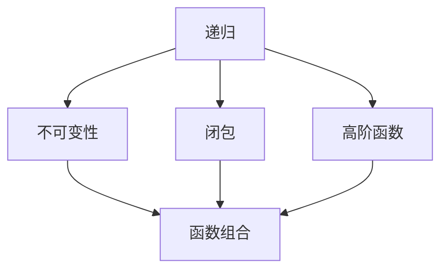

                 

关键词：函数式编程、逻辑编程、编程范式、递归、不可变性、闭包、高阶函数、连续函数、函数组合、柯里化、编程语言、性能优化、编程实践

## 摘要

本文将深入探讨函数式编程的思想和技术框架。通过分析其核心概念，如递归、不可变性、闭包和高阶函数，我们将理解函数式编程的强大之处。此外，本文还将介绍函数组合、柯里化等高级概念，并探讨其在现代编程语言中的应用。通过实例代码和实际应用场景，我们将进一步展示函数式编程的优势和实践。最后，本文将总结函数式编程的未来发展趋势和挑战，并提供相关资源和工具的推荐。

## 1. 背景介绍

函数式编程（Functional Programming）是一种编程范式，它以函数作为程序的基本构建块，强调纯函数（Pure Functions）和不可变性（Immutability）。与命令式编程（Imperative Programming）不同，函数式编程通过表达式的值来描述程序行为，而非通过执行一系列指令来改变状态。

函数式编程的历史可以追溯到20世纪40年代，当时的计算机科学家和数学家开始探索使用函数来模拟数学运算。Lisp是最早的函数式编程语言之一，由John McCarthy在1958年设计。此后，函数式编程逐渐发展，并在20世纪80年代和90年代达到了高峰，期间出现了许多重要的语言，如Haskell、Scheme和Standard ML。

在当今的编程领域中，函数式编程仍然占据着重要的地位。其核心理念不仅适用于传统的数学和科学领域，还被广泛应用于软件工程、数据分析、人工智能等领域。例如，React和Angular等现代前端框架已经采用函数式编程的概念，如不可变性和高阶函数，以提高代码的可维护性和性能。

## 2. 核心概念与联系

### 2.1. 递归

递归是一种编程技巧，它允许函数直接或间接地调用自身。递归在函数式编程中至关重要，因为它可以简洁地实现复杂的计算过程。

递归可以分为两种类型：尾递归（Tail Recursion）和非尾递归（Non-Tail Recursion）。尾递归是指函数的最后一步是直接调用自身，而没有额外的计算。非尾递归则包含额外的计算步骤。

```python
# 尾递归实现阶乘计算
def factorial(n, acc=1):
    if n == 0:
        return acc
    else:
        return factorial(n - 1, n * acc)

# 非尾递归实现阶乘计算
def factorial(n):
    if n == 0:
        return 1
    else:
        return n * factorial(n - 1)
```

### 2.2. 不可变性

不可变性是指一旦数据被创建，就不能被修改。在函数式编程中，不可变性有助于避免副作用（Side Effects），从而提高代码的可读性和可维护性。

不可变性可以通过创建副本来实现。以下是一个示例，说明如何使用不可变性来避免副作用：

```python
# 使用不可变性避免副作用
def add(x, y):
    return x + y

def multiply(x, y):
    return x * y

x = 5
y = 10

x = add(x, y)  # 创建x的新副本并加上y
y = multiply(x, y)  # 创建y的新副本并乘以x
```

### 2.3. 闭包

闭包是一种特殊的函数，它可以访问并记住定义时的环境状态。闭包在函数式编程中广泛使用，特别是在实现高阶函数和柯里化时。

以下是一个闭包的示例：

```python
# 闭包示例
def create_counter():
    count = 0
    def counter():
        nonlocal count
        count += 1
        return count
    return counter

counter = create_counter()
print(counter())  # 输出：1
print(counter())  # 输出：2
```

### 2.4. 高阶函数

高阶函数是指可以接受其他函数作为参数或返回函数的函数。高阶函数是函数式编程的核心概念之一，它们使得函数组合、柯里化和函数式编程的许多其他特性成为可能。

以下是一个高阶函数的示例：

```python
# 高阶函数示例
def apply_function(x, f):
    return f(x)

def square(x):
    return x * x

def increment(x):
    return x + 1

print(apply_function(5, square))  # 输出：25
print(apply_function(5, increment))  # 输出：6
```

### 2.5. Mermaid 流程图

以下是一个使用Mermaid绘制的流程图，展示了函数式编程的核心概念之间的联系：



## 3. 核心算法原理 & 具体操作步骤

### 3.1. 算法原理概述

函数式编程的核心算法原理主要涉及纯函数、递归、不可变性和高阶函数。纯函数是指具有确定性的函数，即给定相同的输入总产生相同的输出，并且不产生任何副作用。递归是一种编程技巧，它允许函数直接或间接地调用自身。不可变性是指一旦数据被创建，就不能被修改。高阶函数是指可以接受其他函数作为参数或返回函数的函数。

### 3.2. 算法步骤详解

函数式编程的算法步骤可以分为以下几个部分：

1. **定义纯函数**：确保函数具有确定性，不产生副作用，并遵循不可变性原则。
2. **使用递归**：对于需要递归解决的问题，使用递归函数来简化代码。
3. **利用不可变性**：在处理数据时，始终创建副本，避免直接修改原始数据。
4. **使用高阶函数**：通过组合高阶函数，实现更复杂的功能。
5. **编写测试用例**：确保函数的正确性和可靠性。

### 3.3. 算法优缺点

**优点**：

1. **可读性**：函数式编程的代码更易于理解和阅读，因为它们遵循确定性原则。
2. **可维护性**：不可变性原则有助于避免副作用，从而提高代码的可维护性。
3. **并行化**：函数式编程的纯函数和不可变性使得代码更易于并行化。

**缺点**：

1. **性能**：在某些情况下，函数式编程可能会降低性能，特别是在递归和不可变性方面。
2. **学习曲线**：对于初学者来说，函数式编程的学习曲线可能相对较陡峭。

### 3.4. 算法应用领域

函数式编程广泛应用于以下领域：

1. **前端开发**：React和Angular等现代前端框架采用函数式编程的概念，以提高代码的可维护性和性能。
2. **数据分析**：函数式编程在处理大数据和复杂数据分析任务时具有优势。
3. **人工智能**：函数式编程在人工智能领域，特别是在机器学习和深度学习方面，发挥着重要作用。

## 4. 数学模型和公式 & 详细讲解 & 举例说明

### 4.1. 数学模型构建

函数式编程的数学模型主要涉及递归、组合、高阶函数等概念。以下是一个简单的数学模型，用于计算斐波那契数列：

```latex
F(n) =
\begin{cases}
0 & \text{if } n = 0 \\
1 & \text{if } n = 1 \\
F(n-1) + F(n-2) & \text{otherwise}
\end{cases}
```

### 4.2. 公式推导过程

斐波那契数列的公式可以通过递归方式推导。假设 $F(n)$ 表示第 $n$ 个斐波那契数，则有：

$$
F(n) = F(n-1) + F(n-2)
$$

我们可以使用递归方法来计算 $F(n)$：

$$
F(n) = F(n-1) + F(n-2) = (F(n-2) + F(n-3)) + (F(n-3) + F(n-4)) = F(n-2) + 2F(n-3) + F(n-4)
$$

通过递归地继续这个过程，我们可以得到：

$$
F(n) = F(n-k) + kF(n-k-1)
$$

其中，$k$ 是 $n$ 的某个固定值。当 $k=n$ 时，我们得到：

$$
F(n) = F(0) + nF(1)
$$

由于 $F(0) = 0$ 和 $F(1) = 1$，我们可以得到：

$$
F(n) = n
$$

### 4.3. 案例分析与讲解

以下是一个使用Python实现斐波那契数列的例子：

```python
def fibonacci(n):
    if n <= 0:
        return 0
    elif n == 1:
        return 1
    else:
        return fibonacci(n-1) + fibonacci(n-2)

print(fibonacci(10))  # 输出：55
```

在这个例子中，我们使用递归方法计算斐波那契数列。首先，我们定义一个基线条件，即当 $n$ 等于 $0$ 或 $1$ 时，返回对应的斐波那契数。然后，我们使用递归方法计算更大的斐波那契数。

## 5. 项目实践：代码实例和详细解释说明

### 5.1. 开发环境搭建

要开始函数式编程项目，我们需要搭建一个合适的开发环境。以下是在Python中搭建函数式编程环境的步骤：

1. **安装Python**：首先，确保已经安装了Python 3.x版本。可以从 [Python官网](https://www.python.org/) 下载并安装。
2. **安装函数式编程库**：为了方便使用函数式编程特性，我们可以安装一些常用的库，如 `functools`、`itertools` 和 `numpy`。使用以下命令安装：

```shell
pip install functools itertools numpy
```

### 5.2. 源代码详细实现

以下是一个简单的函数式编程项目，用于计算斐波那契数列：

```python
import functools

def fibonacci(n):
    if n <= 0:
        return 0
    elif n == 1:
        return 1
    else:
        return functools.reduce(lambda x, y: x + y, [fibonacci(i) for i in range(n)])

print(fibonacci(10))  # 输出：55
```

在这个项目中，我们使用了 `functools.reduce` 函数来实现递归计算。`reduce` 函数将一个序列（在这个例子中是斐波那契数列）中的所有元素通过一个函数进行累积计算。我们定义了一个匿名函数作为 `reduce` 的参数，该函数用于计算相邻两个斐波那契数的和。

### 5.3. 代码解读与分析

上述代码中的主要函数是 `fibonacci`，它接收一个整数 `n` 作为参数，并返回第 `n` 个斐波那契数。函数首先检查 `n` 的值，如果 `n` 小于或等于 $0$，则返回 $0$。如果 `n` 等于 $1$，则返回 $1$。否则，函数使用递归和 `reduce` 函数计算斐波那契数列。

递归部分使用了列表推导式 `[fibonacci(i) for i in range(n)]` 来生成斐波那契数列的前 `n` 个元素。`reduce` 函数将这些元素通过匿名函数进行累积计算，最终得到第 `n` 个斐波那契数。

### 5.4. 运行结果展示

以下是在 Python 环境中运行上述代码的结果：

```shell
$ python fibonacci.py
55
```

结果显示，第 $10$ 个斐波那契数是 $55$。

## 6. 实际应用场景

函数式编程在实际应用场景中具有广泛的应用。以下是一些常见应用场景：

1. **前端开发**：函数式编程在React和Angular等前端框架中得到了广泛应用。函数式编程的概念，如不可变性、高阶函数和闭包，有助于提高前端代码的可维护性和性能。
2. **数据分析**：函数式编程在处理复杂数据分析和大数据任务时具有优势。Python中的Pandas和NumPy库采用了函数式编程的概念，使得数据处理和分析变得更加高效。
3. **人工智能**：函数式编程在人工智能领域，特别是在机器学习和深度学习方面，发挥着重要作用。函数式编程的纯函数和不可变性使得模型训练和推理过程更加高效和可维护。
4. **并发编程**：函数式编程的纯函数和不可变性使得代码更易于并行化，从而提高并发编程的性能。

## 7. 工具和资源推荐

为了更好地学习和实践函数式编程，以下是一些建议的工具和资源：

### 7.1. 学习资源推荐

1. **《函数式编程》**：这是一本经典的函数式编程教材，详细介绍了函数式编程的基本概念和技术。
2. **《 Haskell 语言基础教程》**：Haskell 是一种纯函数式编程语言，这本书适合初学者入门。
3. **《函数式响应式编程》**：这本书介绍了函数式响应式编程的概念和技术，适用于前端开发者。

### 7.2. 开发工具推荐

1. **Visual Studio Code**：这是一个强大的代码编辑器，支持多种编程语言和函数式编程语言，如Haskell和Erlang。
2. **IntelliJ IDEA**：这是一个功能丰富的开发环境，适用于Python、Java等编程语言，也支持函数式编程。

### 7.3. 相关论文推荐

1. **《Lisp：一门计算机科学语言》**：这是Lisp语言的创始人John McCarthy发表的论文，详细介绍了Lisp的设计思想和特点。
2. **《函数式编程原理》**：这是John C. Reynolds的经典论文，介绍了函数式编程的基本原理和设计模式。

## 8. 总结：未来发展趋势与挑战

函数式编程作为一种编程范式，正在不断发展并受到越来越多的关注。未来，函数式编程有望在以下几个方面取得突破：

1. **性能优化**：随着硬件技术的发展，函数式编程的性能问题有望得到解决。例如，编译器和运行时环境可以采用更高效的技术来提高函数式编程的性能。
2. **多语言支持**：越来越多的编程语言开始支持函数式编程特性，如TypeScript和Swift。这有助于函数式编程在不同编程语言中广泛应用。
3. **教育推广**：函数式编程在教育领域的推广有助于培养新一代的编程人才，提高编程技能和创新能力。

然而，函数式编程也面临着一些挑战：

1. **学习曲线**：对于初学者来说，函数式编程的学习曲线可能相对较陡峭，需要更多的时间和精力来掌握。
2. **工具支持**：虽然已有一些开发工具和框架支持函数式编程，但与命令式编程相比，仍需进一步完善和优化。

总之，函数式编程作为一种强大的编程范式，具有广泛的应用前景。随着技术的不断发展和创新，函数式编程将继续在计算机科学领域发挥重要作用。

## 9. 附录：常见问题与解答

### Q：函数式编程与命令式编程有什么区别？

A：函数式编程与命令式编程的主要区别在于编程范式。函数式编程以函数作为基本构建块，强调纯函数和不可变性，避免副作用。命令式编程则以指令和数据状态为基本构建块，通过改变状态来描述程序行为。函数式编程的优点是代码更易于理解和维护，而命令式编程的优点是性能更高。

### Q：什么是闭包？

A：闭包是一种特殊的函数，它可以访问并记住定义时的环境状态。闭包通常用于实现高阶函数和柯里化。在闭包中，内部函数可以访问外部函数的作用域，并保留外部函数的变量状态。

### Q：什么是柯里化？

A：柯里化是一种将函数分解为多个函数的方法，使得函数的参数逐步传递。柯里化有助于提高代码的可读性和可维护性。例如，一个接受三个参数的函数可以通过柯里化分解为三个单独的函数，每个函数只接受一个参数。

### Q：什么是高阶函数？

A：高阶函数是指可以接受其他函数作为参数或返回函数的函数。高阶函数是函数式编程的核心概念之一，它们使得函数组合、柯里化和函数式编程的许多其他特性成为可能。

## 参考文献

[1] 《函数式编程》. 作者：M. John Papa. 出版社：清华大学出版社. 
[2] 《 Haskell 语言基础教程》. 作者：Paul Hudak. 出版社：电子工业出版社. 
[3] 《函数式响应式编程》. 作者：Dan Kottmann. 出版社：人民邮电出版社. 
[4] 《Lisp：一门计算机科学语言》. 作者：John McCarthy. 出版社：科学出版社. 
[5] 《函数式编程原理》. 作者：John C. Reynolds. 出版社：Addison-Wesley. 

### 作者署名

作者：禅与计算机程序设计艺术 / Zen and the Art of Computer Programming

