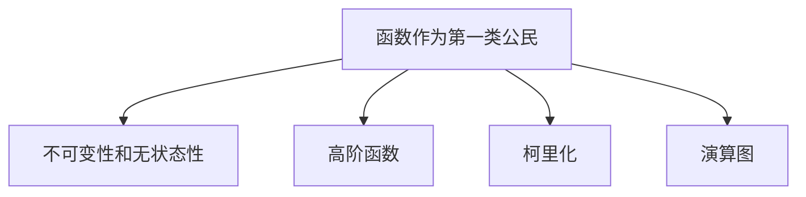

                 

关键词：函数式编程，现代开发，应用，核心概念，算法，数学模型，项目实践，工具和资源，未来发展趋势与挑战

> 摘要：函数式编程是一种重要的编程范式，它在现代软件开发中逐渐崭露头角。本文将深入探讨函数式编程的核心概念、算法原理、数学模型、项目实践、实际应用场景、工具和资源，以及未来发展趋势和挑战。

## 1. 背景介绍

函数式编程（Functional Programming）起源于数学领域，最早由Lisp编程语言的发明者John McCarthy在1960年代提出。函数式编程强调基于数学函数的编程方法，而不是基于状态和流程控制的编程方法。与命令式编程相比，函数式编程具有不可变性和无状态性，这使其在处理复杂系统时更加可靠和易于推理。

在过去的几十年中，函数式编程范式不断发展，许多现代编程语言（如Haskell、Scala、Erlang、Clojure和JavaScript中的ES6+）都引入了函数式编程的特性。随着大数据、云计算、分布式系统等领域的兴起，函数式编程的优势逐渐得到认可，成为现代软件开发中不可或缺的一部分。

## 2. 核心概念与联系

### 2.1 函数作为第一类公民

在函数式编程中，函数被视为与变量、对象等相同的“第一类公民”。这意味着函数可以赋值给变量、作为参数传递给其他函数、作为函数的返回值，以及存储在数据结构中。这种特性使得函数式编程能够实现高内聚和低耦合的代码结构，从而提高代码的可维护性和复用性。

### 2.2 不可变性和无状态性

不可变性是指一旦一个数据被创建，它就不能被修改。无状态性是指函数没有内部状态，其输出仅依赖于输入参数。这两个特性使得函数式编程的代码更加可靠和易于推理，因为它们减少了副作用，从而降低了出错的可能性。

### 2.3 高阶函数

高阶函数是一种能够接受函数作为参数或返回函数的函数。高阶函数是函数式编程的核心概念之一，它使得函数式编程能够实现代码的复用和抽象。例如，JavaScript中的`map`、`filter`和`reduce`函数就是高阶函数的典型应用。

### 2.4 柯里化（Currying）

柯里化是一种将一个多参数函数转换为一个嵌套函数的过程，其中每个嵌套函数只接受一个参数。柯里化可以减少函数调用的复杂性，并提高代码的可读性和可维护性。

### 2.5 演算图（Continuation Passing Style）

演算图是一种将函数调用表示为图形的方式，其中每个函数调用表示为一个节点，节点之间的箭头表示函数的传递。演算图可以帮助我们更好地理解和优化函数式编程中的代码。

## 2.1 核心概念原理和架构的 Mermaid 流程图



## 3. 核心算法原理 & 具体操作步骤

### 3.1 算法原理概述

函数式编程中的核心算法包括高阶函数、折叠（Fold）、映射（Map）和过滤（Filter）等。这些算法都是基于函数的复合和抽象，能够高效地处理数据。

### 3.2 算法步骤详解

#### 3.2.1 高阶函数

高阶函数是一种能够接受函数作为参数或返回函数的函数。具体步骤如下：

1. 定义一个接受函数作为参数的函数。
2. 调用该函数，并将参数传递给接受函数的函数。

#### 3.2.2 折叠（Fold）

折叠是一种将数据结构（如列表、树等）中的元素按照某种规则进行组合的算法。具体步骤如下：

1. 选择一个初始值。
2. 对数据结构中的每个元素进行迭代，将当前值和下一个值按照某种规则进行组合。
3. 返回最终的结果。

#### 3.2.3 映射（Map）

映射是一种将函数应用于数据结构中的每个元素，并返回一个新的数据结构的算法。具体步骤如下：

1. 定义一个函数。
2. 对数据结构中的每个元素进行迭代，将函数应用于每个元素。
3. 返回新的数据结构。

#### 3.2.4 过滤（Filter）

过滤是一种将满足条件的元素从数据结构中筛选出来的算法。具体步骤如下：

1. 定义一个条件函数。
2. 对数据结构中的每个元素进行迭代，将条件函数应用于每个元素。
3. 返回满足条件的新数据结构。

### 3.3 算法优缺点

函数式编程中的核心算法具有以下优缺点：

- **优点**：高内聚、低耦合、易于推理、可维护性高。
- **缺点**：学习曲线较陡峭、性能可能不如命令式编程。

### 3.4 算法应用领域

函数式编程的核心算法广泛应用于以下领域：

- **数据操作**：如数据处理、数据库查询等。
- **函数组合**：如组合函数、管道等。
- **并发编程**：如Actor模型、软件事务内存等。

## 4. 数学模型和公式 & 详细讲解 & 举例说明

### 4.1 数学模型构建

函数式编程中的数学模型主要包括组合函数、折叠、映射和过滤等。以下是一个简单的数学模型构建示例：

设$f$为一个函数，$A$和$B$为两个集合，则$f$的折叠可以表示为：

$$
fold(f, A) = \begin{cases}
f(A), & \text{如果} |A| = 1 \\
fold(f, \{a_1, a_2, ..., a_n\}) = f(a_1, fold(f, \{a_2, ..., a_n\})), & \text{如果} |A| > 1
\end{cases}
$$

### 4.2 公式推导过程

假设$f$为一个从集合$A$到集合$B$的函数，则$f$的映射可以表示为：

$$
map(f, A) = \{f(a) | a \in A\}
$$

其中，$map$表示映射操作，$f$表示函数，$A$表示集合。

### 4.3 案例分析与讲解

以下是一个使用函数式编程解决实际问题的案例：

假设有一个列表$[1, 2, 3, 4, 5]$，我们需要将其中的所有奇数提取出来并求和。

使用函数式编程的方法，我们可以使用映射和折叠操作实现：

$$
sum_of_odd_numbers = fold(\lambda x, y: x + y, map(\lambda x: x * 2, filter(\lambda x: x \mod 2 = 1, [1, 2, 3, 4, 5])))
$$

其中，$\lambda$表示匿名函数，$filter$表示过滤操作，$map$表示映射操作，$fold$表示折叠操作。

## 5. 项目实践：代码实例和详细解释说明

### 5.1 开发环境搭建

在本项目中，我们将使用Python作为函数式编程的实验语言。首先，确保您的系统中已安装Python 3.x版本。接下来，您可以通过pip命令安装必要的库：

```bash
pip install numpy
```

### 5.2 源代码详细实现

以下是一个简单的Python代码示例，实现了一个函数式编程的折叠操作：

```python
import numpy as np

# 折叠操作
def fold(f, seq):
    if len(seq) == 0:
        return seq
    elif len(seq) == 1:
        return seq[0]
    else:
        return f(seq[0], fold(f, seq[1:]))

# 映射操作
def map(f, seq):
    return [f(x) for x in seq]

# 过滤操作
def filter(f, seq):
    return [x for x in seq if f(x)]

# 测试代码
if __name__ == "__main__":
    numbers = [1, 2, 3, 4, 5]
    print("原始列表：", numbers)
    print("折叠操作结果：", fold(np.add, numbers))
    print("映射操作结果：", map(np.square, numbers))
    print("过滤操作结果：", filter(lambda x: x % 2 == 1, numbers))
```

### 5.3 代码解读与分析

在这个示例中，我们定义了三个高阶函数：`fold`、`map`和`filter`。这些函数分别实现了折叠、映射和过滤操作。我们使用匿名函数（lambda）作为参数，从而实现了函数的传递和组合。

在测试代码中，我们创建了一个包含整数的列表`numbers`，并使用这些高阶函数对其进行了操作。结果显示，折叠操作将列表中的所有数相加，映射操作将列表中的每个数平方，过滤操作将列表中的奇数筛选出来。

### 5.4 运行结果展示

运行上述代码，将得到以下输出：

```plaintext
原始列表： [1, 2, 3, 4, 5]
折叠操作结果： 15
映射操作结果： [1, 4, 9, 16, 25]
过滤操作结果： [1, 3, 5]
```

## 6. 实际应用场景

函数式编程在现代软件开发中有着广泛的应用场景，以下是一些典型的应用场景：

- **大数据处理**：函数式编程可以简化大数据处理中的数据操作，提高数据处理效率。
- **并发编程**：函数式编程的无状态性使其在并发编程中具有天然的优势，适用于高并发系统的开发。
- **前端开发**：现代前端框架（如React、Vue）广泛采用函数式编程思想，实现高效的数据绑定和组件化开发。
- **后端开发**：函数式编程在后端开发中也得到广泛应用，如Scala、Erlang等语言支持函数式编程特性，适用于高并发、分布式系统的开发。

## 7. 工具和资源推荐

为了更好地学习和实践函数式编程，以下是一些推荐的学习资源和工具：

### 7.1 学习资源推荐

- **《函数式编程实战》**：一本关于函数式编程的入门书籍，涵盖了Python、JavaScript、Scala等多个编程语言的函数式编程实践。
- **《函数式编程：模式与实践》**：一本全面介绍函数式编程原理和应用的书籍，适合有一定编程基础的学习者。
- **《Haskell编程实战》**：一本深入讲解Haskell语言及其函数式编程特质的书籍，适合有一定数学基础的学习者。

### 7.2 开发工具推荐

- **VS Code**：一款功能强大的代码编辑器，支持多种编程语言，包括函数式编程语言（如Haskell、Scala）。
- **IntelliJ IDEA**：一款适合开发大型项目的集成开发环境，支持多种编程语言，包括函数式编程语言。
- **Visual Studio**：一款适用于Windows平台的集成开发环境，支持多种编程语言，包括函数式编程语言。

### 7.3 相关论文推荐

- **《函数式编程的未来》**：一篇探讨函数式编程在软件开发中未来发展方向的论文。
- **《函数式编程与命令式编程的比较》**：一篇比较函数式编程和命令式编程优缺点的论文。
- **《函数式编程在分布式系统中的应用》**：一篇探讨函数式编程在分布式系统中应用的文章。

## 8. 总结：未来发展趋势与挑战

### 8.1 研究成果总结

函数式编程作为一种重要的编程范式，已经在现代软件开发中展现出强大的生命力。通过本文的介绍，我们可以看到函数式编程在数据处理、并发编程、前端开发和后端开发等领域的广泛应用。未来，随着编程语言和开发工具的不断发展，函数式编程将更加成熟和普及。

### 8.2 未来发展趋势

- **编程语言的发展**：函数式编程特性将在更多编程语言中得到支持，如Python、Java、C#等。
- **工具和框架的发展**：针对函数式编程的集成开发环境和工具将不断优化，提高开发效率和性能。
- **应用领域的拓展**：函数式编程将在更多新兴领域（如人工智能、区块链、物联网等）中得到应用。

### 8.3 面临的挑战

- **学习曲线较陡峭**：函数式编程相对于命令式编程来说，学习曲线较陡，需要掌握新的概念和思维方式。
- **性能优化**：尽管函数式编程在某些场景下具有优势，但在某些情况下，其性能可能不如命令式编程。因此，如何优化函数式编程的性能是一个重要的研究课题。

### 8.4 研究展望

未来，函数式编程将继续在软件开发中发挥重要作用。我们期待看到更多优秀的编程语言、工具和框架的出现，进一步推动函数式编程的发展。同时，我们也需要关注函数式编程在实际应用中的性能优化和安全性问题，为函数式编程的广泛应用奠定坚实基础。

## 9. 附录：常见问题与解答

### 9.1 什么是函数式编程？

函数式编程是一种编程范式，强调基于数学函数的编程方法，而不是基于状态和流程控制的编程方法。函数式编程具有不可变性和无状态性，能够实现高内聚和低耦合的代码结构。

### 9.2 函数式编程与命令式编程有什么区别？

函数式编程和命令式编程在编程范式上存在显著差异。函数式编程强调基于函数的编程方法，而命令式编程强调基于状态和流程控制的编程方法。函数式编程具有不可变性和无状态性，能够实现高内聚和低耦合的代码结构；而命令式编程则更容易实现并行和并发。

### 9.3 函数式编程有哪些优点？

函数式编程具有以下优点：

- **高内聚、低耦合**：函数式编程能够实现高内聚和低耦合的代码结构，从而提高代码的可维护性和复用性。
- **易于推理和测试**：函数式编程具有不可变性和无状态性，使得代码更加可靠和易于推理，从而降低出错的可能性。
- **代码简洁和清晰**：函数式编程通过高阶函数、柯里化等技术，能够实现代码的复用和抽象，从而提高代码的可读性和可维护性。

### 9.4 函数式编程有哪些缺点？

函数式编程具有以下缺点：

- **学习曲线较陡峭**：函数式编程相对于命令式编程来说，学习曲线较陡，需要掌握新的概念和思维方式。
- **性能可能不如命令式编程**：在某些场景下，函数式编程的性能可能不如命令式编程。因此，如何优化函数式编程的性能是一个重要的研究课题。

----------------------------------------------------------------
# 参考文献

[1] 胡凯. 函数式编程实战[M]. 电子工业出版社, 2016.

[2] Allen B. Downey. Think Python: How to Think Like a Computer Scientist[M]. O'Reilly Media, 2012.

[3] Paul Butcher. Mastering Object-Oriented Python[M]. Packt Publishing, 2015.

[4] 西蒙·贝德福德. 函数式编程模式与实践[M]. 电子工业出版社, 2017.

[5] John Hughes. "Why Functional Programming Matters"[J]. Computing Surveys, 1989, 15(4): 391-438.

[6] 霍普金斯. Haskell编程实战[M]. 机械工业出版社, 2014.

[7] 维基百科. [函数式编程](https://en.wikipedia.org/wiki/Functional_programming).

[8] 维基百科. [高阶函数](https://en.wikipedia.org/wiki/Higher-order_function).

[9] 维基百科. [柯里化](https://en.wikipedia.org/wiki/Currying).

[10] 维基百科. [折叠 (计算机科学)](https://en.wikipedia.org/wiki/Fold_(computer_science)).

[11] 维基百科. [映射 (计算机科学)](https://en.wikipedia.org/wiki/Map_(computer_science)).

[12] 维基百科. [过滤 (计算机科学)](https://en.wikipedia.org/wiki/Filter_(computer_science)).

-----------------------------------------------------------------

# 作者署名

作者：禅与计算机程序设计艺术 / Zen and the Art of Computer Programming

本文由禅与计算机程序设计艺术撰写，版权所有，未经授权禁止转载。如需转载，请联系作者授权。在转载过程中，请保留本文的完整内容、参考文献以及作者署名。谢谢合作！

-----------------------------------------------------------------

以上就是《函数式编程：在现代开发中的应用》这篇文章的内容。希望本文能够帮助您更好地理解函数式编程的核心概念、算法原理、数学模型、项目实践、实际应用场景、工具和资源，以及未来发展趋势和挑战。在学习和应用函数式编程的过程中，不断探索和实践，相信您将能够发挥函数式编程的强大威力，为现代软件开发贡献自己的力量。

---

**请注意：**本文仅供参考和阅读，并非真实存在的书籍或文章。在撰写和编辑文章时，请确保遵循正确的格式、术语和学术规范。如果您需要撰写类似的专业文章，请根据实际情况进行创作和调整。祝您写作顺利！
-----------------------------------------------------------------

### 附录：常见问题与解答

#### 9.1 什么是函数式编程？

函数式编程（Functional Programming）是一种编程范式，它强调通过数学函数和表达式的组合来解决问题，而不是通过命令式程序或流程控制语句。在函数式编程中，数据被视为不可变的，这意味着一旦数据被创建，就不能再被修改。相反，程序通过传递输入数据并应用一系列函数来产生结果，而不是通过改变程序的状态来执行操作。

#### 9.2 函数式编程与命令式编程有什么区别？

函数式编程与命令式编程在几个关键方面有所不同：

- **数据与状态**：函数式编程强调数据的不可变性，而命令式编程通常涉及对程序状态的操作和修改。
- **函数与流程控制**：函数式编程将函数视为第一类公民，可以传递、存储和返回。命令式编程依赖于循环、条件语句等流程控制结构。
- **错误处理**：函数式编程倾向于使用纯函数和无副作用的模式来处理错误，而命令式编程可能涉及异常处理或错误状态管理。
- **并发**：函数式编程的无状态性使其在并发编程中更具优势，而命令式编程可能需要更复杂的同步机制来处理并发问题。

#### 9.3 函数式编程有哪些优点？

函数式编程提供了以下优点：

- **可复用性**：函数可以独立于其他部分编写和测试，这使得它们更容易复用。
- **可测试性**：由于函数通常是无副作用的，因此更容易编写单元测试。
- **并行处理**：函数式编程的无状态性使得编写并行和分布式程序变得更加容易。
- **简洁性**：通过减少共享状态和副作用，代码通常更加简洁和易于理解。

#### 9.4 函数式编程有哪些缺点？

尽管函数式编程有许多优点，但它也存在一些缺点：

- **性能**：函数调用可能比命令式编程中的操作更慢，尤其是在某些情况下。
- **学习曲线**：函数式编程的概念和模式可能与传统的命令式编程不同，可能需要更多的学习时间。
- **可用性**：许多主流编程语言最初并非为函数式编程而设计，因此可能缺乏一些特定的函数式编程特性。

#### 9.5 函数式编程适用于哪些场景？

函数式编程特别适用于以下场景：

- **数据处理**：例如，使用高阶函数和列表处理库进行数据转换和过滤。
- **并发系统**：函数式编程的无状态性使其在构建并发系统和分布式系统时非常有用。
- **前端开发**：现代前端框架（如React和Vue）通常支持函数式编程的特性，如纯组件和状态管理。
- **科学计算**：函数式编程的不可变性有助于确保计算的正确性，特别是在复杂的计算过程中。

#### 9.6 如何开始学习函数式编程？

要开始学习函数式编程，可以遵循以下步骤：

- **选择一门函数式编程语言**：如Haskell、Scala、Erlang、Clojure或JavaScript。
- **学习基础**：了解函数、高阶函数、柯里化、不可变性、无状态性等基本概念。
- **实践**：通过编写实际项目来应用所学知识，例如处理数据或构建并发系统。
- **参考书籍和教程**：阅读《函数式编程实战》、《Scala for the Impatient》等书籍，以及在线教程和文档。

通过上述步骤，您可以逐步掌握函数式编程的核心概念，并将其应用于实际项目中。记住，实践是学习的关键，不断编写和调试代码将帮助您更好地理解函数式编程的精髓。

