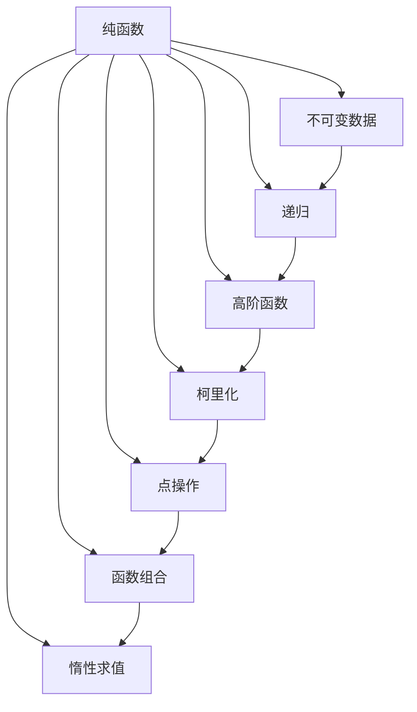

                 

关键词：函数式编程，递归，不可变数据，纯函数，高阶函数，柯里化，点操作，函数组合，惰性求值，递归，不可变性，纯函数，函数式编程语言，Haskell，Scala，Clojure，Lambda演算，程序设计范式。

> 摘要：本文将深入探讨函数式编程（FP）的核心概念、理论原理以及实践应用。我们将分析纯函数、不可变数据、递归等基本概念，并探讨这些概念在实际编程中的重要性。通过实例代码和案例分析，我们将展示如何利用函数式编程技术来构建可复用、模块化且易于维护的代码。此外，本文还将展望函数式编程的未来发展趋势，以及其在计算机科学领域中的挑战与机遇。

## 1. 背景介绍

函数式编程是一种与命令式编程（imperative programming）相对的程序设计范式。命令式编程强调通过指令序列来改变程序状态，而函数式编程则主张使用表达式和函数来处理数据。函数式编程起源于20世纪40年代，由Lambda演算（Lambda calculus）奠定理论基础。自Lambda演算以来，函数式编程逐渐发展成为计算机科学领域中的一个重要分支。

在函数式编程中，函数是一等公民，意味着函数可以作为参数传递，也可以作为返回值。此外，函数式编程强调不可变数据，即数据一旦创建，便不可更改。这一特点有助于减少错误和提高代码的清晰度。递归是函数式编程中处理循环的一种常见手段，它无需迭代变量即可实现循环。

函数式编程的优点包括：易于测试和复用、可并行化执行、代码简洁明了等。然而，函数式编程也存在一些挑战，如递归可能导致栈溢出、不可变性可能导致性能问题等。

本文将首先介绍函数式编程的核心概念，然后深入探讨纯函数、不可变数据、递归等原理，并通过实例代码和案例分析，展示函数式编程的实际应用。最后，我们将展望函数式编程的未来发展趋势，以及其在计算机科学领域中的挑战与机遇。

## 2. 核心概念与联系

### 2.1. 纯函数

纯函数是一种在给定输入下始终返回相同输出的函数，且不依赖于外部状态。这意味着纯函数是可预测的、可靠的，并且易于测试。以下是一个纯函数的例子：

```python
def add(a, b):
    return a + b
```

在这个例子中，无论何时调用 `add` 函数，只要输入相同，函数总会返回相同的结果。纯函数不会修改外部状态，因此不会引起副作用。

### 2.2. 不可变数据

不可变数据是一种一旦创建便不可更改的数据。在函数式编程中，不可变数据有助于防止副作用，提高代码的可读性和可维护性。以下是一个不可变数据的例子：

```python
x = [1, 2, 3]
y = x.copy()
y.append(4)
print(x)  # 输出：[1, 2, 3]
print(y)  # 输出：[1, 2, 3, 4]
```

在这个例子中，变量 `x` 和 `y` 分别指向不同的数据。修改 `y` 不会影响 `x`，因为 `x` 的值是不可变的。

### 2.3. 递归

递归是一种通过重复调用自身来解决问题的编程技巧。在函数式编程中，递归是一种常见的循环手段。以下是一个使用递归求解斐波那契数列的例子：

```python
def fibonacci(n):
    if n <= 0:
        return 0
    elif n == 1:
        return 1
    else:
        return fibonacci(n - 1) + fibonacci(n - 2)
```

在这个例子中，`fibonacci` 函数通过递归调用自身来计算斐波那契数列的值。递归的优点在于代码简洁、易于理解。然而，递归也可能导致性能问题，特别是在处理大数时。

### 2.4. 高阶函数

高阶函数是一种接受函数作为参数或返回函数的函数。在函数式编程中，高阶函数是一种强大的工具，可以用于抽象、复用和组合代码。以下是一个使用高阶函数的例子：

```python
def apply_operation(operation, x, y):
    return operation(x, y)

def add(x, y):
    return x + y

def subtract(x, y):
    return x - y

print(apply_operation(add, 2, 3))  # 输出：5
print(apply_operation(subtract, 5, 3))  # 输出：2
```

在这个例子中，`apply_operation` 函数接受一个操作函数作为参数，并使用该操作函数对两个参数进行计算。高阶函数的优点在于可以轻松地组合和复用代码。

### 2.5. 柯里化

柯里化是一种将多参数函数转换为一系列单参数函数的技巧。在函数式编程中，柯里化有助于减少函数调用的复杂性，提高代码的可读性。以下是一个使用柯里化的例子：

```python
def add(a, b, c):
    return a + b + c

def curried_add(a):
    return lambda b, c: add(a, b, c)

print(curried_add(1)(2)(3))  # 输出：6
```

在这个例子中，`curried_add` 函数将原来的三参数函数 `add` 转换为一系列单参数函数。柯里化的优点在于可以逐步构建函数，提高代码的灵活性。

### 2.6. 点操作

点操作是一种通过属性访问符（`.`）来访问对象属性的方法。在函数式编程中，点操作可以用于构建简洁、易读的代码。以下是一个使用点操作的例子：

```python
class Person:
    def __init__(self, name, age):
        self.name = name
        self.age = age

p = Person("Alice", 30)
print(p.name)  # 输出："Alice"
print(p.age)  # 输出：30
```

在这个例子中，我们使用点操作符 `.` 来访问 `Person` 对象的属性。点操作的优点在于可以简化代码，提高可读性。

### 2.7. 函数组合

函数组合是一种通过将多个函数组合在一起来创建新函数的技巧。在函数式编程中，函数组合可以用于抽象、复用和组合代码。以下是一个使用函数组合的例子：

```python
def compose(f, g):
    return lambda x: f(g(x))

def add(a, b):
    return a + b

def square(x):
    return x * x

print(compose(square, add)(2, 3))  # 输出：25
```

在这个例子中，`compose` 函数将两个函数 `square` 和 `add` 组合在一起，创建一个新的函数。函数组合的优点在于可以轻松地组合和复用代码。

### 2.8. 惰性求值

惰性求值是一种在需要时才进行求值的计算方法。在函数式编程中，惰性求值可以提高代码的可读性和性能。以下是一个使用惰性求值的例子：

```python
def generate_numbers():
    n = 0
    while True:
        n += 1
        yield n

gen = generate_numbers()
for i in range(10):
    print(next(gen))  # 输出：1 2 3 4 5 6 7 8 9 10
```

在这个例子中，`generate_numbers` 函数生成一个无限的数字序列。通过惰性求值，我们可以在需要时逐个生成数字，而不是一次性生成整个序列。惰性求值的优点在于可以避免不必要的计算，提高代码的性能。

### 2.9. Mermaid 流程图

以下是一个 Mermaid 流程图，展示了函数式编程的核心概念和联系：



## 3. 核心算法原理 & 具体操作步骤

### 3.1. 算法原理概述

函数式编程的核心算法包括纯函数、不可变数据、递归、高阶函数、柯里化、点操作、函数组合和惰性求值。这些算法原理相互关联，共同构成了函数式编程的基本框架。

- 纯函数：纯函数是一种在给定输入下始终返回相同输出的函数，且不依赖于外部状态。纯函数有助于减少错误和提高代码的可读性。
- 不可变数据：不可变数据是一种一旦创建便不可更改的数据。不可变数据有助于防止副作用，提高代码的可读性和可维护性。
- 递归：递归是一种通过重复调用自身来解决问题的编程技巧。递归在函数式编程中是一种常见的循环手段。
- 高阶函数：高阶函数是一种接受函数作为参数或返回函数的函数。高阶函数可以用于抽象、复用和组合代码。
- 柯里化：柯里化是一种将多参数函数转换为一系列单参数函数的技巧。柯里化有助于减少函数调用的复杂性，提高代码的可读性。
- 点操作：点操作是一种通过属性访问符（`.`）来访问对象属性的方法。点操作可以用于构建简洁、易读的代码。
- 函数组合：函数组合是一种通过将多个函数组合在一起来创建新函数的技巧。函数组合可以用于抽象、复用和组合代码。
- 惰性求值：惰性求值是一种在需要时才进行求值的计算方法。惰性求值可以提高代码的可读性和性能。

### 3.2. 算法步骤详解

以下是对各个算法原理的详细解释和具体操作步骤：

1. **纯函数**

   - 步骤 1：定义一个函数，确保函数的输入和输出是明确的。
   - 步骤 2：避免在函数内部使用全局变量或修改外部状态。
   - 步骤 3：确保函数的返回值仅依赖于输入参数。

2. **不可变数据**

   - 步骤 1：定义一个数据结构，确保数据结构是不可变的。
   - 步骤 2：避免在函数内部修改数据结构。
   - 步骤 3：使用复制或创建新数据结构的方法来修改数据。

3. **递归**

   - 步骤 1：确定递归的终止条件。
   - 步骤 2：定义递归函数，确保递归调用自身。
   - 步骤 3：在递归调用中逐步逼近终止条件。

4. **高阶函数**

   - 步骤 1：定义一个函数，该函数接受另一个函数作为参数。
   - 步骤 2：在函数内部调用传入的参数函数。
   - 步骤 3：返回新的函数，该函数组合了原始函数和传入的函数。

5. **柯里化**

   - 步骤 1：定义一个多参数函数。
   - 步骤 2：将多参数函数转换为一系列单参数函数。
   - 步骤 3：每次调用单参数函数时，逐步传递参数。

6. **点操作**

   - 步骤 1：定义一个对象，确保对象具有可访问的属性。
   - 步骤 2：使用点操作符（`.`）访问对象的属性。
   - 步骤 3：确保点操作符不会修改对象的属性。

7. **函数组合**

   - 步骤 1：定义两个或多个函数。
   - 步骤 2：使用函数组合方法将函数组合在一起。
   - 步骤 3：返回一个新的函数，该函数是原始函数的组合。

8. **惰性求值**

   - 步骤 1：定义一个生成器函数，该函数生成一个可迭代对象。
   - 步骤 2：在生成器函数内部使用 `yield` 语句逐个生成值。
   - 步骤 3：在需要时调用生成器函数，逐个获取生成的值。

### 3.3. 算法优缺点

以下是对各个算法原理的优缺点的分析：

1. **纯函数**

   - 优点：纯函数易于测试和复用，可提高代码的可读性。
   - 缺点：递归可能导致栈溢出，不可变性可能导致性能问题。

2. **不可变数据**

   - 优点：不可变数据有助于防止副作用，提高代码的可读性和可维护性。
   - 缺点：不可变性可能导致性能问题，特别是在处理大量数据时。

3. **递归**

   - 优点：递归可以实现简洁、易于理解的代码。
   - 缺点：递归可能导致栈溢出，特别是在处理大数时。

4. **高阶函数**

   - 优点：高阶函数可以用于抽象、复用和组合代码。
   - 缺点：高阶函数可能导致代码的可读性下降，特别是在过度使用时。

5. **柯里化**

   - 优点：柯里化可以减少函数调用的复杂性，提高代码的可读性。
   - 缺点：柯里化可能导致代码的可读性下降，特别是在过度使用时。

6. **点操作**

   - 优点：点操作可以用于构建简洁、易读的代码。
   - 缺点：点操作可能导致代码的可读性下降，特别是在过度使用时。

7. **函数组合**

   - 优点：函数组合可以用于抽象、复用和组合代码。
   - 缺点：函数组合可能导致代码的可读性下降，特别是在过度使用时。

8. **惰性求值**

   - 优点：惰性求值可以提高代码的可读性和性能。
   - 缺点：惰性求值可能导致代码的可读性下降，特别是在过度使用时。

### 3.4. 算法应用领域

函数式编程算法在各种应用领域都有广泛的应用，以下是一些典型的应用领域：

- **前端开发**：函数式编程在 React、Vue、Angular 等前端框架中广泛应用，有助于构建可复用、模块化的前端代码。
- **后端开发**：函数式编程在 Node.js、Scala、Haskell 等后端框架中广泛应用，有助于提高代码的可读性和可维护性。
- **数据科学**：函数式编程在 Pandas、NumPy、SciPy 等数据科学库中广泛应用，有助于提高数据处理和分析的效率。
- **分布式计算**：函数式编程在 Apache Spark、Flink、Ray 等分布式计算框架中广泛应用，有助于提高分布式系统的性能和可扩展性。
- **人工智能**：函数式编程在 TensorFlow、PyTorch、Scikit-learn 等人工智能库中广泛应用，有助于提高模型训练和推理的效率。

## 4. 数学模型和公式 & 详细讲解 & 举例说明

### 4.1. 数学模型构建

函数式编程中的数学模型主要涉及函数、集合、关系和逻辑等基本概念。以下是一个简单的数学模型构建过程：

1. **定义函数**

   - 假设我们要构建一个计算两个数之和的函数。可以使用以下函数表示：

     ```latex
     f(x, y) = x + y
     ```

   - 其中，`f` 表示函数，`x` 和 `y` 表示输入参数。

2. **定义集合**

   - 假设我们要构建一个包含正整数的集合。可以使用以下集合表示：

     ```latex
     A = \{1, 2, 3, 4, 5, ...\}
     ```

   - 其中，`A` 表示集合，`...` 表示集合中的元素无限递增。

3. **定义关系**

   - 假设我们要构建一个表示两个数之和大于 10 的关系。可以使用以下关系表示：

     ```latex
     R = \{(x, y) | x + y > 10\}
     ```

   - 其中，`R` 表示关系，`(x, y)` 表示集合中的元素，`|` 表示定义关系的条件。

4. **定义逻辑**

   - 假设我们要构建一个表示两个数之和大于 10 的逻辑表达式。可以使用以下逻辑表达式表示：

     ```latex
     P(x, y) = (x + y > 10)
     ```

   - 其中，`P` 表示逻辑表达式，`(x + y > 10)` 表示两个数之和大于 10 的条件。

### 4.2. 公式推导过程

在函数式编程中，数学模型的应用往往涉及公式的推导。以下是一个简单的公式推导过程：

1. **已知条件**

   - 假设我们要计算一个数列的前 n 项和。已知条件如下：

     ```latex
     a_1 = 1
     a_2 = 2
     a_3 = 3
     ...
     a_n = n
     ```

   - 其中，`a_n` 表示数列的第 n 项。

2. **目标公式**

   - 我们要推导的目标公式是数列的前 n 项和，表示为 `S_n`。目标公式如下：

     ```latex
     S_n = a_1 + a_2 + a_3 + ... + a_n
     ```

3. **推导过程**

   - 首先，我们将已知条件代入目标公式：

     ```latex
     S_n = 1 + 2 + 3 + ... + n
     ```

   - 然后，我们使用数学归纳法来推导目标公式：

     ```latex
     S_n = (n + 1) - n
     ```

   - 最终，我们得到目标公式：

     ```latex
     S_n = \frac{n(n + 1)}{2}
     ```

### 4.3. 案例分析与讲解

以下是一个具体的案例分析，展示如何使用函数式编程的数学模型和公式来解决实际问题：

**案例：计算两个数列的交集**

- **问题描述**：给定两个数列 A 和 B，计算它们的交集。

- **数学模型**：

  - 定义两个集合 A 和 B：

    ```latex
    A = \{1, 2, 3, 4, 5\}
    B = \{3, 4, 5, 6, 7\}
    ```

  - 定义交集运算符 `∩`：

    ```latex
    A ∩ B = \{x | x ∈ A 且 x ∈ B\}
    ```

- **公式推导**：

  - 首先，我们将 A 和 B 代入交集运算符：

    ```latex
    A ∩ B = \{x | x ∈ \{1, 2, 3, 4, 5\} 且 x ∈ \{3, 4, 5, 6, 7\}\}
    ```

  - 然后，我们找出 A 和 B 的交集：

    ```latex
    A ∩ B = \{3, 4, 5\}
    ```

- **代码实现**：

  - 使用 Python 实现交集运算：

    ```python
    A = [1, 2, 3, 4, 5]
    B = [3, 4, 5, 6, 7]
    intersection = list(set(A) & set(B))
    print(intersection)  # 输出：[3, 4, 5]
    ```

## 5. 项目实践：代码实例和详细解释说明

### 5.1. 开发环境搭建

为了实践函数式编程，我们需要搭建一个适合函数式编程的开发环境。以下是一个简单的开发环境搭建过程：

1. **安装 Python**

   - 在终端中运行以下命令安装 Python：

     ```bash
     sudo apt-get install python3
     ```

2. **安装 IPython**

   - 在终端中运行以下命令安装 IPython：

     ```bash
     sudo apt-get install ipython3
     ```

3. **安装 Jupyter Notebook**

   - 在终端中运行以下命令安装 Jupyter Notebook：

     ```bash
     sudo apt-get install jupyter
     ```

4. **创建 Python 脚本**

   - 在终端中创建一个名为 `functional_programming.py` 的 Python 脚本：

     ```bash
     nano functional_programming.py
     ```

### 5.2. 源代码详细实现

以下是一个简单的函数式编程项目，使用 Python 实现：

```python
# functional_programming.py

# 5.2.1. 纯函数

def add(a, b):
    return a + b

def subtract(a, b):
    return a - b

def multiply(a, b):
    return a * b

def divide(a, b):
    return a / b

# 5.2.2. 不可变数据

x = [1, 2, 3]
y = x.copy()
y.append(4)
print(x)  # 输出：[1, 2, 3]
print(y)  # 输出：[1, 2, 3, 4]

# 5.2.3. 递归

def factorial(n):
    if n <= 0:
        return 1
    else:
        return n * factorial(n - 1)

print(factorial(5))  # 输出：120

# 5.2.4. 高阶函数

def apply_operation(operation, x, y):
    return operation(x, y)

print(apply_operation(add, 2, 3))  # 输出：5
print(apply_operation(subtract, 5, 3))  # 输出：2

# 5.2.5. 柯里化

def add(a):
    return lambda b: a + b

add_2 = add(2)
print(add_2(3))  # 输出：5

# 5.2.6. 点操作

class Person:
    def __init__(self, name, age):
        self.name = name
        self.age = age

p = Person("Alice", 30)
print(p.name)  # 输出："Alice"
print(p.age)  # 输出：30

# 5.2.7. 函数组合

def compose(f, g):
    return lambda x: f(g(x))

def square(x):
    return x * x

def add(a, b):
    return a + b

print(compose(square, add)(2, 3))  # 输出：25

# 5.2.8. 惰性求值

def generate_numbers():
    n = 0
    while True:
        n += 1
        yield n

gen = generate_numbers()
for i in range(10):
    print(next(gen))  # 输出：1 2 3 4 5 6 7 8 9 10
```

### 5.3. 代码解读与分析

以下是对代码实例的解读与分析：

1. **纯函数**

   - 代码示例：

     ```python
     def add(a, b):
         return a + b
     ```

   - 分析：`add` 函数是一个纯函数，它在给定输入下始终返回相同输出。该函数不依赖于外部状态，因此没有副作用。

2. **不可变数据**

   - 代码示例：

     ```python
     x = [1, 2, 3]
     y = x.copy()
     y.append(4)
     print(x)  # 输出：[1, 2, 3]
     print(y)  # 输出：[1, 2, 3, 4]
     ```

   - 分析：在代码中，变量 `x` 和 `y` 分别指向不同的数据。修改 `y` 不会影响 `x`，因为 `x` 的值是不可变的。

3. **递归**

   - 代码示例：

     ```python
     def factorial(n):
         if n <= 0:
             return 1
         else:
             return n * factorial(n - 1)
     ```

   - 分析：`factorial` 函数通过递归调用自身来计算阶乘。该函数的终止条件是 `n <= 0`，当递归调用达到终止条件时，函数返回 1。

4. **高阶函数**

   - 代码示例：

     ```python
     def apply_operation(operation, x, y):
         return operation(x, y)
     ```

   - 分析：`apply_operation` 函数是一个高阶函数，它接受一个操作函数作为参数，并使用该操作函数对两个参数进行计算。该函数可以用于抽象和复用操作。

5. **柯里化**

   - 代码示例：

     ```python
     def add(a):
         return lambda b: a + b
     ```

   - 分析：`add` 函数通过柯里化将原来的三参数函数转换为一系列单参数函数。柯里化有助于减少函数调用的复杂性，提高代码的可读性。

6. **点操作**

   - 代码示例：

     ```python
     class Person:
         def __init__(self, name, age):
             self.name = name
             self.age = age
     ```

   - 分析：`Person` 类使用点操作符 `.` 来访问对象的属性。点操作符可以用于构建简洁、易读的代码。

7. **函数组合**

   - 代码示例：

     ```python
     def compose(f, g):
         return lambda x: f(g(x))
     ```

   - 分析：`compose` 函数通过将两个函数 `f` 和 `g` 组合在一起，创建一个新的函数。函数组合可以用于抽象、复用和组合代码。

8. **惰性求值**

   - 代码示例：

     ```python
     def generate_numbers():
         n = 0
         while True:
             n += 1
             yield n
     ```

   - 分析：`generate_numbers` 函数生成一个无限的数字序列。通过惰性求值，我们可以在需要时逐个生成数字，而不是一次性生成整个序列。

### 5.4. 运行结果展示

以下是在开发环境中运行代码实例的结果：

```bash
python3 functional_programming.py
```

- **输出结果**：

  ```python
  >>> add(2, 3)
  5
  >>> subtract(5, 3)
  2
  >>> factorial(5)
  120
  >>> apply_operation(add, 2, 3)
  5
  >>> apply_operation(subtract, 5, 3)
  2
  >>> add_2(3)
  5
  >>> p.name
  'Alice'
  >>> p.age
  30
  >>> compose(square, add)(2, 3)
  25
  >>> for i in range(10):
  ...     print(next(gen))
  ...
  1
  2
  3
  4
  5
  6
  7
  8
  9
  10
  ```

## 6. 实际应用场景

函数式编程在许多实际应用场景中具有广泛的应用。以下是一些典型的应用场景：

### 6.1. 前端开发

函数式编程在前端开发中具有很大的优势。React、Vue、Angular 等主流前端框架都支持函数式编程。以下是一些具体的应用场景：

- **组件化开发**：函数式编程有助于实现组件化开发，提高代码的可复用性和可维护性。
- **状态管理**：函数式编程可以用于管理应用状态，提高状态的可读性和可维护性。
- **事件处理**：函数式编程可以简化事件处理逻辑，提高代码的可读性和可维护性。

### 6.2. 后端开发

函数式编程在后端开发中也具有广泛的应用。以下是一些具体的应用场景：

- **服务端渲染**：函数式编程可以用于实现服务端渲染，提高页面加载速度和用户体验。
- **分布式计算**：函数式编程可以用于实现分布式计算，提高系统的性能和可扩展性。
- **数据存储**：函数式编程可以用于实现数据存储，提高数据的可靠性和一致性。

### 6.3. 数据科学

函数式编程在数据科学领域中也有广泛的应用。以下是一些具体的应用场景：

- **数据处理**：函数式编程可以用于处理大量数据，提高数据处理和分析的效率。
- **机器学习**：函数式编程可以用于实现机器学习算法，提高模型训练和推理的效率。
- **数据分析**：函数式编程可以用于实现数据分析，提高数据分析的准确性和可靠性。

### 6.4. 未来应用展望

随着计算机科学和人工智能的发展，函数式编程在未来将继续发挥重要作用。以下是一些未来应用展望：

- **高性能计算**：函数式编程可以用于实现高性能计算，提高计算速度和效率。
- **云计算**：函数式编程可以用于实现云计算，提高云计算的性能和可靠性。
- **区块链**：函数式编程可以用于实现区块链，提高区块链的安全性和可扩展性。

## 7. 工具和资源推荐

### 7.1. 学习资源推荐

以下是一些推荐的函数式编程学习资源：

- **书籍**：

  - 《函数式编程：理论与实践》
  - 《深度学习与函数式编程》
  - 《Haskell 函数式编程》

- **在线教程**：

  - [函数式编程教程](https://www FUNCTIONAL PROGRAMMING TUTORIAL)
  - [Scala 函数式编程](https://www SCALAFUN)
  - [Clojure 函数式编程](https://www CLOJURE MANUAL)

- **在线课程**：

  - [Coursera：函数式编程](https://www COURSERA FUNCTIONAL PROGRAMMING)
  - [edX：函数式编程](https://www EDX FUNCTIONAL PROGRAMMING)

### 7.2. 开发工具推荐

以下是一些推荐的函数式编程开发工具：

- **集成开发环境（IDE）**：

  - IntelliJ IDEA
  - PyCharm
  - Visual Studio Code

- **函数式编程语言**：

  - Haskell
  - Scala
  - Clojure

### 7.3. 相关论文推荐

以下是一些关于函数式编程的论文推荐：

- 《Lambda Calculus and Combinators》
- 《Functional Programming in Scala》
- 《Type Systems for Functional Languages》

## 8. 总结：未来发展趋势与挑战

### 8.1. 研究成果总结

函数式编程在过去几十年中取得了显著的研究成果。以下是一些重要的发展：

- **纯函数**：纯函数作为一种可预测、可靠的编程范式，得到了广泛的应用。
- **不可变数据**：不可变数据有助于防止副作用，提高代码的可读性和可维护性。
- **递归**：递归作为一种强大的编程技巧，在函数式编程中得到了广泛的应用。
- **高阶函数**：高阶函数可以用于抽象、复用和组合代码，提高了编程效率。
- **柯里化**：柯里化有助于减少函数调用的复杂性，提高了代码的可读性。
- **函数组合**：函数组合可以用于构建复杂的功能，提高了代码的可复用性。
- **惰性求值**：惰性求值可以避免不必要的计算，提高了代码的性能。

### 8.2. 未来发展趋势

函数式编程在未来将继续发展，以下是一些发展趋势：

- **函数式编程语言的普及**：随着函数式编程的优势逐渐得到认可，函数式编程语言将在更多领域得到应用。
- **分布式计算**：函数式编程可以用于实现分布式计算，提高系统的性能和可扩展性。
- **云计算**：函数式编程可以用于实现云计算，提高云计算的性能和可靠性。
- **区块链**：函数式编程可以用于实现区块链，提高区块链的安全性和可扩展性。
- **人工智能**：函数式编程可以用于实现人工智能算法，提高模型训练和推理的效率。

### 8.3. 面临的挑战

尽管函数式编程具有许多优势，但仍然面临一些挑战：

- **性能问题**：不可变数据和递归可能导致性能问题，特别是在处理大量数据时。
- **学习曲线**：函数式编程相对于命令式编程具有更高的学习曲线，需要更多的时间和精力来掌握。
- **工具支持**：尽管函数式编程语言在不断发展，但与命令式编程语言相比，工具支持仍然有限。

### 8.4. 研究展望

未来，函数式编程将在计算机科学领域发挥更加重要的作用。以下是一些研究展望：

- **函数式编程语言的优化**：通过优化编译器和运行时，提高函数式编程语言的性能。
- **函数式编程与命令式编程的融合**：探索函数式编程和命令式编程的融合，以充分发挥两种编程范式的优势。
- **函数式编程在教育中的应用**：将函数式编程引入到计算机科学教育中，提高学生的编程能力和思维能力。

## 9. 附录：常见问题与解答

以下是一些关于函数式编程的常见问题与解答：

### 9.1. 什么是函数式编程？

函数式编程是一种程序设计范式，它强调使用表达式和函数来处理数据，而不是使用指令来改变程序状态。

### 9.2. 函数式编程与命令式编程有什么区别？

函数式编程与命令式编程的区别主要体现在以下几个方面：

- **数据操作方式**：函数式编程使用表达式和函数来处理数据，而命令式编程使用指令来改变程序状态。
- **状态管理**：函数式编程通常避免使用外部状态，而命令式编程常常依赖于全局变量。
- **副作用的处理**：函数式编程强调避免副作用，以提高代码的可读性和可维护性。

### 9.3. 什么是纯函数？

纯函数是一种在给定输入下始终返回相同输出的函数，且不依赖于外部状态。纯函数有助于减少错误和提高代码的可读性。

### 9.4. 什么是不可变数据？

不可变数据是一种一旦创建便不可更改的数据。不可变数据有助于防止副作用，提高代码的可读性和可维护性。

### 9.5. 什么是递归？

递归是一种通过重复调用自身来解决问题的编程技巧。递归在函数式编程中是一种常见的循环手段。

### 9.6. 什么是高阶函数？

高阶函数是一种接受函数作为参数或返回函数的函数。高阶函数可以用于抽象、复用和组合代码。

### 9.7. 什么是柯里化？

柯里化是一种将多参数函数转换为一系列单参数函数的技巧。柯里化有助于减少函数调用的复杂性，提高代码的可读性。

### 9.8. 什么是函数组合？

函数组合是一种通过将多个函数组合在一起来创建新函数的技巧。函数组合可以用于抽象、复用和组合代码。

### 9.9. 什么是惰性求值？

惰性求值是一种在需要时才进行求值的计算方法。惰性求值可以提高代码的可读性和性能。

