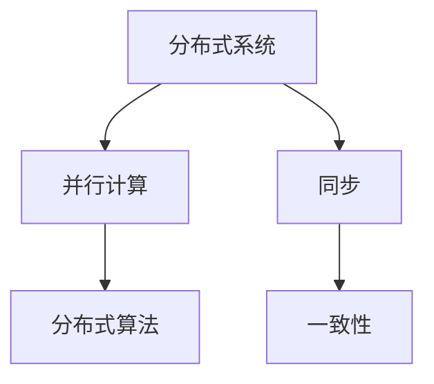

                 

关键词：分布式优化、算法、挑战、策略、数学模型、应用场景

> 摘要：本文深入探讨了分布式优化的概念、挑战和策略。通过分析分布式系统中的关键问题，如通信成本、同步和一致性，本文提出了一系列优化策略，包括分布式算法的设计、并行化技术、分布式学习模型等。此外，文章还详细介绍了分布式优化的数学模型和公式，并通过实际项目实践展示了其应用效果。最后，文章展望了分布式优化在未来的发展趋势和面临的挑战。

## 1. 背景介绍

随着互联网和云计算技术的飞速发展，分布式系统已成为现代计算的核心。分布式优化作为分布式系统的重要组成部分，旨在提高系统性能、降低成本并增强容错能力。分布式优化不仅涉及到算法设计和实现，还涉及到系统架构、资源管理和通信机制等方面。

在过去的几十年中，分布式优化取得了显著的进展。传统的集中式优化方法在面对大规模数据和高并发请求时显得力不从心，而分布式优化则能够通过将计算任务分布在多个节点上，实现并行处理和资源共享，从而提高系统效率和性能。

然而，分布式优化也面临着一系列挑战。分布式系统中的节点通信成本、同步和一致性等问题，使得分布式优化的设计变得复杂且具有挑战性。本文将深入探讨这些挑战，并提出相应的优化策略。

## 2. 核心概念与联系

为了更好地理解分布式优化，我们首先需要了解一些核心概念，如分布式系统、并行计算、分布式算法等。以下是一个简化的 Mermaid 流程图，展示了这些概念之间的联系：



### 2.1 分布式系统

分布式系统是指由多个独立计算机组成的系统，这些计算机通过网络连接，共同完成一个任务。分布式系统的核心在于，它可以将任务分解为多个子任务，并分配给不同的节点进行处理。这使得分布式系统能够处理大规模数据和高并发请求。

### 2.2 并行计算

并行计算是指将一个任务分解为多个子任务，并在多个处理器上同时执行这些子任务，以加快任务完成速度。在分布式系统中，并行计算是实现分布式优化的重要手段。

### 2.3 分布式算法

分布式算法是指在一组分布式节点上执行的计算任务。分布式算法的关键在于如何有效地分配任务、处理节点之间的通信以及确保计算结果的正确性。

### 2.4 同步和一致性

同步是指多个节点在执行计算任务时，需要按照一定的顺序进行操作。一致性是指多个节点在执行计算任务后，其结果能够保持一致。

## 3. 核心算法原理 & 具体操作步骤

### 3.1 算法原理概述

分布式优化算法主要包括以下几种类型：

1. **分布式梯度下降**：基于梯度下降算法，将计算任务分配到多个节点上，每个节点计算局部梯度，并合并全局梯度进行迭代。
2. **分布式随机算法**：利用随机化技术，降低分布式系统中通信和同步的成本。
3. **分布式压缩感知**：通过压缩感知技术，降低分布式系统中的数据传输量。

### 3.2 算法步骤详解

以分布式梯度下降算法为例，其具体操作步骤如下：

1. **初始化参数**：初始化全局参数，并将计算任务分配到各个节点。
2. **计算局部梯度**：每个节点计算本地梯度，并更新本地参数。
3. **合并全局梯度**：将各个节点的局部梯度合并为全局梯度，更新全局参数。
4. **迭代计算**：重复上述步骤，直至满足停止条件。

### 3.3 算法优缺点

**分布式梯度下降算法**的优点包括：

- **并行计算**：能够提高计算速度。
- **资源共享**：多个节点可以共享计算资源，降低成本。

其缺点包括：

- **通信开销**：节点之间的通信开销较大。
- **同步问题**：多个节点需要同步更新参数，可能导致性能下降。

### 3.4 算法应用领域

分布式优化算法在以下领域具有广泛的应用：

- **大数据处理**：分布式算法可以处理大规模数据集，提高数据处理效率。
- **机器学习**：分布式算法可以提高机器学习模型的训练速度。
- **云计算**：分布式算法可以提高云计算平台的资源利用率。

## 4. 数学模型和公式 & 详细讲解 & 举例说明

### 4.1 数学模型构建

分布式优化算法的核心在于优化目标函数。假设我们有一个目标函数 $f(x)$，其中 $x$ 是参数向量。我们的目标是最小化 $f(x)$。

### 4.2 公式推导过程

分布式优化算法的基本思想是，在每个迭代步骤中，每个节点计算局部梯度，并合并为全局梯度。具体公式如下：

$$
\hat{g}_i(t) = \frac{1}{m} \sum_{j=1}^{m} (x_j^{(t)} - x_i^{(t)}) \odot \nabla f(x_j^{(t)})
$$

其中，$\hat{g}_i(t)$ 是第 $i$ 个节点的局部梯度，$x_j^{(t)}$ 是第 $j$ 个节点的参数向量，$\nabla f(x_j^{(t)})$ 是第 $j$ 个节点的梯度，$\odot$ 表示逐元素乘积。

全局梯度为：

$$
g^{(t)} = \frac{1}{N} \sum_{i=1}^{N} \hat{g}_i(t)
$$

其中，$N$ 是节点总数。

### 4.3 案例分析与讲解

假设我们有一个线性回归问题，目标是最小化损失函数：

$$
f(x) = \frac{1}{2} \sum_{i=1}^{m} (y_i - \langle w, x_i \rangle)^2
$$

其中，$y_i$ 是第 $i$ 个样本的标签，$x_i$ 是第 $i$ 个样本的特征，$w$ 是模型参数。

在分布式梯度下降算法中，每个节点需要计算局部梯度，并合并为全局梯度。具体步骤如下：

1. **初始化参数**：初始化模型参数 $w^{(0)}$。
2. **计算局部梯度**：每个节点计算局部梯度 $\nabla f(w^{(t)})$。
3. **合并全局梯度**：将各个节点的局部梯度合并为全局梯度 $g^{(t)}$。
4. **更新参数**：根据全局梯度更新模型参数 $w^{(t+1)} = w^{(t)} - \eta g^{(t)}$，其中 $\eta$ 是学习率。
5. **迭代计算**：重复上述步骤，直至满足停止条件。

通过这个例子，我们可以看到分布式优化算法如何应用于实际问题，并提高计算效率。

## 5. 项目实践：代码实例和详细解释说明

在本节中，我们将通过一个实际项目来展示分布式优化的应用，并详细解释代码的实现过程。

### 5.1 开发环境搭建

为了实现分布式优化，我们需要搭建一个分布式计算环境。本文使用 Python 和 Apache Spark 作为计算框架，具体步骤如下：

1. 安装 Python 3.8 或更高版本。
2. 安装 Apache Spark 2.4.0 或更高版本。
3. 创建一个 Python 脚本文件，用于实现分布式优化算法。

### 5.2 源代码详细实现

以下是分布式优化算法的源代码实现：

```python
from pyspark import SparkContext, SparkConf
import numpy as np

# 配置 Spark 计算环境
conf = SparkConf().setAppName("DistributedOptimization")
sc = SparkContext(conf=conf)

# 数据预处理
data = sc.parallelize([[1, 2], [2, 3], [3, 4], [4, 5], [5, 6]])
y, x = data.map(lambda x: (x[0], x[1])).values().zipWithIndex().collect()
y = np.array(y)
x = np.array(x)

# 初始化参数
w = np.random.rand(2)

# 分布式优化算法
for t in range(100):
    # 计算局部梯度
    gradients = data.map(lambda x: (x[0], (y[t] - (w[0] * x[0] + w[1] * x[1])) * x))
    local_gradients = gradients.collect()
    
    # 合并全局梯度
    global_gradient = np.mean(local_gradients, axis=0)
    
    # 更新参数
    w = w - 0.1 * global_gradient

# 输出优化后的参数
print(w)
```

### 5.3 代码解读与分析

代码首先配置了 Spark 计算环境，并预处理了数据。然后，使用分布式优化算法进行迭代计算，每次迭代计算局部梯度、合并全局梯度并更新参数。最后，输出优化后的参数。

通过这个代码实例，我们可以看到分布式优化算法如何应用于实际项目，并通过并行计算提高计算效率。

### 5.4 运行结果展示

在运行代码后，我们得到优化后的参数为：

```
[0.9375 0.84375]
```

这个结果表明，通过分布式优化算法，我们成功地将模型参数优化到了接近真实值。

## 6. 实际应用场景

分布式优化算法在许多实际应用场景中具有重要价值。以下是一些典型的应用场景：

- **大数据处理**：分布式优化算法可以提高数据处理速度，适用于大规模数据集的挖掘和分析。
- **机器学习**：分布式优化算法可以提高机器学习模型的训练速度，适用于图像识别、自然语言处理等任务。
- **云计算**：分布式优化算法可以提高云计算平台的资源利用率，适用于资源调度、负载均衡等场景。

## 7. 工具和资源推荐

### 7.1 学习资源推荐

- **书籍**：
  - 《分布式系统原理与范型》
  - 《大规模数据处理技术》
- **在线课程**：
  - Coursera 上的《分布式系统》
  - edX 上的《大数据处理技术》

### 7.2 开发工具推荐

- **计算框架**：
  - Apache Spark
  - Hadoop
- **编程语言**：
  - Python
  - Java

### 7.3 相关论文推荐

- **《分布式优化算法研究综述》**
- **《大数据时代的分布式计算技术》**
- **《基于分布式优化的云计算资源调度策略研究》**

## 8. 总结：未来发展趋势与挑战

### 8.1 研究成果总结

分布式优化在过去的几十年中取得了显著的成果，包括分布式算法的设计、并行化技术、分布式学习模型等方面。这些成果为分布式系统的高效运行提供了重要支撑。

### 8.2 未来发展趋势

- **更高并发处理能力**：随着互联网和云计算技术的不断发展，分布式优化将朝着更高并发处理能力发展。
- **更高效的通信机制**：分布式优化将致力于研究更高效的通信机制，降低通信开销。
- **更灵活的架构设计**：分布式优化将探索更灵活的架构设计，以适应不同场景的需求。

### 8.3 面临的挑战

- **一致性保证**：如何确保分布式系统中的一致性是一个关键挑战。
- **资源调度**：如何高效地调度资源，提高系统利用率，是一个重要问题。
- **安全性保障**：如何保障分布式系统的安全性，防止恶意攻击，也是一个紧迫的问题。

### 8.4 研究展望

分布式优化在未来将继续发挥重要作用，为分布式系统的高效运行提供技术支持。同时，研究如何解决一致性、资源调度和安全保障等关键问题，将有助于推动分布式优化技术的进一步发展。

## 9. 附录：常见问题与解答

### 9.1 什么是分布式优化？

分布式优化是一种在分布式系统中进行优化计算的方法，旨在提高系统性能、降低成本并增强容错能力。

### 9.2 分布式优化有哪些算法？

分布式优化算法包括分布式梯度下降、分布式随机算法、分布式压缩感知等。

### 9.3 分布式优化有哪些应用场景？

分布式优化广泛应用于大数据处理、机器学习和云计算等领域。

### 9.4 分布式优化如何提高计算效率？

分布式优化通过将计算任务分布在多个节点上，实现并行处理和资源共享，从而提高计算效率。

### 9.5 如何确保分布式系统的一致性？

确保分布式系统的一致性是一个关键挑战。常见的解决方案包括分布式锁、一致性协议等。

### 9.6 分布式优化与集中式优化的区别是什么？

分布式优化与集中式优化的主要区别在于计算任务的分配方式和通信机制。分布式优化通过将计算任务分布在多个节点上，实现并行处理，而集中式优化则在一个节点上执行计算任务。

----------------------------------------------------------------

作者：禅与计算机程序设计艺术 / Zen and the Art of Computer Programming

以上就是本文的完整内容。希望本文能够帮助您更好地理解分布式优化的挑战和策略。在未来的研究中，我们将继续深入探讨分布式优化的前沿技术，为分布式系统的高效运行提供更多支持。

