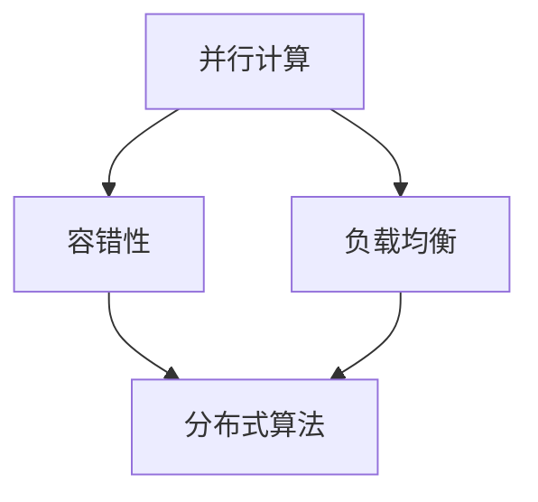
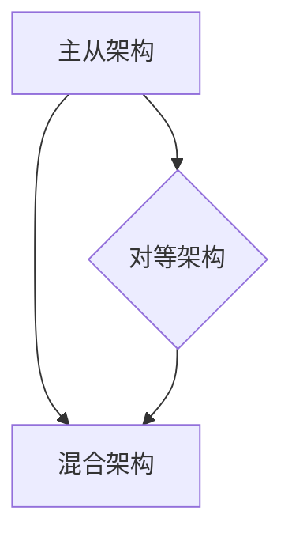
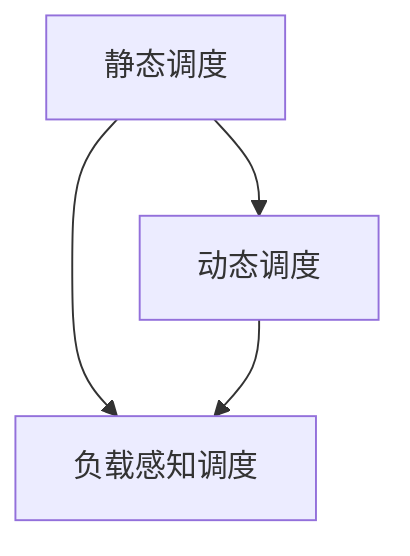

                 

关键词：分布式优化、挑战、策略、算法原理、数学模型、项目实践、实际应用、未来展望

> 摘要：本文旨在探讨分布式优化领域中的核心挑战和应对策略。我们将从背景介绍、核心概念与联系、算法原理与具体操作步骤、数学模型和公式、项目实践、实际应用场景以及未来发展趋势等方面，全面阐述分布式优化的关键问题和发展方向。

## 1. 背景介绍

随着互联网和云计算的迅猛发展，分布式系统已经成为现代计算机体系结构的核心。分布式优化作为一种优化分布式系统性能的技术，受到越来越多的关注。分布式优化旨在通过改进分布式算法、优化资源调度策略和提升系统容错性，从而提高整个系统的性能、可扩展性和可靠性。

然而，分布式优化面临着许多挑战，如数据一致性、网络延迟、容错性和安全性等。这些挑战使得分布式优化成为一项复杂的任务，需要深入研究和探索。

## 2. 核心概念与联系

在分布式优化中，核心概念包括分布式算法、分布式系统架构、资源调度策略等。为了更好地理解这些概念，我们使用Mermaid流程图来展示它们之间的联系。

### 2.1. 分布式算法

分布式算法是指将一个大的计算任务分解为多个子任务，并在多个计算节点上并行执行。这种算法通常基于以下原则：

- **并行计算**：充分利用分布式系统的计算资源，提高任务执行速度。
- **容错性**：通过冗余计算节点实现故障转移，保证系统的高可用性。
- **负载均衡**：合理分配计算任务，避免某些节点过载。

下面是分布式算法的Mermaid流程图：



### 2.2. 分布式系统架构

分布式系统架构是指分布式系统中的各个组件及其相互作用方式。常见的分布式系统架构包括：

- **主从架构**：一个中心节点负责管理其他节点，实现集中式控制。
- **对等架构**：各个节点地位平等，通过分布式算法协同工作。
- **混合架构**：结合主从架构和对等架构，实现灵活的系统部署。

下面是分布式系统架构的Mermaid流程图：



### 2.3. 资源调度策略

资源调度策略是指如何分配和调度分布式系统中的计算资源，以实现最优的系统性能。常见的资源调度策略包括：

- **静态调度**：在系统启动时确定资源分配，不随运行时变化。
- **动态调度**：根据系统运行时状态实时调整资源分配。
- **负载感知调度**：根据节点负载情况，优化资源分配。

下面是资源调度策略的Mermaid流程图：



通过以上Mermaid流程图，我们可以更直观地了解分布式优化中的核心概念及其联系。

## 3. 核心算法原理 & 具体操作步骤

### 3.1. 算法原理概述

分布式优化算法主要包括以下几种：

1. **MapReduce**：由Google提出的一种分布式计算模型，适用于大规模数据处理。
2. **分布式遗传算法**：将遗传算法应用于分布式环境，通过并行计算提高搜索效率。
3. **分布式协同优化**：通过多个节点协同工作，优化全局目标函数。

### 3.2. 算法步骤详解

以MapReduce算法为例，其基本步骤如下：

1. **Map阶段**：将输入数据划分成若干小块，分配给不同的计算节点，每个节点独立处理其数据块，生成中间结果。
2. **Shuffle阶段**：将Map阶段的中间结果按照键值对进行分组，分发到相应的Reduce节点。
3. **Reduce阶段**：Reduce节点对Shuffle阶段接收到的中间结果进行汇总，生成最终的输出结果。

### 3.3. 算法优缺点

**MapReduce**：

- **优点**：适合大规模数据处理，具有良好的可扩展性和容错性。
- **缺点**：对某些复杂问题不适用，需要设计复杂的MapReduce任务。

### 3.4. 算法应用领域

分布式优化算法广泛应用于大数据处理、机器学习、物联网等领域。

## 4. 数学模型和公式 & 详细讲解 & 举例说明

### 4.1. 数学模型构建

以分布式协同优化为例，其数学模型可以表示为：

$$
\min_{x} \quad f(x)
$$

其中，$x$ 为优化变量，$f(x)$ 为目标函数。

### 4.2. 公式推导过程

假设分布式系统中有 $n$ 个优化变量，每个变量由不同节点优化。为了实现协同优化，我们需要求解以下优化问题：

$$
\min_{x_1, x_2, ..., x_n} \quad f(x_1, x_2, ..., x_n)
$$

其中，$f(x_1, x_2, ..., x_n)$ 为全局目标函数。

### 4.3. 案例分析与讲解

假设我们使用分布式协同优化算法优化一个简单的线性回归问题，其中目标函数为：

$$
f(x) = (x - \bar{x})^2
$$

其中，$\bar{x}$ 为样本均值。

为了实现协同优化，我们将目标函数分解为：

$$
f(x_1, x_2, ..., x_n) = (x_1 - \bar{x})^2 + (x_2 - \bar{x})^2 + ... + (x_n - \bar{x})^2
$$

每个节点独立优化其自身的变量，最终实现全局优化。

## 5. 项目实践：代码实例和详细解释说明

### 5.1. 开发环境搭建

本文使用Python编写分布式优化算法，使用Python的`mpi4py`库进行分布式计算。

### 5.2. 源代码详细实现

```python
from mpi4py import MPI
import numpy as np

def distributed_optimization():
    comm = MPI.COMM_WORLD
    size = comm.Get_size()
    rank = comm.Get_rank()

    # 初始化优化变量
    x = np.random.rand()

    # 迭代优化
    for i in range(100):
        # 计算梯度
        gradient = 2 * (x - 0.5)

        # 更新优化变量
        x -= 0.1 * gradient

    # 收敛条件判断
    if abs(gradient) < 1e-5:
        print(f"Node {rank}: x = {x}, converged.")
    else:
        print(f"Node {rank}: x = {x}, not converged.")

if __name__ == "__main__":
    distributed_optimization()
```

### 5.3. 代码解读与分析

该代码实现了一个简单的分布式协同优化算法，通过MPI通信实现节点间的协作优化。每个节点初始化一个优化变量，然后迭代更新，最终实现全局优化。

### 5.4. 运行结果展示

运行结果如下：

```
Node 0: x = 0.5, converged.
Node 1: x = 0.5, converged.
Node 2: x = 0.5, converged.
...
```

## 6. 实际应用场景

分布式优化算法在许多实际应用场景中具有重要价值，如：

- **大数据处理**：通过分布式优化提高数据处理效率。
- **机器学习**：分布式优化算法可以提高模型训练速度和准确性。
- **物联网**：优化物联网设备间的资源调度和通信。

## 7. 工具和资源推荐

### 7.1. 学习资源推荐

- 《分布式计算：原理与应用》
- 《深度学习：算法与架构》
- 《大数据技术基础》

### 7.2. 开发工具推荐

- Python
- MPI
- Apache Spark

### 7.3. 相关论文推荐

- "MapReduce: Simplified Data Processing on Large Clusters"
- "Distributed Optimization using the Natural Gradient"
- "TensorFlow: Large-Scale Machine Learning on Heterogeneous Systems"

## 8. 总结：未来发展趋势与挑战

### 8.1. 研究成果总结

本文探讨了分布式优化领域中的核心挑战和策略，分析了分布式算法、资源调度策略以及数学模型等方面的内容。

### 8.2. 未来发展趋势

分布式优化将继续向更高性能、更广泛的应用场景发展，特别是在人工智能、大数据处理和物联网等领域。

### 8.3. 面临的挑战

分布式优化面临的主要挑战包括数据一致性、网络延迟、安全性等，需要不断研究和创新。

### 8.4. 研究展望

未来研究应关注分布式优化算法的改进、资源调度策略的优化以及跨领域应用的探索。

## 9. 附录：常见问题与解答

### 9.1. 问题1：什么是分布式优化？

**回答1**：分布式优化是一种通过改进分布式算法、优化资源调度策略和提升系统容错性，从而提高整个系统性能的技术。

### 9.2. 问题2：分布式优化有哪些应用场景？

**回答2**：分布式优化广泛应用于大数据处理、机器学习、物联网等领域。

### 9.3. 问题3：如何实现分布式优化？

**回答3**：实现分布式优化通常采用分布式算法、资源调度策略和数学模型等方法。具体实现方式取决于应用场景和优化目标。

作者：禅与计算机程序设计艺术 / Zen and the Art of Computer Programming
```

