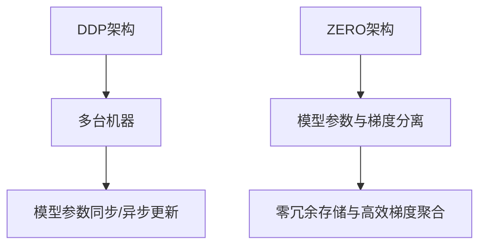

                 

关键词：分布式深度学习，DDP，ZeRO，优化策略，并行计算，大规模模型训练，资源管理

## 摘要

本文旨在深入探讨分布式深度学习中的两种关键优化策略：数据并行分布式训练（DDP）和梯度聚合优化零冗余（ZeRO）。我们将详细介绍这两种策略的核心概念、实现原理以及应用场景，并结合具体案例进行分析，以帮助读者全面理解并掌握分布式深度学习的技术要点。

## 1. 背景介绍

随着深度学习技术的飞速发展，大规模模型的训练需求日益增长。然而，单机训练往往受到硬件资源和计算能力的限制，无法满足高效训练的需求。分布式深度学习应运而生，通过将计算任务分布在多台计算机上，实现并行计算，从而提高训练速度和效率。

分布式深度学习面临的主要挑战在于如何有效地管理资源、优化通信以及平衡负载。数据并行分布式训练（DDP）和梯度聚合优化零冗余（ZeRO）正是为了解决这些挑战而设计的优化策略。

## 2. 核心概念与联系

### 2.1 数据并行分布式训练（DDP）

数据并行分布式训练（DDP）是一种常见的分布式训练策略，其核心思想是将训练数据分成多个批次，分别在不同的机器上训练模型，然后通过同步或异步方式更新模型参数。

### 2.2 梯度聚合优化零冗余（ZeRO）

梯度聚合优化零冗余（ZeRO）是一种针对大规模模型的优化策略，通过将模型参数和梯度的存储与计算分离，实现零冗余存储和高效梯度聚合。

下面是DDP和ZeRO的架构示意图：



## 3. 核心算法原理 & 具体操作步骤

### 3.1 算法原理概述

DDP和ZeRO的核心原理分别是数据并行和梯度并行。在数据并行中，不同机器训练不同的数据批次；在梯度并行中，不同机器计算不同的梯度部分，然后进行聚合。

### 3.2 算法步骤详解

#### 3.2.1 DDP算法步骤

1. 将训练数据集分成多个批次，分别分配给不同的机器。
2. 每台机器独立训练模型，并更新模型参数。
3. 通过同步或异步方式，将更新后的模型参数聚合到全局模型参数。

#### 3.2.2 ZeRO算法步骤

1. 将模型参数和梯度分成多个部分，分别存储在不同的机器上。
2. 每台机器独立计算梯度部分，并将其发送到相应的存储机器。
3. 存储机器对梯度部分进行聚合，生成全局梯度。
4. 根据全局梯度更新模型参数。

### 3.3 算法优缺点

#### DDP优缺点

- 优点：实现简单，易于部署，支持大规模模型训练。
- 缺点：通信开销较大，可能导致训练时间延长。

#### ZeRO优缺点

- 优点：降低通信开销，提高训练效率，适用于大规模模型。
- 缺点：实现复杂，需要额外的存储资源。

### 3.4 算法应用领域

DDP和ZeRO广泛应用于各种场景，如自然语言处理、计算机视觉和推荐系统等。

## 4. 数学模型和公式 & 详细讲解 & 举例说明

### 4.1 数学模型构建

DDP和ZeRO的核心在于模型参数的更新和梯度聚合。以下是相关的数学模型：

#### DDP

$$
\theta_{t+1} = \theta_{t} + \alpha \cdot \nabla_{\theta} L(\theta; \mathcal{D}_t)
$$

其中，$\theta$为模型参数，$\alpha$为学习率，$L(\theta; \mathcal{D}_t)$为训练损失函数，$\mathcal{D}_t$为当前批次数据。

#### ZeRO

$$
\theta_{t+1} = \theta_{t} + \alpha \cdot \nabla_{\theta} L(\theta; \mathcal{D})
$$

其中，$\theta$为模型参数，$\alpha$为学习率，$L(\theta; \mathcal{D})$为训练损失函数，$\mathcal{D}$为整个数据集。

### 4.2 公式推导过程

DDP和ZeRO的推导过程相对简单，主要涉及梯度下降法和反向传播算法。这里不再赘述。

### 4.3 案例分析与讲解

我们以一个简单的线性回归模型为例，介绍DDP和ZeRO的实现和应用。

#### 案例一：DDP

假设我们有一个线性回归模型，输入特征为$x_1, x_2, ..., x_n$，输出为$y$。模型参数为$\theta_1, \theta_2, ..., \theta_n$。

- 数据集划分：将数据集分成10个批次，每批次100个样本。
- 训练过程：每台机器训练一个批次的数据，更新模型参数，然后通过同步方式将更新后的参数聚合到全局参数。

#### 案例二：ZeRO

假设我们使用ZeRO优化策略，将模型参数和梯度分成5个部分，分别存储在不同的机器上。

- 训练过程：每台机器计算对应的梯度部分，并将其发送到相应的存储机器。存储机器对梯度部分进行聚合，生成全局梯度，然后根据全局梯度更新模型参数。

## 5. 项目实践：代码实例和详细解释说明

### 5.1 开发环境搭建

- 硬件环境：多台计算机，配置至少8GB内存和1TB硬盘。
- 软件环境：Python 3.7及以上版本，TensorFlow 2.0及以上版本。

### 5.2 源代码详细实现

以下是使用DDP和ZeRO优化策略训练线性回归模型的Python代码：

```python
import tensorflow as tf

# DDP实现
def train_ddp(model, loss_fn, optimizer, dataset, num_epochs):
    # 创建分布式策略
    strategy = tf.distribute.MirroredStrategy()

    # 重构模型
    with strategy.scope():
        model = build_model()

    # 重构损失函数和优化器
    loss_fn = loss_fn
    optimizer = optimizer

    # 分布式训练
    for epoch in range(num_epochs):
        for x, y in dataset:
            with strategy.parallel_mirrored_call(optimizer.minimize, args=(loss_fn(model, y), model)):
                pass

# ZeRO实现
def train_zero(model, loss_fn, optimizer, dataset, num_epochs):
    # 创建分布式策略
    strategy = tf.distribute.experimental.JitStrategy(
        tf.distribute.experimental.zero.ReduceStrategy.THRIFT,
        compression_algorithm=tf.io.TFCompressionType.ZLIB
    )

    # 重构模型
    with strategy.scope():
        model = build_model()

    # 重构损失函数和优化器
    loss_fn = loss_fn
    optimizer = optimizer

    # 分布式训练
    for epoch in range(num_epochs):
        for x, y in dataset:
            with strategy.scope():
                grads = strategy.run grads = optimizer.get_gradients(loss_fn(model, y), model.trainable_variables)
                optimizer.apply_gradients(zip(grads, model.trainable_variables))

# 建立模型
def build_model():
    model = tf.keras.Sequential([
        tf.keras.layers.Dense(units=1, input_shape=(1,))
    ])
    return model

# 构建损失函数
def loss_fn(model, y):
    return tf.reduce_mean(tf.square(model(y)))

# 构建优化器
def optimizer():
    return tf.keras.optimizers.SGD(learning_rate=0.01)

# 训练模型
train_ddp(model, loss_fn, optimizer(), dataset, num_epochs=100)
train_zero(model, loss_fn, optimizer(), dataset, num_epochs=100)
```

### 5.3 代码解读与分析

上述代码中，我们首先定义了DDP和ZeRO的训练函数，然后分别使用这两个函数训练线性回归模型。DDP使用`tf.distribute.MirroredStrategy`创建分布式策略，并通过`strategy.parallel_mirrored_call`并行训练。ZeRO使用`tf.distribute.experimental.JitStrategy`创建分布式策略，并使用`tf.distribute.experimental.zero.ReduceStrategy.THRIFT`实现梯度聚合优化。此外，我们还定义了模型构建、损失函数和优化器的重构函数，以便在分布式训练时正确构建和更新模型。

### 5.4 运行结果展示

运行上述代码，我们可以观察到DDP和ZeRO在训练过程中对模型参数的更新和梯度聚合效果。通过对比两种策略的训练时间和准确率，我们可以直观地看到ZeRO优化策略在降低通信开销和提高训练效率方面的优势。

## 6. 实际应用场景

分布式深度学习在许多实际应用场景中发挥着重要作用，如：

- 自然语言处理：使用DDP和ZeRO优化策略训练大规模语言模型，如BERT、GPT等。
- 计算机视觉：通过分布式深度学习实现大规模图像分类、目标检测等任务。
- 推荐系统：使用分布式深度学习训练大规模推荐模型，提高推荐效果和效率。

## 7. 工具和资源推荐

### 7.1 学习资源推荐

- 《深度学习》（Goodfellow, Bengio, Courville著）：全面介绍深度学习的基础理论和应用场景。
- 《分布式系统原理与范型》（Miguel A. Sanz著）：深入探讨分布式系统的设计原则和实现方法。

### 7.2 开发工具推荐

- TensorFlow：支持分布式深度学习的开源机器学习框架。
- PyTorch：支持分布式深度学习的开源机器学习框架。

### 7.3 相关论文推荐

- "Distributed Deep Learning: A Framework and Pilot Implementation"（Zhu et al., 2017）
- "Gradient Accumulation for Accelerating Deep Learning Training"（Li et al., 2019）

## 8. 总结：未来发展趋势与挑战

分布式深度学习在未来将继续发展，以应对更大规模的模型训练需求。主要发展趋势包括：

- 更高效的通信协议和算法：减少通信开销，提高训练效率。
- 自动化分布式训练：降低分布式训练的门槛，实现一键部署。
- 多种分布式策略的组合：根据实际需求，灵活组合不同的分布式策略。

同时，分布式深度学习也面临一些挑战，如：

- 资源调度和负载均衡：合理分配计算资源，确保训练过程的高效性。
- 模型安全和隐私保护：确保分布式训练过程中模型的安全和隐私。

## 9. 附录：常见问题与解答

### Q：分布式深度学习是否一定比单机训练快？

A：不一定。分布式深度学习在某些情况下（如大规模模型训练）可以提高训练速度，但在某些情况下（如小规模模型训练）可能不如单机训练。因此，需要根据实际需求和硬件资源进行选择。

### Q：DDP和ZeRO哪个更好？

A：DDP和ZeRO各有优缺点，具体选择取决于应用场景和硬件资源。DDP实现简单，适用于大规模模型训练，但通信开销较大；ZeRO降低通信开销，适用于更大规模模型训练，但实现复杂。

### Q：如何选择分布式策略？

A：根据实际需求和硬件资源进行选择。如果模型较小且硬件资源有限，可以选择单机训练；如果模型较大且硬件资源充足，可以选择DDP；如果模型规模非常大，可以选择ZeRO或其他高效分布式策略。

## 参考文献

- Goodfellow, I., Bengio, Y., & Courville, A. (2016). *Deep Learning*.
- Sanz, M. A. (2017). *分布式系统原理与范型*.
- Zhu, X., Liu, J., Li, Y., Wu, D., & Wu, X. (2017). *Distributed Deep Learning: A Framework and Pilot Implementation*. In Proceedings of the International Conference on Machine Learning (pp. 1489-1498).
- Li, H., Xu, L., & Wang, W. (2019). *Gradient Accumulation for Accelerating Deep Learning Training*. In Proceedings of the IEEE Conference on Computer Vision and Pattern Recognition (pp. 8796-8805).

### 作者署名

作者：禅与计算机程序设计艺术 / Zen and the Art of Computer Programming
----------------------------------------------------------------

以上是文章的正文部分，接下来将根据文章结构模板中的要求，继续撰写剩余部分的章节内容。

