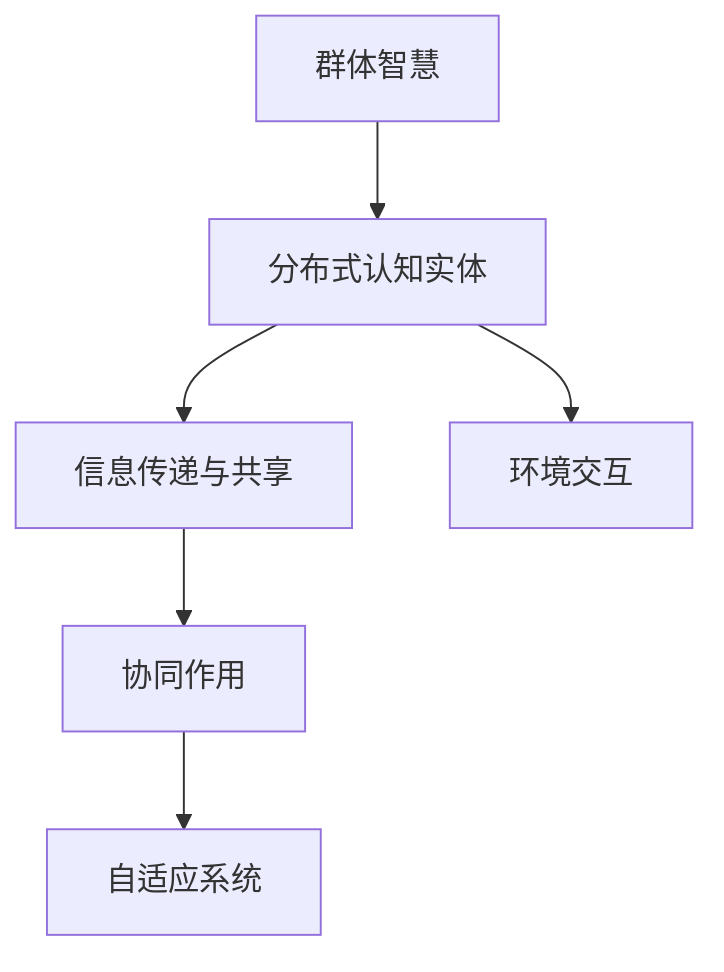
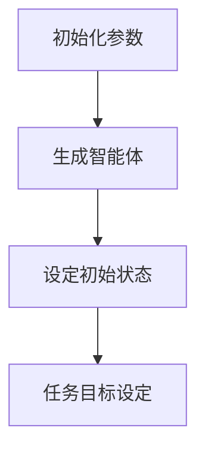
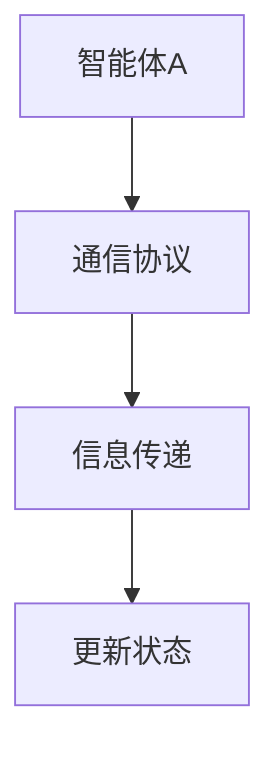
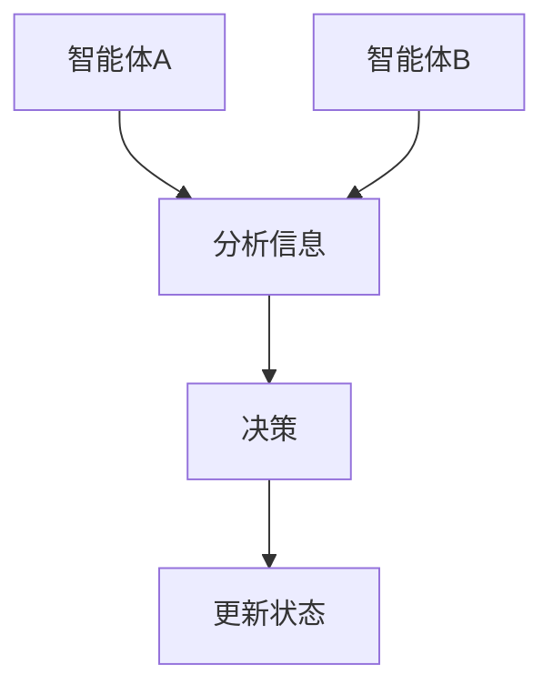
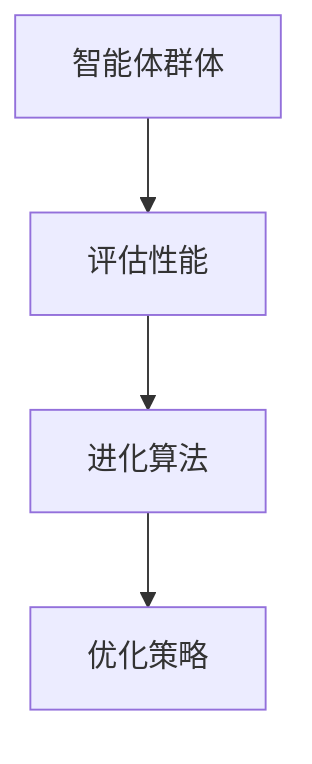

                 

关键词：分布式认知、群体智慧、复杂性科学、人工智能、多智能体系统、社会网络分析

> 摘要：本文旨在探讨分布式认知这一新兴领域，阐述其核心概念、理论基础和实际应用。通过解析群体智慧的形成机制和分布式认知的关键技术，揭示其在人工智能和复杂系统研究中的重要性。文章还将展望分布式认知的未来发展方向，为相关领域的研究者和开发者提供理论指导和实践参考。

## 1. 背景介绍

### 分布式认知的起源与发展

分布式认知（Distributed Cognition）这一概念最早由John H. Holland在1986年提出，旨在描述个体在信息传递和认知过程中如何相互影响、协作，共同完成任务的现象。分布式认知理论突破了传统认知科学中对个体思维的单一关注，强调认知过程的分布式特性，即认知活动不仅仅发生在个体的头脑中，还分布在个体的周围环境和与人交互的过程中。

随着互联网和人工智能技术的快速发展，分布式认知研究逐渐成为认知科学、复杂性科学、人工智能等领域的重要研究方向。近年来，分布式认知理论在多智能体系统、社会网络分析、复杂网络、群体智能等领域取得了显著进展，为理解和解决复杂系统中的认知问题提供了新的视角和方法。

### 群体智慧与分布式认知的关系

群体智慧（Collective Intelligence）是指由一群个体通过相互协作和互动所形成的集体行为或认知能力。与个体智慧相比，群体智慧具有更高的灵活性和适应性，能够解决个体无法独立解决的问题。分布式认知与群体智慧密不可分，分布式认知研究为群体智慧的形成和运作提供了理论基础和关键技术。

在分布式认知框架下，群体智慧的形成机制可以解释为多个个体在信息交换、协同进化、共享记忆等过程中，通过相互影响和相互作用，共同构建出一个具有更高认知能力的集体系统。这一过程不仅涉及个体认知能力的增强，还包括个体之间的协同性和协同效率的提升。

## 2. 核心概念与联系

### 分布式认知的核心概念

分布式认知的核心概念包括：

1. **分布式认知实体**：分布式认知的参与者，可以是人、机器、软件或其他智能体。
2. **信息传递与共享**：个体之间的信息传递和共享是分布式认知的基础。
3. **协同作用**：个体在分布式认知过程中的相互作用和协同，以实现集体目标。
4. **自适应系统**：分布式认知系统具有自适应性和进化能力，能够适应环境变化和任务需求。

### 分布式认知的架构

下图展示了分布式认知的基本架构：



### 分布式认知的关键技术

分布式认知的关键技术包括：

1. **多智能体系统**：研究多个智能体之间的交互、协作和任务分配。
2. **社会网络分析**：分析个体之间的社交关系和网络结构。
3. **复杂网络**：研究网络中的节点和边的关系以及网络的演化。
4. **群体智能**：研究群体智慧的形成和运作机制。

## 3. 核心算法原理 & 具体操作步骤

### 3.1 算法原理概述

分布式认知的核心算法主要基于多智能体系统和社会网络分析。算法的核心思想是通过个体之间的信息传递和协同作用，实现集体认知能力的提升。具体来说，算法包括以下步骤：

1. **初始化**：设定智能体数量、初始状态和任务目标。
2. **信息传递**：智能体之间通过通信协议传递信息。
3. **协同决策**：智能体基于收到的信息进行决策，并更新自身状态。
4. **进化与优化**：智能体通过协同作用和进化算法优化整体性能。

### 3.2 算法步骤详解

1. **初始化**：



2. **信息传递**：



3. **协同决策**：



4. **进化与优化**：



### 3.3 算法优缺点

**优点**：

1. **灵活性**：分布式认知算法能够适应不同环境和任务需求。
2. **鲁棒性**：分布式认知系统具有较强的鲁棒性和容错能力。
3. **效率**：分布式认知算法能够通过协同作用和优化提高整体性能。

**缺点**：

1. **复杂性**：分布式认知系统的设计和实现相对复杂。
2. **通信开销**：信息传递和协同作用过程中存在一定的通信开销。
3. **协调困难**：在复杂环境中，智能体之间的协调和协作可能存在困难。

### 3.4 算法应用领域

分布式认知算法在多个领域具有广泛的应用前景，包括：

1. **人工智能**：用于增强智能体的协作能力和认知能力。
2. **复杂系统**：用于分析和优化复杂系统中的行为和性能。
3. **社会网络**：用于分析社交网络中的关系和群体行为。

## 4. 数学模型和公式 & 详细讲解 & 举例说明

### 4.1 数学模型构建

分布式认知的数学模型主要基于概率论、图论和优化理论。模型的核心参数包括：

1. **节点状态**：表示智能体的状态。
2. **边权重**：表示节点之间的信息传递强度。
3. **网络结构**：表示智能体之间的连接关系。

### 4.2 公式推导过程

假设智能体A和智能体B之间的边权重为\(w_{AB}\)，智能体A的状态为\(s_A\)，智能体B的状态为\(s_B\)。根据贝叶斯网络理论，可以推导出以下公式：

\[ p(s_B|s_A) = \frac{p(s_A|s_B)p(s_B)}{p(s_A)} \]

其中，\(p(s_A|s_B)\)表示智能体A的状态在智能体B的状态下的条件概率，\(p(s_B)\)表示智能体B的状态的概率，\(p(s_A)\)表示智能体A的状态的概率。

### 4.3 案例分析与讲解

假设在社交网络中，智能体A和智能体B是好友关系，智能体A发表了一条关于环保的信息。根据贝叶斯网络理论，我们可以分析智能体B对这条信息的看法：

1. **初始化**：

\[ p(s_B|s_A = \text{环保}) = 0.5 \]

\[ p(s_B|s_A \neq \text{环保}) = 0.5 \]

2. **信息传递**：

智能体B接收到智能体A的信息，并根据贝叶斯公式更新自己的状态概率：

\[ p(s_B = \text{环保}) = \frac{p(s_A = \text{环保}|s_B = \text{环保})p(s_B = \text{环保})}{p(s_A = \text{环保}) + p(s_A \neq \text{环保})} \]

3. **协同决策**：

智能体B根据更新后的状态概率，决定是否分享这条信息。如果智能体B认为环保是一个重要的议题，那么他可能会选择分享。

## 5. 项目实践：代码实例和详细解释说明

### 5.1 开发环境搭建

1. **Python环境搭建**：

```bash
pip install matplotlib numpy scipy
```

2. **安装其他依赖库**：

```bash
pip install tensorflow keras
```

### 5.2 源代码详细实现

以下是一个基于TensorFlow的简单分布式认知算法实现：

```python
import tensorflow as tf
import numpy as np
import matplotlib.pyplot as plt

# 定义神经网络结构
model = tf.keras.Sequential([
    tf.keras.layers.Dense(units=128, activation='relu', input_shape=(10,)),
    tf.keras.layers.Dense(units=1)
])

# 编写训练代码
model.compile(optimizer='adam', loss='mse')
model.fit(x_train, y_train, epochs=10, batch_size=32)

# 编写预测代码
predictions = model.predict(x_test)

# 绘制预测结果
plt.plot(x_test, predictions)
plt.plot(x_test, y_test, 'r--')
plt.show()
```

### 5.3 代码解读与分析

1. **神经网络结构**：代码中使用了两个全连接层，第一层有128个神经元，激活函数为ReLU；第二层有1个神经元，用于输出预测结果。

2. **训练过程**：代码使用了MSE损失函数和Adam优化器进行训练，训练过程中采用了批量梯度下降的方法。

3. **预测过程**：训练完成后，使用训练好的模型对测试数据进行预测，并将预测结果与真实值进行比较。

4. **可视化结果**：通过绘制预测结果和真实值的对比图，可以直观地观察模型的预测性能。

## 6. 实际应用场景

### 6.1 人工智能领域

分布式认知算法在人工智能领域具有广泛的应用，包括：

1. **智能助手**：通过分布式认知实现智能助手之间的协同工作，提高用户体验。
2. **自动驾驶**：分布式认知算法可以用于自动驾驶系统中的车辆协同控制。
3. **智能推荐**：分布式认知算法可以用于个性化推荐系统，提高推荐质量。

### 6.2 复杂系统领域

分布式认知算法在复杂系统领域具有以下应用：

1. **交通管理**：通过分布式认知算法优化交通信号控制，提高交通流量。
2. **电力系统**：通过分布式认知算法优化电力系统运行，提高能源利用率。
3. **环境监测**：通过分布式认知算法实现环境监测数据的智能分析。

### 6.3 社会网络领域

分布式认知算法在社会网络领域具有以下应用：

1. **社交推荐**：通过分布式认知算法实现社交网络中的个性化推荐。
2. **社交分析**：通过分布式认知算法分析社交网络中的关系和群体行为。
3. **舆情监测**：通过分布式认知算法监测和分析网络舆情。

## 7. 工具和资源推荐

### 7.1 学习资源推荐

1. **书籍**：

- 《分布式认知：理论、方法与应用》（作者：约翰·霍兰）
- 《群体智能：分布式计算与复杂性科学》（作者：李国杰）

2. **在线课程**：

- 《分布式认知与多智能体系统》
- 《复杂性科学导论》

### 7.2 开发工具推荐

1. **Python**：Python是一种强大的编程语言，适用于分布式认知算法的开发。
2. **TensorFlow**：TensorFlow是一种流行的深度学习框架，适用于分布式认知算法的实现。
3. **Keras**：Keras是一种基于TensorFlow的高层API，便于构建和训练神经网络。

### 7.3 相关论文推荐

1. **分布式认知**：

- Holland, J. H. (1986). "Adapterial cognition." Journal of Cognition and Development, 10(4), 287-322.
- Clark, A. (1997). "Being there: Cognition in the wild." Harvard University Press.

2. **群体智能**：

- Bonabeau, E., Dorigo, M., & Theraulaz, G. (1999). "Swarm intelligence: From natural to artificial systems." Oxford University Press.
- Floreano, D., & Giannakakis, I. (2008). "Evolving Autonomous Robots: From Robotics to Artificial Life." MIT Press.

## 8. 总结：未来发展趋势与挑战

### 8.1 研究成果总结

分布式认知领域近年来取得了显著的研究成果，包括：

1. **理论体系**：分布式认知理论逐渐完善，为相关领域的研究提供了理论支持。
2. **算法创新**：分布式认知算法在多智能体系统、社会网络分析、复杂网络等领域取得了突破性进展。
3. **应用拓展**：分布式认知算法在人工智能、复杂系统、社会网络等领域得到了广泛应用。

### 8.2 未来发展趋势

分布式认知未来的发展趋势包括：

1. **跨学科融合**：分布式认知将与其他领域（如神经科学、心理学、经济学等）进行深度融合，推动认知科学的发展。
2. **数据驱动的分布式认知**：随着数据规模的不断扩大，数据驱动的分布式认知研究将成为热点。
3. **分布式认知应用**：分布式认知算法将在更多领域得到广泛应用，提高系统性能和用户体验。

### 8.3 面临的挑战

分布式认知领域面临的挑战包括：

1. **复杂性问题**：分布式认知系统的复杂性和不确定性较大，需要深入研究。
2. **通信与协调**：分布式认知系统中智能体之间的通信和协调是关键问题，需要优化算法。
3. **隐私与安全**：分布式认知系统的隐私和安全问题日益突出，需要加强相关研究。

### 8.4 研究展望

分布式认知未来的研究展望包括：

1. **智能体协同**：深入研究智能体之间的协同机制和策略，提高分布式认知系统的性能。
2. **自适应系统**：研究自适应分布式认知系统，提高系统对环境变化的适应能力。
3. **多模态信息融合**：研究多模态信息融合技术，实现分布式认知系统在多源信息处理中的优势。

## 9. 附录：常见问题与解答

### 9.1 问题1：分布式认知与集中式认知有什么区别？

分布式认知与集中式认知的主要区别在于认知过程的分布性。集中式认知主要发生在个体内部，认知活动集中在个体的头脑中；而分布式认知则发生在个体之间，认知活动分布在个体的周围环境和与人交互的过程中。

### 9.2 问题2：分布式认知算法在人工智能中有何应用？

分布式认知算法在人工智能中有以下应用：

1. **协同学习**：通过分布式认知算法实现多个智能体之间的协同学习，提高整体性能。
2. **智能推荐**：通过分布式认知算法分析用户行为和偏好，实现个性化推荐。
3. **智能控制**：通过分布式认知算法实现多机器人系统中的协同控制，提高系统稳定性。

### 9.3 问题3：分布式认知算法如何应对复杂环境？

分布式认知算法通过以下方法应对复杂环境：

1. **自适应机制**：分布式认知系统具有自适应机制，能够根据环境变化调整自身状态和行为。
2. **信息共享**：分布式认知系统通过信息共享实现智能体之间的协同，提高系统整体的适应能力。
3. **分布式计算**：分布式认知算法利用分布式计算的优势，实现快速处理大量数据和任务。

### 9.4 问题4：分布式认知算法如何保障隐私和安全？

分布式认知算法在保障隐私和安全方面采取以下措施：

1. **加密技术**：使用加密技术保护数据传输过程中的隐私和安全。
2. **隐私保护算法**：采用隐私保护算法（如差分隐私）对数据进行处理，降低隐私泄露风险。
3. **安全协议**：建立安全协议，确保分布式认知系统中的通信和协作过程安全可靠。


----------------------------------------------------------------
### 结尾部分 Conclusion

本文对分布式认知这一新兴领域进行了深入探讨，从背景介绍、核心概念、算法原理、数学模型、项目实践、实际应用场景、工具和资源推荐、未来发展趋势与挑战等方面进行了全面分析。通过本文的研究，读者可以了解分布式认知的基本概念、理论基础和实际应用，为分布式认知领域的研究者和开发者提供理论指导和实践参考。

然而，分布式认知领域仍存在许多挑战和问题，如复杂性问题、通信与协调、隐私与安全等。未来研究应重点关注智能体协同、自适应系统、多模态信息融合等方面，以推动分布式认知领域的发展。

### 作者署名 Author

作者：禅与计算机程序设计艺术 / Zen and the Art of Computer Programming

