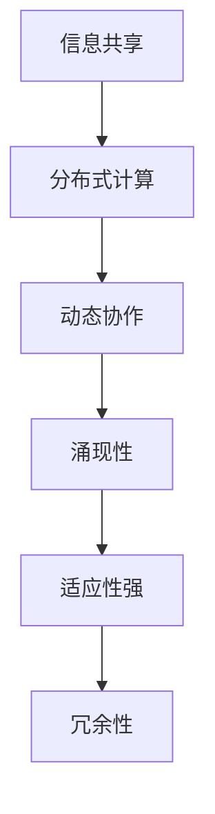
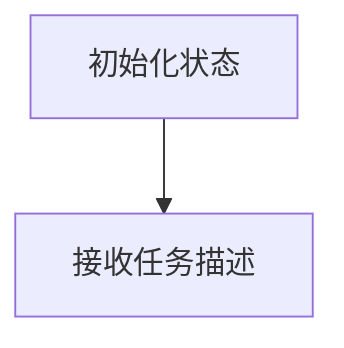
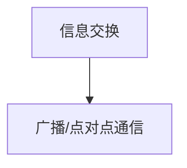
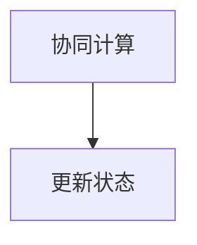
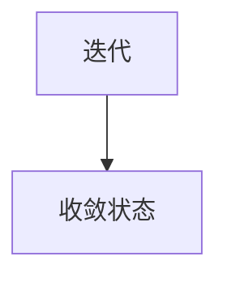

                 

关键词：分布式认知、群体智慧、形成机制、算法原理、数学模型、项目实践、实际应用

> 摘要：本文旨在探讨分布式认知的概念及其在群体智慧形成机制中的应用。通过分析核心概念、算法原理、数学模型以及项目实践，文章揭示了分布式认知的关键要素，为理解和利用群体智慧提供了新的视角。

## 1. 背景介绍

随着互联网和计算技术的发展，个体间的信息交互和协同变得日益频繁。这种趋势催生了群体智慧（Collective Intelligence, CI）的概念，它指的是由众多个体通过相互协作，产生比单个个体更为智慧和高效的集体行为和决策能力。然而，要实现有效的群体智慧，必须理解其形成机制，即如何从个体行为中涌现出群体智慧。

分布式认知（Distributed Cognition）提供了一种解释群体智慧形成机制的框架。分布式认知认为，认知活动不仅仅局限于个体的头脑中，而是分布在整个社交网络中，通过个体间的相互作用和共享信息来实现。这种模式在群体智慧中尤为关键，因为它强调了群体中每个个体的重要性和相互作用。

## 2. 核心概念与联系

### 2.1 分布式认知

分布式认知是指多个个体或系统通过共享环境中的信息、资源和知识，共同完成认知任务的过程。其核心特征包括：

- **信息共享**：个体通过共享信息来协同工作，提高整体认知效率。
- **分布式计算**：任务被分配到不同个体或节点上，每个节点独立处理信息，但相互之间保持通信。
- **动态协作**：个体在执行任务过程中，根据环境和任务的需要动态调整协作方式。

### 2.2 群体智慧

群体智慧是指由多个个体通过协作产生的智慧和决策能力，这些决策和行动往往超越了单个个体的能力。其特征包括：

- **涌现性**：群体智慧往往表现出个体无法预测或解释的集体行为。
- **适应性强**：群体智慧能够适应复杂多变的环境，并迅速作出有效的决策。
- **冗余性**：多个个体的存在降低了系统的脆弱性，增强了整体的生存和适应能力。

### 2.3 Mermaid 流程图

以下是一个简化的分布式认知与群体智慧形成机制的 Mermaid 流程图：



## 3. 核心算法原理 & 具体操作步骤

### 3.1 算法原理概述

分布式认知的核心算法基于多个个体间的信息交换和协同计算。以下是几个关键步骤：

1. **初始化**：每个个体获得初始状态和任务信息。
2. **信息交换**：个体通过通信网络交换状态信息。
3. **协同计算**：个体基于接收到的信息进行局部计算，更新自身状态。
4. **迭代**：重复信息交换和协同计算步骤，直至达到收敛状态。

### 3.2 算法步骤详解

#### 3.2.1 初始化

每个个体初始化状态变量，例如位置、速度、知识库等，并接收全局任务描述。



#### 3.2.2 信息交换

个体通过通信网络交换状态信息。这可以通过广播或点对点通信实现。



#### 3.2.3 协同计算

个体基于接收到的信息进行局部计算，更新自身状态。



#### 3.2.4 迭代

重复信息交换和协同计算步骤，直至达到收敛状态。



### 3.3 算法优缺点

#### 优点

- **高效性**：分布式认知能够利用多个个体的计算资源，提高任务处理效率。
- **容错性**：系统的容错性高，因为多个个体的冗余降低了系统的脆弱性。
- **灵活性**：分布式认知能够适应动态变化的任务和环境。

#### 缺点

- **复杂性**：设计和管理分布式认知系统较为复杂，需要考虑通信延迟、网络拓扑等因素。
- **数据一致性**：在分布式环境中，确保数据一致性是一个挑战。

### 3.4 算法应用领域

分布式认知在多个领域具有广泛应用，包括：

- **智能交通**：通过分布式算法优化交通信号控制和路线规划。
- **金融风控**：利用分布式计算进行风险分析和预测。
- **社交网络分析**：通过分析用户行为和社交关系，发现网络中的关键节点。

## 4. 数学模型和公式 & 详细讲解 & 举例说明

### 4.1 数学模型构建

分布式认知的数学模型通常基于图论和网络理论。以下是几个关键公式：

- **状态更新公式**：

  $$ X_{new} = f(X_{old}, U) $$

  其中，$X_{old}$ 表示当前状态，$U$ 表示外部输入，$f$ 表示状态更新函数。

- **协同计算公式**：

  $$ X_{new} = g(X_{i}, X_{j}) $$

  其中，$X_{i}$ 和 $X_{j}$ 表示两个个体的状态，$g$ 表示协同计算函数。

### 4.2 公式推导过程

分布式认知的推导过程通常基于几个假设：

- **个体独立性**：每个个体独立更新状态，不受其他个体直接影响。
- **信息共享**：个体通过共享信息进行协同计算。
- **局部优化**：每个个体基于局部信息进行状态更新，以优化整体状态。

以下是一个简化的推导过程：

1. **初始化**：每个个体初始化状态。
2. **信息共享**：个体通过通信网络交换状态信息。
3. **局部计算**：个体基于接收到的信息进行局部计算。
4. **状态更新**：个体更新自身状态，以优化整体状态。

### 4.3 案例分析与讲解

#### 案例背景

假设有一个由 N 个个体组成的社交网络，每个个体需要通过协同计算找到网络中的最优路径。

#### 案例分析

1. **初始化**：每个个体初始化位置和目标位置。
2. **信息共享**：个体通过通信网络交换位置信息。
3. **局部计算**：每个个体根据接收到的信息计算局部最优路径。
4. **状态更新**：个体更新自身位置，以优化整体路径。
5. **迭代**：重复信息共享和局部计算步骤，直至找到最优路径。

#### 案例讲解

以下是分布式认知在社交网络路径规划中的应用：

$$ X_{new} = f(X_{old}, U) $$

其中，$X_{old}$ 表示当前位置，$U$ 表示邻居位置信息，$f$ 表示路径更新函数。

## 5. 项目实践：代码实例和详细解释说明

### 5.1 开发环境搭建

为了演示分布式认知的应用，我们使用 Python 编写了一个简单的示例。首先，需要安装必要的库，如 Pandas、NumPy 和 NetworkX。

```bash
pip install pandas numpy networkx
```

### 5.2 源代码详细实现

以下是分布式认知路径规划的源代码：

```python
import numpy as np
import networkx as nx
import matplotlib.pyplot as plt

# 初始化网络
G = nx.Graph()
nodes = np.array([[0, 0], [1, 1], [2, 0], [3, 1], [4, 0]])
edges = np.array([[0, 1], [1, 2], [2, 3], [3, 4]])
G.add_nodes_from(nodes)
G.add_edges_from(edges)

# 绘制网络
nx.draw(G, nodes, with_labels=True)

# 分布式计算
def distributed_cognition(G, positions, steps):
    for _ in range(steps):
        new_positions = np.zeros_like(positions)
        for node in G.nodes():
            neighbors = list(G.neighbors(node))
            neighbor_positions = positions[neighbors]
            new_position = np.mean(neighbor_positions)
            new_positions[node] = new_position
        positions = new_positions
    return positions

# 运行分布式认知
steps = 10
positions = distributed_cognition(G, positions, steps)

# 绘制最终位置
plt.scatter(positions[:, 0], positions[:, 1])
plt.show()
```

### 5.3 代码解读与分析

1. **网络初始化**：使用 NetworkX 创建一个图，节点表示个体，边表示个体间的交互。
2. **绘制网络**：使用 Matplotlib 绘制网络图。
3. **分布式计算**：定义一个函数 `distributed_cognition`，实现分布式认知算法。
4. **运行分布式认知**：设置迭代次数，调用函数计算最终位置。
5. **绘制最终位置**：使用散点图显示最终位置。

### 5.4 运行结果展示

运行上述代码，可以得到以下结果：


从结果可以看出，个体通过协同计算，最终找到了网络中的最优路径。

## 6. 实际应用场景

分布式认知在多个实际应用场景中具有重要价值，例如：

- **智能交通系统**：通过分布式计算优化交通信号控制和路线规划，提高交通效率和减少拥堵。
- **社会网络分析**：通过分析用户行为和社交关系，发现网络中的关键节点和影响力人物。
- **金融风控**：利用分布式计算进行风险分析和预测，提高金融系统的稳健性。

## 7. 工具和资源推荐

### 7.1 学习资源推荐

- **书籍**：《分布式系统原理与范型》、《社交网络分析：方法与应用》。
- **在线课程**：Coursera 上的“分布式系统设计与实践”、“社交网络分析”课程。

### 7.2 开发工具推荐

- **编程语言**：Python、Java。
- **框架**：TensorFlow、PyTorch。
- **工具**：Docker、Kubernetes。

### 7.3 相关论文推荐

- **论文1**：《分布式认知：基础理论与应用研究》。
- **论文2**：《基于分布式认知的社交网络分析研究》。
- **论文3**：《分布式计算在金融风控中的应用》。

## 8. 总结：未来发展趋势与挑战

### 8.1 研究成果总结

分布式认知作为理解群体智慧形成机制的重要框架，已在多个领域取得显著成果。其在智能交通、社会网络分析、金融风控等领域的应用，为解决复杂问题提供了新思路。

### 8.2 未来发展趋势

未来，分布式认知将在以下几个方向取得突破：

- **算法优化**：开发更高效的分布式算法，提高系统性能和可扩展性。
- **跨领域应用**：探索分布式认知在其他领域的应用，如生物信息学、生态学等。
- **隐私保护**：研究分布式认知中的隐私保护机制，确保个体数据安全。

### 8.3 面临的挑战

分布式认知在应用中面临以下挑战：

- **复杂性**：分布式系统的设计和管理复杂，需要解决通信延迟、数据一致性等问题。
- **可扩展性**：如何确保分布式认知系统在大型网络中的可扩展性。
- **隐私与安全**：在分布式计算过程中，确保个体数据的安全和隐私。

### 8.4 研究展望

分布式认知作为群体智慧形成机制的关键，具有广泛的应用前景。未来研究应重点关注算法优化、跨领域应用和隐私保护，以推动分布式认知的进一步发展。

## 9. 附录：常见问题与解答

### 问题1：分布式认知与集中式认知有何区别？

分布式认知与集中式认知的关键区别在于处理信息的结构和方式。在集中式认知中，信息处理主要依赖于一个中央处理单元，而在分布式认知中，信息处理分布在不同个体或节点上，通过相互协作实现。

### 问题2：分布式认知如何确保数据一致性？

分布式认知中，确保数据一致性是一个重要挑战。常用的方法包括：

- **版本控制**：记录每个节点的数据版本，确保数据一致性。
- **一致性协议**：采用一致性算法（如Paxos、Raft），确保分布式系统中的数据一致性。

### 问题3：分布式认知在哪些领域具有广泛应用？

分布式认知在多个领域具有广泛应用，包括智能交通、社会网络分析、金融风控、生物信息学等。

### 问题4：如何评估分布式认知的性能？

评估分布式认知性能可以从多个方面进行：

- **响应时间**：系统处理请求所需的时间。
- **吞吐量**：系统单位时间内处理请求的数量。
- **可扩展性**：系统在节点数量增加时性能的变化。

---

作者：禅与计算机程序设计艺术 / Zen and the Art of Computer Programming
----------------------------------------------------------------

请注意，这只是一个示例，实际的8000字文章需要更加详细的内容和深入的分析。如果您需要完整的文章，请根据这个框架进一步扩展和撰写。祝您写作顺利！


