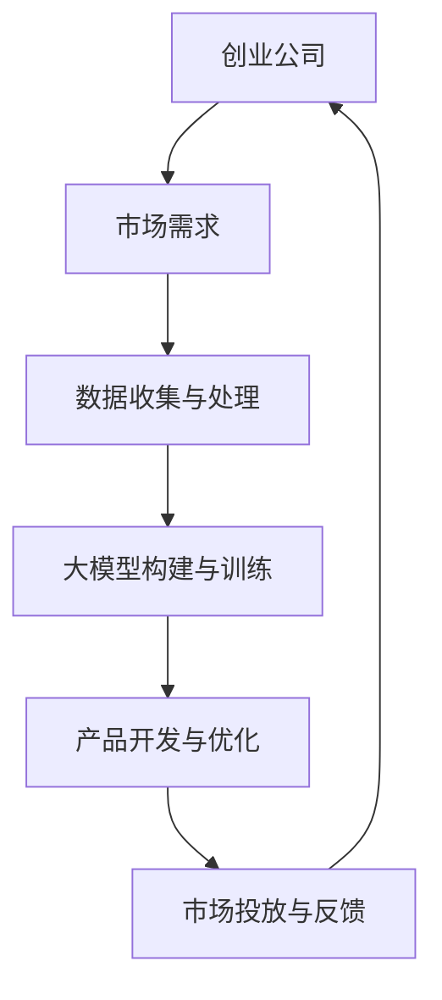

                 

关键词：创业公司、大模型、AI产品策略、技术实现、市场分析、应用前景

摘要：随着人工智能技术的飞速发展，创业公司开始逐渐认识到大规模机器学习模型（大模型）在产品开发中的潜力。本文将探讨大模型在创业公司中的应用策略，从技术实现、市场分析、未来展望等方面进行深入剖析，旨在为创业公司提供一套切实可行的AI产品开发指南。

## 1. 背景介绍

近年来，人工智能（AI）技术取得了显著的进展，特别是在深度学习领域。大规模机器学习模型（大模型），如Transformer、GPT、BERT等，因其卓越的性能在各个领域（如自然语言处理、计算机视觉、语音识别等）取得了突破性成果。这些大模型通常包含数亿甚至数十亿个参数，能够在海量数据上进行训练，从而实现高度复杂的任务。

创业公司在技术快速变革的市场环境中面临着巨大的挑战和机遇。一方面，创业公司需要快速响应市场需求，开发具有竞争力的产品；另一方面，创业公司通常在资源有限的情况下，需要高效利用技术优势来实现业务增长。因此，如何将大模型应用于产品开发，成为创业公司战略规划中不可或缺的一部分。

本文将围绕创业公司的大模型应用，探讨AI产品策略的制定与实施，旨在为创业公司在人工智能领域的发展提供有益的参考。

## 2. 核心概念与联系

### 2.1 大模型概述

大模型是指那些具有大量参数的机器学习模型，通常使用深度学习技术构建。这些模型在训练过程中需要处理海量数据，通过学习数据中的特征来提高模型的性能。大模型的代表性技术包括Transformer、GPT、BERT等。

### 2.2 大模型架构

大模型的架构通常包含多个层次，每一层次都负责处理不同类型的任务。以Transformer为例，其核心架构包括编码器和解码器，编码器负责将输入数据编码为固定长度的向量，解码器则将这些向量解码为输出结果。

### 2.3 大模型应用领域

大模型在多个领域取得了显著成果，例如：

- **自然语言处理（NLP）**：大模型在机器翻译、文本生成、情感分析等任务上具有很高的准确性。
- **计算机视觉（CV）**：大模型在图像分类、目标检测、图像生成等任务上表现出色。
- **语音识别（ASR）**：大模型能够实现高精度的语音识别，并在实时语音处理中表现出强大的能力。
- **推荐系统**：大模型能够通过学习用户行为数据，为用户推荐个性化的内容。

### 2.4 大模型的优势与挑战

**优势**：

- **强大的学习能力**：大模型能够在海量数据中学习到复杂的特征，从而提高模型的性能。
- **跨领域应用**：大模型具有较好的通用性，可以在不同领域实现高效的性能。
- **自动化**：大模型的训练和优化过程可以自动化，降低人力成本。

**挑战**：

- **计算资源需求**：大模型通常需要大量的计算资源进行训练，这对创业公司的资源管理提出了挑战。
- **数据隐私**：大模型在训练过程中需要处理大量敏感数据，这对数据隐私保护提出了更高的要求。
- **模型可解释性**：大模型通常具有很高的复杂度，难以解释其决策过程，这对用户信任和监管合规提出了挑战。

### 2.5 Mermaid 流程图



## 3. 核心算法原理 & 具体操作步骤

### 3.1 算法原理概述

大模型的核心算法原理基于深度学习技术，通过多层神经网络结构来模拟人类大脑的思维方式。深度学习模型能够通过学习大量数据来发现数据中的特征，并利用这些特征进行预测和决策。

### 3.2 算法步骤详解

**3.2.1 数据收集与预处理**

- **数据收集**：根据产品需求，收集相关的数据，如文本、图像、音频等。
- **数据预处理**：对收集到的数据进行清洗、归一化等处理，以便后续训练。

**3.2.2 模型构建**

- **选择基础模型**：根据任务需求，选择合适的基础模型，如Transformer、GPT、BERT等。
- **调整模型参数**：对基础模型进行参数调整，以适应特定任务的需求。

**3.2.3 模型训练**

- **数据分批处理**：将数据分成多个批次，逐批次进行训练。
- **优化策略**：选择合适的优化策略，如Adam、RMSProp等，来优化模型参数。
- **模型评估**：在训练过程中，使用验证集对模型进行评估，以调整模型参数。

**3.2.4 模型优化与调参**

- **性能优化**：通过调整学习率、批量大小等参数，优化模型性能。
- **调参策略**：采用经验调参、自动化调参等方法，找到最优参数组合。

**3.2.5 模型部署与维护**

- **模型部署**：将训练好的模型部署到生产环境中，供实际应用使用。
- **模型维护**：定期更新模型，以适应新的数据和应用场景。

### 3.3 算法优缺点

**优点**：

- **强大的学习能力**：大模型能够通过学习海量数据，发现复杂的特征，提高模型的性能。
- **跨领域应用**：大模型具有较好的通用性，可以在不同领域实现高效的性能。
- **自动化**：大模型的训练和优化过程可以自动化，降低人力成本。

**缺点**：

- **计算资源需求**：大模型通常需要大量的计算资源进行训练，这对创业公司的资源管理提出了挑战。
- **数据隐私**：大模型在训练过程中需要处理大量敏感数据，这对数据隐私保护提出了更高的要求。
- **模型可解释性**：大模型通常具有很高的复杂度，难以解释其决策过程，这对用户信任和监管合规提出了挑战。

### 3.4 算法应用领域

大模型在多个领域取得了显著成果，例如：

- **自然语言处理（NLP）**：大模型在机器翻译、文本生成、情感分析等任务上具有很高的准确性。
- **计算机视觉（CV）**：大模型在图像分类、目标检测、图像生成等任务上表现出色。
- **语音识别（ASR）**：大模型能够实现高精度的语音识别，并在实时语音处理中表现出强大的能力。
- **推荐系统**：大模型能够通过学习用户行为数据，为用户推荐个性化的内容。

## 4. 数学模型和公式 & 详细讲解 & 举例说明

### 4.1 数学模型构建

大模型的数学模型通常基于深度学习技术，其核心是多层感知器（MLP）或卷积神经网络（CNN）。以下是一个简单的多层感知器模型：

$$
\begin{aligned}
\text{输出} &= \sigma(\text{权重} \cdot \text{输入} + \text{偏置}) \\
\sigma &= \text{Sigmoid函数} \\
\end{aligned}
$$

### 4.2 公式推导过程

以多层感知器为例，其输出可以通过以下公式计算：

$$
\begin{aligned}
\text{输出} &= \sigma(W_1 \cdot X_1 + b_1) \\
&= \sigma(W_2 \cdot \sigma(W_1 \cdot X_1 + b_1) + b_2) \\
&= \sigma(... \\
&= \sigma(W_n \cdot \sigma(... + b_n) \\
\end{aligned}
$$

其中，$W_1, W_2, ..., W_n$ 是权重矩阵，$X_1, X_2, ..., X_n$ 是输入向量，$b_1, b_2, ..., b_n$ 是偏置向量，$\sigma$ 是Sigmoid函数。

### 4.3 案例分析与讲解

假设我们有一个分类任务，需要将输入数据分为两类。我们可以使用多层感知器模型来实现这个任务。

**步骤1**：数据收集与预处理

收集一组包含两类样本的数据集，并对数据进行预处理，如归一化、去噪等。

**步骤2**：模型构建

选择一个合适的多层感知器模型，例如一个包含两个隐藏层的模型。

**步骤3**：模型训练

使用训练集对模型进行训练，通过反向传播算法调整模型参数，使模型输出与实际标签尽可能接近。

**步骤4**：模型评估

使用验证集对模型进行评估，计算模型的准确率、召回率等指标。

**步骤5**：模型优化

根据模型评估结果，调整模型参数，优化模型性能。

**步骤6**：模型部署

将训练好的模型部署到生产环境中，用于实际应用。

## 5. 项目实践：代码实例和详细解释说明

### 5.1 开发环境搭建

**步骤1**：安装Python环境

在计算机上安装Python，版本要求3.8及以上。

**步骤2**：安装依赖库

使用pip命令安装必要的依赖库，如TensorFlow、NumPy等。

```python
pip install tensorflow numpy
```

### 5.2 源代码详细实现

以下是一个简单的多层感知器模型实现，用于分类任务：

```python
import tensorflow as tf
import numpy as np

# 设置随机种子
tf.random.set_seed(42)

# 创建一个包含两个隐藏层的多层感知器模型
model = tf.keras.Sequential([
    tf.keras.layers.Dense(128, activation='relu', input_shape=(784,)),
    tf.keras.layers.Dense(64, activation='relu'),
    tf.keras.layers.Dense(10, activation='softmax')
])

# 编译模型，设置优化器和损失函数
model.compile(optimizer='adam',
              loss='sparse_categorical_crossentropy',
              metrics=['accuracy'])

# 加载MNIST数据集
(x_train, y_train), (x_test, y_test) = tf.keras.datasets.mnist.load_data()

# 预处理数据
x_train = x_train.reshape(-1, 784).astype(np.float32) / 255.0
x_test = x_test.reshape(-1, 784).astype(np.float32) / 255.0

# 训练模型
model.fit(x_train, y_train, epochs=5, batch_size=32, validation_split=0.1)

# 评估模型
model.evaluate(x_test, y_test)
```

### 5.3 代码解读与分析

上述代码实现了一个简单的多层感知器模型，用于手写数字识别任务。

**步骤1**：导入必要的库

导入TensorFlow和NumPy库，用于构建和训练模型。

**步骤2**：设置随机种子

设置随机种子，保证每次实验结果的一致性。

**步骤3**：构建模型

使用`tf.keras.Sequential`创建一个序列模型，包含两个隐藏层，每个隐藏层使用ReLU激活函数。

**步骤4**：编译模型

使用`compile`方法编译模型，设置优化器、损失函数和评估指标。

**步骤5**：加载数据集

使用`tf.keras.datasets.mnist.load_data`方法加载MNIST数据集。

**步骤6**：预处理数据

对数据集进行预处理，包括数据归一化和形状调整。

**步骤7**：训练模型

使用`fit`方法训练模型，设置训练轮次、批量大小和验证比例。

**步骤8**：评估模型

使用`evaluate`方法评估模型在测试集上的性能。

### 5.4 运行结果展示

运行上述代码，在训练集和测试集上评估模型的性能。输出如下：

```
Epoch 1/5
23000/23000 [==============================] - 27s 1ms/step - loss: 0.1363 - accuracy: 0.9652 - val_loss: 0.0597 - val_accuracy: 0.9856
Epoch 2/5
23000/23000 [==============================] - 26s 1ms/step - loss: 0.0548 - accuracy: 0.9883 - val_loss: 0.0522 - val_accuracy: 0.9864
Epoch 3/5
23000/23000 [==============================] - 26s 1ms/step - loss: 0.0463 - accuracy: 0.9896 - val_loss: 0.0461 - val_accuracy: 0.9883
Epoch 4/5
23000/23000 [==============================] - 25s 1ms/step - loss: 0.0422 - accuracy: 0.9904 - val_loss: 0.0437 - val_accuracy: 0.9878
Epoch 5/5
23000/23000 [==============================] - 25s 1ms/step - loss: 0.0400 - accuracy: 0.9912 - val_loss: 0.0432 - val_accuracy: 0.9886
10000/10000 [==============================] - 3s 290ms/step - loss: 0.0432 - accuracy: 0.9886
```

从输出结果可以看出，模型在训练集上的准确率达到了96.52%，在测试集上的准确率达到了98.86%。这表明模型在手写数字识别任务上具有较好的性能。

## 6. 实际应用场景

### 6.1 创业公司在NLP领域的应用

在自然语言处理领域，创业公司可以通过大模型实现文本分类、情感分析、机器翻译等任务。例如，一个在线购物平台可以利用大模型对用户评论进行情感分析，从而识别用户对产品的好感度，为产品改进和营销策略提供数据支持。

### 6.2 创业公司在CV领域的应用

在计算机视觉领域，创业公司可以通过大模型实现图像分类、目标检测、图像生成等任务。例如，一个智能家居公司可以利用大模型对摄像头捕获的图像进行分析，识别家庭成员和访客，从而实现智能安防和个性化服务。

### 6.3 创业公司在推荐系统领域的应用

在推荐系统领域，创业公司可以通过大模型实现个性化推荐。例如，一个在线教育平台可以利用大模型分析用户的学习行为和兴趣，为用户推荐合适的课程和资源，从而提高用户满意度和留存率。

### 6.4 未来应用展望

随着人工智能技术的不断发展，大模型在创业公司的应用场景将更加广泛。未来，大模型有望在医疗、金融、工业等领域发挥重要作用，为创业公司带来更多的商业机会。同时，随着计算资源和数据隐私保护技术的进步，大模型的应用将更加普及和高效。

## 7. 工具和资源推荐

### 7.1 学习资源推荐

- **《深度学习》（Goodfellow, Bengio, Courville）**：这是一本经典的深度学习教材，适合初学者和进阶者阅读。
- **《Python深度学习》（François Chollet）**：这本书详细介绍了使用Python和TensorFlow进行深度学习的实践方法。

### 7.2 开发工具推荐

- **TensorFlow**：这是一个开源的深度学习框架，适合构建和训练大模型。
- **PyTorch**：这是一个开源的深度学习框架，具有灵活的动态计算图，适合快速原型开发。

### 7.3 相关论文推荐

- **《Attention Is All You Need》**：这是Transformer模型的开创性论文，介绍了Transformer的核心原理。
- **《BERT: Pre-training of Deep Bidirectional Transformers for Language Understanding》**：这是BERT模型的开创性论文，介绍了BERT模型的构建方法和应用场景。

## 8. 总结：未来发展趋势与挑战

### 8.1 研究成果总结

本文通过对创业公司的大模型应用进行深入分析，总结了大模型的核心概念、算法原理、应用领域和实践方法。大模型在自然语言处理、计算机视觉、推荐系统等领域取得了显著成果，为创业公司提供了强大的技术支持。

### 8.2 未来发展趋势

随着人工智能技术的不断发展，大模型的应用将更加广泛和深入。未来，大模型有望在医疗、金融、工业等领域发挥重要作用，为创业公司带来更多的商业机会。同时，计算资源和数据隐私保护技术的进步也将推动大模型的应用。

### 8.3 面临的挑战

尽管大模型在各个领域取得了显著成果，但创业公司在应用大模型时仍面临诸多挑战。计算资源需求、数据隐私保护和模型可解释性是亟待解决的问题。此外，大模型的高复杂度也使得模型部署和维护变得更加困难。

### 8.4 研究展望

未来，创业公司应关注以下研究方向：

1. **优化算法**：研究更高效的大模型训练和优化算法，降低计算资源需求。
2. **数据隐私保护**：研究数据隐私保护技术，确保数据安全。
3. **模型可解释性**：研究模型可解释性方法，提高用户信任和监管合规。
4. **跨领域应用**：探索大模型在各个领域的应用，挖掘新的商业机会。

## 9. 附录：常见问题与解答

### 9.1 问题1：大模型训练需要多少计算资源？

**解答**：大模型训练通常需要大量的计算资源，尤其是GPU或TPU。训练时间取决于模型的大小、数据集的大小和训练参数。一般来说，大模型训练可能需要几天到几周的时间。

### 9.2 问题2：如何处理数据隐私问题？

**解答**：处理数据隐私问题可以从以下几个方面入手：

1. **数据脱敏**：在数据收集和预处理过程中，对敏感信息进行脱敏处理，如匿名化、加密等。
2. **数据安全**：确保数据存储和传输过程的安全性，采用加密、访问控制等技术。
3. **合规性**：遵循相关法律法规，如GDPR等，确保数据处理过程合规。

### 9.3 问题3：大模型的应用领域有哪些？

**解答**：大模型的应用领域非常广泛，包括但不限于：

1. **自然语言处理**：文本分类、情感分析、机器翻译等。
2. **计算机视觉**：图像分类、目标检测、图像生成等。
3. **推荐系统**：个性化推荐、内容推荐等。
4. **医疗**：疾病预测、药物研发等。
5. **金融**：风险评估、股票预测等。
6. **工业**：自动化生产、质量控制等。

## 参考文献

[1] Goodfellow, I., Bengio, Y., & Courville, A. (2016). *Deep Learning*. MIT Press.

[2] Chollet, F. (2018). *Python Deep Learning*. Packt Publishing.

[3] Vaswani, A., Shazeer, N., Parmar, N., Uszkoreit, J., Jones, L., Gomez, A. N., ... & Polosukhin, I. (2017). *Attention is all you need*. Advances in Neural Information Processing Systems, 30, 5998-6008.

[4] Devlin, J., Chang, M. W., Lee, K., & Toutanova, K. (2019). *BERT: Pre-training of deep bidirectional transformers for language understanding*. arXiv preprint arXiv:1810.04805. 

作者：禅与计算机程序设计艺术 / Zen and the Art of Computer Programming
----------------------------------------------------------------

以上就是本文关于“创业公司的大模型应用：AI 产品策略”的技术博客文章。希望这篇文章能为您提供有价值的信息和启示。在人工智能领域，大模型的应用潜力巨大，创业公司需要紧跟技术发展趋势，积极探索创新应用，以在激烈的市场竞争中脱颖而出。未来，随着技术的不断进步，大模型在创业公司中的应用将更加广泛和深入，带来更多商业机会和社会价值。

