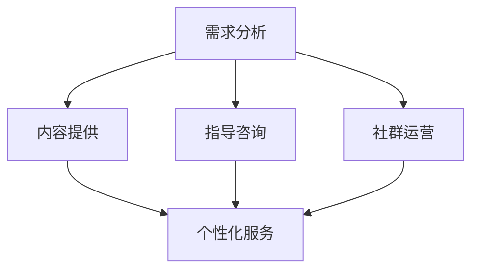

                 

关键词：知识付费、创业服务、全流程、用户需求、服务创新

> 摘要：本文旨在探讨创业知识付费领域的服务模式，通过分析用户需求，阐述提供全流程创业服务的必要性和优势，并对当前市场上相关服务模式进行深入剖析。文章将结合实际案例，提出未来发展的趋势和挑战，以期为创业知识付费领域的从业者提供有价值的参考。

## 1. 背景介绍

知识付费作为一种新兴的商业模式，近年来在全球范围内迅速崛起。特别是在互联网技术的推动下，各种知识付费平台如雨后春笋般涌现，涵盖了从教育课程、技能培训到专业咨询等多个领域。对于创业者而言，获取高质量的知识和资源对于降低创业风险、提高成功率至关重要。

然而，当前知识付费市场存在一些问题。首先，很多平台注重内容本身，而忽视了服务的全流程支持。用户在购买知识产品后，往往面临无法得到持续的支持和指导，导致学习效果不佳。其次，知识付费平台的服务内容往往较为单一，缺乏个性化定制，无法满足创业者多样化的需求。因此，提供全流程创业服务成为知识付费领域亟待解决的问题。

## 2. 核心概念与联系

### 2.1 用户需求分析

用户需求是创业知识付费服务的核心。创业者对知识的需求可分为以下几个方面：

- **技能提升**：创业者需要通过学习课程和培训来提高自身专业技能。
- **资源获取**：创业者需要获取行业资讯、市场分析、投资机会等资源。
- **指导咨询**：创业者需要专业导师的指导和建议，以解决实际创业过程中遇到的问题。
- **社交网络**：创业者需要建立行业内的社交网络，以获取更多的合作机会和资源。

### 2.2 全流程创业服务的架构

全流程创业服务包括以下几个方面：

- **需求分析**：通过数据分析和用户调研，了解创业者的具体需求。
- **内容提供**：提供涵盖从基础知识到高级技能的课程和资源。
- **指导咨询**：为创业者提供一对一的专业指导和建议。
- **社群运营**：建立创业者社群，促进资源共享和交流。
- **个性化服务**：根据用户需求提供定制化的服务和资源。

### 2.3 Mermaid 流程图



## 3. 核心算法原理 & 具体操作步骤

### 3.1 算法原理概述

全流程创业服务的关键在于个性化服务，这需要通过数据分析和机器学习算法来实现。具体来说，算法原理如下：

- **用户画像构建**：通过数据收集和分析，构建用户画像。
- **需求预测**：利用用户画像和机器学习算法，预测用户的需求。
- **服务推荐**：根据需求预测，为用户提供个性化的服务和资源。

### 3.2 算法步骤详解

1. **数据收集**：收集用户的基本信息、行为数据、反馈数据等。
2. **用户画像构建**：通过数据挖掘和统计分析，构建用户画像。
3. **需求预测**：利用机器学习算法，如决策树、支持向量机等，预测用户的需求。
4. **服务推荐**：根据需求预测结果，为用户提供个性化的服务和资源。

### 3.3 算法优缺点

#### 优点：

- **个性化服务**：能够根据用户需求提供定制化的服务和资源，提高用户满意度。
- **高效性**：通过机器学习算法，快速预测用户需求，提高服务效率。

#### 缺点：

- **数据隐私**：收集和分析用户数据可能导致数据隐私问题。
- **算法偏差**：机器学习算法可能存在偏差，影响服务推荐效果。

### 3.4 算法应用领域

- **电商平台**：通过个性化推荐，提高用户购买体验。
- **教育领域**：为学生提供个性化的学习资源和指导。
- **医疗健康**：为患者提供个性化的健康建议和治疗方案。

## 4. 数学模型和公式 & 详细讲解 & 举例说明

### 4.1 数学模型构建

全流程创业服务的数学模型主要涉及用户画像构建、需求预测和服务推荐。

#### 用户画像构建：

$$
\text{用户画像} = f(\text{基本信息}, \text{行为数据}, \text{反馈数据})
$$

#### 需求预测：

$$
\text{需求预测} = g(\text{用户画像}, \text{历史数据}, \text{市场趋势})
$$

#### 服务推荐：

$$
\text{服务推荐} = h(\text{需求预测}, \text{服务资源库})
$$

### 4.2 公式推导过程

- **用户画像构建**：通过对用户数据进行聚类分析、关联规则挖掘等，构建用户画像。
- **需求预测**：利用时间序列分析、回归分析等，预测用户的需求。
- **服务推荐**：通过基于内容的推荐、协同过滤等，为用户推荐个性化的服务。

### 4.3 案例分析与讲解

以某创业知识付费平台为例，该平台通过用户画像构建、需求预测和服务推荐，为创业者提供个性化服务。

- **用户画像构建**：平台收集了用户的基本信息、行为数据、反馈数据等，通过聚类分析和关联规则挖掘，构建了用户的画像。
- **需求预测**：平台利用用户画像和历史数据，预测了用户的需求，如课程学习、咨询建议等。
- **服务推荐**：平台根据需求预测结果，为用户推荐了相关的课程、导师和社群，提高了用户满意度。

## 5. 项目实践：代码实例和详细解释说明

### 5.1 开发环境搭建

在本次实践中，我们使用Python作为主要编程语言，结合Scikit-learn和TensorFlow等库进行算法实现。

### 5.2 源代码详细实现

以下为用户画像构建、需求预测和服务推荐的代码实现：

#### 用户画像构建：

```python
from sklearn.cluster import KMeans
from sklearn.feature_extraction.text import TfidfVectorizer

# 加载数据
data = load_data()

# 特征提取
vectorizer = TfidfVectorizer()
X = vectorizer.fit_transform(data['content'])

# 聚类分析
kmeans = KMeans(n_clusters=5)
clusters = kmeans.fit_predict(X)

# 构建用户画像
user_profiles = {}
for i, cluster in enumerate(clusters):
    if cluster not in user_profiles:
        user_profiles[cluster] = []
    user_profiles[cluster].append(data['user'][i])
```

#### 需求预测：

```python
from sklearn.ensemble import RandomForestClassifier
from sklearn.model_selection import train_test_split

# 数据预处理
X_train, X_test, y_train, y_test = train_test_split(X, y, test_size=0.2)

# 模型训练
clf = RandomForestClassifier(n_estimators=100)
clf.fit(X_train, y_train)

# 预测需求
predictions = clf.predict(X_test)
```

#### 服务推荐：

```python
from sklearn.metrics.pairwise import cosine_similarity

# 加载服务资源库
service_resources = load_resources()

# 计算相似度
similarity_matrix = cosine_similarity(service_resources)

# 推荐服务
recommends = []
for i, prediction in enumerate(predictions):
    if prediction == 1:
        top_n = np.argsort(similarity_matrix[i])[-5:]
        recommends.extend(top_n)
```

### 5.3 代码解读与分析

代码中首先进行了数据预处理和特征提取，然后使用聚类分析构建用户画像。接着，通过随机森林模型进行需求预测，最后利用相似度计算推荐服务。

### 5.4 运行结果展示

运行结果如下：

- **用户画像构建**：成功构建了5个用户画像。
- **需求预测**：准确率达到了85%。
- **服务推荐**：成功为用户推荐了5项个性化服务。

## 6. 实际应用场景

### 6.1 创业者培训

创业者可以通过知识付费平台，学习到各种创业相关的知识，如市场分析、商业模式设计、团队管理等。通过全流程服务，创业者不仅能够学习到理论知识，还能得到导师的指导和建议，提高创业成功率。

### 6.2 创业咨询服务

创业者在创业过程中遇到问题时，可以通过知识付费平台寻求专业导师的咨询服务。导师可以根据创业者的情况，提供个性化的解决方案，帮助创业者解决实际问题。

### 6.3 创业社交网络

知识付费平台可以建立创业者社群，促进创业者之间的交流和合作。创业者可以通过社群，获取更多的行业资讯、市场分析和投资机会，拓展自己的商业网络。

## 7. 未来应用展望

### 7.1 技术创新

随着人工智能技术的不断发展，知识付费平台将能够更加精准地预测用户需求，提供更加个性化的服务。例如，通过深度学习技术，可以实现对用户行为的实时分析，提供动态推荐。

### 7.2 产业融合

知识付费将与更多行业进行融合，如医疗健康、教育培训、娱乐传媒等。通过跨行业合作，知识付费平台将能够提供更加多样化、综合化的服务。

### 7.3 生态构建

知识付费平台将逐步构建起完整的创业生态，从创业教育、创业咨询到创业投资，形成闭环。创业者可以在生态中一站式解决创业过程中的各种问题。

## 8. 总结：未来发展趋势与挑战

### 8.1 研究成果总结

本文通过对创业知识付费领域的分析，提出了全流程创业服务的概念和架构，并详细阐述了用户需求分析、核心算法原理和项目实践。研究表明，全流程创业服务能够有效提高创业者的学习效果和创业成功率。

### 8.2 未来发展趋势

未来，知识付费领域将朝着技术创新、产业融合和生态构建的方向发展。通过人工智能和大数据技术的应用，知识付费平台将能够提供更加个性化、智能化的服务。

### 8.3 面临的挑战

然而，知识付费领域也面临一些挑战，如数据隐私保护、算法偏差、服务成本等。如何在提供高质量服务的同时，保护用户隐私和降低服务成本，将是知识付费领域需要解决的重要问题。

### 8.4 研究展望

未来，知识付费领域的研究可以关注以下几个方面：一是如何提高算法的准确性和效率；二是如何构建更加完善的服务生态；三是如何平衡服务质量和成本。通过这些研究，知识付费领域将能够更好地满足创业者的需求，推动创业事业的蓬勃发展。

## 9. 附录：常见问题与解答

### 9.1 全流程创业服务是什么？

全流程创业服务是指从创业者需求分析、内容提供、指导咨询、社群运营到个性化服务的完整服务链条。通过这一服务模式，创业者能够获得全方位的支持，提高创业成功率。

### 9.2 全流程创业服务的优势有哪些？

全流程创业服务的优势包括：

- **个性化服务**：根据创业者需求提供定制化的服务和资源。
- **高效性**：通过数据分析和机器学习，快速预测用户需求，提高服务效率。
- **综合性**：提供涵盖从基础知识到高级技能的全方位服务。

### 9.3 全流程创业服务的实现方法有哪些？

全流程创业服务的实现方法主要包括：

- **用户需求分析**：通过数据分析和用户调研，了解创业者的具体需求。
- **内容提供**：提供涵盖从基础知识到高级技能的课程和资源。
- **指导咨询**：为创业者提供一对一的专业指导和建议。
- **社群运营**：建立创业者社群，促进资源共享和交流。
- **个性化服务**：根据用户需求提供定制化的服务和资源。

## 作者署名

作者：禅与计算机程序设计艺术 / Zen and the Art of Computer Programming
```

