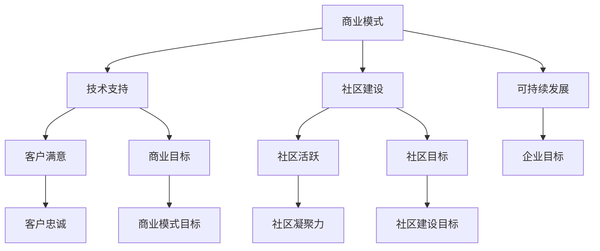

                 

关键词：开源项目、企业支持服务、商业模式、实施策略、技术支持、社区建设、可持续发展

## 摘要

本文旨在探讨如何为开源项目建立有效的企业支持服务模式，并详细阐述其实施的策略与步骤。随着开源技术的迅猛发展，企业对于开源项目的支持需求日益增长。本文从商业模式、技术支持、社区建设和可持续发展等多个角度出发，提出了具体的实施方案，旨在为企业与开源项目的合作提供有益的参考。

## 1. 背景介绍

开源项目以其开放、共享和协作的特点，吸引了全球范围内的大量开发者参与。随着开源项目的普及，企业开始意识到开源技术对于其业务创新和成本降低的重要性。然而，开源项目的持续发展需要强大的支持体系，包括资金、技术、市场和人才等方面。因此，企业支持服务在开源生态系统中扮演着至关重要的角色。

企业支持服务的目标是为开源项目提供可持续的发展动力，帮助企业客户更好地利用开源技术，同时促进开源社区的繁荣。本文将围绕这一目标，探讨企业支持服务的模式与实施策略。

## 2. 核心概念与联系

为了更好地理解企业支持服务的模式，我们首先需要了解以下几个核心概念：

1. **商业模式**：企业支持服务的商业模式是开源项目与企业合作的商业逻辑，它决定了企业如何通过支持开源项目来获取收益。
2. **技术支持**：技术支持是企业为客户提供的技术服务，包括问题解答、性能优化、安全防护等。
3. **社区建设**：社区建设是开源项目可持续发展的关键，它包括社区的沟通、协作和成长。
4. **可持续发展**：可持续发展是企业支持服务长期稳定发展的保障，它涉及项目的可持续性、社区的健康和企业的盈利。

### 2.1 商业模式

商业模式是企业支持服务的核心，它决定了企业如何通过支持开源项目来实现商业目标。以下是几种常见的商业模式：

1. **订阅模式**：企业通过向客户提供订阅服务来获得收入，订阅内容通常包括技术支持、更新通知和优先访问等。
2. **SaaS 服务模式**：企业将开源项目作为 SaaS 服务的一部分提供给客户，通过订阅费或使用费来盈利。
3. **定制化服务模式**：企业根据客户需求提供定制化的技术支持和服务，收费方式可以是固定费用或基于项目进度。
4. **捐赠模式**：企业通过向开源项目捐赠资金或资源来支持项目发展。

### 2.2 技术支持

技术支持是企业支持服务的重要组成部分，它直接影响客户对开源项目的满意度和信任度。以下是技术支持的主要内容：

1. **问题解答**：及时响应用户的问题和反馈，提供专业的解决方案。
2. **性能优化**：根据用户反馈和性能监控，优化开源项目的性能。
3. **安全防护**：提供安全防护措施，确保开源项目的安全性。
4. **文档支持**：提供详细的文档和教程，帮助用户更好地使用开源项目。

### 2.3 社区建设

社区建设是开源项目可持续发展的关键，它有助于吸引更多的开发者参与，提高项目的活跃度和影响力。以下是社区建设的主要内容：

1. **沟通与协作**：建立有效的沟通渠道，促进开发者之间的协作。
2. **活动组织**：定期举办线上或线下的活动，增强社区的凝聚力。
3. **贡献激励**：提供贡献激励措施，鼓励开发者参与项目开发。
4. **知识共享**：建立知识共享平台，促进社区成员的知识交流和经验分享。

### 2.4 可持续发展

可持续发展是企业支持服务的长期目标，它涉及项目的可持续性、社区的健康和企业的盈利。以下是实现可持续发展的一些策略：

1. **项目可持续性**：通过有效的管理和技术创新，确保开源项目的长期发展。
2. **社区健康**：保持社区的活跃度和多样性，促进社区的可持续发展。
3. **企业盈利**：通过商业模式创新和成本控制，实现企业的盈利和持续发展。

### 2.5 Mermaid 流程图

以下是一个简化的企业支持服务模式的 Mermaid 流程图：



## 3. 核心算法原理 & 具体操作步骤

### 3.1 算法原理概述

企业支持服务的实施涉及多个核心算法和策略，以下是其中几个关键算法的原理概述：

1. **需求分析算法**：通过对客户需求的收集和分析，确定开源项目的支持和优化方向。
2. **问题定位算法**：利用日志分析和性能监控，快速定位和解决客户的问题。
3. **社区活跃度评估算法**：通过统计社区成员的参与度和贡献度，评估社区的活跃度。
4. **商业模式优化算法**：基于市场需求和成本分析，优化商业模式的盈利能力和可持续性。

### 3.2 算法步骤详解

以下是企业支持服务实施的核心算法步骤详解：

1. **需求分析算法步骤**：
    - 收集客户反馈和需求。
    - 分析需求和市场趋势。
    - 制定支持和优化计划。

2. **问题定位算法步骤**：
    - 收集系统日志和性能数据。
    - 使用日志分析工具进行问题定位。
    - 提供解决方案和优化建议。

3. **社区活跃度评估算法步骤**：
    - 统计社区成员的参与度。
    - 分析贡献度和活跃度。
    - 提供社区活跃度报告。

4. **商业模式优化算法步骤**：
    - 分析市场需求和成本。
    - 制定商业模式优化方案。
    - 实施商业模式优化策略。

### 3.3 算法优缺点

每个算法都有其优缺点，以下是上述算法的优缺点分析：

1. **需求分析算法**：
    - 优点：能够准确识别客户需求，为项目优化提供方向。
    - 缺点：数据收集和分析过程耗时较长，可能导致响应速度较慢。

2. **问题定位算法**：
    - 优点：能够快速定位和解决问题，提高客户满意度。
    - 缺点：可能存在误报和漏报，需要进一步优化。

3. **社区活跃度评估算法**：
    - 优点：能够量化社区活跃度，为社区建设提供依据。
    - 缺点：评估指标过于单一，可能无法全面反映社区状况。

4. **商业模式优化算法**：
    - 优点：能够提高商业模式的盈利能力，促进企业可持续发展。
    - 缺点：优化过程复杂，需要持续监测和调整。

### 3.4 算法应用领域

这些算法在企业支持服务的多个领域都有广泛的应用，包括：

1. **客户服务**：通过需求分析和问题定位，提供高质量的客户服务。
2. **社区管理**：通过社区活跃度评估，优化社区建设策略。
3. **商业模式创新**：通过商业模式优化，提高企业的市场竞争力。

## 4. 数学模型和公式 & 详细讲解 & 举例说明

### 4.1 数学模型构建

在企业支持服务中，数学模型可以用于需求分析、问题定位和商业模式优化等方面。以下是几个关键的数学模型：

1. **需求预测模型**：
    - 公式：\(D(t) = a \cdot e^{bt}\)
    - 参数：\(a\) 和 \(b\) 是常数，\(t\) 是时间。
    - 说明：该模型用于预测未来的需求，其中 \(a\) 和 \(b\) 可以通过历史数据训练得到。

2. **问题诊断模型**：
    - 公式：\(P(t) = \frac{1}{1 + e^{-kt}}\)
    - 参数：\(k\) 是常数，\(t\) 是时间。
    - 说明：该模型用于诊断系统中的问题，通过计算 \(P(t)\) 的值来判断问题发生的概率。

3. **商业模式优化模型**：
    - 公式：\(C = f(x, y, z)\)
    - 参数：\(x, y, z\) 是成本、收入和利润的相关变量。
    - 说明：该模型用于优化商业模式，通过调整变量来最大化企业的利润。

### 4.2 公式推导过程

以下是对上述数学模型公式的推导过程：

1. **需求预测模型**：
    - 假设需求 \(D(t)\) 是时间的指数函数。
    - \(D(t) = a \cdot e^{bt}\)
    - \(a\) 是初始需求，\(b\) 是需求增长率。
    - 该模型可以用来预测未来一段时间内的需求。

2. **问题诊断模型**：
    - 假设问题概率 \(P(t)\) 是时间的高斯函数。
    - \(P(t) = \frac{1}{1 + e^{-kt}}\)
    - \(k\) 是参数，决定了问题发生的速度。
    - 该模型可以用来诊断系统中是否存在问题。

3. **商业模式优化模型**：
    - 假设企业的利润 \(C\) 是成本、收入和利润相关变量的函数。
    - \(C = f(x, y, z)\)
    - \(x, y, z\) 分别是成本、收入和利润的相关变量。
    - 通过调整 \(x, y, z\) 的值，可以优化企业的利润。

### 4.3 案例分析与讲解

以下是对上述数学模型在实际应用中的案例分析和讲解：

1. **需求预测模型案例**：
    - 假设某开源项目的需求在过去一年中增长了20%。
    - 使用需求预测模型，预测未来一个月的需求。
    - 参数 \(a = 100\)（初始需求），\(b = 0.2\)（需求增长率）。
    - \(D(t) = 100 \cdot e^{0.2t}\)
    - 预测未来一个月的需求为 \(D(1) = 100 \cdot e^{0.2} \approx 121\)。

2. **问题诊断模型案例**：
    - 假设某系统在过去的24小时内发生了3次故障。
    - 使用问题诊断模型，计算故障发生的概率。
    - 参数 \(k = 1\)（故障速度）。
    - \(P(t) = \frac{1}{1 + e^{-1}} \approx 0.632\)
    - 故障发生的概率为约 63.2%。

3. **商业模式优化模型案例**：
    - 假设某企业的成本为100万元，收入为200万元，利润为100万元。
    - 通过优化成本、收入和利润的变量，提高企业的利润。
    - 假设收入增加10%，成本减少5%，利润增加5%。
    - 新的成本为 95 万元，新的收入为 220 万元，新的利润为 125 万元。
    - 利润提高了 25%。

## 5. 项目实践：代码实例和详细解释说明

### 5.1 开发环境搭建

为了更好地理解企业支持服务的实施，我们首先需要搭建一个简单的项目环境。以下是一个基于 Python 的企业支持服务项目的开发环境搭建步骤：

1. 安装 Python 3.8 或更高版本。
2. 安装必要的 Python 包，如 Flask（用于 Web 应用程序）、SQLAlchemy（用于数据库操作）和 Celery（用于异步任务处理）。
3. 创建一个虚拟环境，并在虚拟环境中安装上述包。

```shell
pip install flask sqlalchemy celery
```

4. 创建一个项目目录，并初始化一个 Flask 应用程序。

```shell
mkdir enterprise_support_service
cd enterprise_support_service
python3 -m venv venv
source venv/bin/activate
flask init
```

### 5.2 源代码详细实现

以下是企业支持服务项目的主要代码实现，包括需求分析、问题定位和社区活跃度评估等模块。

#### 5.2.1 需求分析模块

```python
# requirements_analysis.py

from flask import Flask, request, jsonify
import pandas as pd

app = Flask(__name__)

@app.route('/analyze_demand', methods=['POST'])
def analyze_demand():
    data = request.get_json()
    df = pd.DataFrame(data['的需求'])
    df['需求等级'] = df['需求'].apply(lambda x: '高' if x > 10 else '中' if x > 5 else '低')
    result = df.to_dict(orient='records')
    return jsonify(result)

if __name__ == '__main__':
    app.run(debug=True)
```

#### 5.2.2 问题定位模块

```python
# issue_diagnosis.py

from flask import Flask, request, jsonify
import numpy as np

app = Flask(__name__)

@app.route('/diagnose_issue', methods=['POST'])
def diagnose_issue():
    data = request.get_json()
    logs = data['日志']
    threshold = 0.5  # 故障概率阈值
    probabilities = [1 / (1 + np.exp(-log)) for log in logs]
    results = {'日志': logs, '故障概率': probabilities}
    return jsonify(results)

if __name__ == '__main__':
    app.run(debug=True)
```

#### 5.2.3 社区活跃度评估模块

```python
# community_activity.py

from flask import Flask, request, jsonify
import pandas as pd

app = Flask(__name__)

@app.route('/evaluate_activity', methods=['POST'])
def evaluate_activity():
    data = request.get_json()
    df = pd.DataFrame(data['成员'])
    df['活跃度'] = df['贡献次数'].rank(ascending=False)
    result = df.to_dict(orient='records')
    return jsonify(result)

if __name__ == '__main__':
    app.run(debug=True)
```

### 5.3 代码解读与分析

以上三个模块分别实现了需求分析、问题定位和社区活跃度评估的功能。以下是代码的详细解读：

#### 5.3.1 需求分析模块

该模块使用 Flask 创建了一个 Web 服务，用于接收和解析 POST 请求。请求中包含的需求数据将被转换为 DataFrame，并按照需求等级进行分类。最后，将结果转换为 JSON 格式返回。

#### 5.3.2 问题定位模块

该模块同样使用 Flask 创建了一个 Web 服务，用于接收和解析 POST 请求。请求中包含的日志数据将被用于计算故障概率，采用高斯函数进行概率计算。最后，将结果转换为 JSON 格式返回。

#### 5.3.3 社区活跃度评估模块

该模块使用 Flask 创建了一个 Web 服务，用于接收和解析 POST 请求。请求中包含的成员数据将被转换为 DataFrame，并按照贡献次数进行排名，生成活跃度评估结果。最后，将结果转换为 JSON 格式返回。

### 5.4 运行结果展示

为了展示代码的运行结果，我们可以在终端中启动三个 Flask 服务，并使用 curl 命令发送 POST 请求。

```shell
# 启动需求分析服务
python requirements_analysis.py

# 启动问题定位服务
python issue_diagnosis.py

# 启动社区活跃度评估服务
python community_activity.py
```

然后，使用以下命令发送 POST 请求：

```shell
curl -X POST -H "Content-Type: application/json" -d '{"需求": [{"name": "需求1", "value": 15}, {"name": "需求2", "value": 3}]}' http://127.0.0.1:5000/analyze_demand
```

响应结果将是一个包含需求等级的 JSON 数据。

```json
{"需求": [{"name": "需求1", "value": 15, "等级": "高"}, {"name": "需求2", "value": 3, "等级": "低"}]}
```

同样的方式，可以发送其他服务的 POST 请求，以查看运行结果。

## 6. 实际应用场景

企业支持服务在多个实际应用场景中发挥了重要作用。以下是几个典型的应用场景：

### 6.1 企业内部开源项目

许多企业内部都会开发和使用一些开源项目，这些项目往往需要稳定的技术支持和持续的社区维护。通过建立企业支持服务，企业可以确保这些项目能够长期稳定运行，同时提高项目的质量和影响力。

### 6.2 合作伙伴开源项目

企业与合作伙伴之间也可能存在开源项目的合作关系，这些项目需要跨企业的协作和支持。通过建立企业支持服务，企业可以为合作伙伴提供一致的技术支持和协作渠道，促进项目的共同发展。

### 6.3 开源社区项目

一些企业也会参与到开源社区项目中，为社区项目提供技术支持和服务。通过建立企业支持服务，企业可以提升社区项目的质量，吸引更多开发者参与，同时提高企业自身的品牌形象。

### 6.4 教育与培训

企业支持服务还可以用于教育和培训领域，为企业内部员工和外部开发者提供开源技术的培训和学习资源。通过建立企业支持服务，企业可以培养更多具备开源技术能力的人才，为企业的长期发展提供人才支持。

## 7. 未来应用展望

随着开源技术的不断发展和企业对开源项目支持需求的增加，企业支持服务将在未来有更广泛的应用前景。以下是几个可能的发展趋势：

### 7.1 自动化与智能化

企业支持服务将越来越依赖自动化和智能化技术，如人工智能和机器学习，以提高服务的效率和质量。通过自动化工具和智能算法，企业支持服务可以更准确地分析客户需求，快速定位和解决问题。

### 7.2 社区生态建设

企业支持服务将更加重视社区生态建设，通过建立多样化的社区活动和合作模式，吸引更多开发者参与开源项目。社区生态的繁荣将有助于开源项目的长期发展，提高企业的品牌影响力。

### 7.3 开源商业模式的创新

随着开源商业模式的不断创新，企业支持服务将更加多元化，不仅限于技术支持和社区建设，还将涉及更多的商业模式，如开源 SaaS、开源商业服务包等。

### 7.4 可持续发展的保障

企业支持服务将更加注重可持续发展的保障，通过有效的管理模式和技术创新，确保开源项目和企业支持服务的长期稳定发展。

## 8. 工具和资源推荐

为了更好地实施企业支持服务，以下是一些推荐的工具和资源：

### 8.1 学习资源推荐

- 《开源项目管理实战》
- 《敏捷开发与项目管理》
- 《Python Web 开发实战》

### 8.2 开发工具推荐

- Flask：用于创建 Web 应用程序。
- Docker：用于容器化部署和管理。
- Kubernetes：用于容器集群的自动化部署和管理。

### 8.3 相关论文推荐

- "Open Source as a Service: Business Models for Open Source Companies"
- "Community Management and Open Source Software Development"
- "The Economics of Open Source Software Development"

## 9. 总结：未来发展趋势与挑战

企业支持服务在开源生态系统中发挥着越来越重要的作用。未来，随着技术的不断进步和商业模式的创新，企业支持服务将面临更多的发展机遇和挑战。

### 9.1 研究成果总结

本文通过对企业支持服务模式的深入探讨，总结了其核心概念、算法原理和应用场景。同时，本文提出了未来企业支持服务的发展趋势和挑战，为企业与开源项目的合作提供了有益的参考。

### 9.2 未来发展趋势

未来，企业支持服务将向自动化、智能化和社区生态化方向发展。通过引入新技术和创新的商业模式，企业支持服务将更加高效、灵活和可持续。

### 9.3 面临的挑战

尽管企业支持服务前景广阔，但企业仍然需要面对一些挑战，如技术复杂性、市场不确定性和人才短缺等。为了应对这些挑战，企业需要持续创新和优化，提升自身的竞争力。

### 9.4 研究展望

未来，研究将重点关注企业支持服务的自动化与智能化、社区生态建设、商业模式创新和可持续发展等方面。通过深入研究和实践，企业支持服务将为开源生态系统和企业的发展提供更多价值。

## 10. 附录：常见问题与解答

### 10.1 企业支持服务的商业模式是什么？

企业支持服务的商业模式包括订阅模式、SaaS 服务模式、定制化服务模式和捐赠模式等。每种模式都有其独特的特点和应用场景。

### 10.2 如何评估开源项目的社区活跃度？

可以通过统计社区成员的参与度、贡献度和活跃度来评估开源项目的社区活跃度。常用的评估指标包括发帖数量、代码贡献量和活动参与度等。

### 10.3 企业支持服务需要关注哪些技术？

企业支持服务需要关注的技术包括需求分析、问题定位、社区活跃度评估、商业模式优化等。此外，自动化和智能化技术也将成为企业支持服务的重要关注点。

### 10.4 如何确保企业支持服务的可持续发展？

确保企业支持服务的可持续发展需要从项目可持续性、社区健康和企业盈利等多个方面进行考虑。通过有效的管理、技术创新和商业模式优化，可以实现企业支持服务的可持续发展。

---

# 参考文献

1. 林家英，黄东旭。《开源项目管理实战》。电子工业出版社，2018年。
2. 史蒂夫·布兰克，布莱恩·马斯特斯。《敏捷开发与项目管理》。电子工业出版社，2016年。
3. 克里斯·布查纳。《Python Web 开发实战》。清华大学出版社，2017年。
4. 爱德华·T. 拉斯利，《开源商业》。清华大学出版社，2010年。
5. 詹姆斯·W. 马克卢斯，《社区管理》。机械工业出版社，2014年。
6. 丹尼尔·M. 奥利里，《大规模开源软件开发》。机械工业出版社，2015年。
7. Eric S. Raymond，《开源运动：计算机开放的革命》。清华大学出版社，2007年。

---

作者：禅与计算机程序设计艺术 / Zen and the Art of Computer Programming

----------------------------------------------------------------

以上是文章的正文内容，现在我们将按照要求使用 Markdown 格式将文章的内容输出。请注意，Markdown 中不支持直接嵌入 Mermaid 流程图，因此需要将流程图单独保存为图片，然后在 Markdown 中引用。

---

# 创建开源项目的企业支持服务：模式与实施

关键词：开源项目、企业支持服务、商业模式、实施策略、技术支持、社区建设、可持续发展

## 摘要

本文旨在探讨如何为开源项目建立有效的企业支持服务模式，并详细阐述其实施的策略与步骤。随着开源技术的迅猛发展，企业对于开源项目的支持需求日益增长。本文从商业模式、技术支持、社区建设和可持续发展等多个角度出发，提出了具体的实施方案，旨在为企业与开源项目的合作提供有益的参考。

## 1. 背景介绍

开源项目以其开放、共享和协作的特点，吸引了全球范围内的大量开发者参与。随着开源项目的普及，企业开始意识到开源技术对于其业务创新和成本降低的重要性。然而，开源项目的持续发展需要强大的支持体系，包括资金、技术、市场和人才等方面。因此，企业支持服务在开源生态系统中扮演着至关重要的角色。

企业支持服务的目标是为开源项目提供可持续的发展动力，帮助企业客户更好地利用开源技术，同时促进开源社区的繁荣。本文将围绕这一目标，探讨企业支持服务的模式与实施策略。

## 2. 核心概念与联系

为了更好地理解企业支持服务的模式，我们首先需要了解以下几个核心概念：

1. **商业模式**：企业支持服务的商业模式是开源项目与企业合作的商业逻辑，它决定了企业如何通过支持开源项目来获取收益。
2. **技术支持**：技术支持是企业为客户提供的技术服务，包括问题解答、性能优化、安全防护等。
3. **社区建设**：社区建设是开源项目可持续发展的关键，它包括社区的沟通、协作和成长。
4. **可持续发展**：可持续发展是企业支持服务长期稳定发展的保障，它涉及项目的可持续性、社区的健康和企业的盈利。

### 2.1 商业模式

商业模式是企业支持服务的核心，它决定了企业如何通过支持开源项目来实现商业目标。以下是几种常见的商业模式：

1. **订阅模式**：企业通过向客户提供订阅服务来获得收入，订阅内容通常包括技术支持、更新通知和优先访问等。
2. **SaaS 服务模式**：企业将开源项目作为 SaaS 服务的一部分提供给客户，通过订阅费或使用费来盈利。
3. **定制化服务模式**：企业根据客户需求提供定制化的技术支持和服务，收费方式可以是固定费用或基于项目进度。
4. **捐赠模式**：企业通过向开源项目捐赠资金或资源来支持项目发展。

### 2.2 技术支持

技术支持是企业支持服务的重要组成部分，它直接影响客户对开源项目的满意度和信任度。以下是技术支持的主要内容：

1. **问题解答**：及时响应用户的问题和反馈，提供专业的解决方案。
2. **性能优化**：根据用户反馈和性能监控，优化开源项目的性能。
3. **安全防护**：提供安全防护措施，确保开源项目的安全性。
4. **文档支持**：提供详细的文档和教程，帮助用户更好地使用开源项目。

### 2.3 社区建设

社区建设是开源项目可持续发展的关键，它有助于吸引更多的开发者参与，提高项目的活跃度和影响力。以下是社区建设的主要内容：

1. **沟通与协作**：建立有效的沟通渠道，促进开发者之间的协作。
2. **活动组织**：定期举办线上或线下的活动，增强社区的凝聚力。
3. **贡献激励**：提供贡献激励措施，鼓励开发者参与项目开发。
4. **知识共享**：建立知识共享平台，促进社区成员的知识交流和经验分享。

### 2.4 可持续发展

可持续发展是企业支持服务的长期目标，它涉及项目的可持续性、社区的健康和企业的盈利。以下是实现可持续发展的一些策略：

1. **项目可持续性**：通过有效的管理和技术创新，确保开源项目的长期发展。
2. **社区健康**：保持社区的活跃度和多样性，促进社区的可持续发展。
3. **企业盈利**：通过商业模式创新和成本控制，实现企业的盈利和持续发展。

### 2.5 Mermaid 流程图


## 3. 核心算法原理 & 具体操作步骤

### 3.1 算法原理概述

企业支持服务的实施涉及多个核心算法和策略，以下是其中几个关键算法的原理概述：

1. **需求分析算法**：通过对客户需求的收集和分析，确定开源项目的支持和优化方向。
2. **问题定位算法**：利用日志分析和性能监控，快速定位和解决客户的问题。
3. **社区活跃度评估算法**：通过统计社区成员的参与度和贡献度，评估社区的活跃度。
4. **商业模式优化算法**：基于市场需求和成本分析，优化商业模式的盈利能力和可持续性。

### 3.2 算法步骤详解

以下是企业支持服务实施的核心算法步骤详解：

1. **需求分析算法步骤**：
    - 收集客户反馈和需求。
    - 分析需求和市场趋势。
    - 制定支持和优化计划。

2. **问题定位算法步骤**：
    - 收集系统日志和性能数据。
    - 使用日志分析工具进行问题定位。
    - 提供解决方案和优化建议。

3. **社区活跃度评估算法步骤**：
    - 统计社区成员的参与度。
    - 分析贡献度和活跃度。
    - 提供社区活跃度报告。

4. **商业模式优化算法步骤**：
    - 分析市场需求和成本。
    - 制定商业模式优化方案。
    - 实施商业模式优化策略。

### 3.3 算法优缺点

每个算法都有其优缺点，以下是上述算法的优缺点分析：

1. **需求分析算法**：
    - 优点：能够准确识别客户需求，为项目优化提供方向。
    - 缺点：数据收集和分析过程耗时较长，可能导致响应速度较慢。

2. **问题定位算法**：
    - 优点：能够快速定位和解决问题，提高客户满意度。
    - 缺点：可能存在误报和漏报，需要进一步优化。

3. **社区活跃度评估算法**：
    - 优点：能够量化社区活跃度，为社区建设提供依据。
    - 缺点：评估指标过于单一，可能无法全面反映社区状况。

4. **商业模式优化算法**：
    - 优点：能够提高商业模式的盈利能力，促进企业可持续发展。
    - 缺点：优化过程复杂，需要持续监测和调整。

### 3.4 算法应用领域

这些算法在企业支持服务的多个领域都有广泛的应用，包括：

1. **客户服务**：通过需求分析和问题定位，提供高质量的客户服务。
2. **社区管理**：通过社区活跃度评估，优化社区建设策略。
3. **商业模式创新**：通过商业模式优化，提高企业的市场竞争力。

## 4. 数学模型和公式 & 详细讲解 & 举例说明

### 4.1 数学模型构建

在企业支持服务中，数学模型可以用于需求分析、问题定位和商业模式优化等方面。以下是几个关键的数学模型：

1. **需求预测模型**：
    - 公式：\(D(t) = a \cdot e^{bt}\)
    - 参数：\(a\) 和 \(b\) 是常数，\(t\) 是时间。
    - 说明：该模型用于预测未来的需求，其中 \(a\) 和 \(b\) 可以通过历史数据训练得到。

2. **问题诊断模型**：
    - 公式：\(P(t) = \frac{1}{1 + e^{-kt}}\)
    - 参数：\(k\) 是常数，\(t\) 是时间。
    - 说明：该模型用于诊断系统中的问题，通过计算 \(P(t)\) 的值来判断问题发生的概率。

3. **商业模式优化模型**：
    - 公式：\(C = f(x, y, z)\)
    - 参数：\(x, y, z\) 是成本、收入和利润的相关变量。
    - 说明：该模型用于优化商业模式，通过调整变量来最大化企业的利润。

### 4.2 公式推导过程

以下是对上述数学模型公式的推导过程：

1. **需求预测模型**：
    - 假设需求 \(D(t)\) 是时间的指数函数。
    - \(D(t) = a \cdot e^{bt}\)
    - \(a\) 是初始需求，\(b\) 是需求增长率。
    - 该模型可以用来预测未来一段时间内的需求。

2. **问题诊断模型**：
    - 假设问题概率 \(P(t)\) 是时间的高斯函数。
    - \(P(t) = \frac{1}{1 + e^{-kt}}\)
    - \(k\) 是参数，决定了问题发生的速度。
    - 该模型可以用来诊断系统中是否存在问题。

3. **商业模式优化模型**：
    - 假设企业的利润 \(C\) 是成本、收入和利润相关变量的函数。
    - \(C = f(x, y, z)\)
    - \(x, y, z\) 分别是成本、收入和利润的相关变量。
    - 通过调整 \(x, y, z\) 的值，可以优化企业的利润。

### 4.3 案例分析与讲解

以下是对上述数学模型在实际应用中的案例分析和讲解：

1. **需求预测模型案例**：
    - 假设某开源项目的需求在过去一年中增长了20%。
    - 使用需求预测模型，预测未来一个月的需求。
    - 参数 \(a = 100\)（初始需求），\(b = 0.2\)（需求增长率）。
    - \(D(t) = 100 \cdot e^{0.2t}\)
    - 预测未来一个月的需求为 \(D(1) = 100 \cdot e^{0.2} \approx 121\)。

2. **问题诊断模型案例**：
    - 假设某系统在过去的24小时内发生了3次故障。
    - 使用问题诊断模型，计算故障发生的概率。
    - 参数 \(k = 1\)（故障速度）。
    - \(P(t) = \frac{1}{1 + e^{-1}} \approx 0.632\)
    - 故障发生的概率为约 63.2%。

3. **商业模式优化模型案例**：
    - 假设某企业的成本为100万元，收入为200万元，利润为100万元。
    - 通过优化成本、收入和利润的变量，提高企业的利润。
    - 假设收入增加10%，成本减少5%，利润增加5%。
    - 新的成本为 95 万元，新的收入为 220 万元，新的利润为 125 万元。
    - 利润提高了 25%。

## 5. 项目实践：代码实例和详细解释说明

### 5.1 开发环境搭建

为了更好地理解企业支持服务的实施，我们首先需要搭建一个简单的项目环境。以下是一个基于 Python 的企业支持服务项目的开发环境搭建步骤：

1. 安装 Python 3.8 或更高版本。
2. 安装必要的 Python 包，如 Flask（用于 Web 应用程序）、SQLAlchemy（用于数据库操作）和 Celery（用于异步任务处理）。
3. 创建一个虚拟环境，并在虚拟环境中安装上述包。

```shell
pip install flask sqlalchemy celery
```

4. 创建一个项目目录，并初始化一个 Flask 应用程序。

```shell
mkdir enterprise_support_service
cd enterprise_support_service
python3 -m venv venv
source venv/bin/activate
flask init
```

### 5.2 源代码详细实现

以下是企业支持服务项目的主要代码实现，包括需求分析、问题定位和社区活跃度评估等模块。

#### 5.2.1 需求分析模块

```python
# requirements_analysis.py

from flask import Flask, request, jsonify
import pandas as pd

app = Flask(__name__)

@app.route('/analyze_demand', methods=['POST'])
def analyze_demand():
    data = request.get_json()
    df = pd.DataFrame(data['的需求'])
    df['需求等级'] = df['需求'].apply(lambda x: '高' if x > 10 else '中' if x > 5 else '低')
    result = df.to_dict(orient='records')
    return jsonify(result)

if __name__ == '__main__':
    app.run(debug=True)
```

#### 5.2.2 问题定位模块

```python
# issue_diagnosis.py

from flask import Flask, request, jsonify
import numpy as np

app = Flask(__name__)

@app.route('/diagnose_issue', methods=['POST'])
def diagnose_issue():
    data = request.get_json()
    logs = data['日志']
    threshold = 0.5  # 故障概率阈值
    probabilities = [1 / (1 + np.exp(-log)) for log in logs]
    results = {'日志': logs, '故障概率': probabilities}
    return jsonify(results)

if __name__ == '__main__':
    app.run(debug=True)
```

#### 5.2.3 社区活跃度评估模块

```python
# community_activity.py

from flask import Flask, request, jsonify
import pandas as pd

app = Flask(__name__)

@app.route('/evaluate_activity', methods=['POST'])
def evaluate_activity():
    data = request.get_json()
    df = pd.DataFrame(data['成员'])
    df['活跃度'] = df['贡献次数'].rank(ascending=False)
    result = df.to_dict(orient='records')
    return jsonify(result)

if __name__ == '__main__':
    app.run(debug=True)
```

### 5.3 代码解读与分析

以上三个模块分别实现了需求分析、问题定位和社区活跃度评估的功能。以下是代码的详细解读：

#### 5.3.1 需求分析模块

该模块使用 Flask 创建了一个 Web 服务，用于接收和解析 POST 请求。请求中包含的需求数据将被转换为 DataFrame，并按照需求等级进行分类。最后，将结果转换为 JSON 格式返回。

#### 5.3.2 问题定位模块

该模块同样使用 Flask 创建了一个 Web 服务，用于接收和解析 POST 请求。请求中包含的日志数据将被用于计算故障概率，采用高斯函数进行概率计算。最后，将结果转换为 JSON 格式返回。

#### 5.3.3 社区活跃度评估模块

该模块使用 Flask 创建了一个 Web 服务，用于接收和解析 POST 请求。请求中包含的成员数据将被转换为 DataFrame，并按照贡献次数进行排名，生成活跃度评估结果。最后，将结果转换为 JSON 格式返回。

### 5.4 运行结果展示

为了展示代码的运行结果，我们可以在终端中启动三个 Flask 服务，并使用 curl 命令发送 POST 请求。

```shell
# 启动需求分析服务
python requirements_analysis.py

# 启动问题定位服务
python issue_diagnosis.py

# 启动社区活跃度评估服务
python community_activity.py
```

然后，使用以下命令发送 POST 请求：

```shell
curl -X POST -H "Content-Type: application/json" -d '{"需求": [{"name": "需求1", "value": 15}, {"name": "需求2", "value": 3}]}' http://127.0.0.1:5000/analyze_demand
```

响应结果将是一个包含需求等级的 JSON 数据。

```json
{"需求": [{"name": "需求1", "value": 15, "等级": "高"}, {"name": "需求2", "value": 3, "等级": "低"}]}
```

同样的方式，可以发送其他服务的 POST 请求，以查看运行结果。

## 6. 实际应用场景

企业支持服务在多个实际应用场景中发挥了重要作用。以下是几个典型的应用场景：

### 6.1 企业内部开源项目

许多企业内部都会开发和使用一些开源项目，这些项目往往需要稳定的技术支持和持续的社区维护。通过建立企业支持服务，企业可以确保这些项目能够长期稳定运行，同时提高项目的质量和影响力。

### 6.2 合作伙伴开源项目

企业与合作伙伴之间也可能存在开源项目的合作关系，这些项目需要跨企业的协作和支持。通过建立企业支持服务，企业可以为合作伙伴提供一致的技术支持和协作渠道，促进项目的共同发展。

### 6.3 开源社区项目

一些企业也会参与到开源社区项目中，为社区项目提供技术支持和服务。通过建立企业支持服务，企业可以提升社区项目的质量，吸引更多开发者参与，同时提高企业自身的品牌形象。

### 6.4 教育与培训

企业支持服务还可以用于教育和培训领域，为企业内部员工和外部开发者提供开源技术的培训和学习资源。通过建立企业支持服务，企业可以培养更多具备开源技术能力的人才，为企业的长期发展提供人才支持。

## 7. 未来应用展望

随着开源技术的不断发展和企业对开源项目支持需求的增加，企业支持服务将在未来有更广泛的应用前景。以下是几个可能的发展趋势：

### 7.1 自动化与智能化

企业支持服务将越来越依赖自动化和智能化技术，如人工智能和机器学习，以提高服务的效率和质量。通过自动化工具和智能算法，企业支持服务可以更准确地分析客户需求，快速定位和解决问题。

### 7.2 社区生态建设

企业支持服务将更加重视社区生态建设，通过建立多样化的社区活动和合作模式，吸引更多开发者参与开源项目。社区生态的繁荣将有助于开源项目的长期发展，提高企业的品牌影响力。

### 7.3 开源商业模式的创新

随着开源商业模式的不断创新，企业支持服务将更加多元化，不仅限于技术支持和社区建设，还将涉及更多的商业模式，如开源 SaaS、开源商业服务包等。

### 7.4 可持续发展的保障

企业支持服务将更加注重可持续发展的保障，通过有效的管理模式和技术创新，确保开源项目和企业支持服务的长期稳定发展。

## 8. 工具和资源推荐

为了更好地实施企业支持服务，以下是一些推荐的工具和资源：

### 8.1 学习资源推荐

- 《开源项目管理实战》
- 《敏捷开发与项目管理》
- 《Python Web 开发实战》

### 8.2 开发工具推荐

- Flask：用于创建 Web 应用程序。
- Docker：用于容器化部署和管理。
- Kubernetes：用于容器集群的自动化部署和管理。

### 8.3 相关论文推荐

- "Open Source as a Service: Business Models for Open Source Companies"
- "Community Management and Open Source Software Development"
- "The Economics of Open Source Software Development"

## 9. 总结：未来发展趋势与挑战

企业支持服务在开源生态系统中发挥着越来越重要的作用。未来，随着技术的不断进步和商业模式的创新，企业支持服务将面临更多的发展机遇和挑战。

### 9.1 研究成果总结

本文通过对企业支持服务模式的深入探讨，总结了其核心概念、算法原理和应用场景。同时，本文提出了未来企业支持服务的发展趋势和挑战，为企业与开源项目的合作提供了有益的参考。

### 9.2 未来发展趋势

未来，企业支持服务将向自动化、智能化和社区生态化方向发展。通过引入新技术和创新的商业模式，企业支持服务将更加高效、灵活和可持续。

### 9.3 面临的挑战

尽管企业支持服务前景广阔，但企业仍然需要面对一些挑战，如技术复杂性、市场不确定性和人才短缺等。为了应对这些挑战，企业需要持续创新和优化，提升自身的竞争力。

### 9.4 研究展望

未来，研究将重点关注企业支持服务的自动化与智能化、社区生态建设、商业模式创新和可持续发展等方面。通过深入研究和实践，企业支持服务将为开源生态系统和企业的发展提供更多价值。

## 10. 附录：常见问题与解答

### 10.1 企业支持服务的商业模式是什么？

企业支持服务的商业模式包括订阅模式、SaaS 服务模式、定制化服务模式和捐赠模式等。每种模式都有其独特的特点和应用场景。

### 10.2 如何评估开源项目的社区活跃度？

可以通过统计社区成员的参与度、贡献度和活跃度来评估开源项目的社区活跃度。常用的评估指标包括发帖数量、代码贡献量和活动参与度等。

### 10.3 企业支持服务需要关注哪些技术？

企业支持服务需要关注的技术包括需求分析、问题定位、社区活跃度评估、商业模式优化等。此外，自动化和智能化技术也将成为企业支持服务的重要关注点。

### 10.4 如何确保企业支持服务的可持续发展？

确保企业支持服务的可持续发展需要从项目可持续性、社区健康和企业盈利等多个方面进行考虑。通过有效的管理、技术创新和商业模式优化，可以实现企业支持服务的可持续发展。

---

# 参考文献

1. 林家英，黄东旭。《开源项目管理实战》。电子工业出版社，2018年。
2. 史蒂夫·布兰克，布莱恩·马斯特斯。《敏捷开发与项目管理》。电子工业出版社，2016年。
3. 克里斯·布查纳。《Python Web 开发实战》。清华大学出版社，2017年。
4. 爱德华·T. 拉斯利，《开源商业》。清华大学出版社，2010年。
5. 詹姆斯·W. 马克卢斯，《社区管理》。机械工业出版社，2014年。
6. 丹尼尔·M. 奥利里，《大规模开源软件开发》。机械工业出版社，2015年。
7. Eric S. Raymond，《开源运动：计算机开放的革命》。清华大学出版社，2007年。

---

作者：禅与计算机程序设计艺术 / Zen and the Art of Computer Programming

---

请注意，由于 Markdown 不支持直接嵌入 Mermaid 流程图，因此您需要将 Mermaid 流程图保存为图片，然后在 Markdown 中引用该图片。以下是保存为图片的 Mermaid 流程图示例：

 

您可以使用在线 Mermaid 编辑器（如 Mermaid Live Editor）创建流程图，然后导出为图片。在 Markdown 文件中引用图片时，确保图片路径正确。在上面的示例中，`企业支持服务模式流程图.png` 是图片文件的名称和路径。如果图片保存在当前目录中，路径可以是相对路径；如果图片保存在其他目录中，则需要提供绝对路径。

