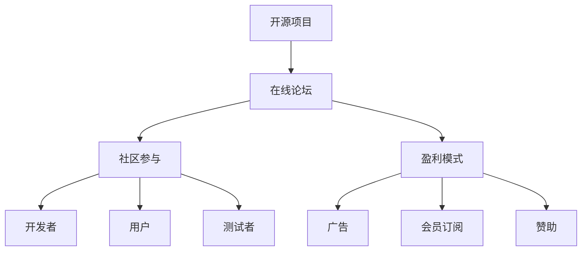

                 

关键词：开源项目、在线论坛、社区参与、盈利模式

> 摘要：本文旨在探讨如何创建一个成功的开源项目在线论坛，通过有效的社区参与和合理的盈利模式，实现项目的发展和持续成长。

## 1. 背景介绍

开源项目在线论坛是开源社区的核心组成部分，它不仅是开发者交流技术的平台，也是项目发展的关键驱动力。一个成功的论坛能够促进社区成员之间的互动，增强社区的凝聚力，同时也有助于项目的持续迭代和改进。

在开源世界中，一个活跃的论坛可以吸引更多的开发者参与，从而推动项目的发展。然而，创建和管理一个成功的论坛并非易事，需要深入理解社区动态，制定有效的社区参与策略，并设计合理的盈利模式来支持论坛的长期运营。

本文将探讨以下几个核心问题：

- 如何建立和维护一个健康、活跃的论坛社区？
- 开源项目的论坛社区参与策略有哪些？
- 如何设计并实施有效的盈利模式？
- 未来开源论坛的发展趋势和挑战是什么？

通过回答这些问题，我们希望能够为开源项目的维护者、开发者和管理者提供有价值的参考和指导。

## 2. 核心概念与联系

为了更好地理解开源项目在线论坛的作用和运作方式，我们需要首先了解一些核心概念和其之间的联系。

### 2.1 开源项目

开源项目是指那些发布源代码，允许用户自由查看、修改和分发软件的项目。开源项目依赖于一个活跃的社区，社区的成员通常包括开发者、用户、测试者等。

### 2.2 在线论坛

在线论坛是一个基于互联网的讨论平台，它允许用户发布帖子、评论、分享信息和资源。论坛是社区成员交流和互动的主要场所，对于开源项目来说，论坛的作用尤为重要。

### 2.3 社区参与

社区参与是指社区成员在论坛上积极参与项目讨论、代码贡献、测试、反馈等活动的行为。一个高参与度的社区能够推动项目的快速发展，同时也能够吸引更多的新成员加入。

### 2.4 盈利模式

盈利模式是指开源论坛通过提供某些服务或产品来获取收益的方式。一个合理的盈利模式不仅能够为论坛的运营提供资金支持，还能够激励社区成员的参与。

#### 2.5 Mermaid 流程图

以下是一个简化的 Mermaid 流程图，展示了开源项目在线论坛的核心概念和联系：



通过这个流程图，我们可以清晰地看到开源项目、在线论坛、社区参与和盈利模式之间的相互作用和依赖关系。

## 3. 核心算法原理 & 具体操作步骤

### 3.1 算法原理概述

开源项目在线论坛的核心算法主要涉及社区管理和互动机制的设计。这些算法旨在促进社区成员的参与，并确保论坛的健康和活跃。

以下是几个关键算法原理：

- **社区激励算法**：通过奖励系统鼓励用户参与论坛活动，如发布帖子、评论、解决问题等。
- **互动反馈算法**：实时监测论坛互动情况，通过反馈机制提高用户的参与感和满意度。
- **内容推荐算法**：根据用户的兴趣和行为，推荐相关的论坛内容和话题，以增加用户的粘性。
- **盈利模式优化算法**：通过分析用户行为和论坛数据，优化盈利模式，提高收益。

### 3.2 算法步骤详解

#### 3.2.1 社区激励算法

1. **用户行为分析**：收集用户的论坛活动数据，包括帖子发布、评论、参与讨论等。
2. **积分奖励系统**：为用户的活动分配积分，积分可以用于兑换论坛特权或实物奖励。
3. **排名和奖励**：定期发布用户积分排名，并为排名靠前的用户提供额外奖励，如论坛徽章、特权等。

#### 3.2.2 互动反馈算法

1. **实时监控**：使用数据分析工具监控论坛的互动情况，包括帖子回复数、讨论热度等。
2. **用户反馈**：定期收集用户对论坛互动的反馈，通过问卷调查、论坛投票等方式。
3. **改进措施**：根据监控和反馈结果，调整论坛互动机制，如增加话题标签、优化评论系统等。

#### 3.2.3 内容推荐算法

1. **用户画像**：分析用户的兴趣和行为数据，构建用户画像。
2. **推荐系统**：使用机器学习算法，根据用户画像推荐相关的论坛内容和话题。
3. **个性化推送**：通过邮件、论坛推送等方式，将推荐内容个性化地推送给用户。

#### 3.2.4 盈利模式优化算法

1. **数据分析**：分析用户行为数据和论坛运营数据，了解用户需求和市场趋势。
2. **模式调整**：根据数据分析结果，调整盈利模式，如增加广告投放、优化会员订阅等。
3. **收益最大化**：通过数据驱动的决策，实现论坛收益的最大化。

### 3.3 算法优缺点

#### 3.3.1 优点

- **提高用户参与度**：通过激励机制和互动反馈，增强用户的参与感和满意度。
- **优化内容推荐**：通过个性化推荐，提高用户粘性和论坛活跃度。
- **收益最大化**：通过数据分析优化盈利模式，提高论坛的收益。

#### 3.3.2 缺点

- **算法复杂度高**：需要大量的数据处理和机器学习算法，对技术要求较高。
- **数据隐私问题**：需要处理大量的用户数据，存在一定的隐私风险。
- **依赖外部技术**：部分算法需要依赖外部技术或服务，如机器学习平台、数据分析工具等。

### 3.4 算法应用领域

- **开源社区**：开源项目在线论坛是开源社区的核心组成部分，算法在开源社区中有着广泛的应用。
- **企业内部论坛**：企业内部论坛也可以使用类似的算法来提高员工参与度和工作效率。
- **社交媒体**：社交媒体平台也可以借鉴这些算法，优化用户互动和内容推荐。

## 4. 数学模型和公式 & 详细讲解 & 举例说明

### 4.1 数学模型构建

为了更好地理解和分析开源项目在线论坛的运作，我们可以构建以下数学模型：

- **用户活跃度模型**：使用用户的帖子数量、评论数量、点赞数量等指标来衡量用户活跃度。
- **社区互动模型**：通过帖子回复数、讨论热度、用户互动频率等指标来评估社区互动情况。
- **盈利模型**：使用用户数量、广告收益、会员订阅数、赞助金额等指标来计算论坛的盈利能力。

### 4.2 公式推导过程

以下是一些关键的数学公式及其推导过程：

#### 4.2.1 用户活跃度公式

用户活跃度（\(U_{active}\)）可以用以下公式表示：

\[ U_{active} = \frac{N_{posts} + N_{comments} + N_{likes}}{3} \]

其中，\(N_{posts}\) 是用户发布的帖子数量，\(N_{comments}\) 是用户发布的评论数量，\(N_{likes}\) 是用户获得的点赞数量。

#### 4.2.2 社区互动公式

社区互动指数（\(I_{interaction}\)）可以用以下公式表示：

\[ I_{interaction} = \frac{R_{replies} + H_{hotness} + F_{frequency}}{3} \]

其中，\(R_{replies}\) 是帖子的回复数量，\(H_{hotness}\) 是帖子的讨论热度，\(F_{frequency}\) 是用户的互动频率。

#### 4.2.3 盈利模型公式

论坛盈利（\(P_{profit}\)）可以用以下公式表示：

\[ P_{profit} = A_{ads} + S_{subscription} + D_{donations} \]

其中，\(A_{ads}\) 是广告收入，\(S_{subscription}\) 是会员订阅收入，\(D_{donations}\) 是赞助收入。

### 4.3 案例分析与讲解

为了更好地理解上述数学模型，我们来看一个具体的案例。

#### 案例背景

一个开源项目的论坛在过去一个月内有以下数据：

- 用户活跃度：平均每个用户发布了5个帖子、10条评论、8个点赞。
- 社区互动：平均每篇帖子有15个回复、讨论热度达到100、用户互动频率为每周3次。
- 盈利：广告收入为每月1000美元，会员订阅收入为每月500美元，赞助收入为每月200美元。

#### 数据分析

1. **用户活跃度**：

   \[ U_{active} = \frac{5 + 10 + 8}{3} = 7.33 \]

   每个用户的平均活跃度为7.33。

2. **社区互动**：

   \[ I_{interaction} = \frac{15 + 100 + 3}{3} = 44.33 \]

   社区的平均互动指数为44.33。

3. **盈利**：

   \[ P_{profit} = 1000 + 500 + 200 = 1700 \]

   论坛的总盈利为每月1700美元。

通过这个案例，我们可以看到数学模型如何帮助我们分析和评估论坛的运营状况。根据这些数据，我们可以进一步优化论坛的策略，如增加用户激励、改进内容推荐系统、调整盈利模式等。

## 5. 项目实践：代码实例和详细解释说明

### 5.1 开发环境搭建

在开始实际操作之前，我们需要搭建一个适合开源项目在线论坛的开发环境。以下是搭建过程的简要步骤：

1. **选择合适的论坛软件**：例如，Discourse 是一个流行的开源论坛软件，它提供了丰富的功能和良好的用户界面。
2. **安装和配置服务器**：选择一个稳定的云服务器，安装必要的软件，如 Apache、MySQL、PHP 等。
3. **安装论坛软件**：按照论坛软件的官方文档进行安装和配置，确保论坛可以正常运行。

### 5.2 源代码详细实现

开源项目在线论坛的源代码实现可以分为以下几个关键模块：

- **用户管理系统**：处理用户注册、登录、权限管理等功能。
- **帖子管理系统**：处理帖子发布、回复、删除等功能。
- **评论管理系统**：处理评论发布、删除等功能。
- **积分和奖励系统**：处理用户积分的分配和兑换。
- **广告和会员订阅系统**：处理广告投放、会员订阅等功能。

以下是一个简化的示例代码，展示了用户管理系统的一部分实现：

```php
// 用户注册
function registerUser($username, $password) {
    // 验证用户名和密码的有效性
    if (isValidCredentials($username, $password)) {
        // 创建用户记录并保存到数据库
        $user = createUserRecord($username, $password);
        // 发送注册确认邮件
        sendConfirmationEmail($user);
        return "用户注册成功，请检查邮箱以完成注册。";
    } else {
        return "用户名或密码无效，请重新输入。";
    }
}

// 用户登录
function loginUser($username, $password) {
    // 验证用户名和密码
    if (isValidCredentials($username, $password)) {
        // 设置用户会话
        startSession($username);
        return "登录成功！";
    } else {
        return "用户名或密码错误，登录失败。";
    }
}

// 验证用户名和密码
function isValidCredentials($username, $password) {
    // 实现用户名和密码的验证逻辑
    // 例如，查询数据库验证用户名和密码是否匹配
    return true; // 示例代码，实际应用中需要实现具体的验证逻辑
}

// 创建用户记录
function createUserRecord($username, $password) {
    // 实现创建用户记录的逻辑，例如插入数据库
    return new User($username, $password); // 示例代码，实际应用中需要实现具体的创建逻辑
}

// 发送注册确认邮件
function sendConfirmationEmail($user) {
    // 实现发送邮件的逻辑
    // 例如，使用 PHPMailer 库发送邮件
    sendEmail($user->getEmail(), "注册确认邮件", "感谢注册，请点击以下链接完成注册：[注册链接]"); // 示例代码，实际应用中需要实现具体的发送逻辑
}

// 设置用户会话
function startSession($username) {
    // 实现设置用户会话的逻辑
    // 例如，将用户信息存储在 session 变量中
    $_SESSION['username'] = $username; // 示例代码，实际应用中需要实现具体的会话管理逻辑
}
```

### 5.3 代码解读与分析

上述代码展示了用户管理系统的基本实现，包括用户注册、登录、验证等功能。以下是对关键部分的解读和分析：

- **注册功能**：`registerUser` 函数用于处理用户注册。首先，它验证用户名和密码的有效性。如果有效，则创建用户记录并发送注册确认邮件。这里，`isValidCredentials` 函数需要实现具体的验证逻辑，例如查询数据库检查用户名和密码是否匹配。
- **登录功能**：`loginUser` 函数用于处理用户登录。它验证用户名和密码是否匹配，如果匹配，则设置用户会话。
- **用户验证**：`isValidCredentials` 函数是用户验证的核心。它需要实现具体的验证逻辑，例如查询数据库检查用户名和密码是否匹配。
- **用户记录创建**：`createUserRecord` 函数用于创建用户记录。它需要实现具体的创建逻辑，例如将用户信息插入数据库。
- **邮件发送**：`sendConfirmationEmail` 函数用于发送注册确认邮件。它需要实现具体的邮件发送逻辑，例如使用 PHPMailer 库发送邮件。
- **会话管理**：`startSession` 函数用于设置用户会话。它需要实现具体的会话管理逻辑，例如将用户信息存储在 session 变量中。

通过这些代码，我们可以看到用户管理系统的基础架构和实现细节。在实际项目中，这些功能将更加复杂和丰富，但基本的逻辑和架构是类似的。

### 5.4 运行结果展示

在实际运行中，用户注册和登录功能的结果可以通过网页界面展示给用户。以下是用户注册和登录的示例界面：

#### 用户注册界面

```html
<!DOCTYPE html>
<html>
<head>
    <title>用户注册</title>
</head>
<body>
    <h1>用户注册</h1>
    <form action="register.php" method="post">
        用户名：<input type="text" name="username" required>
        密码：<input type="password" name="password" required>
        <input type="submit" value="注册">
    </form>
</body>
</html>
```

#### 用户登录界面

```html
<!DOCTYPE html>
<html>
<head>
    <title>用户登录</title>
</head>
<body>
    <h1>用户登录</h1>
    <form action="login.php" method="post">
        用户名：<input type="text" name="username" required>
        密码：<input type="password" name="password" required>
        <input type="submit" value="登录">
    </form>
</body>
</html>
```

当用户提交注册或登录请求时，相应的 PHP 脚本会处理这些请求，并根据验证结果返回相应的结果。例如，如果用户注册成功，会显示注册成功的提示信息，并跳转到登录界面。如果用户登录成功，则会进入论坛的主界面。

通过这些运行结果，我们可以看到用户管理系统的基本功能和界面实现。在实际项目中，还需要实现更多的功能，如帖子管理、评论管理、积分和奖励系统等。

## 6. 实际应用场景

开源项目在线论坛的实际应用场景非常广泛，涵盖了从技术交流到商业合作的各个方面。以下是几个典型的应用场景：

### 6.1 技术社区

技术社区是开源论坛最常见的应用场景之一。例如，GitHub、GitLab 等 Git 版本控制系统提供了内置的论坛功能，让开发者可以在项目仓库内讨论问题、分享心得、发布技术文章等。这些论坛不仅促进了项目的开发进度，还吸引了更多开发者加入社区，共同推动技术进步。

### 6.2 开源项目协作

开源项目通常需要广泛的社区参与，论坛成为项目协作的重要平台。通过论坛，项目维护者可以发布任务、征集贡献者、讨论代码问题等。例如，OpenStack、Kubernetes 等大型开源项目都依赖于活跃的论坛社区来协调开发工作，确保项目的稳定和持续发展。

### 6.3 商业合作

许多商业公司也利用开源论坛来推广其产品和服务。例如，Red Hat 通过其官方论坛与开源社区互动，推广其企业级开源解决方案。此外，一些公司还会在论坛上发布招聘信息，吸引技术人才加入。

### 6.4 教育培训

开源论坛也是教育和培训的重要工具。许多教育机构和在线课程平台利用论坛来提供技术支持和讨论空间，让学生在学习过程中能够互相帮助、讨论问题。例如，Coursera、edX 等在线教育平台都提供了论坛功能，帮助学生更好地理解和掌握课程内容。

### 6.5 社区活动

开源论坛还可以用于组织社区活动，如线下会议、技术讲座、编程比赛等。通过论坛，组织者可以发布活动通知、收集参会者信息、讨论活动细节，确保活动的顺利进行。

### 6.6 创业孵化

一些创业公司和孵化器也利用开源论坛来搭建内部沟通和协作平台。通过论坛，团队成员可以讨论项目进展、分享工作成果、解决技术难题，提高团队的工作效率。

总之，开源项目在线论坛的应用场景非常多样，不仅可以为项目开发提供支持，还可以促进社区互动、商业合作和教育培训。通过合理利用论坛，开源项目能够获得更多的发展机会和资源支持。

### 6.7 未来应用展望

随着技术的不断进步和开源文化的普及，开源项目在线论坛的未来应用前景将更加广阔。以下是几个可能的发展趋势：

#### 6.7.1 人工智能与自动化

人工智能（AI）和自动化技术将在开源论坛中发挥越来越重要的作用。通过引入智能聊天机器人、自然语言处理（NLP）技术，论坛可以实现更高效的问答和客服功能，提高用户的参与体验。例如，智能机器人可以自动回答常见问题，减轻社区管理员的负担。

#### 6.7.2 社交化元素增强

开源论坛将更加注重社交化元素的引入，以增强用户互动和社区凝聚力。例如，引入社交媒体分享功能、直播互动、社交媒体账号绑定等，将有助于用户在不同平台上建立更紧密的连接，促进知识共享和协作。

#### 6.7.3 跨平台整合

随着移动设备和多种平台的普及，开源论坛将更加注重跨平台整合，提供一致的体验。无论是桌面浏览器、手机APP还是其他设备，用户都应该能够无缝切换，随时参与论坛活动。此外，论坛将整合更多第三方服务，如社交媒体平台、协作工具等，为用户提供更丰富的功能。

#### 6.7.4 数据驱动的决策

开源论坛将越来越多地依赖数据分析来指导运营决策。通过收集和分析用户行为、互动数据，论坛管理员可以更好地了解用户需求，优化内容推荐、论坛布局、互动机制等，从而提高用户满意度和活跃度。

#### 6.7.5 商业模式的创新

开源论坛的商业模式也将不断探索和创新。除了传统的广告、会员订阅、赞助等模式外，论坛可能引入更多的增值服务，如在线培训、专业咨询、认证服务等，以实现可持续的商业回报。此外，通过与其他商业公司的合作，论坛可以提供更多的商业机会，为社区成员带来实际的价值。

总之，开源项目在线论坛的未来发展充满潜力，将在技术、社区、商业等多个领域发挥重要作用。通过不断优化和升级，论坛将成为开源生态系统中的重要一环，为开源项目的持续发展和创新提供强有力的支持。

## 7. 工具和资源推荐

为了帮助读者更好地理解和实践开源项目在线论坛的创建和管理，以下是一些推荐的工具和资源：

### 7.1 学习资源推荐

1. **《开源社区管理》**：由 Eric S. Raymond 编写的经典之作，详细介绍了开源社区的管理和实践经验。
2. **《开源论坛最佳实践》**：一篇由红帽公司的工程师撰写的博客文章，分享了他们在开源论坛管理方面的经验。
3. **《如何创建和维护一个成功的开源社区》**：GitHub 发布的一篇指南，涵盖了社区建设的关键步骤和策略。

### 7.2 开发工具推荐

1. **Discourse**：一个流行的开源论坛软件，提供丰富的功能和灵活的定制选项。
2. **Flarum**：一个轻量级的开源论坛软件，具有良好的用户体验和可扩展性。
3. **phpBB**：一个历史悠久、功能全面的论坛软件，适合大型社区使用。

### 7.3 相关论文推荐

1. **"Open Source Software Development: A Survey"**：一篇综述性论文，详细介绍了开源软件开发的现状、挑战和机遇。
2. **"The Cathedral and the Bazaar"**：Eric S. Raymond 的经典论文，探讨了开源社区与商业模型的关系。
3. **"The Benefits of Open Source Software Development"**：一篇研究论文，分析了开源软件开发的优势和潜在风险。

通过这些工具和资源，读者可以更深入地了解开源项目在线论坛的创建和管理，从而在实践中取得更好的效果。

## 8. 总结：未来发展趋势与挑战

开源项目在线论坛作为开源社区的核心组成部分，具有巨大的发展潜力。未来，开源论坛将朝着更智能化、社交化、跨平台的方向发展，同时面临诸多挑战。

### 8.1 研究成果总结

1. **社区激励机制**：通过用户积分、徽章、奖励等手段，提高社区成员的参与度和活跃度。
2. **互动反馈机制**：利用实时监控、用户反馈等技术，优化论坛互动体验，提高用户满意度。
3. **内容推荐系统**：通过机器学习和数据分析，为用户提供个性化的内容推荐，提高用户粘性。
4. **盈利模式创新**：探索多元化的盈利模式，如广告、会员订阅、赞助等，实现论坛的可持续运营。

### 8.2 未来发展趋势

1. **智能化**：人工智能和自动化技术将在开源论坛中发挥越来越重要的作用，如智能客服、自动内容推荐等。
2. **社交化**：开源论坛将更加注重社交化元素的引入，如社交媒体整合、直播互动等，增强用户互动和社区凝聚力。
3. **跨平台**：开源论坛将实现跨平台的整合，提供一致的体验，满足不同设备用户的需求。
4. **数据分析**：数据驱动的决策将成为开源论坛运营的关键，通过分析用户行为和论坛数据，优化运营策略。

### 8.3 面临的挑战

1. **数据隐私**：开源论坛需要处理大量的用户数据，如何保护用户隐私成为一大挑战。
2. **技术门槛**：开源论坛的搭建和管理需要一定的技术基础，特别是对于非技术人员来说，这可能是一个难题。
3. **可持续性**：如何确保开源论坛的可持续运营，是一个长期而艰巨的任务，需要探索多元化的盈利模式。

### 8.4 研究展望

1. **隐私保护技术**：进一步研究如何有效保护用户隐私，确保开源论坛的合法性和用户信任。
2. **社区激励机制**：探索更多有效的激励机制，提高社区成员的参与度和忠诚度。
3. **跨平台集成**：研究如何实现更高效的跨平台集成，提供无缝的用户体验。
4. **盈利模式创新**：探索更多创新的盈利模式，确保开源论坛的可持续发展。

总之，开源项目在线论坛在未来将继续发展和创新，为开源社区的发展提供有力支持。通过不断克服挑战，开源论坛将更好地服务于社区，推动技术的进步和创新。

## 9. 附录：常见问题与解答

### 9.1 开源论坛搭建过程中常见问题

**Q：如何选择合适的论坛软件？**
A：选择论坛软件时，应考虑以下因素：
- 功能需求：根据项目需求选择具备所需功能的论坛软件。
- 扩展性：选择可扩展性强的软件，以便未来扩展功能。
- 社区支持：选择拥有活跃社区和良好技术支持的软件，便于解决问题和获取帮助。

**Q：论坛安全性如何保障？**
A：为了保障论坛的安全性，可以采取以下措施：
- 定期更新软件版本和插件，修复已知漏洞。
- 使用HTTPS协议，确保数据传输加密。
- 定期备份数据库，防止数据丢失。

**Q：如何管理论坛社区？**
A：管理论坛社区的方法包括：
- 设立管理员团队，负责论坛的管理和维护。
- 制定明确的社区规则，规范用户行为。
- 定期清理垃圾帖子和违规内容，维护论坛秩序。

### 9.2 开源论坛运营过程中常见问题

**Q：如何提高论坛的用户活跃度？**
A：提高用户活跃度的策略包括：
- 定期举办线上活动，激发用户参与热情。
- 提供有价值的内容，如技术教程、项目更新等。
- 引入积分和奖励系统，激励用户积极参与论坛活动。

**Q：如何设计有效的盈利模式？**
A：设计有效的盈利模式可以参考以下策略：
- 广告收入：合理规划广告投放，确保用户体验不受影响。
- 会员订阅：提供会员专属服务，吸引付费用户。
- 赞助和赞助商合作：与相关公司合作，获取赞助收入。

**Q：如何平衡用户参与和盈利模式？**
A：平衡用户参与和盈利模式的方法包括：
- 保持论坛的开放性，确保用户可以自由参与和分享。
- 透明化运营，让用户了解论坛的盈利模式和分配方式。
- 定期进行用户调查，了解用户对盈利模式的需求和反馈。

通过解答这些问题，可以帮助开源项目的维护者和开发者更好地搭建和管理开源论坛，实现社区参与和盈利的双赢。

