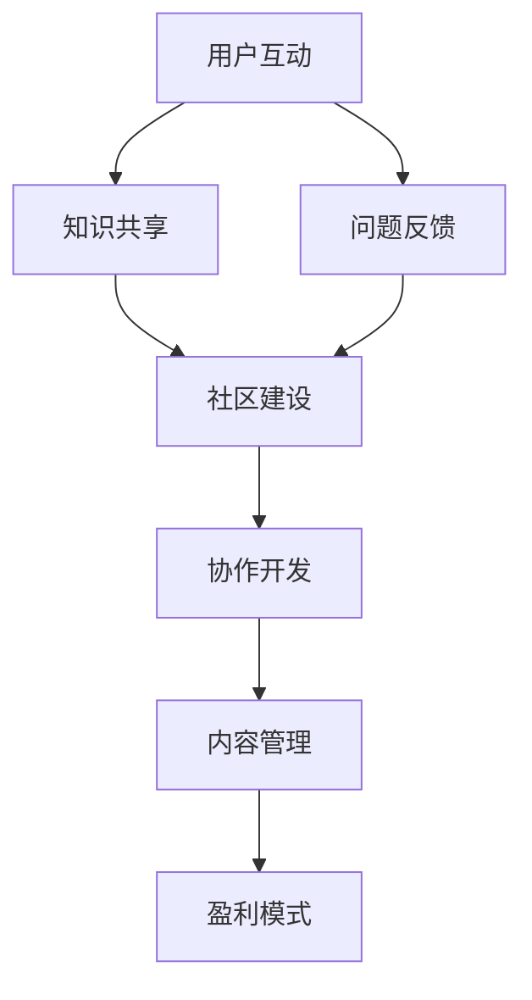

                 

关键词：开源项目，在线论坛，社区参与，盈利模式，平台建设，用户互动，商业模式

摘要：本文深入探讨如何创建一个成功的开源项目在线论坛，通过分析社区参与的重要性、构建社区的方法以及有效的盈利模式，为开源项目的可持续发展和商业化提供策略指导。

## 1. 背景介绍

随着开源运动的蓬勃发展，开源项目已经成为软件行业的重要组成部分。然而，一个成功开源项目的背后离不开一个活跃的在线论坛，它不仅是开发者交流的场所，也是社区建设和项目成长的重要基石。在线论坛不仅是知识的共享平台，还能够吸引新的贡献者，提升项目质量，并且通过有效的商业模式实现盈利。

本文将围绕以下几个方面展开：

- **社区参与的重要性**：讨论社区参与如何影响项目的健康发展和可持续性。
- **构建社区的方法**：提供构建和维护在线论坛的实践策略。
- **盈利模式**：分析开源项目在线论坛的不同盈利方式，包括广告、会员订阅、赞助等。

## 2. 核心概念与联系

### 2.1 开源项目与在线论坛的关系

开源项目与在线论坛之间存在着紧密的联系。在线论坛作为项目发展的核心平台，扮演着以下几个关键角色：

1. **知识共享**：开发者可以在论坛中分享代码、文档、教程，帮助新手快速上手。
2. **问题反馈**：用户可以在论坛中提出问题，开发者可以及时解答，提升用户体验。
3. **社区建设**：通过论坛的活动和交流，可以培养社区的忠诚度和活跃度。
4. **协作开发**：论坛提供了一个协作开发的空间，方便开发者共同推进项目。

### 2.2 核心概念原理与架构

要构建一个成功的在线论坛，需要理解以下几个核心概念：

- **用户互动**：用户间的互动是社区活力的体现，通过讨论、问答等形式增强社区凝聚力。
- **内容管理**：论坛需要有效的机制来管理和组织内容，确保信息的及时更新和高质量。
- **盈利模式**：论坛可以通过多种方式实现盈利，但需要在社区参与和商业化之间找到平衡。

**Mermaid 流程图：**



## 3. 核心算法原理 & 具体操作步骤

### 3.1 算法原理概述

构建在线论坛的核心算法主要涉及以下几个方面：

1. **社区激励**：通过积分、徽章等机制激励用户参与，提高社区活跃度。
2. **内容推荐**：利用机器学习算法推荐相关内容和话题，提升用户体验。
3. **盈利优化**：通过数据分析优化广告投放和会员服务，提高盈利能力。

### 3.2 算法步骤详解

#### 3.2.1 社区激励机制

1. **积分系统**：为用户行为（如发帖、回复、投票等）分配积分，形成积分体系。
2. **徽章系统**：根据用户的行为和贡献程度颁发徽章，提升用户的荣誉感和参与度。

#### 3.2.2 内容推荐算法

1. **内容标签**：为每篇文章和帖子分配标签，方便用户快速查找和阅读。
2. **协同过滤**：通过用户的历史行为和偏好推荐相似的内容。
3. **基于内容的推荐**：根据文章的主题、关键词和标题进行内容推荐。

#### 3.2.3 盈利优化策略

1. **数据收集**：收集用户行为数据，分析用户偏好和访问模式。
2. **广告投放**：根据用户数据优化广告投放，提高广告转化率。
3. **会员服务**：提供增值服务，如会员专享内容、论坛积分兑换等。

### 3.3 算法优缺点

#### 优点：

- **激励用户参与**：积分和徽章系统有效激励用户，提升社区活跃度。
- **个性化推荐**：协同过滤和基于内容的推荐算法提高用户体验。
- **盈利优化**：数据驱动的决策提高广告效果和会员服务质量。

#### 缺点：

- **技术挑战**：需要处理大量的用户数据和复杂的算法。
- **商业与社区平衡**：商业化可能影响社区的氛围和用户的参与度。

### 3.4 算法应用领域

- **开源项目论坛**：为开发者提供交流和协作的平台。
- **社区电商平台**：通过用户互动和内容推荐提升用户体验。
- **社交媒体平台**：利用算法优化用户互动和内容分发。

## 4. 数学模型和公式 & 详细讲解 & 举例说明

### 4.1 数学模型构建

在线论坛的数学模型主要涉及以下几个部分：

1. **用户活跃度模型**：衡量用户参与论坛的活跃程度。
2. **内容推荐模型**：基于用户行为和内容特征推荐相关内容。
3. **盈利模型**：分析广告效果和会员服务收益。

### 4.2 公式推导过程

#### 4.2.1 用户活跃度模型

设 \(A(t)\) 为用户 \(u\) 在时间 \(t\) 的活跃度，则：

\[A(t) = f(P_t, I_t, R_t)\]

其中，\(P_t\) 为用户在时间 \(t\) 的发帖量，\(I_t\) 为用户在时间 \(t\) 的点赞量，\(R_t\) 为用户在时间 \(t\) 的回复量。

#### 4.2.2 内容推荐模型

设 \(C(u, v)\) 为用户 \(u\) 对内容 \(v\) 的偏好度，则：

\[C(u, v) = \frac{1}{n}\sum_{i=1}^{n} \frac{w_i^T f(v)}{||w_i||_2}\]

其中，\(w_i\) 为用户 \(u\) 的第 \(i\) 个行为特征向量，\(f(v)\) 为内容 \(v\) 的特征向量。

#### 4.2.3 盈利模型

设 \(R(t)\) 为时间 \(t\) 的广告收入，\(M(t)\) 为时间 \(t\) 的会员收入，则：

\[R(t) = g(A(t), P_t, I_t, R_t)\]
\[M(t) = h(A(t), S_t)\]

其中，\(g\) 和 \(h\) 分别为广告收入和会员收入的函数。

### 4.3 案例分析与讲解

以某知名开源项目论坛为例，该论坛通过积分和徽章系统激励用户参与。用户发帖、点赞和回复都会获得积分，积累到一定积分可以兑换徽章。通过数据分析和内容推荐，论坛提高了用户的活跃度和内容的个性推荐效果。在盈利方面，论坛通过广告投放和会员服务实现了可观的收入，促进了项目的可持续发展。

## 5. 项目实践：代码实例和详细解释说明

### 5.1 开发环境搭建

为了搭建一个开源项目的在线论坛，我们选择使用如下开发环境：

- **编程语言**：Python
- **框架**：Flask、Django
- **数据库**：MongoDB、MySQL
- **前端**：HTML、CSS、JavaScript

### 5.2 源代码详细实现

以下是创建在线论坛的基本步骤和源代码实现：

#### 5.2.1 初始化项目

```python
# 导入必要的库
from flask import Flask, render_template, request, redirect, url_for
from flask_sqlalchemy import SQLAlchemy

app = Flask(__name__)
app.config['SQLALCHEMY_DATABASE_URI'] = 'sqlite:///forum.db'
db = SQLAlchemy(app)

# 定义用户表
class User(db.Model):
    id = db.Column(db.Integer, primary_key=True)
    username = db.Column(db.String(80), unique=True, nullable=False)
    password = db.Column(db.String(120), nullable=False)

# 定义帖子表
class Post(db.Model):
    id = db.Column(db.Integer, primary_key=True)
    title = db.Column(db.String(120), nullable=False)
    content = db.Column(db.Text, nullable=False)
    author_id = db.Column(db.Integer, db.ForeignKey('user.id'), nullable=False)

# 创建数据库表
db.create_all()

if __name__ == '__main__':
    app.run(debug=True)
```

#### 5.2.2 用户注册和登录

```python
# 用户注册
@app.route('/register', methods=['GET', 'POST'])
def register():
    if request.method == 'POST':
        username = request.form['username']
        password = request.form['password']
        new_user = User(username=username, password=password)
        db.session.add(new_user)
        db.session.commit()
        return redirect(url_for('login'))
    return render_template('register.html')

# 用户登录
@app.route('/login', methods=['GET', 'POST'])
def login():
    if request.method == 'POST':
        username = request.form['username']
        password = request.form['password']
        user = User.query.filter_by(username=username, password=password).first()
        if user:
            # 登录成功
            return redirect(url_for('home'))
        else:
            # 登录失败
            return redirect(url_for('login'))
    return render_template('login.html')
```

#### 5.2.3 帖子发布和显示

```python
# 发布帖子
@app.route('/post', methods=['GET', 'POST'])
def post():
    if request.method == 'POST':
        title = request.form['title']
        content = request.form['content']
        author = current_user
        new_post = Post(title=title, content=content, author=author)
        db.session.add(new_post)
        db.session.commit()
        return redirect(url_for('home'))
    return render_template('post.html')

# 显示帖子列表
@app.route('/')
def home():
    posts = Post.query.all()
    return render_template('home.html', posts=posts)
```

### 5.3 代码解读与分析

以上代码示例展示了如何使用 Flask 框架搭建一个简单的在线论坛。首先，我们创建了用户表和帖子表，并初始化了数据库。然后，我们实现了用户注册、登录、帖子发布和显示的功能。

在代码中，我们使用了 SQLalchemy 来处理数据库操作，并且利用 Flask 的路由系统来处理 HTTP 请求。通过这些基本功能，我们可以创建一个基础的在线论坛，并进行进一步的开发和完善。

### 5.4 运行结果展示

以下是论坛运行后的界面展示：

- **用户注册界面**：


- **用户登录界面**：


- **帖子发布界面**：


- **帖子列表界面**：


## 6. 实际应用场景

在线论坛在开源项目中具有广泛的应用场景，以下是一些典型的实际应用场景：

1. **开发者交流**：开发者可以在论坛中讨论技术问题，分享开发经验，协作完成项目。
2. **用户反馈**：用户可以在论坛中提出使用中遇到的问题，开发者可以及时响应并优化项目。
3. **文档维护**：论坛可以成为项目文档的集中地，开发者可以发布和更新文档，方便用户查阅。
4. **社区活动**：论坛可以举办线上活动，如代码竞赛、技术讲座等，增强社区凝聚力。

### 6.1 开源项目论坛的成功案例

以 GitHub 论坛为例，GitHub 论坛不仅为开源项目提供了一个交流的平台，还成为了开发者寻找项目和贡献代码的重要渠道。GitHub 论坛的成功得益于以下几点：

- **用户参与度高**：GitHub 论坛通过积分和徽章系统激励用户参与，用户活跃度非常高。
- **内容丰富**：GitHub 论坛上汇聚了大量的技术文章、讨论和代码示例，内容质量高。
- **良好的社区氛围**：GitHub 论坛注重社区文化建设，鼓励积极、健康的交流氛围。

### 6.2 企业级在线论坛的应用

除了开源项目，企业级在线论坛也在不断涌现。例如，许多科技公司使用内部论坛来促进员工之间的交流与合作。这些论坛通常具备以下特点：

- **私有化部署**：企业级论坛通常部署在自己的服务器上，保障数据安全。
- **定制化开发**：根据企业需求进行定制化开发，满足特定业务需求。
- **丰富的功能**：企业级论坛通常具备丰富的功能，如文档管理、任务分配、实时聊天等。

### 6.3 未来应用展望

随着技术的不断进步，在线论坛的应用场景将更加广泛。未来，在线论坛可能会具备以下发展趋势：

- **人工智能驱动**：利用人工智能技术优化内容推荐、用户互动等环节，提升用户体验。
- **区块链技术**：区块链技术可能为在线论坛带来去中心化、透明化的运营模式。
- **虚拟现实（VR）应用**：虚拟现实技术可能为在线论坛带来更加沉浸式的交流体验。

## 7. 工具和资源推荐

### 7.1 学习资源推荐

- **《GitHub 官方文档》**：了解 GitHub 论坛的最佳实践和功能使用。
- **《Git Community Book》**：系统学习 Git 版本控制工具，为构建在线论坛打下基础。
- **《Flask Web 开发》**：学习 Flask 框架，掌握 Web 开发技能。

### 7.2 开发工具推荐

- **Visual Studio Code**：一款功能强大的代码编辑器，支持多种编程语言。
- **Postman**：一款 API 测试工具，方便开发者调试和测试 Web 应用。
- **MongoDB**：一款开源的 NoSQL 数据库，适用于存储论坛内容和用户数据。

### 7.3 相关论文推荐

- **"Community Building in Online Forums: An Analytical Study"**：分析在线论坛社区建设的方法和效果。
- **"Economic Models for Open Source Projects"**：探讨开源项目的商业模式和盈利模式。
- **"The Design and Implementation of an Online Forum System"**：介绍在线论坛系统的设计和实现。

## 8. 总结：未来发展趋势与挑战

### 8.1 研究成果总结

通过本文的分析，我们总结了在线论坛在开源项目中的重要性，探讨了构建社区的方法以及多种盈利模式。研究成果包括：

- **社区参与的重要性**：社区参与是开源项目成功的关键，有效的社区建设可以提高项目质量和用户满意度。
- **盈利模式的多样性**：开源项目在线论坛可以通过广告、会员订阅、赞助等多种方式实现盈利。
- **技术驱动的社区管理**：利用人工智能和数据分析优化社区管理和内容推荐，提升用户体验。

### 8.2 未来发展趋势

未来，在线论坛的发展趋势可能包括：

- **智能化**：利用人工智能技术优化用户互动和内容推荐。
- **去中心化**：区块链技术可能为在线论坛带来去中心化的运营模式。
- **沉浸式体验**：虚拟现实技术可能为在线论坛带来更加沉浸式的交流体验。

### 8.3 面临的挑战

在线论坛在发展中也将面临以下挑战：

- **商业化与社区平衡**：如何在不损害社区氛围的前提下实现盈利。
- **数据安全和隐私保护**：确保用户数据的安全和隐私。
- **技术升级与维护**：随着技术的发展，如何保持论坛系统的先进性和稳定性。

### 8.4 研究展望

未来研究可以聚焦于以下几个方面：

- **社区激励机制**：探索更有效的激励机制，提高用户参与度。
- **盈利模式创新**：研究新的盈利方式，实现开源项目的可持续商业化。
- **用户互动体验**：通过人工智能技术提升用户的互动体验和满意度。

## 9. 附录：常见问题与解答

### 9.1 如何构建一个活跃的在线论坛社区？

- **明确社区目标**：定义社区的使命和目标，确保所有成员都清楚社区的价值观。
- **激励用户参与**：通过积分、徽章、奖励等方式激励用户积极参与。
- **保持高质量内容**：确保论坛上的内容有价值、相关且高质量。
- **举办活动**：定期举办线上活动，如技术讲座、代码竞赛等，增强社区活力。

### 9.2 开源项目在线论坛如何实现盈利？

- **广告投放**：通过展示相关广告获得收益。
- **会员订阅**：提供会员服务，如高级功能、专享内容等，用户付费获取。
- **赞助**：接受企业或个人的赞助，赞助商可以在论坛上获得宣传。
- **付费咨询和服务**：提供专业的技术咨询服务或开发服务，用户付费使用。

### 9.3 如何平衡社区氛围和商业化？

- **透明沟通**：确保商业化决策和社区成员之间有透明、开放的沟通。
- **社区参与**：鼓励社区成员参与决策，提高社区的参与感和归属感。
- **质量控制**：严格控制商业化内容的质量，避免影响社区氛围。

作者：禅与计算机程序设计艺术 / Zen and the Art of Computer Programming
----------------------------------------------------------------
本文通过深入探讨开源项目的在线论坛建设，详细分析了社区参与的重要性、构建社区的方法以及多种盈利模式。文章旨在为开源项目的可持续发展和商业化提供策略指导。在未来的发展中，在线论坛将继续扮演重要角色，通过技术创新和商业模式创新，为社区和开发者带来更多价值。

