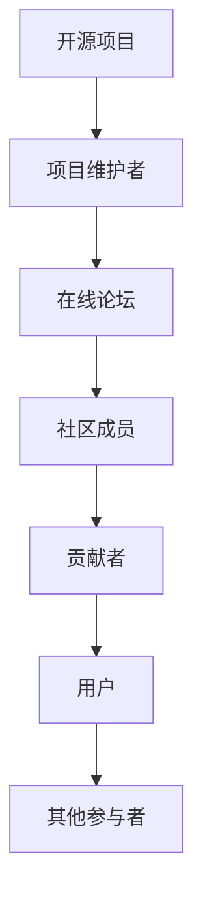
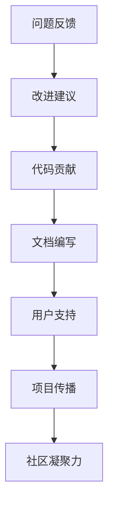
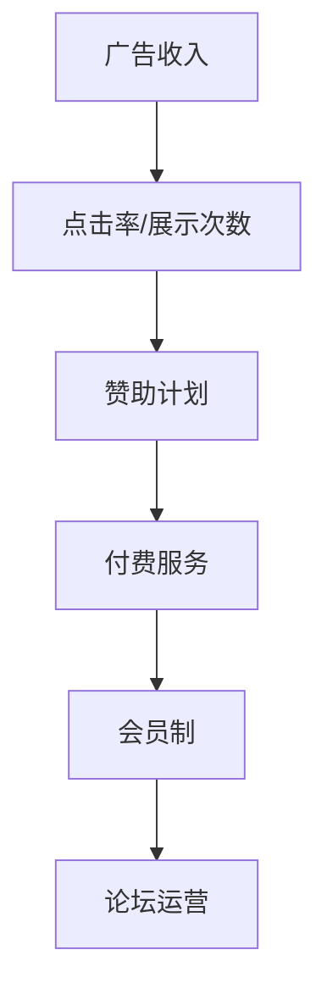

                 

关键词：开源项目、在线论坛、社区参与、盈利模式、开源社区、项目维护、用户互动、代码贡献、协作开发、商业模式。

> 摘要：本文深入探讨了如何创建一个成功的开源项目在线论坛，分析了社区参与的重要性，讨论了不同的盈利模式，并为项目维护者提供了实用的指导。

## 1. 背景介绍

开源项目是软件开发的一种模式，它允许任何人自由地使用、研究、修改和分发软件。这种模式鼓励了全球范围内的开发者和贡献者的协作，形成了庞大的开源社区。在线论坛作为开源项目的重要组成部分，为社区成员提供了一个交流和协作的平台。

然而，创建和维护一个活跃的在线论坛并非易事。首先，论坛需要吸引并保持社区成员的参与。其次，要确保论坛的运营能够持续并盈利，以支持项目的发展。本文将围绕这两个核心问题展开讨论，介绍如何创建一个成功的在线论坛，如何激励社区参与，以及如何实现盈利。

## 2. 核心概念与联系

### 2.1 开源项目与在线论坛的关系

开源项目的成功离不开社区的参与。而在线论坛是社区的核心，它连接了项目维护者、贡献者、用户和其他感兴趣的人。以下是开源项目与在线论坛之间关系的Mermaid流程图：



### 2.2 社区参与的重要性

社区参与对于开源项目至关重要。它不仅帮助项目获得新的功能、修复漏洞，还能提高项目的知名度和影响力。以下是社区参与的重要性Mermaid流程图：



### 2.3 盈利模式

开源项目的在线论坛可以通过多种方式实现盈利，以下是一些常见的盈利模式：

1. **广告收入**：在论坛中展示相关广告，通过点击率或展示次数获取收入。
2. **赞助计划**：鼓励企业或个人为项目提供赞助，以支持项目的持续发展。
3. **付费服务**：提供一些高级功能或服务，如私人社区、个性化支持等，供付费用户使用。
4. **会员制**：建立会员制度，为会员提供额外的福利和服务。

以下是这些盈利模式在论坛中的应用Mermaid流程图：



## 3. 核心算法原理 & 具体操作步骤

### 3.1 算法原理概述

在线论坛的成功依赖于有效的社区管理策略。核心算法原理包括：

- **用户行为分析**：通过分析用户的访问行为和互动数据，了解社区的活跃度和需求。
- **内容推荐**：根据用户行为和社区热点，推荐相关内容和话题。
- **互动激励**：通过奖励机制激励用户参与社区活动，如发表帖子、解决问题等。

### 3.2 算法步骤详解

1. **收集用户数据**：包括用户的登录信息、访问日志、帖子内容等。
2. **分析用户行为**：使用机器学习算法，如聚类分析、关联规则挖掘等，分析用户的行为模式。
3. **内容推荐**：根据用户行为数据，使用推荐算法为用户推荐相关内容。
4. **互动激励**：制定奖励机制，如积分系统、徽章系统等，激励用户参与社区活动。

### 3.3 算法优缺点

**优点**：

- 提高社区活跃度：通过个性化推荐和互动激励，吸引更多用户参与社区活动。
- 提高内容质量：通过用户行为分析和推荐，提高社区内容的实用性和吸引力。

**缺点**：

- 数据隐私问题：收集和分析用户数据可能引发隐私泄露的风险。
- 算法偏见：推荐算法可能存在偏见，导致社区内的某些声音被忽视。

### 3.4 算法应用领域

- 社区管理：用于分析社区成员的行为和需求，优化社区运营。
- 内容推荐：用于为用户提供个性化的内容推荐，提高用户体验。
- 用户互动：用于激励用户参与社区活动，提高社区凝聚力。

## 4. 数学模型和公式 & 详细讲解 & 举例说明

### 4.1 数学模型构建

在线论坛的数学模型主要涉及以下几个方面：

1. **用户活跃度模型**：通过用户的发帖量、回帖量、点赞量等指标来衡量用户活跃度。
2. **内容质量模型**：通过用户评分、评论数量等指标来评估内容质量。
3. **推荐模型**：使用协同过滤、内容推荐等技术来为用户推荐相关内容。

### 4.2 公式推导过程

假设我们有n个用户和m个帖子，用户i对帖子j的评分可以表示为：

\[ r_{ij} = \sum_{k=1}^{m} w_{ik} \cdot p_{kj} \]

其中，\( w_{ik} \) 表示用户i对帖子k的权重，\( p_{kj} \) 表示帖子j的内容特征向量。

### 4.3 案例分析与讲解

假设我们有一个在线论坛，共有100个用户和1000个帖子。我们可以通过以下步骤来构建和优化数学模型：

1. **用户活跃度模型**：收集用户的发帖量、回帖量、点赞量等数据，计算每个用户的活跃度得分。
2. **内容质量模型**：收集用户对帖子的评分和评论数量，计算每个帖子的质量得分。
3. **推荐模型**：使用协同过滤算法，根据用户的活跃度和内容质量为用户推荐帖子。

通过以上模型，我们可以更好地了解社区的状态，优化推荐算法，提高用户满意度。

## 5. 项目实践：代码实例和详细解释说明

### 5.1 开发环境搭建

搭建一个在线论坛项目，我们可以选择使用现有的开源框架，如Django、Flask等。以下是使用Django搭建开发环境的步骤：

1. 安装Django：使用pip安装Django。
2. 创建项目：使用Django命令创建一个新的项目。
3. 创建应用：在项目中创建一个新的应用，用于处理论坛功能。
4. 配置数据库：配置项目使用的数据库，如SQLite、MySQL等。

### 5.2 源代码详细实现

以下是论坛项目的基本代码结构：

```python
# settings.py
INSTALLED_APPS = [
    'django.contrib.admin',
    'django.contrib.auth',
    'django.contrib.contenttypes',
    'django.contrib.sessions',
    'django.contrib.messages',
    'django.contrib.staticfiles',
    'forum',
]

# models.py
from django.db import models

class Post(models.Model):
    title = models.CharField(max_length=100)
    content = models.TextField()
    author = models.ForeignKey('auth.User', on_delete=models.CASCADE)
    created_at = models.DateTimeField(auto_now_add=True)

class Comment(models.Model):
    post = models.ForeignKey(Post, on_delete=models.CASCADE)
    content = models.TextField()
    author = models.ForeignKey('auth.User', on_delete=models.CASCADE)
    created_at = models.DateTimeField(auto_now_add=True)
```

### 5.3 代码解读与分析

以上代码定义了两个模型：`Post` 和 `Comment`。`Post` 表示帖子，包含标题、内容、作者和创建时间等信息。`Comment` 表示评论，包含评论内容、所属帖子、作者和创建时间等信息。

通过定义这些模型，我们可以使用Django提供的ORM（对象关系映射）功能，方便地处理数据库操作，如创建、查询、更新和删除帖子及评论。

### 5.4 运行结果展示

在完成代码实现后，我们可以启动Django服务器，通过浏览器访问论坛页面，查看帖子列表和评论功能是否正常运行。

## 6. 实际应用场景

### 6.1 在线论坛在开源项目中的应用

在线论坛在开源项目中发挥着重要作用，为开发者提供了一个交流和协作的平台。通过在线论坛，开发者可以：

- **分享经验**：开发者可以在论坛中分享他们的经验和技巧，帮助其他人解决问题。
- **寻求帮助**：开发者可以在论坛中发布问题，寻求其他开发者的帮助。
- **协作开发**：开发者可以在论坛中讨论项目的开发计划，协作完成项目。

### 6.2 开源论坛的运营和管理

开源论坛的运营和管理是保障论坛长期健康发展的关键。以下是一些运营和管理策略：

- **用户权限管理**：根据用户的角色和权限，限制用户的操作，如帖子发表、评论、编辑等。
- **内容审核**：定期审核论坛内容，删除违规帖子，确保论坛环境的健康。
- **社区活动**：举办在线讲座、技术沙龙等活动，增强社区凝聚力。

### 6.3 未来应用展望

随着人工智能和大数据技术的发展，开源论坛的未来将更加智能化和个性化。以下是一些展望：

- **个性化推荐**：利用机器学习算法，为用户提供个性化的内容推荐。
- **智能问答**：利用自然语言处理技术，实现智能问答功能，提高问题解决效率。
- **社区智能分析**：通过数据分析，了解社区发展趋势，为论坛运营提供决策支持。

## 7. 工具和资源推荐

### 7.1 学习资源推荐

- 《Django官方文档》：提供详细的Django教程和参考手册。
- 《Flask Web开发》：一本关于Flask框架的入门书籍，适合初学者。
- 《精通Python Web开发》：涵盖Python在Web开发中的多种应用，包括Django和Flask。

### 7.2 开发工具推荐

- PyCharm：一款强大的Python IDE，支持Django和Flask开发。
- Git：版本控制工具，用于代码管理和协作开发。
- Jupyter Notebook：适用于数据分析和原型开发，支持多种编程语言。

### 7.3 相关论文推荐

- 《大规模社区系统的设计与实现》：探讨社区系统的设计与实现方法。
- 《社区智能系统的构建与应用》：介绍社区智能系统的构建与应用场景。

## 8. 总结：未来发展趋势与挑战

### 8.1 研究成果总结

本文研究了开源项目在线论坛的创建、社区参与和盈利模式。通过核心算法原理的探讨，提供了论坛运营的实用策略。项目实践部分展示了如何使用Django搭建在线论坛，并分析了实际应用场景。

### 8.2 未来发展趋势

随着技术的发展，开源论坛将更加智能化、个性化。人工智能和大数据技术的应用将提高社区管理和内容推荐的效率，增强用户体验。

### 8.3 面临的挑战

开源论坛面临的主要挑战包括数据隐私保护、算法偏见和社区管理。同时，如何在盈利和社区利益之间找到平衡也是一个重要问题。

### 8.4 研究展望

未来的研究可以重点关注以下几个方面：

- 开源论坛的智能化和个性化：研究如何利用人工智能技术提升论坛的服务质量和用户体验。
- 社区治理策略：探索更加有效的社区治理方法，保障社区的健康和可持续发展。
- 盈利模式创新：研究新的盈利模式，实现开源论坛的可持续发展。

## 9. 附录：常见问题与解答

### Q：如何确保在线论坛的数据安全？

A：确保在线论坛的数据安全需要采取以下措施：

- 使用安全的数据库：选择支持加密的数据库，如MySQL。
- 数据加密：对用户敏感信息进行加密处理，如密码。
- 访问控制：设置严格的访问控制策略，限制对数据库的访问。
- 定期备份：定期备份数据库，防止数据丢失。

### Q：如何鼓励社区成员参与论坛？

A：以下方法可以帮助鼓励社区成员参与论坛：

- 提供奖励机制：为积极参与论坛的成员提供奖励，如积分、徽章等。
- 举办活动：定期举办线上或线下活动，增强社区凝聚力。
- 引导用户参与：通过教程、指南等形式，帮助用户了解如何在论坛中贡献内容。

### Q：如何平衡论坛的盈利和社区利益？

A：平衡论坛的盈利和社区利益需要采取以下策略：

- 透明运营：公开论坛的运营数据和财务状况，增加信任。
- 用户反馈：积极收集用户反馈，了解他们的需求和期望。
- 公益性质：确保论坛的公益性质，不以盈利为目的，而是为社区提供价值。

通过以上策略，可以在保证论坛盈利的同时，维护社区的利益和活力。

## 作者署名

作者：禅与计算机程序设计艺术 / Zen and the Art of Computer Programming

以上，就是本文的完整内容。希望本文能够为开源项目在线论坛的创建和维护提供有益的参考。在开源社区中，让我们共同努力，创造一个更加美好、更加活跃的交流平台。
----------------------------------------------------------------

以上便是《创建开源项目的在线论坛：社区参与和盈利模式》的全文。希望这篇文章能够为读者在开源项目社区建设和运营方面提供有价值的见解和指导。在开源社区中，每一个成员的参与和贡献都是宝贵的，让我们共同营造一个和谐、积极、充满活力的社区环境。作者：禅与计算机程序设计艺术 / Zen and the Art of Computer Programming

